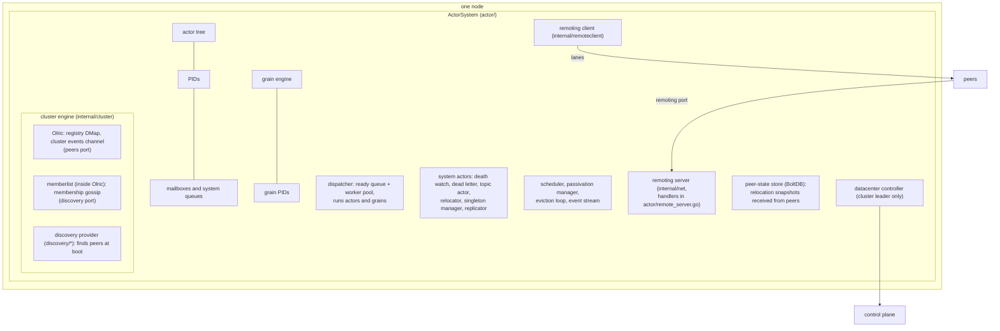
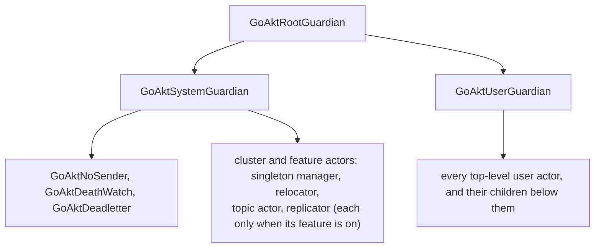
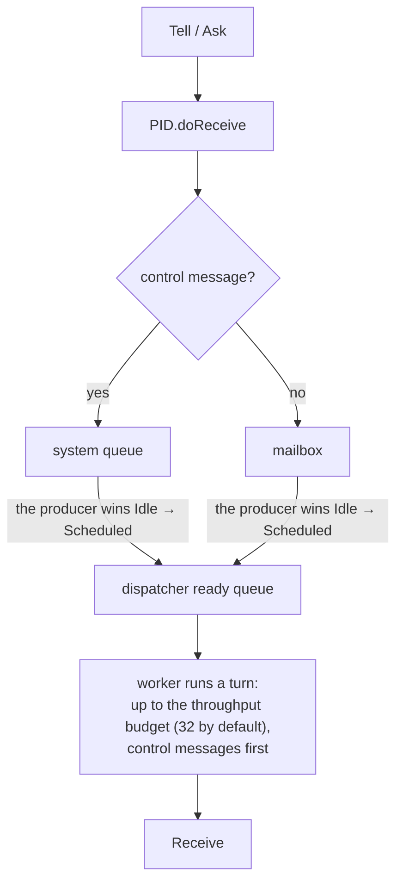
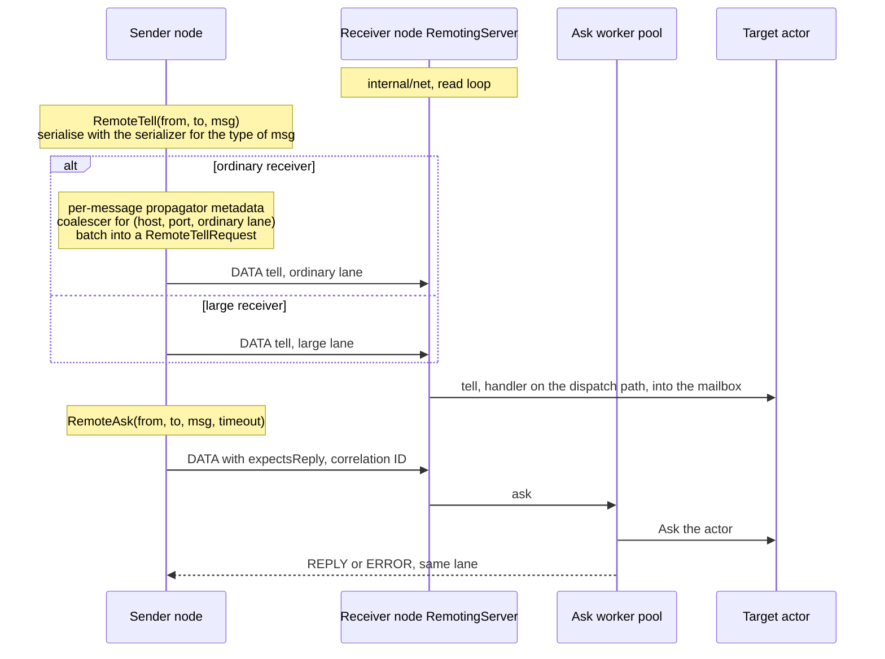

# GoAkt Architecture

## Contents

- [About this document](#about-this-document)
- [Bird's eye view](#birds-eye-view)
  - [What GoAkt is](#what-goakt-is)
  - [Three deployment shapes](#three-deployment-shapes)
  - [Core concepts](#core-concepts)
  - [The pieces of one node](#the-pieces-of-one-node)
  - [The actor tree](#the-actor-tree)
- [Code map](#code-map)
  - [Public packages](#public-packages)
  - [Internal packages](#internal-packages)
  - [Everything else](#everything-else)
- [Key data flows](#key-data-flows)
  - [Local tell and ask](#local-tell-and-ask)
  - [Remote tell and ask](#remote-tell-and-ask)
  - [Spawning](#spawning)
  - [Grain activation](#grain-activation)
  - [Cluster membership and node departure](#cluster-membership-and-node-departure)
  - [CRDT replication](#crdt-replication)
  - [Streams](#streams)
- [Design decisions](#design-decisions)
  - [Why `any` and pluggable serializers](#why-any-and-pluggable-serializers)
  - [Why a fixed dispatcher pool](#why-a-fixed-dispatcher-pool)
  - [Why a custom TCP protocol instead of gRPC](#why-a-custom-tcp-protocol-instead-of-grpc)
  - [Why Olric for cluster state](#why-olric-for-cluster-state)
  - [Why a tree of actors](#why-a-tree-of-actors)
  - [Actor versus grain](#actor-versus-grain)
- [Concurrency model and thread safety](#concurrency-model-and-thread-safety)
  - [One worker per actor at a time](#one-worker-per-actor-at-a-time)
  - [Message ordering](#message-ordering)
  - [Goroutines](#goroutines)
  - [State shared between goroutines](#state-shared-between-goroutines)
  - [Reentrancy](#reentrancy)
- [Startup and shutdown](#startup-and-shutdown)
  - [Start](#start)
  - [Stop](#stop)
- [Cluster consistency model](#cluster-consistency-model)
  - [The registry](#the-registry)
  - [Single activation of a grain](#single-activation-of-a-grain)
  - [Network partitions](#network-partitions)
  - [Relocation and the handoff window](#relocation-and-the-handoff-window)
  - [CRDT state](#crdt-state)
  - [Multi-datacenter](#multi-datacenter)
- [Extension points](#extension-points)
- [Testing strategy](#testing-strategy)
- [Glossary](#glossary)

## About this document

This is the overview a maintainer reads before the chapters in [`chapters/`](chapters). It names the main pieces of GoAkt, shows how they hand work to each other, and records why they are built the way they are. Where a chapter covers a topic in depth, this document gives a few sentences and points to it ("[Chapter 7, §7.5](chapters/chap-07.md#75-the-ready-queue)").

Code is referred to by name and file, as in the chapters: `PID.tryPassivation` in `actor/pid.go`.

## Bird's eye view

### What GoAkt is

GoAkt is a Go library (module `github.com/tochemey/goakt/v4`) that implements the actor model. An actor is a value with three methods, `PreStart`, `Receive` and `PostStop` (`Actor` in `actor/actor.go`). It keeps private state, and the only way to reach it is to send a message to its PID.

An actor does not own a goroutine. The actor system owns a fixed pool of worker goroutines, the dispatcher, and lends a worker to an actor for one turn whenever the actor has messages waiting ([Chapter 7](chapters/chap-07.md)).

A message is any Go value: the API takes `any`. A local send passes the value itself and serialises nothing. A message is serialised only when it crosses the network, by a serializer chosen for its type. The `remote` package ships a protobuf serializer (the default for `proto.Message`), a CBOR serializer and a JSON serializer, and `remote.WithSerializers` registers a serializer for a concrete type or for every type that implements an interface (`remote/option.go`).

[Chapter 1, "The model"](chapters/chap-01.md#the-model), says the same in more detail.

### Three deployment shapes

| Shape | What runs | Chapters |
|---|---|---|
| **Standalone** | One process, no network. Actors and grains talk in-process. | 1 to 14 |
| **Clustered** | Nodes find each other through a discovery provider (Consul, DNS-SD, etcd, Kubernetes, mDNS, NATS, self-managed, static) and share a registry of actors and grains, so a name resolves to whichever node holds it. Clustering needs remoting (`actorSystem.setupCluster` in `actor/actor_system.go`). | 15 to 21 |
| **Multi-datacenter** | Several clusters, each with its own discovery, linked through a control plane (NATS JetStream or etcd) that holds one leased record per datacenter. Spawning (`SpawnOn` with `WithDataCenter`), name lookup (`SendAsync`, `SendSync`), grain messaging and CRDT replication can cross datacenters. | 22; 24, [§24.9](chapters/chap-24.md#249-cluster-integration-and-multi-datacenter) |

Remoting can also be enabled without a cluster: PIDs can then point at actors on other nodes, but there is no shared registry.

### Core concepts

| Concept | What it is | Chapter |
|---|---|---|
| **Actor** | A value implementing `PreStart`, `Receive` and `PostStop`. Handles one message at a time. | 1 |
| **ActorSystem** | The runtime that hosts actors and wires every subsystem together. One interface, one implementation, `actorSystem` in `actor/actor_system.go`. | 3 |
| **PID** | The handle to an actor, local or on another node (`PID.IsRemote`). Every send goes through one. | 4 |
| **Address** | `goakt://<system>@<host>:<port>/<qualified name>` plus an incarnation ID. The qualified name is the key of the cluster registry. | 4, [§4.5](chapters/chap-04.md#45-names-addresses-and-identity) |
| **Mailbox** | The per-actor queue of user messages. Control messages go to a separate system queue. | 6; 7, [§7.4](chapters/chap-07.md#74-the-system-queue) |
| **Dispatcher** | The fixed pool of workers that runs actors and grains one turn at a time. | 7 |
| **Supervisor** | The failure policy an actor is spawned with. The failing actor's own supervisor picks the directive; its parent carries it out. | 9 |
| **Passivation** | Stopping an idle actor according to its strategy. The default is two minutes of idleness. | 10 |
| **Grain** | A virtual actor addressed by identity, activated on first message and deactivated when idle. | 13 to 14 |
| **Registry** | The cluster-wide map from actor qualified names and grain identities to the node that holds them, stored in Olric. | 20, [§20.4](chapters/chap-20.md#204-the-registry) |
| **CRDT, Replicator** | Conflict-free replicated data types (`crdt`), held and merged by one Replicator actor per node. Eventually consistent, and separate from the registry. | 24 |
| **Stream** | A `Source`, optional `Flow` stages and a `Sink`, materialised by `RunnableGraph.Run` on an actor system. Every stage is an actor; demand flows upstream. | 25 |

### The pieces of one node

The three ports are the fields of `discovery.Node` (`discovery/node.go`; [Chapter 19, §19.1](chapters/chap-19.md#191-three-ports-and-a-nodes-identity)). Olric runs in-process, and its memberlist configuration is built by the cluster engine (`internal/cluster/cluster.go`; [Chapter 19, §19.5](chapters/chap-19.md#195-memberlist-configuration-and-network-profiles)). When TLS is configured, memberlist uses the TCP transport in `internal/memberlist` instead of its own ([Chapter 19, §19.6](chapters/chap-19.md#196-the-tls-transport)). Cluster events reach the actor system through `cluster.Events()`, which `actorSystem.clusterEventsLoop` drains ([Chapter 1, "Dependency layers"](chapters/chap-01.md#dependency-layers)).

### The actor tree

The names come from `reservedNames` in `actor/reserved.go`; any name starting with `GoAkt` is reserved. The qualified name in an address starts at the top-level actor: the guardians are not part of it (`Address.buildQualifiedName` in `internal/address/address.go`). [Chapter 3, §3.4](chapters/chap-03.md#34-the-guardian-tree) describes the tree, each system actor's supervisor, and how the tree is stored.

## Code map

The repository is organised by package. `actor` holds almost half of the hand-written source and is the only package that ties the others together ([Chapter 1, "The repository"](chapters/chap-01.md#the-repository) and "Dependency layers", which also shows the import graph). This section gives each package's role; the chapters list the files.

### Public packages

| Package | Role | Chapter |
|---|---|---|
| `actor` | The hub: actor system, PID, mailboxes, dispatcher, supervision, passivation, scheduler, routers, grains, remoting handlers, cluster glue, relocation, reliable delivery, the CRDT Replicator. | 3 to 14, 17, 20 to 24 |
| `remote` | Public remoting configuration (`Config`, options, compression, protocol pin), the `Serializer` interface and the protobuf, CBOR and JSON serializers, the context propagator, and the types the remoting API takes and returns: `SpawnRequest`, `SpawnChildRequest`, `GrainRequest`, `ActorState`, `Peer` and the reliable-delivery spec of a spawn request. | 17 |
| `client` | A client for programs outside any actor system. `Client` offers `Tell`, `Ask`, `Spawn`, `SpawnBalanced`, `ReSpawn`, `Stop`, `Exists`, `Reinstate`, `Kinds`, `TellGrain` and `AskGrain`, and picks a node with a `Balancer`: round robin, random or least load. | 18 |
| `discovery`, `discovery/*` | The `Provider` interface and eight providers. | 19 |
| `datacenter`, `datacenter/controlplane/*` | Datacenter metadata and records, configuration, the `ControlPlane` interface, and control planes on NATS JetStream and etcd. | 22 |
| `crdt` | CRDT types, keys, `Config` and the Replicator's messages. Imports nothing else from the module. | 24 |
| `stream` | Reactive streams built on actors. | 25 |
| `supervisor`, `passivation`, `reentrancy` | Configuration values the actor package accepts. | 9, 10, 8 |
| `eventstream` | In-process publish/subscribe, used for system events. | 11, [§11.3](chapters/chap-11.md#113-the-event-stream) |
| `extension` | The `Extension` and `Dependency` interfaces. | 12 |
| `log` | The logging interface, with zap (the default), slog and discard implementations. | 12, [§12.5](chapters/chap-12.md#125-logging) |
| `errors` | Sentinel errors and error types used across the module. | none |
| `hash` | The `Hasher` that maps registry keys to cluster partitions; xxh3 by default (`ClusterConfig.WithPartitionHasher` in `actor/cluster_config.go`). | 20, [§20.7](chapters/chap-20.md#207-partition-hashing) |
| `tls` | `Info`, the TLS configuration for remoting and the cluster. | 18 |
| `breaker` | A circuit breaker, used by the `PipeTo` family: `PipeTo` and `PipeToName` on a PID or a `ReceiveContext`, and the grain context's `PipeToGrain`, `PipeToSelf` and `PipeToActor` (`WithCircuitBreaker` in `actor/pipe_option.go`). | 26 |
| `memory` | Total and free memory of the host, and the bytes in use on the process's Go heap (`Used`). Read only for the actor system's `Metric`; placement does not use them. | 26 |
| `testkit` | Helpers for actor and cluster tests (see [Testing strategy](#testing-strategy)). | 26 |

### Internal packages

| Package | Role |
|---|---|
| `internal/net` | The wire transport: frames, duplex sessions and lanes, handshake, chunking, reference tables, credits, compression, the legacy protocol, the remoting server ([Chapter 15](chapters/chap-15.md)). |
| `internal/remoteclient` | The outbound remoting client: peers, lane routing, the protocol cache, the tell pump, the tell coalescer, serializer dispatch (Chapters [15](chapters/chap-15.md) and [16](chapters/chap-16.md)). |
| `internal/cluster` | The cluster engine: Olric, memberlist configuration, the discovery adapter, the registry, the peer-state store (`Store`: the actor system always uses the BoltDB implementation; the in-memory one serves tests), cluster events ([Chapter 20](chapters/chap-20.md); the discovery adapter and memberlist in [Chapter 19](chapters/chap-19.md)). |
| `internal/address` | The `Address` type ([Chapter 4, §4.5](chapters/chap-04.md#45-names-addresses-and-identity)). |
| `internal/internalpb` | Code generated from `protos/internal/*.proto`. |
| `internal/commands` | Internal messages that are not protobuf: `Panicking`, dead-letter commands, reentrancy envelopes, reliable-delivery commands, and their serializers. |
| `internal/codec` | Converts spawn options, supervisors and similar values to and from protobuf; datacenter records (`EncodeDataCenterRecord`, `DecodeDataCenterRecord`); CRDT keys ([Chapter 17, §17.10](chapters/chap-17.md#1710-internalcodec)). |
| `internal/ddata` | CRDT value encoding and the BoltDB snapshot store ([Chapter 24](chapters/chap-24.md)). |
| `internal/datacentercontroller` | The datacenter controller: registers the local record, heartbeats it and caches the active records ([Chapter 22, §22.7](chapters/chap-22.md#227-the-datacenter-controller)-[§22.8](chapters/chap-22.md#228-the-cache-of-active-datacenters)). |
| `internal/refusal` | Marks the error with which a node refused a grain message before any handler ran it, so the sender knows the message did not run ([Chapter 13, §13.7](chapters/chap-13.md#137-when-the-recorded-owner-is-gone)). |
| `internal/metric` | OpenTelemetry instruments ([Chapter 12, §12.4](chapters/chap-12.md#124-opentelemetry-instruments)). |
| `internal/chain` | Runs a sequence of steps fail-fast or run-all; used by start and stop ([Chapter 3](chapters/chap-03.md)). |
| `internal/future`, `internal/pendingasks`, `internal/retry` | Futures for `PipeTo` and grains; the table of callers waiting for an asynchronous reply; retry with exponential backoff. |
| `internal/chunk`, `internal/queue`, `internal/quorum`, `internal/xsync` | Splitting a slice into batches (relocation); the queue behind event-stream subscribers; classifying Olric quorum errors; concurrent maps, lists and a TTL map. |
| Small helpers | `duration`, `id`, `locker` (`NoCopy`), `memberlist` (TLS transport, [Chapter 19, §19.6](chapters/chap-19.md#196-the-tls-transport)), `pause`, `pointer`, `size`, `slices`, `strconvx`, `ticker`, `timer`, `tlstest` (test fixtures), `types`, `validation`. |

### Everything else

`protos/` holds the protobuf sources, `mocks/` the generated mocks, `playground/` standalone programs, `benchmark/` benchmarks, `test/data/` TLS certificates and generated test protobufs, `docs/` the user documentation, and `book/` this book. [Chapter 1, "What else is in the repository"](chapters/chap-01.md#what-else-is-in-the-repository), and [Chapter 2, "Generated code"](chapters/chap-02.md#generated-code), describe them.

## Key data flows

### Local tell and ask

`Tell` and `Ask` take a pooled `ReceiveContext` and hand it to `PID.doReceive`, which refuses ordinary messages while the system stops and otherwise routes control messages to the system queue and the rest to the mailbox ([Chapter 1, "How a message reaches `Receive`"](chapters/chap-01.md#how-a-message-reaches-receive)). The producer that moves the actor from idle to scheduled pushes it onto the ready queue ([Chapter 7, §7.2](chapters/chap-07.md#72-the-dispatch-state), [§7.5](chapters/chap-07.md#75-the-ready-queue)). A worker runs one turn and then yields ([Chapter 7, §7.3](chapters/chap-07.md#73-one-turn)). An `Ask` carries its deadline, a turn skips an `Ask` whose sender has stopped waiting, and the reply goes back through `ctx.Response` ([Chapter 5, §5.2](chapters/chap-05.md#52-what-a-message-carries)-[§5.3](chapters/chap-05.md#53-how-a-reply-gets-back)). A failure in `Receive` leaves the turn and goes to supervision ([Chapter 7, §7.6](chapters/chap-07.md#76-failures-leave-the-turn); [Chapter 9](chapters/chap-09.md)).

### Remote tell and ask

`Tell` and `Ask` on a remote PID call `RemoteTell` and `RemoteAsk` on the remoting client (`actor/api.go`; [Chapter 16, §16.12](chapters/chap-16.md#1612-callers-in-the-actor-package)). [Chapter 16](chapters/chap-16.md) covers the client, [Chapter 17](chapters/chap-17.md) the server, and [Chapter 15](chapters/chap-15.md) the transport underneath.

**Tell.** `client.RemoteTell` (`internal/remoteclient/client.go`) serialises the message with the serializer for its type. For an ordinary receiver it copies the context propagator's headers into the message's own metadata and submits it to the coalescer for the destination and the receiver's ordinary lane: a message to an idle destination leaves at once, and messages that arrive while a flush is in flight form the next batch, sent as one `RemoteTellRequest` ([Chapter 16, §16.7](chapters/chap-16.md#167-sending-a-tell)-[§16.8](chapters/chap-16.md#168-the-coalescer)). A receiver that matches `LargeMessageDestinations` skips the coalescer and takes the large lane. A tell that fails after the client accepted it does not reach the caller: the tell-failure handler, `actorSystem.enqueueCoalescedFailure` (`actor/remote_server.go`), turns it into a dead letter, or drops it with a log when its queue is full or the system is stopping. On the receiver, `actorSystem.remoteTellHandler` (`actor/remote_server.go`) delivers each message of a batch on its own, so one bad message never fails its siblings, and each message carries its share of the frame's flow-control credit into the mailbox ([Chapter 17, §17.5](chapters/chap-17.md#175-tell-and-ask); [Chapter 15, §15.8](chapters/chap-15.md#158-flow-control)).

**Ask.** `RemoteAsk` sends a `DATA` frame that expects a reply, with a correlation ID and the deadline as remaining time. The server hands it to its ask worker pool, which asks the local actor within that deadline and replies on the same lane ([Chapter 16, §16.9](chapters/chap-16.md#169-sending-an-ask-and-a-control-request); [Chapter 17, §17.5](chapters/chap-17.md#175-tell-and-ask)).

**Control requests** (spawn, lookup, watch, stop, grain calls, relocation batches, peer-state snapshots) travel on the control lane, so they never wait behind user traffic; a relocation batch, peer-state snapshot or state request larger than the chunk size moves to the large lane ([Chapter 16, §16.6](chapters/chap-16.md#166-routing-which-lane-a-call-takes)).

### Spawning

`ActorSystem.Spawn` (`actor/spawn.go`) checks that the system runs and the options are valid, then serialises concurrent spawns of one name in a `singleflight.Group`. In cluster mode it asks the registry whether the name is taken. It then checks the local tree, builds the PID with `newPID`, which runs `PreStart` with retries, attaches the PID under the user guardian with the death watch watching it, in cluster mode writes the registry record synchronously, and only then schedules the turn that delivers `PostStart`, before returning. `PostStart` is the actor's first message and, except for the attach window described in [Chapter 4, §4.3](chapters/chap-04.md#poststart-is-always-the-first-message), means the actor is fully started, registry record included ([Chapter 4, §4.2](chapters/chap-04.md#42-the-local-spawn-path-step-by-step)-[§4.4](chapters/chap-04.md#44-prestart-retries-and-the-timeout-that-is-not-one)).

`SpawnOn` lets the cluster place an actor: it reads the members, the calling node included, picks one with a placement strategy (`SpawnPlacement` in `actor/spawn_option.go`) and sends it a `RemoteSpawn` control request, even when the pick is the calling node. With `Local` placement, outside a cluster or with no member, it calls `Spawn` instead ([Chapter 21, §21.1](chapters/chap-21.md#211-placement-with-spawnon)). The target instantiates the actor from its registered kind (`reflection.instantiateActor`, called by `actorSystem.remoteSpawnHandler` in `actor/remote_server.go`) and runs its own spawn ([Chapter 17, §17.6](chapters/chap-17.md#176-actor-lifecycle-and-query-handlers)). `SpawnSingleton` places a cluster singleton on the coordinator, or with a role on the oldest member advertising it (`actorSystem.SpawnSingleton` in `actor/spawn.go`; [Chapter 21, §21.4](chapters/chap-21.md#214-cluster-singletons)).

### Grain activation

A grain implements `OnActivate`, `OnReceive` and `OnDeactivate` (`Grain` in `actor/grain.go`) and is addressed by a `GrainIdentity`, its kind and name. It runs on the same dispatcher as actors and is deactivated after two idle minutes unless its options say otherwise ([Chapter 13, §13.1](chapters/chap-13.md#131-the-model), [§13.8](chapters/chap-13.md#138-deactivation); [Chapter 14, §14.3](chapters/chap-14.md#143-scheduling-and-the-turn)). In cluster mode the essential flow is:

1. **Find it.** `TellGrain` and `AskGrain` (`actor/grain_engine.go`) deliver to a grain active on this node. Otherwise they read its registry record and forward the message to the recorded owner, or deliver here when the record names this node. With no record, they send the message to every endpoint of every active datacenter, the local one included, and activate the grain on this node when none accepts it ([Chapter 13, §13.4](chapters/chap-13.md#134-finding-a-grain)).
2. **Activate once per identity.** Concurrent callers on one node share one attempt (`runGrainActivation`). A node claims a grain that has no record with an atomic put-if-absent (`PutGrainIfAbsent`); on the send path, a node that loses the claim to another node forwards the message there ([Chapter 13, §13.5](chapters/chap-13.md#135-activating-on-this-node)-[§13.6](chapters/chap-13.md#136-one-activation-per-identity)).
3. **Publish before becoming reachable.** After `OnActivate`, the registry record is written synchronously, and only then does the grain enter the local grains map, so no local send reaches it before the record exists (`finalizeGrainActivation`; [Chapter 13, §13.5](chapters/chap-13.md#135-activating-on-this-node)).
4. **Replace a gone owner.** A record is released when its owner refused the request before running it (remoting off, or a shutdown refusal carrying the node-refusal mark), or when a transport failure meets an owner that has left the membership. The message is sent again on this node only when it certainly did not run ([Chapter 13, §13.7](chapters/chap-13.md#137-when-the-recorded-owner-is-gone)).

Outside a cluster the grain is found or activated on this node. `GrainOf` activates without sending, on this node or on a peer chosen by the activation strategy and role ([Chapter 13, §13.4](chapters/chap-13.md#134-finding-a-grain)). [Chapter 14](chapters/chap-14.md) covers the grain process: its mailbox, its turn, `GrainContext`, timers and late messages.

### Cluster membership and node departure

Olric emits membership changes on its cluster events channel. The cluster engine holds each join or departure until a converged routing table reflects it, at most `WithConvergenceTimeout` (ten seconds by default), then delivers `NodeJoined` or `NodeLeft`; it detects a change of coordinator itself and delivers `LeaderChanged` ([Chapter 20, §20.9](chapters/chap-20.md#209-cluster-events)). `actorSystem.handleClusterEvent` (`actor/actor_system.go`) publishes each event on the event stream and acts on joins and departures ([Chapter 20, §20.10](chapters/chap-20.md#2010-the-actor-system-on-the-engine)):

- **On `NodeJoined`**, every node refreshes its cache from peers address to remoting port, closes the handoff window of a node that rejoined at the same address, tries to open the grain activation barrier and triggers datacenter reconciliation. It does not rewrite the registry: Olric migrates partition data to the joining node.
- **On `NodeLeft`**, every node closes its remoting peer for the departed node, prunes the remote watches pointing at it, re-puts its own actors and grains when the departures may have lost registry partitions (`resyncAfterClusterEvent`), and triggers datacenter reconciliation. With relocation enabled (the default) it then opens the handoff window, and the leader relocates the departed node's actors and grains while every other node deletes its copy of that node's peer state ([Chapter 21, §21.6](chapters/chap-21.md#216-what-every-node-does-on-nodeleft)).

**Relocation, on the leader.** After a graceful leave, the leader takes the relocation set from the peer-state snapshot the departed node sent to its oldest peers before leaving, read from the leader's own local store ([Chapter 21, §21.8](chapters/chap-21.md#218-graceful-leave-the-peer-state-snapshot)). After a crash there is no snapshot: the leader waits for Olric's partition repair to go quiet, skips a node that is a member again, derives the set by scanning the registry for the node's host and remoting port, and releases the registry claims of its non-relocatable actors ([Chapter 21, §21.7](chapters/chap-21.md#217-crash-deriving-the-relocation-set-from-the-registry)). Either way one job runs per departed address. The relocator system actor starts a worker that sends singletons to the leader, which re-establishes them through the singleton spawn path, and every other actor to the least-loaded survivor with the actor's role; it recreates the leader's share locally and sends each peer its share in `RelocateBatch` requests of at most 500 items ([Chapter 21, §21.9](chapters/chap-21.md#219-the-relocator-and-its-workers)-[§21.10](chapters/chap-21.md#2110-inside-one-relocation)). A lazy grain, the default, only has its registry entry released and is activated again on its next message; an eager grain is reactivated at once ([Chapter 21, §21.11](chapters/chap-21.md#2111-grain-relocation)). A relocated actor is a new incarnation: `PreStart` runs again and nothing in its memory or mailbox survives ([Chapter 21, §21.3](chapters/chap-21.md#213-what-relocates)).

### CRDT replication

Each node with CRDTs enabled (`ClusterConfig.WithCRDT`, and the node's role matching `crdt.WithRole`) runs one Replicator actor, `GoAktReplicator`, which owns the local store ([Chapter 24, §24.3](chapters/chap-24.md#243-the-replicator)). A local `Update` applies at once and the Replicator publishes the delta through the topic actor on `goakt.crdt.deltas`, which delivers it to every peer's Replicator ([§24.4](chapters/chap-24.md#244-replication-through-the-topic-actor)). On every anti-entropy tick a node sends its digest to one random peer and pulls back the keys whose content hash differs; tombstones in the digest carry deletions ([§24.5](chapters/chap-24.md#245-anti-entropy)). `WriteTo` and `ReadFrom` add direct, best-effort peer calls ([§24.6](chapters/chap-24.md#246-consistency-model)). Across datacenters, every Replicator buffers one pending entry per key, the cluster leader flushes the buffer to each remote datacenter and tracks what each one accepted, and a cross-datacenter anti-entropy round repairs what the flush missed ([§24.9](chapters/chap-24.md#249-cluster-integration-and-multi-datacenter)). See [Chapter 24](chapters/chap-24.md).

### Streams

`RunnableGraph.Run` spawns a coordinator, `stream-supervisor-<id>`, under the user guardian, and one actor per stage as its children; adjacent `Map`, `TryMap` and `Filter` stages are fused into one actor by default ([Chapter 25, §25.5](chapters/chap-25.md#255-materialisation), [§25.7](chapters/chap-25.md#257-stage-fusion)). The sink starts demand; elements flow downstream only against credit, and a stage's mailbox is bounded unless the stage receives from many producers ([§25.4](chapters/chap-25.md#254-the-demand-ledger-and-credit-refill), [§25.10](chapters/chap-25.md#2510-concurrency-model)). The stream ends when the sink stops; the handle's `Done` closes and the coordinator stops itself. `SourceRef` and `SinkRef` carry a stream across nodes through endpoint actors and ordinary remoting ([§25.11](chapters/chap-25.md#2511-stream-refs-across-nodes)). See [Chapter 25](chapters/chap-25.md).

## Design decisions

The reasons below come from code comments and from the maintainers.

### Why `any` and pluggable serializers

- **Local messages cost no serialisation.** In-process actors exchange plain Go values; no `.proto` file is needed ([Chapter 1, "The model"](chapters/chap-01.md#the-model)).
- **Remote messages go through a serializer chosen per type.** Protobuf, CBOR and JSON ship in `remote`; a custom one implements `remote.Serializer` and is registered with `remote.WithSerializers`.
- **The framework's own wire types are protobuf** (`protos/internal`): control requests, registry records, the handshake, CRDT payloads. They have schemas, a compact encoding, and type resolution at run time through `protoregistry.GlobalTypes` (`internal/net/proto_serializer.go`).

The cost: a remote message must have a registered serializer. `RemoteTell` and `RemoteAsk` check this before sending and return `ErrInvalidMessage` when none matches (`client.RemoteTell` in `internal/remoteclient/client.go`).

### Why a fixed dispatcher pool

Actors are scheduled onto a pool of `max(GOMAXPROCS, 2)` workers instead of a goroutine each, as in Akka, Pekko, Erlang and Orleans. The number of goroutines stays near the worker count instead of growing with the number of active actors, and a per-turn budget of 32 messages bounds how long one actor holds a worker. The cost is that a handler that blocks holds its worker for the whole wait. [Chapter 7, §7.1](chapters/chap-07.md#71-the-pieces) gives the measured trade-offs of a larger pool.

### Why a custom TCP protocol instead of gRPC

- **Overhead.** gRPC adds HTTP/2 framing, header compression and stream multiplexing that small, frequent, point-to-point actor messages do not need.
- **Control.** GoAkt owns framing, buffer pools, compression and connection management. The duplex protocol builds on that control: long-lived lanes, correlation, chunking, per-connection reference tables and credit-based flow control ([Chapter 15, §15.2](chapters/chap-15.md#152-why-the-engine-changed) lists the problem each part solves).
- **Dependencies.** No GoAkt package imports gRPC. It appears in `go.mod` only as an indirect dependency of other libraries.

The cost is more code to maintain: framing, connection lifecycle, negotiation and flow control.

### Why Olric for cluster state

- **Embedded.** Olric runs in-process; there is no database to deploy.
- **Quorum and replication.** It offers a replica count, read and write quorums, a member-count quorum, synchronous replication and read repair, all set by the cluster engine (`internal/cluster/cluster.go`).
- **One membership layer.** Olric is built on HashiCorp memberlist, so the cluster has one membership protocol, not two.
- **Atomic claims.** A put with Olric's `NX` option writes only if the key is absent (`internal/cluster/cluster.go`), which the registry uses to arbitrate ownership of a name or a grain identity.
- **Events.** Membership changes come through Olric's cluster events channel and its in-process, Redis-compatible pub/sub; no external Redis is needed.

[Chapter 20](chapters/chap-20.md) describes how the cluster engine uses each of these.

### Why a tree of actors

Every actor has exactly one parent, as in Erlang/OTP and Akka. Teardown has a fixed order, because a parent stops its children before itself, and the path through the tree gives every actor a name that cannot clash with one under another parent ([Chapter 3, §3.4](chapters/chap-03.md#34-the-guardian-tree)). Parenthood is also a death-watch relationship: a parent receives `Terminated` for its children like any watcher ([Chapter 9, §9.8](chapters/chap-09.md#98-death-watch)).

### Actor versus grain

- **Actors** are spawned and stopped explicitly; the caller controls the lifecycle and the placement. They suit long-lived services, stateful workers and infrastructure.
- **Grains** are addressed by identity and activated on first message; the runtime manages activation, deactivation and placement across the cluster. They suit large, mostly idle populations of entities, one per user, session or device.

Both live in one library and share the dispatcher. [Chapter 13, §13.9](chapters/chap-13.md#139-actor-versus-grain) compares the two in the code.

## Concurrency model and thread safety

### One worker per actor at a time

At most one worker runs an actor at any moment, so an actor's own state needs no lock. Each PID has a dispatch state, `Idle`, `Scheduled` or `Processing`, changed only by compare-and-swap or by the party that owns the transition; only `Processing` allows a handler to run ([Chapter 7, §7.2](chapters/chap-07.md#72-the-dispatch-state)). `TestDispatchStateHappyPath` in `actor/dispatch_state_test.go` and `TestRestartNeverRunsTwoTurns` in `actor/pid_test.go` enforce it. Grains follow the same rule ([Chapter 14, §14.3](chapters/chap-14.md#143-scheduling-and-the-turn)).

### Message ordering

Messages from one sender to one actor with a FIFO mailbox are handled in the order they were sent (`TestMessageOrdering` in `actor/pid_test.go`; `TestEmbeddedMailboxFIFOOrder` in `actor/embedded_mailbox_test.go`). The exceptions are documented in their chapters:

- Priority mailboxes order by priority, and the fair mailbox keeps order per sender only ([Chapter 6, §6.3](chapters/chap-06.md#63-choosing-a-mailbox)).
- Control messages such as `PoisonPill` and `Terminated` overtake queued user messages ([Chapter 7, §7.4](chapters/chap-07.md#74-the-system-queue)).
- Stashed messages are handled when they are unstashed ([Chapter 8, §8.4](chapters/chap-08.md#84-the-stash)).
- Across nodes, order holds per sender-receiver pair on the lane that pair uses; control traffic may overtake user messages ([Chapter 15, §15.3](chapters/chap-15.md#153-architecture)).

### Goroutines

No actor or grain has a goroutine of its own. The long-lived goroutines are the dispatcher workers, one supervision consumer, one passivation manager, the eviction loop when an eviction strategy is set, the scheduler's own, the cluster events loop in cluster mode ([Chapter 7, §7.1](chapters/chap-07.md#71-the-pieces)), and the remoting client's tell-failure drain ([Chapter 16, §16.7](chapters/chap-16.md#167-sending-a-tell)). Some work does start goroutines: request timeouts ([Chapter 8, §8.5](chapters/chap-08.md#85-reentrancy-requests-that-do-not-block)), `PipeTo` tasks ([Chapter 5, §5.7](chapters/chap-05.md#57-pipeto)), supervised restarts ([Chapter 9, §9.4](chapters/chap-09.md#94-restart-budget-backoff-and-retries)), and on the transport, one reader and one writer per duplex connection ([Chapter 15, §15.3](chapters/chap-15.md#153-architecture)).

### State shared between goroutines

- **PID.** The lifecycle flags are one atomic bitmask; the dispatch state is a separate atomic word. `fieldsLocker` guards the fields that change after construction, and `stopLocker` makes sure `PostStop` runs once. The send path takes neither lock ([Chapter 4, §4.3](chapters/chap-04.md#43-inside-newpid)).
- **Actor system.** Flags and counters are atomics; `locker` guards fields replaced at run time; single structures have their own mutexes ([Chapter 3, §3.1](chapters/chap-03.md#31-one-interface-one-struct)). The actor tree is one read-write mutex over three indexes ([Chapter 3, §3.4](chapters/chap-03.md#34-the-guardian-tree)).
- **Contracts on user code.** An extension is called from many workers at once and must be safe for concurrent use ([Chapter 12, §12.1](chapters/chap-12.md#121-extensions)). So must a serializer (`Serializer` in `remote/serializer.go`). A custom mailbox must accept concurrent `Enqueue` calls ([Chapter 6, §6.9](chapters/chap-06.md#69-writing-your-own-mailbox)). A `ReceiveContext` belongs to one message and is recycled after it ([Chapter 8, §8.1](chapters/chap-08.md#81-one-object-per-message)).

### Reentrancy

With `reentrancy.Off`, the default, `ctx.Request` is refused and an actor handles one message at a time, start to finish. With `AllowAll`, an actor that has sent a request keeps handling every message until the reply arrives, so its state may change in between. With `StashNonReentrant`, user messages are stashed until the last stash-mode request completes. Nothing interrupts a running handler, and one worker runs the actor at a time in every mode; what changes is which messages may run while a request is pending ([Chapter 8](chapters/chap-08.md), [§8.5](chapters/chap-08.md#85-reentrancy-requests-that-do-not-block); grains in [§8.6](chapters/chap-08.md#86-reentrancy-in-grains)).

## Startup and shutdown

### Start

`ActorSystem.Start` (`actor/actor_system.go`) runs in three phases ([Chapter 3, §3.3](chapters/chap-03.md#33-start)):

1. **Before the chain.** Create the scheduler and start the dispatcher's workers, replacing a dispatcher that a previous stop closed.
2. **The startup chain**, fail-fast: set up the remoting client and the cluster engine; spawn the root guardian, system guardian, NoSender, user guardian, death watch and dead letter; then, by feature, the singleton manager, relocator and topic actor; start the remote server; join the cluster; then the datacenter controller and leader-watch steps, which return at once because the system is not yet marked running ([Chapter 22, §22.9](chapters/chap-22.md#229-the-actor-systems-side)).
3. **After the chain.** Start the scheduler, spawn the Replicator, start the passivation manager and the eviction loop, mark the system started, record the start time, register metrics.

The order encodes dependencies: every PID needs the remoting client, every system actor spawned in the chain exists before the server accepts requests (the Replicator is spawned after the chain, once the node has joined), and the server listens before the node joins the cluster. A failure inside the chain calls `startupCleanup`, after which `Start` can be called again ([Chapter 3, §3.7](chapters/chap-03.md#37-starting-again)).

### Stop

`ActorSystem.Stop` is `shutdown` ([Chapter 3, §3.5](chapters/chap-03.md#35-stop)). It marks the system as shutting down, so no new user message enters a mailbox; stops the eviction loop, passivation manager and scheduler; runs the coordinated shutdown hooks ([§3.6](chapters/chap-03.md#36-coordinated-shutdown-hooks)); stops the datacenter components; builds the peer-state snapshot for relocation; stops the user guardian with every user actor, then the singleton manager, relocator, dead letter and death watch; sends each grain a `PoisonPill` so `OnDeactivate` runs on its own turn; stops the remaining system actors; closes the event stream; persists the snapshot to the oldest peers and leaves the cluster; and stops remoting. In a deferred step it unregisters metrics, resets the system, signals the dispatcher to stop without waiting for it, and flushes the logger. The steps after the background loops receive a context bounded by `shutdownTimeout` (default five minutes). The bound is a deadline handed to each step, not a limit enforced around it: a `PostStop` that ignores its context blocks `Stop` without limit. The errors of all steps are combined.

## Cluster consistency model

### The registry

The registry is one Olric map, `goakt.dmap`. Its `actors` and `grains` namespaces map actor qualified names and grain identities to the node that holds them; the same map also holds job keys, schedule-fire claims, actor and grain locks and round-robin counters, with the same partitions and quorums ([Chapter 20, §20.4](chapters/chap-20.md#204-the-registry)). The cluster engine configures it with synchronous replication and read repair (`internal/cluster/cluster.go`). `NewClusterConfig` (`actor/cluster_config.go`) sets a replica count of 2 and write, read and minimum-peers quorums of 1 (`WithReplicaCount`, `WithWriteQuorum`, `WithReadQuorum`, `WithMinimumPeersQuorum`). These defaults deliberately do not satisfy `readQuorum + writeQuorum > replicaCount`. The option comments give the reasons: the registry can be rebuilt, single activation is decided by the atomic put at the partition's owner rather than by overlapping quorums, and quorums of 1 keep registry writes succeeding while a node is down. With a replica count of 1, `setupCluster` warns that recovery after a crash will be partial. [Chapter 20, §20.2](chapters/chap-20.md#202-configuration) and [§20.5](chapters/chap-20.md#205-reads-writes-and-their-consistency) give every setting and what Olric does with one read or write.

### Single activation of a grain

A node claims a grain that has no record with `PutGrainIfAbsent`, a put with Olric's `NX` option, so the first claim wins; every release deletes the record only while it still names the expected node ([Chapter 13, §13.6](chapters/chap-13.md#136-one-activation-per-identity); [Chapter 20, §20.6](chapters/chap-20.md#206-claims-fences-and-scans)). The opt-in activation barrier, `ClusterConfig.WithGrainActivationBarrier(timeout)`, delays activations until `minimumPeersQuorum` members are visible, for clusters that receive grain traffic before membership is stable. It is checked when the cluster starts and on every `NodeJoined`, and an activation that waits past the timeout fails with `ErrGrainActivationBarrierTimeout` ([Chapter 13, §13.6](chapters/chap-13.md#136-one-activation-per-identity)).

### Network partitions

GoAkt has no split-brain resolver: no code picks a side or stops a minority, and each side takes the oldest member of its own view as leader. Olric refuses a command a node receives over the network while that node sees fewer members than `minimumPeersQuorum`, but the operations a node serves locally skip that check, so a minority node still reads and writes keys whose primary partition it owns; a read or write that cannot reach its replica quorum fails. With the defaults (two replicas, every quorum 1), both sides keep reading and writing their own view of the registry once each routes on a table computed for its own members. When the partition heals, the returning nodes arrive as `NodeJoined`, Olric moves partition data to them, and read repair settles divergent copies by last write wins. [Chapter 20, §20.11](chapters/chap-20.md#2011-network-partitions) lists the four places Olric checks the member-count quorum.

### Relocation and the handoff window

A departed node's relocatable actors and grains are recreated on survivors by the leader, as described in [Cluster membership and node departure](#cluster-membership-and-node-departure). Non-relocatable actors, system actors and reliable-delivery controllers are not recreated; a relocatable reliable-delivery endpoint is recreated like any actor ([Chapter 21, §21.3](chapters/chap-21.md#213-what-relocates); [Chapter 23, §23.14](chapters/chap-23.md#2314-cluster-publication-relocation-and-placement)). Under `WithoutRelocation` nothing is recreated, and a crashed node's records stay until a spawn takes the name over (never a singleton's) or the node restarts at the same address ([Chapter 21, §21.6](chapters/chap-21.md#216-what-every-node-does-on-nodeleft), [§21.13](chapters/chap-21.md#2113-restart-in-place)).

While relocation runs, a name can still resolve to the departed node, or briefly to nothing. Every node opens a three-second handoff window for the departed endpoint on `NodeLeft` (`markEndpointRelocating` in `actor/relocation_handoff.go`): `SendSync` waits and re-resolves the name across it, while `SendAsync` fails at once with `ErrRelocationInProgress` ([Chapter 21, §21.12](chapters/chap-21.md#2112-the-handoff-window); [Chapter 5, §5.8](chapters/chap-05.md#58-sending-by-name)).

### CRDT state

CRDT state does not use the registry or its quorums. It is eventually consistent: replicas that have applied the same updates hold the same value, convergence is bounded by delta delivery through the topic actor and, when that fails, by the anti-entropy interval. `WriteTo` and `ReadFrom` narrow the window of staleness without giving quorum intersection ([Chapter 24, §24.6](chapters/chap-24.md#246-consistency-model)).

### Multi-datacenter

Each datacenter is an independent cluster; nothing in the registry is shared between datacenters. A control plane holds one leased, versioned record per datacenter, with its advertised endpoints and a state: registered, active, draining or inactive (`DataCenterRecord` in `datacenter/data_center.go`). The datacenter controller (`Controller` in `internal/datacentercontroller/controller.go`) registers the local record, renews its lease with heartbeats and keeps a cache of the active records, and only the cluster leader holds one ([Chapter 22, §22.7](chapters/chap-22.md#227-the-datacenter-controller)-[§22.8](chapters/chap-22.md#228-the-cache-of-active-datacenters)). In the actor system, the first controller is created by the first `NodeJoined` or `NodeLeft` the leader handles after `Start`, and its heartbeat, refresh and watch loops end almost at once, because their context is cancelled when that reconciliation returns. Followers have no controller, so on them a cross-datacenter `SpawnOn` fails with `ErrDataCenterNotReady` and name lookups and grain messages find nothing in other datacenters ([Chapter 22, §22.9](chapters/chap-22.md#229-the-actor-systems-side)). Cross-datacenter traffic is ordinary remoting to the record endpoints; with a stale cache an operation fails with `ErrDataCenterStaleRecords` or goes on with the stale records, as configured (`Controller.FailOnStaleCache`; [Chapter 22, §22.10](chapters/chap-22.md#2210-cross-datacenter-operations)).

## Extension points

| To add | Implement | Wire in | Notes |
|---|---|---|---|
| A discovery provider | `discovery.Provider`: `ID`, `Initialize`, `Register`, `Deregister`, `DiscoverPeers`, `Close` (`discovery/provider.go`) | `ClusterConfig.WithDiscovery` | The cluster wraps it for Olric (`discoveryProvider` in `internal/cluster/discovery.go`); `internal/cluster` needs no change. The interface comment states the boot contract: once `Register` returns, `DiscoverPeers` on the other nodes must list this node; a provider whose view may be incomplete must return an error, which the cluster retries once a second for ten seconds, rather than a list without any other node ([Chapter 19, §19.2](chapters/chap-19.md#192-the-provider-contract)). |
| A control plane | `datacenter.ControlPlane`: `Register`, `Heartbeat`, `SetState`, `ListActive`, `Watch`, `Deregister` (`datacenter/control_plane.go`) | the datacenter configuration given to `ClusterConfig.WithDataCenter` | Records are leased and versioned. The interface comment asks every method to honour its context and to be safe for concurrent use; the shipped NATS control plane ignores the context in every method except `Watch` ([Chapter 22, §22.4](chapters/chap-22.md#224-the-controlplane-contract)-[§22.5](chapters/chap-22.md#225-the-nats-jetstream-control-plane)). |
| A serializer | `remote.Serializer`: `Serialize(message any) ([]byte, error)`, `Deserialize(data []byte) (any, error)` | `remote.WithSerializers(type, serializer)` | The bytes must describe their own type, and the serializer must be safe for concurrent use (`remote/serializer.go`; [Chapter 17, §17.2](chapters/chap-17.md#172-serializers)). |
| An extension or a dependency | `extension.Extension`, or `extension.Dependency` (also `MarshalBinary` and `UnmarshalBinary`) | `WithExtensions` on the system; `WithDependencies` on a spawn | [Chapter 12, §12.1](chapters/chap-12.md#121-extensions)-[§12.2](chapters/chap-12.md#122-dependencies). |
| A mailbox | `Mailbox`: `Enqueue`, `Dequeue`, `IsEmpty`, `Len`, `Dispose` (`actor/mailbox.go`) | `WithMailbox` | [Chapter 6, §6.9](chapters/chap-06.md#69-writing-your-own-mailbox) lists the six rules a mailbox must keep. |
| A passivation strategy | not by implementing `passivation.Strategy` alone | none | Spawn validation accepts only the three built-in strategies; a new one also needs changes to validation, `withPassivationStrategy` and the passivation manager ([Chapter 10, §10.1](chapters/chap-10.md#101-strategies)). |

## Testing strategy

[Chapter 2](chapters/chap-02.md) covers building and running the suite, [Chapter 27](chapters/chap-27.md) how the repository's tests are organised, and [Chapter 26, §26.11](chapters/chap-26.md#2611-testkit)-[§26.14](chapters/chap-26.md#2614-multi-node-clusters) the testkit.

- **Layout.** Tests sit next to the code, in the package's `_test.go` files; the mocks, fixtures and helpers a package's tests share live in its `mocks_test.go`, `helpers_test.go` or `fixtures_test.go` ([Chapter 27, §27.2](chapters/chap-27.md#272-where-tests-and-fixtures-live)).
- **Testkit.** `testkit.New` returns a `TestKit` around a throwaway standalone actor system, with probes that record what they receive and assert on it; `NewMultiNodes` runs a cluster in-process on an embedded NATS server ([Chapter 26](chapters/chap-26.md)). It is a harness for GoAkt users: no other package's tests import it, and the `actor` tests cannot, since `testkit` imports `actor`; they use their own helpers instead ([Chapter 27, §27.5](chapters/chap-27.md#275-how-tests-build-actor-systems)).
- **Infrastructure.** Tests that need Consul or etcd start containers with testcontainers-go: `discovery/consul`, `discovery/etcd`, `datacenter/controlplane/etcd`, and helpers in `actor/helpers_test.go`. The `discovery/dnssd` and `discovery/mdns` tests use the host's network ([Chapter 27, §27.5](chapters/chap-27.md#275-how-tests-build-actor-systems)).
- **Mocks.** Generated by mockery into `mocks/`: the cluster `Cluster`, the discovery `Provider`, `Extension`, `Dependency`, `Hasher` and the remoting `Client` ([Chapter 27, §27.2](chapters/chap-27.md#272-where-tests-and-fixtures-live)).
- **Waiting.** `require.Eventually` and readiness signals wait for a condition; `pause.For` (`internal/pause/pause.go`) is a plain sleep, and the suite calls it about four times as often as `require.Eventually` ([Chapter 27, §27.4](chapters/chap-27.md#274-libraries-and-helpers)).
- **Before committing**, run `make lint` and `make test` (`AGENTS.md`). CI runs the suite as a matrix of shards, not as one `go test ./...` ([Chapter 2](chapters/chap-02.md); [Chapter 27, §27.3](chapters/chap-27.md#273-which-shard-runs-a-new-test)).

## Glossary

| Term | Definition |
|---|---|
| **Actor** | A value implementing `PreStart`, `Receive` and `PostStop` (`actor/actor.go`). It handles one message at a time and has no goroutine of its own. |
| **ActorSystem** | The runtime that hosts actors. Created with `NewActorSystem`; one implementation, `actorSystem`. |
| **Address** | `goakt://<system>@<host>:<port>/<qualified name>` plus an incarnation ID that tells two lives of one name apart. The qualified name is the registry key. |
| **Cluster singleton** | An actor with one instance in the cluster, placed on the coordinator or, with a role, on the oldest member that advertises it. When its node departs, the leader re-establishes it through the same spawn path ([Chapter 21, §21.4](chapters/chap-21.md#214-cluster-singletons)-[§21.5](chapters/chap-21.md#215-singleton-races-crashes-and-leadership)). |
| **Control plane** | The store of leased, versioned datacenter records used by multi-datacenter deployments; NATS JetStream and etcd implementations ship ([Chapter 22](chapters/chap-22.md)). |
| **Coordinator (leader)** | The oldest member of the cluster. It relocates a departed node's actors, hosts role-less singletons, runs the datacenter controller and flushes CRDT changes to other datacenters ([Chapter 20, §20.8](chapters/chap-20.md#208-peers-members-and-the-leader)). |
| **CRDT** | A conflict-free replicated data type: independent updates on each node merge to one state. Types in `crdt`; held and replicated by the Replicator. |
| **Dead letter** | A record that a message was not delivered or not handled, sent to `GoAktDeadletter` and published on the event stream. A `Tell` to a stopped actor returns `ErrDead` and makes none ([Chapter 5, §5.4](chapters/chap-05.md#54-dead-letters)). |
| **Death watch** | `Watch` and `UnWatch` on a PID: a watcher receives `Terminated` after the watched actor's `PostStop` and after its name is freed. The `GoAktDeathWatch` system actor removes a dead actor's registry record in a cluster; the actor leaves the tree by itself ([Chapter 9, §9.8](chapters/chap-09.md#98-death-watch)). |
| **Dependency** | A per-actor value given at spawn with `WithDependencies`. It is serialisable so it travels with the actor when it is relocated ([Chapter 12, §12.2](chapters/chap-12.md#122-dependencies)). |
| **Directive** | What a supervisor decides for a failure: `StopDirective`, `ResumeDirective`, `RestartDirective` or `EscalateDirective`. Escalation makes the parent send itself a `PanicSignal` with the child as sender; the child stays suspended ([Chapter 9, §9.5](chapters/chap-09.md#95-escalation-and-the-guardians)). |
| **Discovery provider** | The component that tells a node where its peers are at boot (`discovery.Provider`; [Chapter 19](chapters/chap-19.md)). |
| **Dispatcher** | The fixed pool of worker goroutines and the ready queue that run actors and grains ([Chapter 7](chapters/chap-07.md)). |
| **Event stream** | The in-process publish/subscribe bus for system events: actor lifecycle, cluster membership, dead letters, relocation. A subscriber's `Iterator` drains what is buffered at the time of the call ([Chapter 11, §11.3](chapters/chap-11.md#113-the-event-stream)). |
| **Extension** | A system-wide value registered with `WithExtensions` and reached from any context by its ID ([Chapter 12, §12.1](chapters/chap-12.md#121-extensions)). |
| **Grain** | A virtual actor implementing `OnActivate`, `OnReceive` and `OnDeactivate`, addressed by a `GrainIdentity`, activated on first message and deactivated when idle (Chapters [13](chapters/chap-13.md) and [14](chapters/chap-14.md)). |
| **Guardian** | One of the three built-in actors at the top of the tree: `GoAktRootGuardian`, `GoAktSystemGuardian`, `GoAktUserGuardian` ([Chapter 3, §3.4](chapters/chap-03.md#34-the-guardian-tree)). |
| **Handoff window** | The three seconds after a node departs during which `SendSync` retries a name that still resolves to the departed node ([Chapter 21, §21.12](chapters/chap-21.md#2112-the-handoff-window)). |
| **Lane** | One duplex TCP connection to a peer, for control, ordinary or large traffic ([Chapter 15, §15.3](chapters/chap-15.md#153-architecture)). |
| **Mailbox** | The per-actor queue of user messages. The default is the embedded mailbox; nine kinds exist ([Chapter 6](chapters/chap-06.md)). |
| **Passivation** | Stopping an idle actor according to its strategy: time-based (the default, two minutes), message-count or long-lived ([Chapter 10](chapters/chap-10.md)). |
| **PID** | The handle to an actor, local or remote. Every send, watch and stop goes through one ([Chapter 4](chapters/chap-04.md)). |
| **Reentrancy** | Letting an actor handle other messages while it waits for the reply to its own request. Modes: `Off` (requests refused, the default), `AllowAll`, `StashNonReentrant` ([Chapter 8, §8.5](chapters/chap-08.md#85-reentrancy-requests-that-do-not-block)). |
| **Registry** | The `actors` and `grains` namespaces of the Olric map `goakt.dmap`, from actor qualified names and grain identities to the node that holds them. The same map, with the same partitions and quorums, also holds job keys, schedule-fire claims, actor and grain locks and round-robin counters ([Chapter 20, §20.4](chapters/chap-20.md#204-the-registry)). |
| **Relocation** | Recreating a departed node's actors and grains on surviving nodes, driven by the leader's relocator ([Chapter 21](chapters/chap-21.md)). |
| **Replicator** | The system actor `GoAktReplicator` that owns a node's CRDT store (`actor/replicator.go`). `ActorSystem.Replicator()` returns `nil` when CRDTs are off or the node lacks the configured role. |
| **RunnableGraph** | A complete stream pipeline, ready for `Run` on an actor system, which returns a `StreamHandle` ([Chapter 25](chapters/chap-25.md)). |
| **Serializer** | Converts a message to self-describing bytes and back for remoting (`remote.Serializer`; [Chapter 17, §17.2](chapters/chap-17.md#172-serializers)). |
| **Stash** | A side buffer where an actor parks messages to handle later ([Chapter 8, §8.4](chapters/chap-08.md#84-the-stash)). |
| **Supervisor** | The failure policy an actor is spawned with: a strategy (one-for-one or one-for-all), rules from error type to directive, and retry and backoff settings. The failing actor's own supervisor decides; its parent carries the directive out ([Chapter 9](chapters/chap-09.md)). |
| **Turn** | One run of an actor on a worker: up to the throughput budget of messages, control messages first ([Chapter 7, §7.3](chapters/chap-07.md#73-one-turn)). |
