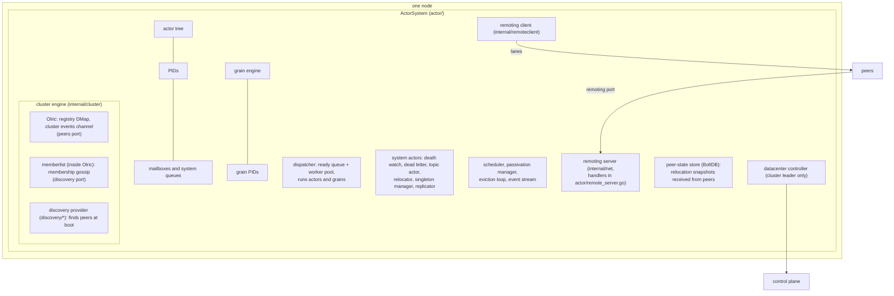
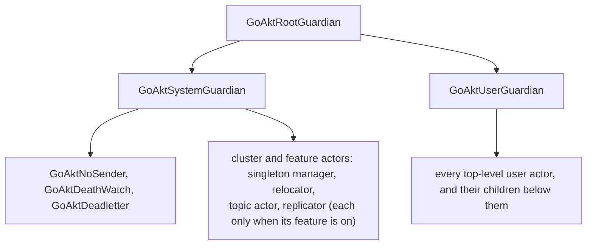
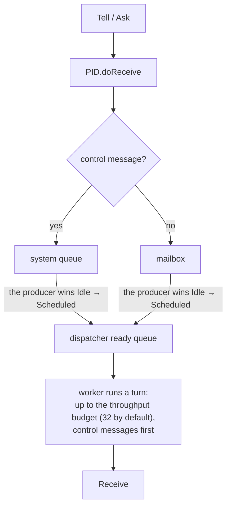
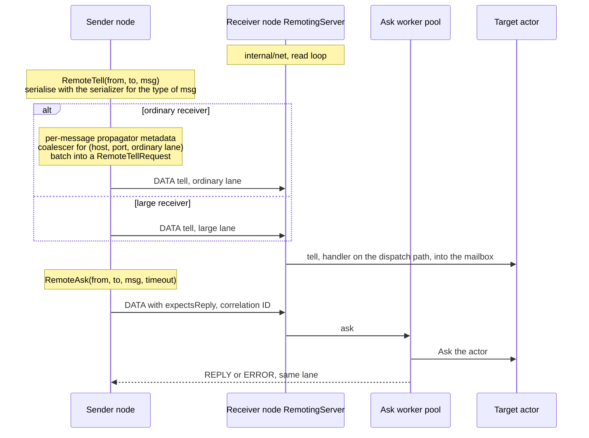
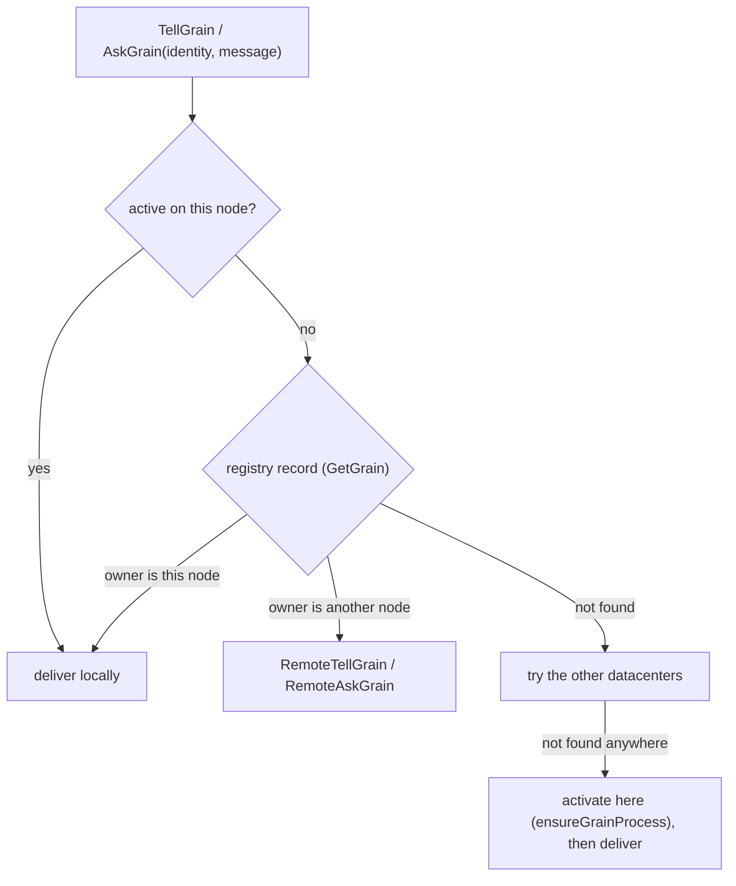
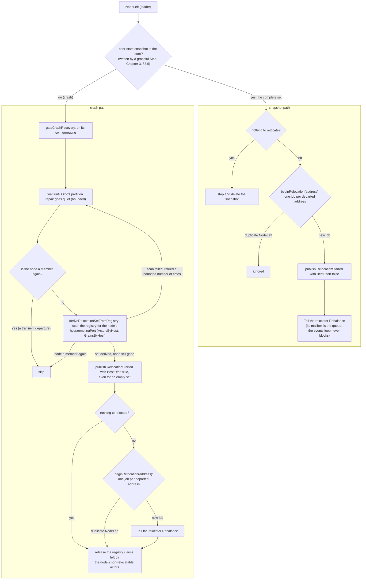
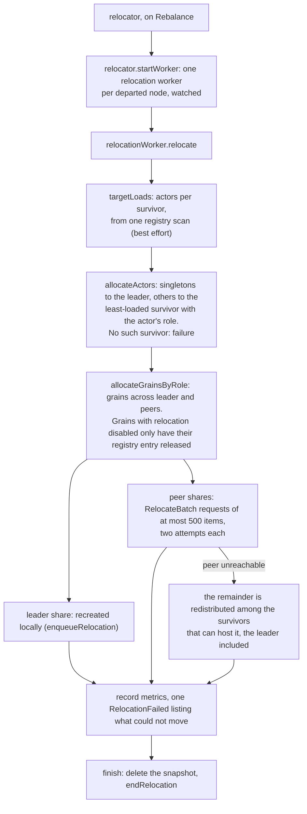

# GoAkt Architecture

Verified against: `cf7a7c6d` and the uncommitted changes of branch `issue-1432` (2026-10-03): every statement checked against the code

## Contents

- [About this document](#about-this-document)
- [Bird's eye view](#birds-eye-view)
  - [What GoAkt is](#what-goakt-is)
  - [Three deployment shapes](#three-deployment-shapes)
  - [Core concepts](#core-concepts)
  - [The pieces of one node](#the-pieces-of-one-node)
  - [The actor tree](#the-actor-tree)
- [Code map](#code-map)
  - [Public packages](#public-packages)
  - [Internal packages](#internal-packages)
  - [Everything else](#everything-else)
- [Key data flows](#key-data-flows)
  - [Local tell and ask](#local-tell-and-ask)
  - [Remote tell and ask](#remote-tell-and-ask)
  - [Spawning](#spawning)
  - [Grain activation](#grain-activation)
  - [Cluster membership and node departure](#cluster-membership-and-node-departure)
  - [CRDT replication](#crdt-replication)
  - [Streams](#streams)
- [Design decisions](#design-decisions)
  - [Why `any` and pluggable serializers](#why-any-and-pluggable-serializers)
  - [Why a fixed dispatcher pool](#why-a-fixed-dispatcher-pool)
  - [Why a custom TCP protocol instead of gRPC](#why-a-custom-tcp-protocol-instead-of-grpc)
  - [Why Olric for cluster state](#why-olric-for-cluster-state)
  - [Why a tree of actors](#why-a-tree-of-actors)
  - [Actor versus grain](#actor-versus-grain)
- [Concurrency model and thread safety](#concurrency-model-and-thread-safety)
  - [One worker per actor at a time](#one-worker-per-actor-at-a-time)
  - [Message ordering](#message-ordering)
  - [Goroutines](#goroutines)
  - [State shared between goroutines](#state-shared-between-goroutines)
  - [Reentrancy](#reentrancy)
- [Startup and shutdown](#startup-and-shutdown)
  - [Start](#start)
  - [Stop](#stop)
- [Cluster consistency model](#cluster-consistency-model)
  - [The registry](#the-registry)
  - [Single activation of a grain](#single-activation-of-a-grain)
  - [Network partitions](#network-partitions)
  - [Relocation and the handoff window](#relocation-and-the-handoff-window)
  - [CRDT state](#crdt-state)
  - [Multi-datacenter](#multi-datacenter)
- [Extension points](#extension-points)
- [Testing strategy](#testing-strategy)
- [Glossary](#glossary)

## About this document

This is the overview a maintainer reads before the chapters in [`chapters/`](chapters). It names the main pieces of GoAkt, shows how they hand work to each other, and records why they are built the way they are. Where a chapter covers a topic in depth, this document gives a few sentences and points to it ("Chapter 7, §7.5"). Where no chapter exists yet, the content is kept here in full and the section says which chapter is planned.

Code is referred to by name and file, as in the chapters: `PID.tryPassivation` in `actor/pid.go`.

## Bird's eye view

### What GoAkt is

GoAkt is a Go library (module `github.com/tochemey/goakt/v4`) that implements the actor model. An actor is a value with three methods, `PreStart`, `Receive` and `PostStop` (`Actor` in `actor/actor.go`). It keeps private state, and the only way to reach it is to send a message to its PID.

An actor does not own a goroutine. The actor system owns a fixed pool of worker goroutines, the dispatcher, and lends a worker to an actor for one turn whenever the actor has messages waiting (Chapter 7).

A message is any Go value: the API takes `any`. A local send passes the value itself and serialises nothing. A message is serialised only when it crosses the network, by a serializer chosen for its type. The `remote` package ships a protobuf serializer (the default for `proto.Message`), a CBOR serializer and a JSON serializer, and `remote.WithSerializers` registers a serializer for a concrete type or for every type that implements an interface (`remote/option.go`).

Chapter 1, "The model", says the same in more detail.

### Three deployment shapes

| Shape | What runs | Chapters |
|---|---|---|
| **Standalone** | One process, no network. Actors and grains talk in-process. | 1–12 |
| **Clustered** | Nodes find each other through a discovery provider (Consul, DNS-SD, etcd, Kubernetes, mDNS, NATS, self-managed, static) and share a registry of actors and grains, so a name resolves to whichever node holds it. Clustering needs remoting (`actorSystem.setupCluster` in `actor/actor_system.go`). | 15; 16–22 planned |
| **Multi-datacenter** | Several clusters, each with its own discovery, linked through a control plane (NATS JetStream or etcd) that holds one leased record per datacenter. Spawning (`SpawnOn` with `WithDataCenter`), name lookup (`SendAsync`, `SendSync`), grain messaging and CRDT replication can cross datacenters. | 24, §24.9; 22 planned |

Remoting can also be enabled without a cluster: PIDs can then point at actors on other nodes, but there is no shared registry.

### Core concepts

| Concept | What it is | Chapter |
|---|---|---|
| **Actor** | A value implementing `PreStart`, `Receive` and `PostStop`. Handles one message at a time. | 1 |
| **ActorSystem** | The runtime that hosts actors and wires every subsystem together. One interface, one implementation, `actorSystem` in `actor/actor_system.go`. | 3 |
| **PID** | The handle to an actor, local or on another node (`PID.IsRemote`). Every send goes through one. | 4 |
| **Address** | `goakt://<system>@<host>:<port>/<qualified name>` plus an incarnation ID. The qualified name is the key of the cluster registry. | 4, §4.5 |
| **Mailbox** | The per-actor queue of user messages. Control messages go to a separate system queue. | 6; 7, §7.4 |
| **Dispatcher** | The fixed pool of workers that runs actors and grains one turn at a time. | 7 |
| **Supervisor** | The failure policy an actor is spawned with. The failing actor's own supervisor picks the directive; its parent carries it out. | 9 |
| **Passivation** | Stopping an idle actor according to its strategy. The default is two minutes of idleness. | 10 |
| **Grain** | A virtual actor addressed by identity, activated on first message and deactivated when idle. | 13 planned |
| **Registry** | The cluster-wide map from actor qualified names and grain identities to the node that holds them, stored in Olric. | 19–20 planned |
| **CRDT, Replicator** | Conflict-free replicated data types (`crdt`), held and merged by one Replicator actor per node. Eventually consistent, and separate from the registry. | 24 |
| **Stream** | A `Source`, optional `Flow` stages and a `Sink`, materialised by `RunnableGraph.Run` on an actor system. Every stage is an actor; demand flows upstream. | 25 |

### The pieces of one node

The three ports are the fields of `discovery.Node` (`discovery/node.go`). Olric runs in-process, and its memberlist configuration is built by the cluster engine (`internal/cluster/cluster.go`). When TLS is configured, memberlist uses the TCP transport in `internal/memberlist` instead of its own. Cluster events reach the actor system through `cluster.Events()`, which `actorSystem.clusterEventsLoop` drains (Chapter 1, "Dependency layers").

### The actor tree

The names come from `reservedNames` in `actor/reserved.go`; any name starting with `GoAkt` is reserved. The qualified name in an address starts at the top-level actor: the guardians are not part of it (`Address.buildQualifiedName` in `internal/address/address.go`). Chapter 3, §3.4 describes the tree, each system actor's supervisor, and how the tree is stored.

## Code map

The repository is organised by package. `actor` holds almost half of the hand-written source and is the only package that ties the others together (Chapter 1, "The repository" and "Dependency layers", which also shows the import graph). This section gives each package's role; the chapters list the files.

### Public packages

| Package | Role | Chapter |
|---|---|---|
| `actor` | The hub: actor system, PID, mailboxes, dispatcher, supervision, passivation, scheduler, routers, grains, remoting handlers, cluster glue, relocation, reliable delivery, the CRDT Replicator. | 3–12, 15, 23, 24 |
| `remote` | Public remoting configuration (`Config`, options, compression, protocol pin), the `Serializer` interface and the protobuf, CBOR and JSON serializers, the context propagator. | 15; 16 planned |
| `client` | A client for programs outside any actor system. `Client` offers `Tell`, `Ask`, `Spawn`, `SpawnBalanced`, `ReSpawn`, `Stop`, `Exists`, `Reinstate`, `Kinds`, `TellGrain` and `AskGrain`, and picks a node with a `Balancer`: round robin, random or least load. | 18 planned |
| `discovery`, `discovery/*` | The `Provider` interface and eight providers. | 19 planned |
| `datacenter`, `datacenter/controlplane/*` | Datacenter metadata and records, configuration, the `ControlPlane` interface, and control planes on NATS JetStream and etcd. | 22 planned |
| `crdt` | CRDT types, keys, `Config` and the Replicator's messages. Imports nothing else from the module. | 24 |
| `stream` | Reactive streams built on actors. | 25 |
| `supervisor`, `passivation`, `reentrancy` | Configuration values the actor package accepts. | 9, 10, 8 |
| `eventstream` | In-process publish/subscribe, used for system events. | 11, §11.3 |
| `extension` | The `Extension` and `Dependency` interfaces. | 12 |
| `log` | The logging interface, with zap (the default), slog and discard implementations. | 12, §12.5 |
| `errors` | Sentinel errors and error types used across the module. | — |
| `hash` | The `Hasher` that maps registry keys to cluster partitions; xxh3 by default (`ClusterConfig.WithPartitionHasher` in `actor/cluster_config.go`). | 19 planned |
| `tls` | `Info`, the TLS configuration for remoting and the cluster. | 18 planned |
| `breaker` | A circuit breaker, used by `PipeTo` (`WithCircuitBreaker` in `actor/pipe_option.go`). | 26 planned |
| `memory` | Total, free and used memory of the host, read for node metrics. | 26 planned |
| `testkit` | Helpers for actor and cluster tests (see [Testing strategy](#testing-strategy)). | 26 planned |

### Internal packages

| Package | Role |
|---|---|
| `internal/net` | The wire transport: frames, duplex sessions and lanes, handshake, chunking, reference tables, credits, compression, the legacy protocol, the remoting server (Chapter 15). |
| `internal/remoteclient` | The outbound remoting client: peers, lane routing, the protocol cache, the tell pump, the tell coalescer, serializer dispatch (Chapter 15; 16 planned). |
| `internal/cluster` | The cluster engine: Olric, memberlist configuration, the discovery adapter, the registry, the peer-state store (`Store`, with BoltDB and in-memory implementations), cluster events. |
| `internal/address` | The `Address` type (Chapter 4, §4.5). |
| `internal/internalpb` | Code generated from `protos/internal/*.proto`. |
| `internal/commands` | Internal messages that are not protobuf: `Panicking`, dead-letter commands, reentrancy envelopes, reliable-delivery commands, and their serializers. |
| `internal/codec` | Converts spawn options, supervisors and similar values to and from protobuf; CRDT keys. |
| `internal/ddata` | CRDT value encoding and the BoltDB snapshot store (Chapter 24). |
| `internal/datacentercontroller` | The datacenter controller: registers the local record, heartbeats it and caches the active records. |
| `internal/metric` | OpenTelemetry instruments (Chapter 12, §12.4). |
| `internal/chain` | Runs a sequence of steps fail-fast or run-all; used by start and stop (Chapter 3). |
| `internal/future`, `internal/pendingasks`, `internal/retry` | Futures for `PipeTo` and grains; the table of callers waiting for an asynchronous reply; retry with exponential backoff. |
| `internal/chunk`, `internal/queue`, `internal/quorum`, `internal/xsync` | Splitting a slice into batches (relocation); the queue behind event-stream subscribers; classifying Olric quorum errors; concurrent maps, lists and a TTL map. |
| Small helpers | `duration`, `id`, `locker` (`NoCopy`), `memberlist` (TLS transport), `pause`, `pointer`, `size`, `slices`, `strconvx`, `ticker`, `timer`, `tlstest` (test fixtures), `types`, `validation`. |

### Everything else

`protos/` holds the protobuf sources, `mocks/` the generated mocks, `playground/` standalone programs, `benchmark/` benchmarks, `test/data/` TLS certificates and generated test protobufs, `docs/` the user documentation, and `book/` this book. Chapter 1, "What else is in the repository", and Chapter 2, "Generated code", describe them.

## Key data flows

### Local tell and ask

`Tell` and `Ask` take a pooled `ReceiveContext` and hand it to `PID.doReceive`, which refuses ordinary messages while the system stops and otherwise routes control messages to the system queue and the rest to the mailbox (Chapter 1, "How a message reaches `Receive`"). The producer that moves the actor from idle to scheduled pushes it onto the ready queue (Chapter 7, §7.2, §7.5). A worker runs one turn and then yields (Chapter 7, §7.3). An `Ask` carries its deadline, a turn skips an `Ask` whose sender has stopped waiting, and the reply goes back through `ctx.Response` (Chapter 5, §5.2–§5.3). A failure in `Receive` leaves the turn and goes to supervision (Chapter 7, §7.6; Chapter 9).

### Remote tell and ask

*The remote client and server chapters (16–17) are planned. Chapter 15 covers the transport underneath.*

`Tell` and `Ask` on a remote PID call `RemoteTell` and `RemoteAsk` on the remoting client (`actor/api.go`).

**Tell.** `client.RemoteTell` (`internal/remoteclient/client.go`) serialises the message, copies the context propagator's headers into the message's own metadata, and submits it to the coalescer for the destination and the receiver's ordinary lane. The coalescer is always on: `setupRemoting` passes `WithSendCoalescing(remoteSendCoalescingMaxBatch)` (256, `actor/defaults.go`) and it is not exposed on `remote.Config`. Its rationale, from the `coalescer` comment in `internal/remoteclient/coalescer.go`:

- **No artificial delay.** A writer goroutine, spawned on demand, sends what is buffered as soon as it wakes. There is no timer.
- **Batching only while busy.** Messages that arrive while a flush is in flight go into the next batch, so the batch size follows the flush rate.
- **Bounded, not dropping.** A full coalescer blocks the caller until room frees up. If the caller's context ends first, `RemoteTell` returns `ErrRemoteSendBackpressure`.
- **Per-message context.** Each message carries its own propagated headers, so traces stay correct when callers share a batch.
- **Order per receiver.** One writer per coalescer at a time keeps messages to one receiver in submission order.

A batch is flushed as one `RemoteTellRequest` on the duplex lane, or on the legacy protocol for a legacy peer, and split if it exceeds the negotiated message limit (Chapter 15, §15.5). A receiver that matches `LargeMessageDestinations` bypasses the coalescer and goes to the large lane through `sendTell` (`internal/remoteclient/send.go`). On that path a tell with no live lane is queued on the lane's tell pump, which dials and sends (Chapter 15, §15.10).

A tell that fails after it was accepted (dial, encode, write) does not reach the caller. The client calls the tell-failure handler, `actorSystem.enqueueCoalescedFailure` (`actor/remote_server.go`), which turns each message into a dead letter. A caller that needs confirmation uses `RemoteAsk`.

On the receiver, `actorSystem.remoteTellHandler` (`actor/remote_server.go`) delivers each message of the batch on its own: it decodes the payload, restores the message's propagated context, and enqueues into the target's mailbox. A message whose metadata is bad or whose target is not found becomes a dead letter, and one whose payload cannot be decoded or whose receiver cannot be parsed is logged and dropped; in both cases its siblings are still delivered. The message carries its share of the frame's flow-control credit into the mailbox, and the credit returns to the sender when the actor dequeues it (Chapter 15, §15.8).

**Ask.** `RemoteAsk` sends a `DATA` frame that expects a reply, with a correlation ID and the deadline as remaining time. The server hands it to its ask worker pool, where `actorSystem.duplexRemoteAsk` asks the local actor within that deadline and encodes the reply. The client matches the `REPLY` or `ERROR` by correlation, and decodes an `ERROR` to the same Go error as the legacy protocol (Chapter 15, §15.5).

**Control requests** (spawn, lookup, watch, stop, relocation batches, peer-state snapshots) travel on the control lane, so they never wait behind user traffic. A relocation batch or snapshot larger than the chunk size moves to the large lane (Chapter 15, §15.3).

### Spawning

`ActorSystem.Spawn` (`actor/spawn.go`) checks that the system runs and the options are valid, then serialises concurrent spawns of one name in a `singleflight.Group`. In cluster mode it asks the registry whether the name is taken. It then checks the local tree, builds the PID with `newPID`, which runs `PreStart` with retries, attaches the PID under the user guardian with the death watch watching it, and in cluster mode writes the registry record synchronously before returning. `PostStart` is the actor's first message (Chapter 4, §4.2–§4.4).

`SpawnOn` places an actor on another node: it picks a node with a placement strategy (`SpawnPlacement` in `actor/spawn_option.go`) and sends a `RemoteSpawn` control request. The target instantiates the actor from its registered kind (`reflection.instantiateActor`, called by `actorSystem.remoteSpawnHandler` in `actor/remote_server.go`) and runs its own spawn. `SpawnSingleton` places a cluster singleton on the coordinator, or with a role on the oldest member advertising it (`actorSystem.SpawnSingleton` in `actor/spawn.go`).

### Grain activation

*The grain chapters (13–14) are planned.*

A grain implements `OnActivate`, `OnReceive` and `OnDeactivate` (`Grain` in `actor/grain.go`) and is addressed by a `GrainIdentity` (kind and name). Grains run on the same dispatcher as actors (Chapter 7, §7.1). An idle grain is deactivated after `DefaultPassivationTimeout` (two minutes) unless `WithGrainDeactivateAfter` or `WithLongLivedGrain` says otherwise (`newGrainConfig` in `actor/grain_option.go`).

**Sending to a grain.** `TellGrain` and `AskGrain` (`actor/grain_engine.go`) work as follows in cluster mode (`remoteTellGrain`, `remoteAskGrain`):

Outside a cluster, the grain is delivered to locally and activated if needed (`localSendGrain`). By default `TellGrain` waits until the grain acknowledges the message; `WithOneWay` returns once it is enqueued (`TellGrain` in `actor/grain_engine.go`).

**Activating here.** `ensureGrainProcess` (`actor/grain_engine.go`):

1. A grain already active locally is used at once, without any coordination.
2. Otherwise the activation runs once per identity: concurrent callers share one attempt (`runGrainActivation`, a `singleflight.Group`).
3. `admitGrainActivation` refuses with `ErrSystemShuttingDown` while the node stops, and otherwise waits for the activation barrier, if one is configured.
4. The grain is instantiated from its registered kind. If the registry names another node as owner, the message is forwarded there (`grainOwnerMismatchError`, handled in `localSendGrain`).
5. With no owner, the node claims the identity atomically with `PutGrainIfAbsent` (`claimGrainOwnership`).
6. `OnActivate` runs.
7. `finalizeGrainActivation` writes the registry record synchronously, and only then puts the grain into the local grains map, so no local send reaches it before the record exists. If publishing fails, the grain is deactivated and the claim released; a node that is stopping publishes nothing.

**Activating by identity.** `GrainIdentity` (`activateGrain` in `actor/grain_engine.go`) activates without sending. An existing remote owner is asked to activate it (`sendRemoteActivateGrain`). With no owner, an activation peer is chosen by `WithActivationStrategy` and `WithActivationRole`; for another node, the caller claims the identity on that node's behalf and sends it the activation request (`tryPeerActivation`).

**A dead owner.** When the recorded owner answers that it is shutting down, or that its remoting is off, its record is released at once. When it cannot be reached, the record is released only after the cluster membership confirms that the owner has left (`releaseUnreachableGrainOwner` in `actor/grain_engine.go`).

### Cluster membership and node departure

*The clustering chapters (19–22) are planned.*

**Membership.** Olric emits membership changes on its cluster events channel, which the cluster engine subscribes to through Olric's in-process pub/sub (`cluster.createSubscription` in `internal/cluster/cluster.go`). The engine holds a confirmed join or leave until the cluster state has converged on it, at most `WithConvergenceTimeout` (default ten seconds, `actor/cluster_config.go`), and then delivers `NodeJoined` or `NodeLeft`. It detects a change of coordinator itself and delivers `LeaderChanged` (`cluster.detectLeaderChangeLocked` in `internal/cluster/cluster.go`; the event type is in `internal/cluster/event.go`). `actorSystem.handleClusterEvent` (`actor/actor_system.go`) publishes each one on the event stream and acts on joins and departures.

**On `NodeJoined`**, every node refreshes its cache of peers address to remoting port (`cachePeerRemotingPorts`), closes the handoff window of a node that rejoined at the same address (`markEndpointRecovered`), tries to open the grain activation barrier, and triggers datacenter reconciliation. It does not rewrite the registry: Olric migrates partition data to the joining node, and re-putting every local record on each join would cost a write per actor in the cluster (comment in `handleNodeJoinedEvent`).

**On `NodeLeft`**, every node (`handleNodeLeftEvent` in `actor/actor_system.go`):

1. Closes its remoting peer for the departed node and prunes the remote watches pointing at it.
2. **Repairs the registry if needed** (`resyncAfterClusterEvent`). Each node re-puts its own live actors and grains, but only when the replica count is 1, or when `replicaCount` nodes have departed within the correlated-departure window. Otherwise Olric promotes the backups itself. The window is two minutes, or twice the cluster state sync interval if that is longer (`correlatedDepartureWindow`, widened in `NewActorSystem`). Its comment explains the bias: too long costs only redundant, idempotent re-puts; too short can lose registry entries of actors that are alive on survivors.
3. Triggers datacenter reconciliation.
4. With relocation enabled (the default), opens the **handoff window** for the departed node's remoting endpoint (`markEndpointRelocating`, see [Relocation and the handoff window](#relocation-and-the-handoff-window)). Then the **leader** relocates the departed node's actors and grains, and every other node deletes its copy of the departed node's peer state.

**Relocation, on the leader.**

Each target dispatches on the grain's own flag: an eager grain (`WithGrainEagerRelocation`) is reactivated at once; a lazy grain, the default, only has its stale registry entry released and is activated again on its next message (`enqueueRelocation` in `actor/relocation_worker.go`). A singleton is re-established through the singleton spawn path, which applies its placement (`recreateSingletonFromWire`). Failures are counted per item and never cancel the rest. The relocator stops a worker that panics instead of restarting it, and its `Terminated` handler then aborts the job. Every actor and every eager grain is reported as failed; lazy and relocation-disabled grains only have their registry entries released, and are reported only when that release fails (`relocator.handleTerminated` and `relocator.abortRelocation` in `actor/relocator.go`, `actorSystem.reportAbortedRelocation` in `actor/actor_system.go`). Relocation batches are capped at 500 items to stay well below the frame limit, and each attempt is bounded by 30 seconds so a peer that stops answering cannot stall the rebalance (`defaultRelocationBatchSize`, `relocationBatchSendTimeout` in `actor/relocation_worker.go`).

### CRDT replication

Each node with CRDTs enabled (`ClusterConfig.WithCRDT`, and the node's role matching `crdt.WithRole`) runs one Replicator actor, `GoAktReplicator`, which owns the local store (Chapter 24, §24.3). A local `Update` applies at once and the Replicator publishes the delta through the topic actor on `goakt.crdt.deltas`, which delivers it to every peer's Replicator (§24.4). On every anti-entropy tick a node sends its digest to one random peer and pulls back the keys whose content hash differs; tombstones in the digest carry deletions (§24.5). `WriteTo` and `ReadFrom` add direct, best-effort peer calls (§24.6). Across datacenters, every Replicator buffers one pending entry per key, the cluster leader flushes the buffer to each remote datacenter and tracks what each one accepted, and a cross-datacenter anti-entropy round repairs what the flush missed (§24.9). See [Chapter 24](chapters/chap-24.md).

### Streams

`RunnableGraph.Run` spawns a coordinator, `stream-supervisor-<id>`, under the user guardian, and one actor per stage as its children; adjacent `Map`, `TryMap` and `Filter` stages are fused into one actor by default (Chapter 25, §25.5, §25.7). The sink starts demand; elements flow downstream only against credit, and a stage's mailbox is bounded unless the stage receives from many producers (§25.4, §25.10). The stream ends when the sink stops; the handle's `Done` closes and the coordinator stops itself. `SourceRef` and `SinkRef` carry a stream across nodes through endpoint actors and ordinary remoting (§25.11). See [Chapter 25](chapters/chap-25.md).

## Design decisions

The reasons below come from code comments and from the maintainers.

### Why `any` and pluggable serializers

- **Local messages cost no serialisation.** In-process actors exchange plain Go values; no `.proto` file is needed (Chapter 1, "The model").
- **Remote messages go through a serializer chosen per type.** Protobuf, CBOR and JSON ship in `remote`; a custom one implements `remote.Serializer` and is registered with `remote.WithSerializers`.
- **The framework's own wire types are protobuf** (`protos/internal`): control requests, registry records, the handshake, CRDT payloads. They have schemas, a compact encoding, and type resolution at run time through `protoregistry.GlobalTypes` (`internal/net/proto_serializer.go`).

The cost: a remote message must have a registered serializer. `RemoteTell` and `RemoteAsk` check this before sending and return `ErrInvalidMessage` when none matches (`client.RemoteTell` in `internal/remoteclient/client.go`).

### Why a fixed dispatcher pool

Actors are scheduled onto a pool of `max(GOMAXPROCS, 2)` workers instead of a goroutine each, as in Akka, Pekko, Erlang and Orleans. The number of goroutines stays near the worker count instead of growing with the number of active actors, and a per-turn budget of 32 messages bounds how long one actor holds a worker. The cost is that a handler that blocks holds its worker for the whole wait. Chapter 7, §7.1 gives the measured trade-offs of a larger pool.

### Why a custom TCP protocol instead of gRPC

- **Overhead.** gRPC adds HTTP/2 framing, header compression and stream multiplexing that small, frequent, point-to-point actor messages do not need.
- **Control.** GoAkt owns framing, buffer pools, compression and connection management. The duplex protocol builds on that control: long-lived lanes, correlation, chunking, per-connection reference tables and credit-based flow control (Chapter 15, §15.2 lists the problem each part solves).
- **Dependencies.** No GoAkt package imports gRPC. It appears in `go.mod` only as an indirect dependency of other libraries.

The cost is more code to maintain: framing, connection lifecycle, negotiation and flow control.

### Why Olric for cluster state

- **Embedded.** Olric runs in-process; there is no database to deploy.
- **Quorum and replication.** It offers a replica count, read and write quorums, a member-count quorum, synchronous replication and read repair, all set by the cluster engine (`internal/cluster/cluster.go`).
- **One membership layer.** Olric is built on HashiCorp memberlist, so the cluster has one membership protocol, not two.
- **Atomic claims.** A put with Olric's `NX` option writes only if the key is absent (`internal/cluster/cluster.go`), which the registry uses to arbitrate ownership of a name or a grain identity.
- **Events.** Membership changes come through Olric's cluster events channel and its in-process, Redis-compatible pub/sub; no external Redis is needed.

### Why a tree of actors

Every actor has exactly one parent, as in Erlang/OTP and Akka. Teardown has a fixed order, because a parent stops its children before itself, and the path through the tree gives every actor a name that cannot clash with one under another parent (Chapter 3, §3.4). Parenthood is also a death-watch relationship: a parent receives `Terminated` for its children like any watcher (Chapter 9, §9.8).

### Actor versus grain

- **Actors** are spawned and stopped explicitly; the caller controls the lifecycle and the placement. They suit long-lived services, stateful workers and infrastructure.
- **Grains** are addressed by identity and activated on first message; the runtime manages activation, deactivation and placement across the cluster. They suit large, mostly idle populations of entities, one per user, session or device.

Both live in one library and share the dispatcher.

## Concurrency model and thread safety

### One worker per actor at a time

At most one worker runs an actor at any moment, so an actor's own state needs no lock. Each PID has a dispatch state, `Idle`, `Scheduled` or `Processing`, changed only by compare-and-swap or by the party that owns the transition; only `Processing` allows a handler to run (Chapter 7, §7.2). `TestDispatchStateHappyPath` in `actor/dispatch_state_test.go` and `TestRestartNeverRunsTwoTurns` in `actor/pid_test.go` enforce it. Grains follow the same rule.

### Message ordering

Messages from one sender to one actor with a FIFO mailbox are handled in the order they were sent (`TestMessageOrdering` in `actor/pid_test.go`; `TestEmbeddedMailboxFIFOOrder` in `actor/embedded_mailbox_test.go`). The exceptions are documented in their chapters:

- Priority mailboxes order by priority, and the fair mailbox keeps order per sender only (Chapter 6, §6.3).
- Control messages such as `PoisonPill` and `Terminated` overtake queued user messages (Chapter 7, §7.4).
- Stashed messages are handled when they are unstashed (Chapter 8, §8.4).
- Across nodes, order holds per sender–receiver pair on the lane that pair uses; control traffic may overtake user messages (Chapter 15, §15.3).

### Goroutines

No actor or grain has a goroutine of its own. The long-lived goroutines are the dispatcher workers, one supervision consumer, one passivation manager, the eviction loop when an eviction strategy is set, the scheduler's own, and the cluster events loop in cluster mode (Chapter 7, §7.1). Some work does start goroutines: request timeouts (Chapter 8, §8.5), `PipeTo` tasks (Chapter 5, §5.7), supervised restarts (Chapter 9, §9.4), and on the transport, one reader and one writer per duplex connection (Chapter 15, §15.3).

### State shared between goroutines

- **PID.** The lifecycle flags are one atomic bitmask; the dispatch state is a separate atomic word. `fieldsLocker` guards the fields that change after construction, and `stopLocker` makes sure `PostStop` runs once. The send path takes neither lock (Chapter 4, §4.3).
- **Actor system.** Flags and counters are atomics; `locker` guards fields replaced at run time; single structures have their own mutexes (Chapter 3, §3.1). The actor tree is one read-write mutex over three indexes (Chapter 3, §3.4).
- **Contracts on user code.** An extension is called from many workers at once and must be safe for concurrent use (Chapter 12, §12.1). So must a serializer (`Serializer` in `remote/serializer.go`). A custom mailbox must accept concurrent `Enqueue` calls (Chapter 6, §6.9). A `ReceiveContext` belongs to one message and is recycled after it (Chapter 8, §8.1).

### Reentrancy

With `reentrancy.Off`, the default, `ctx.Request` is refused and an actor handles one message at a time, start to finish. With `AllowAll`, an actor that has sent a request keeps handling every message until the reply arrives, so its state may change in between. With `StashNonReentrant`, user messages are stashed until the last stash-mode request completes. Nothing interrupts a running handler, and one worker runs the actor at a time in every mode; what changes is which messages may run while a request is pending ([Chapter 8](chapters/chap-08.md), §8.5; grains in §8.6).

## Startup and shutdown

### Start

`ActorSystem.Start` (`actor/actor_system.go`) runs in three phases (Chapter 3, §3.3):

1. **Before the chain.** Create the scheduler and start the dispatcher's workers, replacing a dispatcher that a previous stop closed.
2. **The startup chain**, fail-fast: set up the remoting client and the cluster engine; spawn the root guardian, system guardian, NoSender, user guardian, death watch and dead letter; then, by feature, the singleton manager, relocator and topic actor; start the remote server; join the cluster; start the datacenter controller and its leader watch.
3. **After the chain.** Start the scheduler, spawn the Replicator, start the passivation manager and the eviction loop, mark the system started, record the start time, register metrics.

The order encodes dependencies: every PID needs the remoting client, every system actor spawned in the chain exists before the server accepts requests (the Replicator is spawned after the chain, once the node has joined), and the server listens before the node joins the cluster. A failure inside the chain calls `startupCleanup`, after which `Start` can be called again (Chapter 3, §3.7).

### Stop

`ActorSystem.Stop` is `shutdown` (Chapter 3, §3.5). It marks the system as shutting down, so no new user message enters a mailbox; stops the eviction loop, passivation manager and scheduler; runs the coordinated shutdown hooks (§3.6); stops the datacenter components; builds the peer-state snapshot for relocation; stops the user guardian with every user actor, then the singleton manager, relocator, dead letter and death watch; sends each grain a `PoisonPill` so `OnDeactivate` runs on its own turn; stops the remaining system actors; closes the event stream; persists the snapshot to the oldest peers and leaves the cluster; and stops remoting. In a deferred step it unregisters metrics, resets the system, signals the dispatcher to stop without waiting for it, and flushes the logger. Everything after the background loops is bounded by `shutdownTimeout` (default five minutes), and the errors of all steps are combined.

## Cluster consistency model

*The clustering chapters (19–22) are planned.*

### The registry

The registry is an Olric distributed map, configured by the cluster engine (`internal/cluster/cluster.go`) with synchronous replication and read repair:

| Setting | Olric field | Default | Option |
|---|---|---|---|
| `replicaCount` | `ReplicaCount` | 2 | `WithReplicaCount` |
| `writeQuorum` | `WriteQuorum` | 1 | `WithWriteQuorum` |
| `readQuorum` | `ReadQuorum` | 1 | `WithReadQuorum` |
| `minimumPeersQuorum` | `MemberCountQuorum` | 1 | `WithMinimumPeersQuorum` |

The defaults are in `NewClusterConfig` (`actor/cluster_config.go`). They deliberately do not satisfy `readQuorum + writeQuorum > replicaCount`. The option comments give the reasons: the registry can be rebuilt, single activation is decided by the atomic put at the partition's owner rather than by overlapping quorums, and quorums of 1 keep registry writes succeeding while a node is down (`WithReplicaCount`, `WithWriteQuorum` and `WithReadQuorum` in `actor/cluster_config.go`). With a replica count of 1, `setupCluster` warns that recovery after a crash will be partial, because the crashed node's partitions are lost with it (`actor/actor_system.go`).

### Single activation of a grain

- **Atomic claim.** `PutGrainIfAbsent` writes with Olric's `NX` option, so the first node to claim an identity wins. A node that loses the claim reads the owner and forwards the message there (`tryClaimGrain` and `claimGrainOwnership` in `actor/grain_engine.go`).
- **Activation barrier (opt-in).** While membership is still forming, two nodes could each see no owner. `ClusterConfig.WithGrainActivationBarrier(timeout)` makes activations wait until `minimumPeersQuorum` members are visible. Without it there is no barrier (`setupGrainActivationBarrier` in `actor/grain_engine.go`). With a positive timeout, an activation that waits longer fails with `ErrGrainActivationBarrierTimeout`; with zero it waits as long as its context allows (`grainActivationBarrier.wait` in `actor/grain_activation_barrier.go`). Once open, the check is a read of a closed channel. The type comment says when the barrier is worth it: clusters that receive grain traffic before membership is stable, grains with side effects at activation, and random or least-load activation during bootstrap.

### Network partitions

Olric refuses a registry operation on a node that sees fewer members than `minimumPeersQuorum` (`MemberCountQuorum`; `RoutingTable.CheckMemberCountQuorum` in the vendored `github.com/tochemey/olric`), and a read or write that cannot reach its quorum of replicas fails. GoAkt has no split-brain resolver: no code picks a side or stops a minority. What each side of a partition may still do is therefore decided only by these settings. With the defaults (all 1), both sides keep reading and writing their own view of the registry. When the partition heals, the returning nodes arrive as `NodeJoined` and Olric moves partition data to them.

### Relocation and the handoff window

A departed node's actors and grains are recreated on survivors by the leader, as described in [Cluster membership and node departure](#cluster-membership-and-node-departure). Non-relocatable actors and system actors are not recreated. On a crash, the registry claims of non-relocatable actors are released so their names can be used again, and a non-relocatable reliable-delivery endpoint has its endpoint and controller records withdrawn (Chapter 23, §23.14).

While relocation runs, the registry can still point at the dead node or be briefly empty. Every node, not only the leader, opens a handoff window for the departed endpoint on `NodeLeft` (`markEndpointRelocating` in `actor/relocation_handoff.go`, backed by an `xsync.TTLMap`). The window lasts three seconds (`relocationHandoffWindow`) and closes early when the node rejoins at the same address. `SendSync` retries across it with bounded backoff, re-resolving the name each time (`PID.deliverAcrossHandoff`); `SendAsync` never waits and fails at once with `ErrRelocationInProgress` while the name still resolves to the departed node (`PID.deliverBypassingHandoff`). Chapter 5, §5.8 describes both. The metric `actorsystem.relocation.buffered.count` counts synchronous sends that met the window (`internal/metric/relocation_metric.go`).

### CRDT state

CRDT state does not use the registry or its quorums. It is eventually consistent: replicas that have applied the same updates hold the same value, convergence is bounded by delta delivery through the topic actor and, when that fails, by the anti-entropy interval. `WriteTo` and `ReadFrom` narrow the window of staleness without giving quorum intersection (Chapter 24, §24.6).

### Multi-datacenter

Each datacenter is an independent cluster. The datacenter controller runs only on the cluster leader (`actorSystem.startDataCenterController` in `actor/data_center_controller.go`); it registers the local datacenter's record with the control plane, renews its lease with heartbeats, and keeps a cache of the active records, refreshed by polling and, when the control plane supports it, by watching (`Controller` in `internal/datacentercontroller/controller.go`). A record holds the datacenter, its advertised endpoints, a state (registered, active, draining, inactive), a lease expiry and a version (`DataCenterRecord` in `datacenter/data_center.go`). Cross-datacenter traffic goes over ordinary remoting to those endpoints. When the cache is stale, cross-datacenter operations either fail with `ErrDataCenterStaleRecords` or go on with the stale records, as configured (`Controller.FailOnStaleCache`).

## Extension points

| To add | Implement | Wire in | Notes |
|---|---|---|---|
| A discovery provider | `discovery.Provider`: `ID`, `Initialize`, `Register`, `Deregister`, `DiscoverPeers`, `Close` (`discovery/provider.go`) | `ClusterConfig.WithDiscovery` | The cluster wraps it for Olric (`discoveryProvider` in `internal/cluster/discovery.go`); `internal/cluster` needs no change. The interface comment states the boot contract: once `Register` returns, `DiscoverPeers` on the other nodes must list this node; a provider whose view may be incomplete must return an error, which the cluster retries once a second for ten seconds, rather than a list without any other node. |
| A control plane | `datacenter.ControlPlane`: `Register`, `Heartbeat`, `SetState`, `ListActive`, `Watch`, `Deregister` (`datacenter/control_plane.go`) | the datacenter configuration given to `ClusterConfig.WithDataCenter` | Records are leased and versioned; every method honours its context and must be safe for concurrent use. |
| A serializer | `remote.Serializer`: `Serialize(message any) ([]byte, error)`, `Deserialize(data []byte) (any, error)` | `remote.WithSerializers(type, serializer)` | The bytes must describe their own type, and the serializer must be safe for concurrent use (`remote/serializer.go`). |
| An extension or a dependency | `extension.Extension`, or `extension.Dependency` (also `MarshalBinary` and `UnmarshalBinary`) | `WithExtensions` on the system; `WithDependencies` on a spawn | Chapter 12, §12.1–§12.2. |
| A mailbox | `Mailbox`: `Enqueue`, `Dequeue`, `IsEmpty`, `Len`, `Dispose` (`actor/mailbox.go`) | `WithMailbox` | Chapter 6, §6.9 lists the six rules a mailbox must keep. |
| A passivation strategy | not by implementing `passivation.Strategy` alone | — | Spawn validation accepts only the three built-in strategies; a new one also needs changes to validation, `withPassivationStrategy` and the passivation manager (Chapter 10, §10.1). |

## Testing strategy

*The chapters on the testkit (26) and on testing GoAkt (28) are planned. Chapter 2 covers building and running the suite.*

- **Layout.** Tests sit next to the code, in the package's `_test.go` files.
- **Testkit.** `testkit.New` returns a `TestKit` that owns a throwaway actor system: `Spawn`, `SpawnChild`, `Kill`, `Subscribe`, `NewProbe`, `NewGrainProbe`, `GrainIdentity`, `Shutdown` (`testkit/testkit.go`). A `Probe` records what it receives and asserts with `ExpectMessage`, `ExpectMessageOfType`, `ExpectAnyMessage`, `ExpectNoMessage` and `ExpectTerminated`, most with a `Within` variant (`testkit/probe.go`); a `GrainProbe` does the same for grain responses (`testkit/grain_probe.go`). `NewMultiNodes` runs a cluster in-process on an embedded NATS server, with `StartNode`, `GetNode`, `StopNode` and `Stop`; each `TestNode` can `Spawn`, `SpawnSingleton`, `SpawnProbe` and `SpawnGrainProbe` (`testkit/multi_nodes.go`, `testkit/testnode.go`).
- **Infrastructure.** Tests that need Consul or etcd start containers with testcontainers-go: `discovery/consul`, `discovery/etcd`, `datacenter/controlplane/etcd`, and helpers in `actor/helpers_test.go`. The test containers share the Docker socket for this (Chapter 2, "How the full suite is split").
- **Mocks.** Generated by mockery into `mocks/`: the cluster `Cluster`, the discovery `Provider`, `Extension`, `Dependency`, `Hasher` and the remoting `Client` (Chapter 2, "Generated code").
- **Conventions.** Assert on messages with a probe rather than sleeping; start external services in containers rather than assuming them on the host; isolate a component with the mocks. Before committing, run `make lint` and `make test` (`AGENTS.md`). CI runs the suite as a matrix of shards, not as one `go test ./...` (Chapter 2).

## Glossary

| Term | Definition |
|---|---|
| **Actor** | A value implementing `PreStart`, `Receive` and `PostStop` (`actor/actor.go`). It handles one message at a time and has no goroutine of its own. |
| **ActorSystem** | The runtime that hosts actors. Created with `NewActorSystem`; one implementation, `actorSystem`. |
| **Address** | `goakt://<system>@<host>:<port>/<qualified name>` plus an incarnation ID that tells two lives of one name apart. The qualified name is the registry key. |
| **Cluster singleton** | An actor with one instance in the cluster, placed on the coordinator or, with a role, on the oldest member that advertises it. When its node departs, the leader re-establishes it through the same spawn path. |
| **Control plane** | The store of leased, versioned datacenter records used by multi-datacenter deployments; NATS JetStream and etcd implementations ship. |
| **Coordinator (leader)** | The oldest member of the cluster. It relocates a departed node's actors, hosts role-less singletons, runs the datacenter controller and flushes CRDT changes to other datacenters. |
| **CRDT** | A conflict-free replicated data type: independent updates on each node merge to one state. Types in `crdt`; held and replicated by the Replicator. |
| **Dead letter** | A record that a message was not delivered or not handled, sent to `GoAktDeadletter` and published on the event stream. A `Tell` to a stopped actor returns `ErrDead` and makes none (Chapter 5, §5.4). |
| **Death watch** | `Watch` and `UnWatch` on a PID: a watcher receives `Terminated` after the watched actor's `PostStop` and after its name is freed. The `GoAktDeathWatch` system actor removes a dead actor's registry record in a cluster; the actor leaves the tree by itself (Chapter 9, §9.8). |
| **Dependency** | A per-actor value given at spawn with `WithDependencies`. It is serialisable so it travels with the actor when it is relocated (Chapter 12, §12.2). |
| **Directive** | What a supervisor decides for a failure: `StopDirective`, `ResumeDirective`, `RestartDirective` or `EscalateDirective`. Escalation makes the parent send itself a `PanicSignal` with the child as sender; the child stays suspended (Chapter 9, §9.5). |
| **Discovery provider** | The component that tells a node where its peers are at boot (`discovery.Provider`). |
| **Dispatcher** | The fixed pool of worker goroutines and the ready queue that run actors and grains (Chapter 7). |
| **Event stream** | The in-process publish/subscribe bus for system events: actor lifecycle, cluster membership, dead letters, relocation. A subscriber's `Iterator` drains what is buffered at the time of the call (Chapter 11, §11.3). |
| **Extension** | A system-wide value registered with `WithExtensions` and reached from any context by its ID (Chapter 12, §12.1). |
| **Grain** | A virtual actor implementing `OnActivate`, `OnReceive` and `OnDeactivate`, addressed by a `GrainIdentity`, activated on first message and deactivated when idle. |
| **Guardian** | One of the three built-in actors at the top of the tree: `GoAktRootGuardian`, `GoAktSystemGuardian`, `GoAktUserGuardian` (Chapter 3, §3.4). |
| **Handoff window** | The three seconds after a node departs during which `SendSync` retries a name that still resolves to the departed node. |
| **Lane** | One duplex TCP connection to a peer, for control, ordinary or large traffic (Chapter 15, §15.3). |
| **Mailbox** | The per-actor queue of user messages. The default is the embedded mailbox; nine kinds exist (Chapter 6). |
| **Passivation** | Stopping an idle actor according to its strategy: time-based (the default, two minutes), message-count or long-lived (Chapter 10). |
| **PID** | The handle to an actor, local or remote. Every send, watch and stop goes through one (Chapter 4). |
| **Reentrancy** | Letting an actor handle other messages while it waits for the reply to its own request. Modes: `Off` (requests refused, the default), `AllowAll`, `StashNonReentrant` (Chapter 8, §8.5). |
| **Registry** | The Olric map from actor qualified names and grain identities to the node that holds them. |
| **Relocation** | Recreating a departed node's actors and grains on surviving nodes, driven by the leader's relocator. |
| **Replicator** | The system actor `GoAktReplicator` that owns a node's CRDT store (`actor/replicator.go`). `ActorSystem.Replicator()` returns `nil` when CRDTs are off or the node lacks the configured role. |
| **RunnableGraph** | A complete stream pipeline, ready for `Run` on an actor system, which returns a `StreamHandle` (Chapter 25). |
| **Serializer** | Converts a message to self-describing bytes and back for remoting (`remote.Serializer`). |
| **Stash** | A side buffer where an actor parks messages to handle later (Chapter 8, §8.4). |
| **Supervisor** | The failure policy an actor is spawned with: a strategy (one-for-one or one-for-all), rules from error type to directive, and retry and backoff settings. The failing actor's own supervisor decides; its parent carries the directive out (Chapter 9). |
| **Turn** | One run of an actor on a worker: up to the throughput budget of messages, control messages first (Chapter 7, §7.3). |
