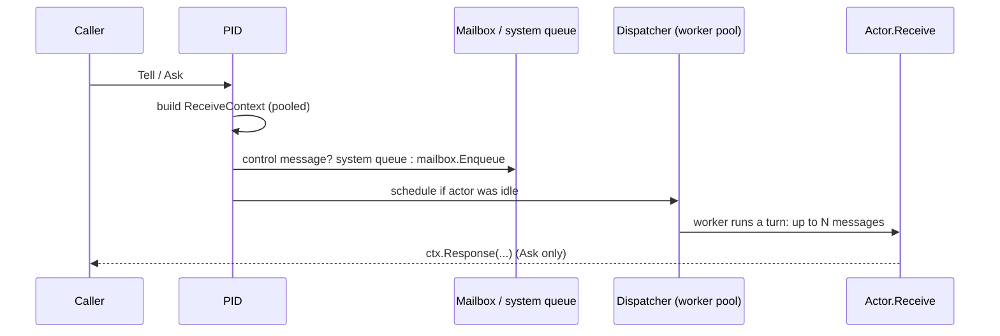
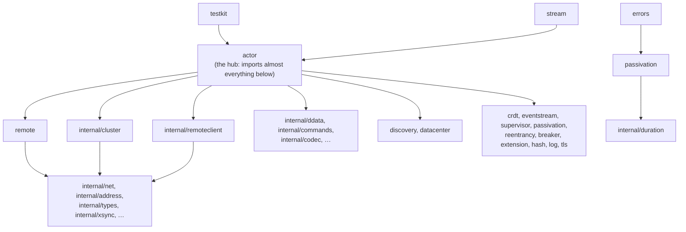

# 1. What GoAkt Is

## Contents

- [What you will learn](#what-you-will-learn)
- [The model](#the-model)
- [Sending messages](#sending-messages)
- [How a message reaches `Receive`](#how-a-message-reaches-receive)
- [The repository](#the-repository)
  - [Dependency layers](#dependency-layers)
  - [Public and internal](#public-and-internal)
  - [What else is in the repository](#what-else-is-in-the-repository)
- [Guarantees](#guarantees)
- [Implementation details (may change)](#implementation-details-may-change)

## What you will learn

- What GoAkt is, in terms of the code rather than marketing.
- The shape of the repository: which packages exist, how big they are, and which depend on which.
- The one interface every actor implements, and the four functions that send messages.
- How a message travels from a caller to an actor's `Receive`, at the level of detail you need before reading Part II.
- What is public API and what is internal, and why that line matters when you contribute.

Source files: `actor/actor.go`, `actor/api.go`, `actor/pid.go`, `actor/dispatcher.go`, `go.mod`, `Makefile`, `.mockery.yml`.

## The model

GoAkt is a Go library (module `github.com/tochemey/goakt/v4`, `go.mod`) that implements the actor model. Its minimum Go version is 1.26.0.

An **actor** is a value that implements three methods (`Actor` in `actor/actor.go`):

```go
type Actor interface {
	PreStart(ctx *Context) error
	Receive(ctx *ReceiveContext)
	PostStop(ctx *Context) error
}
```

- `PreStart` runs before the actor handles messages. A failing `PreStart` is retried, and if the last attempt fails the actor is not started. It runs again on every restart, on the same actor value (`Actor` in `actor/actor.go`).
- `Receive` handles every message, one at a time.
- `PostStop` runs when the actor stops, including when it is passivated for being idle. Depending on how the actor is stopped, it may run while `Receive` is still handling a message ([Chapter 3, §3.5](chap-03.md#35-stop)). An error from it is logged but does not prevent the stop (`Actor` in `actor/actor.go`).

An actor never runs on its own goroutine. The **actor system** owns a fixed pool of worker goroutines, the dispatcher, and lends a worker to an actor whenever that actor has messages waiting ([Chapter 7](chap-07.md)). A **PID** is the handle you hold to send an actor messages. It can point to an actor in this process or, with remoting enabled, to one on another node.

> **Actors are pointers.** Implement the three methods on a pointer receiver and pass a pointer to `Spawn` (`&MyActor{}`). GoAkt does not support actors passed by value.

On top of that core sit grains (virtual actors that activate on first message, Part III), remoting (Part IV), clustering (Part V), and higher-level subsystems: reliable delivery, CRDT-based distributed data and reactive streams (Part VI).

The same code runs in three shapes. **Standalone**: one process and no network. **Clustered**: nodes discover each other and share a registry of actors and grains, so a name resolves to whichever node holds it. **Multi-datacenter**: several clusters linked through a control plane. Remoting can also be enabled on its own, without a cluster.

A message is any Go value: the API takes `any`. A local send passes the value itself, so nothing is serialised and no `.proto` definition is needed inside one process. A message is serialised only when it crosses the network, by a serializer chosen for its type (Part IV).

## Sending messages

Four package-level functions in `actor/api.go` send to a PID:

| Function | Behaviour | Source |
|---|---|---|
| `Tell(ctx, pid, msg)` | Enqueue and return. No reply. | `Tell` in `actor/api.go` |
| `Ask(ctx, pid, msg, timeout)` | Enqueue and block until the actor replies, the timeout fires, or `ctx` is done. | `Ask` in `actor/api.go` |
| `BatchTell(ctx, pid, msgs...)` | Calls `Tell` once per message, in order, and stops at the first error. | `BatchTell` in `actor/api.go` |
| `BatchAsk(ctx, pid, timeout, msgs...)` | Calls `Ask` once per message, sequentially, and stops at the first error. | `BatchAsk` in `actor/api.go` |

Their error contract:

- A `nil` PID, or a local PID whose actor is not running, gives `ErrDead` (`Ask` and `Tell` in `actor/api.go`).
- An `Ask` that gets no reply within `timeout` gives `ErrRequestTimeout` (`actor/api.go`). If `ctx` ends first, the error joins `ctx.Err()` with `ErrRequestTimeout`.
- A remote PID on a system without remoting gives `ErrRemotingDisabled`; a remote `Ask` with a non-positive timeout gives `ErrInvalidTimeout` (`actor/api.go`).

`BatchAsk` is easy to misread. It is not a pipelined request: each message waits for its reply before the next one is sent, and on error it returns `nil` with no partial results (`actor/api.go`).

## How a message reaches `Receive`

This is the local path. Later chapters take each step apart.



1. `Tell` and `Ask` build a `ReceiveContext` taken from a pool (`toReceiveContext` in `actor/api.go`). It carries the message, the sender, and for `Ask` a reply channel.
2. `PID.doReceive` refuses ordinary messages if the system is stopping. Otherwise it routes control messages to a separate system queue and everything else to the mailbox (`actor/pid.go`).
3. If the actor was idle, `doReceive` hands it to the dispatcher (`actor/pid.go`).
4. A dispatcher worker runs one **turn**: it processes up to a throughput budget of messages (32 by default, `dispatcherThroughput` in `actor/dispatcher.go`), with system messages taking priority, then yields to other actors.

One detail in `Ask` matters when you debug it. After the context is handed to the mailbox it can be recycled for an unrelated message, so `Ask` keeps only its own reply channel. A reply that arrives after the `Ask` gave up goes into that orphaned channel and is dropped (`actor/api.go`).

## The repository

Line counts in the working tree (commit `cf7a7c6d` plus the uncommitted changes), counted over the files `git ls-files --cached --others --exclude-standard` lists:

| Package | Purpose | Source lines | Test lines |
|---|---|---:|---:|
| `actor` | Actor system, PIDs, mailboxes, dispatcher, supervision, grains, clustering glue, reliable delivery, relocation | 48,167 | 96,446 |
| `internal/net` | Wire transport: frames, chunking, compression, handshake, duplex streams | 10,881 | 15,143 |
| `stream` | Reactive streams on top of actors | 9,655 | 8,984 |
| `internal/remoteclient` | Outbound remoting client | 6,412 | 7,601 |
| `internal/cluster` | Cluster membership state, partitioning, registry stores | 3,609 | 7,614 |
| `discovery/...` | Discovery providers: consul, dnssd, etcd, kubernetes, mdns, nats, selfmanaged, static | 3,303 | 3,833 |
| `remote` | Public remoting configuration and serializers | 2,800 | 2,178 |
| `crdt` | CRDT data types | 2,219 | 3,182 |
| `datacenter/...` | Multi-datacenter configuration and control planes (etcd, NATS) | 1,589 | 3,052 |
| `log`, `testkit`, `client`, `internal/commands`, `breaker`, … | Smaller packages | none | none |
| `internal/internalpb` | Generated protobuf code | 15,407 | 0 |

In total there are about 103,900 hand-written source lines (excluding `playground/`, `mocks/`, `benchmark/` and generated code) and about 167,500 test lines (including `benchmark/`). `actor` alone holds almost half of the source and well over half of the tests. Becoming fluent in GoAkt mostly means becoming fluent in `actor`.

### Dependency layers

Running `go list -f '{{.ImportPath}}: {{.Imports}}' ./...` and keeping only the module's own packages gives this shape:



An arrow points from a package to a package it imports. The `errors → passivation → internal/duration` chain at the bottom is drawn on its own.

Four facts from the import graph are worth keeping in mind:

- **`actor` is the only package that ties everything together.** Remoting, clustering, distributed data and reliable delivery all have their entry points in `actor`, not in their own packages. When you look for "where does X start", start in `actor`.
- **Among library packages, only `stream` and `testkit` sit above `actor`.** Apart from the `playground/` programs, nothing else imports `actor`, so lower packages cannot call back into the actor system except through interfaces passed down to them.
- **`crdt`, `log` and `extension` are leaves.** They import no other package of the module. `errors` is close to the bottom but is not a leaf: it imports `passivation`, which imports `internal/duration`.
- **`internal/cluster` does not import `actor`.** Cluster membership events are delivered to the actor system through a channel (`cluster.Events()`), which `actor` drains in its own loop ([Chapter 3](chap-03.md)).

### Public and internal

Everything under `internal/` cannot be imported by users, and generated protobuf code lives there too (`Makefile`). The public surface is `actor` plus the small configuration packages it accepts (`remote`, `discovery/*`, `supervisor`, `passivation`, `reentrancy`, `extension`, `log`, `tls`, `hash`, `datacenter`), the `errors` package of sentinel errors, `eventstream` and `memory`, and the higher-level `stream`, `crdt`, `client`, `breaker` and `testkit`.

The practical consequence for contributors: a change under `internal/` can be made freely, but a change to an exported identifier in a public package is a breaking change for users.

### What else is in the repository

| Path | Contents |
|---|---|
| `protos/internal/*.proto` | Wire formats: actor, cluster, crdt, datacenter, delivery, grain, handshake, metric, … Generated into `internal/internalpb` |
| `mocks/` | Generated mocks for six interfaces in five packages (`.mockery.yml`) |
| `playground/` | Standalone `package main` programs, most named after a GitHub issue they reproduce |
| `benchmark/` | Benchmarks |
| `test/data/` | Test fixtures: TLS certificates, generated test protobufs |
| `docs/` | The Mintlify documentation site |
| `vendor/` | Not committed (it is in `.gitignore`); created by `make vendor` ([Chapter 2](chap-02.md)) |

## Guarantees

| Statement | Enforced by |
|---|---|
| `Tell`/`Ask` on a nil or stopped PID return `ErrDead` | `TestAsk` and `TestTell` in `actor/api_test.go` |
| `Ask` with no reply returns `ErrRequestTimeout` | `TestAsk` in `actor/api_test.go` |

## Implementation details (may change)

- The default throughput budget of 32 messages per turn.
- The `ReceiveContext` pool, and the fact that a late `Ask` reply is silently dropped rather than dead-lettered.
