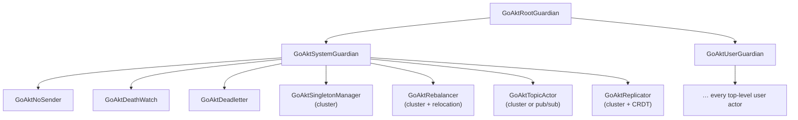

# 3. The Actor System

Verified against: `cf7a7c6d` and the uncommitted changes of branch `issue-1432` (2026-10-03): every statement checked against the code

## Contents

- [What you will learn](#what-you-will-learn)
- [3.1 One interface, one struct](#31-one-interface-one-struct)
- [3.2 Construction: `NewActorSystem`](#32-construction-newactorsystem)
- [3.3 Start](#33-start)
  - [Phase 1: before the chain](#phase-1-before-the-chain)
  - [Phase 2: the startup chain](#phase-2-the-startup-chain)
  - [Phase 3: after the chain](#phase-3-after-the-chain)
  - [When a step fails](#when-a-step-fails)
- [3.4 The guardian tree](#34-the-guardian-tree)
  - [Each system actor's supervisor](#each-system-actors-supervisor)
  - [What the guardians actually do](#what-the-guardians-actually-do)
  - [How the tree stores it](#how-the-tree-stores-it)
- [3.5 Stop](#35-stop)
  - [Leaving the cluster](#leaving-the-cluster)
  - [How one actor stops: `PID.Shutdown`](#how-one-actor-stops-pidshutdown)
  - [Passivation stops only an idle actor](#passivation-stops-only-an-idle-actor)
- [3.6 Coordinated shutdown hooks](#36-coordinated-shutdown-hooks)
- [3.7 Starting again](#37-starting-again)
- [3.8 `Run`](#38-run)
- [Guarantees](#guarantees)
- [Implementation details (may change)](#implementation-details-may-change)
- [Exercises](#exercises)

## What you will learn

- How `actorSystem` is laid out: what each group of fields is for and which ones are touched by concurrent code.
- Exactly what `NewActorSystem`, `Start` and `Stop` do, step by step, and in what order.
- How the guardian tree is built, how the actor tree stores it, and why every parent watches its children.
- How `PID.Shutdown` tears an actor down, and what it does **not** wait for.
- How a stopped system, or one whose `Start` failed, starts again.

Functions and types named in this chapter are in `actor/actor_system.go` unless another file is named.

## 3.1 One interface, one struct

`ActorSystem` is an interface of 59 exported and 58 unexported methods (`actor/actor_system.go`). The unexported methods (`isStopping`, `tree`, `getCluster`, …) seal it: no type outside `package actor` can implement it. It has exactly one implementation, the unexported `actorSystem` struct, and a compile-time assertion pins the two together (`_` in `actor/actor_system.go`). Internal code such as `rootGuardian.handlePanicSignal` reaches those unexported methods through the interface value it gets from `ctx.ActorSystem()`. The interface exists so users program against a stable surface. The struct is where every subsystem keeps its state, because, as Chapter 1 showed, `actor` is the hub that wires everything together.

The struct (`actorSystem` in `actor/actor_system.go`) is easier to read as groups of fields:

| Group | Fields | Notes |
|---|---|---|
| Lifecycle flags | `started`, `starting`, `shuttingDown`, `startedAt` | All `atomic` values. Read on hot paths (every `Tell` checks `isStopping`) without a lock |
| Actor bookkeeping | `actors *tree`, `actorsCounter`, `remoteWatches`, `spawnActivation` | The tree is the single source of truth for local actors (§3.4). `spawnActivation` is a `singleflight.Group` that collapses concurrent spawns of one name into one PID (`actorSystem` in `actor/actor_system.go`) |
| Well-known PIDs | `rootGuardian`, `userGuardian`, `systemGuardian`, `deathWatch`, `deadletter`, `noSender`, `singletonManager`, `relocator`, `topicActor`, `replicator` | Set during `Start` (`actorSystem` in `actor/actor_system.go`) |
| Scheduling | `dispatcher`, `dispatcherThroughput`, `dispatcherWorkers`, `passivator`, `scheduler`, `evictionStrategy` | The dispatcher is built in `NewActorSystem` and replaced by `Start` once it has been stopped (§3.7); the scheduler is rebuilt on every `Start` |
| Remoting | `remotingEnabled`, `remoting`, `remoteServer`, `remoteConfig`, `remoteHostPort`, `listenHost`, `coalescedFailureQueue` | `listenHost` and `remoteHostPort` differ only for a wildcard bind address (`actorSystem` in `actor/actor_system.go`) |
| Cluster | `clusterEnabled`, `cluster`, `eventsQueue`, `clusterNode`, `clusterConfig`, `clusterStore`, `relocationJobs`, `peerRemotingPorts`, `relocatingEndpoints`, `recentDepartures` | Belong to the clustering chapters (Part V), which are not written yet |
| Grains | `grains`, `lateGrainMessages`, `grainBarrier`, `grainActivation`, `pendingAsks`, `grainDefaultOptions` | Belong to the grain chapters (Part III), which are not written yet |
| Metrics | `metricProvider`, `actorKinds`, `actorKindsLocker`, `relocationMetric`, … | Explained in Chapter 12 |
| Data centers | `dataCenterController`, `dataCenterLeaderTicker`, … | Belong to the clustering chapters (19 to 22), which are not written yet |

Three kinds of synchronisation coexist in the struct, and knowing which applies to a field saves a lot of reading:

- **Atomics** for flags and counters that hot paths read.
- **`locker sync.RWMutex`**, described only as "help protect some the fields to set" (`actorSystem` in `actor/actor_system.go`). In practice it guards fields that are replaced at runtime and read by actor turns, such as `clusterStore` and `dataCenterController` (`actorSystem.reset` in `actor/actor_system.go`).
- **Dedicated mutexes** for single structures: `relocationJobsLocker`, `actorKindsLocker`, `dataCenterControllerMutex`, `dataCenterLeaderMutex`.

## 3.2 Construction: `NewActorSystem`

`NewActorSystem` (`actor/actor_system.go`) builds a system without starting anything: no goroutine runs and no actor exists when it returns. It works in six steps.

**1. Validate the name** (`NewActorSystem` in `actor/actor_system.go`). An empty name gives `ErrNameRequired`. Anything not matching `^[a-zA-Z0-9][a-zA-Z0-9-_]*$` gives `ErrInvalidActorSystemName`. The name may start with a digit but not with `-` or `_`.

**2. Fill in defaults** (`NewActorSystem` in `actor/actor_system.go`):

| Setting | Default | Source |
|---|---|---|
| Logger | Zap at **error** level, to stderr | `NewActorSystem` in `actor/actor_system.go` |
| Actor init retries | 5 | `DefaultInitMaxRetries` in `actor/defaults.go` |
| Actor init timeout | 1 s | `DefaultInitTimeout` in `actor/defaults.go` |
| Shutdown timeout | 5 min | `DefaultShutdownTimeout` in `actor/defaults.go` |
| Ask timeout (internal round trips) | 5 s | `DefaultAskTimeout` in `actor/defaults.go` |
| Remote watch timeout | 5 s | `DefaultRemoteWatchTimeout` in `actor/defaults.go` |
| Pub/sub message retention | 2 min | `DefaultMessageRetention` in `actor/defaults.go` |
| Supervisor for user actors | `supervisor.NewSupervisor()` | `NewActorSystem` in `actor/actor_system.go` |
| **Passivation for user actors** | **time-based, 2 minutes idle** | `NewActorSystem` in `actor/actor_system.go`; `DefaultPassivationTimeout` in `actor/defaults.go` |
| Relocation | enabled | `NewActorSystem` in `actor/actor_system.go` |
| Remoting, clustering, pub/sub | disabled | `NewActorSystem` in `actor/actor_system.go` |

The passivation row surprises most readers. An actor spawned without a passivation option is stopped after two minutes without a message, because `configPID` falls back to the system default whenever the spawn configuration has none (`actor/actor_system.go`). Use `WithLongLived()` for actors that must stay up. Reliable-delivery endpoints are the exception: they default to long-lived, because the delivery session dies with the actor.

**3. Apply options** in the order given (`NewActorSystem` in `actor/actor_system.go`). Each option is a function that writes into the struct (`Option` and `OptionFunc` in `actor/option.go`), so a later option overwrites an earlier one. Most numeric options ignore non-positive values instead of failing (for example `WithShutdownTimeout`, `actor/option.go`). `WithLogger(nil)` installs the discard logger rather than leaving the default. `WithRemote` and `WithCluster` both set an "enabled" flag as a side effect of receiving a non-nil config.

**4. Widen the correlated-departure window** when the cluster state sync interval was stretched beyond its default (`NewActorSystem` in `actor/actor_system.go`). This belongs to crash recovery, which the clustering chapters (Part V, not written yet) will cover. It is here because the window must be sized before anything can observe a departure.

**5. Build the dispatcher** (`NewActorSystem` in `actor/actor_system.go`). The worker count is `WithDispatcherPoolSize` if set, otherwise `max(GOMAXPROCS, 2)` (`dispatcherWorkerCount` in `actor/dispatcher.go`), and is then raised to at least 2. The floor of two exists because a handler that waits on another actor inside its turn would otherwise hold the only worker able to answer it (`actor/option.go`). The dispatcher is built here but started in `Start`.

**6. Validate** (`actorSystem.validate` in `actor/actor_system.go`):

- Extension IDs must pass the ID validator.
- The remote bind address is sanitised. A wildcard address such as `0.0.0.0` is kept as `listenHost`, so the server binds every interface, while the sanitised address is what peers are told (`actorSystem.validate` in `actor/actor_system.go`).
- In cluster mode, the cluster config is validated, and its partition hasher overrides the deprecated `WithPartitionHasher` (`actorSystem.validate` in `actor/actor_system.go`).
- TLS from `remote.Config` overrides the deprecated `WithTLS`, with a warning if both were set. With remoting enabled, TLS needs both a server and a client config (`actorSystem.validate` in `actor/actor_system.go`).

Note what validation does not check: that clustering has remoting. That check happens in `Start` (§3.3).

## 3.3 Start

`Start` (`actor/actor_system.go`) uses two flags. `started` makes a second `Start` fail with `ErrActorSystemAlreadyStarted`. `starting` is set for the duration of startup, and `shutdown` refuses to run while it is set.

Startup then proceeds in three phases.

### Phase 1: before the chain

A new message scheduler is created and the dispatcher's workers are started (`actor/actor_system.go`). A dispatcher that a previous `Stop` or failed `Start` stopped cannot run again, so it is first replaced by a fresh one of the same size (§3.7).

### Phase 2: the startup chain

Fifteen steps run through `internal/chain` in fail-fast mode: the first error stops the chain (`actorSystem.Start` in `actor/actor_system.go`). Several steps are no-ops unless a feature is enabled.

| # | Step | Runs when | What it does |
|---|---|---|---|
| 1 | `setupRemoting` | always | Builds the remoting **client** with transport settings, internal serializers for system messages, user serializers and the outbound tell coalescer (`actorSystem.setupRemoting` in `actor/actor_system.go`). Nothing listens yet |
| 2 | `setupCluster` | cluster | Fails unless remoting is enabled. Builds the cluster engine and opens the BoltDB store, and registers actor and grain kinds (`actorSystem.setupCluster` in `actor/actor_system.go`) |
| 3 | `spawnRootGuardian` | always | Root of the tree |
| 4 | `spawnSystemGuardian` | always | Parent of every system actor |
| 5 | `spawnNoSender` | always | The PID used as sender when there is none (`actorSystem.spawnNoSender` in `actor/no_sender.go`) |
| 6 | `spawnUserGuardian` | always | Parent of every top-level user actor |
| 7 | `spawnDeathWatch` | always | Processes `Terminated` messages and cleans up (Chapter 9) |
| 8 | `spawnDeadletter` | always | Receives undeliverable messages |
| 9 | `spawnSingletonManager` | cluster | `actorSystem.spawnSingletonManager` in `actor/cluster_singleton.go` |
| 10 | `spawnRelocator` | cluster and relocation enabled | Re-creates a departed node's actors |
| 11 | `spawnTopicActor` | cluster **or** pub/sub | `actorSystem.spawnTopicActor` in `actor/topic_actor.go` |
| 12 | `startRemoteServer` | remoting | Starts listening (`actorSystem.startRemoteServer` in `actor/remote_server.go`) |
| 13 | `startCluster` | cluster | Joins the cluster, starts the events loop, recovers actors from a previous incarnation of this node (`actorSystem.startCluster` in `actor/actor_system.go`) |
| 14 | `startDataCenterController` | multi-DC | `actorSystem.startDataCenterController` in `actor/data_center_controller.go` |
| 15 | `startDataCenterLeaderWatch` | multi-DC | `actorSystem.startDataCenterLeaderWatch` in `actor/data_center_controller.go` |

The order encodes real dependencies:

- The remoting client (step 1) is built before any actor because every PID is constructed with it (`withRemoting(x.remoting)`, `actorSystem.configPID` in `actor/actor_system.go`).
- Every system actor exists (steps 3 to 11) before the remote server starts accepting requests (step 12), and the remote server runs before the node joins the cluster (step 13). Nothing can reach this node before it can answer.
- `startCluster` seeds the peer-port cache before starting the events loop, so a member that later crashes can still be resolved (`actor/actor_system.go`).

### Phase 3: after the chain

The scheduler starts, then the CRDT replicator is spawned, but only in cluster mode with CRDTs configured and, if the CRDT config names a role, only on nodes with that role (`actorSystem.spawnReplicator` in `actor/replicator.go`). The passivation manager and the eviction loop start, and only then are the flags flipped: `started = true`, `starting = false`. The start time is stored right after them, in `startedAt` (`actorSystem.Start` in `actor/actor_system.go`).

Metrics are registered last. If that fails, the system is already marked started, so `Start` calls the full `shutdown` before returning the error (`actor/actor_system.go`).

### When a step fails

A failure inside the chain calls `startupCleanup` (`actor/actor_system.go`). Unlike `shutdown`, it can run while `starting` is true. It stops the data-center components, cluster, remoting and event stream, signals the dispatcher to stop, and calls `reset`, which clears the flags and the actor tree but keeps the configured extensions. A second `Start` then works: the test suite spawns an actor and asks it after a failed first `Start` (`TestStartupCleanup` in `actor/actor_system_test.go`). §3.7 explains what that requires.

## 3.4 The guardian tree

After `Start`, a local system with no options has this tree:

The children of `GoAktSystemGuardian` are listed in the order they are spawned; a label in parentheses names the configuration under which that actor exists.

A tree, rather than a flat registry, is the choice of Erlang/OTP and Akka, for the same reasons. Every actor has exactly one parent. Teardown has a fixed order: a parent stops its children before itself. And the path through the tree gives every actor a name that cannot clash with an actor under another parent.

Every name comes from the `reservedNames` table (`actor/reserved.go`). Any name beginning with `GoAkt` is reserved (`reservedNamesPrefix` and `isSystemName` in `actor/reserved.go`), and `configPID` rejects it for a non-system spawn with `ErrReservedName` (`actor/actor_system.go`).

### Each system actor's supervisor

| Actor | Directive on error | Source |
|---|---|---|
| System guardian, user guardian, death watch | Escalate (death watch resumes on a cluster-cleanup error, issue #1337) | `actorSystem.spawnSystemGuardian`, `actorSystem.spawnUserGuardian` and `actorSystem.spawnDeathWatch` in `actor/actor_system.go` |
| Dead letter, NoSender, topic actor | Resume | `actorSystem.spawnDeadletter` in `actor/actor_system.go` |
| Singleton manager, replicator | Restart | `actorSystem.spawnSingletonManager` in `actor/cluster_singleton.go` |
| Relocator | Restart on panic and rebalancing errors; resume on internal and spawn errors | `actorSystem.spawnRelocator` in `actor/actor_system.go` |

All are spawned with `WithLongLived()`, so none of them passivates.

### What the guardians actually do

The guardians do almost nothing. Their only real behaviour is in `handlePanicSignal`: when a `PanicSignal` arrives from an actor with a reserved name while the system is not already stopping, the guardian **stops the whole actor system** (`actor/root_guardian.go`, `actor/system_guardian.go`). A system actor failing in a way that escalates is treated as fatal for the node.

A guardian's termination does not stop the system: the root guardian's `Terminated` branch only logs (`rootGuardian.Receive` in `actor/root_guardian.go`), as its comment says (`rootGuardian` in `actor/root_guardian.go`).

### How the tree stores it

The tree (`actor/pid_tree.go`) is one `sync.RWMutex` protecting three indexes over `pidNode` values:

- `pids`: PID ID to node.
- `names`: name to a list of nodes, because a name is unique only among siblings (`tree` in `actor/pid_tree.go`).
- `qualifiedNames`: the `/`-joined ancestor names to node.

Each node caches its ID and names, and holds its PID in an `atomic.Pointer` so it can be read without the lock (`pidNode` and `pidNode.value` in `actor/pid_tree.go`).

Adding a child does more than link it. The child goes into the parent's `descendants`, **and the parent is recorded as the child's watcher and the child as the parent's watchee** (`tree.addNodeLocked` in `actor/pid_tree.go`). Parenthood is a death-watch relationship: when a child stops, its parent receives `Terminated` through the same mechanism any watcher uses (Chapter 9).

One ordering subtlety: `addRootNode` caches `ActorSystem().NoSender()` so that later inserts can refuse NoSender as a parent (`actor/pid_tree.go`). The root guardian is spawned before NoSender exists, so the cached value is `nil` at first. `addNodeLocked` re-reads it while it is still `nil`, and it is filled in by the time NoSender itself is inserted. The design works only because of that re-read.

The guardians are inserted with errors from `configPID` discarded (`x.rootGuardian, _ = x.configPID(...)`, `actorSystem.spawnRootGuardian` in `actor/actor_system.go`). If construction ever failed, `addRootNode(nil)` would return "pid is nil" and fail the chain, so the error is not lost, only replaced.

## 3.5 Stop

`Stop` is `shutdown` (`actor/actor_system.go`). It refuses to run unless the system is started and not still starting (`ErrActorSystemNotStarted`). Then:

1. **Mark the system as shutting down** (`actorSystem.shutdown` in `actor/actor_system.go`). From this point `PID.doReceive` refuses every non-system message with `ErrSystemShuttingDown` (`actor/pid.go`), so no new user work enters any mailbox.
2. **Stop background loops** with the caller's context: eviction, passivation manager, scheduler (`actorSystem.shutdown` in `actor/actor_system.go`).
3. **Snapshot the local user actors** (`actorSystem.shutdown` in `actor/actor_system.go`).
4. **Bound the rest by `shutdownTimeout`** (`actorSystem.shutdown` in `actor/actor_system.go`). Step 2 is not covered by this bound.
5. **Run the coordinated shutdown hooks** in registration order (§3.6).
6. **Stop the data-center components.**
7. **Build the peer-state snapshot** for relocation, in cluster mode with relocation enabled. Only relocatable actors that are still running and not stopping are included, so an actor stopped just before `Stop` is not resurrected elsewhere (`actorSystem.preShutdown` in `actor/actor_system.go`).
8. **Shut down user-facing actors** in fail-fast order: user guardian (and with it every user actor), singleton manager, relocator, dead letter, death watch (`actorSystem.shutdown` in `actor/actor_system.go`).
9. **Deactivate grains** by sending each a `PoisonPill`, so `OnDeactivate` runs on the grain's own turn (`actorSystem.shutdown` in `actor/actor_system.go`).
10. **Shut down remaining system actors**: topic actor, NoSender, system guardian, root guardian. The root guardian's own stop has already removed its node from the tree (`PID.releaseName` in `actor/pid.go`), so the `deleteNode` call that `shutdown` makes afterwards finds nothing left to remove (`actorSystem.shutdown` in `actor/actor_system.go`).
11. **Close the event stream, then leave the cluster and stop remoting** (`actorSystem.shutdown` in `actor/actor_system.go`).
12. **In a deferred function**, unregister the system's metrics, reset the system, signal the dispatcher to stop and flush the logger. The dispatcher is not waited for, because `Stop` may itself be running on a dispatcher worker, for example from inside a `Receive` (`actorSystem.shutdown` in `actor/actor_system.go`).

If step 8 or step 10 fails, `shutdown` jumps straight to the cluster and remoting shutdown. A failure in step 8 skips steps 9 and 10, so the grains get no `PoisonPill` and the remaining system actors are not stopped. A failure in either step leaves the event stream open. Cluster and remoting are still shut down, the deferred step 12 still runs, and all errors are combined (`actorSystem.shutdown` in `actor/actor_system.go`).

### Leaving the cluster

`shutdownCluster` (`actor/actor_system.go`) runs four steps, all of which run even if one fails (`chain.WithRunAll`):

1. Persist the peer-state snapshot to peers.
2. Remove this node's registry records.
3. Stop the cluster engine.
4. Close the BoltDB store.

Persistence chooses peers oldest first, because the oldest member is the cluster coordinator (`actorSystem.selectOldestPeers` in `actor/actor_system.go`). It sends to groups of three (`defaultReplicationFactor`) and returns as soon as two acknowledge (`defaultReplicationQuorum`, `actor/actor_system.go`). One acknowledgement is accepted as partial success. The next group is tried only when every peer of the current group answers that it is itself leaving (`actorSystem.persistPeerStateToPeers` and `isPeerLeaving` in `actor/actor_system.go`). A peer counts as leaving when it refuses the state with `ErrRemotingDisabled` or `ErrClusterDisabled`, refuses the connection, or closes it under the request (a reset, an end of stream, or a closed duplex session): a running node keeps its remoting port open and its peers' connections up, while a stopping node closes them (Chapter 15). A peer that does not answer in time is not counted as leaving.

### How one actor stops: `PID.Shutdown`

Every step above that stops an actor ends in `PID.Shutdown` (`actor/pid.go`), which makes the first two checks and then calls `PID.stop` for the last two:

1. A remote PID forwards the stop over remoting.
2. A system actor refuses with `ErrShutdownForbidden` unless the system is stopping. Reliable-delivery controller companions are the exception.
3. Under `stopLocker`, an actor that is not running returns `nil`: it was already stopped or passivated.
4. Set `stoppingState`, unregister from passivation, and call `doStop`.

`doStop` (`actor/pid.go`) then:

1. Cancels in-flight requests with `ErrRequestCanceled`.
2. Runs, fail-fast: release watchees; stop **all children concurrently** in an `errgroup` (`PID.freeChildren` in `actor/pid.go`); then the actor's own `PostStop`.
3. Reads the watchers, removes the node from the tree, which frees the actor's name, and then notifies the watchers with `Terminated`, whatever the outcome (`PID.releaseName` and `PID.freeWatchers` in `actor/pid.go`). A watcher that spawns the same name again on `Terminated` finds it free.
4. In a deferred function: clear `runningState` and `reset` the PID, which disposes of the mailbox on a terminal stop (`actor/pid.go`).

The order is post-order: every descendant's `PostStop` finishes before its parent's begins, while siblings stop in parallel. A tree is therefore torn down in time proportional to its depth rather than its size.

Two consequences follow from `doStop` running **on the caller's goroutine**, outside the actor's mailbox and turn:

- **Messages still queued are not handled, and not dead-lettered.** Once the actor is stopping, a turn that is still running hands out no more user messages (`PID.runTurn` and `PID.handlesUserMessages` in `actor/pid.go`). The queued messages stay in the mailbox and are abandoned with the PID on a terminal stop; a restart keeps them for the new incarnation (Chapter 6, §6.8).
- **`PostStop` can run while `Receive` is still executing.** `Shutdown` does not wait for a turn in progress on a dispatcher worker.

The comment on `Actor.PostStop` states both, and divides the ways an actor stops in two (`actor/actor.go`):

- **Immediate stops:** `PID.Shutdown`, `ActorSystem.Stop`, system eviction, which calls `Shutdown` (`actorSystem.runEviction` in `actor/actor_system.go`), and a parent stopping its children. They behave as above.
- **Stops that never overlap `Receive`:** a `PoisonPill` and `ctx.Shutdown()` call `Shutdown` from the actor's own turn (`PID.dispatchOne` in `actor/pid.go`), so no other handler of the actor can be running, and per-actor passivation stops only an idle actor (below).

Neither kind drains the mailbox. `PoisonPill` is a control message (`isControlMessage` in `actor/pid.go`), so `doReceive` puts it in the system queue, which a turn serves before the mailbox. Messages queued before a `PoisonPill` are therefore dropped, not handled.

To stop only after the queued work is done, send an ordinary message of your own type and call `ctx.Shutdown()` from `Receive` when it arrives (`actor/receive_context.go`). The message waits in the mailbox behind everything sent before it, and `doStop` then runs on the worker that is executing the turn, so `PostStop` cannot overlap a `Receive`.

### Passivation stops only an idle actor

`tryPassivation` (`actor/pid.go`) moves the actor's dispatch state from idle to processing before it stops it. The move succeeds only when no turn is running or waiting, and while passivation holds the state no worker can start a turn, so `PostStop` cannot overlap a `Receive`.

When the actor is busy, the attempt is refused and recorded with `passivationManager.Defer`. The manager does not retry at once: a busy actor's last activity is the start of the message it is still processing, so a time-based deadline computed from it is already past, and an immediate retry would spin for as long as the message runs. A time-based strategy is retried a whole timeout later (`actor/passivation_manager.go`). A message-count strategy is retried when the actor goes idle: `finishOrReclaim` raises the message-count trigger again when a turn ends with nothing left to process (`actor/pid.go`). The test suite checks both strategies (`TestPassivationSkipsBusyActor` in `actor/pid_test.go`).

## 3.6 Coordinated shutdown hooks

A hook implements `Execute(ctx, system)` and `Recovery()` (`ShutdownHook` in `actor/shutdown_hook.go`). `runShutdownHooks` (`actor/actor_system.go`) runs the hooks in registration order. A panic in a hook is converted into a `PanicError`. A failing hook is handled according to its strategy:

| Strategy | Effect on the remaining hooks | Source |
|---|---|---|
| No recovery configured | Stop running hooks, return the error | `actorSystem.runShutdownHooks` in `actor/actor_system.go` |
| `ShouldFail` (the default) | Stop running hooks, return the error | `actorSystem.runShutdownHooks` in `actor/actor_system.go` |
| `ShouldRetryAndFail` | Retry; if still failing, stop and return | `actorSystem.runShutdownHooks` in `actor/actor_system.go` |
| `ShouldSkip` | Record the error, continue | `actorSystem.runShutdownHooks` in `actor/actor_system.go` |
| `ShouldRetryAndSkip` | Retry; if still failing, record and continue | `actorSystem.runShutdownHooks` in `actor/actor_system.go` |

"Stop" here means stop running **hooks**, not stop shutting down. `shutdown` keeps the hooks' error and carries on with every remaining step (`actor/actor_system.go`). With `ShouldFail`, the remaining hooks do not run, but the actors still stop, `Running()` is false afterwards, and `Stop` returns the hooks' error. `WithCoordinatedShutdown`'s comment says the same (`actor/option.go`).

## 3.7 Starting again

A system can be started again after `Stop`, and after a `Start` that failed. `Stop` and `startupCleanup` close several components for good, so this works only because the next `Start` rebuilds each of them:

| Component | What stopping does | What the next `Start` does | Source |
|---|---|---|---|
| Dispatcher | `signalStop` closes the ready queue and the supervision consumer, and `start` runs only once per dispatcher (`dispatcher.start` and `dispatcher.signalStop` in `actor/dispatcher.go`) | Replaces a stopped dispatcher with a fresh one of the same size. Workers of the previous run may still be finishing their last turn on the old one | `actorSystem.Start` in `actor/actor_system.go` |
| Passivation manager | `Stop` closes its `stop` channel and waits for the run loop to close `done` (`passivationManager.Stop` and `passivationManager.run` in `actor/passivation_manager.go`) | `Start` creates new channels and a new `stopOnce` | `passivationManager.Start` in `actor/passivation_manager.go` |
| Eviction loop | `shutdown` closes the loop's stop signal (`actorSystem.shutdown` in `actor/actor_system.go`) | `startEviction` creates a new signal and hands it to the loop, so a loop of a stopped run never sees the next run's signal | `actorSystem.startEviction` in `actor/actor_system.go` |
| Extensions | `reset` keeps them | Found again; the CRDT config extension is set again by `spawnReplicator` | `actorSystem.reset` in `actor/actor_system.go` |

The test suite checks both cases: a restart after `Stop`, with an extension and an eviction strategy configured (`TestActorSystem` in `actor/actor_system_test.go`), and a restart after a failed `Start` (`TestStartupCleanup` in `actor/actor_system_test.go`). In both, a spawned actor must answer an `Ask`.

## 3.8 `Run`

`Run` (`actor/actor_system.go`) is a convenience wrapper with process-level side effects:

1. Runs `startHook`, then `Start`. On error it logs and calls `os.Exit(1)`.
2. Blocks until `SIGINT` or `SIGTERM`.
3. Runs `stopHook`, then `Stop`. On error it calls `os.Exit(1)`.
4. Then, unless the process is PID 1 (where it calls `os.Exit(0)`), it sends **itself** `SIGTERM` (`Kill` on Windows) after `signal.Stop` has removed its own handler (`actorSystem.Run` in `actor/actor_system.go`).

`Run` returns right after sending the signal, and with its handler removed, the default action for `SIGTERM` terminates the process when the signal is delivered. Code after `Run` may start, but nothing guarantees it finishes, and deferred functions in `main` are not guaranteed to run. Use `Start` and `Stop` directly when you need control after shutdown.

## Guarantees

| Statement | Enforced by |
|---|---|
| An empty name gives `ErrNameRequired`, and a name with characters outside the regex gives `ErrInvalidActorSystemName` | `TestActorSystem` in `actor/actor_system_test.go` |
| Second `Start` → `ErrActorSystemAlreadyStarted`; `Stop` before `Start` → `ErrActorSystemNotStarted` | `TestActorSystem` in `actor/actor_system_test.go` |
| A stopped system, or one whose `Start` failed, starts again and processes messages | `TestActorSystem` and `TestStartupCleanup` in `actor/actor_system_test.go` |
| Passivation never runs `PostStop` alongside `Receive` | `TestPassivationSkipsBusyActor` in `actor/pid_test.go` |
| A failing hook stops the remaining hooks under `ShouldFail`, under `ShouldRetryAndFail` after its retries, with no recovery, and when it panics; the remaining hooks still run under `ShouldSkip` and `ShouldRetryAndSkip`; `Stop` returns the hooks' error in every case | `TestActorSystem` in `actor/actor_system_test.go` and the tests after it |

## Implementation details (may change)

- The fifteen-step startup order and the shutdown order. Only their dependencies (§3.3) are load-bearing.
- Concurrent shutdown of siblings.
- The 3/2 replication factor and quorum for the peer-state snapshot.

## Exercises

1. Explain why `startupCleanup` exists separately from `shutdown`. (Hint: `actor/actor_system.go`.)
2. A user calls `Stop` from inside an actor's `Receive`. Trace why this does not deadlock on the dispatcher. (Hint: `actorSystem.shutdown` in `actor/actor_system.go`.)
3. `Start` replaces a stopped dispatcher instead of starting it again. Why can the old one not simply be restarted? (Hint: `dispatcher.start` and `dispatcher.signalStop` in `actor/dispatcher.go`.)
4. Sketch an actor that loses data because of §3.5, then fix it with the self-shutdown pattern.
