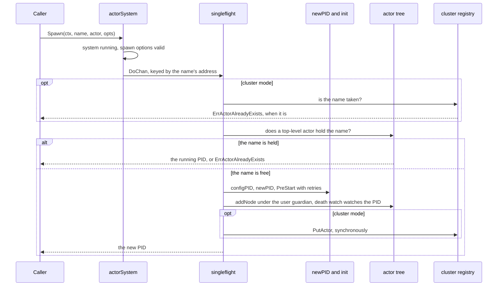
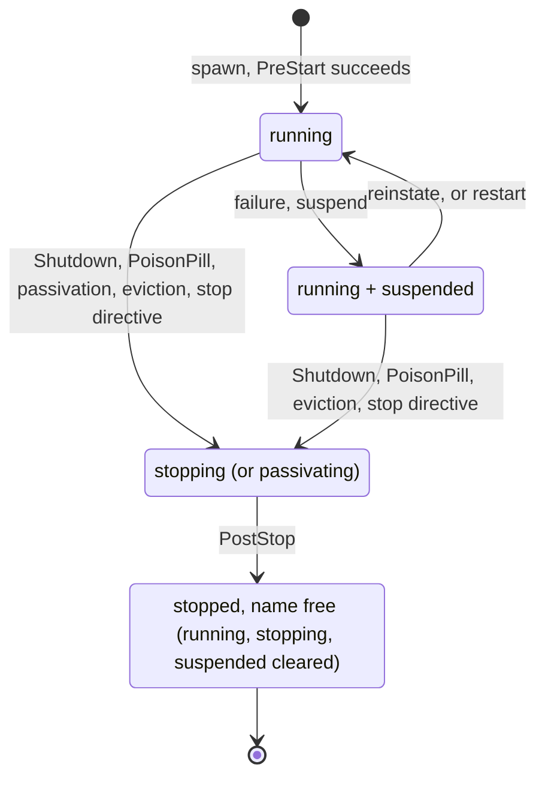

# 4. Spawning and the PID

## Contents

- [What you will learn](#what-you-will-learn)
- [4.1 The spawn entry points](#41-the-spawn-entry-points)
- [4.2 The local `Spawn` path, step by step](#42-the-local-spawn-path-step-by-step)
- [4.3 Inside `newPID`](#43-inside-newpid)
  - [`PostStart` is always the first message](#poststart-is-always-the-first-message)
  - [The PID struct is laid out for the cache](#the-pid-struct-is-laid-out-for-the-cache)
  - [State is one bitmask](#state-is-one-bitmask)
  - [Local and remote PIDs share one type](#local-and-remote-pids-share-one-type)
- [4.4 `PreStart`: retries and the timeout that is not one](#44-prestart-retries-and-the-timeout-that-is-not-one)
- [4.5 Names, addresses and identity](#45-names-addresses-and-identity)
  - [The address](#the-address)
  - [Name rules](#name-rules)
  - [What `Equals` compares](#what-equals-compares)
- [4.6 Children](#46-children)
- [4.7 Looking up, killing and restarting by name](#47-looking-up-killing-and-restarting-by-name)
- [4.8 Function actors](#48-function-actors)
- [Guarantees](#guarantees)
- [Implementation details (may change)](#implementation-details-may-change)
- [Behaviours to know](#behaviours-to-know)

## What you will learn

- The exact path a local `Spawn` takes, from the call to a running actor, and which step owns which guarantee.
- How concurrent spawns of one name collapse into one actor, and what that costs.
- What a `PID` contains, why its fields are ordered the way they are, and how its state is tracked.
- How `PreStart`, its retries and its timeout really behave.
- How children differ from top-level actors, and which spawn options do not apply to a child.
- How actors are named and addressed, what `PID.Equals` compares, and what `Restart` keeps.

## 4.1 The spawn entry points

| Entry point | Places the actor | Parent | Notes |
|---|---|---|---|
| `Spawn` | here, or on `host:port` given by `WithHostAndPort` | user guardian | `actorSystem.Spawn` in `actor/spawn.go` |
| `SpawnNamedFromFunc` | here | user guardian | wraps a function in `FuncActor`; never relocatable (`actorSystem.SpawnNamedFromFunc` in `actor/spawn.go`) |
| `SpawnFromFunc` | here | user guardian | same, with a random UUID name (`actorSystem.SpawnFromFunc` in `actor/spawn.go`) |
| `SpawnOn` | a cluster member chosen by placement strategy, or another data center | user guardian of that node | Part V (`actorSystem.SpawnOn` in `actor/spawn.go`) |
| `SpawnSingleton` | the cluster coordinator, or with `WithSingletonRole` the oldest member that advertises the role | singleton manager | Part V |
| `SpawnRouter` | here | user guardian | [Chapter 11](chap-11.md) |
| `PID.SpawnChild` | the parent's node | the calling PID | [§4.6](#46-children) (`PID.SpawnChild` in `actor/pid.go`) |

With `WithHostAndPort`, `Spawn` does not create anything locally. It sends a `RemoteSpawn` request naming the actor's kind and returns a remote PID (`actor/spawn.go`). The kind must be registered on the target node. The rest of this chapter follows the local path.

## 4.2 The local `Spawn` path, step by step



The function body is short (`actorSystem.Spawn` in `actor/spawn.go`), and each line delegates to one step.

**Step 1. Preconditions.** The system must be running (`ErrActorSystemNotStarted`), and the spawn options must validate (`actorSystem.Spawn` in `actor/spawn.go`). Options are defined in `newSpawnConfig`; relocatable is the only one on by default (`actor/spawn_option.go`).

**Step 2. Serialise on the name.** Everything after this runs inside `runSpawnActivation`, keyed by the actor's address string (`actorSystem.Spawn` in `actor/spawn.go`). It is a `singleflight.Group`: concurrent spawns of the same name join one execution and share its result. The key comes from `actorReference`, which builds the address without minting an incarnation ID, so it is the same for every caller (`actor/actor_system.go`).

The function's comment (`actorSystem.runSpawnActivation` in `actor/spawn.go`) spells out three subtleties:

- A waiter whose own context ends stops waiting, but the spawn carries on for the others.
- The shared execution runs under the **first** caller's context. If it fails because that context was cancelled while the waiter's context is still live, the waiter retries once rather than inheriting a cancellation that was never its own (`actorSystem.runSpawnActivation` in `actor/spawn.go`).
- Spawning the same name again from inside the actor's own `PreStart` joins its own in-flight execution and blocks until the caller's context expires.

One cost is not in the comment. `DoChan` runs the function on a new goroutine and re-raises a panic there, so a panic anywhere in the spawn path cannot be recovered by the caller and terminates the process.

**Step 3. Cluster precondition.** In cluster mode, `checkOrdinarySpawnPreconditions` asks the registry whether the name exists (`actor/actor_system.go`). A name held by a node that has left the cluster counts as free, so a crashed owner's name can be reused (`actorSystem.departedClaim` in `actor/actor_system.go`). The comment calls this "the first line of the name uniqueness rule, not the whole of it". Two spawns can both pass the read, and the registry write in step 7 decides between them (`actorSystem.checkSpawnPreconditions` in `actor/actor_system.go`).

**Step 4. Local name check.** `topLevelActor` looks the name up as a top-level qualified name only, so a child that happens to share the name does not count (`actor/actor_system.go`). If an actor holds the name, `nameResolver` decides (`actor/spawn.go`):

| Holder | Result |
|---|---|
| running | that **existing PID**, with no error |
| present but not running (suspended, stopping, restarting) | `ErrActorAlreadyExists` |
| node with no PID | name is free, continue |

The first row means a repeated `Spawn` of a running name is a lookup. The actor value passed the second time is ignored: the PID returned is the first actor's, still running the first actor's code.

In cluster mode step 3 runs first, and it finds this node's own live record and reports the name as taken. The same call therefore returns `ErrActorAlreadyExists` instead of the PID. This is deliberate: in a cluster a name identifies one actor across all nodes, the test suite expects the error for a same-node re-spawn (`TestSpawn` in `actor/spawn_test.go`), and the `Spawn` comment says to use `ActorOf` to get the running actor (`actor/spawn.go`).

**Step 5. Build the PID.** `configPID` (`actor/actor_system.go`) turns the spawn config into PID options and calls `newPID`. In order:

1. Reject a reserved name.
2. Mint the address with a fresh incarnation ID (`actorAddress`, `actor/actor_system.go`) and validate it.
3. Inherit system settings: init retries, init timeout, remoting, passivation manager, metrics.
4. Fall back to the system's default supervisor when none was given (`actorSystem.configPID` in `actor/actor_system.go`).
5. Fall back to the system's default passivation strategy (two minutes idle), or to long-lived for reliable-delivery endpoints (`actorSystem.configPID` in `actor/actor_system.go`).

`newPID` is covered in [§4.3](#43-inside-newpid). It runs `PreStart`, so **by the time `configPID` returns, the actor has started but is not yet in the tree.**

**Step 6. Attach.** `completeSpawn` calls `attachAndPublish` (`actor/actor_system.go`), which:

1. Increments the live-actor counter for non-system actors.
2. Inserts the PID under its parent, which also makes the parent a watcher of the child ([Chapter 3, §3.4](chap-03.md#34-the-guardian-tree)).
3. Adds the death watch actor as a watcher (`actorSystem.attachAndPublish` in `actor/actor_system.go`). In a cluster, this is how a stopped actor's registry record is removed; the stopping actor leaves the tree and the live-actor count by itself ([Chapter 9, §9.8](chap-09.md#98-death-watch)).

If the tree already holds this ID with a *different* PID, a concurrent spawn won. The function returns the canonical PID and undoes the counter. The duplicate is deliberately not shut down, because stopping it would tear down tree state keyed by the shared ID (`actorSystem.attachAndPublish` in `actor/actor_system.go`). The comment says this path should be unreachable while every entry point goes through `runSpawnActivation`.

**Step 7. Publish.** In cluster mode, `putActorOnCluster` writes the registry record **synchronously**. `Spawn` returns only after the write, so a successful spawn is resolvable by name from any node (`actor/actor_system.go`). A conflicting record held by a departed node is replaced, fenced by its incarnation ID. If publication fails, `rollbackSpawn` shuts the actor down with a non-cancellable context, so a failed spawn leaves nothing behind (`actorSystem.attachAndPublish` in `actor/actor_system.go`).

**Step 8. Count.** `recordActorSpawned` updates the per-kind metric (`actorSystem.attachAndPublish` in `actor/actor_system.go`). It derives the kind name with `types.Name`, which requires a pointer; this is one of the places that makes pointer actors a requirement ([Chapter 1](chap-01.md)).

## 4.3 Inside `newPID`

`newPID` (`actor/pid.go`):

1. Validates the address and allocates the struct, with a context-pool shard chosen round-robin so that concurrently busy actors take contexts from different pool shards (`newPID` in `actor/pid.go`).
2. Sets the `relocationState` bit (relocatable unless an option clears it), then applies the options.
3. **Embeds the default mailbox in the PID.** Without a custom mailbox, the PID's own `mailboxHead`/`mailboxTail` words become a lock-free MPSC list seeded with one sentinel, and `pid.mailbox` is the PID itself viewed as `*embeddedMailbox` (`newPID` in `actor/pid.go`). An ordinary actor allocates no separate mailbox object. [Chapter 6](chap-06.md) covers this.
4. Falls back to package-level defaults for a missing supervisor or passivation strategy (`newPID` in `actor/pid.go`, defined at `defaultSupervisor` in `actor/pid.go`). Top-level actors never reach these fallbacks, because `configPID` already supplied the system defaults. A child spawned without a passivation strategy reaches the passivation fallback. It never reaches the supervisor fallback, because `PID.buildChildOptions` in `actor/pid.go` already gave it the system's default supervisor ([§4.6](#46-children)).
5. Pushes `actor.Receive` as the first entry of the behaviour stack (`newPID` in `actor/pid.go`).
6. Runs `init`, which runs `PreStart` ([§4.4](#44-prestart-retries-and-the-timeout-that-is-not-one)).
7. Registers with the passivation manager, builds metric attributes, and schedules the first turn so that `PostStart` is delivered (`newPID` and `PID.firePostStart` in `actor/pid.go`).

### `PostStart` is always the first message

`init` arms `PostStart` in a dedicated slot *before* setting `runningState` (`actor/pid.go`). Every turn runs the pending `PostStart` before anything else (`PID.runPendingPostStart` in `actor/pid.go`), and the slot is separate from both queues (`PID` in `actor/pid.go`). So even if a user message, a child's `Terminated` or a `PanicSignal` arrives first, the actor sees `PostStart` first. The ordering is deliberate: from the moment `runningState` is set, senders can reach the actor.

### The PID struct is laid out for the cache

The `PID` struct (`actor/pid.go`) is ordered by *which goroutine writes each field* rather than by topic, and its comments explain why:

- The mailbox head and `mailboxDequeued`, written by the consumer on every message, sit next to `processedCount`, which the consumer also writes (`PID` in `actor/pid.go`).
- The mailbox tail and `mailboxEnqueued`, written by producers, are parked among cold configuration fields, away from everything the turn touches (`PID` in `actor/pid.go`).
- Counting the mailbox size with two counters, one per side, instead of one shared counter avoids a cache line bouncing between producer and consumer on every message (`PID` in `actor/pid.go`).
- Rarely used settings (reliable delivery, durable queues, singleton spec, role) live in an optional `companion` pointer that stays `nil` for an ordinary actor (`PID` in `actor/pid.go`).

When you add a field to `PID`, place it by write pattern. A hot field in the wrong place is a performance regression no functional test will catch.

### State is one bitmask

Thirteen independent flags live in one `atomic.Uint32` (`actor/pid_state.go`). The type's comment gives the reason: separate `atomic.Bool` fields would waste cache lines and padding. `setState` updates one bit with a compare-and-swap loop, so goroutines flipping different bits never lose each other's updates. There is no state machine enforcing legal transitions. The bits are set and cleared at the points described in this and later chapters.

| Flag | Meaning while set | Chapter |
|---|---|---|
| `runningState` | initialisation is complete and the actor may handle messages; a suspended actor keeps this bit | 4 |
| `stoppingState` | a stop is in progress | 3, [§3.5](chap-03.md#35-stop) |
| `suspendedState` | supervision has suspended the actor | 9 |
| `passivatingState` | the actor is being passivated, and the stop is certain | 10, [§10.5](chap-10.md#105-one-attempt) |
| `passivationPausedState` | passivation is paused while the actor is suspended | 10, [§10.6](chap-10.md#106-pause-resume-reinstate) |
| `passivationSkipNextState` | the next passivation attempt must be skipped, once | 10, [§10.6](chap-10.md#106-pause-resume-reinstate) |
| `singletonState` | the actor is a cluster singleton | 21 |
| `relocationState` | the actor may be relocated to another node | 21 |
| `systemState` | the actor is a system actor | 3, [§3.4](chap-03.md#34-the-guardian-tree) |
| `remoteState` | the PID is a handle for an actor on another node | 4 |
| `remoteHoldsClosedState` | teardown has drained the remote hold registry, so a flow-control credit tracked after it is repaid at once | 17 |
| `restartingState` | the teardown in progress belongs to a restart, not a stop | 9, [§9.6](chap-09.md#96-the-restart-itself) |
| `supervisionPendingState` | a failure awaits a supervision decision, and no user message is handled | 7, [§7.6](chap-07.md#76-failures-leave-the-turn) |

Several bits are set at once, so the lifecycle is easier to read as the combinations an observer can see:



Passivation never starts from `running + suspended`: `PID.tryPassivation` refuses while `suspendedState` or `passivationPausedState` is set (`actor/pid.go`). Eviction stops its actors with `Shutdown` (`actorSystem.runEviction` in `actor/actor_system.go`), so it reaches a suspended actor.

A restart passes through `restarting` + `stopping` and returns to `running` on the same PID ([Chapter 9, §9.6](chap-09.md#96-the-restart-itself)).

Two mutexes complete the picture. `stopLocker` serialises the two ways an actor can be stopped, `Shutdown` and a passivation attempt, so `PostStop` runs once ([Chapter 10, §10.5](chap-10.md#105-one-attempt)). `fieldsLocker` is a read-write mutex over the fields that can change after construction and are read from other goroutines. These include the actor system pointer, through which the logger and the event stream are looked up, the address and the behaviour stack's switches (`PID.getLogger`, `PID.getEventsStream`, `PID.getAddress`, `PID.setBehavior` in `actor/pid.go`). Neither is taken on the send path, which uses only the bitmask and the dispatch state ([Chapter 7, §7.2](chap-07.md#72-the-dispatch-state)).

### Local and remote PIDs share one type

A remote PID is the same struct with only `address`, `path` and `remoting` set, plus `remoteState` (`newRemotePID` in `actor/pid.go`). Most public methods branch on `IsRemote()`. The identity methods `ID`, `Name`, `Path` and `Equals` do not: they read the path, which a remote PID carries like a local one. Some of those branches are hidden network calls. For example, `ProcessedCount` and `RestartCount` on a remote PID each issue a `RemoteMetric` RPC with `context.Background()`, so the call has no deadline. `ActorSystem()` returns `nil` for a remote PID.

## 4.4 `PreStart`: retries and the timeout that is not one

`init` (`actor/pid.go`) runs `PreStart` through `internal/retry`:

```go
initContext := newContext(ctx, pid.Name(), pid.actorSystem, pid.Dependencies()...)
initTimeout := pid.effectiveInitTimeout()
cctx, cancel := context.WithTimeout(ctx, initTimeout)
retrier := retry.NewRetrier(int(pid.initMaxRetries.Load()), time.Millisecond, initTimeout)
if err := retrier.RunContext(cctx, func(_ context.Context) error {
	return pid.actor.PreStart(initContext)
}); err != nil { ... }
```

**Attempts.** The retry count is the total number of attempts, the first included (`NewRetrier` in `internal/retry/retry.go`). With the default of 5 (`DefaultInitMaxRetries` in `actor/defaults.go`), a failing `PreStart` runs five times, with exponential backoff starting at 1 ms. The spawn then fails with `ErrInitFailure` and leaves nothing behind (`TestFailedPreStart` in `actor/pid_test.go`). `PreStart` must therefore be safe to run more than once.

**Timeout.** The init timeout (1 s by default) bounds only the retry loop:

- `PreStart` receives `initContext`, which is built from the caller's `ctx` and not from `cctx` (`PID.init` in `actor/pid.go`). Even a `PreStart` that honours its context sees no deadline from the init timeout. It sees only the deadline the caller's `ctx` carries, if there is one.
- The retrier checks `cctx` only between attempts.

A `PreStart` that takes 2 s succeeds, and `Spawn` blocks for 2 s. `WithInitTimeout`'s comment says so: the timeout bounds the retries, not an attempt in progress (`actor/spawn_option.go`). If you need a bound, impose it inside `PreStart` with your own context. Passing the timeout context to `PreStart`, as grains do with `OnActivate`, would make running code fail where it succeeds today, and would cancel any work `PreStart` starts on its context as soon as the actor starts.

Because `newPID` runs inside the `singleflight` execution ([§4.2](#42-the-local-spawn-path-step-by-step), step 2), a slow `PreStart` also holds every concurrent spawn of the same name for as long as it runs.

## 4.5 Names, addresses and identity

### The address

An address has five parts plus an incarnation ID (`Address` in `internal/address/address.go`). Its string form, computed once at construction, is

```
goakt://<system>@<host>:<port>/<ancestor>/.../<name>
```

(`Address.String` in `internal/address/address.go`). The part after `host:port` is the **qualified name**: every ancestor's name from the top-level actor down, joined by `/` (`Address.buildQualifiedName` in `internal/address/address.go`). The qualified name is the key the cluster registry uses (`Address.QualifiedName` in `internal/address/address.go`). The address tests check the qualified name of top-level, child and nested actors (`TestAddress` in `internal/address/address_test.go`).

Two kinds of constructor exist on purpose:

- `New`, and `NewWithParent` for a child, mint a fresh incarnation UUID and are meant for creating an actor (`actorSystem.actorAddress` in `actor/actor_system.go`, `PID.childAddress` in `actor/pid.go`). One other caller uses `New` for a record: `GrainContext.toDeadletter` in `actor/grain_context.go` builds a grain's dead-letter receiver address with it.
- `NewReference` mints none, for lookup keys and references to existing actors (`internal/address/address.go`).

The incarnation ID tells two lives of the same name apart: it fences registry writes ([§4.2](#42-the-local-spawn-path-step-by-step), step 7) and `SameIncarnation` compares it (`internal/address/address.go`).

### Name rules

`Validate` (`internal/address/address.go`) requires:

- A name of at most 255 characters (`maxNameLength` in `internal/address/address.go`) matching `^[a-zA-Z0-9][a-zA-Z0-9-_\.]*$` (`namePattern` in `internal/address/address.go`). Dots are allowed, though the error message does not mention them (`errInvalidNamePattern` in `internal/address/address.go`).
- A valid incarnation UUID.
- For a child: the same system, host and port as its parent, and a name different from its parent's own name (`Address.Validate` in `internal/address/address.go`). A grandchild may reuse its grandparent's name.

The pattern is matched against `strings.TrimSpace(name)` but the name is kept as given (`Address.Validate` in `internal/address/address.go`). A name with a trailing space is accepted, becomes part of the address, and cannot be found by its trimmed form. `Spawn`'s comment documents it and tells callers to trim names that come from input (`actor/spawn.go`).

### What `Equals` compares

| Comparison | Compares | Source |
|---|---|---|
| `PID.Equals` | the full ID string, exactly | `PID.Equals` in `actor/pid.go` |
| `Address.Equals` (internal) | name, system, host, port; not the parent or the incarnation | `Address.Equals` in `internal/address/address.go` |
| `Address.SameIncarnation` (internal) | `Equals` plus the incarnation ID | `Address.SameIncarnation` in `internal/address/address.go` |

Two properties of `PID.Equals`:

- **It ignores the incarnation.** A stopped PID equals the PID of a new actor later spawned under the same name. Do not use `Equals` to ask "is this still the actor I spawned"; use `IsRunning` on the PID you hold.
- **It is case-sensitive, like the tree.** `Worker` and `worker` are two actors (the tree's indexes are ordinary case-sensitive maps, keyed by ID, by name and by qualified name; `tree` in `actor/pid_tree.go`), and `Equals` tells them apart (`TestEquals` in `actor/pid_test.go`). This matters to supervision: the siblings a OneForAll strategy restarts are found with `Equals`.

## 4.6 Children

`SpawnChild` goes to `spawnChildLocal` for a local parent (`actor/pid.go`). It:

1. Requires the parent to be running (`ErrDead`) and rejects reserved names.
2. Builds the child address under the parent (`PID.childAddress` in `actor/pid.go`).
3. Resolves an existing child the same way `nameResolver` does.
4. Runs the same `singleflight` serialisation, `newPID` and `completeSpawn` as a top-level spawn. A child is attached to the tree, watched by the death watch, and in cluster mode **published to the registry under its qualified name**.

The difference is the option list. `buildChildOptions` (`actor/pid.go`) passes the parent's runtime wiring, then the child's spawn options:

| Option | Top-level spawn | Child spawn |
|---|---|---|
| `WithMailbox`, `WithSupervisor`, `WithStashing`, `WithReentrancy`, `WithDependencies`, passivation strategy, `WithInitTimeout` | applied | applied |
| Supervisor when none given | the system's `WithDefaultSupervisor` | the same (`PID.buildChildOptions` in `actor/pid.go`) |
| Relocation | relocatable by default | **always disabled** (`PID.buildChildOptions` in `actor/pid.go`) |
| `WithRole` | applied | **no effect**: a role only constrains placement, and a child is always placed on its parent's node |
| `AsReliableProducer`, `AsReliableConsumer` | applied | **rejected** with `ErrReliableChildSpawnUnsupported` (`PID.SpawnChild` in `actor/pid.go`) |

`SpawnChild`'s comment states the supervisor, `WithRole` and reliable-delivery rows (`actor/pid.go`). The relocation row comes from `withRelocationDisabled` in `PID.buildChildOptions`. A reliable-delivery endpoint needs a controller that only a top-level spawn creates, and the remote child spawn request cannot carry its settings, so the option is refused rather than accepted without effect.

The test suite checks the supervisor and reentrancy rows (`TestSpawnChildInheritsSpawnOptions` in `actor/pid_test.go`) and the rejection of a reliable child (`TestReliableEndpointLocalChildSpawnRejected` in `actor/reliable_delivery_companion_test.go`).

Without `WithDefaultSupervisor`, the system default is `supervisor.NewSupervisor()`, which stops on `PanicError`, restarts on `PanicNilError`, and has no other rule (`supervisor/supervisor.go`). An ordinary error therefore suspends the actor, child or not (`PID.notifyParent` in `actor/pid.go`), and it stays suspended until something reinstates it.

## 4.7 Looking up, killing and restarting by name

`ActorOf` (`actor/actor_system.go`) resolves locally first, by qualified name and then by bare name (`actorSystem.localActor` in `actor/actor_system.go`). A bare child name that several parents share returns the most recently spawned child. The local lookup takes only the tree's lock. A node is handed out without that lock and `tree.deleteNode` clears its PID slot when the actor stops, so every caller that needs the PID goes through the tree's PID lookups (`pidOf`, `pidByName` and `pidByQualifiedName` in `actor/pid_tree.go`), which report an actor that has left the tree as not found. A stopping actor is reported as not found; a suspended one is returned. In cluster mode it then reads the registry and returns a remote PID. With remoting but no cluster, a name that is not local gives `ErrMethodCallNotAllowed`, not `ErrActorNotFound`.

`Kill` resolves the same way and calls `PID.Shutdown`, or `RemoteStop` for an actor on another node (`actor/actor_system.go`). It inherits everything [Chapter 3, §3.5](chap-03.md#35-stop) says about `Shutdown`: queued messages are dropped and `PostStop` may overlap a running `Receive`.

`ReSpawn` calls `PID.Restart` (`actor/actor_system.go`, `actor/pid.go`). `Restart`:

1. Snapshots the running and suspended **subtree**.
2. Marks it `restartingState`, so each teardown keeps its name and registry record.
3. Rebuilds the same topology by running `PreStart` again on each actor.
4. If anything fails, stops the whole subtree.

`ReSpawn`'s comment states both consequences (`actor/actor_system.go`):

- **Grandchildren restart too.** A grandchild's `PreStart` runs a second time.
- **The actor value is reused.** The PID and the Go value behind it are the same objects before and after, and only `PreStart` runs again. A field that `PreStart` does not reset keeps its value: an actor that counts to 3 and is restarted replies 4 next. This is why the `Actor` interface's comment says initialisation belongs in `PreStart` (`actor/actor.go`).

## 4.8 Function actors

`SpawnFromFunc` and `SpawnNamedFromFunc` wrap a `ReceiveFunc` in a `FuncActor`. A `ReceiveFunc` has the signature `func(ctx context.Context, message any) error` (`actor/func_actor.go`). It receives a plain `context.Context`, not a `ReceiveContext` (`FuncActor.Receive` in `actor/func_actor.go`), so it has no `Response`, `Sender` or `Self`. A function actor cannot reply: an `Ask` to it times out even though the function ran. A returned error goes to supervision through `ctx.Err`. Function actors are never relocatable (`actor/spawn.go`).

## Guarantees

| Statement | Enforced by |
|---|---|
| Concurrent spawns of one name produce one PID | `TestConcurrentSpawnSameNameCreatesSingleActor` in `actor/spawn_test.go` |
| A failed `PreStart` fails the spawn with `ErrInitFailure` and returns no PID | `TestFailedPreStart` in `actor/pid_test.go` |
| `PostStart` is the first message every incarnation handles | `TestPostStartIsTheFirstMessage` in `actor/pid_test.go` |
| In cluster mode a successful spawn is resolvable from any node | `TestSpawnOnImmediateCrossNodeVisibility` in `actor/spawn_test.go` |
| The qualified name joins every ancestor's name | `TestAddress` in `internal/address/address_test.go` |
| A child gets the system default supervisor and its own reentrancy | `TestSpawnChildInheritsSpawnOptions` in `actor/pid_test.go` |
| A child cannot be a reliable producer endpoint | `TestReliableEndpointLocalChildSpawnRejected` in `actor/reliable_delivery_companion_test.go` |
| `PID.Equals` is exact and case-sensitive | `TestEquals` in `actor/pid_test.go` |
| In cluster mode, spawning a running name returns `ErrActorAlreadyExists` | `TestSpawn` in `actor/spawn_test.go` |
| Children are not relocatable | `TestRestartPreservesSpawnTimeConfiguration` in `actor/pid_test.go` |
| `ActorOf`, `Kill` and `ReSpawn` answer an actor that left the tree after its node was found with `ErrActorNotFound`, `ActorExists` with `false` | `TestActorSystem` in `actor/actor_system_test.go` |
| `PID.Child` answers a child that left the tree after its node was found with `ErrActorNotFound` | `TestPIDMethodsWithTwoActorSystems` in `actor/pid_test.go` |
| The tree's PID lookups report an unknown actor and one that left the tree as not found | `TestPIDLookups` in `actor/pid_tree_test.go` |

## Implementation details (may change)

- Cache-line placement of PID fields.
- The 1 ms initial backoff between `PreStart` attempts.
- Round-robin context-pool shard selection.

## Behaviours to know

| Behaviour | Source |
|---|---|
| The init timeout bounds `PreStart`'s retries, not an attempt in progress | `PID.init` in `actor/pid.go` |
| A repeated `Spawn` of a running name returns the PID locally but `ErrActorAlreadyExists` in a cluster | `actorSystem.Spawn` in `actor/spawn.go` |
| A name with surrounding whitespace is accepted and kept | `Address.Validate` in `internal/address/address.go` |
| `ActorOf` returns `ErrMethodCallNotAllowed` for a missing name with remoting but no cluster | `actorSystem.ActorOf` in `actor/actor_system.go` |
