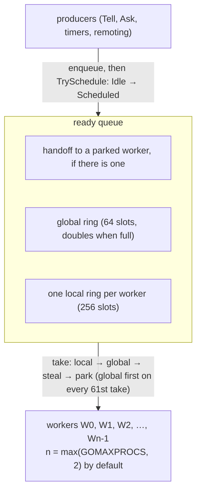

# 7. Dispatch

## Contents

- [What you will learn](#what-you-will-learn)
- [7.1 The pieces](#71-the-pieces)
- [7.2 The dispatch state](#72-the-dispatch-state)
  - [Not losing a wake-up](#not-losing-a-wake-up)
- [7.3 One turn](#73-one-turn)
- [7.4 The system queue](#74-the-system-queue)
- [7.5 The ready queue](#75-the-ready-queue)
  - [Where an actor goes](#where-an-actor-goes)
  - [Where a worker looks](#where-a-worker-looks)
  - [Why a wake-up cannot be lost](#why-a-wake-up-cannot-be-lost)
  - [Saturation](#saturation)
- [7.6 Failures leave the turn](#76-failures-leave-the-turn)
- [7.7 Stopping the pool](#77-stopping-the-pool)
- [Guarantees](#guarantees)
- [Implementation details (may change)](#implementation-details-may-change)
- [Behaviours to know](#behaviours-to-know)
- [Further reading](#further-reading)

## What you will learn

- How a fixed pool of goroutines runs every actor and grain in the system, and why no actor owns a goroutine.
- The three-state machine that makes sure one actor is never run by two workers at once, and how it avoids losing a wake-up.
- Exactly what one turn does, message by message, and when it gives the worker up.
- How the ready queue is built: per-worker local rings, a global ring, work stealing, and parking with direct handoff.
- How control messages jump the queue through the system queue.
- How failures leave the turn and reach supervision, and what that delay means.
- What happens when the pool is saturated.

Source files: `actor/dispatcher.go`, `actor/ready_queue.go`, `actor/worker.go`, `actor/dispatch_state.go`, `actor/system_queue.go`, `actor/supervision.go`, and the turn in `actor/pid.go`.

## 7.1 The pieces

An actor is not a goroutine. The `dispatcher` owns a fixed pool of worker goroutines that take ready actors from a shared ready queue and run them one *turn* at a time (`actor/dispatcher.go`). An actor or grain is anything with a `runTurn(w *worker)` method, the `schedulable` interface (`actor/ready_queue.go`). The worker knows nothing about mailboxes or actor state: it takes, runs a turn, and takes again (`actor/worker.go`). Keeping the worker ignorant of what it runs is deliberate: the dispatcher is a scheduling primitive, and a new kind of schedulable needs no change to the worker loop. Grains are the second kind ([Chapter 14, §14.3](chap-14.md#143-scheduling-and-the-turn)).

Each worker loops on `s := take(); s.runTurn(w)`, and a turn handles at most `throughput` messages, then yields.

This is the model of Akka, Pekko, Erlang and Orleans, adapted to Go: the number of workers is bounded by `GOMAXPROCS` and independent of the number of actors, and no actor runs a goroutine of its own to drain its mailbox (`dispatcher` in `actor/dispatcher.go`). The dispatcher sits below `PID.doReceive`, so no public API mentions it. What an application can observe is `runtime.NumGoroutine()`: it stays near the worker count instead of growing with the number of active actors.

| Setting | Default | Option | Source |
|---|---|---|---|
| Workers | `max(GOMAXPROCS, 2)`, and never fewer than 2 | `WithDispatcherPoolSize` | `NewActorSystem` in `actor/actor_system.go`; `dispatcherWorkerCount` in `actor/dispatcher.go` |
| Messages per turn | 32 | `WithThroughputBudget` | `dispatcherThroughput` in `actor/dispatcher.go` |

The floor of two workers has two reasons, each recorded in a comment. A handler that waits for another actor inside its turn holds its worker, and with one worker the actor it waits for could never run (`WithDispatcherPoolSize` in `actor/option.go`). And work stealing needs at least one sibling to steal from (`dispatcherWorkerCount` in `actor/dispatcher.go`).

The option's comment explains the other trade-off at length: every handler that blocks, on a database or an HTTP call, holds a worker for the whole wait, so with the default pool no more than `GOMAXPROCS` actors make progress at once. A larger pool lets more handlers wait, but slows dispatch for everyone: a producer scans the idle flags of the whole pool on each wake (`readyQueue.claimIdleWorker`), and a worker that finds nothing probes every sibling's ring (`readyQueue.trySteal`), both linear in the pool size. The comment gives the measured cost: with 256 workers on 8 CPUs, request/reply throughput drops by about 40% and grain tells by 10 to 25%, while the heap per actor is unchanged (`WithDispatcherPoolSize` in `actor/option.go`). Raise the pool only for handlers that wait in their turn, and size it like a connection pool.

The budget of 32 messages is a compromise between two costs: it spreads the cost of parking and waking a worker over a batch, and it bounds how long one actor can keep a worker from its peers (`dispatcherThroughput` in `actor/dispatcher.go`; `WithThroughputBudget` in `actor/option.go`).

The workers are not the system's only goroutines, but the others are few and none belongs to an actor:

| Goroutine | Count | Chapter |
|---|---|---|
| Dispatcher workers | the pool size | this chapter |
| Supervision consumer | 1 | [§7.6](#76-failures-leave-the-turn) |
| Passivation manager | 1 | 10, [§10.4](chap-10.md#104-the-loop) |
| Eviction loop | 1, when an eviction strategy is set | 10, [§10.7](chap-10.md#107-system-eviction) |
| Scheduler | go-quartz's own, while the scheduler runs | 11, [§11.1](chap-11.md#111-the-scheduler) |
| Cluster events loop | 1, in cluster mode | 3 |

Grains use the same dispatcher and the same pool ([Chapter 14, §14.3](chap-14.md#143-scheduling-and-the-turn)). `NewActorSystem` builds the dispatcher once the options are applied, and `Start` starts its workers before any actor is spawned ([Chapter 3, §3.3](chap-03.md#33-start)).

## 7.2 The dispatch state

Every PID has a `dispatchState`: one atomic word holding `Idle`, `Scheduled` or `Processing` (`dispatchIdle` in `actor/dispatch_state.go`). Every transition is a compare-and-swap or a store made by the one party allowed to make it:

| Transition | Method | Made by | Source |
|---|---|---|---|
| Idle → Scheduled | `TrySchedule` | a producer, after enqueuing; the winner pushes the actor onto the ready queue | `dispatchState.TrySchedule` in `actor/dispatch_state.go` |
| Scheduled → Processing | `TakeForProcessing` | the worker that took the actor from the ready queue | `dispatchState.TakeForProcessing` in `actor/dispatch_state.go` |
| Processing → Scheduled | `YieldToScheduled` | the turn, when its budget is spent | `dispatchState.YieldToScheduled` in `actor/dispatch_state.go` |
| Processing → Idle | `reset` | the turn, when it finds nothing left; a restart also forces `Idle`, once it has waited for the running turn to end and before `init` makes the new incarnation reachable, so no turn can be running when it does (`restartSubtree` in `actor/pid.go`) | `dispatchState.reset` in `actor/dispatch_state.go` |
| Idle → Processing | `TakeIdleForStop` | passivation, to own an idle actor while it stops it ([Chapter 3, §3.5](chap-03.md#35-stop)) | `dispatchState.TakeIdleForStop` in `actor/dispatch_state.go` |

Only `Processing` lets anyone run the actor's handler, and only one party can hold it, so an actor's messages are handled one at a time. `TrySchedule` reads before it tries the swap: when many producers send at once, all but one see `Scheduled` or `Processing` and return without touching the cache line in exclusive mode (`actor/dispatch_state.go`).

A send therefore costs one atomic read, at most one compare-and-swap and one mailbox operation; only the producer that wins `Idle → Scheduled` also pays for a push onto the ready queue.

### Not losing a wake-up

A producer enqueues and then calls `TrySchedule` (`PID.doReceive` in `actor/pid.go`). If the actor is `Processing` at that moment, the producer does nothing, and relies on the running turn to see its message. The turn honours that in `finishOrReclaim`:

1. Reset the state to `Idle` first.
2. Then check the mailbox, the system queue and the `PostStart` slot.
3. If anything is there, try to schedule again. If that succeeds, take the actor straight back with `TakeForProcessing` and carry on in the same turn. If another producer already scheduled it, leave it to the worker that will take it.

Because the reset comes before the check, every message falls into one of two cases. Either it was enqueued before the check, and the turn sees it. Or it was enqueued after the reset, and its producer's `TrySchedule` finds `Idle` and schedules the actor itself.

## 7.3 One turn

`runTurn` (`actor/pid.go`) starts by claiming the actor with `TakeForProcessing`. A worker that loses this race returns at once: the actor is already owned. Then, for at most `budget` iterations:

1. **Run a pending `PostStart`.** It is kept in its own slot rather than in a queue (`PID` in `actor/pid.go`), filled by `armPostStart` before the actor is announced as running. The turn checks the slot at every message boundary, because a restart can arm it while a turn is already running (`PID.runPendingPostStart` in `actor/pid.go`).
2. **Take one control message** from the system queue, if there is one, and dispatch it ([§7.4](#74-the-system-queue)).
3. **Check that the actor may handle user messages.** It may not while it is suspended, stopping or restarting, or while a failure awaits a supervision decision ([§7.6](#76-failures-leave-the-turn)). Then the turn gives the actor up and leaves the user messages queued (`PID.runTurn` and `PID.handlesUserMessages` in `actor/pid.go`). Giving up resets the state first and then looks again for work it may do, a control message or a resume that raced with it, with the same reset-then-check as below (`PID.releaseWithheldTurn` in `actor/pid.go`).
4. **Otherwise take one user message** from the mailbox. If there is none, call `finishOrReclaim`, which either ends the turn or reclaims the actor and goes round again.
5. **Dispatch it** with `dispatchOne`, which skips an `Ask` whose sender has given up, stashes it if reentrancy requires, and otherwise calls the handler on top of the behaviour stack (Chapters [5](chap-05.md) and [8](chap-08.md)).

When the loop runs out of budget, the turn moves the actor back to `Scheduled` and pushes it onto **its own worker's local queue** (`PID.runTurn` in `actor/pid.go`; `worker.reschedule` in `actor/worker.go`). It does so without looking whether work remains: an actor whose queues emptied on its last message is simply taken again, finds nothing, and goes to `Idle` through `finishOrReclaim`. The actor is appended at the **tail** of the ring, behind every actor already waiting there, so a busy actor cannot keep its worker from the others on that ring.

Two consequences follow from the loop:

- **Control messages win, but only between messages.** A `PoisonPill` sent while a handler runs is handled after that handler returns, ahead of the user messages still queued.
- **`time.Now()` is read once per turn**, and the same instant is used for every message the turn dispatches (`PID.runTurn` in `actor/pid.go`), for example as the actor's last-activity time for passivation.

## 7.4 The system queue

`doReceive` routes control messages to the actor's system queue instead of the mailbox (`actor/pid.go`): `PoisonPill`, `Panicking`, `PausePassivation`, `ResumePassivation`, `PanicSignal`, `Terminated` and `SendDeadletter` (`isControlMessage` in `actor/pid.go`). The queue is two pointers embedded in the PID, so an idle actor pays nothing for it. Its own comment says so too: `PostStart` is not among them, because it has its own slot ([§7.3](#73-one-turn)).

The split between a system queue and a user mailbox is the one Akka and Pekko use, and it exists so that the control plane never waits behind a backlog: a `PoisonPill` sent to an actor with 10,000 user messages queued stops it after the handler in progress, not after the 10,000. A custom mailbox given with `WithMailbox` only ever sees user messages and knows nothing of the system queue.

The reentrancy envelopes, `AsyncRequest` and `AsyncResponse`, are **not** control messages. They take part in the reentrancy stash and must keep their order relative to user messages, so they travel through the mailbox ([Chapter 8, §8.5](chap-08.md#85-reentrancy-requests-that-do-not-block)).

It is a lock-free stack with a twist that restores send order (`systemQueue` in `actor/system_queue.go`):

- **`push`** links the message in front of the current top and swings the top with a compare-and-swap, retrying on contention (`actor/system_queue.go`).
- **`pop`** works from a private batch. When the batch is exhausted, it swaps the whole stack out in one atomic swap and reverses it, so the batch comes out oldest first (`inSendOrder` in `actor/system_queue.go`). Everything in one batch was pushed before everything in the next, so the order across batches is preserved too.
- **Release** follows the same rule as the mailbox: the previously popped message is recycled on the next `pop`, including a `pop` that returns nil, so an idle actor holds no context.
- **`isEmpty`** reads only atomics, because `finishOrReclaim` may call it on a worker that has just given up the actor while the next owner is already popping (`actor/system_queue.go`).

The idle path, nothing held and nothing pushed, is two loads and no write. That matters because `runTurn` calls `pop` before every user message, and a write would evict a cache line that producers read on every send (`actor/system_queue.go`).

## 7.5 The ready queue

The ready queue holds actors that are `Scheduled`. It has one local ring per worker and one shared global ring (`readyQueue` in `actor/ready_queue.go`):

| Part | Structure | Capacity | Guarded by |
|---|---|---|---|
| Local queue | ring owned by one worker; siblings may steal from its head | 256, fixed (`localQueueCap` in `actor/ready_queue.go`) | its own mutex, plus an atomic size for lock-free emptiness checks (`localQueue` in `actor/ready_queue.go`) |
| Global queue | ring that doubles when full and never shrinks | starts at 64 (`globalQueueInitialCap` in `actor/ready_queue.go`) | `parkMu` |

Both rings exist to keep locks off the common path. The global queue is a ring rather than a slice that is re-sliced on every pop, because the backing array of such a slice grows without bound under steady churn (`globalQueue` in `actor/ready_queue.go`). Its length is mirrored in an atomic, `globalCount`, so a worker skips `parkMu` altogether when the global queue is empty (`readyQueue.popGlobal` in `actor/ready_queue.go`). Each local ring mirrors its length in an atomic too, so a thief passes an empty sibling with one load instead of taking its mutex; a worker walks the sibling array each time its own ring and the global queue are empty, and without that check the sibling mutexes would dominate the take loop (`readyQueue.trySteal` in `actor/ready_queue.go`).

### Where an actor goes

- **A producer** that schedules an actor calls `push`. It first tries to hand the actor straight to a parked worker; only if none is parked does it append to the global queue (`actor/ready_queue.go`).
- **A turn that yields** calls `pushLocal`, which appends to the worker's own local ring and spills to the global queue only when that ring is full (`actor/ready_queue.go`).

### Where a worker looks

`take` tries, in order, its own local ring, the global queue, stealing from a sibling, and finally parking (`actor/ready_queue.go`):

- **Stealing** visits the siblings in rotated order, skips any whose atomic size reads zero, and takes half of the first non-empty one. It returns the first stolen actor to run and appends the rest to its own ring, locking the two rings in address order so two thieves never deadlock (`readyQueue.trySteal` and `localQueue.stealHalf` in `actor/ready_queue.go`).
- **Parking** uses a per-worker *idle flag* and a one-slot *handoff* channel instead of a condition variable. A producer that finds a parked worker claims it with a compare-and-swap on its flag and sends the actor through the channel, bypassing the global queue and its mutex (`readyQueue.claimIdleWorker` in `actor/ready_queue.go`). The comment records why: with a shared condition variable, request/reply throughput under load fell below that of a single pair (`readyQueue` in `actor/ready_queue.go`).

The claim scan always starts at worker 0. That keeps wake-ups on the same few workers and their caches warm, and lets the rest sleep (`readyQueue.claimIdleWorker` in `actor/ready_queue.go`).

### Why a wake-up cannot be lost

A worker can be about to park just as a producer appends to the global queue. Two atomics settle it (`readyQueue` in `actor/ready_queue.go`):

- The parking worker stores its flag, then reads the global count. If the count is not zero, it un-parks and goes round the take loop (`readyQueue.parkAndTake` in `actor/ready_queue.go`).
- The producer stores the global count, then reads the number of parked workers. If it is not zero, it claims one and sends it `nil`, which means "look again" (`readyQueue.push` in `actor/ready_queue.go`).

The atomics are sequentially consistent, so at least one side sees the other. If a producer claims the flag in the instant before the worker un-parks, the worker reads the handoff anyway, so the channel is empty for the next claim (`readyQueue.parkAndTake` in `actor/ready_queue.go`).

### Saturation

A worker reads its own local ring before the global queue, and a busy actor that spends its budget goes back onto that same ring. If that were the only rule, a worker serving an actor whose mailbox never drains would never reach the global queue, and with every worker in that state an actor that became ready meanwhile would wait until one of those mailboxes emptied. So every 61st take, a worker reads the global queue first (`globalQueueCheckInterval` in `actor/ready_queue.go`), as Go's own scheduler does with its global run queue. The count is kept on the worker's local ring and touched only by its owner (`localQueue` in `actor/ready_queue.go`). A waiting actor is therefore reached within 61 turns of the busy ones; with slow handlers that can still take a while.

## 7.6 Failures leave the turn

When a handler panics or records an error with `ctx.Err`, `recovery` hands a supervision signal to the dispatcher (`actor/pid.go`). The dispatcher owns one supervision goroutine for the whole system (`actor/supervision.go`):

- `Submit` sends to a channel buffered for 1,024 signals, and blocks when it is full, unless the dispatcher is stopping (`actor/supervision.go`).
- `run` takes each signal and calls `notifyParent` unless the actor is no longer running, which drops signals for actors already suspended or stopping (`actor/supervision.go`). A resume directive does not suspend the actor, so under it every failure is decided in turn ([Chapter 9, §9.2](chap-09.md#92-from-a-failure-to-a-decision)).

The turn does not wait for supervision, but it does not carry on as if nothing happened either. `submitSupervision` marks the actor with `supervisionPendingState` before it queues the signal, on the failing turn itself (`actor/pid.go`). From then on the turn hands out no user message ([§7.3](#73-one-turn)); control messages still run. When `run` has decided, it clears the mark and schedules the waiting messages (`PID.resumeAfterSupervision` in `actor/pid.go`):

- after a resume, they run on the same actor;
- after a suspension they keep waiting, because a suspended actor handles no user message either, and `doReinstate` schedules them when the actor is reinstated (`actor/pid.go`);
- after a restart, the new incarnation handles them ([Chapter 6, §6.8](chap-06.md#68-stops-restarts-and-other-nodes)).

`ErrDead` is never supervised, so it pauses nothing. A failure handed to no consumer, because the dispatcher is stopping, lifts the pause at once.

## 7.7 Stopping the pool

`signalStop` closes the ready queue and stops the supervision goroutine, without waiting for either (`actor/dispatcher.go`). Like `start`, it is idempotent: a second call does nothing. Closing claims every parked worker and wakes it with `nil`; a worker that parks after that sees the closed flag in its own check (`readyQueue.close` in `actor/ready_queue.go`). A worker in the middle of a turn finishes it and exits on its next take. Not waiting is deliberate: `ActorSystem.Stop` may run on a worker, from inside a handler ([Chapter 3, §3.5](chap-03.md#35-stop)). A stopped dispatcher cannot be started again, so `Start` builds a new one ([Chapter 3, §3.7](chap-03.md#37-starting-again)).

## Guarantees

| Statement | Enforced by |
|---|---|
| The dispatch state allows exactly one owner, and the reclaim after a reset either wins or leaves the actor to the producer that scheduled it | `TestDispatchStateHappyPath`, `TestDispatchStateReclaimAfterReset` and `TestDispatchStateReclaimLosesRace` in `actor/dispatch_state_test.go` |
| A restart never hands the actor to a second worker while a turn is running | `TestRestartNeverRunsTwoTurns` in `actor/pid_test.go` |
| A schedulable that its worker reschedules is run again | `TestWorkerRescheduleUsesLocalQueue` in `actor/dispatcher_test.go` |
| A parked worker is woken by a push, and by `close` | `TestReadyQueueParkAndWake` and `TestReadyQueueCloseWakesParkedWorkers` in `actor/ready_queue_test.go` |
| A worker that parks finds work pushed while it was publishing its flag | `TestReadyQueueParkAndTakeFindsGlobalWorkAfterPublishing` and `TestReadyQueueNilHandoffRescans` in `actor/ready_queue_test.go` |
| A worker with nothing local or global steals from a sibling | `TestReadyQueueStealWhenLocalAndGlobalEmpty` in `actor/ready_queue_test.go` |
| Many producers and workers lose no schedulable | `TestReadyQueueMultiProducerConsumer` in `actor/ready_queue_test.go`; `TestDispatcherHighFanout` in `actor/dispatcher_test.go` |
| The system queue delivers in send order, under concurrent pushes | `TestSystemQueueSendOrder` and `TestSystemQueueConcurrentPushes` in `actor/system_queue_test.go` |
| The supervision consumer starts and stops idempotently, and drops a signal submitted before it starts or with a nil PID or signal | `TestSupervision` in `actor/supervision_test.go` |
| Messages queued behind a failure wait for the decision: none run while the actor is suspended, all run after a resume or a reinstate | `TestFailureWithholdsQueuedMessages` in `actor/pid_test.go` |
| A worker whose local ring never empties still serves the global queue | `TestReadyQueueTakeReachesGlobalUnderLocalLoad` in `actor/ready_queue_test.go` |

## Implementation details (may change)

- The 32-message budget, the 256-slot local rings, the global ring's starting size of 64, and checking the global queue every 61 takes.
- Stealing half, in rotated order, and the claim scan starting at worker 0.
- One shared supervision goroutine with a 1,024-signal buffer.
- Reading the clock once per turn.

## Behaviours to know

| Behaviour | Source |
|---|---|
| A blocking handler holds a worker for the whole wait; the default pool lets `GOMAXPROCS` handlers block at once | `WithDispatcherPoolSize` in `actor/option.go` |
| A control message waits for the handler that is running, then overtakes the queued user messages | `PID.runTurn` in `actor/pid.go` |
| When every worker serves a never-draining actor, another ready actor waits up to 61 of their turns | `globalQueueCheckInterval` in `actor/ready_queue.go` |
| A failure stops the actor's user messages until supervision decides; frequent errors under a resume directive pay a round trip through the supervision goroutine each | `PID.submitSupervision` in `actor/pid.go` |
| A full supervision buffer blocks the failing actor's worker | `supervision.Submit` in `actor/supervision.go` |

## Further reading

The designs this dispatcher borrows from:

- Akka dispatchers: <https://doc.akka.io/docs/akka/current/typed/dispatchers.html>
- Pekko dispatchers: <https://pekko.apache.org/docs/pekko/current/typed/dispatchers.html>
- The Erlang/OTP scheduler: <https://www.erlang.org/blog/a-closer-look-at-the-erlang-vm/>
- Orleans schedulers: <https://learn.microsoft.com/en-us/dotnet/orleans/implementation/scheduler>
- Tokio's work-stealing scheduler: <https://tokio.rs/blog/2019-10-scheduler>
- The Go runtime scheduler: <https://rakyll.org/scheduler/>
