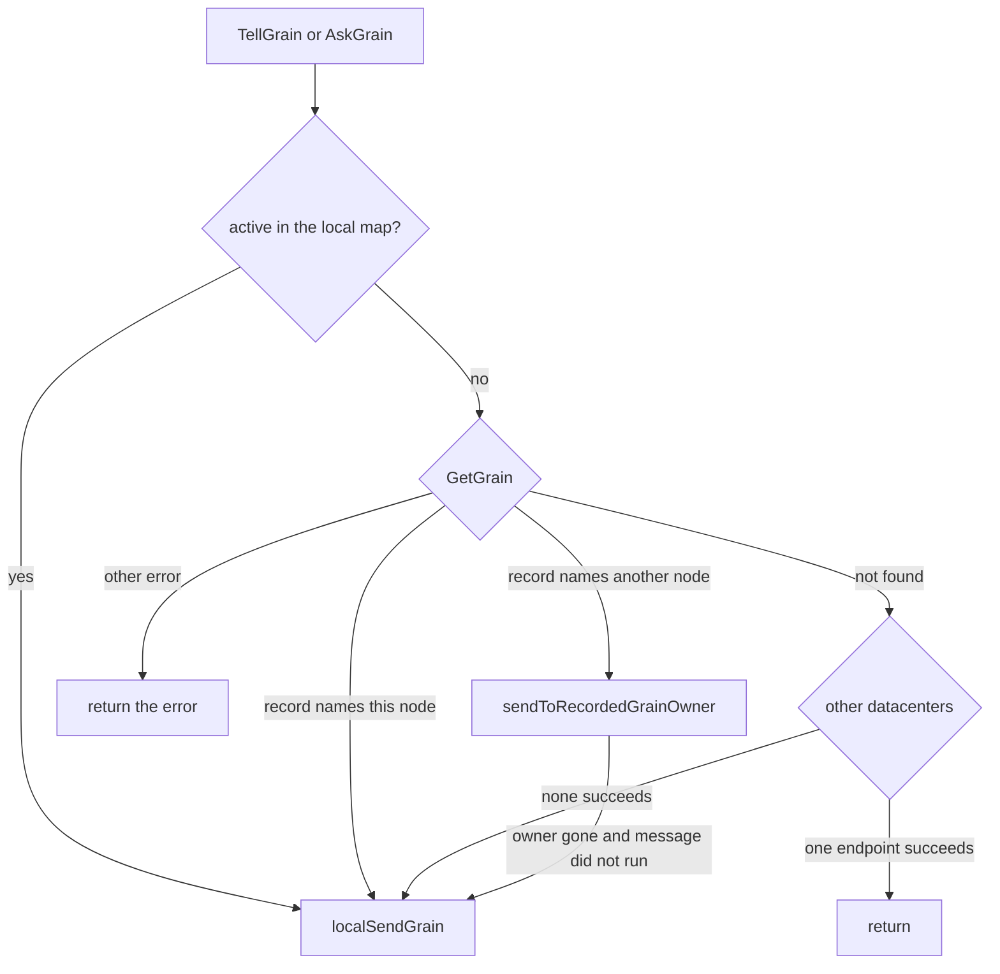
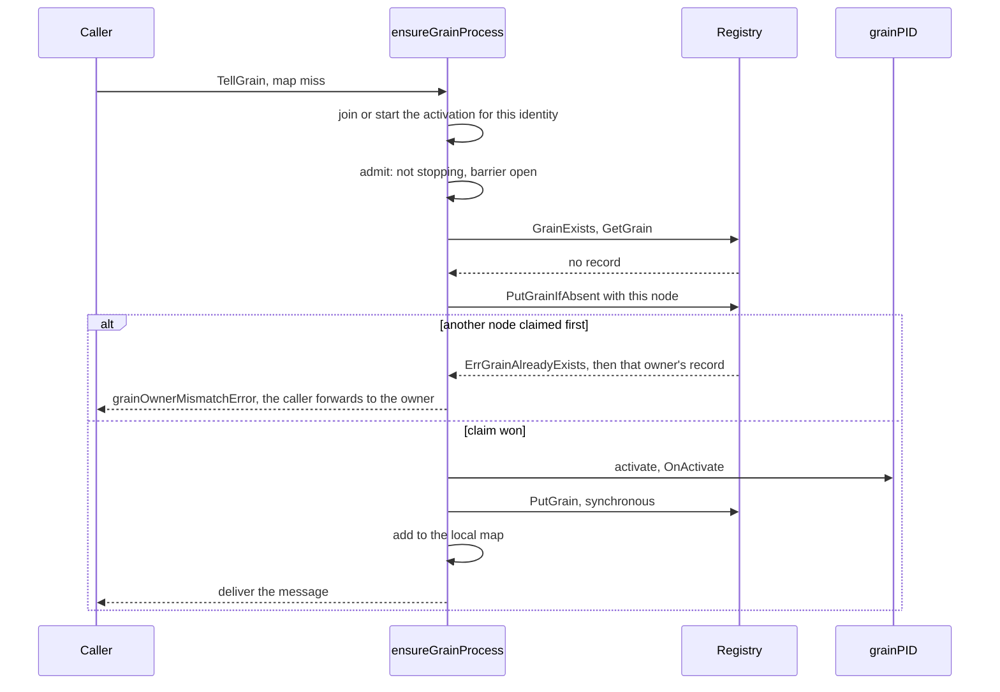

# 13. Grains: Model, Identity and Activation

## Contents

- [What you will learn](#what-you-will-learn)
- [13.1 The model](#131-the-model)
- [13.2 Identity](#132-identity)
- [13.3 Configuration](#133-configuration)
- [13.4 Finding a grain](#134-finding-a-grain)
  - [`GrainOf` and `GrainIdentity`](#grainof-and-grainidentity)
  - [`TellGrain` and `AskGrain`](#tellgrain-and-askgrain)
  - [On the receiving node](#on-the-receiving-node)
- [13.5 Activating on this node](#135-activating-on-this-node)
  - [The per-identity activation group](#the-per-identity-activation-group)
  - [`activate`](#activate)
  - [Reachable only once published](#reachable-only-once-published)
  - [Retried registry writes](#retried-registry-writes)
  - [A new grain in a cluster](#a-new-grain-in-a-cluster)
- [13.6 One activation per identity](#136-one-activation-per-identity)
  - [The activation barrier](#the-activation-barrier)
- [13.7 When the recorded owner is gone](#137-when-the-recorded-owner-is-gone)
  - [Classifying the failure](#classifying-the-failure)
  - [An activation request](#an-activation-request)
  - [A message from `AskGrain` or `TellGrain`](#a-message-from-askgrain-or-tellgrain)
- [13.8 Deactivation](#138-deactivation)
- [13.9 Actor versus grain](#139-actor-versus-grain)
- [Guarantees](#guarantees)
- [Implementation details (may change)](#implementation-details-may-change)
- [Behaviours to know](#behaviours-to-know)

## What you will learn

- What a grain is in GoAkt, what its three hooks receive, and how a grain differs from an actor.
- How a grain identity is built, printed, parsed and validated, and what a grain kind really is.
- Where a grain's configuration comes from on each activation, and which options survive on the wire.
- How `GrainOf`, `TellGrain` and `AskGrain` find a grain: on this node, through the cluster registry, in another datacenter, or by activating it.
- The local activation path step by step, and why a grain becomes reachable only after its registry record is written.
- How a cluster keeps one activation per identity, what the activation barrier adds, and what a call does when the recorded owner is gone.
- How a grain is deactivated: by passivation, by a `PoisonPill`, and at shutdown.

## 13.1 The model

A grain is a virtual actor. Nobody spawns it: a caller names it by identity, and the runtime activates it when it is first needed, keeps it in memory while it is used, and deactivates it after a period of idleness. In a cluster the runtime also decides where it lives.

A grain implements three methods (`Grain` in `actor/grain.go`):

| Hook | Runs | Receives | On failure |
|---|---|---|---|
| `OnActivate` | on every activation: first message, `GrainOf`, a remote activation request, relocation, reactivation after passivation | the caller's context bounded by the activation timeout ([§13.5](#135-activating-on-this-node)), and a `*GrainProps` | the activation fails with `ErrGrainActivationFailure`; a claim it made is released and the local map is left as it was |
| `OnReceive` | for each message, one at a time, on the grain's turn ([Chapter 14](chap-14.md)) | a `*GrainContext` | the error or a recovered panic goes back to the sender; the grain stays active |
| `OnDeactivate` | when the grain is deactivated ([§13.8](#138-deactivation)) | the context of whatever deactivates it, and a fresh `*GrainProps` | `ErrGrainDeactivationFailure`; the grain is inactive all the same |

The process that runs a grain is a `grainPID` (`actor/grain_pid.go`). It has no goroutine of its own: like an actor, it is scheduled on the system's shared dispatcher (`newGrainPID` in `actor/grain_pid.go`; [Chapter 7](chap-07.md)). Its mailbox, turn loop, context pool and timers are [Chapter 14](chap-14.md)'s subject. This chapter is about how a `grainPID` comes to exist, becomes reachable, and goes away.

**Construction from a kind.** A grain is built as the zero value of its registered type: `reflection.instantiateGrain` in `actor/reflection.go` looks the kind up in the system's type registry, fails with `ErrGrainNotRegistered` when it is missing, and calls `reflect.New`. Initialisation therefore belongs in `OnActivate`, and external resources come through `WithGrainDependencies` ([§13.3](#133-configuration)). The comment on `GrainOf` states this contract and notes it is the same one the cluster already applies when it recreates or relocates a grain on another node (`actor/grain_of.go`). The older `GrainFactory`, a function that returns a ready instance, is deprecated (`actor/grain.go`).

A kind reaches the registry in three ways:

| Path | Source |
|---|---|
| `GrainOf` registers its type parameter on first use | `actorSystem.grainOf` in `actor/grain_engine.go` |
| `RegisterGrainKind`, on a running system | `actorSystem.RegisterGrainKind` in `actor/grain_engine.go` |
| `ClusterConfig.WithGrains`, registered when the cluster is set up | `ClusterConfig.WithGrains` in `actor/cluster_config.go`; `actorSystem.setupCluster` in `actor/actor_system.go` |

The registry is the one actor kinds use too. `DeregisterGrainKind` removes a kind; its comment says it stops no running grain and only prevents new activations through the registry (`actor/grain_engine.go`). [§13.5](#135-activating-on-this-node) shows what that means for a grain already in memory.

**The local table.** Every grain this node runs is in `grains`, an `xsync.Map` from the identity string to its `grainPID` (`actorSystem` in `actor/actor_system.go`). An entry in the map is not the same as an active grain: `grainPID.isActive` reads an `activated` flag, and an entry can sit in the map inactive, as a failed `OnDeactivate` leaves it ([§13.8](#138-deactivation)). `Grains` returns the keys of this map and, in a cluster, merges them with a scan of the registry, sorted and without duplicates; if the scan fails it returns the local keys alone (`actorSystem.Grains` in `actor/grain_engine.go`).

**`GrainProps`** is what `OnActivate` and `OnDeactivate` receive: the identity, the actor system, the grain's dependencies, and a pointer to the process (`GrainProps` in `actor/grain_props.go`). A new one is built for each call (`grainPID.activate` and `grainPID.deactivate` in `actor/grain_pid.go`). Its `ScheduleOnce`, `Schedule`, `ScheduleWithCron` and `CancelSchedule` reach the grain's timer registry; their comments say a timer registered from `OnActivate` stays dormant until the activation completes, and that registration from `OnDeactivate` fails with `ErrGrainTimersStopped` (`actor/grain_props.go`). [Chapter 14](chap-14.md) covers timers.

## 13.2 Identity

A `GrainIdentity` is a kind and a name (`GrainIdentity` in `actor/grain_identity.go`):

- The **kind** is `types.Name` of the grain's type: the reflected type string, trimmed and **lower-cased**, which gives the package name and the type name, such as `actor.mockgrain` (`Name` in `internal/types/registry.go`). It is the package name, not the import path.
- The **name** identifies one grain within its kind.

The string form is `kind/name`, with `/` as the separator (`GrainIdentitySeparator` in `internal/id/separator.go`). It is the key of the local grains map and of the cluster registry.

**One string.** `newGrainIdentity` builds the full `kind/name` string once and keeps `kind` and `name` as slices of it, so an identity holds a single string and neither the reflected type name nor the caller's name stays alive on its own (`newGrainIdentity` in `actor/grain_identity.go`). `String` returns that cached string; for an identity built field by field it computes the string on the first call and caches it, which is safe because the fields never change. A nil identity prints as the empty string.

**Equality.** `Equal` compares kind and name and is false for a nil argument (`GrainIdentity.Equal` in `actor/grain_identity.go`).

**Validation.** `Validate` checks the **name only** (`GrainIdentity.Validate` in `actor/grain_identity.go`):

1. not empty;
2. at most 255 characters;
3. its trimmed form matches `^[a-zA-Z0-9][a-zA-Z0-9-_\.]*$`.

The error text for rule 3 mentions letters, digits, `-` and `_` but not the dot the pattern allows. The kind is never validated. The result is memoised with a `sync.Once`; the method comment says the regex compile and validation chain otherwise dominated the allocations of every `TellGrain` and `AskGrain`.

**Parsing.** `toIdentity` splits a string at the first `/` with `strings.Cut`, fails with `ErrInvalidGrainIdentity` when there is no separator, validates the result, and keeps the input as the cached string form so that the registry lookup that usually follows costs nothing (`toIdentity` in `actor/grain_identity.go`). The remote handlers and relocation rebuild identities this way. `toWireGrainID` goes the other way, to the protobuf `GrainId` with kind, name and value (`actor/grain_identity.go`).

**Reserved names.** A name with the reserved prefix `GoAkt` is refused with `ErrReservedName` before any activation (`actorSystem.validateGrainActivation` in `actor/grain_engine.go`; `isSystemName` and `reservedNamesPrefix` in `actor/reserved.go`), and by the remote ask and tell handlers (`actorSystem.remoteAskGrainHandler` and `actorSystem.remoteTellGrainHandler` in `actor/remote_server.go`).

**Kind conflicts.** Because the kind keeps only the package name and is lower-cased, two different types can map to the same kind: types of the same name in two packages with the same package name, or two types in one package whose names differ only in case. `grainOf` checks that a kind already in the registry maps to the caller's type and fails with `ErrGrainKindConflict` otherwise; its comment explains that silently instantiating the other type would route messages to the wrong implementation (`actorSystem.grainOf` in `actor/grain_engine.go`). Only `GrainOf` checks this. `RegisterGrainKind` registers its type without a check, and the registry's `Register` replaces whatever the kind mapped to before (`registry.Register` in `internal/types/registry.go`). The deprecated `GrainIdentity` never checks either: it registers its type only when the kind is missing (`actorSystem.activateGrainLocally` in `actor/grain_engine.go`), so under a conflict it activates the factory's instance while the registry keeps naming the other type.

## 13.3 Configuration

An activation runs with a `grainConfig` (`actor/grain_option.go`). `newGrainConfig` sets the defaults and applies the options in order, so a later option wins over an earlier one:

| Option | Field | Default | Meaning | On the wire |
|---|---|---|---|---|
| `WithGrainInitMaxRetries` | `initMaxRetries` | 5 (`DefaultInitMaxRetries`) | attempts of `OnActivate`, the first included; zero or less means five | yes |
| `WithGrainInitTimeout` | `initTimeout` | 1 s (`DefaultInitTimeout`) | bound on the activation, see [§13.5](#135-activating-on-this-node) | yes |
| `WithGrainDeactivateAfter` | `deactivateAfter` | 2 min (`DefaultPassivationTimeout`) | idle time before passivation | **no** |
| `WithLongLivedGrain` | `deactivateAfter` | | sets it to -1: never passivate | **no** |
| `WithGrainDependencies` | `dependencies` | none | injected into `GrainProps`; a nil dependency is skipped, a repeated ID replaces the earlier one | yes |
| `WithActivationStrategy` | `activationStrategy` | `LocalActivation` | where a new grain is placed in a cluster, [§13.4](#134-finding-a-grain) | **no** |
| `WithActivationRole` | `role` | none | only nodes advertising the role may host it | yes |
| `WithGrainMailboxCapacity` | `capacity` | unbounded | a positive value bounds the mailbox; zero or less is ignored | yes |
| `WithGrainDisableRelocation` | `disableRelocation` | false | the grain is lost with its node; its record is released ([Chapter 21](chap-21.md)) | yes |
| `WithGrainEagerRelocation` | `eagerRelocation` | false | reactivate at once on a survivor when the node leaves, instead of on next use ([Chapter 21](chap-21.md)) | yes |
| `WithGrainReentrancy` | `reentrancy` | none | the grain's request policy ([Chapter 8, §8.6](chap-08.md#86-reentrancy-in-grains)) | yes, the live policy |

`grainConfig.Validate` rejects disable and eager relocation together (`ErrGrainRelocationConflict`), an invalid reentrancy policy, and a dependency whose ID does not validate (`actor/grain_option.go`). The dependency map is allocated only when a dependency is registered (`WithGrainDependencies` in `actor/grain_option.go`).

**Defaults per kind.** `WithGrainDefaultOptions[T]` declares options for every grain of kind `T` on the actor system (`WithGrainDefaultOptions` in `actor/option.go`). `grainKindOptions` puts them **before** the options of the call or of a registry record, so those win (`actorSystem.grainKindOptions` in `actor/grain_engine.go`). A type that is not a pointer to a struct is ignored, and a second declaration of the same kind replaces the first.

**Where each activation gets its configuration.** Options are properties of an activation, not of an identity. Each path builds its configuration from a different source:

| Activation path | Configuration | Source |
|---|---|---|
| `GrainOf` or `GrainIdentity` | kind defaults, then the call's options | `actorSystem.validateGrainActivation` in `actor/grain_engine.go` |
| a send that creates the grain, no registry record | kind defaults only | `actorSystem.ensureNewGrainProcess` in `actor/grain_engine.go` |
| a send that creates the grain, with a record naming this node | kind defaults, then the record's options | `actorSystem.ensureNewGrainProcess` and `actorSystem.grainOptionsFromWire` in `actor/grain_engine.go` |
| a remote activation request, relocation | kind defaults, then the record's options | `actorSystem.recreateGrainOnce` in `actor/grain_engine.go` |
| any path that finds an inactive entry in the map | the configuration that process was built with; the call's or the record's options are not applied | `actorSystem.ensureExistingGrainProcess`, `actorSystem.activateGrainLocally` and `actorSystem.recreateGrainOnce` in `actor/grain_engine.go` |

The comment on `WithGrainDefaultOptions` spells out the consequence: without kind defaults, a bare `AskGrain` or `TellGrain` that finds the grain passivated reactivates it with the package defaults whatever an earlier `GrainOf` said, and a grain activated on another node gets the default idle timeout (`actor/option.go`).

**The wire record.** `wireGrain` is the one place that turns an identity and a configuration into the registry and wire record `internalpb.Grain`; its comment says live processes and claim-time records both go through it so the two cannot drift (`wireGrain` in `actor/grain_pid.go`). It carries the identity, the owner's host and remoting port, dependencies, activation timeout and retries, mailbox capacity, the relocation flags, reentrancy and role. It carries **no idle timeout and no activation strategy**, which is why a record-driven activation takes those from the kind defaults or the package defaults. `grainPID.toWireGrain` overwrites the reentrancy with the live policy, so one enabled at runtime survives relocation and remote activation (`actor/grain_pid.go`). `grainOptionsFromWire` turns a record back into options, the role included; its comment says dropping the role would lose the constraint at the next relocation (`actor/grain_engine.go`).

**Remote requests.** A remote activation is described by a `remote.GrainRequest`: name, kind and the same settings as the record (`GrainRequest` in `remote/grain_request.go`). `getGrainFromRequest` validates it, sanitises it and builds the record (`internal/remoteclient/client.go`). `GrainRequest.Sanitize` trims name and kind and turns a non-positive timeout into one second and non-positive retries into five (`remote/grain_request.go`). The requests for an ask or a tell carry only name and kind (`actorSystem.sendRemoteTellGrainRequest` in `actor/grain_engine.go`).

## 13.4 Finding a grain

Four entry points reach a grain. All of them refuse with `ErrActorSystemNotStarted` when the system is not started or is stopping.

| Entry point | Activates | Returns after | Source |
|---|---|---|---|
| `GrainOf[T]` | yes, here or on a chosen peer | the grain is active somewhere, or claimed by another node | `GrainOf` in `actor/grain_of.go` |
| `GrainIdentity` (deprecated) | yes, same path, with the factory's instance | the same | `actorSystem.GrainIdentity` in `actor/grain_engine.go` |
| `TellGrain` | yes, if not active anywhere | the grain acknowledged the message, or with `WithOneWay` the enqueue | `actorSystem.TellGrain` in `actor/grain_engine.go` |
| `AskGrain` | yes, if not active anywhere | the reply, the timeout or the end of the caller's context | `actorSystem.AskGrain` in `actor/grain_engine.go` |

`TellGrain` and `AskGrain` validate the identity first and wrap a failure in `ErrInvalidGrainIdentity`. An acknowledged `TellGrain` passes `DefaultGrainRequestTimeout`, five seconds (`actor/defaults.go`), as its timeout. That bounds only the wait for the acknowledgement from a process on this node: the timer starts in `localTellGrain`, after `ensureGrainProcess` returns, so the registry read, the activation barrier and the activation itself ([§13.5](#135-activating-on-this-node), [§13.6](#136-one-activation-per-identity)) come on top (`actorSystem.localSendGrain` and `actorSystem.localTellGrain` in `actor/grain_engine.go`). A tell forwarded to a remote owner has no bound of its own on the calling node: the remoting client waits only on the caller's context (`client.remoteTellGrain` in `internal/remoteclient/client.go`), and the owner's `remoteTellGrainHandler` applies no deadline from the request and passes the same five seconds to its own `localSendGrain` (`actorSystem.remoteTellGrainHandler` in `actor/remote_server.go`). Both strip the internal refusal mark from the error they return ([§13.7](#137-when-the-recorded-owner-is-gone)). How a message is delivered once the grain is found, on the reply channel, the acknowledgement channel or an envelope, is [Chapter 14](chap-14.md)'s subject, and the envelope path for reentrant grains is in [Chapter 8, §8.6](chap-08.md#86-reentrancy-in-grains).

### `GrainOf` and `GrainIdentity`

`GrainOf` checks that the system is not nil and that `T` is a pointer to a struct (`ErrInvalidGrainKind`), then calls `grainOf` with a nil `T` as a prototype (`GrainOf` in `actor/grain_of.go`). The prototype only names the kind; no instance is built unless this node activates the grain, and then from the registry (`actorSystem.grainOf` in `actor/grain_engine.go`). `GrainIdentity` calls the factory first, on every call, and uses its instance if this node activates a new process (`actorSystem.prepareGrainIdentity` in `actor/grain_engine.go`).

Both then run `activateGrain` (`actor/grain_engine.go`). In order:

1. **Fast path.** A grain in the map, active, with its kind still registered, is owned here: return at once, with no registry traffic.
2. **Owner.** In a cluster, read the record: `getGrainOwner` asks `GrainExists`, then `GetGrain`, and treats a record that vanished between the two as no record (`actorSystem.getGrainOwner` in `actor/grain_engine.go`). Outside a cluster there is no owner.
3. **Remote owner.** A non-empty record naming another node: send it a remote activation request with that record (`actorSystem.sendRemoteActivateGrain` in `actor/grain_engine.go`) and return. If the request fails, [§13.7](#137-when-the-recorded-owner-is-gone) decides whether the record is released; when it is, the call carries on to step 5 and claims the grain like any unowned one.
4. **No record: pick a node.** `findActivationPeer` lists the members, which include this node, keeps those with the required role (failing with "no nodes with role ..." if none has it), and returns nothing when one or no member is left; otherwise the strategy picks (`actorSystem.findActivationPeer`, `actorSystem.filterPeersByRole` and `actorSystem.selectActivationPeer` in `actor/grain_engine.go`). Returning nothing means activating here, so when exactly one member has the role and it is another node, the grain is activated on this node, which lacks the role. If the pick is another node, `tryPeerActivation` claims the grain for it and asks it to activate ([§13.6](#136-one-activation-per-identity)). An empty record skips this step and goes to step 5.
5. **Activate here** with `activateGrainLocally` ([§13.5](#135-activating-on-this-node)). A record naming this node, or an empty record, is passed along and no claim is made; anything else goes through the atomic claim.

| Strategy | Pick | Source |
|---|---|---|
| `LocalActivation` (default) | this node | `actorSystem.selectActivationPeer` in `actor/grain_engine.go` |
| `RandomActivation` | a uniformly random member | the same |
| `RoundRobinActivation` | the next value of a cluster-wide counter, modulo the member count | `actorSystem.grainsRoundRobinActivationPeer` in `actor/grain_engine.go` |
| `LeastLoadActivation` | the member reporting the lowest load, asked in parallel; a node's load is its actor count plus its grain count; if any member cannot be asked, the activation fails | `actorSystem.leastLoadedPeer` in `actor/grain_engine.go`; `actorSystem.getNodeMetricHandler` in `actor/remote_server.go` |

The strategy applies only to a grain with no record: the option comments say a grain that exists on another node is activated there instead (`ActivationStrategy` in `actor/grain_option.go`). A send that creates a grain never consults the strategy or the role and always activates on the node that handles the send (`actorSystem.ensureNewGrainProcess` in `actor/grain_engine.go`).

### `TellGrain` and `AskGrain`

Outside a cluster both go straight to `localSendGrain`, which finds or activates the grain on this node (`actor/grain_engine.go`). In a cluster they go through `remoteTellGrain` and `remoteAskGrain`:

The fast path checks only that the grain is in the map and active; the comment explains that a grain being relocated is deactivated during the handoff, so it falls through to the registry (`actorSystem.remoteTellGrain` in `actor/grain_engine.go`). A record naming this node is delivered in-process, which skips a loopback round trip. `sendToRecordedGrainOwner` forwards to the remote owner and, when [§13.7](#137-when-the-recorded-owner-is-gone) says the owner is gone and the message did not run, sends it once more on this node.

**Other datacenters.** When the registry has no record, `tellGrainAcrossDataCenters` and `askGrainAcrossDataCenters` send the message to every endpoint of every active datacenter in parallel, bounded by the smaller of the datacenter request timeout and the call's timeout, and return on the first success (`actor/grain_engine.go`). Without a datacenter controller, with no records or no active endpoint, they fail at once with `ErrActorNotFound`; a stale cache with fail-on-stale set fails them with `ErrDataCenterStaleRecords`. Whatever the failure, the call then activates the grain here. An ask answered with a nil response counts as not found. [Chapter 22](chap-22.md) covers the datacenter layer.

**`localSendGrain`** calls `ensureGrainProcess` ([§13.5](#135-activating-on-this-node)). If that reports that another node owns the grain (a `grainOwnerMismatchError`), it forwards the message to that owner with `sendToGrainOwner`, once and never again from here (`actorSystem.localSendGrain` and `actorSystem.sendToGrainOwner` in `actor/grain_engine.go`). Otherwise it hands the message to the local process according to the mode, which [Chapter 14](chap-14.md) describes.

### On the receiving node

Three remote handlers serve grains (`actor/remote_server.go`):

| Request | Handler | Does |
|---|---|---|
| `RemoteAskGrain` | `actorSystem.remoteAskGrainHandler` | checks remoting, host and port, deserialises, rebuilds the identity with `toIdentity`, refuses reserved names, then `localSendGrain` in ask mode |
| `RemoteTellGrain` | `actorSystem.remoteTellGrainHandler` | the same; an `AsyncRequest` or `AsyncResponse` envelope goes to `deliverAsyncEnvelope` instead ([Chapter 8, §8.6](chap-08.md#86-reentrancy-in-grains)); otherwise `localSendGrain` in tell or one-way mode with `DefaultGrainRequestTimeout` |
| `RemoteActivateGrain` | `actorSystem.remoteActivateGrainHandler` | `recreateGrain` with the record from the request; `ErrSystemShuttingDown` is answered as a failed precondition, any other error as an internal error |

Because the ask and tell handlers call `localSendGrain`, a message that reaches a node which does not run the grain activates it there, or forwards it once to the owner the registry names. `grainSendError` maps a send failure to the code the remote caller decodes back into the same sentinel: `ErrMailboxFull` to resource exhausted, `ErrRequestTimeout` and a deadline to deadline exceeded, `ErrDead` and `ErrSystemShuttingDown` to failed precondition, anything else to an internal error, logged. A refusal by the node is flagged on the wire (`actorSystem.grainSendError` in `actor/remote_server.go`; [§13.7](#137-when-the-recorded-owner-is-gone)).

`recreateGrain` runs `recreateGrainOnce` inside the per-identity activation group ([§13.5](#135-activating-on-this-node)) (`actor/grain_engine.go`). For a grain not in the map it admits the activation, instantiates the kind, configures it from the record, activates and publishes. For a grain in the map it registers the kind if needed, activates it if it is inactive, and publishes its record again. It makes **no claim**, and its publication overwrites the record with this node. The senders of the request handle the claim: `tryPeerActivation` claims the grain for this node before it sends ([§13.6](#136-one-activation-per-identity)), and the `GrainOf` path sends an existing owner its own record ([§13.4](#134-finding-a-grain), step 3).

## 13.5 Activating on this node

### The per-identity activation group

`ensureGrainProcess` is the entry for every send (`actor/grain_engine.go`):

1. **Fast path.** A process in the map and active is returned at once. The comment explains why it skips the registry check: the check takes the registry's lock on every send, registrations are set at startup, and the slow path validates on reactivation.
2. Otherwise `runGrainActivation` runs the slow path inside `grainActivation`, a `singleflight.Group` keyed by the identity string, so concurrent callers for one identity share one attempt and its result (`actorSystem.runGrainActivation` in `actor/grain_engine.go`).

The group uses `Do`, not `DoChan`. A caller that joins an attempt in progress blocks until it ends, whatever its own context does, and the attempt runs with the **first** caller's context. `activateGrainLocally` and `recreateGrain` use the same group and key, so a `GrainOf`, a send and a remote activation request that arrive together for one identity share one attempt: a caller that joins gets the result of the attempt already running, whichever path started it.

Inside the group, the path depends on whether the map has an entry.

**No entry: `ensureNewGrainProcess`** (`actor/grain_engine.go`). In order:

1. `admitGrainActivation`: refuse with a marked `ErrSystemShuttingDown` once the node is stopping, otherwise wait for the activation barrier ([§13.6](#136-one-activation-per-identity)).
2. Instantiate the kind from the registry.
3. In a cluster, read the record. One naming another node returns a `grainOwnerMismatchError` and the caller forwards.
4. Configure: from a record naming this node, its options over the kind defaults; with no record, the kind defaults. The comment explains the first case: such a record is a claim another node made on this node's behalf ([§13.6](#136-one-activation-per-identity)) whose activation request did not complete, and it carries the caller's configuration.
5. Build the `grainPID`.
6. With no record, claim the grain (`claimGrainOwnership`). A claim won by another node returns a `grainOwnerMismatchError`.
7. `activate`. On failure, release the claim this call made.
8. `finalizeGrainActivation`: publish, then make the grain reachable.

**An entry in the map: `ensureExistingGrainProcess`** (`actor/grain_engine.go`). The fast path missed it, so it was inactive a moment ago:

1. If the kind is no longer registered, delete the entry and fail with `ErrGrainNotRegistered`; the comment calls this a guard against stale entries.
2. If the process is inactive: admit, check ownership and claim if there is no record (`ensureGrainOwnership`), activate with `activateUnreachable`, release the claim on failure, and finalise.
3. A process that turned active meanwhile is returned as it is.

**`GrainOf` and `GrainIdentity`: `activateGrainLocally`** follows the same shape with these differences (`actor/grain_engine.go`):

- It reads no record itself: it uses the one `activateGrain` read before entering the group ([§13.4](#134-finding-a-grain)), and claims in a cluster whenever that record was absent, even when the process it finds is already active.
- It takes the existing process, with the configuration it was built with, or builds one with the caller's provider and configuration.
- It registers the grain's kind if it is missing, where the send path deletes the entry and fails.
- It claims **before** it admits, rolling the claim back if admission refuses.
- A claim lost to another node is not an error here: the grain lives there, and `GrainOf` returns the identity.

### `activate`

`grainPID.activate` (`actor/grain_pid.go`):

1. Moves the timer phase to activating, so timers scheduled from `OnActivate` stay dormant ([Chapter 14](chap-14.md)).
2. Derives a context from the caller's with the activation timeout, and runs `OnActivate` through `internal/retry` with `initMaxRetries` attempts. `OnActivate` receives that context, so unlike an actor's `PreStart` ([Chapter 4, §4.4](chap-04.md#44-prestart-retries-and-the-timeout-that-is-not-one)) it does see the activation deadline. The context is cancelled as soon as `activate` returns, so work `OnActivate` starts on it ends with the activation.
3. Recovers a panic in `OnActivate` into an `ErrGrainActivationFailure` that wraps a `PanicError`. The panic leaves the retry loop, so a panicking `OnActivate` is not tried again. A failed activation drops every timer it scheduled.
4. On success: sets `activated` and the activation time, records activity, registers with the passivation manager when the idle timeout is positive (`grainPID.shouldAutoPassivate` in `actor/grain_pid.go`), and starts the timers.

The retrier is built as `retry.NewRetrier(retries, timeout, timeout)`: the delay before the second attempt is the activation timeout itself, with the retrier's jitter of plus or minus 50%, inside a loop the same timeout bounds (`NewRetrier` in `internal/retry/retry.go`). A failing `OnActivate` therefore gets a second attempt only when the jittered delay falls inside what is left of the timeout, and practically never a third, whatever `initMaxRetries` says. The retry loop then waits out its delay until the timeout ends it, so an `OnActivate` that fails at once makes the activation fail when the activation timeout expires, not earlier.

### Reachable only once published

**A grain this call activated enters the local map only after its registry record is written.** `finalizeGrainActivation` (`actor/grain_engine.go`) and its comment give the reasons:

- No local send can reach the grain before the record exists. A send that misses it in the map takes the slow path, joins the activation in `runGrainActivation`, and uses its result.
- A failed publication rolls the grain back while no turn can be running, so the rollback's `OnDeactivate` never overlaps an `OnReceive`.

`activateUnreachable` extends this to a process that sits inactive in the map: it takes the entry out for the activation and puts it back only if the activation fails, leaving the map as it was; on success `finalizeGrainActivation` puts it back after publishing (`actorSystem.activateUnreachable` in `actor/grain_engine.go`).

Publication is `putGrainOnCluster`, a synchronous write of the record, a no-op outside a cluster and for reserved names (`actorSystem.putGrainOnCluster` in `actor/actor_system.go`), retried by `retryGrainRegistryWrite` (below). What `finalizeGrainActivation` does then depends on what this call did:

| Situation | Result |
|---|---|
| published, grain activated here | the grain enters the map |
| published, grain already active on entry | nothing changes; the entry was set again before publishing |
| node stopping (cluster) | **nothing is published**, because the shutdown may already have released the record; the call fails with a marked `ErrSystemShuttingDown` and rolls back as below |
| published for a grain this call activated, but the node began stopping meanwhile (cluster) | the same refusal and rollback: the shutdown cleanup may have missed this record; a grain already active on entry is left as it is |
| publication failed, after the retries | the error, and the rollback below |

The rollback undoes exactly what the call created:

| Grain on entry | Rollback |
|---|---|
| activated by this call | `deactivate`, which runs `OnDeactivate`, removes the entry and releases the record; if `deactivate` itself fails, the entry is deleted and a claim this call made is released anyway |
| already active | the grain is left running and in the map; only a claim this call made is released |

The rollback runs on a context without cancellation, so it happens even when the publication failed because the caller's context ended. A failed rollback on a stopping node is logged as a warning, on a running node as an error.

### Retried registry writes

The claim, the publication and the release of an owner's record go through `retryGrainRegistryWrite`: at most three attempts, with a delay that starts at 100 ms, doubles with jitter and is capped at 500 ms, within the caller's context (`grainRegistryWriteAttempts`, `grainRegistryWriteInitialDelay` and `grainRegistryWriteMaxDelay` in `actor/grain_engine.go`). The constant's comment gives the reason: while a node leaves, the registry can still route a write to that node's store and fail it, and the condition clears by itself. `ErrGrainAlreadyExists` is an answer, not a failure, and is not retried; nor is anything once this node is stopping. The other releases (a rolled-back claim, a deactivation, the shutdown cleanup, the rollback of a claim made for a peer) are single attempts.

Reads of the registry on the send and activation paths go through `retryGrainRegistryRead`: the record lookup of `TellGrain` and `AskGrain`, both reads of `getGrainOwner`, and the read of the winner's record after a lost claim (`actorSystem.getGrainRecord` and `actorSystem.retryGrainRegistryRead` in `actor/grain_engine.go`). Only a read that ran out of its own timeout, `ErrClusterRegistryTimeout`, is read again, with the same bounds as a write (`grainRegistryReadAttempts`, `grainRegistryReadInitialDelay` and `grainRegistryReadMaxDelay`); the constants' comment gives the reason, a read routed to a node that just left while the registry converges. Any other error, `ErrGrainNotFound` included, is an answer and is returned at once, and nothing is read again once this node is stopping.

### A new grain in a cluster

## 13.6 One activation per identity

The user documentation promises at most one activation per identity at a time (`docs/grains/overview.mdx`). In a cluster the registry decides it. This section gives what the grain engine does; [Chapter 20](chap-20.md) covers the registry and Olric, and [Chapter 21](chap-21.md) relocation.

**The atomic claim.** Before activating a grain with no record, a node claims it with `PutGrainIfAbsent`, a put with Olric's `NX` option that fails with `ErrGrainAlreadyExists` when the key exists (`PutGrainIfAbsent` in `internal/cluster/cluster.go`). The first claim wins. `tryClaimGrain` turns the outcome into three cases (`actorSystem.tryClaimGrain` in `actor/grain_engine.go`):

| Put | Then | Returns |
|---|---|---|
| written | | claimed, with the record just written |
| `ErrGrainAlreadyExists` | read the record | not claimed, with the winner's record |
| `ErrGrainAlreadyExists` | the record is gone by the time it is read | not claimed, no owner |
| other error | | the error |

A winner on another node makes the caller forward the message there (`claimGrainOwnership` in `actor/grain_engine.go`). A winner that is this node, or no owner at all, lets the activation go on **without a claim**: a failure afterwards releases nothing on behalf of the claim. The publication in `finalizeGrainActivation` is always a plain, unconditional `PutGrain`, so in the no-owner case it overwrites whatever record is there by then, including one a third node claimed between the failed put and the publication.

`tryPeerActivation` ignores the record `tryClaimGrain` returns: any lost claim, the no-owner case included, ends the call with success (below).

**Releases are conditional.** Every release, whether a rolled-back claim, a deactivation, a stale owner's record or the shutdown cleanup, goes through `cluster.ReleaseGrain`, which deletes the record only while it still names the expected node, comparing and deleting under a cluster-wide lock on the grain (`cluster.ReleaseGrain` in `internal/cluster/cluster.go`). Its comment explains why claims need no lock: a put-if-absent cannot succeed while a record exists, so a claim lands only after a release, and a later release finds the new owner and leaves it alone. `rollbackGrainClaim` releases a record naming this node and logs a failure rather than discarding it (`actorSystem.rollbackGrainClaim` in `actor/grain_engine.go`).

**Claiming for a peer.** When `GrainOf` picks another node ([§13.4](#134-finding-a-grain)), `tryPeerActivation` builds the record with the caller's configuration, points it at the peer, claims it, and sends the peer a remote activation request (`actor/grain_engine.go`). The peer's `recreateGrain` activates the grain and publishes the record again under its own name ([§13.4](#134-finding-a-grain)). The outcomes:

| What happens | Claim | Call returns |
|---|---|---|
| the claim is lost, whether the winner's record is still there or has vanished | none made | success, without contacting the winner; in the vanished case no node has activated the grain |
| the peer activates the grain | kept, then rewritten by the peer | success |
| the peer answers `ErrSystemShuttingDown` | released while it names the peer | the grain is activated here instead |
| any other error that is not a transport failure | released while it names the peer | the error |
| a transport failure (a failed dial included), or the caller's context ended | **kept** | the error |
| the release itself fails | kept | the error |

The comment explains the split: a claim is rolled back only when the activation is known not to have happened, because the peer answered with an error or the request never left this node; after a transport failure or an expired context the outcome is unknown, so the claim stays. The peer then activates the grain on the first message routed to it, with the configuration the record carries ([§13.5](#135-activating-on-this-node)), and a departed peer's record is released by the next activation ([§13.7](#137-when-the-recorded-owner-is-gone)).

**An empty record** returned by the registry on the `GrainOf` path is inherited without a claim and overwritten by the local publication (`actorSystem.activateGrain` in `actor/grain_engine.go`).

### The activation barrier

The barrier is an opt-in gate that delays activations until the cluster is considered ready (`grainActivationBarrier` in `actor/grain_activation_barrier.go`). Its type comment names the problem: during bootstrap, before membership converges, several nodes can activate the same grain. It also says when the barrier is worth it: clusters that receive grain traffic before membership is stable, grains with side effects at activation, and random or least-load activation during bootstrap; and when it is not: single nodes, clusters that see no grain traffic until membership is stable, and grains whose duplicate early activation is harmless.

- **Enabled** by `ClusterConfig.WithGrainActivationBarrier(timeout)` (`actor/cluster_config.go`). Without it there is no barrier and admission never waits (`actorSystem.setupGrainActivationBarrier` in `actor/grain_engine.go`).
- **Opens** once the member list holds at least `minimumPeersQuorum` members (a quorum of zero counts as one). It is checked when the cluster starts, opening at once for a quorum of one, and again on every `NodeJoined` event (`actorSystem.tryOpenGrainActivationBarrier` in `actor/grain_engine.go`; `actorSystem.handleNodeJoinedEvent` in `actor/actor_system.go`). The membership read is bounded by the cluster read timeout, or one second; a read that fails leaves the barrier closed until the next check. Nothing re-checks it on a timer or on `NodeLeft`. Once open it stays open, and a check is the read of a closed channel.
- **Waits** in `admitGrainActivation`, so on every path that creates or reactivates a process. With a positive timeout, one activation that waits that long fails with `ErrGrainActivationBarrierTimeout`; with zero it waits as long as its context allows, and a context that ends first returns its own error (`grainActivationBarrier.wait` in `actor/grain_activation_barrier.go`). The timeout is per waiting activation, counted from its own call, not from startup. Expiry fails that activation and leaves the barrier closed: the activation does not go ahead without quorum. On `activateGrainLocally` the claim is already written while it waits, and is rolled back when the wait fails ([§13.5](#135-activating-on-this-node)).

## 13.7 When the recorded owner is gone

A record can name a node that no longer runs the grain: a node that is shutting down, one that has shut down, or one that crashed. The grain engine decides from the failure of a request to that owner whether to release the record. The rules differ for an activation request and for a message, because a message may have run.

### Classifying the failure

| Function | Answers | Source |
|---|---|---|
| `isTransportFailure` | the owner never answered: any `*net.OpError` (dial, read, write, timeouts included), `ErrRemoteSendFailure`, a closed duplex connection, EOF. Never when the caller's own context has ended, and never for a bare context error | `isTransportFailure` in `actor/grain_engine.go` |
| `isDialFailure` | the request never left this node: a `*net.OpError` whose operation is `dial`, wrapped or not. Its comment notes the remoting client writes only on an established connection and does not resend by itself | `isDialFailure` in `actor/grain_engine.go` |
| `grainMessageRefused` | the owner did not run the message: `ErrRemotingDisabled`, which the remote server answers before any handler, or an error carrying the node-refusal mark | `grainMessageRefused` in `actor/grain_engine.go` |
| `grainOwnerDeparted` | the owner's host and remoting port are absent from the current membership | `actorSystem.grainOwnerDeparted` in `actor/grain_engine.go`; `actorSystem.isEndpointAlive` in `actor/actor_system.go` |

**The refusal mark.** `internal/refusal` marks the error with which a node refused a grain message before any handler ran it, because it is shutting down; its package comment says the mark tells the sender the message did not run, so sending it again elsewhere cannot run it twice (`internal/refusal/refusal.go`). The node marks its own refusals: `admitGrainActivation`, `finalizeGrainActivation` on a stopping node, and a late message on a stopping node ([Chapter 14](chap-14.md)). `grainSendError` sets the `Refused` flag on the wire, and the remote client marks the decoded error again (`checkProtoError` in `internal/remoteclient/client.go`). An `ErrSystemShuttingDown` without the mark may come from a grain handler, or from an owner too old to mark it, and does not count. Every error returned to application code is unmarked (`Unmark` in `internal/refusal/refusal.go`), so a grain handler that passes on the error of a nested call can never make its own node look as if it refused a message it ran.

`releaseGrainOwnerRecord` applies the rules (`actor/grain_engine.go`):

| Failure | Membership consulted | Record |
|---|---|---|
| refused: `ErrRemotingDisabled` | no | released; the comment notes a cluster node turns remoting off only at the end of its shutdown |
| refused: marked `ErrSystemShuttingDown` | no | released |
| transport failure, owner absent from membership | yes | released |
| transport failure, owner still a member, or membership unreadable | yes | kept; the owner may only be unreachable from here |
| anything else: a handler error, `ErrDead`, `ErrMailboxFull`, a timeout, the caller giving up | no | kept |

The release itself goes through `retryGrainRegistryWrite` and `cluster.ReleaseGrain`, so it never deletes a record a live node has claimed since.

### An activation request

For `GrainOf` and `GrainIdentity` ([§13.4](#134-finding-a-grain), step 3), `releaseUnreachableGrainOwner` treats `ErrSystemShuttingDown` and `ErrRemotingDisabled` as refusals even without the mark: its comment points out that an activation request runs no grain handler, so the error can only be the owner's own answer (`actor/grain_engine.go`). A released record lets the call claim the grain and activate it here; a kept record returns the request's error.

### A message from `AskGrain` or `TellGrain`

`sendToRecordedGrainOwner` sends the message to the recorded owner through `sendToGrainOwner`, which releases the record when `releaseStaleGrainOwner` says so (`actor/grain_engine.go`). `releaseStaleGrainOwner` reports the message **resendable** only when the record was released **and** the message certainly did not run: the owner refused it, or the request failed to dial. A message that was in flight when its owner went away may have run, so it is not sent again. When the release itself fails, the call returns the message's error joined with the release failure, and sends nothing again.

When the message is resendable, `sendToRecordedGrainOwner`:

1. Notes the call's deadline before the first send (`askDeadline` in `actor/ask_deadline.go`).
2. Claims the grain for this node with `claimStaleGrain`, which copies the released record, so the role, mailbox capacity, reentrancy, dependencies and activation settings carry over, and points it at this node. It declines without claiming when the kind is not registered here or the record requires a role this node lacks (`eligibleForRole` in `actor/relocation_worker.go`); the call then returns the owner's original error. A claim that cannot be written returns its own error; a lost claim is not an error.
3. Delivers through `localSendGrain` with what is left of the deadline (`untilAskDeadline` in `actor/ask_deadline.go`). `ensureNewGrainProcess` finds the record naming this node and activates the grain with its configuration ([§13.5](#135-activating-on-this-node)); if another node won the claim, the message is forwarded there once.

| Owner's failure | Record | Message |
|---|---|---|
| marked refusal or `ErrRemotingDisabled` | released | sent again here, in the same call |
| dial failure, owner left the membership | released | sent again here, in the same call |
| connection broke in flight, owner left | released | **not** sent again; the transport error is returned, and the next call reaches the grain on a live node |
| dial failure, owner still a member | kept | not sent again |
| any other error | kept | not sent again |

A call sends the message again at most once. The comment on `sendToGrainOwner` limits the resend to `AskGrain` and `TellGrain`: a message `localSendGrain` forwards, including one received from a peer, is sent at most once by this node, and its refusal goes back marked so the peer can decide (`actor/grain_engine.go`). An envelope is never sent again after a refusal; the comment in `deliverAsyncEnvelope` says its continuation or reply target may have been lost with the owner (`actorSystem.deliverAsyncEnvelope` in `actor/grain_engine.go`).

When the claim succeeds but the activation that follows fails, the claim stays. The comment compares it to a claim made for a peer: the record names a live node, which activates the grain on the next message routed to it (`actorSystem.sendToRecordedGrainOwner` in `actor/grain_engine.go`).

## 13.8 Deactivation

`grainPID.deactivate` (`actor/grain_pid.go`), in order:

1. Unregister from the passivation manager.
2. Stop every timer; the comment explains that a tick already queued is dropped and that a schedule call from `OnDeactivate` is rejected.
3. Run `OnDeactivate`, recovering a panic into `ErrGrainDeactivationFailure`. On failure, return here.
4. Delete the entry from the grains map.
5. In a cluster, release the record while it names this node. A release that fails on a stopping node is a warning and the deactivation succeeds; the comment says the record then names a node about to leave, and the next activation replaces it ([§13.7](#137-when-the-recorded-owner-is-gone)). On a running node it is an `ErrGrainDeactivationFailure`.
6. On return, whatever happened: clear `activated`, the activation time, the latest activity and the poison flag.

`activated` stays set until the very end, so during `OnDeactivate` senders still enqueue to the process. Those messages are handled after the deactivation and find it inactive; [Chapter 14](chap-14.md) describes how they are sent to a fresh activation (`grainPID.redirectLateMessage` in `actor/grain_late_message.go`).

**A failed `OnDeactivate` leaves the process in the map, inactive.** The next send finds the entry, takes `ensureExistingGrainProcess` ([§13.5](#135-activating-on-this-node)) and activates **the same `grainPID` and the same Go value** again, with whatever fields the failed instance left.

Three things trigger a deactivation:

| Trigger | Path | Context given to `OnDeactivate` |
|---|---|---|
| idle past `deactivateAfter` | the passivation manager enqueues a passivation pill; `grainPID.handlePassivationPill` decides on the grain's turn | `context.Background()` |
| a `PoisonPill` sent with `TellGrain` or `AskGrain` | `grainPID.handlePoisonPill`, on the turn | the context the pill was sent with |
| `ActorSystem.Stop` | `actorSystem.poisonAllGrains` sends every active grain a `PoisonPill` | the shutdown context |

All three run on the grain's turn, after the message in progress, so `OnDeactivate` never overlaps `OnReceive`. `handlePoisonPill` returns at once for an inactive grain, so a passivation pill followed by a `PoisonPill` runs `OnDeactivate` once (`actor/grain_pid.go`).

**Passivation.** A grain registers a time-based entry with the system's passivation manager ([Chapter 10](chap-10.md)) when it activates, and only if its idle timeout is positive: `WithLongLivedGrain`, a zero or a negative `WithGrainDeactivateAfter` all keep it in memory (`grainPID.startPassivation` in `actor/grain_pid.go`). Activity is recorded on every message and reported to the manager at most every 100 ms, like an actor's (`grainPID.markActivity` in `actor/grain_pid.go`; [Chapter 10, §10.3](chap-10.md#103-activity)). When the deadline fires, `grainPID.passivationTry` never deactivates on the manager's goroutine: it enqueues a pill, and the pill handler checks again, on the turn, whether the grain is still idle. [Chapter 8, §8.6](chap-08.md#86-reentrancy-in-grains) gives the full table of those checks, including the requests in flight of a reentrant grain.

**Shutdown.** The user actors are stopped first; the code comment says this lets grains be deactivated without in-flight use (`actorSystem.shutdown` in `actor/actor_system.go`). `poisonAllGrains` then, for every grain in the map (`actor/actor_system.go`):

1. Deletes an inactive entry.
2. Cancels the requests in flight, so a paused reentrant grain can reach the pill ([Chapter 8, §8.6](chap-08.md#86-reentrancy-in-grains)).
3. Enqueues a `PoisonPill` past the capacity of a bounded mailbox: the grain handles what is queued before the pill, then deactivates (`grainPID.enqueuePoisonPill` in `actor/grain_pid.go`).
4. Waits for each acknowledgement within the shutdown context, deletes the entry, and names every grain whose `OnDeactivate` failed in the returned error.

A grain still busy when the context expires is abandoned: its pill is lost when the dispatcher stops, and its `OnDeactivate` does not run. The node activates nothing new from the start of the shutdown (`admitGrainActivation`), and `cleanupCluster` releases the record of any grain still in the map, while it names this node (`actorSystem.cleanupCluster` in `actor/actor_system.go`).

**Reactivation.** After a successful deactivation the grain is gone from the map and, in a cluster, from the registry. The next activation builds a new process around a new instance from the kind, or around the factory's instance for `GrainIdentity`. When a send triggers it, the configuration is the one [§13.3](#133-configuration) gives for a send with no record: the kind defaults, or the package defaults. A policy or capacity given only to the first `GrainOf` is gone.

## 13.9 Actor versus grain

The architecture document and the user documentation give the division: actors are spawned and stopped explicitly and suit long-lived services and infrastructure; grains are addressed by identity, the runtime manages their activation, deactivation and placement, and they suit large, mostly idle populations of entities, one per user, session or device (`book/architecture.md`; `docs/architecture/design-decisions.mdx`). In the code the differences are these:

| | Actor | Grain |
|---|---|---|
| Handle | `PID`, an address with an incarnation ID ([Chapter 4, §4.5](chap-04.md#45-names-addresses-and-identity)) | `GrainIdentity`, `kind/name`, no incarnation |
| Created by | an explicit `Spawn`, `SpawnOn`, `SpawnChild` | the first message, `GrainOf`, a remote activation, relocation |
| Instance | the value passed to the spawn | the zero value of the registered kind |
| Start hook | `PreStart`; the init timeout bounds the retries, not the attempt ([Chapter 4, §4.4](chap-04.md#44-prestart-retries-and-the-timeout-that-is-not-one)) | `OnActivate`, whose context carries the activation deadline |
| Failure in the handler | a supervisor directive ([Chapter 9](chap-09.md)) | the error or recovered panic goes to the sender; no supervisor |
| Hierarchy | parent, children, death watch | none: a flat map keyed by identity |
| Idle stop | three passivation strategies, two minutes by default ([Chapter 10](chap-10.md)) | time-based only, two minutes by default, or long-lived |
| Uniqueness in a cluster | the name's registry record, checked at spawn ([Chapter 4, §4.2](chap-04.md#42-the-local-spawn-path-step-by-step)) | a put-if-absent claim before activation ([§13.6](#136-one-activation-per-identity)) |
| Placement | chosen by the caller | chosen by the runtime at activation, local by default |
| After its node leaves | recreated if relocatable ([Chapter 21](chap-21.md)) | by default reactivated on its next message; eager or disabled by option ([Chapter 21](chap-21.md)) |
| Dispatcher | shared | shared |

## Guarantees

| Statement | Enforced by |
|---|---|
| `GrainOf` activates a grain locally and registers its kind without `RegisterGrainKind` | `TestGrainOf_LocalActivation` in `actor/grain_of_test.go` |
| Repeated `GrainOf` for an active grain activates it once | `TestGrainOf_Idempotent` in `actor/grain_of_test.go` |
| `GrainOf` rejects a kind that is not a pointer, a reserved name, a nil or unstarted system, and a name over 255 characters | `TestGrainOf_NonPointerKind`, `TestGrainOf_ReservedName`, `TestGrainOf_SystemNotStarted` and `TestGrainOf_InvalidName` in `actor/grain_of_test.go` |
| Two types that map to one kind are rejected with `ErrGrainKindConflict` | `TestGrainOf_KindConflict` in `actor/grain_of_test.go` |
| A `GrainOf` that activates on a peer constructs no local instance | `TestGrainOf_RemoteActivationDoesNotConstructInstance` in `actor/grain_of_test.go` |
| The identity string is `kind/name`; it parses back; a string without separator, an empty name, a name over 255 characters or outside the pattern is rejected | `TestIdentity` in `actor/grain_identity_test.go` |
| Kind and name are views into the identity's one string | `TestNewGrainIdentitySharesOneString` in `actor/grain_identity_test.go` |
| Disable and eager relocation together fail with `ErrGrainRelocationConflict`; the default is lazy relocation | `TestGrainOptions` in `actor/grain_option_test.go` |
| Kind defaults apply, a call's options win over them, the last declaration wins | `TestWithGrainDefaultOptions` in `actor/option_test.go` |
| A bare send after passivation reactivates with the kind defaults; without them, a policy given to the first activation is gone | `TestGrainDefaults_ABareSendAfterPassivationKeepsTheKindsOptions` and `TestGrainReactivationUsesDefaultConfig` in `actor/grain_engine_test.go` |
| A record-driven activation takes the record's options and the kind's idle timeout | `TestGrainDefaults_ARemoteActivationKeepsTheKindsOptions` in `actor/grain_engine_test.go` |
| A locally active grain is reached without registry traffic | `TestRemoteTellGrainLocalShortCircuit`, `TestRemoteAskGrainLocalShortCircuit` and `TestActivateGrainLocalActiveFastPath` in `actor/grain_engine_test.go` |
| Concurrent recreations of one identity run `OnActivate` once | `TestRecreateGrain_SingleflightActivation` in `actor/grain_engine_test.go` |
| With no record, a send claims, activates and publishes; a failed `OnActivate` releases the claim; a claim won elsewhere is reported as that owner; a record naming this node is honoured with its configuration and no claim | `TestEnsureGrainProcessCluster` in `actor/grain_test.go` |
| A grain is unreachable until its record is published; a waiting send is served once by that activation; a failed publication never runs `OnDeactivate` during `OnReceive` | `TestFinalizeGrainActivation` and `TestFinalizeGrainActivationRacingLocalSend` in `actor/grain_engine_test.go` |
| A failed publication rolls back only what the call created; a stopping node publishes nothing and refuses with a marked `ErrSystemShuttingDown` | `TestFinalizeGrainActivation` in `actor/grain_engine_test.go` |
| An inactive entry is out of the map during its activation and back only on failure | `TestActivateUnreachable` in `actor/grain_engine_test.go` |
| A stopping node refuses activations with a marked `ErrSystemShuttingDown` | `TestAdmitGrainActivation` in `actor/grain_engine_test.go` |
| The barrier opens once, times out with `ErrGrainActivationBarrierTimeout`, and gives way to the caller's context | `TestGrainActivationBarrierWait`, `TestGrainActivationBarrierOpen` and `TestNewGrainActivationBarrier` in `actor/grain_activation_barrier_test.go` |
| The barrier exists only when configured in cluster mode, opens at once for a quorum of one, and opens when enough members are visible | `TestSetupGrainActivationBarrier` and `TestTryOpenGrainActivationBarrier` in `actor/grain_engine_test.go` |
| A closed barrier fails an activation on both process paths | `TestEnsureNewGrainProcess_ActivationBarrierTimeout` and `TestEnsureExistingGrainProcess_ActivationBarrierTimeout` in `actor/grain_engine_test.go` |
| A registry write is tried at most three times, not again for an existing claim or on a stopping node | `TestRetryGrainRegistryWrite` in `actor/grain_engine_test.go` |
| A registry read that timed out is read again for `AskGrain`, `TellGrain`, the owner lookup and a lost claim, at most three times; any other read error is returned at once, and a stopping node does not read again | `TestGrainRegistryReadRetry` in `actor/grain_engine_test.go` |
| A claim for a peer is kept when the outcome is unknown, a failed dial included, rolled back when the peer rejects, and replaced by a local activation when the peer is shutting down; a lost claim, even one whose winner's record vanished, returns success | `TestTryPeerActivation` in `actor/grain_engine_test.go` |
| An activation releases the record of a departed or shutting-down owner and claims the grain here | `TestGrainIdentity_DepartedOwnerReleasedAndClaimedLocally` and `TestGrainIdentity_ShuttingDownOwnerReleasedAndClaimedLocally` in `actor/grain_engine_test.go` |
| An owner's refusal releases its record and the same call delivers the message here with the record's configuration, for ask, tell and one-way tell | `TestAskAndTellGrain_RefusedOwnerReleasedAndMessageResent` in `actor/grain_engine_test.go` |
| Failures that do not show the owner gone keep the record | `TestAskGrain_OwnerFailureKeepsTheEntry` in `actor/grain_engine_test.go` |
| An owner that left with the message in flight is released without a resend; one never reached is resent; one still a member is kept | `TestAskAndTellGrain_DepartedOwnerReleasedWithoutResend`, `TestAskAndTellGrain_DepartedOwnerNeverReachedIsResent` and `TestAskGrain_UnreachableMemberNeverReachedIsNotResent` in `actor/grain_engine_test.go` |
| The resend uses what is left of the timeout; it does not happen when this node cannot host the grain; a lost claim forwards to the winner | `TestAskGrain_ResendUsesTheRemainingTimeout`, `TestAskGrain_RefusedOwnerNotResent` and `TestAskGrain_RefusedOwnerClaimLost` in `actor/grain_engine_test.go` |
| A forwarded message is never resent and its refusal stays marked for the peer | `TestLocalSendGrain_ForwardReleasesWithoutResend` in `actor/grain_engine_test.go` |
| An `ErrSystemShuttingDown` from a handler is not a node refusal; errors returned to application code carry no mark | `TestGrainHandlerCannotPassOnANodeRefusal`, `TestTellGrain_RefusalReturnedWithoutTheMark` and `TestGrainIdentity_RefusalReturnedWithoutTheMark` in `actor/grain_engine_test.go` |
| Transport and dial failures are classified as [§13.7](#137-when-the-recorded-owner-is-gone) says | `TestIsTransportFailure` and `TestIsDialFailure` in `actor/grain_engine_test.go` |
| On a three-node cluster, a send and `GrainOf` reach the grain past a refusing or stopped owner | `TestAskAndTellGrain_ReachTheGrainPastAStaleOwner` and `TestGrainOf_ReleasesTheRecordOfAStoppedOwnerStillConnected` in `actor/grain_engine_test.go` |
| A role no member advertises fails the activation; with one candidate left no peer is picked | `TestFindActivationPeer` in `actor/grain_test.go`; `TestFindActivationPeer_ErrorsWhenRoleMissingEverywhere` in `actor/grain_engine_test.go` |
| A failed `OnActivate` returns `ErrGrainActivationFailure`; a panic in `OnReceive` is returned as an error and the grain stays active; a `PoisonPill` deactivates; a failed `OnDeactivate` returns `ErrGrainDeactivationFailure` and leaves the entry inactive; an idle grain passivates | `TestGrain` in `actor/grain_test.go` |
| An inactive entry whose kind was deregistered is removed with `ErrGrainNotRegistered` | `TestLocalSend_ErrorsWhenEnsureGrainProcessFails` in `actor/grain_engine_test.go` |
| Shutdown drains a full bounded mailbox and runs `OnDeactivate` once, names a failed `OnDeactivate` in its error, and abandons a stuck grain at the deadline | `TestPoisonAllGrainsDrainsAFullMailbox`, `TestPoisonAllGrainsReportsFailedDeactivation` and `TestPoisonAllGrainsGivesUpOnAStuckGrainAtTheDeadline` in `actor/actor_system_test.go` |

## Implementation details (may change)

- The defaults: five `OnActivate` attempts, a one-second activation timeout, two minutes of idleness, a five-second wait for a `TellGrain` acknowledgement.
- Three registry write attempts, with a delay starting at 100 ms and capped at 500 ms.
- The retry delay of `OnActivate` starting at the activation timeout.
- The barrier's membership read bounded by the cluster read timeout or one second.
- One goroutine per datacenter endpoint for a cross-datacenter send.
- The order of claim and admission: `activateGrainLocally` claims first, `ensureNewGrainProcess` and `ensureExistingGrainProcess` admit first.
- `grainConfig` held at 64 bytes, pinned by `TestGrainConfigStaysInItsSizeClass` in `actor/grain_option_test.go`.
- Identity validation memoised per identity with a `sync.Once`.

## Behaviours to know

| Behaviour | Source |
|---|---|
| A send that recreates a passivated grain uses the kind defaults only; options given to an earlier `GrainOf` are lost | `actorSystem.ensureNewGrainProcess` in `actor/grain_engine.go` |
| The registry record carries no idle timeout and no activation strategy | `wireGrain` in `actor/grain_pid.go` |
| A failing `OnActivate` gets one or two attempts, whatever `WithGrainInitMaxRetries` says | `grainPID.activate` in `actor/grain_pid.go` |
| A zero or negative activation timeout gives `OnActivate` a context that has already ended | `grainPID.activate` in `actor/grain_pid.go` |
| A zero or negative `WithGrainDeactivateAfter` makes the grain long-lived | `grainPID.shouldAutoPassivate` in `actor/grain_pid.go` |
| Concurrent first senders share one activation, under the first caller's context, and cannot stop waiting early | `actorSystem.runGrainActivation` in `actor/grain_engine.go` |
| The deprecated `GrainIdentity` runs its factory on every call, even for an active grain | `actorSystem.prepareGrainIdentity` in `actor/grain_engine.go` |
| `Validate` checks only the name, allows dots its error text does not mention, and never checks the kind | `GrainIdentity.Validate` in `actor/grain_identity.go` |
| Kinds are lower-cased package-name type names; only `GrainOf` detects a conflict; `RegisterGrainKind` replaces the mapping without an error | `actorSystem.grainOf` in `actor/grain_engine.go`; `registry.Register` in `internal/types/registry.go` |
| An active grain whose kind was deregistered keeps serving sends; an inactive one is removed; `GrainOf` registers the kind again | `actorSystem.ensureGrainProcess`, `actorSystem.ensureExistingGrainProcess` and `actorSystem.activateGrainLocally` in `actor/grain_engine.go` |
| After a failed `OnDeactivate`, the next send reactivates the same Go value | `actorSystem.ensureExistingGrainProcess` in `actor/grain_engine.go` |
| A failed publication runs `OnDeactivate` on a grain whose `OnActivate` succeeded | `actorSystem.finalizeGrainActivation` in `actor/grain_engine.go` |
| A role-constrained `GrainOf` activates on the calling node even if it lacks the role, with the default `LocalActivation`, or with any strategy when exactly one member has the role | `actorSystem.selectActivationPeer` and `actorSystem.findActivationPeer` in `actor/grain_engine.go` |
| A send that creates a grain ignores the activation role and strategy | `actorSystem.ensureNewGrainProcess` in `actor/grain_engine.go` |
| A claim for a peer that is lost returns success without contacting the winner, even when the winner's record has vanished and nothing is active | `actorSystem.tryPeerActivation` in `actor/grain_engine.go` |
| A lost claim whose winner's record has vanished when read lets the activation go on unclaimed, and its unconditional `PutGrain` overwrites any record claimed meanwhile | `actorSystem.tryClaimGrain` and `actorSystem.finalizeGrainActivation` in `actor/grain_engine.go` |
| `GrainOf` with options on an identity whose inactive process is still in the map reactivates it with that process's old configuration | `actorSystem.activateGrainLocally` in `actor/grain_engine.go` |
| A stale datacenter cache with fail-on-stale set does not fail a grain send: the call activates the grain here | `actorSystem.remoteTellGrain` and `actorSystem.remoteAskGrain` in `actor/grain_engine.go` |
| A cross-datacenter ask answered with a nil response counts as not found, and the grain is activated here | `actorSystem.askGrainAcrossDataCenters` in `actor/grain_engine.go` |
| A remote activation request makes no claim and overwrites the record with the receiving node | `actorSystem.recreateGrainOnce` in `actor/grain_engine.go` |
| An `ErrSystemShuttingDown` returned by a grain handler never releases an owner's record | `grainMessageRefused` in `actor/grain_engine.go` |
| A crashed owner still in the membership keeps its record, and calls fail with the transport error until the membership drops it | `actorSystem.releaseGrainOwnerRecord` in `actor/grain_engine.go` |
| The barrier is re-checked only at cluster start and on `NodeJoined`; its timeout counts from each activation's own wait, and expiry fails the activation rather than letting it through | `actorSystem.tryOpenGrainActivationBarrier` in `actor/grain_engine.go`; `grainActivationBarrier.wait` in `actor/grain_activation_barrier.go` |
| An acknowledged `TellGrain`'s five seconds start after the grain is found or activated; a tell forwarded to a remote owner is bounded on the calling node only by the caller's context | `actorSystem.localTellGrain` in `actor/grain_engine.go`; `client.remoteTellGrain` in `internal/remoteclient/client.go` |
| A `GrainRequest` with a zero timeout gets one second, with zero retries gets five | `GrainRequest.Sanitize` in `remote/grain_request.go` |
| `OnDeactivate` does not run for a grain still busy when the shutdown context expires | `actorSystem.poisonAllGrains` in `actor/actor_system.go` |
