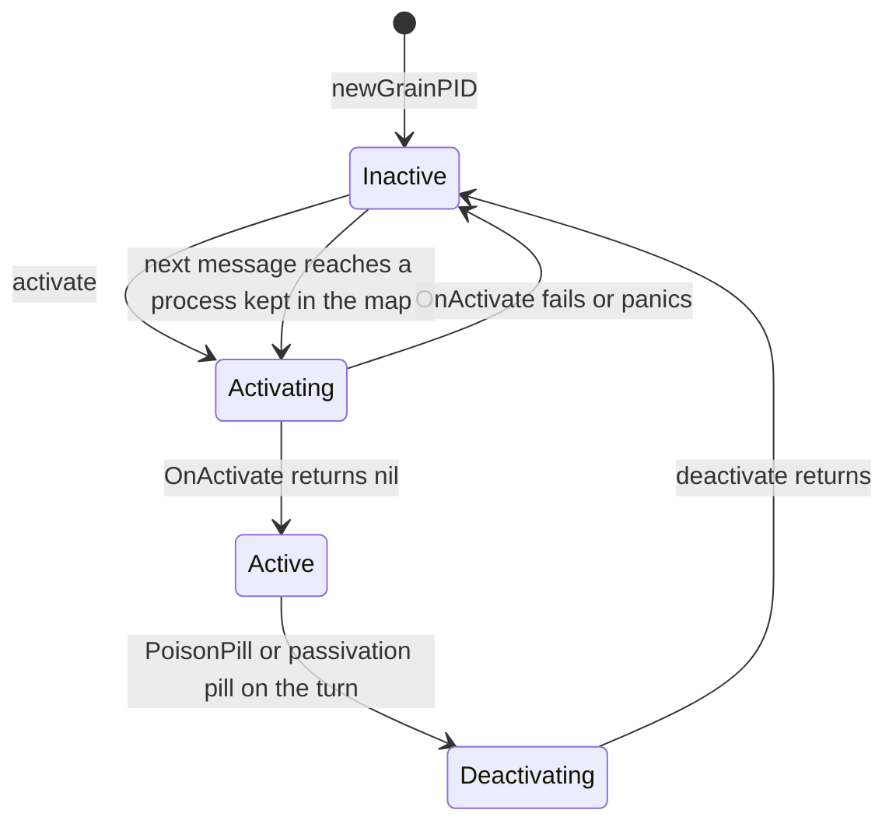
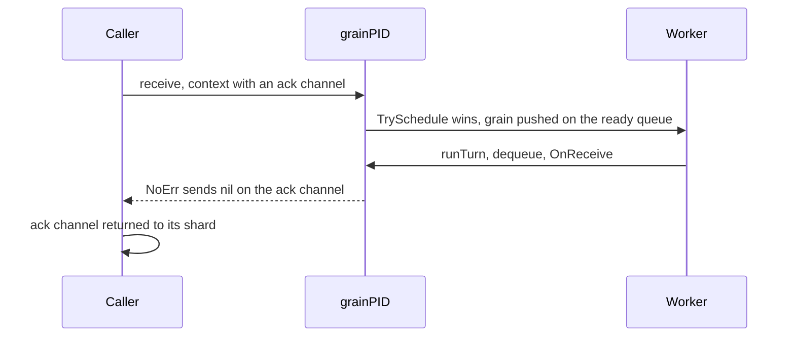

# 14. Grains: the Runtime

## Contents

- [What you will learn](#what-you-will-learn)
- [14.1 The grain process](#141-the-grain-process)
  - [Where a process stands](#where-a-process-stands)
- [14.2 Mailboxes](#142-mailboxes)
- [14.3 Scheduling and the turn](#143-scheduling-and-the-turn)
- [14.4 `GrainContext`](#144-graincontext)
  - [Modes](#modes)
  - [Where a reply goes](#where-a-reply-goes)
  - [What a handler can do](#what-a-handler-can-do)
  - [The handler's context and the context's lifetime](#the-handlers-context-and-the-contexts-lifetime)
- [14.5 The context pool](#145-the-context-pool)
- [14.6 Sending and waiting](#146-sending-and-waiting)
- [14.7 Panics and failures in a handler](#147-panics-and-failures-in-a-handler)
- [14.8 Activation and deactivation inside the process](#148-activation-and-deactivation-inside-the-process)
  - [`activate`](#activate)
  - [`deactivate`](#deactivate)
  - [`PoisonPill`](#poisonpill)
  - [Shutdown](#shutdown)
- [14.9 Idle passivation](#149-idle-passivation)
- [14.10 Late messages](#1410-late-messages)
- [14.11 Timers](#1411-timers)
  - [The registry](#the-registry)
  - [Firing and delivery](#firing-and-delivery)
- [14.12 Delivery from another node](#1412-delivery-from-another-node)
- [Guarantees](#guarantees)
- [Implementation details (may change)](#implementation-details-may-change)
- [Behaviours to know](#behaviours-to-know)

## What you will learn

- What a grain process holds, which flags describe where it stands in its lifecycle, and how it runs one turn at a time on the shared dispatcher.
- How the two grain mailboxes work, why a grain has no system queue, and who recycles a dequeued context.
- What a handler can do through `GrainContext`, how a reply finds its way back in each of the four context modes, and how `TellGrain` and `AskGrain` wait for it.
- What happens inside the process on activation, on deactivation, on a `PoisonPill` and on an idle deadline.
- What becomes of a message that reaches an instance which has just deactivated.
- How grain timers are scoped to one activation, and how a panic in a handler is answered.
- How a message that arrived from another node is handed to the grain.

[Chapter 13](chap-13.md) covers what comes before a grain runs: the `Grain` interface, `GrainIdentity`, props and options, and how the grain engine finds or activates the one process for an identity. This chapter starts once that process exists.

## 14.1 The grain process

An activated grain is a `grainPID` (`actor/grain_pid.go`). It is to a grain what a `PID` is to an actor, with less in it: no parent, no children, no supervisor, no behaviour stack and no system queue. `newGrainPID` builds it from the identity, the grain instance, the actor system and the activation configuration, takes the system's dispatcher and passivation manager, assigns it a home shard in the context pool ([§14.5](#145-the-context-pool)), and gives it a user mailbox ([§14.2](#142-mailboxes)).

The struct is laid out on three cache lines, and a test pins its size at 192 bytes (`grainPID` in `actor/grain_pid.go`). The comments group the fields by who touches them:

| Line | Fields | Who touches them |
|---|---|---|
| 0 | mailbox head, latest activity, processed count, last passivation touch, the grain, the response queue, the passivation manager | the turn writes or reads them on every message; no producer touches this line per message |
| 1 | bounded mailbox, identity, dispatcher, reentrancy state, `activated`, `ctxShard`, `onPoisonPill`, activation time, `mu` | producers and the turn read them on every message; they are written only off the message path: construction, activation, poisoning, timer scheduling |
| 2 | mailbox tail, `schedState`, `phase`, actor system, config, `timers` | producers swap the tail and both sides compare-and-swap the scheduling word; the rest changes at activation, deactivation or a wire snapshot |

The padding at the end exists so that every process starts on a cache-line boundary; the comment records that at 176 bytes only one process in four was aligned.

### Where a process stands

Several fields together say where a process stands. None of them is a single state machine:

| Field | Meaning | Source |
|---|---|---|
| `activated` | true from the end of a successful `OnActivate` until the end of `deactivate`; `isActive` reads it | `grainPID.activate` and `grainPID.deactivate` in `actor/grain_pid.go` |
| `phase` | `grainInactive`, `grainActivating` or `grainActive`, guarded by `mu`; it only decides what a timer scheduled at that moment does ([§14.11](#1411-timers)) | `grainPhase` in `actor/grain_pid.go` |
| `onPoisonPill` | set when a `PoisonPill` is handled, cleared by `deactivate`; it makes the passivation path stand back. A pill that finds the grain already inactive never calls `deactivate`, so it leaves the flag set, and `activate` does not clear it | `grainPID.handlePoisonPill` in `actor/grain_pid.go` |
| `schedState` | the dispatch state, `Idle`, `Scheduled` or `Processing` ([Chapter 7, §7.2](chap-07.md#72-the-dispatch-state)) | `grainPID` in `actor/grain_pid.go` |
| reentrancy state | while a blocking request is in flight the grain is paused and reads no user message ([Chapter 8, §8.6](chap-08.md#86-reentrancy-in-grains)) | `grainPID.paused` in `actor/grain_pid.go` |

Read together, they give five stages:

| Stage | `activated` | `phase` | Timers | Passivation entry | `receive` |
|---|---|---|---|---|---|
| Built, never activated | false | inactive | scheduling refused | none | refuses with `ErrDead` |
| Running `OnActivate` | false | activating | registry dormant | none | refuses with `ErrDead` |
| Active | true | active | started | registered unless passivation is off | accepts |
| Running `OnDeactivate` | true | inactive | stopped and dropped | unregistered | accepts; the message becomes a late message ([§14.10](#1410-late-messages)) |
| Deactivated | false | inactive | scheduling refused | none | refuses with `ErrDead` |

The last transition exists because a failed `OnDeactivate` leaves the process in the node's grains map ([§14.8](#148-activation-and-deactivation-inside-the-process)): the next message reactivates that same process. After a successful deactivation the process is gone from the map, and the next message makes a new one ([Chapter 13](chap-13.md)).

## 14.2 Mailboxes

A grain has one user mailbox, and a second queue for replies once it has a reentrancy state. Both are multi-producer, single-consumer linked lists that use the `GrainContext` itself as the list node, through its `next` field, so a context can sit in only one mailbox at a time (`grainMailbox` in `actor/grain_mailbox.go`).

`attachMailbox` picks the user mailbox at construction (`grainPID.attachMailbox` in `actor/grain_pid.go`):

| Configuration | User mailbox | Source |
|---|---|---|
| no capacity, the default | the **embedded** mailbox: two pointers inside the process, `mailboxHead` and `mailboxTail`, seeded with one sentinel | `embeddedGrainMailbox` in `actor/embedded_grain_mailbox.go` |
| `WithGrainMailboxCapacity(n)` with `n > 0` | a standalone `grainMailbox` bounded to exactly `n` | `newGrainMailbox` in `actor/grain_mailbox.go`; `WithGrainMailboxCapacity` in `actor/grain_option.go` |

`enqueueMessage`, `dequeueMessage` and `mailboxEmpty` route to whichever the process has; the nil check on `boundedMailbox` is the switch (`actor/grain_pid.go`). The response queue is an unbounded `grainMailbox`, attached once and never removed ([Chapter 8, §8.6](chap-08.md#86-reentrancy-in-grains)).

**The embedded mailbox** is the same design as the actor's embedded mailbox ([Chapter 6, §6.2](chap-06.md#62-the-default-mailbox)): `(*embeddedGrainMailbox)(pid)` is a pointer conversion that allocates nothing, the head sits on the line the turn writes and the tail on the line producers write, and there is no length counter. `Enqueue` swaps the tail and then links the previous tail. `IsEmpty` reads the head's link. `Len` walks the list and is meant for tests and diagnostics only (`actor/embedded_grain_mailbox.go`).

**The standalone mailbox** pads its head and tail apart and keeps a length (`grainMailbox` in `actor/grain_mailbox.go`):

- **Bounded.** A producer reserves a slot by a compare-and-swap on the length before it links its node, so concurrent producers can never overshoot the capacity, and the capacity is exact rather than rounded to a power of two (`grainMailbox.tryEnqueue` in `actor/grain_mailbox.go`). A full mailbox returns `ErrMailboxFull`.
- **Unbounded.** The length is incremented after the link.
- **`EnqueueSystem`** links whatever the capacity, counting the node first. It exists for the shutdown `PoisonPill`: a grain whose bounded mailbox is full still receives it, and user enqueues keep failing until the mailbox drains below capacity (`grainMailbox.EnqueueSystem` in `actor/grain_mailbox.go`).
- **`IsEmpty`** is a length of zero.

**One difference from the actor mailboxes.** Between a producer's swap and its link, the new node is the tail but is not yet reachable from the head. The actor's embedded mailbox reports empty during that window. Both grain mailboxes instead check whether the head is also the tail: if not, a link is on its way, and `Dequeue` spins with `runtime.Gosched` until it lands (`embeddedGrainMailbox.Dequeue` in `actor/embedded_grain_mailbox.go`; `grainMailbox.Dequeue` in `actor/grain_mailbox.go`). `IsEmpty` on the embedded mailbox still reports empty in that window. That is safe for the same reason as on an actor: the producer schedules the grain only after its `Enqueue` returns ([Chapter 7, §7.2](chap-07.md#72-the-dispatch-state)).

**Who releases a context.** As on actors, a dequeued context becomes the new sentinel and stays in use while the handler runs. The **next** `Dequeue` resets the previous sentinel and returns it to its home shard of the pool. `dispatchOne` must therefore never release the context itself (`grainPID.dispatchOne` in `actor/grain_pid.go`). The paths that build a context and then fail to enqueue it release it themselves with `releaseGrainContext` (`actor/grain_context_pool.go`): a one-way tell or an envelope that the grain refuses, for example because its bounded mailbox is full, and a timer tick or a passivation pill that cannot be enqueued (`actorSystem.localOneWayTellGrain` in `actor/grain_engine.go`; `grainPID.enqueueEnvelope`, `grainPID.deliverTimerTick` and `grainPID.enqueuePassivationPill` in `actor/grain_pid.go`). That is the failure path; the steady-state release is the dequeue.

**No system queue.** Every runtime message, the `PoisonPill`, the passivation pill and timer ticks, travels through the user mailbox in arrival order. A `PoisonPill` is therefore handled after the messages queued before it, not ahead of them as on an actor ([Chapter 7, §7.4](chap-07.md#74-the-system-queue)).

## 14.3 Scheduling and the turn

A grain is the dispatcher's second kind of `schedulable` ([Chapter 7, §7.1](chap-07.md#71-the-pieces)). It shares the actors' worker pool and the dispatch state of [Chapter 7, §7.2](chap-07.md#72-the-dispatch-state).

**Producing.** `receive` checks that the grain is active, enqueues the context, and then tries `Idle → Scheduled`; only the winner pushes the grain onto the ready queue with `dispatcher.schedule` (`grainPID.receive` in `actor/grain_pid.go`; `dispatcher.schedule` in `actor/dispatcher.go`). An enqueue failure is reported twice: on the context with `Err`, which wakes a caller blocked on an ack or a reply, and as the return value, which is all a one-way send has. An inactive grain is only refused with `ErrDead` in the return value. Every other producer (envelopes, timer ticks, the two pills) follows the same enqueue-then-`TrySchedule` pair.

**The turn.** A worker that takes the grain calls `runTurn` (`grainPID.runTurn` in `actor/grain_pid.go`):

1. Claim the grain with `TakeForProcessing`; a worker that loses returns at once.
2. Read the clock once. Every message of the turn that counts as activity records that instant.
3. For at most the dispatcher's throughput budget (32 by default, `dispatcherThroughput` in `actor/dispatcher.go`): take a reply from the response queue if there is one; otherwise, unless the grain is paused, take a user message; with nothing to take, call `finishOrReclaim`, which either ends the turn or reclaims the grain and goes round again; otherwise dispatch the message.
4. When the budget is spent, move back to `Scheduled` and push the grain onto the worker's own local ring with `worker.reschedule`, or onto the global ring when the local one is full (`actor/worker.go`; `readyQueue.pushLocal` in `actor/ready_queue.go`).

`finishOrReclaim` resets the state to `Idle` first and only then checks for pending work, the reset-then-check of [Chapter 7, §7.2](chap-07.md#72-the-dispatch-state) (`grainPID.finishOrReclaim` in `actor/grain_pid.go`). Pending work is a non-empty response queue, or a non-empty user mailbox while the grain is not paused (`grainPID.hasPendingWork` in `actor/grain_pid.go`).

Compared with an actor's turn, a grain's turn has no `PostStart` slot, no system queue and no check for a pending supervision decision, because a grain has no supervisor ([§14.7](#147-panics-and-failures-in-a-handler)).

**Dispatch.** `dispatchOne` switches on the message type (`grainPID.dispatchOne` in `actor/grain_pid.go`):

| Message | Handler | What it does |
|---|---|---|
| `*PoisonPill` | `handlePoisonPill` | deactivates the grain ([§14.8](#148-activation-and-deactivation-inside-the-process)) |
| `*grainTimerTick` | `handleTimerTick` | runs `OnReceive` with the timer's message ([§14.11](#1411-timers)) |
| `grainPassivationPill` | `handlePassivationPill` | decides an idle deactivation ([§14.9](#149-idle-passivation)) |
| `*commands.AsyncRequest` | `handleAsyncRequest` | unwraps a request envelope and runs it as a user message ([Chapter 8, §8.6](chap-08.md#86-reentrancy-in-grains)) |
| `*commands.AsyncResponse` | `handleAsyncResponse` | completes a request in flight ([Chapter 8, §8.6](chap-08.md#86-reentrancy-in-grains)) |
| anything else | `handleGrainContext` | runs `OnReceive` |

`handleGrainContext` does three things, in order (`grainPID.handleGrainContext` in `actor/grain_pid.go`):

1. **Skip an expired ask.** An ask stamped with a deadline that has passed is answered with `ErrRequestTimeout` and never reaches `OnReceive`. Its comment gives the reason: nobody reads the answer, and under load that work is what keeps the grain behind. An ask already inside `OnReceive` when its sender gives up runs to the end. The deadline is the one actors use (`askDeadline` and `askExpired` in `actor/ask_deadline.go`; [Chapter 5, §5.2](chap-05.md#52-what-a-message-carries)).
2. **Redirect a late message.** A message dequeued after the instance deactivated goes to a fresh activation ([§14.10](#1410-late-messages)).
3. **Run the handler.** Defer `recovery` and the release of the handler's deadline context, increment the processed count, record the turn's instant as activity, and call `OnReceive`.

What counts as activity, for passivation, and what counts as processed:

| Message | Processed count | Activity |
|---|---|---|
| user message, or the inner message of a request envelope | yes | yes |
| expired ask | no | no |
| `AsyncResponse` | no | yes |
| timer tick | yes | only with `WithTimerKeepAlive` |
| `PoisonPill`, passivation pill | no | no |

Issuing a request also records activity (`grainPID.admitRequest` in `actor/grain_pid.go`).

## 14.4 `GrainContext`

`OnReceive` gets a `*GrainContext` (`actor/grain_context.go`). It is pooled and rebuilt for each message by `build`, which resets every per-message field and attaches reply channels according to a mode.

### Modes

| Mode | Built by | Channels | Source |
|---|---|---|---|
| `grainTell` | an acknowledged `TellGrain`; timer ticks; the shutdown `PoisonPill` | `err`, a pooled channel of one slot | `actorSystem.localTellGrain` in `actor/grain_engine.go`; `grainPID.deliverTimerTick` and `grainPID.enqueuePoisonPill` in `actor/grain_pid.go` |
| `grainAsk` | `AskGrain` on the channel path | `response`, a pooled channel of one slot | `actorSystem.localAskGrain` in `actor/grain_engine.go` |
| `grainEnvelope` | request and response envelopes; the passivation pill | none | `grainPID.enqueueEnvelope` and `grainPID.enqueuePassivationPill` in `actor/grain_pid.go` |
| `grainOneWay` | `TellGrain` with `WithOneWay` | none | `actorSystem.localOneWayTellGrain` in `actor/grain_engine.go` |

### Where a reply goes

`Err`, `NoErr` and `Unhandled` look at the context in a fixed order: a request ID first, then the ask flag, then the one-way flag (`NoErr` skips this one), then the ack channel. `Response` looks only at the request ID; without one it offers the value to the reply channel, which only an ask has (`GrainContext.Err`, `GrainContext.NoErr`, `GrainContext.Response` and `GrainContext.Unhandled` in `actor/grain_context.go`):

| Context | `Response(v)` | `NoErr()` | `Err(e)` | `Unhandled()` |
|---|---|---|---|---|
| request envelope (request ID set) | routed reply with `v` | routed empty reply | routed reply with `e` | routed `ErrUnhanledMessage` |
| ask | `v` on the reply channel | `nil` on the reply channel | `e`, wrapped | `ErrUnhanledMessage`, wrapped |
| one-way | nothing | nothing | a dead letter, unless `e` is nil | a dead letter |
| acknowledged tell, timer tick | **nothing** | `nil` on the ack channel | `e` on the ack channel | `ErrUnhanledMessage` on the ack channel |
| response envelope, passivation pill | nothing | nothing | nothing | nothing |

The sentinel is spelled `ErrUnhanledMessage`, and `Unhandled` wraps it with `NewErrUnhandledMessage` (`ErrUnhanledMessage` and `NewErrUnhandledMessage` in `errors/errors.go`). The routed replies are [Chapter 8](chap-08.md)'s, sent once through `routeAsyncReply` ([Chapter 8, §8.6](chap-08.md#86-reentrancy-in-grains)). `DeferResponse`, which hands the reply of a request envelope to a `*GrainReply` that outlives the turn, is described there too. After `DeferResponse`, all four methods do nothing for that message. `GrainReply` holds the actor system, the reply target and the correlation ID, never the context; it completes once through a compare-and-swap, and is safe on a nil receiver (`GrainReply.complete` in `actor/grain_reply.go`).

On the ask path, successes and failures share the one reply channel. A failure is wrapped in `grainReplyError` so that a response payload which happens to implement `error` stays a payload (`grainReplyError` in `actor/grain_context.go`). `sendReply` delivers at most once, guarded by a compare-and-swap on `responseClosed`, and its send cannot block (`GrainContext.sendReply` in `actor/grain_context.go`). The routed replies of a request envelope are once-only too, through the turn-owned `replySent` flag (`GrainContext.sendAsyncReply` in `actor/grain_context.go`).

**The ack channel has no such guard.** On an acknowledged tell or a timer tick, `NoErr`, `Err` and `Unhandled` each do a plain, blocking send on the one-slot channel, so only the first reply to a message is sure to find room. A panic after a reply makes `recovery` send a second one through `Err`.

A one-way failure has nowhere else to go, so `toDeadletter` sends a `SendDeadletter` to the system's dead-letter actor. The receiver is the grain's address on this node, named by its identity, and the sender is `NoSender` (`GrainContext.toDeadletter` in `actor/grain_context.go`).

### What a handler can do

| Purpose | Methods | Notes |
|---|---|---|
| Read the message | `Message`, `Self`, `ActorSystem`, `CorrelationID`, `Context` | `CorrelationID` is empty unless the message arrived as a request envelope |
| Reply | `Response`, `NoErr`, `Err`, `Unhandled`, `DeferResponse` | see the table above |
| Send to grains | `AskGrain`, `TellGrain`, `PipeToGrain`, `PipeToSelf` | `AskGrain` and `TellGrain` call the system's methods ([§14.6](#146-sending-and-waiting)) |
| Send to actors, by name | `AskActor`, `TellActor`, `PipeToActor` | sent from `NoSender`: `SendSync`, `SendAsync` and `PipeToName` |
| Requests without blocking | `RequestGrain`, `RequestActor`, `EnableReentrancy`, `DisableReentrancy` | [Chapter 8, §8.6](chap-08.md#86-reentrancy-in-grains) |
| Timers | `ScheduleOnce`, `Schedule`, `ScheduleWithCron`, `CancelSchedule` | [§14.11](#1411-timers) |
| Dependencies and extensions | `Dependencies`, `Dependency`, `Extensions`, `Extension` | dependencies come from the grain's configuration, extensions from the system |

All of them take their context from `context.WithoutCancel` of the context the message arrived with (`GrainContext.AskGrain` in `actor/grain_context.go`). A call a handler makes through its context is therefore never cancelled by the sender, and is not bounded by the deadline of the ask being handled. `PipeToGrain` runs its task on a new goroutine and delivers the result, or a `StatusFailure`, with an acknowledged `TellGrain` (`handleGrainCompletion` in `actor/grain_context.go`). `GrainIdentity` is deprecated in favour of the package-level `GrainOf` ([Chapter 13](chap-13.md)).

**Reentrancy** lets a grain issue requests without blocking its turn, with a second queue for the replies and a pause instead of a stash; [Chapter 8, §8.6](chap-08.md#86-reentrancy-in-grains) covers it in full.

### The handler's context and the context's lifetime

`Context()` returns the context the message arrived with, except for an ask, on either path: then it lazily derives, once per turn, a context that ends at the ask's deadline (or returns the sender's own context unchanged when that ends first), and `handleGrainContext` cancels it when `OnReceive` returns (`GrainContext.Context` and `GrainContext.releaseDeadlineContext` in `actor/grain_context.go`; `askContext` in `actor/ask_deadline.go`). A handler that passes it to a database call stops working once nobody waits for the answer. A reply handed over with `DeferResponse` keeps the derived context alive past the turn, until the deadline ends it.

**Never keep a `GrainContext` beyond `OnReceive`.** The mailbox recycles it on the next dequeue and may rebuild it for another grain's message on the same shard. A `GrainReply` is the one handle that may outlive the turn.

## 14.5 The context pool

Every `GrainContext` comes from `grainContextPool`, a sharded free list kept apart from the actors' `contextPool` (`actor/grain_context_pool.go`). Its comment gives two reasons for the separation: it isolates the actor hot path from grain changes, and grains recycle mostly from the mailbox side, a different producer and consumer mix.

| Property | Value | Source |
|---|---|---|
| Shards | the smallest power of two from 8 up that reaches twice `GOMAXPROCS`, capped at 128 | `contextShardCount` in `actor/context_pool.go` |
| Slots per shard | 512 | `contextShardCapacity` in `actor/context_pool.go` |
| Attempts under contention | 4, then allocate on `get` or drop on `put` | `poolSpinLimit` in `actor/context_pool.go` |
| Ring | Vyukov's bounded multi-producer, multi-consumer queue, with a sequence number per cell: the actors' ring ([Chapter 8, §8.1](chap-08.md#the-pool)) with `*GrainContext` cells | `grainContextShard` in `actor/grain_context_pool.go` |

The three sizing constants belong to the actors' pool and size the grain rings too, so a change to any of them moves both pools and the two channel pools below. The pools share no rings, objects or counters: grains are spread over shards by their own round-robin counter, so an actor and a grain with the same shard number use different rings (`grainContextShardCounter` in `actor/grain_context_pool.go`).

**A shard per grain.** `newGrainPID` assigns each process a home shard, round-robin (`nextGrainContextShard` in `actor/grain_context_pool.go`). Every context built for that grain is taken from that shard with `getGrainContext(pid.ctxShard)`. A context records its home in `poolShard` on first allocation, keeps it across `reset`, and `put` always returns it there (`grainContextPoolShards.get` and `grainContextPoolShards.put` in `actor/grain_context_pool.go`). Grains with different home shards never contend on pool state; grains that share one contend on its cursors. Nothing is pre-allocated: a cold `get` is a plain allocation, and a full shard drops the context for the garbage collector.

**No clones.** No grain path enqueues one context into a second queue, so the grain pool has no `cloneContext`. The mailbox link of a `GrainContext` is an `atomic.Pointer` rather than an `unsafe.Pointer` (`GrainContext` in `actor/grain_context.go`).

**Measuring.** `BenchmarkGrainTellPairwise` and `BenchmarkGrainAskPairwise` in `benchmark/pairwise_test.go` are the grain counterparts of `BenchmarkTellPairwise`: they show whether independent grain pairs add up. A benchmark that sends to one grain cannot show a process-wide pool lock.

**Channel pools.** The ack and reply channels of one slot come from two more pools of the same shape, `grainErrorChannelPool` for tells and `grainReplyChannelPool` for asks, indexed by the context's `poolShard` (`actor/grain_context_pool.go`). Both are instances of one generic ring, `grainChannelPoolShards`, for `error` and for `any` channels (`grainChannelPoolShards` in `actor/grain_context_pool.go`). They exist because the caller waits for the grain: `TellGrain` until the message is handled, `AskGrain` until the reply is in hand. The comment on the ack pool records that borrowing from the process-wide channel pool cost two global lock crossings per message; the one on the reply pool, that it spares an ask the 128 bytes and two allocations of a fresh channel. The actor `Ask` path does not pool its reply channels. Its comment gives two reasons: a process-wide pool would serialize every concurrent `Ask` on one lock, and a reply racing the asker's timeout could land after the drain that precedes pooling and reach the next borrower. A fresh channel per request avoids both (`getResponseChannel` in `actor/pools.go`). `put` drains a channel before pooling it. A caller returns its channel only once the answer is in hand. On a timeout or a cancellation it abandons the channel to the garbage collector instead, because a late answer could still land in it (`putGrainReplyChannel` in `actor/grain_context_pool.go`).

## 14.6 Sending and waiting

`TellGrain` and `AskGrain` refuse with `ErrActorSystemNotStarted` while the system is not started or is stopping, and with `ErrInvalidGrainIdentity` for an identity that does not validate (`actorSystem.TellGrain` and `actorSystem.AskGrain` in `actor/grain_engine.go`). In a cluster they go through `remoteTellGrain` and `remoteAskGrain`, which deliver in-process when the grain is active here or the registry names this node, send to the owner when the registry names another node, and otherwise try the other data centres before activating the grain here. Locating the owner is [Chapter 13](chap-13.md)'s subject. Every local delivery ends in `localSendGrain`, which calls `ensureGrainProcess` ([Chapter 13](chap-13.md)) and then picks a path by mode (`actorSystem.localSendGrain` in `actor/grain_engine.go`):

| Mode | Path | The caller waits for | Timeout |
|---|---|---|---|
| acknowledged tell, the default | `localTellGrain` | the handler's `NoErr`, `Err` or `Unhandled` on the ack channel | `DefaultGrainRequestTimeout`, 5 seconds, or the caller's context |
| one-way, `WithOneWay` | `localOneWayTellGrain` | the enqueue only | none |
| ask, grain without reentrancy | `localAskGrain` | a reply on the reply channel | the caller's timeout, or its context |
| ask, grain with reentrancy | `envelopeAsk` | a reply routed to the node's pending-ask table | the caller's timeout, or its context ([Chapter 8, §8.6](chap-08.md#86-reentrancy-in-grains)) |

**The acknowledged tell** builds a `grainTell` context, copies its ack channel and pool shard **before** handing it to `receive`, and then waits on the channel, a pooled timer of `DefaultGrainRequestTimeout` and the caller's context (`actorSystem.localTellGrain` in `actor/grain_engine.go`). The copy matters: once enqueued the context belongs to the turn, which may recycle and rebuild it at any moment. A timeout returns `ErrRequestTimeout`; a cancelled context returns its error joined with `ErrRequestTimeout`. The timeout is not configurable per call; only a shorter context deadline cuts it short.

**The one-way tell** detaches the caller's cancellation, keeping its values, and returns the result of `receive` (`actorSystem.localOneWayTellGrain` in `actor/grain_engine.go`). The errors it can report are the ones before the enqueue: an invalid identity, a stopped system, an activation failure, a full bounded mailbox, a transport failure towards a remote owner (`WithOneWay` in `actor/tell_grain_option.go`). `TellGrainOption` takes and returns the configuration by value; its comment says why: a pointer would force the configuration onto the heap on every call of this hot path (`TellGrainOption` in `actor/tell_grain_option.go`).

**The ask on the channel path** builds a `grainAsk` context with the timeout and a deadline from `askDeadline`, copies the reply channel and shard, calls `receive`, and waits on the channel, a pooled timer and the context (`actorSystem.localAskGrain` in `actor/grain_engine.go`). A `grainReplyError` is unwrapped into the returned error.

Some consequences of these paths:

- **A full bounded mailbox** answers an acknowledged tell or an ask with `ErrMailboxFull` at once, through `Err` on the context, and a one-way tell through the return value. The refused message of an acknowledged tell or an ask does not become a dead letter, unlike on an actor's bounded mailbox ([Chapter 6, §6.3](chap-06.md#63-choosing-a-mailbox)). A one-way tell does: `receive` reports the failure through `Err` as well, and `Err` on a one-way context records a dead letter, so the sender gets the error and a dead letter is recorded too (`grainPID.receive` in `actor/grain_pid.go`; `GrainContext.Err` in `actor/grain_context.go`).
- **`Response` does not acknowledge a tell.** On a `grainTell` context it has no channel to write to, so the caller waits for its timeout.
- **A handler that never replies** leaves an acknowledged tell or an ask waiting until its timeout.
- **A grain calling another grain through its context blocks its own turn.** `GrainContext.AskGrain` and the default `GrainContext.TellGrain` wait on the calling grain's turn, holding its worker. A grain that sends an acknowledged tell or an ask to itself always times out, because its own turn holds the dispatch state.
- **Errors returned to application code carry no node-refusal mark.** `TellGrain` and `AskGrain` strip it with `refusal.Unmark`, so a handler that passes such an error on does not make its own node look as if it refused (`actorSystem.TellGrain` in `actor/grain_engine.go`). The mark and the resend it allows are [Chapter 13](chap-13.md)'s.

## 14.7 Panics and failures in a handler

A grain has no supervisor. `recovery` is deferred around `OnReceive`, around a timer tick, around a reply continuation and around `handlePoisonPill` (`grainPID.recovery` in `actor/grain_pid.go`). It turns the panic value into a `*PanicError`: a value that already is one keeps its identity, another error is wrapped with the caller's function, file and line, and any other value is formatted with `%#v`. Then:

| Context | What happens to the panic |
|---|---|
| ask | `Err` puts the wrapped failure on the reply channel; the caller gets an error containing the panic |
| acknowledged tell, timer tick | `Err` puts it on the ack channel; for a tick it is logged as a warning ([§14.11](#1411-timers)) |
| request envelope | `Err` routes it as an error reply |
| one-way | logged at error level, and recorded as a dead letter |
| response envelope | logged at error level only |

The routes in the table assume the handler had not replied yet. On an ask or a request envelope, a panic after the handler already replied is dropped: `sendReply` and `sendAsyncReply` are once-only ([§14.4](#144-graincontext)), and `recovery` logs only when there is no reply route, so nothing is logged and the caller keeps the first reply. On an acknowledged tell the panic is a second send on the ack channel ([§14.4](#144-graincontext)).

A request envelope carries its failure as text: `routeAsyncReply` copies `failure.Error()` into the `AsyncResponse`, and the requester rebuilds it with `asyncErrorFromString`, which restores a few known sentinels and turns any other text into a plain error (`actorSystem.routeAsyncReply` in `actor/async_reply.go`; `asyncErrorFromString` in `actor/pid.go`). A panic answered on that path therefore reaches the caller as an error with the panic's text, not a `*PanicError`. On the ask channel path a caller on the same node receives the `*PanicError` value itself.

The grain stays active and keeps whatever state the handler left behind; nothing is restarted or reset. A failure the handler reports with `Err` takes the same routes without the log line.

Panics in the lifecycle hooks are contained too. A panic in `OnActivate` becomes `ErrGrainActivationFailure` wrapping a `*PanicError` and is not retried; a panic in `OnDeactivate` becomes `ErrGrainDeactivationFailure` in the same way (`grainPID.activate` and `grainPID.deactivate` in `actor/grain_pid.go`).

## 14.8 Activation and deactivation inside the process

### `activate`

`activate` runs on the goroutine of the send that triggered the activation, not inside a turn of the grain ([Chapter 13](chap-13.md)). In order (`grainPID.activate` in `actor/grain_pid.go`):

1. Set the phase to `grainActivating`, so that timers scheduled from `OnActivate` stay dormant.
2. Defer a cleanup that stops the timers if activation fails, so a timer planted by a failed `OnActivate` never fires.
3. Run `OnActivate` with a `GrainProps` built from the identity, the system, the dependencies and the process, through a retrier allowed `initMaxRetries` attempts, inside one context bounded by `initTimeout`. `OnActivate` receives that bounded context, unlike `PreStart`, which never sees its timeout ([Chapter 4, §4.4](chap-04.md#44-prestart-retries-and-the-timeout-that-is-not-one)). An error from the last attempt becomes `ErrGrainActivationFailure`.
4. On success: set `activated` and the activation time, record activity, register with the passivation manager when the process has a positive `deactivateAfter` and a manager ([§14.9](#149-idle-passivation)), and start the timers.

The retrier's first and maximum backoff are both `initTimeout`, randomised by half either way, and the whole sequence shares the one `initTimeout` context. A second attempt starts at least half the budget after the first fails, and a third would start after the budget has run out, so in practice `OnActivate` runs at most twice whatever `WithGrainInitMaxRetries` says (`WithGrainInitTimeout` in `actor/grain_option.go`; `internal/retry/retry.go`). Actors use a 1 ms first backoff for `PreStart` instead ([Chapter 4, §4.4](chap-04.md#44-prestart-retries-and-the-timeout-that-is-not-one)).

### `deactivate`

In order (`grainPID.deactivate` in `actor/grain_pid.go`):

1. Unregister from the passivation manager.
2. Stop and drop the timers, setting the phase back to `grainInactive`, **before** `OnDeactivate` runs. A tick already in the mailbox is dropped by the tick handler, and a timer scheduled from the hook is refused.
3. Defer the reset of `activated`, the activation time, the latest activity and `onPoisonPill`. The reset runs on every return, success or failure, so `activated` stays true while `OnDeactivate` runs.
4. Run `OnDeactivate`. An error returns `ErrGrainDeactivationFailure` here, before step 5: the process stays in the grains map, inactive, and in a cluster its registry record is not released.
5. Delete the process from the node's grains map.
6. In a cluster, release the registry record, but only while it still names this node: a record re-owned by another node belongs to a live activation there. A failed release fails the deactivation, unless the node is stopping, in which case it is logged as a warning and the record is left to the next activation, which releases it ([Chapter 13](chap-13.md)).

The context `OnDeactivate` receives is the shutdown context for a `PoisonPill` sent at shutdown, the sender's for one sent with `TellGrain` (detached from its cancellation for a one-way tell), the one bounded by the ask's deadline for one sent with `AskGrain` ([§14.4](#144-graincontext)), and a background context for an idle deactivation.

### `PoisonPill`

`handlePoisonPill` sets `onPoisonPill`, acknowledges at once with `NoErr` if the grain is no longer active, so `OnDeactivate` runs once even when a passivation pill got there first (the flag then stays set, [§14.1](#141-the-grain-process)), completes every request still in flight with `ErrRequestCanceled` ([Chapter 8, §8.6](chap-08.md#86-reentrancy-in-grains)), and calls `deactivate`. The outcome goes to the context with `Err` or `NoErr` (`grainPID.handlePoisonPill` in `actor/grain_pid.go`).

A `PoisonPill` reaches the grain in two ways:

- **Sent by an application** with `TellGrain` or `AskGrain`, like any message. It goes through `enqueueMessage`, so a full bounded mailbox refuses it, and it activates the grain first if needed.
- **Sent by shutdown** with `enqueuePoisonPill`, which builds a `grainTell` context, reads its ack channel before the handoff, and enqueues with `enqueueSystemMessage`, past the capacity of a bounded mailbox (`grainPID.enqueuePoisonPill` in `actor/grain_pid.go`). It does not check that the grain is active, because `handlePoisonPill` acknowledges an inactive grain itself; the caller always gets an answer.

### Shutdown

`ActorSystem.Stop` deactivates grains in one step of its sequence ([Chapter 3, §3.5](chap-03.md#35-stop)). The comment in `actorSystem.shutdown` gives the reason for going through the mailbox rather than calling `deactivate`: `OnDeactivate` then runs inside the grain's turn, under the same dispatch state that serialises `OnReceive`, which removes any race between the two without a dispatcher-wide drain (`actor/actor_system.go`). `poisonAllGrains` (`actorSystem.poisonAllGrains` in `actor/actor_system.go`):

1. Takes the processes in the grains map. An inactive one is removed from the map and skipped.
2. For each active one, queues a cancellation for every request in flight, so a paused grain wakes up and can reach the pill ([Chapter 8, §8.6](chap-08.md#86-reentrancy-in-grains)), then enqueues the pill and keeps its ack channel.
3. Waits for the acks one after the other, bounded by the stop's context, which carries the shutdown timeout and has already been used by the earlier steps of the stop. Each ack returns its channel to the grain's shard and removes the grain from the map; a failed `OnDeactivate` is logged and named in the returned error.
4. When the context ends first, returns its error, joined with the failures collected so far. The grains still waiting keep their pill in the mailbox and lose it when the dispatcher stops, so their `OnDeactivate` never runs.

Because the pill waits behind the messages queued before it, a grain with a backlog delays the shutdown by the time it takes to drain it.

## 14.9 Idle passivation

A grain passivates on idleness only; there is no message-count strategy for grains. `startPassivation` registers a time-based strategy of `deactivateAfter` with the system's passivation manager, the same manager as actors ([Chapter 10, §10.2](chap-10.md#102-the-manager-and-its-entries)), and does nothing when `deactivateAfter` is zero or negative (`grainPID.startPassivation` in `actor/grain_pid.go`). The default is `DefaultPassivationTimeout`, two minutes; `WithGrainDeactivateAfter` changes it and `WithLongLivedGrain` sets it to `-1` (`newGrainConfig` and `WithLongLivedGrain` in `actor/grain_option.go`). Unlike an actor's zero timeout, which passivates at once ([Chapter 10, §10.1](chap-10.md#101-strategies)), a grain's zero turns passivation off.

**Activity** reaches the manager as for actors: `markActivity` always stores the instant, and calls the manager's `Touch` at most once per 100 ms, the winner of a compare-and-swap on `lastPassivationTouch` (`grainPID.markActivity` in `actor/grain_pid.go`; `passivationTouchInterval` in `actor/pid.go`). The manager knows its deadline may trail the true activity and re-checks it ([Chapter 10, §10.3](chap-10.md#103-activity)).

**The decision is taken on the turn.** The grain implements `passivationParticipant` (`actor/passivation_manager.go`). When a deadline fires, the manager calls `passivationTry`, which never deactivates on the manager's goroutine (`grainPID.passivationTry` in `actor/grain_pid.go`):

1. Return false when the grain is inactive or a `PoisonPill` is being handled.
2. Enqueue a `grainPassivationPill` in the user mailbox, so that `OnDeactivate` runs after the message in progress and never during `OnReceive`, and return true, which makes the manager delete its entry (`grainPID.enqueuePassivationPill` in `actor/grain_pid.go`).
3. If a full bounded mailbox refuses the pill, record activity and return false. The comment explains: the manager's refreshed deadline then lands a whole `deactivateAfter` away instead of looping, and a full mailbox means pending traffic anyway.

When the pill comes up, `handlePassivationPill` checks the current state, because the pill may have waited behind a pause or a backlog (`grainPID.handlePassivationPill` in `actor/grain_pid.go`):

| Check on the turn | Outcome |
|---|---|
| inactive, or a `PoisonPill` is being handled | drop the pill; no new entry, since an entry for a dead grain would fire for ever |
| a request in flight, or paused | drop the pill; the completion of the last request registers again ([Chapter 8, §8.6](chap-08.md#86-reentrancy-in-grains)) |
| messages waiting behind the pill | register a fresh entry |
| latest activity less than `deactivateAfter` ago | register a fresh entry |
| idle past the deadline | `deactivate` with a background context; a failure is logged |

A message that arrives while `OnDeactivate` runs is still accepted, because `activated` is still true. It is dequeued once the pill's turn returns, and since the instance is then inactive, it becomes a late message ([§14.10](#1410-late-messages)).

## 14.10 Late messages

A message can sit in the mailbox of an instance that has deactivated: queued behind a `PoisonPill` or a passivation pill, or enqueued while `OnDeactivate` ran. `handleGrainContext` finds the instance inactive and calls `redirectLateMessage` instead of `OnReceive` (`actor/grain_late_message.go`):

1. **On a stopping node**, refuse it with `ErrSystemShuttingDown`, marked as a node refusal, because the message has not run (`grainPID.redirectLateMessage` in `actor/grain_late_message.go`).
2. Otherwise **copy the context** into a fresh `GrainContext` outside the pool, since the mailbox will recycle the original. The copy keeps the caller's context, reply or ack channel, flags, request ID and reply target, timeout and deadline.
3. **Queue the copy** in the system's `lateGrainMessages`, a map of queues keyed by the deactivated instance, which lives on the actor system so the process keeps its fixed size. The first push for an instance starts a goroutine running `forwardLateMessages`; later pushes join its queue (`lateGrainMessages.push` in `actor/grain_late_message.go`).
4. The goroutine **forwards one message at a time**, oldest first, and deletes the queue once it is empty, so the messages keep their arrival order (`grainPID.forwardLateMessages` in `actor/grain_late_message.go`).

Forwarding one copy (`GrainContext.forwardLate` in `actor/grain_late_message.go`):

1. An ask whose sender has stopped waiting gets `ErrRequestTimeout` and no activation.
2. A message that arrived as a request envelope is rebuilt as an envelope with its correlation ID, reply target and deadline, and given to `deliverAsyncEnvelope`; the new activation replies to the requester itself.
3. Anything else is sent with `localSendGrain` in its original mode, which activates a fresh instance, reactivates the same process after a failed `OnDeactivate`, or forwards to the owner ([Chapter 13](chap-13.md)). The outcome goes back to the original caller through the copy's own reply methods: `Response` for an ask, `NoErr` otherwise, `Err` on failure. A one-way message that cannot be forwarded becomes a dead letter.

How long the forward waits depends on what the copy carries (`GrainContext.lateSendTimeout` in `actor/grain_late_message.go`). An ask has a deadline, so the forward waits only for the time left before it and does not start the timeout over. Anything else has no deadline: the forward waits the caller's full timeout again (an acknowledged tell), else the time left on the caller's context, else `DefaultGrainRequestTimeout`. An acknowledged tell's forward can therefore still be running after its caller has returned `ErrRequestTimeout`. Because forwarding is serial per instance, a slow fresh activation delays every late message behind the one in progress.

A sender that looked the process up before it left the grains map, and reaches `receive` only after `activated` has gone false, never enters the mailbox: `receive` refuses it with `ErrDead`. A one-way tell returns that error; an acknowledged tell or an ask on the channel path does not see it and waits for its timeout (`grainPID.receive` in `actor/grain_pid.go`; `actorSystem.localTellGrain` and `actorSystem.localAskGrain` in `actor/grain_engine.go`). An ask on the envelope path gets `ErrDead` at once, because `enqueueEnvelope` makes the same check and `envelopeAsk` returns its error (`grainPID.enqueueEnvelope` in `actor/grain_pid.go`).

## 14.11 Timers

A grain schedules messages to itself with `ScheduleOnce`, `Schedule`, `ScheduleWithCron` and `CancelSchedule`, on `GrainContext` from a handler or on `GrainProps` from `OnActivate` (`GrainContext.ScheduleOnce` in `actor/grain_context.go`; `GrainProps.ScheduleOnce` in `actor/grain_props.go`). These timers are **volatile and scoped to one activation**: never persisted, cancelled when the grain deactivates, and they never reactivate a passivated grain. `ActorSystem.ScheduleGrain` is a different mechanism, which sends with `TellGrain` and does reactivate ([Chapter 11, §11.1](chap-11.md#111-the-scheduler)).

### The registry

Each activation has at most one `grainTimers` registry (`actor/grain_timer.go`). `timerRegistry` creates it on the activation's first schedule call and decides what to do from the phase, under `mu` (`grainPID.timerRegistry` in `actor/grain_pid.go`):

| Phase | Schedule call |
|---|---|
| `grainActivating` | creates the registry if needed, **dormant**: nothing fires until activation completes, so a short delay cannot fire into a grain that is not active yet |
| `grainActive` | creates the registry if needed and starts it, idempotently |
| `grainInactive` | refused with `ErrGrainTimersStopped`: never activated, deactivating, or deactivated |

`startTimers` moves the phase to active and starts a registry created during `OnActivate`; `stopTimers` moves it to inactive and stops and drops the registry, so the next activation starts with none (`grainPID.startTimers` and `grainPID.stopTimers` in `actor/grain_pid.go`). A stopped registry refuses every operation and is never restarted (`grainTimers.stop` in `actor/grain_timer.go`).

`register` refuses on a stopped registry, cancels any timer already under the same reference, builds the entry's reusable tick envelope, and starts the entry right away if the registry is started (`grainTimers.register` in `actor/grain_timer.go`). References are scoped to the grain; the default is a UUID, `WithTimerReference` sets one, and reusing a reference replaces the timer (`newGrainTimerConfig` and `WithTimerReference` in `actor/grain_timer_option.go`).

| Kind | Call | First fire | Then | Source |
|---|---|---|---|---|
| one-shot | `ScheduleOnce(message, delay)` | after `delay`; a delay of zero or less fires as soon as the registry starts | leaves the registry when it fires | `grainTimers.scheduleOnce` in `actor/grain_timer.go` |
| interval | `Schedule(message, interval)` | after one `interval`; a non-positive interval is `ErrInvalidTimerInterval` | re-armed for `interval` at each fire | `grainTimers.scheduleInterval` in `actor/grain_timer.go` |
| cron | `ScheduleWithCron(message, expr)` | the next instant of the expression, in the process's local timezone; an invalid expression returns the parse error | re-armed for the next instant; removed when there is none | `grainTimers.scheduleCron` in `actor/grain_timer.go` |

A cron timer needs no cluster-wide arbitration, unlike `ActorSystem.ScheduleWithCron`; the comment says why: a grain has exactly one activation in the cluster, so each tick fires once by construction (`GrainContext.ScheduleWithCron` in `actor/grain_context.go`).

### Firing and delivery

Each entry owns one `time.AfterFunc` timer, created when the entry first starts and reset for every later fire, so steady-state ticks allocate nothing (`grainTimers.fireAfterLocked` in `actor/grain_timer.go`). When it fires, on the timer's goroutine (`grainTimers.fire` in `actor/grain_timer.go`):

1. Under the registry's lock, return if the registry is stopped or the entry cancelled.
2. Settle the entry's future first: a one-shot leaves the registry, an interval re-arms, a cron computes its next instant.
3. Release the lock and hand the tick to the grain with `deliverTimerTick`.

Because the entry is re-armed before delivery, a tick that is dropped loses only itself. `deliverTimerTick` drops the tick when the grain is inactive, and logs and drops it when a full bounded mailbox refuses it. Otherwise it enqueues a `grainTell` context carrying the tick and schedules the grain (`grainPID.deliverTimerTick` in `actor/grain_pid.go`).

On the turn, `handleTimerTick` drops a tick whose grain is inactive or whose entry was cancelled, which covers a tick already queued when `CancelSchedule` ran. Otherwise it counts the message, marks activity only for a timer registered with `WithTimerKeepAlive`, runs `OnReceive` with the timer's message in place of the tick, under `recovery`, and drains the context's ack channel, logging any error at warning level (`grainPID.handleTimerTick` and `grainPID.reportTimerTickFailure` in `actor/grain_pid.go`).

Some consequences:

- **Ticks are ordinary mailbox messages.** They are ordered with the other messages, count against a bounded mailbox, and wait while the grain is paused ([Chapter 8, §8.6](chap-08.md#86-reentrancy-in-grains)). The handler runs with a background context.
- **The cadence is fixed.** An interval timer re-arms at fire time, independently of the handler, so the ticks of a handler slower than the interval queue up; the handler itself never overlaps.
- **Ticks do not keep a grain alive by default.** A grain that only receives ticks passivates on schedule, and its timers stop with it. With `WithTimerKeepAlive`, ticks more frequent than `deactivateAfter` keep it active indefinitely (`WithTimerKeepAlive` in `actor/grain_timer_option.go`).
- **A failing tick does not stop its timer**, whether the handler panics or reports an error.
- **Cancelling a one-shot that has fired** returns `ErrScheduledReferenceNotFound`, as `ActorSystem.CancelSchedule` does (`grainTimers.cancel` in `actor/grain_timer.go`).

## 14.12 Delivery from another node

How a node finds the owner of a grain is [Chapter 13](chap-13.md)'s; the remote client and server in general are Chapters [16](chap-16.md) and [17](chap-17.md). This section covers only how a grain message crosses and enters the process.

**Sending.** `sendToGrainOwner` uses `sendRemoteAskGrainRequest` for an ask, which carries the caller's timeout, and `sendRemoteTellGrainRequest` otherwise (`actor/grain_engine.go`). A one-way tell uses `RemoteTellGrainOneWay`, so the owner answers once the message is enqueued; an acknowledged tell and an envelope use `RemoteTellGrain`. A node sends a message it forwards, or one it received from a peer, at most once; only the `AskGrain` and `TellGrain` entry points may send again after a refusal (`actorSystem.sendToGrainOwner` in `actor/grain_engine.go`).

**Receiving.** Two handlers serve the requests (`actor/remote_server.go`). Both refuse with `FAILED_PRECONDITION` when remoting is disabled, check that the request is addressed to this node, extract the propagated context, deserialise the message with the remoting serializer, rebuild the identity, and refuse a reserved name. Then:

| Handler | Delivery | Timeout |
|---|---|---|
| `remoteAskGrainHandler` | `localSendGrain` in ask mode; the reply is serialised with the serializer for the reply's own type | the request's timeout, inside the client-propagated deadline (`deadlineContext`) |
| `remoteTellGrainHandler`, request or response envelope | `deliverAsyncEnvelope`; the RPC answers once the envelope is enqueued | none |
| `remoteTellGrainHandler`, one-way | `localSendGrain` in one-way mode; answers once enqueued | none |
| `remoteTellGrainHandler`, acknowledged | `localSendGrain` in tell mode; holds the RPC until the grain acknowledges | `DefaultGrainRequestTimeout`, whatever the caller's |

Envelopes must not take the tell path: it would wait on an ack channel that an envelope context never has, and a response must reach a paused grain in any case ([Chapter 8, §8.6](chap-08.md#86-reentrancy-in-grains)). `localSendGrain` on the receiving node activates the grain if needed, so a message for a passivated grain reactivates it there, and forwards to another node if the registry has moved the grain meanwhile.

**Errors.** `grainSendError` maps a delivery failure to the code the client turns back into the same sentinel a local caller would see (`actorSystem.grainSendError` in `actor/remote_server.go`):

| Error | Code | Logged at |
|---|---|---|
| `ErrMailboxFull` | `RESOURCE_EXHAUSTED` | debug |
| `ErrRequestTimeout`, `context.DeadlineExceeded` | `DEADLINE_EXCEEDED` | debug |
| `ErrDead`, `ErrSystemShuttingDown` | `FAILED_PRECONDITION` | debug |
| anything else, including the grain's own errors | `INTERNAL_ERROR` | error |

A node refusal, such as a stopping node refusing to activate the grain or to run a late message, also sets the `Refused` flag, so the caller can tell a message that never ran from the same sentinel reported by a handler.

## Guarantees

| Statement | Enforced by |
|---|---|
| The grain process is 192 bytes, three cache lines | `TestGrainPIDStaysInItsSizeClass` in `actor/grain_pid_test.go` |
| A grain without a capacity runs on the embedded mailbox; a capacity gives it a standalone mailbox that refuses past it | `TestGrainAttachMailbox` and `TestGrainMailboxDispatch` in `actor/grain_pid_test.go` |
| The embedded mailbox is FIFO, keeps each producer's order under concurrent producers, keeps the dequeued context as its sentinel until the next dequeue, and waits for a pending link instead of reporting empty | `TestEmbeddedGrainMailboxFIFOOrder`, `TestEmbeddedGrainMailboxConcurrentProducers`, `TestEmbeddedGrainMailboxReleaseProtocol` and `TestEmbeddedGrainMailboxAwaitsPendingLink` in `actor/embedded_grain_mailbox_test.go` |
| The bounded mailbox returns `ErrMailboxFull`, never overshoots under concurrent producers, and takes a system message past its capacity; a capacity of zero or less is unbounded | `TestGrainMailboxBounded_FullReturnsError`, `TestGrainMailboxBounded_DoesNotOvershootCapacity_Concurrent`, `TestGrainMailboxBounded_EnqueueSystemGoesPastCapacity` and `TestGrainMailboxCapacityZeroOrNegative_IsUnbounded` in `actor/grain_mailbox_test.go` |
| A dequeued context is reset when the next one is dequeued, and the grain returns to `Idle` | `TestGrainPIDProcessReleasesContexts` in `actor/grain_test.go` |
| A turn that spends its budget reschedules the grain; a turn that finds work after its reset reclaims the grain | `TestGrainRunTurnBudgetExhaustionReschedules` and `TestGrainFinishOrReclaimResumesOnPendingWork` in `actor/grain_pid_test.go` |
| An expired ask never reaches `OnReceive` and is answered with `ErrRequestTimeout`, on the channel path and the envelope path | `TestGrainSkipsAnAskWhoseSenderStoppedWaiting` and `TestGrainAnswersAnExpiredAskWithARequestTimeout` in `actor/grain_pid_test.go` |
| The handler's context of an ask carries the deadline and ends with the turn; a tell carries none | `TestAskGrain_HandlerContextEndsWithTheAsk` in `actor/grain_engine_test.go`; `TestGrainContextCarriesTheAskDeadline` in `actor/grain_context_test.go` |
| On the ask path the first reply wins, a failure is wrapped, and an error-typed payload stays a payload | `TestGrainContextAskReplyRouting` in `actor/grain_context_test.go` |
| Reply methods on a context without channels or request ID do nothing | `TestGrainChannelLessReplyMethodsAreNoOps` in `actor/grain_context_test.go` |
| A panic in `OnReceive` is returned to the asker as an error and the grain stays active | `TestGrain` in `actor/grain_test.go` |
| `recovery` wraps a plain error with its location, keeps a `*PanicError` as is, and delivers to an ask caller | `TestGrainRecoveryWrapsPlainErrorPanic`, `TestGrainRecoveryKeepsPanicErrorIdentity` and `TestGrainRecoveryDeliversPanicToAskCaller` in `actor/grain_pid_test.go` |
| A panic in `OnActivate` or `OnDeactivate` becomes the activation or deactivation failure wrapping a `*PanicError` | `TestGrainPIDActivateReturnsPanicErrorOnActivatePanic` and `TestGrainPIDHandlePoisonPillRecoversDeactivatePanic` in `actor/grain_pid_test.go` |
| An acknowledged tell and an ask time out, or end with the caller's context, with `ErrRequestTimeout`; a full bounded mailbox returns `ErrMailboxFull`; an unhandled message returns `ErrUnhanledMessage` | `TestGrain` in `actor/grain_test.go` |
| A one-way tell returns before the grain processes the message, reports a full mailbox, and turns handler failures and panics into dead letters naming the grain | `TestTellGrainOneWay` and `TestTellGrainOneWayDeadletters` in `actor/grain_engine_test.go`; `TestGrainContextTellGrainOneWay` in `actor/grain_context_test.go` |
| A completed ask returns its reply channel to the grain's shard; a timed-out ask abandons it | `TestAskGrain_ReplyChannelPooling` in `actor/grain_engine_test.go` |
| The context pool returns a context to its home shard only, survives overflow and wrap-around, and is safe under concurrency | `TestGrainContextPool_PutReturnsToHomeShardOnly`, `TestGrainContextPool_OverflowDropsForGC`, `TestGrainContextPool_Wraparound` and `TestGrainContextPool_ConcurrentGetPut` in `actor/grain_context_pool_test.go` |
| A `GrainReply` completes once, is safe on a nil receiver, and swallows a delivery failure | `TestGrainReplyCompletesOnce`, `TestGrainReplyNilReceiver` and `TestGrainReplyDeliveryFailureIsSwallowed` in `actor/grain_reply_test.go` |
| `OnDeactivate` never runs during `OnReceive`, even when the idle deadline passes meanwhile | `TestGrainPassivationWaitsForTheMessageInProgress` in `actor/grain_pid_test.go` |
| A passivation pill with messages behind it is skipped; a `PoisonPill` with messages behind it forwards them to a fresh activation; a stopping node refuses them | `TestGrainMessagesQueuedBehindAPill` in `actor/grain_pid_test.go` |
| Late messages reach a fresh activation, keep their order, an ask's forward takes only the caller's remaining time while other forwards take the caller's timeout, context deadline or the default in that order, and an unforwardable one-way message becomes a dead letter; a stopping node refuses them with the refusal mark | `TestGrainLateMessageForwarding`, `TestGrainLateMessageSendTimeout`, `TestGrainLateAskHonorsTheCallerTimeout` and `TestGrainLateAskKeepsItsDeadline` in `actor/grain_pid_test.go` |
| The passivation pill re-checks state on the turn, and a pill refused by a full mailbox records activity | `TestGrainPassivationPillChecks` and `TestGrainPassivationPillRejectedByFullMailbox` in `actor/grain_pid_test.go` |
| A non-positive `deactivateAfter` registers nothing; activity touches the manager at most once per interval | `TestGrainPIDStartPassivationSkipsWhenTimeoutNonPositive`, `TestGrainPIDStartPassivationSkipsWhenAutoDisabled` and `TestGrainPIDMarkActivityCoalescesTouch` in `actor/grain_pid_test.go` |
| An idle grain is passivated and leaves the grains map; a `PoisonPill` sent with `TellGrain` deactivates it; a failed `OnDeactivate` leaves it inactive in the map | `TestGrain` in `actor/grain_test.go` |
| A shutdown pill is acknowledged after `OnDeactivate`, at once for an inactive grain, and goes past a full mailbox | `TestGrainEnqueuePoisonPill` in `actor/grain_pid_test.go` |
| A failed registry release fails the deactivation, except on a stopping node | `TestGrainPIDDeactivateReportsFailedRegistryRelease` and `TestGrainPIDDeactivateToleratesFailedRegistryReleaseWhileStopping` in `actor/grain_pid_test.go` |
| Timers registered in `OnActivate` stay dormant until activation completes and are discarded when it fails or panics; the hook `OnDeactivate` cannot register one; each activation gets a fresh registry; shutdown stops them | `TestGrainTimerRegisteredInOnActivateStaysDormantUntilActive`, `TestGrainActivationFailureClosesTimers`, `TestGrainActivationPanicClosesTimers`, `TestGrainTimerLateRegistrationFromOnDeactivateRejected`, `TestGrainTimerFreshRegistryAcrossReactivation` and `TestGrainTimerStopsOnSystemShutdown` in `actor/grain_timer_test.go` |
| Ticks do not prevent passivation unless the timer keeps the grain alive | `TestGrainTimerTickDoesNotPreventPassivation` and `TestGrainTimerKeepAliveTickPreventsPassivation` in `actor/grain_timer_test.go` |
| A panicking or failing tick handler does not stop its timer; a tick already queued when its timer was cancelled, or reaching an inactive grain, is dropped; a reused reference replaces the timer; a tick refused by a full mailbox is dropped | `TestGrainTimerTickPanicKeepsTimerRunning`, `TestGrainTimerTickErrorKeepsTimerRunning`, `TestGrainTimersCancelDuringInFlightTick`, `TestGrainPIDHandleTimerTickDrops`, `TestGrainTimersDuplicateReferenceReplaces` and `TestGrainPIDDeliverTimerTickMailboxFull` in `actor/grain_timer_test.go` |
| Scheduling on a grain that never activated or has deactivated returns `ErrGrainTimersStopped` | `TestGrainContextTimersOnNeverActivatedGrain` and `TestGrainContextTimersOnDeactivatedGrain` in `actor/grain_timer_test.go` |
| A remote one-way tell is answered once enqueued, and a full mailbox maps to `RESOURCE_EXHAUSTED`, for a request envelope too | `TestRemoteTellGrainHandler` in `actor/remote_server_test.go` |
| Delivery failures map to their codes, and a node refusal sets `Refused` | `TestGrainSendError` in `actor/remote_server_test.go` |
| A request envelope sent over the wire reaches the handler with its correlation ID and reply target; a refused envelope never falls through to the blocking path | `TestRemoteGrainEnvelopeDelivery` and `TestRemoteTellGrainHandlerEnvelopeFailure` in `actor/remote_server_test.go` |
| A stopping node refuses a remote tell or ask for a grain that is not active, with the refusal flag | `TestRemoteGrainHandlersOnAShuttingDownNode` in `actor/remote_server_test.go` |
| `ErrMailboxFull` and `ErrRequestTimeout` survive the trip between nodes | `TestRemoteGrainSend_KeepsTheSentinelsAcrossNodes` in `actor/grain_engine_test.go` |
| In a cluster, a grain active on this node is served without a registry lookup | `TestRemoteTellGrainLocalShortCircuit`, `TestRemoteTellGrainOneWayLocalShortCircuit` and `TestRemoteAskGrainLocalShortCircuit` in `actor/grain_engine_test.go` |

## Implementation details (may change)

- The three-cache-line layout of the process and the grouping of its fields.
- The embedded user mailbox, and the spin with `runtime.Gosched` while a link is pending.
- No system queue: every runtime message goes through the user mailbox.
- The sharded pools: 512 slots per shard, between 8 and 128 shards, four retries, a home shard per grain assigned round-robin.
- One `time.AfterFunc` timer per grain timer entry, reset for each fire.
- One goroutine per deactivated instance that has late messages.
- The retrier settings of `activate`: backoff equal to `initTimeout`, randomised by half.
- The passivation pill and the order of its checks.
- The ack timeout of an acknowledged tell, `DefaultGrainRequestTimeout`, also used by the remote tell handler.

## Behaviours to know

| Behaviour | Source |
|---|---|
| `Response` does not acknowledge a `TellGrain`; the caller waits for `NoErr`, `Err` or `Unhandled`, or times out | `GrainContext.Response` in `actor/grain_context.go` |
| An acknowledged tell always waits up to 5 seconds; only the caller's context can shorten it | `actorSystem.localTellGrain` in `actor/grain_engine.go` |
| `GrainContext.AskGrain` and the default `GrainContext.TellGrain` block the calling grain's turn and its worker; an acknowledged tell to oneself always times out | `GrainContext.TellGrain` in `actor/grain_context.go` |
| Calls made through a `GrainContext` are detached from the sender's cancellation and from the ask deadline | `GrainContext.AskGrain` in `actor/grain_context.go` |
| A full bounded mailbox returns `ErrMailboxFull` to the sender; a one-way tell is recorded as a dead letter as well, an acknowledged tell or an ask is not | `grainPID.receive` in `actor/grain_pid.go` |
| A `PoisonPill` waits behind the messages queued before it; one sent by an application can be refused by a full mailbox, the shutdown one cannot | `grainPID.enqueueSystemMessage` in `actor/grain_pid.go` |
| A panic leaves the grain active with whatever state the handler left; nothing restarts it | `grainPID.recovery` in `actor/grain_pid.go` |
| A failure on a one-way message becomes a dead letter; a panic in a reply continuation is only logged | `grainPID.recovery` in `actor/grain_pid.go` |
| A panic after an ask or a request envelope was already answered is dropped without a log line; a panic answered on the envelope path reaches the caller as plain error text, not a `*PanicError` | `grainPID.recovery` in `actor/grain_pid.go`; `GrainContext.sendAsyncReply` in `actor/grain_context.go`; `asyncErrorFromString` in `actor/pid.go` |
| A failed `OnDeactivate` leaves the grain inactive, in the grains map and in the registry; the next message reactivates the same process | `grainPID.deactivate` in `actor/grain_pid.go` |
| A failed registry release fails the deactivation although the grain is already out of the local map | `grainPID.deactivate` in `actor/grain_pid.go` |
| `OnActivate` runs at most twice in practice, whatever the retry count, and a panic is not retried | `grainPID.activate` in `actor/grain_pid.go` |
| A zero or negative `deactivateAfter` disables passivation, unlike an actor's zero timeout | `grainPID.startPassivation` in `actor/grain_pid.go` |
| A send that reaches a just-deactivated instance outside its mailbox gets `ErrDead` if one-way or an ask on the envelope path, and waits for its timeout if an acknowledged tell or an ask on the channel path | `grainPID.receive` in `actor/grain_pid.go` |
| Late messages of one instance are forwarded one at a time; a slow fresh activation holds the others back | `grainPID.forwardLateMessages` in `actor/grain_late_message.go` |
| Grain timers never reactivate a grain and, by default, do not keep it alive | `grainPID.deliverTimerTick` and `grainPID.handleTimerTick` in `actor/grain_pid.go` |
| A tick refused by a full mailbox is lost; the timer keeps firing | `grainPID.deliverTimerTick` in `actor/grain_pid.go` |
| Shutdown waits for each grain's backlog; a grain not done by the deadline never runs `OnDeactivate` | `actorSystem.poisonAllGrains` in `actor/actor_system.go` |
| A remote acknowledged tell holds the RPC on the owner for up to 5 seconds, whatever the caller's timeout | `actorSystem.remoteTellGrainHandler` in `actor/remote_server.go` |
