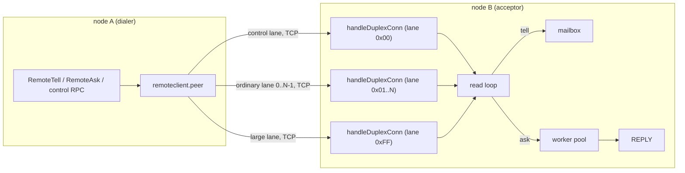
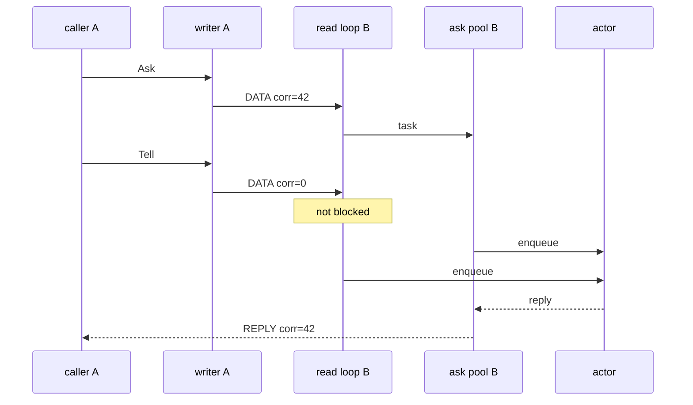
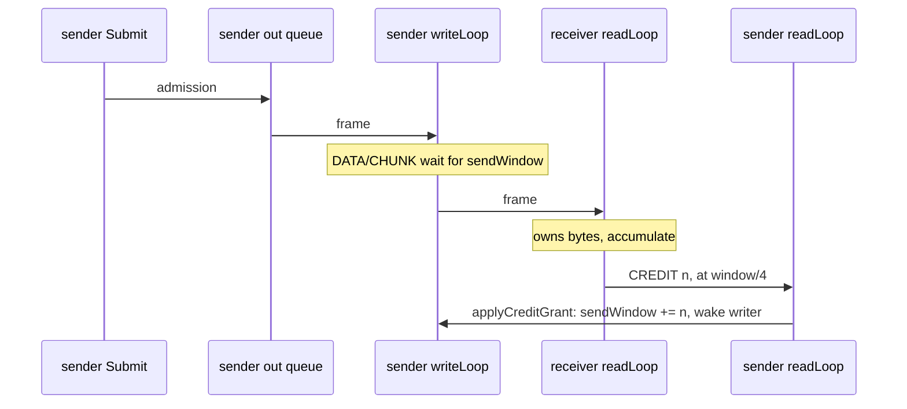

# 15. Remoting: the Transport

## Contents

- [What you will learn](#what-you-will-learn)
- [15.1 What remoting is](#151-what-remoting-is)
- [15.2 Why the engine changed](#152-why-the-engine-changed)
- [15.3 Architecture](#153-architecture)
  - [Protocol and transport](#protocol-and-transport)
  - [Lanes](#lanes)
  - [Connection lifecycle and liveness](#connection-lifecycle-and-liveness)
- [15.4 The wire protocol](#154-the-wire-protocol)
  - [Frame header](#frame-header)
  - [Handshake](#handshake)
  - [Envelopes](#envelopes)
- [15.5 Correlation and dispatch](#155-correlation-and-dispatch)
- [15.6 Large messages](#156-large-messages)
- [15.7 Reference tables and buffers](#157-reference-tables-and-buffers)
  - [Tables](#tables)
  - [Buffer ownership](#buffer-ownership)
- [15.8 Flow control](#158-flow-control)
- [15.9 Compatibility: two protocols on one port](#159-compatibility-two-protocols-on-one-port)
  - [The legacy protocol](#the-legacy-protocol)
  - [Accepting both](#accepting-both)
  - [Dialling in auto mode](#dialling-in-auto-mode)
- [15.10 Semantics, defaults and invariants](#1510-semantics-defaults-and-invariants)
  - [Failure and delivery](#failure-and-delivery)
  - [Configuration](#configuration)
  - [Invariants to preserve](#invariants-to-preserve)
  - [Where things live](#where-things-live)
  - [Deferred work](#deferred-work)
- [Guarantees](#guarantees)
- [Implementation details (may change)](#implementation-details-may-change)
- [Behaviours to know](#behaviours-to-know)

## What you will learn

- Why the unary engine was replaced, and what each part of the duplex protocol answers.
- Where the line runs between the protocol (`duplexConn`) and the transport (`FramedConn`), and what a lane is.
- The 16-byte frame header, the ten frame types, the HELLO negotiation and the envelope layouts.
- How a frame is correlated, dispatched, chunked, compressed by reference tables and released back to a pool.
- The two byte counters of flow control, and when the receiver gives credit back.
- How a node speaks both the duplex and the legacy protocol during a rolling upgrade, and what the legacy frames look like.
- What remoting promises on failure: at-most-once, per-pair FIFO, backpressure instead of drops.

## 15.1 What remoting is

Remoting is a persistent, duplex, correlation-driven protocol over TCP. A node keeps a few long-lived connections to each peer, called lanes. Every connection carries frames in both directions, and many requests are in flight on it at once. An older protocol, one protobuf request and one response per socket exchange, is still in the code for mixed-version clusters ([§15.9](#159-compatibility-two-protocols-on-one-port)).

**Goals:**

1. Remove head-of-line blocking in socket use, server dispatch and outbound batching.
2. Carry messages above the legacy 16 MiB frame ceiling without starving small messages.
3. Cut copies on the default protobuf path and avoid per-message envelope allocations where possible.
4. Replace heuristic wire detection with a versioned, negotiated protocol.
5. Replace silent overload drops with bounded, credit-based backpressure.

**Non-goals:**

- Delivery stays **at-most-once**. Reliable delivery is a protocol above remoting.
- The public actor API (`Tell`, `Ask`, `RemoteTell`, `RemoteAsk` and the batch variants) and the public `remote.Serializer` contract do not change.
- Cluster membership and the distributed registry use their own transports. They are not remoting traffic.
- User payload formats are unchanged. The envelope is not a public serialization format.

**Capability revisions.** The protocol grew in four cumulative steps, and a connection runs at the lower of the two peers' revisions (`negotiateHello` in `internal/net/handshake.go`):

| Revision | Constant | Adds |
|---|---|---|
| 1 | `CapabilityRevisionBaseline` | `DATA`, `REPLY`, `ERROR`, `PING`, `PONG` |
| 2 | `CapabilityRevisionChunking` | `CHUNK` frames, messages larger than a frame |
| 3 | `CapabilityRevisionTables` | `TABLE` frames, table references in envelopes |
| 4 | `CapabilityRevisionCredits` | `CREDIT` frames, receiver-granted send window |

Both the dialer (`peer.dialLane` in `internal/remoteclient/peer.go`) and the acceptor (`RemotingServer.handleDuplexConn` in `internal/net/remoting_server.go`) advertise revision 4. There is no QUIC transport; TCP is the only implementation.

Two packages named in the remoting area are not part of the transport: `internal/chunk` splits a slice into batches for the relocation worker, and `internal/codec` converts spawn options, supervisors and similar values to and from protobuf. Neither touches frames.

## 15.2 Why the engine changed

The legacy engine was a length-prefixed, unary protobuf-over-TCP protocol. A caller took a socket from a pool, wrote a request, read the response, and returned the socket. Each limitation of that design has one answer in the duplex protocol:

| Legacy limitation | Design response |
|---|---|
| A socket was held for a whole request/response exchange | Long-lived duplex connections with correlation IDs |
| Server handlers ran inline on the read loop | A read loop that parses and hands off; work that needs a reply goes to a worker pool |
| One coalescer writer serialised all traffic to a destination | Per-connection writer batching and independent lanes |
| A frame above 16 MiB closed the connection | Chunking with bounded reassembly and in-band errors |
| Addresses and type names were repeated in every message | Per-connection `TABLE` frames and varint references |
| Compression had to be configured identically by hand on both sides | HELLO negotiation before the compression wrapper is applied |
| A full queue dropped batches silently | Byte-bounded admission plus receiver-granted credits |
| Write and read-idle settings had no effect | Write deadlines and per-lane PING/PONG liveness |

The revisions build on one another. Revision 1 carries the frame header, the negotiated session, the correlation table, the dispatch split and the fallback to the legacy protocol; lanes, which isolate system traffic, are declared in every `HELLO` whatever the revision. Revision 2 adds chunking, which separates message size from frame size, revision 3 adds tables, which remove repeated identities from the envelopes, and revision 4 adds credits. Buffer ownership does not depend on the revision. The maintainer keeps these two apart on purpose: ownership controls how long a buffer lives; credits control what the network may deliver and how much memory a peer must hold.

## 15.3 Architecture

### Protocol and transport

```go
type Transport interface {
    Dial(ctx context.Context, peer string, lane LaneSpec) (FramedConn, error)
    Listen(addr string) (Acceptor, error)
}

type FramedConn interface {
    WriteFrames(frames ...Frame) error
    ReadFrame() (Frame, error)
    Close() error
    NetConn() net.Conn
    SetMaxFrameSize(maxSize uint32)
    MaxFrameSize() uint32
}
```

The transport moves whole frames and owns the socket (`internal/net/transport.go`). `TCPTransport` and `tcpFramedConn` are the only implementation. Everything else is protocol and lives in `duplexConn` (`internal/net/duplex.go`): the handshake result, lane checks, correlation, chunking, tables and credits. `duplexConn` is exposed as the `DuplexSession` interface (`internal/net/duplex_open.go`). The boundary was drawn so that another transport could map lanes to streams without changing frames, envelopes, correlation or flow control.

The boundary is not perfectly clean. `duplexConn` reaches through `NetConn` to set read and write deadlines, and it uses optional methods of `tcpFramedConn` by type assertion: `BufferedReadBytes`, `AbandonPendingRead` and `releaseReadPayload`. The dial path does the same for `ReplaceNetConn` and `EnableReadBuffering` (`OpenDuplex` in `internal/net/duplex_open.go`), and `RemotingServer.handleDuplexConn` calls them directly on its `*tcpFramedConn`.

### Lanes



| Lane | Count | Traffic | Purpose |
|---|---|---|---|
| Control | 1 | Internal RPCs: watch, spawn, stop, lookup, cluster and system requests | System actions do not wait behind user traffic |
| Ordinary | `OrdinaryLanes`, default 1 | User tells and asks | One stable lane per receiver |
| Large | 1 | Receivers matching `LargeMessageDestinations`; oversized bulk control requests | Bulk transfers do not delay ordinary traffic |

Each lane is one TCP connection with its own reader, writer, queue, tables and credit window. A lane is dialled on first use (`peer.ensureLane` in `internal/remoteclient/peer.go`), kept while healthy, and closed when the peer is closed or the system stops. The lane count is a choice of the dialling side; the acceptor serves whatever lanes arrive.

**Routing** (`routeUser` in `internal/remoteclient/routing.go`). A receiver whose hierarchical path, the part after `host:port`, matches a `LargeMessageDestinations` pattern goes to the large lane. Patterns follow `path.Match`, so `*` stops at `/`. Every other receiver goes to ordinary lane `FNV-1a(receiver address) % OrdinaryLanes`. The peer caches the result per receiver, up to 8,192 entries (`peer.routeLocked`); beyond that the lane is recomputed on every send and is still the same.

A control request stays on the control lane. Three bulk requests (`RelocateBatchRequest`, `PersistPeerStateRequest`, `RemoteStateRequest`) move to the large lane when their encoded size exceeds `ChunkSize` (`isControlBulk` and `client.sendControlDuplex` in `internal/remoteclient/send.go`).

**Ordering.** The guarantee is FIFO **per sender-receiver pair**. With one ordinary lane, all ordinary traffic to a peer is effectively FIFO. Control traffic may overtake user messages by design, and large destinations have their own ordering domain. Raising `OrdinaryLanes` trades a narrower ordering domain for parallelism.

### Connection lifecycle and liveness

A `duplexConn` owns one reader goroutine (`readLoop`), one writer goroutine (`writeLoop`), a byte-bounded outbound queue, a pending-request table and its negotiated limits (`newDuplexConn`).

- **Writes.** `writeTimeout` bounds each socket write (`duplexConn.applyWriteDeadline`) and each wait for queue space when the caller's context has no deadline (`duplexConn.bindWriteDeadline`).
- **Liveness.** With `readIdleTimeout` set, the read loop arms a socket read deadline one interval ahead. When it expires with no inbound frame, the loop submits a `PING` and re-arms. A probe counts as missed only one full interval after it was admitted, and two misses close the connection (`duplexLivenessMissLimit`). Any inbound frame resets the count. A silent peer is therefore dropped after three intervals.
- **Deadlines inside a frame.** A read deadline can expire while a frame is half read. `tcpFramedConn.ReadFrame` keeps the bytes already consumed and the next call resumes the same frame, so the stream is never parsed from the middle.
- **Reclaim.** On the server, `idleTimeout` closes a connection that has received no frame at all for that long (`duplexConn.reclaimExpired`). PING and PONG are frames, so liveness traffic keeps an idle connection open. Client lanes have no reclaim window.
- **Failure.** A read or write error closes the connection (`duplexConn.failTransport`). Every pending ask is completed with an error frame (`pendingTable.failAll`) and partial chunk groups are discarded. An ask that picks up that frame returns the connection's close error, not an empty `ERROR`, so its caller sees a transport failure (`duplexConn.askResult`). Nothing is retransmitted. On the client, the closed handler removes the lane from the peer (`peer.handleLaneClosed`), and the next send dials again. A failed dial arms a per-lane backoff from one second, doubling to 30 seconds (`peer.recordDialFailure`).
- **Close.** `duplexConn.Close` lets the writer drain what was admitted, for at most `writeTimeout` (five seconds when unset), then closes the socket and waits for the reader.
- **Server shutdown.** A duplex connection is served by its own goroutines, not by an accept worker, so closing the listener does not end it. `RemotingServer` therefore tracks the duplex connections it accepted (`trackDuplexConn`). `RemotingServer.Shutdown(d)` marks the server as shutting down and, in the background, waits for the asks already admitted (for at most `d` when `d > 0`, without bound when `d == 0`, not at all when `d < 0`) and then closes every tracked connection, which flushes the replies already queued (`closeDuplexConns`). `Shutdown` itself returns at once, like `TCPServer.Shutdown`. From the moment shutdown begins, an ask is refused with `FAILED_PRECONDITION` carrying `ErrRemotingDisabled` and its handler does not run (`admitAsk`), a connection that completes its handshake is closed at once, and an ask that finds the ask pool already stopped closes its connection, so the peer sees the connection end rather than an error reply. A peer that holds a connection to a stopping node therefore gets either `ErrRemotingDisabled` or a transport failure. The grain engine releases the owner's registry entry at once on `ErrRemotingDisabled`, and on a transport failure only after the cluster membership confirms the owner has left (`actorSystem.releaseUnreachableGrainOwner` in `actor/grain_engine.go`).

## 15.4 The wire protocol

### Frame header

Every frame starts with a fixed 16-byte, big-endian header (`Frame` in `internal/net/frame.go`):

| Bytes | Field | Size | Meaning |
|---|---|---|---|
| 0 | `ver` | 1 byte | `ProtocolVersion`, `0x02`. It is also the byte the listener uses to tell duplex from legacy |
| 1 | `type` | 1 byte | `HELLO` 0x01, `HELLO_ACK` 0x02, `DATA` 0x03, `REPLY` 0x04, `ERROR` 0x05, `CHUNK` 0x06, `CREDIT` 0x07, `TABLE` 0x08, `PING` 0x09, `PONG` 0x0A |
| 2 | `flags` | 1 byte | bit 0 `hasMetadata`, bit 1 `expectsReply`, bit 2 `firstChunk`, bit 3 `lastChunk`; bits 4 to 7 must be zero |
| 3 | `lane` | 1 byte | control `0x00`, ordinary `index+1` (`0x01` to `0xFE`), large `0xFF` |
| 4..7 | `length` | 4 bytes, big-endian | body length, bounded by the negotiated frame limit |
| 8..15 | `correlation` | 8 bytes, big-endian | must be nonzero for `REPLY`, `CHUNK` and `DATA` with `expectsReply`; zero for a plain tell and for a connection-scoped `ERROR` |

`validateFrameHeader` checks version, type, reserved bits, length and the correlation rule on both encode and decode. What happens on a violation depends on where it is found:

| Violation | Found by | Result |
|---|---|---|
| Bad version, unknown type, reserved bits, length over the limit, missing correlation | `decodeFrameHeader` inside `ReadFrame` | The read fails and the connection closes. No `ERROR` is sent, except for a version mismatch during the handshake (`writeProtocolVersionError`) |
| Lane byte differs from the negotiated lane | `duplexConn.readLoop` | Connection-scoped `ERROR`, then close (`duplexConn.rejectWrongLane`) |
| `CHUNK` below revision 2, `TABLE` below revision 3, malformed chunk index or table entry | `handleInboundChunk`, `handleInboundTable` | Connection-scoped `ERROR`, then close (`duplexConn.rejectProtocol`) |
| Table reference that is unknown or not negotiated, in a `DATA` envelope | `RemotingServer.handleDuplexData` | Connection-scoped `ERROR`, then close |
| `CREDIT` below revision 4 | `duplexConn.handleInboundCredit` | Ignored, so a buggy peer is tolerated |

The close after an `ERROR` first lets the writer flush, so the frame can reach the peer (`duplexConn.drainAndCloseFramed`).

### Handshake

The dialer sends `HELLO`; the acceptor answers `HELLO_ACK`. Both carry the same protobuf message, `Hello` (`protos/internal/handshake.proto`): revision, system name, host, port, lane role and index, compression codec, `max_frame_size`, `max_message_size`, `initial_credits` and `max_concurrent_large_transfers`.

1. The dialer writes `HELLO` with the lane it wants (`performHello`).
2. The acceptor reads it, rejects a revision below 1 or an invalid lane with an `ERROR`, and computes the effective values (`acceptHello`, `negotiateHello`): the lower revision, the pairwise minimum of the four limits, the frame limit floored at 16 KiB, and the dialer's lane.
3. The acceptor chooses the codec: the dialer's proposal when it equals its own, otherwise `NONE` (`selectCompression`). It writes the effective values back as `HELLO_ACK`. The remoting server's own codec is the one given to `remote.WithCompression`, passed down by `actorSystem.startRemoteServer` through `WithRemotingServerCompression`; it is `NONE` by default.
4. The dialer computes the same minima and adopts the codec and the lane of the ACK (`OpenDuplex`). It accepts only its own proposal or `NONE` as the codec: any other answer gets a connection-scoped `ERROR` and fails the dial with `ErrUnexpectedCompressionCodec` (`performHello`). An older acceptor that answers "control" for every lane is thus followed, not fought.
5. Both sides wrap the socket in the chosen compression (`wrapCompression`), switch reads to a 64 KiB buffer, and start the loops.

Compression on a duplex connection needs care at close, because `Close` runs while the read loop is blocked inside the decoder and a write may be in flight. `compressedConn` (`internal/net/compress.go`) counts the goroutines inside the codec. A `Close` that finds none releases the codec first, so its last bytes reach the wire, then closes the socket: that is the legacy, single-owner case. A `Close` that finds one closes the socket first to unblock it, and the last call to leave releases the codec. Either way the codec is released exactly once, a later `Read` or `Write` returns `net.ErrClosed`, and a second `Close` does nothing.

The handshake runs in clear frames, before compression, so it stays readable whatever codec follows. It is bounded in time on both sides: by the caller's deadline on the dialer, and by a ten-second window on the acceptor that also covers the first byte (`acceptHandshakeTimeout`). A cancelled dial closes the socket to unblock the read.

### Envelopes

`DATA` is parsed by hand, not as protobuf (`DataEnvelope` in `internal/net/envelope.go`):

| Field | Size | Meaning |
|---|---|---|
| `senderRef` | reference | the sender's actor path |
| `receiverRef` | reference | the receiver's actor path |
| `typeRef` | reference | the message type name |
| `serializerID` | 1 byte | how the payload is encoded (table below) |
| `metaLen` | 4 bytes | metadata length; present only with `hasMetadata` |
| `metadata` | `metaLen` bytes | present only with `hasMetadata` |
| `payload` | rest of the body | the serialized message |

A reference is a uvarint. Nonzero is a table ID. Zero is followed by a uvarint length and that many literal bytes. Metadata is present only when the header has `hasMetadata`. It carries the propagated headers and the deadline as **remaining time**, so the receiver rebuilds the deadline on its own clock (`Metadata` in `internal/net/metadata.go`).

| Serializer ID | Payload |
|---|---|
| 0 | Internal protobuf: raw protobuf bytes, `typeRef` names the message. Control requests use this, with empty sender and receiver |
| 1 | Public protobuf serializer frame |
| 2 | JSON |
| 3 | CBOR |
| 255 | Custom serializer bytes, self-describing; `typeRef` must be empty |

IDs 0 to 3 require a type name; any other ID is rejected (`validateSerializerID`).

| Frame | Body |
|---|---|
| `REPLY` | `typeRef` \| `serializerID` \| `[metaLen metadata]` \| payload |
| `ERROR` | a marshalled `internalpb.Error` (code and message) |
| `CHUNK` | uvarint index \| uvarint total size (first chunk only) \| data |
| `CREDIT` | uvarint byte grant |
| `TABLE` | kind (1 byte: 0 actor path, 1 type name) \| uvarint id \| uvarint length \| literal |
| `PING`, `PONG` | empty; a `PONG` echoes the correlation of its `PING` |

## 15.5 Correlation and dispatch

**Asks.** `duplexConn.Ask` takes the next correlation ID from a per-connection counter, registers a waiter in the pending table, and submits the frame with `expectsReply`. The read loop hands a `REPLY` or a request-scoped `ERROR` to the waiter with that ID (`pendingTable.complete`). A timeout or a cancelled context removes the waiter, and a reply that arrives later is dropped and its buffer released. One slow ask never blocks the lane.

**The server read loop** reads, validates, reassembles, answers pings and applies credits. Application frames go to `RemotingServer.handleDuplexData`:

- `DATA` without `expectsReply` is a tell. The handler runs on the dispatch path and must do no more than enqueue into a mailbox.
- `DATA` with `expectsReply` is handed to the ask worker pool (`askPool`, a `WorkerPool[duplexAskTask]`). The worker runs the handler and submits a `REPLY` or an `ERROR` on the same connection (`handleDuplexAskTask`). The server never dials back.
- A type name with a registered `ProtoHandler` is a control request; any other ask goes to the user ask handler (`RemotingServer.dispatchDuplexAsk`).



A request-scoped `ERROR` is decoded on the client with the same table as a legacy error reply (`decodeErrorPayload` and `checkProtoError` in `internal/remoteclient`), so the same server answer gives the same Go error on both protocols: `CODE_UNAVAILABLE` is `ErrRemoteSendFailure`, `CODE_FAILED_PRECONDITION` is parsed into `ErrRemotingDisabled` and its siblings, a full mailbox is `ErrMailboxFull`. A decode failure of one envelope is answered with a request-scoped `ERROR` and the connection stays up. A handler panic in the pool is recovered and answered with an `ERROR` (`RemotingServer.recoverDuplexAsk`). The pool has no capacity limit: when no worker is idle it starts a new goroutine, and `AddTask` fails only when the pool is stopped or not yet started (`WorkerPool.AddTask` in `internal/net/worker_pool.go`). A stopped pool closes the connection ([§15.3](#153-architecture)); a pool that has not started is answered with `CODE_UNAVAILABLE` (`RemotingServer.handleDuplexData`). The number of asks a server runs at once is therefore bounded only by what its peers send.

**Pipelined dispatch.** On the acceptor the read loop calls the handler inline while the connection is quiet. When more bytes are already buffered, or frames are queued, it queues the frame and a transient goroutine drains the queue in arrival order (`duplexConn.deliverInbound`, `duplexConn.dispatchLoop`). The drainer exits ten milliseconds after the queue runs dry, so an idle connection holds no dispatch goroutine.

**Writer batching.** The writer takes up to 32 ready frames and writes them in one vectored call (`tcpFramedConn.WriteFrames`). This byte-level batching is separate from the tell coalescer of the client, which packs many tells into one `RemoteTellRequest` and sends it as an internal-protobuf `DATA` tell on an ordinary lane (`client.flushTellBatchDuplex`). A batch whose marshalled size exceeds the negotiated message limit, less a 4 KiB margin, is split in order into several such tells (`tellBatchSplitLimit` in `internal/remoteclient/send.go`). The coalescer stays active for duplex peers (`internal/remoteclient/coalescer.go`).

## 15.6 Large messages

A logical `DATA` or `REPLY` frame larger than `ChunkSize` is sent as a group of `CHUNK` frames when the connection is at revision 2 or above (`duplexConn.submitLogical` in `internal/net/duplex_chunk.go`).

**Sender:**

1. Reject a frame above the negotiated `MaxMessageSize` with `ErrMessageTooLarge`. At revision 1, a frame above the frame limit fails the same way: the peer cannot chunk.
2. Serialise the logical frame once, header included (`encodeLogicalFrame`).
3. Pick the group correlation: the frame's own for an ask or a reply, a fresh one for a tell.
4. Take one slot of the per-connection semaphore sized by `MaxConcurrentLargeTransfers` (`duplexConn.acquireLarge`). The wait is bounded like any submit.
5. Cut the bytes into chunks whose body, prefix included, is at most `ChunkSize` (`splitLogicalChunks`). Chunk data are subslices of the one buffer. The first chunk has `firstChunk`, index 0 and the total size; the last has `lastChunk`; `expectsReply` is set on the first only.
6. Submit the chunks in order. If one fails after the first, send an empty `lastChunk` so the receiver frees the group (`duplexConn.emitChunkAbort`). The abort is detached from the caller's cancelled context; if it cannot be admitted either, the connection is failed.

**Receiver** (`chunkReassembler.Push` in `internal/net/reassembly.go`):

| Case | Result |
|---|---|
| First chunk declares more than `MaxMessageSize` | Request-scoped `ERROR`, nothing allocated, connection stays up |
| First chunk while `MaxConcurrentLargeTransfers` groups are open | Request-scoped `ERROR`, connection stays up |
| Index gap, duplicate first chunk, data beyond the declared total | Protocol violation: `ERROR`, then close |
| Continuation for an unknown group | Ignored (trailing chunks after a reject) |
| Short group closed by `lastChunk` | Group freed (sender abort) |
| Complete | The buffer is decoded as a logical frame and dispatched like an unchunked one |

The reassembly buffer is one allocation of the declared size, made only after both caps pass.

A receiver that matches `LargeMessageDestinations` uses the large lane. An oversized message to any other receiver is chunked **in place** on its ordinary lane, which keeps that actor's FIFO order. `LargeMessageDestinations` is therefore a performance and isolation knob, not a correctness gate. A large reply stays on the lane of its request.

## 15.7 Reference tables and buffers

### Tables

At revision 3 each connection has four tables: sender and receiver, for actor paths and for type names (`withDuplexNegotiated`).

- **Sender.** `duplexConn.PrepareRef` looks the literal up; on first use it assigns the next ID, starting at 1, and queues a `TABLE` frame **under the table mutex**, before the caller can queue the message that uses the ID (`senderTable.register`). With a single writer, registration always precedes use, and no acknowledgement is needed.
- **Overflow.** A table holds 8,192 entries per kind. A full sender table returns ID 0 and the literal goes inline. So does a `TABLE` frame refused by a full writer queue: the registration is rolled back and a later message tries again.
- **Receiver.** `handleInboundTable` installs the entry. A repeated identical entry is ignored. A conflicting ID, an unknown kind, a zero ID, an empty literal or overflow is a protocol violation.
- **Reconnect.** Tables belong to the connection. A new connection starts empty. The peer's route cache stores a receiver's table ID together with the session that assigned it, and uses the ID only on that session (`encodeUserDataEnvelope` in `internal/remoteclient/send.go`).

On the receiving side, a table hit for the sender also returns a cached opaque handle (`receiverTable.resolveRef`). The actor layer supplies the resolver, which builds the sender's `*PID` once per table entry (`WithRemotingServerSenderResolver`; `actorSystem.duplexRemoteTell` in `actor/remote_server.go`). `internal/net` stores it as `any` and stays independent of the `actor` package.

### Buffer ownership

- `ReadFrame` draws `DATA`, `REPLY`, `ERROR` and `CHUNK` bodies from a size-bucketed pool (`tcpReadPool`). The envelope is parsed in place and the payload is a subslice of that body.
- The body goes back to the pool exactly once: after the tell handler returns, after the ask worker finishes, after a chunk is copied into its group, or when a late reply is dropped. Client callers release through `DuplexSession.ReleasePayload`.
- A custom serializer may keep its input. For serializer ID 255 the payload is copied before `Deserialize` (`actorSystem.deserializeDuplexPayload`, `deserializeReplyEnvelope`).
- HELLO, control requests and tell batches are marshalled into a pooled buffer and released as soon as the envelope is built (`MarshalProtoAppend`, `ReleaseMarshalBuffer`). `ERROR` bodies use plain `proto.Marshal`: they are queued for the writer and nothing signals when the write is done.

Generated protobuf types use the Opaque API. Remoting code uses builders and accessors, never struct fields. This changes how the code reads and writes the types, not the wire format.

## 15.8 Flow control

Revision 4 uses two byte counters. Each charges a frame its header plus its body (`frameWireCost`).

1. The **admission queue** (`outBytes` against `maxOutBytes`) bounds local memory before the socket.
2. The **send window** (`sendWindow`) bounds the `DATA` and `CHUNK` bytes the peer has not yet taken.

Both start at the negotiated `initial_credits`, which is the pairwise minimum of the two `CreditWindow` settings.



**Sender.** The writer charges the window when it moves a frame into the write batch, not at admission (`duplexConn.fillWindowedBatch`). Windowed frames without credit wait in the writer; `REPLY`, `ERROR`, `TABLE`, `CREDIT`, `PING` and `PONG` are exempt and pass them (`duplexConn.classifyOutbound`). That keeps credits, errors and liveness flowing when data is parked. One frame at least as large as the whole window may go when the window is full; the counter turns negative until grants restore it (`duplexConn.canChargeWindow`). That guarantees progress when the two sides are configured differently.

`CREDIT`, `PING`, `PONG` and `ERROR` also bypass the admission cap (`admissionExemptFrameType`). A submit that finds the queue full waits until the caller's deadline, or `writeTimeout`, and then returns `ErrDuplexBackpressure`.

**Receiver.** It grants a frame's bytes once, when it takes ownership (`duplexConn.noteOwnedBytes`):

| Frame | Granted when |
|---|---|
| `CHUNK` | Appended to its group, rejected, or ignored. The reassembled frame is not granted again |
| Ask or control `DATA` | Handed to the worker pool, or rejected |
| Tell `DATA` | The message **leaves the mailbox**, or fails on the way to it |

The tell row is a credit lease (`CreditLease` in `internal/net/duplex_lease.go`). The dispatch context carries the lease. The actor-side handler splits it into one share per message of the frame, shares summing to the frame cost, and each message carries its share into the mailbox. The share is released when the actor takes the message out (`PID.dispatchOne` in `actor/pid.go`), when delivery fails, or when the actor is torn down with messages still queued (`remoteHoldRegistry` in `actor/remote_hold_registry.go`). A handler that does not claim the lease gets the full grant when it returns, and a handler that panics has the remainder repaid. A stalled consumer therefore stops the grants, and its senders see backpressure instead of an unbounded mailbox.

Grants are batched: the accumulator is flushed as one `CREDIT` frame when it holds a quarter of the window (`duplexConn.flushGrants`). A grant that cannot be queued is kept and retried after the next write. Because chunks are granted as they are appended, a message larger than the window completes without waiting for the application.

## 15.9 Compatibility: two protocols on one port

### The legacy protocol

A legacy connection carries one request and, for most types, one response. Each is a length-prefixed frame (`ProtoSerializer` in `internal/net/proto_serializer.go`). All integers are big-endian `uint32`, and `totalLen` covers the whole frame, itself included.

| Field | Size | Meaning |
|---|---|---|
| `totalLen` | 4 bytes | length of the whole frame, itself included |
| `nameLen` | 4 bytes | length of the type name |
| `metaLen` | 4 bytes | length of the metadata; with metadata only |
| type name | `nameLen` bytes | full protobuf name of the message |
| metadata | `metaLen` bytes | with metadata only |
| proto bytes | rest of the frame | the marshalled message |

Without metadata the frame is `totalLen`, `nameLen`, type name and proto bytes; with metadata, `metaLen` follows `nameLen` and the metadata follows the type name.

The type name is the full protobuf name, resolved through the protobuf registry. The server tries the metadata layout first and falls back to the plain one (`RemotingServer.handleConn`). A frame above `MaxFrameSize`, a corrupt frame, an unknown type without a fallback handler, a handler error or a handler panic closes the connection.

- **Client.** A LIFO pool of idle sockets per endpoint, 32 at most, each dropped when it has been idle for 30 seconds and is next taken (`Client.Get` in `internal/net/client.go`). A new socket is wrapped in TLS, then in compression (`Client.dial`).
- **Server.** Eight accept loops hand accepted sockets to a sharded worker pool with `GOMAXPROCS × 2` shards and a five-second idle worker lifetime (`TCPServer.Serve` in `internal/net/tcp_server.go`). Connection structs are pooled.
- **Compression** wraps the whole connection (gzip, zstd or brotli; none by default). There is no negotiation on this path: both sides must be configured alike.
- **Allocation.** Frame buffers come from a pool of power-of-two buckets from 256 B to 4 MiB (`FramePool`); the type name is read from the frame without a copy; the frame size is computed first so a frame is built in one allocation; the length prefix is read into a stack array.

### Accepting both

`TCPServer.serveConn` applies TLS and then, in `auto` mode, reads one byte (`TCPServer.serveAutoConn`). `0x02` goes to the duplex handler; any other byte goes to the legacy path. The byte is put back in front of the stream (`prependConn`). The match is exact because legacy gzip and zstd streams start with other bytes. Legacy brotli has no magic byte and can start with `0x02`, so a deployment that uses brotli on the legacy path must pin a protocol.

`remote.ProtocolPin` sets both sides of a node (`WithProtocolPin`):

| Pin | Accept | Dial |
|---|---|---|
| `auto` (default) | Sniff the first byte | Duplex first, legacy on fallback |
| `legacy` | No sniff, legacy only | Legacy only |
| `duplex` | Close a connection whose first byte is not `0x02` | Duplex only, no fallback |

### Dialling in auto mode

1. `peer.ensureLane` dials and sends `HELLO`.
2. EOF, a reset or a broken pipe before `HELLO_ACK` marks the peer legacy (`isLegacyHandshakeFailure`). A timeout does not, and neither does a refused connection.
3. The call is retried once on the legacy path, and the peer stays legacy for 30 seconds (`peerLegacyReprobeInterval` in `internal/remoteclient/protocol_cache.go`).
4. After that the next send probes duplex again. Before the duplex lane is used, the peer waits for every legacy send in flight to finish (`peer.waitLegacyDrain`), so the switch does not reorder messages.

## 15.10 Semantics, defaults and invariants

### Failure and delivery

- A tell that returns `nil` was **admitted**, not delivered.
- A tell with no live lane is queued on a per-lane pump, byte-capped at the credit window (`peer.admitTell`, `tellPump`). A full pump blocks until the caller's deadline, or `writeTimeout`, and then returns `errors.ErrRemoteSendBackpressure`.
- A tell that fails after admission (dial, encode, write) is reported through the tell-failure handler and becomes a dead letter. The caller is not told.
- A tell whose write fails because the lane died never reached the writer queue. The pump dials once more and sends it again, in place, before the tells behind it (`peer.deliverAdmittedTell`). Frames already queued on a dead connection are not resent.
- A slow receiver slows its senders through credits. A direct send waits in the admission queue and returns `errors.ErrRemoteSendBackpressure` to its caller after the deadline or `writeTimeout`. A tell sent by the pump or the coalescer waits the same way with no caller: one still not admitted after `writeTimeout` fails and becomes a dead letter, like any other failure after admission (`peer.deliverAdmittedTell` in `internal/remoteclient/peer.go`; `coalescer.sendBatch` in `internal/remoteclient/coalescer.go`).
- Two losses leave no dead letter. Tells still in a writer's queue when its connection dies are discarded with the connection: they have no waiter, and the writer only stops (`duplexConn.writeLoop` and `duplexConn.drainOutboundPending` in `internal/net/duplex.go`). A chunked tell the receiver refuses at its first chunk ([§15.6](#156-large-messages)) gets a request-scoped `ERROR` under the tell's fresh group correlation; no waiter is registered for it, so the read loop releases the frame and the tell is lost (`duplexConn.readLoop` in `internal/net/duplex.go`).
- An ask timeout is local to its waiter and does not disturb the lane.
- Connection loss fails pending asks and discards partial reassembly.

### Configuration

| Setting | Default | Role | Negotiated |
|---|---|---|---|
| `OrdinaryLanes` | 1 (1 to 254) | Number of ordinary lanes dialled per peer | No |
| `LargeMessageDestinations` | empty | Path patterns routed to the large lane | No |
| `ChunkSize` | 256 KiB (16 KiB to 4 MiB) | Size above which a frame is chunked, and the chunk body limit | No; clamped to the negotiated frame limit |
| `MaxFrameSize` | 16 MiB (16 KiB to 16 MiB) | Bound on one frame | Minimum |
| `MaxMessageSize` | 16 MiB | Bound on one reassembled message | Minimum |
| `MaxConcurrentLargeTransfers` | 4 | Open chunk groups per connection, both ends | Minimum |
| `CreditWindow` | 16 MiB | Send window and admission cap | Minimum |
| `DialTimeout` | 5 s, set with `remote.WithDialTimeout` | Each TCP connect, on both protocols; also the whole lane setup of a dial started by the tell pump | No |
| `WriteTimeout` | 10 s | Socket writes and admission waits | No |
| `ReadIdleTimeout` | 10 s | Liveness probe interval | No |
| `IdleTimeout` | 1,200 s | Server reclaim of a silent duplex connection; on a legacy connection, the deadline for reading the next request and writing its response | No |
| `ProtocolPin` | `auto` | [§15.9](#159-compatibility-two-protocols-on-one-port) | No |
| Table capacity | 8,192 | Per kind, per connection; not configurable | No |

`Config.Validate` (`remote/config.go`) also requires `MaxFrameSize ≥ ChunkSize`, `MaxMessageSize ≥ MaxFrameSize` and at most 4 GiB, `CreditWindow ≥ ChunkSize`, and `ReadIdleTimeout < IdleTimeout` when both are set. `MaxFrameSize` stays much larger than a chunk because a revision-1 peer cannot chunk.

### Invariants to preserve

- A frame is valid only on its negotiated lane and at its negotiated revision.
- A `TABLE` registration precedes every use of its ID on that connection.
- A chunk group allocates nothing before its size and the concurrent-group cap pass.
- At revision 4, every accepted `DATA` or `CHUNK` byte is granted exactly once on a healthy connection.
- Credits, errors and liveness frames pass a writer parked on the window.
- A pooled payload is released exactly once, and custom serializer bytes are copied before user code can keep them.
- FIFO holds per sender-receiver pair on the selected lane. Nothing is promised across lanes.
- A switch from legacy to duplex drains legacy sends first.

### Where things live

| Area | Location |
|---|---|
| Framing, handshake, transport, duplex lifecycle, chunks, tables, credits | `internal/net` |
| Peers, routing, lanes, protocol cache, tell pump, coalescer | `internal/remoteclient` |
| Actor dispatch, sender-PID resolution, credit shares in mailboxes | `actor/remote_server.go`, `actor/pid.go`, `actor/remote_hold_registry.go` |
| Configuration and options | `remote/config.go`, `remote/option.go`, `remote/protocol_pin.go` |
| Protobuf schemas and generated Opaque API types | `protos/internal`, `internal/internalpb`, `buf.gen.yaml` |
| Operator documentation | `docs/advanced/remoting.mdx` |

### Deferred work

- **QUIC transport.** One connection per peer, streams for lanes, short-lived streams for large transfers, behind the existing `Transport` boundary. TCP stays the default because it can be deployed everywhere.
- **Legacy removal.** In the next major release: delete the unary fallback, the first-byte sniff, the protocol pins and the legacy flush path of the coalescer. The coalescer itself stays for duplex tell batching. The frame limit can then be tightened towards the chunk size.

## Guarantees

| Statement | Enforced by |
|---|---|
| A header with a bad version, an unknown type, reserved bits, an oversized length or a missing correlation is rejected; a zero frame limit is raised to the floor | `TestDecodeFrameHeaderAdversarial` in `internal/net/frame_test.go` |
| Negotiation takes the lower revision and the pairwise minimum of the frame limit, the message limit and the credit window | `TestNegotiateHelloPairwiseMinimum` in `internal/net/handshake_test.go` |
| The acceptor keeps a codec only when both sides name the same one, and answers `NONE` otherwise | `TestHandshakeCompressionAgreement` in `internal/net/handshake_test.go`; `TestRemotingServerHandleDuplexConnNegotiatesCompression` in `internal/net/remoting_server_test.go` |
| An actor system configured with `remote.WithCompression` answers that codec to a dialer that proposes it, and `NONE` to any other proposal | `TestRemoteServerNegotiatesDuplexCompression` in `actor/remote_server_test.go` |
| A negotiated codec compresses data, chunked data and pings on a duplex connection, for gzip, zstd and brotli | `TestRemotingServerDuplexCompressedRoundTrip` in `internal/net/remoting_server_test.go` |
| The dialer rejects a `HELLO_ACK` codec that is neither its proposal nor `NONE` | `TestPerformHelloRejectsUnexpectedAckCodec` in `internal/net/handshake_test.go` |
| Closing a compressed connection while a read is blocked or a write is in flight releases the codec once and is idempotent | `TestCompressedConnCloseWhileReadBlocked`, `TestCompressedConnCloseWhileWriteInFlight` and `TestCompressedConnCloseIdle` in `internal/net/compress_test.go` |
| A version mismatch in the handshake is answered with a connection-scoped `ERROR` | `TestHandshakeVersionMismatchInBandError` in `internal/net/handshake_test.go` |
| The `HELLO_ACK` echoes the dialer's lane | `TestAcceptHelloAckEchoesDialerLane` in `internal/net/handshake_test.go` |
| A peer that connects and never sends `HELLO` is dropped | `TestAcceptHelloHandshakeTimeout` in `internal/net/remoting_server_test.go` |
| A frame on the wrong lane gets a connection-scoped `ERROR` and the connection closes | `TestDuplexRejectsMismatchedLanePing` in `internal/net/duplex_test.go` |
| A silent peer is closed, and never before three probe intervals have passed | `TestDuplexLivenessClosesAfterTwoMissedPongs` in `internal/net/duplex_test.go` |
| A read deadline that expires inside a frame loses no bytes; the next read resumes the frame | `TestFramedConnReadFrameResumesAcrossDeadline` in `internal/net/transport_test.go` |
| Inbound PINGs keep a connection alive past the server idle timeout | `TestDuplexConnIdleTimeoutRefreshedByPing` in `internal/net/duplex_test.go` |
| Replies are matched by correlation, in any order | `TestDuplexAskOutOfOrder` in `internal/net/duplex_test.go` |
| An ask timeout clears its waiter; late replies are dropped and later asks still complete | `TestDuplexAskTimeoutClearsPending` and `TestLateCorrelatedReplyDoesNotStallReader` in `internal/net/duplex_test.go` |
| A full outbound queue returns `ErrDuplexBackpressure` at the deadline | `TestDuplexBackpressure` in `internal/net/duplex_test.go` |
| A revision-1 connection rejects an inbound `CHUNK`, and fails an oversized send with `ErrMessageTooLarge` | `TestDuplexRevisionOneRejectsInboundChunk` and `TestDuplexRevisionOneOversizeFailsFast` in `internal/net/duplex_chunk_test.go` |
| An oversized group and a group beyond the concurrent cap are soft-rejected and the connection stays usable; an index gap is a hard error | `TestReassemblerOversizeSoftReject`, `TestReassemblerConcurrentCapSoftReject` and `TestReassemblerBadIndexHardError` in `internal/net/reassembly_test.go` |
| A sender beyond the concurrent-transfer cap waits and then gets backpressure | `TestDuplexChunkSenderGating` in `internal/net/duplex_chunk_test.go` |
| A chunked tell keeps its place between the tells around it | `TestDuplexChunkedTellOrdering` in `internal/net/duplex_chunk_test.go` |
| A 100 MiB transfer on the large lane does not raise ordinary-lane latency beyond the test's budget | `TestDuplexChunked100MiBNoOrdinaryLatencyImpact` in `internal/net/duplex_chunk_test.go` |
| The chunk size is clamped to the negotiated frame limit | `TestDuplexChunkSizeClampedToNegotiatedFrameLimit` in `internal/net/duplex_chunk_test.go` |
| A `TABLE` frame is on the wire before the `DATA` or the first `CHUNK` that uses its ID | `TestPrepareRefEmitsTableBeforeData` and `TestChunkedSendEmitsTableBeforeFirstChunk` in `internal/net/duplex_table_test.go` |
| A full sender table falls back to inline; a conflicting or overflowing install on the receiver is a hard error | `TestSenderTableRegisterAndOverflow` and `TestReceiverTableInstallRules` in `internal/net/table_test.go` |
| A revision-2 connection rejects an inbound `TABLE` | `TestRevisionTwoRejectsInboundTable` in `internal/net/duplex_table_test.go` |
| The sender handle is resolved once per table entry | `TestSenderHandleLazyResolve` in `internal/net/duplex_table_test.go` |
| An exhausted window parks the writer and a `CREDIT` resumes it; a `PING` passes a parked writer | `TestCreditWindowExhaustionParksAndCreditResumes` and `TestCreditExemptFramesBypassParkedWriter` in `internal/net/duplex_credit_test.go` |
| One frame larger than the window is sent at a full window and drives the counter negative | `TestCreditOversizedFrameAtFullWindow` in `internal/net/duplex_credit_test.go` |
| Grants are flushed at a quarter window; a revision-3 connection ignores `CREDIT` | `TestCreditGrantBatchingQuarterWindow` and `TestCreditRevisionThreeIgnoresCredit` in `internal/net/duplex_credit_test.go` |
| Lease shares sum to the frame cost; an unclaimed lease is granted in full and never twice | `TestCreditLeaseSplitApportionsExactly` and `TestCreditLeaseUnclaimedGrantsInFull` in `internal/net/duplex_lease_test.go` |
| A consumer that stops reading its mailbox makes `RemoteTell` return backpressure, and every admitted tell arrives once it resumes | `TestRemoteTellStalledConsumerBackpressure` in `actor/remote_server_test.go` |
| The listener routes by the first byte; the legacy pin skips the sniff; the duplex pin refuses a legacy peer | `TestServeConnSniffRoutesFirstByte`, `TestServeConnAcceptProtocolLegacySkipsSniff` and `TestServeConnAcceptProtocolDuplexRefusesLegacy` in `internal/net/tcp_server_test.go` |
| In auto mode a legacy peer is detected, cached as legacy and served on the legacy path; the mark expires | `TestProtocolCacheAutoFallbackLegacy` in `internal/remoteclient/peer_test.go`; `TestProtocolCacheLegacyExpired` in `internal/remoteclient/protocol_cache_test.go` |
| The switch from legacy to duplex waits for legacy sends in flight | `TestSwitchoverDrainOrder` in `internal/remoteclient/peer_test.go` |
| Lanes are dialled only when used | `TestLanesStayLazy` in `internal/remoteclient/peer_test.go` |
| A receiver always maps to the same ordinary lane; a matching path maps to the large lane and `*` matches one segment | `TestRouteUserUsesStableOrdinaryLane` and `TestRouteUserMatchesHierarchicalLargeDestination` in `internal/remoteclient/routing_test.go` |
| A tell to an unreachable peer is admitted and reported through the failure handler; a full pump returns `ErrRemoteSendBackpressure` | `TestRemoteTellUnreachablePeerAdmitsAndFansOut` and `TestAdmitTellBackpressureOnFullByteWindow` in `internal/remoteclient/tell_pump_test.go` |
| A tell whose lane died under the write, with the peer unreachable, is dead-lettered exactly once and not re-queued | `TestDeliverAdmittedTellRetriesInPlaceThenFansOut` in `internal/remoteclient/tell_pump_test.go` |
| `Validate` rejects a chunk size out of range, a credit window below the chunk size, a message limit below the frame limit, a lane count out of range and a read-idle timeout not below the idle timeout | `TestConfig` in `remote/config_test.go` |
| A duplex `ERROR` frame decodes to the same Go error as the legacy reply for the codes unavailable, failed precondition, resource exhausted, not found, deadline exceeded, already exists, invalid argument and internal error | `TestDuplexErrorFrameDecodesLikeLegacy` in `internal/remoteclient/send_test.go` |
| An ask whose connection closes under it fails with a transport error, not an empty `ERROR` | `TestDuplexAskFailsWithTransportErrorWhenPeerCloses` in `internal/net/duplex_test.go` |
| `Shutdown` closes the duplex connections, lets an ask admitted before it reply, refuses a later one with `ErrRemotingDisabled`, and with a negative timeout closes them at once; an ask on a stopped pool closes its connection | `TestRemotingServerShutdownClosesDuplexConnections`, `TestRemotingServerShutdownLetsAdmittedAskReply`, `TestRemotingServerShutdownWithoutWaitClosesDuplexConnections` and `TestRemotingServerDuplexAskOnStoppedPoolClosesConnection` in `internal/net/remoting_server_test.go` |
| `remote.WithDialTimeout` sets the dial timeout, and a non-positive value fails validation | `TestOption` in `remote/option_test.go`; `TestConfig` in `remote/config_test.go` |

## Implementation details (may change)

- The defaults of [§15.10](#1510-semantics-defaults-and-invariants), the 16 KiB frame floor, the 8,192-entry tables and route cache, and the 16 MiB limit on a table literal.
- 64-slot outbound and inbound channels per connection; at most 32 frames per vectored write; a 64 KiB read buffer installed after the handshake.
- The quarter-window grant threshold, the ten-millisecond drainer linger, the five-second close grace, the ten-second accept handshake window.
- Two missed probes as the liveness limit; the 30-second legacy re-probe; lane dial backoff from one second to 30 seconds.
- The read pool covers `DATA`, `REPLY`, `ERROR` and `CHUNK`; buckets run from 256 B to 4 MiB and larger buffers are allocated and collected.
- Reassembly buffers are not pooled.
- Pending waiters are pooled channels of capacity one, 1,024 at most.
- FNV-1a over the full receiver address as the lane hash.
- Legacy path: 32 idle sockets, 30-second idle timeout, eight accept loops, `GOMAXPROCS × 2` shards, a 20 MiB GC ballast.
- The legacy bridges in `RemotingServer.invokeDuplexTell` and `RemotingServer.dispatchDuplexUserAskViaLegacy`, used when no duplex handler is registered.

## Behaviours to know

| Behaviour | Source |
|---|---|
| A codec mismatch between two nodes is not an error on a duplex connection: the connection stays up, uncompressed. On a legacy connection a mismatch produces garbage | `selectCompression` in `internal/net/handshake.go` |
| A header-level violation after the handshake closes the connection without an `ERROR` frame | `duplexConn.readLoop` in `internal/net/duplex.go` |
| Credit for a tell comes back when the actor dequeues the message, not when it is enqueued. A blocked actor with a full window stalls every sender on that lane | `PID.dispatchOne` in `actor/pid.go`; `RemotingServer.handleDuplexData` in `internal/net/remoting_server.go` |
| A tell handler runs on the dispatch path of its connection. A handler that blocks stops all later frames of that lane | `RemotingServer.handleDuplexData` in `internal/net/remoting_server.go` |
| An ask deadline travels as remaining time and is enforced on the server; a tell carries metadata but no enforced deadline | `RemotingServer.handleDuplexData` in `internal/net/remoting_server.go` |
| A `PING` counts as activity for the server idle timeout, so liveness probes keep a healthy idle connection open | `duplexConn.readLoop` in `internal/net/duplex.go` |
| Timeouts and refused connections do not mark a peer legacy; only EOF, reset or broken pipe before `HELLO_ACK` do | `isLegacyHandshakeFailure` in `internal/remoteclient/peer.go` |
| A peer marked legacy is not probed for 30 seconds, even if it was upgraded a second later | `peer.ensureLane` in `internal/remoteclient/peer.go` |
| After a failed dial, sends on that lane fail at once with the same error until the backoff expires | `peer.ensureLane` and `peer.recordDialFailure` in `internal/remoteclient/peer.go` |
| A fire-and-forget tell never returns a transport error; only backpressure and the caller's own cancellation come back | `client.sendTellDuplex` in `internal/remoteclient/send.go` |
| A full table, or a `TABLE` frame refused by a full writer queue, makes the value travel as an inline literal, without an error | `senderTable.register` in `internal/net/table.go` |
| A server's ask worker pool has no capacity limit; it grows a goroutine per concurrent ask | `WorkerPool.AddTask` in `internal/net/worker_pool.go` |
| Tells queued on a connection that dies, and a chunked tell refused at its first chunk, are lost without a dead letter | `duplexConn.writeLoop` and `duplexConn.readLoop` in `internal/net/duplex.go` |
| The `HELLO` proposes a lane, but the session enforces the lane of the `HELLO_ACK` | `OpenDuplex` in `internal/net/duplex_open.go` |
| `Close` on a session from its own inbound or closed handler deadlocks; the peer closes lanes from another goroutine | `peer.retireLaneAsync` in `internal/remoteclient/peer.go` |
| With a negotiated message limit of zero the sender applies no size check, while the receiver falls back to 16 MiB. A GoAkt peer never advertises zero: both sides ignore a zero setting and default to 16 MiB, so only a foreign peer can cause it | `duplexConn.submitLogical` in `internal/net/duplex_chunk.go`; `newChunkReassembler` in `internal/net/reassembly.go` |
| In the legacy metadata frame, `metaLen` comes before the type name | `ProtoSerializer.MarshalBinaryWithMetadataTo` in `internal/net/proto_serializer.go` |
| Legacy brotli can start with `0x02`; in `auto` mode such a connection is taken for duplex | `TCPServer.serveAutoConn` in `internal/net/tcp_server.go` |
