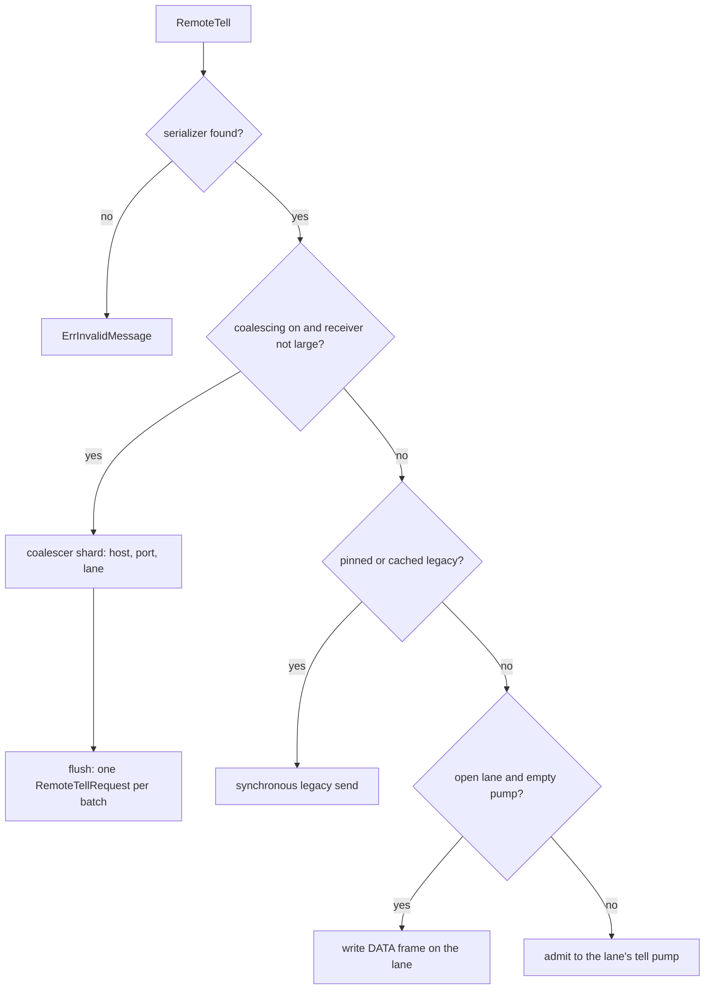

# 16. Remoting: the Remote Client

## Contents

- [What you will learn](#what-you-will-learn)
- [16.1 The client and its operations](#161-the-client-and-its-operations)
- [16.2 Construction and configuration](#162-construction-and-configuration)
- [16.3 Serializers](#163-serializers)
- [16.4 Peers](#164-peers)
  - [Getting a lane](#getting-a-lane)
  - [Retiring a lane](#retiring-a-lane)
  - [Closing a peer](#closing-a-peer)
  - [The route cache](#the-route-cache)
- [16.5 The protocol cache and the pin](#165-the-protocol-cache-and-the-pin)
- [16.6 Routing: which lane a call takes](#166-routing-which-lane-a-call-takes)
- [16.7 Sending a tell](#167-sending-a-tell)
- [16.8 The coalescer](#168-the-coalescer)
- [16.9 Sending an ask and a control request](#169-sending-an-ask-and-a-control-request)
- [16.10 Context, metadata and deadlines](#1610-context-metadata-and-deadlines)
- [16.11 Errors](#1611-errors)
- [16.12 Callers in the actor package](#1612-callers-in-the-actor-package)
- [Guarantees](#guarantees)
- [Implementation details (may change)](#implementation-details-may-change)
- [Behaviours to know](#behaviours-to-know)

## What you will learn

- What the `Client` interface offers, which of its operations are user messages and which are control requests, and how actor code reaches it.
- How a peer is created, how it dials, reuses and retires its lanes, and the one lock rule that keeps lane teardown from deadlocking.
- How the protocol cache and the protocol pin decide between the duplex and the legacy protocol for every call.
- Which lane each call takes, and the four paths a `RemoteTell` can follow: the coalescer, a direct write, the tell pump and the legacy send.
- How the coalescer batches tells without a delay, bounds its memory, and never loses a message it accepted.
- How asks and control requests carry their deadline and propagated headers, and how every failure, local or remote, becomes a Go error.

## 16.1 The client and its operations

`internal/remoteclient` is the outbound half of remoting: everything a node does to reach another node goes through one `Client` (`Client` in `internal/remoteclient/client.go`). [Chapter 15](chap-15.md) describes the transport underneath it; [Chapter 17](chap-17.md) describes the server that answers it and the public `remote` package that configures it.

An actor system builds its client in the first step of its startup chain, whether or not remoting is enabled, and every PID it constructs holds it ([Chapter 3, §3.3](chap-03.md#33-start); `actorSystem.setupRemoting` in `actor/actor_system.go`). The implementation is the unexported `client` type; `NewClient` returns it behind the interface.

The interface has three kinds of operation:

| Kind | Operations | Path |
|---|---|---|
| User messages | `RemoteTell`, `RemoteAsk`, `RemoteBatchTell`, `RemoteBatchAsk` | User lanes, the coalescer, the tell pump ([§16.6](#166-routing-which-lane-a-call-takes) to [§16.8](#168-the-coalescer)) |
| Control requests | `RemoteLookup`, `GetReliableCompanion`, `RemoteSpawn`, `RemoteSpawnChild`, `RemoteReSpawn`, `RemoteStop`, `RemoteReinstate`, `RemoteWatch`, `RemoteUnWatch`, the queries `RemoteRole`, `RemoteStashSize`, `RemoteMetric`, `RemoteChildren`, `RemoteState`, `RemotePassivationStrategy`, `RemoteDependencies`, `RemoteParent`, `RemoteKind`, the grain calls `RemoteActivateGrain`, `RemoteTellGrain`, `RemoteTellGrainOneWay`, `RemoteAskGrain`, and the cluster calls `RelocateBatch`, `PersistPeerState` | `client.sendControl` in `internal/remoteclient/send.go` ([§16.9](#169-sending-an-ask-and-a-control-request)) |
| Plumbing | `NetClient`, `Close`, `ClosePeer`, `Compression`, `TLSConfig`, `Serializer` | Local only |

**Every control request has the same shape** (for example `client.RemoteKind` in `internal/remoteclient/client.go`). In order:

1. Validate local input: a spawn, child-spawn or grain request is validated and sanitised first, and the port must fit an `int32` (`Int2Int32` in `internal/strconvx/convert.go`). `RelocateBatch` and `PersistPeerState` carry no port and skip this step.
2. Enrich the context with propagated headers and the deadline (`client.enrichContext`, [§16.10](#1610-context-metadata-and-deadlines)).
3. Build the internal protobuf request and send it with `client.sendControl`.
4. Turn an `internalpb.Error` answer into a Go error with `checkProtoError` ([§16.11](#1611-errors)), then, for an operation that returns a value, check the answer's type. `RemoteActivateGrain`, `RemoteTellGrain` and `RemoteTellGrainOneWay` check only for an error.

The grain calls are control requests too: `RemoteTellGrain` sends a `RemoteTellGrainRequest` and waits for the answer, which the remote node sends after the grain has handled the message; `RemoteTellGrainOneWay` sets the request's one-way flag, so the node answers once the message is enqueued (`client.remoteTellGrain` in `internal/remoteclient/client.go`). How the grain engine uses them is [Chapter 14](chap-14.md)'s subject.

## 16.2 Construction and configuration

`NewClient` (`internal/remoteclient/client.go`) fills in defaults, registers the protobuf serializer for every `proto.Message`, applies the options in order, then:

- installs one TLS session cache (32 entries) on the stored TLS configuration when it has none, so every per-dial clone resumes sessions;
- builds the composite deserializer once ([§16.3](#163-serializers));
- sets the factory for legacy net clients.

| Setting | Default | Option | Used by |
|---|---|---|---|
| Compression | none | `WithClientCompression` | HELLO proposal; legacy connection wrapper |
| TLS | none | `WithClientTLS` | Both protocols |
| Legacy pool size per endpoint | 32 (`DefaultMaxIdleConns` in `internal/net/client.go`) | `WithClientMaxIdleConns` | Legacy only |
| Legacy idle timeout | 30 s | `WithClientIdleTimeout` | Legacy only |
| Dial timeout | 5 s | `WithClientDialTimeout` | Each TCP connect; the tell pump's dial bound |
| TCP keep-alive | 15 s | `WithClientKeepAlive` | Both protocols |
| Protocol pin | auto | `WithClientProtocolPin` | [§16.5](#165-the-protocol-cache-and-the-pin) |
| Write timeout | 10 s | `WithClientWriteTimeout` | Duplex writes and admission waits without a deadline; coalescer flushes |
| Read idle timeout | 10 s | `WithClientReadIdleTimeout` | Lane liveness ([Chapter 15, §15.3](chap-15.md#153-architecture)) |
| Ordinary lanes | 1 | `WithClientOrdinaryLanes` | [§16.6](#166-routing-which-lane-a-call-takes) |
| Large destinations | none | `WithClientLargeMessageDestinations` | [§16.6](#166-routing-which-lane-a-call-takes) |
| Frame, message, chunk, credit and large-transfer limits | as in [Chapter 15, §15.10](chap-15.md#1510-semantics-defaults-and-invariants) | `WithClientMaxFrameSize`, `WithClientMaxMessageSize`, `WithClientChunkSize`, `WithClientInitialCredits`, `WithClientMaxConcurrentLargeTransfers` | HELLO; admission caps |
| Context propagator | none | `WithClientContextPropagator` | [§16.10](#1610-context-metadata-and-deadlines) |
| Send coalescing | off | `WithSendCoalescing` | [§16.8](#168-the-coalescer) |
| Tell-failure handler | none | `WithTellFailureHandler` | [§16.7](#167-sending-a-tell), [§16.8](#168-the-coalescer) |
| Dependency registry | none | `WithDependencyRegistry` | `RemoteDependencies` |

`WithClientWriteTimeout`, `WithClientReadIdleTimeout`, `WithClientMaxFrameSize` and `WithClientInitialCredits` take any value, zero included; a zero write timeout removes the bound. The other numeric options ignore zero and negative values and keep the default.

**What the actor system passes.** `actorSystem.setupRemoting` (`actor/actor_system.go`) copies every transport setting from `remote.Config`, registers the serializers of the system's own messages (`PoisonPill`, `Terminated`, the async request and response commands, and the five reliable-delivery commands), passes the dependency registry, the propagator and the TLS client configuration, and appends the user serializers from the configuration through `ClientSerializerOptions` (`internal/remoteclient/config.go`). That helper skips the `proto.Message` entry, because `NewClient` already registers it. Last, it starts the failure drain and turns on coalescing with a batch of 256 (`remoteSendCoalescingMaxBatch` in `actor/defaults.go`) and the handler `actorSystem.enqueueCoalescedFailure` (`actor/remote_server.go`). Coalescing is therefore always on inside an actor system and is not a field of `remote.Config`; a client built directly with `NewClient` has it off.

## 16.3 Serializers

The client keeps one ordered list of serializer entries, fixed once `NewClient` returns and read without a lock (`client.serializers` and `ifaceEntry` in `internal/remoteclient/client.go`). The `proto.Message` entry is first. `WithClientSerializers(msg, s)` appends an interface entry when `msg` is a typed nil pointer to an interface, and otherwise a concrete-type entry, which it also registers with `types.RegisterSerializerType`. A nil serializer is ignored.

**Send side.** `client.resolveSerializer` returns the first entry, in list order, whose interface the message implements or whose type equals the message's type, and `nil` when none does. Every send turns `nil` into `ErrInvalidMessage`. The serializer then decides the wire identity of the payload (`serializerWireID` in `internal/remoteclient/send.go`; the IDs are in [Chapter 15, §15.4](chap-15.md#154-the-wire-protocol)):

| Serializer | Serializer ID | Type name |
|---|---|---|
| `remote.ProtoSerializer`, protobuf message | 1, public protobuf | the message's full name |
| `remote.JSONSerializer` | 2 | read from the serialized frame |
| `remote.CBORSerializer` | 3 | read from the serialized frame |
| anything else, or a frame whose name cannot be read | 255, custom | empty |

On the direct `RemoteTell` path and in `RemoteAsk`, a protobuf message with the built-in protobuf serializer is framed into a buffer from the client's frame pool, byte for byte what `remote.ProtoSerializer` would produce, and the buffer goes back to the pool when the call returns (`client.serializePayload` and `protoFramer` in `internal/remoteclient/client.go`). The coalesced path must not use the pool, because its payloads outlive the call (the comment of the client's `payloadPool` field). The batch calls and the grain calls call `Serialize` directly and do not use the pool either.

**Receive side.** `Serializer(nil)` returns the composite built in `NewClient` (`serializerDispatch` in `internal/remoteclient/serializer_dispatch.go`). Its `Deserialize` reads the type name from the shared frame layout (`frameTypeName`); when that name is a registered protobuf type it goes straight to the protobuf serializer, and otherwise, or when that decode fails, it tries every entry in order and returns the last error. Its `Serialize` tries the entries in order. The actor package uses this composite to decode inbound payloads (`unwrapRemoteMessage` in `actor/api.go`).

**Replies.** A reply may use another serializer than its request: a CBOR request may get a protobuf answer. `client.deserializeUserReply` (`internal/remoteclient/send.go`) tries the request's serializer first, then the composite, and returns the request serializer's error when both fail. `client.deserializeReplyFrame` applies the same rule to the bare frames of legacy and grain replies. Inside a duplex `REPLY` envelope, ID 0 is decoded through the protobuf registry, an empty payload with no type name is a `nil` reply, and a custom payload is copied before `Deserialize`, because a custom serializer may keep its input and the frame body returns to the pool (`deserializeReplyEnvelope` in `internal/remoteclient/send.go`).

## 16.4 Peers

A `peer` holds everything the client knows about one `host:port` (`peer` in `internal/remoteclient/peer.go`): the protocol cache, the control lane, the ordinary lanes and the large lane, one in-flight dial marker per lane, a dial backoff per lane, the route cache, the tell pumps, a generation counter, a closed flag, a cancellable dial context, and the count of legacy sends in flight. One mutex guards all of it.

`client.peerFor` creates the peer on first use, with a lock-free read and a double-checked creation under the client's `peersMu`. A peer is never removed except by `ClosePeer` and `Close`.

### Getting a lane

`peer.ensureLane` (`internal/remoteclient/peer.go`) returns an open session for a lane, dialling it when needed. In order:

1. A closed peer returns `errLaneClosedDuringDial` (`internal/remoteclient/protocol_cache.go`). The generation is noted.
2. A cached open session is returned. A cached session that has closed is removed from its slot, the protocol cache is cleared if no lane is left, and the session is closed after the mutex is released; the loop starts again.
3. The legacy pin, or a legacy mark younger than 30 seconds, returns `errPreferLegacy`, which its callers turn into a legacy send, except a batch ask already under way ([§16.5](#165-the-protocol-cache-and-the-pin), [§16.9](#169-sending-an-ask-and-a-control-request)). An older mark is cleared and the call becomes a switch from legacy.
4. An active backoff returns the error of the dial that caused it.
5. When another caller is already dialling this lane, wait for it (or for the context) and start again; if the peer was closed or reset meanwhile, return `errLaneClosedDuringDial`.
6. Otherwise register this call as the dialler, release the mutex, wait for legacy sends in flight when switching from legacy ([Chapter 15, §15.9](chap-15.md#159-compatibility-two-protocols-on-one-port)), and dial.
7. On a dial error: record a backoff unless the error matches `context.Canceled` or `context.DeadlineExceeded` under `errors.Is`. That test is wider than the caller's own context: a TCP connect that runs out the dialer's `Timeout` returns a net timeout error which also matches `context.DeadlineExceeded`, so a peer that never answers a connect records no backoff and the next call dials again; in auto mode, mark the peer legacy and return `errPreferLegacy` if the error is a legacy handshake failure; otherwise return the error.
8. On success, drain legacy sends again when switching, then, under the mutex: discard the session if the generation changed; keep an open session another caller installed first; otherwise install it, mark the peer duplex and clear the lane's backoff.
9. If the new session closed between the dial and its installation, retire it and dial once more; a second such death returns `errLaneClosedDuringDial`, so a peer whose sessions die at once cannot spin the loop.

**The dial.** `peer.dialLane` builds a fresh TCP transport with the dial timeout, keep-alive and frame limit, wrapped by `remotingTransport`, which clones the TLS configuration per dial and puts the TLS connection under the framed connection before the handshake. Its `HELLO` advertises revision 4, the lane, the proposed codec (`compressionCodec`) and the client's four limits. The dial context is cancelled when the peer's dial context is, so closing the peer aborts a handshake in progress. The handshake itself is [Chapter 15, §15.4](chap-15.md#154-the-wire-protocol).

**Backoff.** A failed dial blocks the lane for one second, doubling on each further failure up to 30 seconds (`peer.recordDialFailure`; `maxLaneReconnectBackoff` in `internal/remoteclient/peer.go`). A successful dial of that lane, or closing the peer, clears it. A failure from a dial that a `ClosePeer` overtook records nothing, and neither does a cancelled or timed-out dial, including a connect timeout (step 7).

### Retiring a lane

A lane leaves its slot in three ways, and each one clears the slot only if it still holds that same session, so a newer session is never removed by a late failure:

| Trigger | Method | Close |
|---|---|---|
| The session's read loop ends, for any reason | `peer.handleLaneClosed` → `peer.retireLaneAsync` | On a new goroutine |
| A connection-scoped `ERROR` (correlation zero) arrives | `peer.handleLaneFrame` → `peer.retireLaneAsync` | On a new goroutine |
| A send sees a terminal transport error ([§16.11](#1611-errors)) | `peer.retireLane` | Synchronous, after the mutex |

Both hooks run on the session's read loop, set at dial time, so an idle lane that dies is removed at once rather than by the next send. Other unsolicited frames are released and dropped.

**The lock rule.** `Close` on a session waits for its read loop to end, and the read loop's closed hook takes the peer mutex to retire the lane. Closing a session while holding the peer mutex would therefore deadlock the two, so no path does: `retireLane`, the stale-session branch of `ensureLane` and `closeAllLanes` all close after releasing it, and the hooks close on a separate goroutine (the comments of `peer.retireLane` and `peer.retireLaneAsync` give this reason).

Retiring a lane clears the protocol cache only when it was the last lane (`peer.clearCacheIfNoLanesLocked`): other live lanes already prove the peer speaks duplex, and clearing would force a needless probe.

### Closing a peer

`peer.closeAllLanes` takes every session out, resets the route cache and the backoffs, clears the protocol cache, increments the generation, closes the pump stop channel once (so queued tells fan out, [§16.7](#167-sending-a-tell)), marks the peer closed, wakes every waiter on a dial, cancels the dial context, and closes the sessions in parallel outside the mutex.

`ClosePeer(host, port)` calls it and removes the peer, so the next call creates a fresh peer. The actor system calls it when a node leaves the cluster (`actorSystem.handleNodeLeftEvent` in `actor/actor_system.go`). `Close` closes the coalescers first, so their last batches are flushed while the lanes are still up, then closes every peer and every legacy net client, and empties the three maps (`client.Close` in `internal/remoteclient/client.go`).

### The route cache

`peer.routeLocked` gives each receiver address a sticky lane and keeps up to 8,192 receivers (`routeCacheLimit`); a receiver beyond that gets the same lane computed afresh each time, and is reported as not cached. A cached entry can also hold the receiver's reference-table ID together with the session that assigned it (`pathEntry`, `peer.rememberPathRef`). For a cached receiver, `encodeUserDataEnvelope` (`internal/remoteclient/send.go`) uses the stored ID only on the session that assigned it; on any other session at revision 3 or above it registers the receiver and records the new ID, unless the table is full. A receiver beyond the cache limit, or a session below revision 3, sends the receiver inline and records nothing, so the route cache is not rewritten on every send. Closing the peer resets every entry.

## 16.5 The protocol cache and the pin

Each peer classifies its endpoint as unknown, duplex or legacy, with the time of the last change (`protocolCache` in `internal/remoteclient/protocol_cache.go`). The peer mutex guards it. [Chapter 15, §15.9](chap-15.md#159-compatibility-two-protocols-on-one-port) describes the probe and the switch back from legacy; the transitions are:

| Event | New value | Source |
|---|---|---|
| A lane dial succeeds | duplex | `peer.ensureLane` |
| In auto mode, EOF, reset or broken pipe before `HELLO_ACK` | legacy | `peer.ensureLane`; `isLegacyHandshakeFailure` in `internal/remoteclient/peer.go` |
| The next call after a legacy mark is 30 s old | unknown, then a probe | `protocolCache.legacyExpired`; `peerLegacyReprobeInterval` |
| The last lane is retired | unknown | `peer.clearCacheIfNoLanesLocked` |
| The peer is closed | unknown | `peer.closeAllLanes` |

A refused connection and a timeout are not legacy failures: nothing listening proves neither protocol, and a timeout must reach the caller so a silent peer cannot dodge an ask deadline (the comment of `isLegacyHandshakeFailure`).

**The pin** is the client side of `remote.ProtocolPin` (`ProtocolPinAuto` in `remote/protocol_pin.go`):

- **Legacy.** `client.pinRequiresLegacy` is checked on every path: `sendControl`, `sendTell`, `sendAsk`, the batch paths, the coalescer's flush, `tellSendPlan` and `ensureLane`. No lane is dialled and the cache stays unknown.
- **Duplex.** A legacy handshake failure is returned as an error; the peer is never marked legacy.
- **Auto.** Duplex first, legacy on a legacy handshake failure, as above.

Every legacy send brackets itself with `peer.beginLegacySend` and `peer.endLegacySend`, which is what lets a switch to duplex wait for them. `NetClient` is the exception: it hands out the cached legacy client for an endpoint, and a caller that sends through it directly bypasses the pin and the bracket.

## 16.6 Routing: which lane a call takes

The lane selection functions themselves, `routeUser` and the large-destination match, are in [Chapter 15, §15.3](chap-15.md#153-architecture). Applied to the client's calls:

| Call | Lane | Source |
|---|---|---|
| `RemoteTell` with coalescing on, receiver not large | Ordinary lane `FNV-1a(receiver) % OrdinaryLanes`, as part of a batch | `client.ordinaryLaneForReceiver`, `client.getCoalescer` |
| `RemoteTell` to a large receiver, or with coalescing off | The receiver's route: large lane or its ordinary lane | `peer.tellSendPlan` |
| `RemoteBatchTell` | As `RemoteTell`, for the batch's one receiver | `client.sendBatchTellDuplex` |
| `RemoteAsk`, `RemoteBatchAsk` | The receiver's route | `client.sendAskDuplex` |
| Every control request, grain calls included | Control lane | `client.sendControlDuplex` |
| `RelocateBatchRequest`, `PersistPeerStateRequest`, `RemoteStateRequest` above `ChunkSize` | Large lane | `isControlBulk` |
| Any call to a legacy peer | A pooled socket of the endpoint; no lanes | `client.NetClient` |

`client.ordinaryLaneForReceiver` uses the same hash as `routeUser`, so a coalesced tell and a direct tell or ask to one receiver use the same lane. `client.isLargeReceiver` is the coalescer's gate: a large receiver skips coalescing so it keeps the lane that isolates it.

## 16.7 Sending a tell

`client.RemoteTell` (`internal/remoteclient/client.go`) first resolves the serializer.

**Coalesced path.** With coalescing on and a receiver that is not large, it serializes the message, returns the context's error if the context has already ended, snapshots the propagator's headers into the message's own metadata (`client.injectMessageMetadata`), builds a `RemoteMessage`, and submits it to the coalescer for `(host, port, lane)`. A submit that fails because the caller's context ended returns `ErrRemoteSendBackpressure` joined with the context error; a closed coalescer returns `ErrRemoteSendFailure`. [§16.8](#168-the-coalescer) describes the coalescer.

**Direct path.** Otherwise it serializes (with the pool for a protobuf message, [§16.3](#163-serializers)), enriches the context, builds the wire parameters (`client.buildUserTellParams` in `internal/remoteclient/send.go`) and calls `client.sendTell`, which picks the legacy send for a legacy pin and `client.sendTellDuplex` otherwise. `sendTellDuplex`, in order:

1. `peer.tellSendPlan` takes the peer mutex once and answers three questions: is the peer legacy right now, what is the receiver's route, and is there a session to write on. It offers a session only when the peer is open, the lane's session is open, and the lane's pump holds no admitted tell, queued or in flight (`peer.directTellSessionLocked`). That last condition is a FIFO fence: a direct write can never overtake tells admitted before it.
2. A legacy peer gets `client.sendTellLegacy`: one synchronous `RemoteTellRequest`, whose errors reach the caller.
3. No session: admit the tell to the lane's pump and return (`peer.admitTellOrFanOut`). A full pump returns backpressure to the caller. A peer closed meanwhile cannot take it, so the tell goes to the failure handler and the call returns `nil`.
4. Encode the envelope with table references. An encoding failure goes to the failure handler and the call returns `nil`.
5. Write the frame with the caller's context. On success, return `nil`.
6. A terminal transport error means the frame never reached the writer queue: retire the lane and admit the tell to the pump, which dials again. The comment notes that this re-admission can let a concurrent tell from another sender go first, which only reorders different sender-receiver pairs.
7. Backpressure, cancellation and an expired deadline return to the caller. Any other error, such as a message above the negotiated limit, goes to the failure handler and the call returns `nil`.

**The tell pump** carries admitted tells for one lane (`tellPump` in `internal/remoteclient/tell_pump.go`). [Chapter 15, §15.10](chap-15.md#1510-semantics-defaults-and-invariants) covers its admission bound, its backpressure and its in-place retry. In addition:

- Admission copies the payload and the metadata, because the caller may return its buffer to the pool at once (`peer.admitTell`). The metadata already holds the headers and the deadline: the pump never sees the caller's context.
- `pending` counts admitted tells not yet resolved; it is raised under the peer mutex before the tell is queued (`peer.ensureTellPump`), which is what makes the fence of step 1 hold.
- One transient runner drains a pump and exits when it is empty; the next admission starts another (`peer.wakeTellPump`, `peer.runTellPump`).
- Delivery ignores the caller's context: a dial is bounded by the dial timeout, a write by the write timeout (`peer.deliverAdmittedTell`, `peer.dialBoundContext`).
- A peer found to be legacy during delivery gets the tell through the coalescer when coalescing is on, or through one legacy send (`peer.deliverAdmittedTellLegacy`).
- After the peer is closed, the runner hands every queued tell to the failure handler instead of delivering it (`peer.drainPumpOnStop`).

**The failure handler** receives the destination `host:port`, the messages and the cause. The client invokes it from the coalescer's writer, a pump runner or a sending goroutine, and it must not block (`TellFailureHandler` in `internal/remoteclient/coalescer.go`). The actor system's handler logs the failure and queues it, without blocking, on a 256-slot channel; one goroutine turns each message into a dead letter (`actorSystem.enqueueCoalescedFailure`, `actorSystem.drainCoalescedFailures` and `coalescedFailureQueueSize` in `actor/remote_server.go`). A full queue, or a system that is shutting down, drops the failure after logging it.

**Batch tells.** `client.RemoteBatchTell` skips `nil` entries, serializes each message, attaches one metadata blob to all of them, and calls `client.sendBatchTellDuplex`. With coalescing on and a receiver that is not large, every message is submitted in order to the receiver's coalescer shard, the one single tells use, so tells and batch tells to one receiver keep one order (`client.submitBatchTellCoalesced`). Otherwise, with the legacy pin the batch is one legacy request; without it each message takes the direct path, and if the peer turns out to be legacy part-way, only the remaining messages go as one legacy batch, because sending the whole batch again would deliver the first ones twice. Backpressure or cancellation can stop a batch after a prefix was accepted.

## 16.8 The coalescer

One coalescer exists per destination and ordinary lane (`client.getCoalescer` in `internal/remoteclient/client.go`; `coalescerKey` in `internal/remoteclient/coalescer.go`). It takes its batch size from `WithSendCoalescing`, its byte budget from the credit window and its flush timeout from the write timeout. The rationale, from the comments of `coalescer` and `WithSendCoalescing` (`internal/remoteclient/coalescer.go`, `internal/remoteclient/client.go`):

- **No artificial delay.** A writer sends whatever is buffered as soon as it runs. A message to an idle destination leaves at once.
- **Batching only under load.** Messages that arrive while a flush is in flight form the next batch, so the batch size follows the flush rate.
- **Bounded, not dropping.** A full coalescer blocks the caller until room frees up or the caller's context ends.
- **Per-message context.** Each message carries its own headers, so a shared batch keeps every caller's trace.
- **Order per receiver.** At most one writer drains a coalescer at a time, so messages keep their submission order.

**Submit** (`coalescer.submit`). The cost of a message is its encoded size plus 6 bytes for its place in the batch (`coalescedMessageBytes`). `coalescer.reserveBytes` charges it when it fits the budget, or when the coalescer holds no bytes at all, so one message larger than the budget still goes. The message then enters a channel of `4 × batch size` slots and wakes the writer. Without room the caller waits for a release, its context, or the close. The bytes stay charged until the flush of the batch that carries them returns, so a stalled transport cannot free the budget merely because the writer took the messages out of the channel.

**The writer** (`coalescer.run`) is spawned on demand. It takes up to one batch of ready messages, flushes it, and repeats while messages are waiting. When the channel is empty it parks for 10 ms (`coalescerLinger`) for the next message, then exits if nothing came, so an idle destination holds no goroutine; the comment's reason is that request-reply traffic then pays a channel wake per message instead of a goroutine start.

**A flush** (`coalescer.sendBatch`) wraps the batch in one `RemoteTellRequest`, gives it a context bounded by the flush timeout, and calls `client.flushTellBatch` (`internal/remoteclient/send.go`). For a duplex peer, `client.flushTellBatchDuplex` sends it as one internal-protobuf `DATA` tell on the lane, split in order when it is too large for the negotiated message limit ([Chapter 15, §15.5](chap-15.md#155-correlation-and-dispatch)), and retires the lane on a terminal transport error. For a legacy peer, `client.flushTellBatchLegacy` sends it as one unary request, all or nothing. A split flush stops at the first part that fails, and that part and every later one count as undelivered. On failure the flush reports which messages were not delivered, and only those, copied into a slice of their own, go to the failure handler, so a split batch whose first part arrived dead-letters each failed message exactly once.

**Close** (`coalescer.close`) refuses new submits, lets a running writer drain until the channel is empty, or starts a final drain when none runs, and waits for it. A submit that wins the channel just after the close decided there was nothing left drains the channel itself on its own goroutine before it returns (`coalescer.wake`), so a message the coalescer accepted is always flushed or handed to the failure handler.

## 16.9 Sending an ask and a control request

**`RemoteAsk`** (`client.RemoteAsk` in `internal/remoteclient/client.go`). In order:

1. Bound the context with the timeout: the earlier of the context's deadline and `now + timeout`; a timeout of zero or less adds nothing (`askContext`).
2. Resolve the serializer and serialize (with the pool for a protobuf message).
3. Enrich the context and build the wire parameters.
4. Send with `client.sendAsk` (`internal/remoteclient/send.go`): the legacy send for a legacy pin, otherwise `client.sendAskDuplex`, falling back to the legacy send on `errPreferLegacy`.
5. If the bounded context's deadline has passed, join `ErrRequestTimeout` to the error, so a remote ask that timed out is recognised like a local one (`askTimeoutError`).

`client.sendAskDuplex` routes the receiver, gets its lane (dialling on the caller's goroutine, within the caller's context), always attaches metadata ([§16.10](#1610-context-metadata-and-deadlines)), encodes the envelope with table references, and calls the session's `Ask`. On an error it retires the lane only for a terminal transport failure and maps the error ([§16.11](#1611-errors)). On a reply it decodes the envelope and the payload, and turns a reply that decodes to an `internalpb.Error` into its Go error.

`client.sendAskLegacy` sends a `RemoteAskRequest` with one message and the timeout, and decodes the first message of the response; a response with no message is a `nil` reply.

**`RemoteBatchAsk`** bounds the context the same way and serializes every message. On the duplex path, `client.sendBatchAskDuplex` runs one goroutine per ask, at most 64 at a time (`maxBatchAskConcurrency`), all sharing the context and one metadata blob, and stores each reply at its request's index, so replies come back in request order. The call waits for every ask to finish; then the first error to have arrived fails the whole batch and the other replies are discarded. The legacy fallback is taken only while no ask has been handed to a session; after that, sending the batch again could run asks twice, so the call fails instead. The legacy path sends one `RemoteAskRequest` with every message and returns the replies in the server's order.

**Control requests** (`client.sendControl`). With the legacy pin, the request goes through the endpoint's legacy client (`client.sendControlLegacy`). Otherwise `client.sendControlDuplex`:

1. Marshals the request into a pooled buffer and builds an internal-protobuf envelope with empty sender and receiver and the caller's deadline in its metadata.
2. Picks the control lane, or the large lane for an oversized bulk request ([§16.6](#166-routing-which-lane-a-call-takes)).
3. Gets the lane, registers the type name in the session's table, encodes, and releases the buffer.
4. Sends with `Ask`, retiring the lane on a terminal failure.
5. Decodes the answer (`decodeControlReply`): an `ERROR` frame becomes its Go error; a `REPLY` must use serializer ID 0 and is decoded through the protobuf registry.

In auto mode, a legacy handshake failure retries the request once on the legacy path, and a peer marked legacy gets the legacy path directly. The client adds no deadline of its own to a control request: one made with a context without a deadline waits until the peer answers or the connection closes. `RemoteAskGrain` is the exception: it bounds its context with `askContext` like `RemoteAsk`, and when that deadline ends the call it joins `ErrRequestTimeout` to the error (`client.RemoteAskGrain` in `internal/remoteclient/client.go`).

## 16.10 Context, metadata and deadlines

`client.enrichContext` (`internal/remoteclient/client.go`) runs on every path except the coalesced `RemoteTell`. With no propagator and no deadline it returns the context unchanged, so nothing is added to the wire. Otherwise it calls the propagator's `Inject` on an HTTP header map, keeps the first value of each key, adds the deadline, and stores the result in the context as `inet.Metadata`. A propagator that fails fails the call.

How each path carries it:

| Path | Headers | Deadline | Source |
|---|---|---|---|
| Coalesced `RemoteTell` | Propagator headers in the message's own metadata map | none | `client.injectMessageMetadata` |
| Coalesced `RemoteBatchTell` | Headers of the enriched context, in each message's map | dropped | `client.submitBatchTellCoalesced`; `metadataMapFromBytes` |
| Direct duplex tell, pump | Marshalled metadata, only when the context has some | as remaining time | `metadataWireFromContext` |
| Duplex ask, duplex control request | Always marshalled; `hasMetadata` always set | the context's deadline wins over one already in the metadata | `askMetadataFromContext` |
| Legacy request | The context's metadata in the frame; headers only in each message's map | socket deadline from the context; `RemoteAskRequest` carries the timeout | `client.sendAskLegacy` |
| `RemoteAskGrain` | As a control request | as a control request, plus the request timeout | `client.RemoteAskGrain` |

[Chapter 15, §15.4](chap-15.md#154-the-wire-protocol) explains why the deadline travels as remaining time; the server enforces it for asks and not for tells ([Chapter 15, "Behaviours to know"](chap-15.md#behaviours-to-know)).

**Admission deadlines.** A send that waits for room is bounded by the caller's deadline, or by the write timeout when there is none: duplex writes ([Chapter 15, §15.8](chap-15.md#158-flow-control)) and pump admission (`peer.bindAdmitDeadline`). A coalescer submit is bounded by the caller's context only; it is still not held by a stalled flush for ever, because each flush ahead of it is bounded by the flush timeout.

## 16.11 Errors

**Server answers.** An `internalpb.Error`, whether it arrives as a legacy response, a duplex `ERROR` frame or a decoded reply, goes through one mapping, so both protocols give the same Go error (`checkProtoError`, `protoErrorFromCode`, `parseFailedPrecondition` and `parseAlreadyExists` in `internal/remoteclient/client.go`):

| Code | Go error |
|---|---|
| `NOT_FOUND` | `ErrAddressNotFound` |
| `DEADLINE_EXCEEDED` | `ErrRequestTimeout` |
| `UNAVAILABLE` | `ErrRemoteSendFailure` |
| `FAILED_PRECONDITION` | Matched by message: `ErrTypeNotRegistered`, `ErrRemotingDisabled`, `ErrSystemShuttingDown`, `ErrClusterDisabled`, `ErrDead`; otherwise the message as an error |
| `RESOURCE_EXHAUSTED` | `ErrMailboxFull` when the message contains it; otherwise the message |
| `ALREADY_EXISTS` | `ErrActorAlreadyExists`, checked first because a name in the message may contain "singleton"; `ErrSingletonAlreadyExists` only for older hosts that still send it; `ErrActorAlreadyExists` by default |
| `INVALID_ARGUMENT` | `invalid argument: <message>` |
| `INTERNAL_ERROR`, any other | The message as an error |

The table is the client's decoding; which codes a server sends decides what a caller can actually get. `FAILED_PRECONDITION` carrying `ErrDead` comes only from the grain ask and tell handlers, through `grainSendError`. The actor ask handlers answer an actor that is not running with `INTERNAL_ERROR` and the text of `ErrRemoteSendFailure` wrapping `ErrDead`, which the client returns as a plain error with that text, so a remote actor ask never yields `ErrDead` under `errors.Is` (`actorSystem.grainSendError`, `actorSystem.remoteAskHandler` and `actorSystem.duplexRemoteAsk` in `actor/remote_server.go`).

An error with the `refused` flag, which a node sets when it refused a grain message before any handler ran it, is wrapped with `Mark` (`internal/refusal/refusal.go`) so the grain engine knows the message did not run.

Some operations treat `NOT_FOUND` as an answer rather than an error:

| Operation | Result on `NOT_FOUND` |
|---|---|
| `RemoteLookup`, `GetReliableCompanion` | `address.NoSender()`, no error |
| `RemoteStop`, `RemoteReinstate`, `RemoteUnWatch` | `nil` |
| `RemoteReSpawn` | `nil` address, no error |
| Every other operation, `RemoteWatch` included | `ErrAddressNotFound` |

An answer of the wrong type is `invalid response type` (`unexpected response type` for `RelocateBatch` and `PersistPeerState`), except for `RemoteSpawn` and `RemoteReSpawn`, which return `ErrInvalidResponse` for it. A spawn, respawn or child spawn that answers with an empty address is `ErrInvalidResponse`; `RemoteParent` reads an empty address as `NoSender`. `RemoteDependencies` fails when the answer has dependencies and no registry was given.

**Transport errors.** `mapDuplexErr` (`internal/remoteclient/peer.go`) joins `ErrRemoteSendBackpressure` to `ErrDuplexBackpressure` and `ErrRemoteMessageTooLarge` to `ErrMessageTooLarge`, keeping the cause; anything else passes through. `duplexAskError` (`internal/remoteclient/send.go`) decodes an `ERROR` frame that answers the request, one with a nonzero correlation, and maps every other `Ask` failure. An `ERROR` with correlation zero is a connection error and retires the lane ([§16.4](#164-peers)).

**When a lane is retired** (`shouldRetireDuplexSession` in `internal/remoteclient/peer.go`): only for a terminal transport failure. Cancellation, an expired deadline, backpressure, a message too large and a request-scoped `ERROR` leave the lane up, because it is shared with unrelated concurrent callers.

**Local errors.** No serializer, a serializer error or an undecodable grain reply is `ErrInvalidMessage`; a port outside `int32` is an "out of range" error; an invalid spawn, child or grain request returns its validation error, wrapped. Errors the caller never sees, those after a tell was accepted, go to the failure handler ([§16.7](#167-sending-a-tell)).

## 16.12 Callers in the actor package

A remote PID is a `PID` with only an address, a path and the client set, plus its remote state flag ([Chapter 4, §4.3](chap-04.md#43-inside-newpid); `newRemotePID` in `actor/pid.go`). Actor code reaches the client through these methods:

| Call | Client operation | Client used | Source |
|---|---|---|---|
| `Tell`, `Ask` to a remote PID | `RemoteTell`, `RemoteAsk`, with `NoSender` as sender | the target's | `Tell` and `Ask` in `actor/api.go` |
| `pid.Tell`, `pid.Ask` to a remote PID | `RemoteTell`, `RemoteAsk`, with `pid` as sender | the sender's | `PID.remoteTell` and `PID.remoteAsk` in `actor/pid.go` |
| `pid.BatchTell`, `pid.BatchAsk` to a remote PID | `RemoteBatchTell`, `RemoteBatchAsk` | the sender's | `PID.BatchTell` and `PID.BatchAsk` in `actor/pid.go` |
| `pid.RemoteLookup`, `pid.RemoteStop`, `pid.RemoteReSpawn` | same name | the caller's | `actor/pid.go` |
| `Shutdown`, `Restart` on a remote PID | `RemoteStop`, `RemoteReSpawn` | the PID's | `PID.Shutdown` and `PID.Restart` in `actor/pid.go` |
| `pid.Stop`, `pid.Watch`, `pid.UnWatch` with a remote target | `RemoteStop`, `RemoteWatch`, `RemoteUnWatch` | the target's, else the caller's | `PID.Stop`, `PID.Watch` and `PID.UnWatch` in `actor/pid.go` |
| `pid.Reinstate`, `pid.ReinstateNamed` of a remote actor | `RemoteReinstate` | the caller's | `PID.Reinstate` and `PID.ReinstateNamed` in `actor/pid.go` |
| `SpawnChild` on a remote PID | `RemoteSpawnChild`, relocation disabled | the parent's | `PID.spawnChildRemote` in `actor/pid.go` |
| `IsRunning`, `Kind`, `Children`, `Parent` and the other accessors of a remote PID | `RemoteState`, `RemoteKind`, `RemoteChildren`, `RemoteParent`, ... with `context.Background()`; `Metric` passes its caller's context | the PID's | `PID.IsRunning` and `PID.Metric` in `actor/pid.go` |

The guards differ by entry point:

- `Tell` and `Ask` in `actor/api.go` return `ErrRemotingDisabled` when the remote PID has no client, and `Ask` returns `ErrInvalidTimeout` for a timeout of zero or less before calling anything.
- The sender-side methods check `PID.remotingEnabled` (`actor/pid.go`): `false` without a client; `true` for a remote PID; for a local PID, `false` without an actor system and otherwise the actor system's remoting flag. Since every local PID holds the client even when remoting is off ([§16.1](#161-the-client-and-its-operations)), this flag is what refuses them. `PID.remoteAsk` also rejects a non-positive timeout.
- `Shutdown` and `Restart` of a remote PID, and `Stop`, `Watch` and `UnWatch` with a remote target, check only that a client is there. `Watch` and `UnWatch` do nothing when the watcher is itself remote; they bound the call with the actor system's remote watch timeout, not a caller's context, and only log a failure. The accessors of a remote PID do not check at all; the comment in `Tell` in `actor/api.go` notes that `IsRunning` panics on a remote PID without a client.

Most accessors that make a call return a zero value (`false`, `""`, `nil`) on any error, so a network failure reads like an actor that is not running. A lookup that answers `NoSender` becomes `ErrActorNotFound` (`PID.RemoteLookup` in `actor/pid.go`), and a respawn that answers no address becomes `ErrActorNotFound` too (`PID.RemoteReSpawn`).

Elsewhere in the actor package the client serves spawning on another node ([Chapter 4](chap-04.md)), remote watch ([Chapter 9, §9.9](chap-09.md#99-remote-watch)), grains ([Chapter 14](chap-14.md)), peer-state handoff ([Chapter 3, §3.5](chap-03.md#35-stop)), relocation ([Chapter 21](chap-21.md)), the topic actor ([Chapter 11, §11.4](chap-11.md#114-publish-and-subscribe)), reliable delivery ([Chapter 23](chap-23.md)) and the CRDT replicator ([Chapter 24](chap-24.md)). The actor system reads it under its lock through `actorSystem.getRemoting` (`actor/actor_system.go`).

`actorSystem.shutdownRemoting` closes the client, which flushes the coalescers, then stops the failure drain, then stops the server; it does all of this only when remoting is enabled. Its comment says the drain is stopped after the client so that late failures can still be recorded, but `actorSystem.shutdown` sets the shutting-down flag before it runs, so `actorSystem.enqueueCoalescedFailure` logs those failures and drops them. Without remoting, the client is never closed and the drain goroutine started by `setupRemoting` is never stopped.

## Guarantees

| Statement | Enforced by |
|---|---|
| A new client has no compression and no TLS, a legacy pool of `DefaultMaxIdleConns`, a 30 s idle timeout, a 5 s dial timeout and a 15 s keep-alive | `TestRemotingOptionsAndDefaults` in `internal/remoteclient/client_test.go` |
| One legacy net client is created and cached per endpoint | `TestNetClient_Caching` in `internal/remoteclient/client_test.go` |
| `Serializer(nil)` is the composite; a protobuf message gets the protobuf serializer; a registered concrete type or interface gets its serializer; an unknown type gets `nil` | `TestRemotingSerializer` and `TestWithClientSerializers_InterfaceRegistration` in `internal/remoteclient/client_test.go` |
| A message without a serializer fails `RemoteTell` and `RemoteAsk` with `ErrInvalidMessage` | `TestRemoteTell_NoSerializerForType` and `TestRemoteAsk_NoSerializerForType` in `internal/remoteclient/client_test.go` |
| User serializers of `remote.Config` reach the client, without a second protobuf entry | `TestClientSerializerOptions` in `internal/remoteclient/config_test.go` |
| The pooled protobuf frame is byte-identical to `remote.ProtoSerializer`'s; other serializers bypass the pool | `TestSerializePayload` in `internal/remoteclient/client_test.go` |
| Each serializer maps to its wire ID, and an unknown one to the custom ID with no type name | `TestSerializerWireID` in `internal/remoteclient/send_test.go` |
| The composite sends a protobuf frame straight to the protobuf serializer and tries the others in order for any other frame | `TestSerializerDispatch_ProtoFastPath` and `TestSerializerDispatch_Deserialize` in `internal/remoteclient/serializer_dispatch_test.go` |
| A reply is decoded by the request's serializer first, then by the composite, and the request serializer's error is returned when both fail | `TestDeserializeReplyOfAnotherSerializer` in `internal/remoteclient/send_test.go` |
| A reply of another serializer family is decoded for `RemoteAsk` and `RemoteBatchAsk` on both protocols, and for `RemoteAskGrain` | `TestRemoteAsk_DecodesAReplyOfAnotherSerializer` and `TestRemoteAskGrain_DecodesAReplyOfAnotherSerializer` in `internal/remoteclient/client_test.go` |
| A custom reply payload is copied before `Deserialize`; a public one is not | `TestDeserializeReplyEnvelopeCustomCopiesPayload` and `TestDeserializeReplyEnvelopePublicDoesNotCopy` in `internal/remoteclient/send_test.go` |
| A connection-scoped `ERROR` retires the lane and clears the cache; a correlated `ERROR` or another frame does not | `TestHandleLaneFrameConnectionErrorRetiresLane` in `internal/remoteclient/peer_test.go` |
| A lane whose session closes is removed from the peer without any caller | `TestLaneDeathRetiresCachedSession` in `internal/remoteclient/peer_test.go` |
| A session is never closed while the peer mutex is held, on the retire path and on the stale-session path of `ensureLane` | `TestRetireLaneReleasesMutexBeforeClose` and `TestEnsureLaneReleasesMutexBeforeClosingStaleSession` in `internal/remoteclient/peer_test.go` |
| `ClosePeer` closes every lane and removes the peer, aborts a dial in progress, and its waiters do not dial again | `TestClosePeerClosesEveryLane`, `TestClosePeerCancelsInFlightDial` and `TestClosePeerDoesNotRedialForWaiters` in `internal/remoteclient/peer_test.go` |
| `RemoteTell` calls racing `ClosePeer` against refused dials, stalled handshakes, dropped connections, a dying server or an unresponsive receiver all return | `TestPeerCloseRacingRemoteTells`, `TestDialFailureRacingClose`, `TestHandshakeStallRacingClose`, `TestAcceptThenCloseRacingClose`, `TestServerDeathMidStreamRacingSends` and `TestUnresponsiveReceiverSendsReleasedByClose` in `internal/remoteclient/peer_test.go` |
| The route cache stops at its limit and a receiver beyond it keeps a stable lane | `TestPeerRouteCacheBounded` in `internal/remoteclient/peer_test.go` |
| A receiver's table ID is stored with the session that assigned it, is recorded at revision 3 and not below it, and is reset when the peer closes | `TestPeerRememberPathRefSessionIdentity`, `TestEncodeUserDataEnvelopeSkipsRememberBelowRevisionThree` and `TestEncodeUserDataEnvelopeRemembersPathIDAtRevisionThree` in `internal/remoteclient/peer_test.go` |
| The legacy pin dials no control lane and leaves the cache unknown; the duplex pin sends control requests on the control lane | `TestProtocolPinLegacyOnDuplexCapableServer` and `TestProtocolPinDuplexControlRPC` in `internal/remoteclient/peer_test.go` |
| `PersistPeerState` follows the pin, to a duplex-only and to a legacy-only peer | `TestPersistPeerState_DuplexPinnedPeer` and `TestPersistPeerState_LegacyPinnedPeer` in `internal/remoteclient/client_test.go` |
| A refused connection is not a legacy failure; EOF and a reset during the read are | `TestIsLegacyHandshakeFailure` in `internal/remoteclient/peer_test.go` |
| Cancellation, deadlines, backpressure, an oversized message and a request-scoped `ERROR` do not retire a lane; a closed session does | `TestShouldRetireDuplexSession` in `internal/remoteclient/peer_test.go` |
| Duplex backpressure maps to `ErrRemoteSendBackpressure` and an oversized message to `ErrRemoteMessageTooLarge` | `TestMapDuplexBackpressure` and `TestMapDuplexMessageTooLarge` in `internal/remoteclient/peer_test.go` |
| A coalesced tell uses the same ordinary lane as a direct tell to that receiver; `client.isLargeReceiver`, the coalescer's gate, recognises a receiver that matches a large-message pattern | `TestOrdinaryLaneShardAssignment` and `TestIsLargeReceiver` in `internal/remoteclient/coalescer_test.go` |
| One coalescer per destination and lane; its byte budget is the credit window and its flush timeout the write timeout | `TestGetCoalescerShardKeying` in `internal/remoteclient/coalescer_test.go` |
| Under load the coalescer sends fewer requests than messages, and every message carries its caller's propagated headers | `TestCoalescing_BatchesUnderLoad` and `TestCoalescing_PropagatesPerMessageMetadata` in `internal/remoteclient/coalescer_test.go` |
| A failed flush reaches the failure handler while `RemoteTell` returned `nil`, and only the undelivered messages are handed over | `TestCoalescing_ErrorHandler` and `TestCoalescerFansOutUndeliveredOnly` in `internal/remoteclient/coalescer_test.go` |
| A full coalescer blocks the submit until the writer drains, returns the context's error at its deadline, and `RemoteTell` turns that into `ErrRemoteSendBackpressure` | `TestCoalescing_SubmitBlocksUntilDrained`, `TestCoalescing_SubmitReturnsContextDeadline` and `TestCoalescing_RemoteTellSurfacesBackpressure` in `internal/remoteclient/coalescer_test.go` |
| Bytes of a batch in flight stay charged; one message larger than the budget still goes | `TestCoalescing_ByteBudgetIncludesInFlightBatch` and `TestCoalescing_ByteBudgetAllowsOneOversizedMessage` in `internal/remoteclient/coalescer_test.go` |
| The writer exits when idle and a later submit starts a new one | `TestCoalescing_WriterExitsWhenIdle` in `internal/remoteclient/coalescer_test.go` |
| Close flushes everything buffered; a message accepted while the coalescer closes is flushed or handed to the failure handler, never stranded; a submit after close is refused | `TestCoalescing_FlushOnClose`, `TestCoalescerCloseDrainsBacklog`, `TestCoalescing_WakeAfterCloseDrainsInline`, `TestCoalescing_SubmitCloseRaceNeverStrands` and `TestCoalescing_SubmitAfterClose` in `internal/remoteclient/coalescer_test.go` |
| An already cancelled context and a failing propagator fail a coalesced `RemoteTell` | `TestCoalescing_ContextCancelled` and `TestCoalescing_InjectPropagatorError` in `internal/remoteclient/coalescer_test.go` |
| With coalescing on, `RemoteTell`, `RemoteBatchTell` and `RemoteTell` to one receiver arrive in that order | `TestRemoteTellAndBatchTellShareFIFO` in `internal/remoteclient/send_test.go` |
| A coalesced batch above the negotiated message limit is split and every message arrives, none dead-lettered | `TestRemoteBatchTellSplitsOversizedFlush` in `internal/remoteclient/send_test.go` |
| A pending pump fences the direct write; a retried tell keeps its place ahead of later tells | `TestTellSendPlanFIFOFence` and `TestDeliverAdmittedTellRetryPreservesFIFO` in `internal/remoteclient/tell_pump_test.go` |
| Admission copies the caller's buffers, keeps the propagated headers through the pump, is bounded by the write timeout without a deadline, and is refused after the peer closes | `TestAdmitTellCopiesCallerBuffers`, `TestAdmitTellPreservesContextMetadata`, `TestAdmitTellNoDeadlineBoundedByWriteTimeout` and `TestAdmitTellRejectedAfterClose` in `internal/remoteclient/tell_pump_test.go` |
| The pump runner exits when its queue is empty and the next admission starts another | `TestTellPumpRunnerExitsWhenIdle` in `internal/remoteclient/tell_pump_test.go` |
| An encoding failure or an oversized direct tell goes to the failure handler and `client.sendTellDuplex` returns `nil` | `TestSendTellDuplexEncodeFailureFansOut` and `TestSendTellDuplexOversizeFansOut` in `internal/remoteclient/tell_pump_test.go` |
| An ask's deadline is the earlier of the context's and the timeout; a zero timeout leaves the context alone | `TestAskContext` in `internal/remoteclient/client_test.go` |
| An ask whose answer never comes fails after its timeout with `ErrRequestTimeout`; `askTimeoutError` adds it only after the deadline | `TestRemoteAsk_TimeoutOnSwallowedResponse` and `TestAskTimeoutError` in `internal/remoteclient/client_test.go` |
| A grain ask whose owner does not answer in time fails with `ErrRequestTimeout` and `context.DeadlineExceeded` | `TestRemoteAskGrain_TimeoutReturnsErrRequestTimeout` in `internal/remoteclient/client_test.go` |
| A legacy ask carries its timeout; a legacy answer without a message is a `nil` reply | `TestSendAskLegacyPreservesTimeout` in `internal/remoteclient/send_test.go`; `TestRemoteAsk_EmptyMessagesReturnsNil` in `internal/remoteclient/client_test.go` |
| Duplex batch-ask replies come back in request order | `TestBatchAskOrderDuplex` in `internal/remoteclient/peer_test.go` |
| Without a propagator or deadline the context is unchanged; a deadline is copied into the metadata; a propagator error fails the call | `TestEnrichContext` in `internal/remoteclient/client_test.go` |
| Ask metadata carries the context's deadline and sets `hasMetadata` | `TestAskMetadataFromContext` in `internal/remoteclient/send_test.go` |
| Propagated headers reach the remote actor's context for `RemoteAsk`, for `RemoteTell` and for coalesced tells | `TestRemoteContextPropagation` in `actor/actor_system_test.go` |
| The code mapping of [§16.11](#1611-errors) for every named code, including the refusal mark | `TestCheckProtoError`, `TestParseFailedPrecondition` and `TestParseAlreadyExists` in `internal/remoteclient/client_test.go` |
| Only an `ERROR` frame that answers the request is decoded as the peer's error; other `Ask` failures keep their transport mapping | `TestDuplexAskError` and `TestDuplexErrorFrameDecodesLikeLegacy` in `internal/remoteclient/send_test.go` |
| A duplex `ERROR` frame, answering a control request or an ask, gives the same Go error as the same `internalpb.Error` on the legacy path | `TestDuplexErrorFrameDecodesLikeLegacy` in `internal/remoteclient/send_test.go` |
| A control `REPLY` is decoded through the protobuf registry, and a control `ERROR` frame becomes its Go error | `TestDecodeControlReply` in `internal/remoteclient/send_test.go` |
| `NOT_FOUND` is `NoSender` for a lookup and a companion lookup, and `nil` for stop, reinstate, unwatch and respawn | `TestRemoteLookup_NotFoundReturnsNoSender`, `TestGetReliableCompanion_NotFoundReturnsNoSender`, `TestRemoteStop_NotFoundReturnsNoError`, `TestRemoteReinstate_NotFoundReturnsNoError`, `TestRemoteUnWatch_NotFoundReturnsNoError` and `TestRemoteReSpawn_NotFoundReturnsNil` in `internal/remoteclient/client_test.go` |
| An empty address answer is `ErrInvalidResponse` for spawn, respawn and child spawn, and `NoSender` for `RemoteParent` | `TestRemoteSpawn_InvalidResponse`, `TestRemoteReSpawn_EmptyAddressResponse`, `TestRemoteSpawnChild_EmptyAddressReturnsError` and `TestRemoteParent_EmptyAddressReturnsNoSender` in `internal/remoteclient/client_test.go` |
| Dependencies cannot be decoded without a registry | `TestRemoteDependencies_DependenciesWithoutRegistryReturnsError` in `internal/remoteclient/client_test.go` |
| `Tell` and `Ask` to a remote PID without a client return `ErrRemotingDisabled`, send `NoSender` as sender, and `Ask` rejects a zero timeout without calling the client | `TestTell` and `TestAsk` in `actor/api_test.go` |
| A local PID without an actor system gets `ErrRemotingDisabled` and does not call the client | `TestPIDRemotingEnabledGuard` in `actor/pid_test.go` |
| `BatchTell` to a remote PID makes one `RemoteBatchTell` call; `Stop`, `Restart` and `Shutdown` of a remote PID call `RemoteStop` and `RemoteReSpawn` | `TestBatchTellBatchAskRemote` and `TestRemoteStopRestartShutdownWithRemoting` in `actor/pid_test.go` |
| `pid.RemoteLookup` of a missing actor returns `ErrActorNotFound` | `TestRemoteLookup` in `actor/pid_test.go` |

## Implementation details (may change)

- The defaults of [§16.2](#162-construction-and-configuration); a TLS session cache of 32 entries.
- The route cache of 8,192 receivers; lane backoff from one second to 30 seconds; the 30-second legacy re-probe.
- At most two delivery attempts per admitted tell; the pump compacts its queue once at least 32 popped entries make up half of it.
- Coalescer: a batch of 256 in an actor system, 64 when constructed with none; a channel of four batches; a byte budget equal to the credit window, 16 MiB when it is zero; a flush timeout equal to the write timeout, 5 s when that is zero; a 10 ms linger; a per-message cost of encoded size plus 6 bytes.
- At most 64 concurrent asks per `RemoteBatchAsk`; a 4 KiB margin when a batch is split.
- The 256-slot failure queue and its one drain goroutine.
- A fresh TCP transport per lane dial.

## Behaviours to know

| Behaviour | Source |
|---|---|
| A `RemoteTell` returns once the message is accepted. Transport failures after that reach only the failure handler; the actor system turns them into dead letters, and drops them when its queue is full | `client.sendTellDuplex` in `internal/remoteclient/send.go`; `actorSystem.enqueueCoalescedFailure` in `actor/remote_server.go` |
| With coalescing on, a `RemoteAsk` can overtake an earlier `RemoteTell` to the same receiver: the ask goes straight to the lane while the tell waits in the coalescer | `client.RemoteTell` and `client.RemoteAsk` in `internal/remoteclient/client.go` |
| A tell to a large receiver of a peer known to be legacy is one synchronous unary send, and its transport errors reach the caller | `client.sendTellLegacy` in `internal/remoteclient/send.go` |
| On the coalesced path, a context that has already ended returns its own error; one that ends while waiting returns `ErrRemoteSendBackpressure` | `client.RemoteTell` in `internal/remoteclient/client.go` |
| An ask that could not be admitted before its deadline returns `ErrRemoteSendBackpressure` and `ErrRequestTimeout` together | `askTimeoutError` in `internal/remoteclient/client.go`; `mapDuplexErr` in `internal/remoteclient/peer.go` |
| Grain tells and asks are control requests: they use the control lane, and `RemoteTellGrain` waits until the grain has handled the message | `client.remoteTellGrain` in `internal/remoteclient/client.go` |
| A dial that times out on TCP connect records no backoff, because the net timeout error matches `context.DeadlineExceeded`; a black-holed peer is dialled again on every call | `peer.ensureLane` in `internal/remoteclient/peer.go` |
| A remote actor ask to an actor that is not running gets a plain error, not `ErrDead`; only grain sends are answered with `FAILED_PRECONDITION` and `ErrDead` | `actorSystem.remoteAskHandler`, `actorSystem.duplexRemoteAsk` and `actorSystem.grainSendError` in `actor/remote_server.go` |
| One failed ask fails a whole `RemoteBatchAsk` and discards the replies that succeeded | `client.sendBatchAskDuplex` in `internal/remoteclient/send.go` |
| Most accessors of a remote PID are calls made with `context.Background()`; the client adds no deadline, and an error reads as `false`, `""` or `nil` | `PID.IsRunning` in `actor/pid.go`; `client.sendControlDuplex` in `internal/remoteclient/send.go` |
| `pid.Tell` to a remote PID uses the sender's client; package-level `Tell` uses the target's | `PID.Tell` in `actor/pid.go`; `Tell` in `actor/api.go` |
| Serializer resolution is the first match in registration order and the `proto.Message` entry is first, so a serializer registered for a concrete protobuf type is never chosen on send | `client.resolveSerializer` in `internal/remoteclient/client.go` |
| Propagated header keys travel as the propagator wrote them into the `http.Header`: one that uses `Header.Set` produces the canonical form (`x-trace-id` becomes `X-Trace-Id`). Only the first value of a key travels | `client.enrichContext` and `client.injectMessageMetadata` in `internal/remoteclient/client.go` |
| A call that holds a peer while `ClosePeer` runs fails with "duplex lane closed during dial"; a tell in that position goes to the failure handler | `peer.ensureLane` and `peer.admitTellOrFanOut` in `internal/remoteclient/peer.go` |
| `NetClient` returns the legacy client; a request sent through it ignores the protocol pin | `client.NetClient` in `internal/remoteclient/client.go` |
| A client used after `Close` builds new peers, coalescers and legacy pools instead of refusing | `client.Close` in `internal/remoteclient/client.go` |
| The accessors of a remote PID call the client without checking that it is set | `PID.IsRunning` in `actor/pid.go` |
| During actor-system shutdown, tell failures from the final coalescer flushes and pump drains are logged and dropped, not turned into dead letters | `actorSystem.enqueueCoalescedFailure` in `actor/remote_server.go`; `actorSystem.shutdownRemoting` in `actor/actor_system.go` |
| Without remoting enabled, stopping the actor system neither closes the client nor stops the failure drain goroutine | `actorSystem.shutdownRemoting` in `actor/actor_system.go` |
