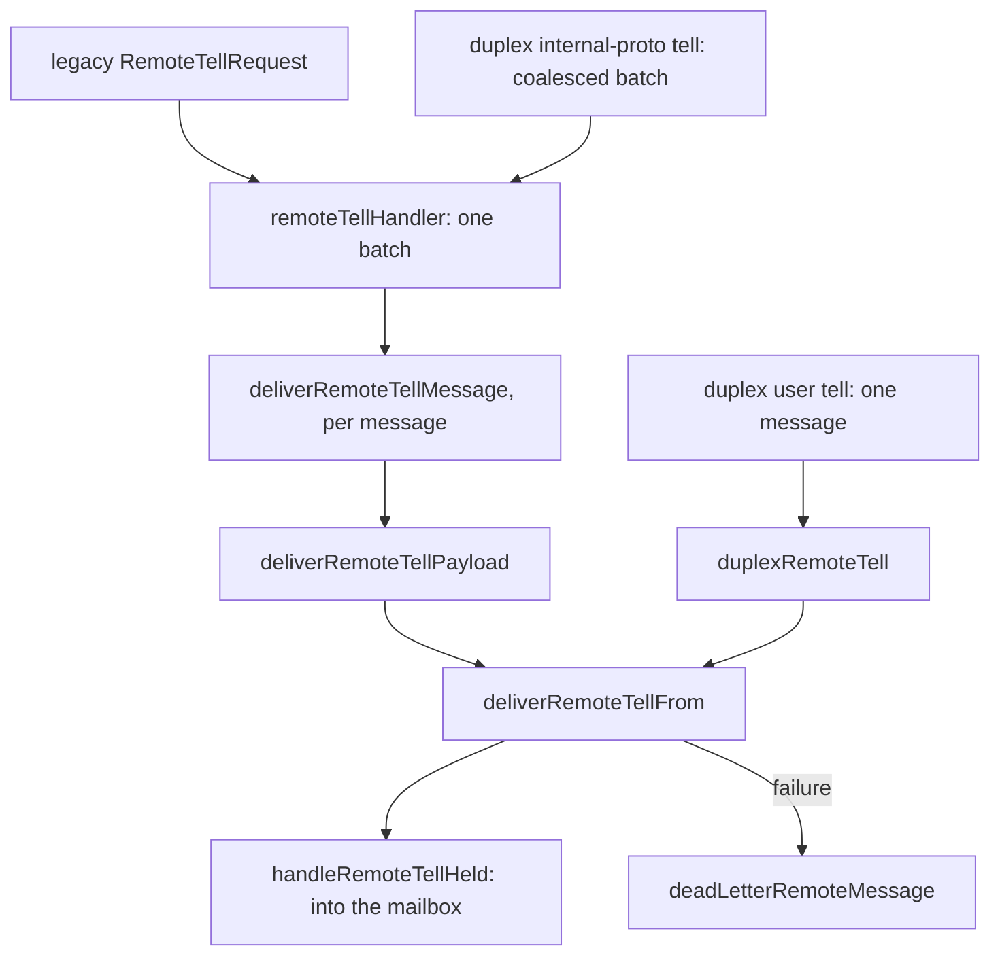

# 17. Remoting: the Remote Server and the `remote` Package

## Contents

- [What you will learn](#what-you-will-learn)
- [17.1 The `remote` package](#171-the-remote-package)
  - [Config](#config)
  - [Options](#options)
  - [Compression and the protocol pin](#compression-and-the-protocol-pin)
  - [The context propagator](#the-context-propagator)
  - [Request types](#request-types)
- [17.2 Serializers](#172-serializers)
  - [The contract](#the-contract)
  - [The shared frame](#the-shared-frame)
  - [Built-in serializers of the actor system](#built-in-serializers-of-the-actor-system)
- [17.3 Choosing a serializer](#173-choosing-a-serializer)
  - [Registration](#registration)
  - [`Config.Serializer`](#configserializer)
  - [What the actor system uses](#what-the-actor-system-uses)
- [17.4 The server](#174-the-server)
  - [Start](#start)
  - [How a request reaches a handler](#how-a-request-reaches-a-handler)
  - [The common checks](#the-common-checks)
- [17.5 Tell and ask](#175-tell-and-ask)
  - [Three entry points for a tell](#three-entry-points-for-a-tell)
  - [Ask](#ask)
- [17.6 Actor lifecycle and query handlers](#176-actor-lifecycle-and-query-handlers)
  - [Spawn](#spawn)
  - [Spawn child](#spawn-child)
  - [Other lifecycle handlers](#other-lifecycle-handlers)
  - [Query handlers](#query-handlers)
  - [Cluster handlers](#cluster-handlers)
- [17.7 Grain entry points](#177-grain-entry-points)
- [17.8 The remote watch registry](#178-the-remote-watch-registry)
- [17.9 The remote hold registry](#179-the-remote-hold-registry)
- [17.10 `internal/codec`](#1710-internalcodec)
- [Guarantees](#guarantees)
- [Implementation details (may change)](#implementation-details-may-change)
- [Behaviours to know](#behaviours-to-know)

## What you will learn

- What the public `remote` package holds: the configuration, its options, the compression and protocol enums, the request types and the serializer contract.
- How the protobuf, CBOR and JSON serializers frame a message, and how the actor system picks a serializer for each message on the way out and on the way in.
- How the remote server is started, which 27 request types it answers, and the checks every handler runs before it touches an actor.
- What happens to a remote tell and a remote ask on the receiving node, including dead letters, error codes and the sender identity.
- How the remote watch registry and the remote hold registry keep cross-node state outside the actor tree.
- What `internal/codec` converts, and which details of a supervisor, a passivation strategy or a reentrancy setting survive the trip.

## 17.1 The `remote` package

`remote` is the public face of remoting. It holds no network code: the transport is `internal/net` ([Chapter 15](chap-15.md)) and the outbound client is `internal/remoteclient` ([Chapter 16](chap-16.md), Remote Client). It holds values that both sides of a connection, and users, need to name.

| File | Holds |
|---|---|
| `remote/config.go` | `Config`, `NewConfig`, `DefaultConfig`, `Validate`, `Sanitize`, the default constants |
| `remote/option.go` | `Option`, `OptionFunc` and every `With...` option |
| `remote/compression.go` | `Compression` and its four values |
| `remote/protocol_pin.go` | `ProtocolPin` and its three values |
| `remote/context_propagator.go` | the `ContextPropagator` interface |
| `remote/serializer.go`, `remote/proto_serializer.go`, `remote/cbor_serializer.go`, `remote/json_serializer.go` | the `Serializer` interface and the three built-in serializers ([§17.2](#172-serializers)) |
| `remote/spawn_request.go`, `remote/grain_request.go` | `SpawnRequest`, `SingletonSpec`, `SpawnChildRequest`, `GrainRequest` |
| `remote/actor_state.go` | `ActorState`, the predicates a remote state query can test |
| `remote/peer.go` | `Peer`, a cluster member as `ActorSystem.Peers` returns it |
| `remote/reliable_delivery.go` | the reliable-delivery spec of a spawn request ([Chapter 23](chap-23.md)) |

### Config

`NewConfig(bindAddr, bindPort, opts...)` and `DefaultConfig()` build the same defaults; `DefaultConfig` binds `127.0.0.1` on port 0 and takes no options (`remote/config.go`). Both register a `ProtoSerializer` for the `proto.Message` interface before the options run. The transport settings (frame and message limits, chunk size, lanes, credit window, timeouts, protocol pin) are described with their defaults in [Chapter 15, §15.10](chap-15.md#1510-semantics-defaults-and-invariants). The rest:

| Setting | Default | Used by |
|---|---|---|
| bind address and port | as given; `DefaultConfig` uses `127.0.0.1:0` | the listener and the address every local actor carries |
| `Compression` | `NoCompression` | the client's proposal, the server's legacy connection wrapper and its duplex `HELLO` answer ([§17.4](#174-the-server)) |
| `ContextPropagator` | `nil` | inbound and outbound context propagation ([§17.4](#174-the-server)) |
| serializers | `ProtoSerializer` for `proto.Message` | [§17.3](#173-choosing-a-serializer) |
| `MaxIdleConns` | 32 (`DefaultMaxIdleConns`) | the legacy socket pool of the client |
| `DialTimeout` | 5 s | every outbound TCP connect |
| `KeepAlive` | 15 s | TCP keep-alive of outbound sockets |
| `TLS` | `nil` (plaintext) | both the listener and the client ([Chapter 18](chap-18.md)) |

**Bind address.** The `Config` comment states the rule: the bind address must be an IP, not a DNS name, so the node binds a known interface without name resolution. A wildcard (`0.0.0.0` or `::`) is resolved by `Config.Sanitize` to a private IP, then a public one, then loopback (`GetBindIP` in `internal/net/helper.go`). `actorSystem.validate` in `actor/actor_system.go` calls `Sanitize` and keeps the configured wildcard as the listen host, so the server listens on every interface while actors carry the resolved address.

**Validation.** `Config.Validate` checks for a non-empty bind address and a port from 0 to 65535, the size relations of [Chapter 15, §15.10](chap-15.md#1510-semantics-defaults-and-invariants), the timeouts, at least one serializer, a positive idle-connection count, dial timeout and keep-alive, a valid pin, the lane count, and each large-destination pattern through `path.Match` (`isValidLargeDestinationPattern` in `remote/config.go`). **The actor system never calls it**: `actorSystem.validate` calls only `Sanitize`, so an out-of-range value in a `Config` passed to `WithRemote` is not rejected at start.

**TLS precedence.** When both `remote.WithTLS` and the deprecated `actor.WithTLS` are set, the remote configuration wins and a warning is logged; with remoting on, TLS needs both a server and a client configuration, or start fails with `ErrInvalidTLSConfiguration` (`actorSystem.validate` in `actor/actor_system.go`).

### Options

An `Option` is an interface with one method, `Apply(*Config)`; `OptionFunc` adapts a function (`remote/option.go`). Most options assign a field without checking it. The exceptions:

- `WithContextPropagator` ignores `nil`, so the last non-nil propagator wins.
- `WithLargeMessageDestinations` copies its arguments, and with none clears the list.
- `WithSerializers` ignores a `nil` serializer; `WithSerializables` and `WithJSONSerializables` skip `nil` entries ([§17.3](#173-choosing-a-serializer)).

No option sets the idle timeout, `MaxIdleConns` or `KeepAlive`: every configuration keeps the defaults of the table above.

### Compression and the protocol pin

`Compression` has four values: `NoCompression`, `GzipCompression`, `ZstdCompression` and `BrotliCompression` (`remote/compression.go`). Its comment gives the reason the default is off: typical actor payloads are small protobuf messages for which compression saves little bandwidth and costs CPU and allocations, especially on a LAN. The server uses the value twice ([§17.4](#174-the-server)): to wrap legacy connections, and to name the codec it accepts in the duplex handshake (`duplexCompressionCodec` in `actor/remote_server.go`). Negotiation is in [Chapter 15, §15.4](chap-15.md#154-the-wire-protocol).

`ProtocolPin` has three values, `ProtocolPinAuto`, `ProtocolPinLegacy` and `ProtocolPinDuplex`, with `String` returning `auto`, `legacy`, `duplex` or `unknown`, and `Valid` accepting only the three (`remote/protocol_pin.go`). The server maps it to an accept mode with `acceptProtocolFromPin` in `actor/remote_server.go`; an unknown value maps to auto. What each pin does is in [Chapter 15, §15.9](chap-15.md#159-compatibility-two-protocols-on-one-port).

### The context propagator

`ContextPropagator` has two methods: `Inject` writes context values into an `http.Header` for an outgoing request, and `Extract` reads them back into a context on the receiving side (`remote/context_propagator.go`). The header type is only a string-keyed map; the transport is TCP. The interface comment asks for stateless, concurrency-safe implementations and for `Extract` to return a context derived from the one it is given. The server's use of `Extract` is in [§17.4](#174-the-server).

### Request types

These structs are what the client API takes; the client validates and sanitises them before it builds the wire message (`client.RemoteSpawn`, `client.RemoteSpawnChild` and `getGrainFromRequest` in `internal/remoteclient/client.go`).

| Type | `Validate` | `Sanitize` |
|---|---|---|
| `SpawnRequest` | non-empty `Name` and `Kind`; every dependency ID valid; a valid reentrancy mode, else `ErrInvalidReentrancyMode`; a reliable-delivery spec valid and not combined with `Singleton` | trims `Name` and `Kind`; a `Singleton` forces `Relocatable` to true; sanitises the reliable-delivery spec |
| `SpawnChildRequest` | non-empty `Name`, `Kind` and `Parent`; dependency IDs; reentrancy mode | trims `Name`, `Kind` and `Parent` |
| `GrainRequest` | non-empty `Name` and `Kind`; dependency IDs | trims; a non-positive `ActivationTimeout` becomes one second and non-positive `ActivationRetries` becomes 5 |

`SingletonSpec` carries the spawn timeout, wait interval and retry count of a remote singleton spawn. `SpawnRequest.Relocatable` is a plain `bool`: a request that leaves it unset arrives as `false`, and the server spawns the actor with relocation disabled ([§17.6](#176-actor-lifecycle-and-query-handlers)).

`ActorState` names the predicate a `RemoteState` query tests: unknown, running, suspended, stopping, relocatable, singleton, with the values 0 to 5 of the protobuf `State` enum (`remote/actor_state.go`), so `EncodeActorState` in `internal/codec/codec.go` is a plain conversion.

`Peer` describes a cluster member: host, discovery port, peers port, remoting port, roles and creation time. `PeersAddress` and `RemotingAddress` join the host with the matching port (`remote/peer.go`).

## 17.2 Serializers

### The contract

`Serializer` has two methods, `Serialize(message any) ([]byte, error)` and `Deserialize(data []byte) (any, error)` (`remote/serializer.go`). Its comment sets three rules:

- **Self-describing bytes.** The receiver must rebuild the concrete type from the bytes alone, so the encoding has to carry a type name or an ID.
- **Concurrency.** One instance is called from many goroutines without locking.
- **Errors.** A failure returns a non-nil error, never a nil value with a nil error.

The architecture overview explains why messages are `any` with pluggable serializers ("Why `any` and pluggable serializers"): local messages are never serialised, and only messages that leave the node need one.

### The shared frame

The three built-in serializers write the same frame. All integers are big-endian `uint32`:

| Field | Size | Meaning |
|---|---|---|
| `totalLen` | 4 bytes | length of the whole frame, itself included |
| `nameLen` | 4 bytes | length of the type name |
| type name | `nameLen` bytes | how the receiver finds the type |
| body | the rest | protobuf, CBOR or JSON bytes |

Each `Deserialize` rejects a frame shorter than 8 bytes, a `totalLen` below 8 or above the data length, and a name that runs past `totalLen` (`ErrInvalidFrame`, `ErrCBORInvalidFrame`, `ErrJSONInvalidFrame`). Each builds the frame in one allocation of the exact size, with the header written from a stack array. The type name is read from the frame without a copy, through `unsafe.String`, because it is used only for a lookup.

| Serializer | Type name | Resolved through | Accepts |
|---|---|---|---|
| `ProtoSerializer` | the protobuf full name | `FindMessageType` in `internal/net/proto_serializer.go`, a cache over the protobuf global registry | `proto.Message` only, else `ErrNotProtoMessage` |
| `CBORSerializer` | the Go type string, pointer removed, lowercased and trimmed, for example `main.order` | `GlobalRegistry` in `internal/types/global.go` | any registered type |
| `JSONSerializer` | the same as CBOR | the same registry | any registered type |

**CBOR and JSON.** Both refuse to serialise a type the registry does not hold, with an error naming the type. `Deserialize` allocates a new value of the registered type and decodes into it, so it returns a **pointer**, even when a value was serialised. The exception is the built-in primitives (string, bool, every integer kind, `float32` and `float64`), which come back as values; they are registered when the package loads so that CRDT values of type `any` round-trip (`isBuiltinPrimitive` in `remote/cbor_serializer.go`; the `init` of `internal/types/global.go`). A named type with a primitive underlying type, such as `type ID string`, still comes back as a pointer.

CBOR encodes without key sorting, forbids indefinite lengths and decodes at most 64 nesting levels (`cborEncOpts` and `cborDecOpts` in `remote/cbor_serializer.go`). JSON uses sonic's fastest configuration, which drops HTML escaping and marshaler validation; the comment on `jsonAPI` in `remote/json_serializer.go` says GoAkt reads only its own output, so neither is needed. Sonic has no nesting limit, so the `JSONSerializer` comment points at the frame size as the only bound on a peer's payload.

### Built-in serializers of the actor system

Two actor messages travel with their own unexported serializers, which `actorSystem.setupRemoting` in `actor/actor_system.go` registers on the client before any user serializer:

- **`PoisonPill`**: the whole frame is the fixed 8 bytes `DE AD BE EF CA FE BA BE`. `Deserialize` accepts exactly those 8 bytes and nothing else (`poisonPillSerializer` in `actor/poison_pill_serializer.go`).
- **`Terminated`**: an 8-byte magic `DE AD AC 70 52 BE EF ED`, the path length as a `uint32`, the path text, and the time as Unix nanoseconds in an `int64`. `Deserialize` requires the magic, an exact total length and a parseable address; an empty path gives a `Terminated` with no path (`terminatedSerializer` in `actor/terminated_serializer.go`).

Both magics read as a `totalLen` larger than the frame that carries them, so neither passes for the shared frame. `setupRemoting` also registers the serializers of the reentrancy envelopes (`AsyncRequest`, `AsyncResponse`) and of the five reliable-delivery commands from `internal/commands`.

## 17.3 Choosing a serializer

### Registration

`WithSerializers(msg, serializer)` in `remote/option.go` adds one map entry, keyed by a `reflect.Type`:

- **A typed nil pointer to an interface**, such as `(*proto.Message)(nil)`, keys the entry by the interface: every message that implements it matches.
- **Anything else** keys the entry by the value's own type. A `new(MyMessage)` therefore matches `*MyMessage` messages, and a `MyMessage{}` matches `MyMessage` values.

For a concrete registration, `RegisterSerializerType` in `internal/types/global.go` also adds the type to the global registry, but only when the serializer uses that registry (CBOR and JSON implement `RegistryRequired`), the value is a pointer, and the type is not a protobuf message. Two cases therefore leave the registry without the type, and `Serialize` fails at send time: a registration with a non-pointer value, and an interface registration, which never registers the types that implement the interface.

`WithSerializables(msgs...)` and `WithJSONSerializables(msgs...)` do the same for a list, with one shared instance each (`DefaultCBORSerializer` and `DefaultJSONSerializer` in `remote/option.go`, built once with `sync.Once`).

### `Config.Serializer`

`Config.Serializer(msg)` walks the serializer map and returns the first entry whose type equals the message type or, for an interface entry, is implemented by it; `nil` for a `nil` message or no match (`remote/config.go`). Its own comment and the option comments promise that an exact type wins over an interface and that registration order decides within each kind, but the code walks a Go map, whose order the language does not define. `Config.Serializers` returns a copy of the map.

### What the actor system uses

The actor system does not call `Config.Serializer`. `actorSystem.setupRemoting` in `actor/actor_system.go` builds the client's ordered list of entries:

1. the `ProtoSerializer` for `proto.Message`, which `NewClient` always adds first;
2. the internal serializers: `PoisonPill`, `Terminated`, `AsyncRequest`, `AsyncResponse` and the five delivery commands;
3. the user entries, copied from the map by `ClientSerializerOptions` in `internal/remoteclient/config.go`, which skips the `proto.Message` entry.

How the client resolves a serializer from this list is [Chapter 16, §16.3](chap-16.md#163-serializers): the first entry in list order whose type matches wins, exact and interface entries are not ranked, and a message with no match is refused with `ErrInvalidMessage`. Two consequences belong to the configuration. **Because the `proto.Message` entry comes first, every protobuf message is sent with the default `ProtoSerializer`**: a concrete registration for a protobuf type is never reached, and a `(*proto.Message)(nil)` override in the remote configuration is dropped by `ClientSerializerOptions`. Among the user entries, the order is the order of the map walk in `ClientSerializerOptions`, so when a message matches two of them, which one wins is not defined.

**Receiving.** The server decodes every user payload with the composite that `Serializer(nil)` returns (`serializerDispatch` in `internal/remoteclient/serializer_dispatch.go`, [Chapter 16, §16.3](chap-16.md#163-serializers)): a frame whose type name is a registered protobuf type goes to the protobuf serializer, and anything else is tried against each entry in list order, first success wins. **A serializer must therefore reject bytes it did not write**, or it can claim another serializer's frame.

**Replies on the duplex protocol.** `actorSystem.encodeDuplexReply` in `actor/remote_server.go` serialises an ask reply with the serializer the client resolves for it and records the matching serializer ID of [Chapter 15, §15.4](chap-15.md#154-the-wire-protocol):

| Serializer | ID | Type name in the envelope |
|---|---|---|
| `ProtoSerializer` | public protobuf | the protobuf full name |
| `JSONSerializer` | JSON | read from the frame (`envTypeNameFromFrame`) |
| `CBORSerializer` | CBOR | read from the frame |
| any other | custom | empty |

A `nil` reply gives an empty envelope; a reply type with no serializer fails the ask with an error.

## 17.4 The server

### Start

`actorSystem.startRemoteServer` in `actor/remote_server.go` runs as a step of `Start` and does nothing when remoting is off. In order:

1. Cache the advertised address, `host:port` from the sanitised configuration, in `remoteHostPort`. Every handler compares requests against it.
2. Compute the listen address from the listen host, which differs from the advertised one only for a wildcard bind ([§17.1](#171-the-remote-package)).
3. Register the 27 request handlers of `actorSystem.remotingServerOptions`, keyed by protobuf type name.
4. Pass the transport settings: frame size, idle and read-idle timeouts, system name, accept mode, credit window, write timeout, concurrent large transfers, message size, chunk size.
5. Install the duplex user handlers: `actorSystem.duplexRemoteTell`, `actorSystem.duplexRemoteAsk`, and the sender resolver that builds a sender PID once per table entry ([Chapter 15, §15.7](chap-15.md#157-reference-tables-and-buffers)).
6. Give the server a base context detached from `Start`'s cancellation with `context.WithoutCancel`. The comment gives the reason: the server lives until `Stop`, and a bounded start context that expires later must not cancel every inbound handler context.
7. Install a panic handler that logs the request type and the recovered value.
8. Install the compression: a connection wrapper for the configured algorithm, used only by legacy connections, and the duplex codec of `duplexCompressionCodec`. A gzip or zstd wrapper that cannot be built fails the start.
9. Add the TLS server configuration when there is one, build the server, listen, and run `Serve` on a goroutine.

**If `Serve` returns an error, the goroutine logs it and calls `os.Exit(1)`.** Shutdown is `actorSystem.shutdownRemoting` in `actor/actor_system.go`: it closes the client, stops the dead-letter drain of [§17.5](#175-tell-and-ask), calls `RemotingServer.Shutdown` with the smaller of 30 seconds and the context's deadline ([Chapter 15, §15.3](chap-15.md#153-architecture)), and only then clears `remotingEnabled`.

### How a request reaches a handler

Each handler is a `ProtoHandler`: it takes a context, a connection and a `proto.Message`, and returns a `proto.Message` and an error. Four transport paths call them:

| Path | Entry in `internal/net` | Handler |
|---|---|---|
| Legacy request | `RemotingServer.handleConn` | the handler registered for the type name; its answer is written back |
| Duplex ask whose type name has a registered handler | `RemotingServer.dispatchDuplexControl`, on the ask pool | the same handler; its answer becomes the `REPLY` |
| Duplex tell with an internal protobuf payload | `RemotingServer.dispatchDuplexInternalTell`, on the read loop | the same handler; its answer is discarded |
| Duplex tell or ask with a user payload | `RemotingServer.invokeDuplexTell`, `RemotingServer.dispatchDuplexAsk` | `actorSystem.duplexRemoteTell`, `actorSystem.duplexRemoteAsk` |

**Every handler answers a failure as data**: it returns an `internalpb.Error` with a code and a message, and a `nil` Go error. A legacy connection therefore stays open after a refused request, and on duplex the error travels as an ordinary reply. The client turns the code back into a Go error ([Chapter 15, §15.5](chap-15.md#155-correlation-and-dispatch); [Chapter 16, §16.11](chap-16.md#1611-errors)). A handler that panics is different: the panic handler installed at start logs it, a legacy connection is then closed (`RemotingServer.handleConn` in `internal/net/remoting_server.go`), and a duplex ask is answered with an `ERROR` frame ([Chapter 15, §15.5](chap-15.md#155-correlation-and-dispatch)). The codes used:

| Code | Meaning in the handlers |
|---|---|
| `CODE_INVALID_ARGUMENT` | wrong request type, host or port of another node, unparseable address or grain identity, failed context extraction, undecodable payload |
| `CODE_FAILED_PRECONDITION` | remoting or clustering off, a reserved name, an unregistered actor type, a kind mismatch, a reliable endpoint that cannot be built, a grain that is gone, a node refusing because it shuts down |
| `CODE_NOT_FOUND` | no such actor, or one that is not running where the handler requires it |
| `CODE_ALREADY_EXISTS` | the name is taken |
| `CODE_UNAVAILABLE` | a transient cluster condition during a spawn ([§17.6](#176-actor-lifecycle-and-query-handlers)) |
| `CODE_DEADLINE_EXCEEDED` | an ask or a grain request timed out |
| `CODE_RESOURCE_EXHAUSTED` | a full grain mailbox |
| `CODE_INTERNAL_ERROR` | everything else, including an ask to an actor that is not running |

### The common checks

The handlers share one shape. Each runs the subset of these steps that [§17.5](#175-tell-and-ask) to [§17.7](#177-grain-entry-points) list, in this order, except that respawn, stop, spawn child and the metric query apply the deadline after their lookup, and the grain ask and tell handlers validate the host before they extract the context:

1. **Type.** Assert the request type; a mismatch is `CODE_INVALID_ARGUMENT`.
2. **Remoting on.** `remotingEnabled` false is `CODE_FAILED_PRECONDITION` with `ErrRemotingDisabled`. The node-metric and kinds handlers check only that clustering is on.
3. **Propagated context.** `actorSystem.extractContextWithPropagator` in `actor/remote_server.go` returns the context unchanged when no propagator is configured or the request carries no metadata. Otherwise it copies the metadata headers into an `http.Header` with `Header.Set`, which canonicalises the keys and keeps one value per key, and calls `Extract`. An `Extract` error is `CODE_INVALID_ARGUMENT`.
4. **Host.** `actorSystem.validateRemoteHost` compares `net.JoinHostPort(host, port)` from the request with `remoteHostPort`; any difference is `CODE_INVALID_ARGUMENT` with `ErrInvalidHost`. A request meant for another node, or for this node under another address, is refused.
5. **Reserved names.** A name with the reserved prefix (`isSystemName` in `actor/reserved.go`) is `CODE_FAILED_PRECONDITION`, reported as an actor that does not exist (as a reserved name by the grain handlers).
6. **Deadline.** `deadlineContext` bounds the context by the deadline the caller sent as remaining time (`Metadata.DeadlineContext` in `internal/net/metadata.go`). Watch, unwatch and reinstate skip it, and their comments say why: the work is in memory, with nothing a deadline could cancel. So do the query handlers, except the metric one.
7. **Lookup.** Resolve the actor. A tree node whose PID is already gone (a node being deleted) is reported as `CODE_NOT_FOUND` by respawn, stop, reinstate, watch and ask; unwatch answers success and a tell dead-letters the message ([§17.5](#175-tell-and-ask)). The lookup handler answers it with an empty address, and the query handlers and spawn child do not check for it.

## 17.5 Tell and ask

### Three entry points for a tell

**A batch.** `actorSystem.remoteTellHandler` in `actor/remote_server.go` receives a `RemoteTellRequest`: a list of `RemoteMessage` values, each with a sender, a receiver, the serialised message and a per-message metadata map (`protos/internal/remoting.proto`). After steps 1 to 3 of [§17.4](#174-the-server) it splits the frame's credit lease into one share per message (`CreditLease.Split` in `internal/net/duplex_lease.go`; on the legacy path there is no lease and every share is `nil`, which releases as a no-op). Then, for each message, it skips a `nil` entry, releasing its share, and calls `actorSystem.deliverRemoteTellMessage`, which:

1. Decodes the payload once with the composite of [§17.3](#173-choosing-a-serializer). A decode failure is logged, the share released, and the message dropped.
2. Applies the message's own metadata on top of the request's context, through the propagator (`actorSystem.messageMetadata`). With no metadata or no propagator, the request's context is kept. An `Extract` failure releases the share and dead-letters the message, or only logs it when the receiver does not parse.
3. Builds the sender PID and calls `actorSystem.deliverRemoteTellFrom`.

The handler always answers `RemoteTellResponse` once it gets past step 3 of [§17.4](#174-the-server). **One bad message never fails its siblings**: the code comment explains that the client's coalescer packs independent tells from many senders into one batch.

**A single duplex tell.** `actorSystem.duplexRemoteTell` handles a user message on the read loop. It returns at once when remoting is off or context extraction fails; it then takes the lease as a single share, decodes the payload with `actorSystem.deserializeDuplexPayload`, and calls `deliverRemoteTellFrom`. The sender is the cached table handle when it is a `*PID`, else it is built from the sender string. A decode failure is logged and dropped, with the share released.

`deserializeDuplexPayload` decodes serializer ID 0 as internal protobuf by its type name, copies the payload of serializer ID 255 before decoding because a custom serializer may keep its input (`copyDuplexPayload`), and hands every other ID to the composite.

**The shared delivery.** `actorSystem.deliverRemoteTellFrom` looks the receiver up by its wire string and hands the message to `actorSystem.handleRemoteTellHeld` in `actor/actor_system.go`, which attaches the credit share to the receive context, records it in the actor's hold registry ([§17.9](#179-the-remote-hold-registry)) and enqueues with `PID.doReceive`. Every failure releases the share:

| Failure | Result |
|---|---|
| receiver not in the tree, or its PID already gone | dead letter, cause `ErrAddressNotFound` |
| actor not running | dead letter, cause `ErrRemoteSendFailure` wrapping `ErrDead` |
| `handleRemoteTellHeld` returns an error (an undecodable wrapped message) | dead letter with that cause |
| receiver string does not parse, in any of the cases above | logged and dropped: a dead letter needs a receiver address |

A message that reaches `PID.doReceive` but is refused there, because the system is stopping or the mailbox is full, is handled by the receive path and its share released there (`PID.doReceive` in `actor/pid.go`).

**The sender.** `actorSystem.newRemoteSenderPID` returns the system's `NoSender` for an empty or unparseable sender string. Parsed addresses are cached in `remoteSenderAddresses`; when the cache reaches 8,192 entries (`remoteSenderAddressCacheCap`) it is emptied at once, which the constant's comment calls correctness-neutral because addresses never change. Each message still gets its own PID value.

**Dead letters.** `actorSystem.deadLetterRemoteMessage` builds a `SendDeadletter` command with sender, receiver, the decoded message, the time and the cause, and has the system guardian tell it to the dead-letter actor. When either actor is missing or not running, the dead letter is skipped.

**Outbound failures.** A tell that fails after the local client admitted it comes back through `actorSystem.enqueueCoalescedFailure`, the client's tell-failure handler. It logs a warning and queues the batch on a channel of 256 entries (`coalescedFailureQueueSize`); a full queue, or a system that is shutting down, drops the batch with a log. One goroutine, `actorSystem.drainCoalescedFailures`, parses each receiver, decodes each payload and publishes a dead letter per message.

### Ask

**Legacy.** `actorSystem.remoteAskHandler` takes a `RemoteAskRequest`: a list of messages and an optional timeout, which replaces the system's ask timeout when set. After steps 1, 2, 3 and 6 of [§17.4](#174-the-server) it handles the messages **one after another**:

1. A `nil` message is `CODE_INVALID_ARGUMENT`.
2. Look the receiver up by its wire string. On a miss, parse it (`CODE_INVALID_ARGUMENT` on failure), validate its host (`CODE_INVALID_ARGUMENT`), and look it up again by its canonical form, which catches a receiver spelt differently, such as a zero-padded port. Still missing, or a gone PID, is `CODE_NOT_FOUND`.
3. An actor that is not running is `CODE_INTERNAL_ERROR` with `ErrRemoteSendFailure(ErrDead)`.
4. Ask it with `actorSystem.handleRemoteAsk`, which decodes the payload and the wire sender. A timeout is `CODE_DEADLINE_EXCEEDED`; any other error is `CODE_INTERNAL_ERROR`, an undecodable payload or an unparseable sender included.
5. Serialise the reply with the serializer the client resolves for it, without checking that there is one. A reply type with no serializer makes the handler panic ([§17.4](#174-the-server), "How a request reaches a handler"). A `nil` reply goes to the composite's `Serialize`, which every built-in serializer refuses, so it is `CODE_INTERNAL_ERROR` unless a custom serializer accepts `nil`.

The first failure ends the request: the replies already computed are discarded, although their messages were handled.

**Duplex.** `actorSystem.duplexRemoteAsk` handles one message per frame on the ask pool. It decodes the payload first, with `deserializeDuplexPayload`, and answers a failure with `CODE_INVALID_ARGUMENT`. It then runs the same lookup with the same error codes, but returns each failure as an `internalpb.Error` inside a `REPLY` (`duplexErrorReply`), so the client reads it like a legacy error answer. It ignores the envelope's sender. Its wait is the caller's deadline when the request carries one, above or below the system's ask timeout, and the ask timeout otherwise. Only a reply that cannot be encoded returns a Go error, which becomes a request-scoped `ERROR` frame.

`actorSystem.handleRemoteAsk` in `actor/actor_system.go` passes the message and `NoSender` to `resolveDispatch` in `actor/api.go`, builds a receive context with the sender it returns and the ask deadline, enqueues it, and waits for the reply, the context or a timer. On a timeout it records a dead letter for the message (`PID.handleReceivedErrorWithMessage` in `actor/pid.go`). On the legacy path the message is still a `RemoteMessage`, which `resolveDispatch` decodes, taking the wire sender. On the duplex path the payload is already decoded, so `resolveDispatch` keeps `NoSender`: **the asked actor sees `NoSender` as the sender** of a duplex ask.

## 17.6 Actor lifecycle and query handlers

### Spawn

`actorSystem.remoteSpawnHandler` serves `SpawnOn` and remote singleton spawns. After steps 1 to 6 of [§17.4](#174-the-server):

1. Instantiate the actor from its kind with `reflection.instantiateActor` in `actor/reflection.go`: the kind must be in the system's type registry (`ActorSystem.Register`, or the kinds of the cluster configuration), and the result is a fresh zero value. An unknown kind is `CODE_FAILED_PRECONDITION` with `ErrTypeNotRegistered`.
2. **With a singleton spec**, build singleton options from the spawn timeout, wait interval, retries, role and supervisor, and call `SpawnSingleton`, which places the singleton by its own rules ([Chapter 21](chap-21.md), Placement, Singletons and Relocation).
3. **Otherwise**, build spawn options from the wire: the passivation strategy (a missing one decodes to `nil`, which keeps the system default), the init timeout, relocation disabled when `relocatable` is false, stashing, reentrancy, role, supervisor, and dependencies rebuilt from the type registry. A dependency that cannot be rebuilt is `CODE_INTERNAL_ERROR`.
4. A reliable-delivery spec requires clustering, else `CODE_FAILED_PRECONDITION` with `ErrReliableClusterRequired`; the code comment says a remoting-only host cannot resolve the peer controllers. A spec that cannot become a spawn option, such as a durable queue absent from the dependencies, is `CODE_FAILED_PRECONDITION` (`reliableSpawnOptionFromWire` in `actor/reliable_delivery_config.go`).
5. Spawn and answer the new actor's address. A running local actor that already has the name is not an error: `Spawn` returns it and the handler answers its address (`nameResolver` in `actor/spawn.go`).

Spawn errors go through `spawnErrorToProto`:

| Error | Code |
|---|---|
| `ErrActorAlreadyExists`, `ErrSingletonAlreadyExists` | `CODE_ALREADY_EXISTS` |
| an Olric quorum error, normalised first | `CODE_UNAVAILABLE` |
| `ErrLeaderNotFound`, `ErrEngineNotRunning`, no member with the role | `CODE_UNAVAILABLE` |
| anything else | `CODE_INTERNAL_ERROR` |

The comment on `spawnErrorToProto` gives the reason for `CODE_UNAVAILABLE`: the calling node decodes it as `ErrRemoteSendFailure`, which its singleton retry loop treats as retryable, so a singleton spawn delegated during a rolling restart retries instead of failing for good.

### Spawn child

`actorSystem.remoteSpawnChildHandler` creates a child under an existing parent on this node. After steps 1 to 5 (both names are checked), it looks the parent up by its address; a missing or stopped parent is `CODE_NOT_FOUND`. It then requires **the requested kind to equal the parent's kind**, else `CODE_FAILED_PRECONDITION` with `ErrInvalidKinds`, builds the options of a spawn except the role and the reliable-delivery spec, which the child request does not carry, applies the deadline, and calls `PID.SpawnChild` with **the parent's own actor value** (`pid.Actor()`). The child and its parent therefore share one `Actor` value. The caller's actor value never leaves its node: `PID.spawnChildRemote` in `actor/pid.go` sends only its kind. A running child that already has the name is answered with its address; one that exists but is not running gives `ErrActorAlreadyExists`, which is `CODE_ALREADY_EXISTS` (`nameResolver` in `actor/spawn.go`); other errors are `CODE_INTERNAL_ERROR`.

### Other lifecycle handlers

| Handler | Checks | Resolves by | Does |
|---|---|---|---|
| `remoteLookupHandler` | 1 to 4, 6 | in a cluster, a non-reserved name goes to the cluster registry; otherwise the local tree by address | answers the address; the registry answer may name another node; a miss is `CODE_NOT_FOUND`, any other registry error `CODE_INTERNAL_ERROR` |
| `remoteReSpawnHandler` | 1 to 7 | address built from the qualified name | `PID.Restart`; a failure is `CODE_INTERNAL_ERROR` |
| `remoteStopHandler` | 1 to 7 | address built from the qualified name | `PID.Shutdown`; a failure is `CODE_INTERNAL_ERROR` |
| `remoteReinstateHandler` | 1, 2, 4, 5, 7 | `localActor`: qualified name, then bare name | `PID.doReinstate` ([Chapter 9, §9.7](chap-09.md#97-reinstate)) |
| `remoteWatchHandler` | 1, 2, 4, 5, 7; the watcher address must parse | `localActor` | records the watcher ([§17.8](#178-the-remote-watch-registry)) |
| `remoteUnWatchHandler` | 1, 2, 4, 5; the watcher address must parse | `localActor` | removes the watcher; an actor that is gone is a success |

"Address built from the qualified name" is `address.NewReference(name, system, host, port)` looked up in the tree, which reaches a child by `parent/child`. `actorSystem.localActor` in `actor/actor_system.go` also accepts a bare child name and, when several children share it, takes the most recently spawned ([Chapter 9, §9.9](chap-09.md#99-remote-watch)). Respawn and stop do not check that the actor is running.

### Query handlers

Nine handlers read one property of a local actor. Each runs steps 1, 2 and 4, looks the actor up by address, and answers `CODE_NOT_FOUND` when it is missing.

| Handler | Answer | Not running |
|---|---|---|
| `remoteStateHandler` | the predicate of the requested `State`; `STATE_UNKNOWN` or any other value is `false` | answered, no check |
| `remoteChildrenHandler` | the children's addresses | `CODE_NOT_FOUND` |
| `remoteParentHandler` | the parent's address; no parent is `CODE_NOT_FOUND` | `CODE_NOT_FOUND` |
| `remoteKindHandler` | `PID.Kind` | `CODE_NOT_FOUND` |
| `remoteDependenciesHandler` | the dependencies, encoded ([§17.10](#1710-internalcodec)) | `CODE_NOT_FOUND` |
| `remoteMetricHandler` | the actor's metric; also runs steps 3 and 6 | `CODE_NOT_FOUND` |
| `remoteRoleHandler` | the role, empty when none | `CODE_NOT_FOUND` |
| `remoteStashSizeHandler` | the stash size | `CODE_NOT_FOUND` |
| `remotePassivationStrategyHandler` | the strategy, encoded ([§17.10](#1710-internalcodec)) | `CODE_NOT_FOUND` |

None of them refuses a reserved name.

### Cluster handlers

These serve the cluster and are described with it:

| Handler | Preconditions | Chapter |
|---|---|---|
| `getNodeMetricHandler` | clustering on; the request's node address equals `remoteHostPort` | answers the load, actors plus grains; [Chapter 21](chap-21.md) |
| `getKindsHandler` | the same | answers `types.Name` of each kind of the cluster configuration; [Chapter 20](chap-20.md), The Cluster Core |
| `persistPeerStateHandler` | remoting and clustering on | stores a peer's state snapshot; [Chapter 20](chap-20.md) |
| `relocateBatchHandler` | remoting and clustering on; steps 3 and 6 | takes one share of a departed node's actors and grains, ten at a time: recreates the actors and the eagerly relocated grains, releases the directory entry of the others, and reports failures per item; [Chapter 21](chap-21.md) |
| `getReliableCompanionHandler` | steps 1, 2, 4; a valid controller role | resolves a local reliable endpoint's controller, `CODE_NOT_FOUND` on any failure; [Chapter 23](chap-23.md) |

## 17.7 Grain entry points

Three handlers receive grain traffic; activation, mailboxes and replies are [Chapter 14](chap-14.md), Grains: the Runtime. Each checks the type and remoting, validates the host and port carried in the wire `Grain`, and extracts the propagated context.

| Handler | Then |
|---|---|
| `remoteAskGrainHandler` | applies the deadline; decodes the message with the composite (`CODE_INVALID_ARGUMENT` on failure); parses the identity (`CODE_INVALID_ARGUMENT`); refuses a reserved name; sends with `localSendGrain` in ask mode and the request's timeout; serialises the reply as the legacy ask does, with the same panic for a reply type that has no serializer |
| `remoteTellGrainHandler` | decodes and parses the same way; hands a reentrancy envelope (`AsyncRequest`, `AsyncResponse`) straight to the grain's queues with `deliverAsyncEnvelope`; otherwise sends in one-way mode when `one_way` is set, which answers once the message is enqueued, and in acknowledged mode otherwise, which answers once the grain has handled it, with `DefaultGrainRequestTimeout` (five seconds) |
| `remoteActivateGrainHandler` | applies the deadline and calls `recreateGrain`; `ErrSystemShuttingDown` is `CODE_FAILED_PRECONDITION`, any other error `CODE_INTERNAL_ERROR` |

The comment in `remoteTellGrainHandler` explains the envelope case: the blocking send waits on channels an envelope never signals, and a response to a grain paused in stash mode must still reach it.

Send failures go through `actorSystem.grainSendError`:

| Error | Code |
|---|---|
| `ErrMailboxFull` | `CODE_RESOURCE_EXHAUSTED` |
| `ErrRequestTimeout`, `context.DeadlineExceeded` | `CODE_DEADLINE_EXCEEDED` |
| `ErrDead`, `ErrSystemShuttingDown` | `CODE_FAILED_PRECONDITION` |
| anything else | `CODE_INTERNAL_ERROR`, logged as an error |

The expected cases are logged at debug level. An error marked as a refusal by this node (`refusal.Marked`) sets `refused` on the reply, so the caller knows the message never ran and can send it elsewhere ([Chapter 16, §16.11](chap-16.md#1611-errors); [Chapter 13, §13.7](chap-13.md#137-when-the-recorded-owner-is-gone)).

## 17.8 The remote watch registry

Remote watches live outside the actor tree, in one `remoteWatchRegistry` per actor system (`actor/remote_watch_registry.go`). [Chapter 9, §9.9](chap-09.md#99-remote-watch) describes the protocol; this section describes the structure.

**Four maps under one `sync.RWMutex`**, all created on first use so a system that never watches across nodes allocates nothing:

| Map | Key path | Holds |
|---|---|---|
| `watchers` | local PID ID, then watcher address string | remote actors watching a local actor |
| `watchees` | local PID ID, then watchee address string | remote actors a local actor watches |
| `watchersByHost` | host, then local PID ID, then address string | reverse index of `watchers` |
| `watcheesByHost` | host, then local PID ID, then address string | reverse index of `watchees` |

**Operations:**

- `addWatcher` and `addWatchee` ignore an empty ID or a `nil` address, overwrite an existing pair, and update both views. `removeWatcher` and `removeWatchee` delete the pair and any map left empty.
- `watchersFor` and `watcheesFor` return a copy of one actor's addresses.
- `dropPID` removes every entry of one local actor in both directions.
- `dropHost(host)` removes every entry whose remote side is on that host and returns them split into watchers and watchees.
- `dropNode(host, port)` does the same for one node: it keeps entries of other ports on the same host and deletes the host key only when nothing remains under it.

**Who calls what:**

| Event | Call | Source |
|---|---|---|
| a remote node watches a local actor | `addWatcher` | `actorSystem.remoteWatchHandler` in `actor/remote_server.go` |
| a remote node unwatches | `removeWatcher` | `actorSystem.remoteUnWatchHandler` in `actor/remote_server.go` |
| a local actor watches a remote one, after the other node acknowledged | `addWatchee` | `PID.Watch` in `actor/pid.go` |
| a local actor unwatches, or stops | `removeWatchee` and a best-effort `RemoteUnWatch`: `UnWatch` removes the entry first, `freeWatchees` after the call | `PID.UnWatch` and `PID.freeWatchees` in `actor/pid.go` |
| a local actor stops | `watchersFor`, a `Terminated` sent with `RemoteTell` to each, then `dropPID` | `PID.freeWatchers` in `actor/pid.go` |
| a cluster member leaves | `dropNode` when its remoting port is known, else `dropHost` | `actorSystem.pruneRemoteWatchesForNode` in `actor/actor_system.go` |

After a departure, `actorSystem.terminateRemoteWatchees` sends each local watcher of a dropped watchee a `Terminated` for the remote path, stamped with the membership event's time, with the death watch actor as sender. A watcher that is gone or not running is skipped. The dropped watcher entries need no action: the watcher is on the departed node.

## 17.9 The remote hold registry

Each remote tell carries a share of its frame's credit, and the share goes back to the sender when the message leaves the mailbox ([Chapter 15, §15.8](chap-15.md#158-flow-control)). The comment in `PID.reset` in `actor/pid.go` states the problem the registry solves: a terminal stop abandons the mailbox to the garbage collector, which would strand the queued shares and shrink the peer's window for good. The registry tracks every share independently of the mailbox implementation, so teardown can repay them all, whatever mailbox held the messages.

**Structure.** `remoteHoldRegistry` in `actor/remote_hold_registry.go` is the same intrusive multi-producer, single-consumer queue as the default mailbox: a sentinel node, a `head` and a `tail` on separate cache lines, and pooled nodes that point at the share, never at the pooled receive context. A PID creates it lazily on its first remote message, with a compare-and-swap; the losing creator returns its sentinel to the pool (`PID.trackRemoteHold` in `actor/pid.go`). Local-only actors never allocate one.

**Operations:**

- `track(share)` appends a node with an atomic swap of the tail and then publishes the link. Any goroutine may call it. `handleRemoteTellHeld` tracks the share **before** the message enters the mailbox, so no queued share is ever invisible to teardown.
- `compact()` retires up to eight released entries from the front (`remoteHoldCompactBudget`). It stops at the first share still outstanding, a parked message, and never releases it. `PID.dispatchOne` calls it after it releases the departing message's share.
- `releaseAll()` releases and retires every entry. When the chain looks empty but the tail has moved, a producer has swapped the tail and not yet published its link; `releaseAll` yields with `runtime.Gosched` until the link appears, so the share is not stranded.

The consumer side is serialised by `consumerMu`, not by the dispatcher. The type's comment gives the reason: `Shutdown` does not wait for a running turn, so it must complete even when the actor is stuck inside `Receive`, and `compact` always finishes before user code runs, so a stuck `Receive` never holds the lock.

**The closed bit.** `PID.reset` sets `remoteHoldsClosedState` (`actor/pid_state.go`) and then calls `releaseAll`. A delivery that passed its liveness check before the stop can still reach `trackRemoteHold` after the drain; it tracks its share, sees the bit and calls `releaseAll` itself. Releases are idempotent (a swap to zero), so racing the teardown is safe, and the same check covers a first track that creates a registry after teardown. `PID.init` clears the bit before the actor is announced as running, so after a restart a new share parks again. A restart also runs the drain: the messages that survive it release as no-ops when they are later dequeued.

**Where a share is released.** When the message leaves the mailbox (`PID.dispatchOne`); when `PID.doReceive` refuses it because the system is stopping or the mailbox is full; on any failure of [§17.5](#175-tell-and-ask) before it reached the mailbox; when the receive context is reset (`ReceiveContext.releaseRemoteHold` in `actor/receive_context.go`); and at teardown.

## 17.10 `internal/codec`

`internal/codec` converts runtime values to and from their protobuf form. It has no state.

| Value | Encode | Decode | Rules |
|---|---|---|---|
| dependencies | `EncodeDependencies` | `DecodeDependencies` | each carries its ID, `types.Name` and `MarshalBinary` bytes; decoding needs a registry holding the type, skips `nil` entries, and calls `UnmarshalBinary` on a new value |
| passivation strategy | `EncodePassivationStrategy` | `DecodePassivationStrategy` | the three built-in strategies; any other type encodes to `nil`, and a `nil` or empty message decodes to `nil` |
| supervisor | `EncodeSupervisor` | `DecodeSupervisor` | below |
| reentrancy | `EncodeReentrancy` | `DecodeReentrancy` | the mode, and the in-flight limit clamped to 0 to `MaxUint32`; an unknown mode decodes to `Off` |
| actor state | `EncodeActorState` | none | a direct conversion ([§17.1](#171-the-remote-package)) |
| datacenter record | `EncodeDataCenterRecord` | `DecodeDataCenterRecord` | [Chapter 22](chap-22.md), Multi-Datacenter |
| CRDT key | `EncodeCRDTKey` | `DecodeCRDTKey` | the data type shifted by one, because protobuf enum 0 is unspecified ([Chapter 24](chap-24.md)) |

**Supervisors.** `EncodeSupervisor` writes the strategy, the retry count and the timeout. It writes the backoff fields only when the initial delay is positive, since a zero delay means backoff is off. The any-error rule travels in its own field, and the type-specific rules in a list sorted by error type, without empty types or the any-error type. `DecodeSupervisor` applies the options first, any-error rule included, which clears every other rule, and then adds the type rules with `SetDirectiveByType`. The order is the point, as the code comment says: an exact-type match must still win on the receiving node over the catch-all ([Chapter 9, §9.1](chap-09.md#91-the-supervisor-value)). The retry option is applied only when the timeout is present or the retry count is not zero.

## Guarantees

| Statement | Enforced by |
|---|---|
| `DefaultConfig` defaults: 16 MiB frames, 10 s write and read-idle timeouts, 1,200 s idle timeout, `127.0.0.1:0`, 32 idle connections, 5 s dial timeout, 15 s keep-alive; it validates | `TestConfig` in `remote/config_test.go` |
| `Validate` rejects a frame size out of range, an invalid large-destination pattern and a non-positive dial timeout; `Sanitize` rejects an invalid IP and resolves an IPv6 wildcard | `TestConfig` in `remote/config_test.go` |
| `Config.Serializer` resolves a protobuf message to the default `ProtoSerializer`, returns `nil` for a `nil` or unregistered message; `Serializers` returns a copy | `TestConfig` in `remote/config_test.go` |
| The pin defaults to auto, names its values, and `Validate` rejects an unknown pin | `TestProtocolPin` and `TestConfigProtocolPinDefaultAndOption` in `remote/protocol_pin_test.go` |
| `WithContextPropagator(nil)` changes nothing | `TestWithContextPropagator` in `remote/option_test.go` |
| `WithSerializables` registers one shared CBOR instance for all its types; the types of `WithSerializables` and `WithJSONSerializables` round-trip and `nil` entries are skipped | `TestWithSerializables` and `TestWithJSONSerializables` in `remote/option_test.go` |
| CBOR and JSON refuse an unregistered type; a serialised value comes back as a pointer; built-in primitives come back as values | `TestCBORSerializer_Serialize_Errors`, `TestCBORSerializer_SerializeDeserialize_ValueType` and `TestCBORSerializer_PrimitiveRoundTrip` in `remote/cbor_serializer_test.go`; `TestJSONSerializer_Serialize_Errors`, `TestJSONSerializer_SerializeDeserialize_ValueType` and `TestJSONSerializer_PrimitiveRoundTrip` in `remote/json_serializer_test.go` |
| Truncated or inconsistent frames are rejected by all three serializers | `TestProtoSerializer_Deserialize_InvalidFrame` in `remote/proto_serializer_test.go`; `TestCBORSerializer_Deserialize_InvalidFrame` in `remote/cbor_serializer_test.go`; `TestJSONSerializer_Deserialize_InvalidFrame` in `remote/json_serializer_test.go` |
| A `PoisonPill` is exactly the 8-byte magic, and any other 8 bytes or length is rejected | `TestPoisonPillSerializer_Serialize` and `TestPoisonPillSerializer_Deserialize` in `actor/poison_pill_serializer_test.go` |
| `ActorState` values equal the protobuf `State` values | `TestActorState_ValuesMatchProto` in `remote/actor_state_test.go`; `TestEncodeActorState` in `internal/codec/codec_test.go` |
| `SpawnRequest.Sanitize` trims and makes a singleton relocatable; the request types reject empty names, kinds, parents and dependency IDs; `GrainRequest.Sanitize` defaults to one second and 5 retries | `TestSpawnRequestValidateAndSanitize` and `TestSpawnChildRequestValidateAndSanitize` in `remote/spawn_request_test.go`; `TestGrainActivationRequestValidateAndSanitize` in `remote/grain_request_test.go` |
| `Peer` joins the host with the peers port and the remoting port | `TestPeerAddresses` in `remote/peer_test.go` |
| Handlers answer a wrong request type with `CODE_INVALID_ARGUMENT`, remoting off with `CODE_FAILED_PRECONDITION`, another host with `CODE_INVALID_ARGUMENT` and a missing actor with `CODE_NOT_FOUND`; respawn, stop and reinstate also answer a gone PID with `CODE_NOT_FOUND` | `TestRemoteLookupHandler`, `TestRemoteReSpawnHandler`, `TestRemoteStopHandler` and `TestRemoteReinstateHandler` in `actor/remote_server_test.go` |
| Respawn, stop, watch, unwatch, reinstate and spawn child refuse reserved names | `TestRemoteReSpawnHandler`, `TestRemoteStopHandler`, `TestRemoteWatchHandler`, `TestRemoteUnWatchHandler`, `TestRemoteReinstateHandler` and `TestRemoteSpawnChildHandler` in `actor/remote_server_test.go` |
| A failing `Extract` is `CODE_INVALID_ARGUMENT`; with no propagator or no metadata the context is unchanged; the wire deadline bounds the handler context | `TestRemoteHandlersContextPropagation`, `TestExtractContextWithPropagator`, `TestApplyPerMessageMetadata` and `TestDeadlineContext` in `actor/remote_server_test.go` |
| A tell batch answers success when an entry is `nil`, unparseable, unknown, gone, or has bad metadata | `TestRemoteTellHandler` and `TestRemoteTellHandler_PerMessageMetadataError` in `actor/remote_server_test.go` |
| A legacy ask rejects a `nil` message, an unparseable receiver and another host with `CODE_INVALID_ARGUMENT`, answers a missing actor with `CODE_NOT_FOUND`, and finds a non-canonical receiver by its canonical form | `TestRemoteAskHandler` in `actor/remote_server_test.go` |
| A duplex ask waits for the caller's deadline even beyond the system's ask timeout | `TestDuplexRemoteAskHonorsCallerTimeoutBeyondAskTimeout` in `actor/remote_server_test.go` |
| Sender addresses are parsed once, cached, flushed whole at capacity; an empty or bad sender is `NoSender`; a table handle skips the parse | `TestNewRemoteSenderPID` and `TestDuplexRemoteTellSenderHandle` in `actor/remote_server_test.go` |
| `copyDuplexPayload` returns a copy that does not change with the pooled source | `TestCopyDuplexPayloadRetainsIndependently` in `actor/remote_server_test.go` |
| Spawn refuses an unregistered kind, and a reliable endpoint without clustering, with `CODE_FAILED_PRECONDITION` | `TestRemoteSpawnHandler` in `actor/remote_server_test.go` |
| Spawn errors map to `CODE_ALREADY_EXISTS`, `CODE_UNAVAILABLE` for transient cluster conditions with quorum errors normalised, and `CODE_INTERNAL_ERROR` otherwise | `TestSpawnErrorToProto` in `actor/remote_server_test.go` |
| Spawn child answers a missing parent with `CODE_NOT_FOUND` and a kind mismatch with `CODE_FAILED_PRECONDITION` | `TestRemoteSpawnChildHandler` in `actor/remote_server_test.go` |
| A remote watch records the watcher, reaches a child by bare and qualified name, and an unwatch of a gone actor succeeds | `TestRemoteWatchHandler` and `TestRemoteUnWatchHandler` in `actor/remote_server_test.go` |
| A suspended child is reinstated by bare and by qualified name | `TestRemoteReinstateHandler` in `actor/remote_server_test.go` |
| State queries answer the running, stopping, suspended and relocatable predicates, and `false` for an unknown state | `TestRemoteStateHandler` in `actor/remote_server_test.go` |
| Children, parent, kind, dependencies, metric, role and stash-size queries answer a stopped actor with `CODE_NOT_FOUND` | `TestRemoteChildrenHandler`, `TestRemoteParentHandler`, `TestRemoteKindHandler`, `TestRemoteDependenciesHandler`, `TestRemoteMetricHandler`, `TestRemoteRoleHandler` and `TestRemoteStashSizeHandler` in `actor/remote_server_test.go` |
| The query handlers and remote spawn child work end to end through the client | `TestRemoteServerHandlersIntegration` in `actor/remote_server_test.go` |
| Node metric and kinds require clustering and this node's address | `TestGetNodeMetricHandler` and `TestGetKindsHandler` in `actor/remote_server_test.go` |
| Grain send errors map to their codes and a node refusal sets `refused` | `TestGrainSendError` in `actor/remote_server_test.go` |
| A shutting-down node refuses to activate a new grain, refuses a tell or an ask to an inactive grain with `refused` set, and still serves an active grain | `TestRemoteGrainHandlersOnAShuttingDownNode` in `actor/remote_server_test.go` |
| A one-way grain tell answers once enqueued, and a full grain mailbox is `CODE_RESOURCE_EXHAUSTED` | `TestRemoteTellGrainHandler` in `actor/remote_server_test.go` |
| Remoting keeps working after the start context expires | `TestRemotingSurvivesExpiredStartContext` in `actor/remote_server_test.go` |
| Watch registry: lazy maps, idempotent adds, `dropPID` clears one actor, `dropHost` one host, `dropNode` one node and not its neighbours on the host | `TestRemoteWatchRegistry_AddWatcher`, `TestRemoteWatchRegistry_DropPID`, `TestRemoteWatchRegistry_DropHost` and `TestRemoteWatchRegistry_DropNode` in `actor/remote_watch_registry_test.go` |
| Hold registry: `releaseAll` releases every share and leaves the registry usable; `compact` retires at most the budget and never a parked share; `releaseAll` waits for an in-flight publish; concurrent consumers repay each share once | `TestRemoteHoldRegistryReleaseAll`, `TestRemoteHoldRegistryCompactRetiresSpentPrefix`, `TestRemoteHoldRegistryReleaseAllWaitsOutInFlightPublish` and `TestRemoteHoldRegistryConcurrentCompactAndReleaseAll` in `actor/remote_hold_registry_test.go` |
| A tell refused because the system stops repays its share; a track after a terminal stop repays itself; a track after a restart parks | `TestRemoteTellStoppingSystemReleasesHold`, `TestRemoteTellLateTrackAfterStopRepaysHold` and `TestRemoteTellTrackAfterRestartParksHold` in `actor/remote_server_test.go` |
| A supervisor keeps its type rules next to an any-error rule across encoding; rules are sorted; backoff fields travel only when set | `TestEncodeDecodeSupervisorAnyErrorKeepsSpecificRules`, `TestEncodeSortsDirectives`, `TestEncodeDecodeSupervisorBackoff` and `TestEncodeSupervisorWithoutBackoffLeavesFieldsUnset` in `internal/codec/codec_test.go` |
| The three passivation strategies round-trip; an unknown one is `nil` both ways; the reentrancy limit is clamped | `TestEncodeDecodePassivationStrategy`, `TestEncodePassivationStrategyUnknown`, `TestDecodePassivationStrategyUnknown`, `TestEncodeReentrancyNegativeMaxInFlightClamps` and `TestEncodeReentrancyLargeMaxInFlightClamps` in `internal/codec/codec_test.go` |

## Implementation details (may change)

- The 27 registered request types and their names.
- The 8,192-entry sender-address cache, flushed whole; the 256-entry dead-letter fan-out queue and its single drain goroutine.
- The eight-entry compact budget of the hold registry, and the `runtime.Gosched` spin in `releaseAll`.
- The `PoisonPill` and `Terminated` magics and the `Terminated` layout.
- CBOR options: no key sorting, no indefinite lengths, 64 nesting levels; JSON on sonic's fastest configuration.
- The order of the client's serializer list: protobuf, then the internal serializers, then user entries in map order.
- The 30-second cap on the remote server's shutdown wait.
- Ten concurrent items per relocation batch (`defaultRelocationConcurrency`).

## Behaviours to know

| Behaviour | Source |
|---|---|
| The actor system never calls `Config.Validate`; an out-of-range setting is not rejected at start | `actorSystem.validate` in `actor/actor_system.go` |
| A `Serve` error ends the process with `os.Exit(1)` | `actorSystem.startRemoteServer` in `actor/remote_server.go` |
| `Config.Serializer` returns the first match of a map walk; it does not rank an exact type above an interface | `Config.Serializer` in `remote/config.go` |
| On the actor system, every protobuf message is sent with the default `ProtoSerializer`: a concrete registration for a protobuf type and a `(*proto.Message)(nil)` override are not used | `ClientSerializerOptions` in `internal/remoteclient/config.go`; `actorSystem.setupRemoting` in `actor/actor_system.go` |
| A CBOR or JSON registration with a non-pointer value, or with an interface, leaves the type out of the registry, and sending it fails | `RegisterSerializerType` in `internal/types/global.go` |
| CBOR and JSON return a pointer for a serialised value; only built-in primitives come back as values | `CBORSerializer.Deserialize` in `remote/cbor_serializer.go` |
| The receive path tries each serializer in turn; one that accepts foreign bytes can take another's frame | `serializerDispatch.Deserialize` in `internal/remoteclient/serializer_dispatch.go` |
| A request addressed to this node under another host or port spelling is refused with `ErrInvalidHost` | `actorSystem.validateRemoteHost` in `actor/remote_server.go` |
| One bad message in a tell batch never fails the others; an undecodable payload or unparseable receiver is dropped with a log, not dead-lettered | `actorSystem.deliverRemoteTellMessage` and `actorSystem.deliverRemoteTellFrom` in `actor/remote_server.go` |
| A legacy ask batch stops at its first failure and discards the replies already computed | `actorSystem.remoteAskHandler` in `actor/remote_server.go` |
| An ask to an actor that is not running is `CODE_INTERNAL_ERROR`, not `CODE_NOT_FOUND` | `actorSystem.remoteAskHandler` and `actorSystem.duplexRemoteAsk` in `actor/remote_server.go` |
| An undecodable ask payload is `CODE_INVALID_ARGUMENT` on duplex, decoded before the lookup, and `CODE_INTERNAL_ERROR` on legacy, decoded by the ask itself | `actorSystem.duplexRemoteAsk` and `actorSystem.remoteAskHandler` in `actor/remote_server.go` |
| A legacy ask or a grain ask whose reply type has no serializer panics in the handler; the panic is logged and a legacy connection is closed | `actorSystem.remoteAskHandler` and `actorSystem.remoteAskGrainHandler` in `actor/remote_server.go` |
| A duplex ask reaches the actor with `NoSender` as sender; a legacy ask carries the wire sender | `actorSystem.handleRemoteAsk` in `actor/actor_system.go`; `resolveDispatch` in `actor/api.go` |
| Per-message metadata is applied only to tell batches | `actorSystem.messageMetadata` in `actor/remote_server.go` |
| A remote lookup in a cluster answers from the registry, possibly with another node's address | `actorSystem.remoteLookupHandler` in `actor/remote_server.go` |
| A `SpawnRequest` with `Relocatable` unset spawns a non-relocatable actor | `actorSystem.remoteSpawnHandler` in `actor/remote_server.go` |
| A remote spawn creates a zero value of the registered kind | `reflection.instantiateActor` in `actor/reflection.go` |
| A remote child must have its parent's kind and runs on the parent's own actor value | `actorSystem.remoteSpawnChildHandler` in `actor/remote_server.go` |
| A remote spawn or child spawn under the name of a running actor answers that actor's address, not an error | `nameResolver` in `actor/spawn.go` |
| Remote stop and respawn act on an actor that is not running; the query handlers refuse it, except the state query | `actorSystem.remoteStopHandler` and `actorSystem.remoteStateHandler` in `actor/remote_server.go` |
| The query handlers answer for reserved names | `actorSystem.remoteKindHandler` in `actor/remote_server.go` |
| Dead letters for remote failures are skipped while the dead-letter actor or the system guardian is down, and coalesced failures are dropped when the fan-out queue is full or the system shuts down | `actorSystem.deadLetterRemoteMessage` and `actorSystem.enqueueCoalescedFailure` in `actor/remote_server.go` |
| A synthesized `Terminated` after a node departure has the death watch actor as sender, not the dead actor | `actorSystem.terminateRemoteWatchees` in `actor/actor_system.go` |
| A protobuf type lookup caches misses too: a type registered after its name was first looked up keeps failing until the negative cache is flushed | `FindMessageType` in `internal/net/proto_serializer.go` |
| Propagated header keys are canonicalised and only one value per key reaches `Extract` | `actorSystem.extractContextWithPropagator` in `actor/remote_server.go` |
