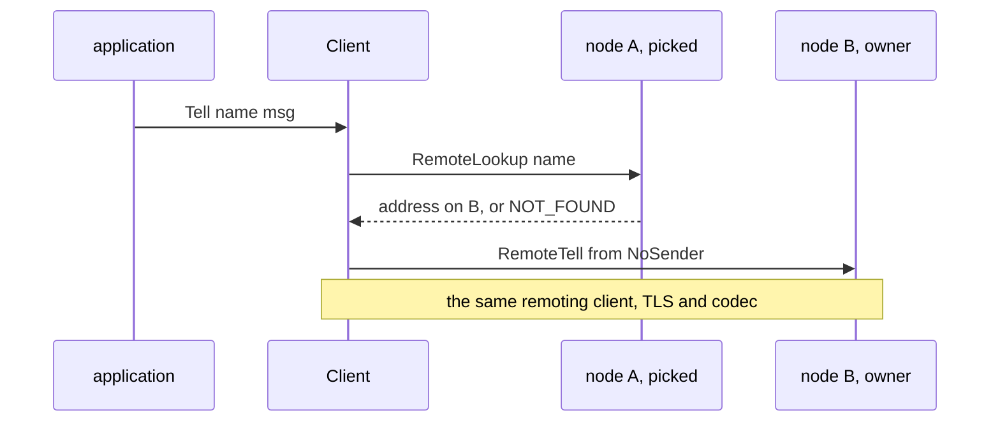

# 18. TLS and the Standalone Client

## Contents

- [What you will learn](#what-you-will-learn)
- [18.1 `tls.Info` and where it is set](#181-tlsinfo-and-where-it-is-set)
- [18.2 Where TLS is applied](#182-where-tls-is-applied)
  - [Remoting](#remoting)
  - [The cluster engine](#the-cluster-engine)
  - [Membership gossip](#membership-gossip)
- [18.3 Certificates, server names and mutual TLS](#183-certificates-server-names-and-mutual-tls)
- [18.4 What is and is not encrypted](#184-what-is-and-is-not-encrypted)
- [18.5 The standalone client: shape and construction](#185-the-standalone-client-shape-and-construction)
- [18.6 Operations](#186-operations)
- [18.7 Balancers and load figures](#187-balancers-and-load-figures)
- [18.8 Refresh and shutdown](#188-refresh-and-shutdown)
- [Guarantees](#guarantees)
- [Implementation details (may change)](#implementation-details-may-change)
- [Behaviours to know](#behaviours-to-know)

## What you will learn

- What `tls.Info` holds, the two options that set it, which one wins, and when the configuration is rejected.
- Exactly where each of the two TLS configurations is applied: the remoting listener and dialers, the cluster engine, and membership gossip.
- What mutual TLS covers, why the remoting dialers need a server name or `InsecureSkipVerify`, and what stays in plaintext.
- How the standalone `client` package builds a node, what it forwards from `remote.Config`, and what it leaves at defaults.
- What each client operation sends, to which node, and what it returns when the actor does not exist.
- How the three balancers pick a node, where least load gets its figures, and how refresh and `Close` behave.

Source files: `tls/info.go`, `remote/option.go`, `remote/config.go`, `actor/option.go`, `actor/actor_system.go`, `actor/remote_server.go`, `internal/net/tcp_server.go`, `internal/net/remoting_server.go`, `internal/net/client.go`, `internal/remoteclient/client.go`, `internal/remoteclient/peer.go`, `internal/cluster/cluster.go`, `internal/cluster/config.go`, `internal/memberlist/transport.go`, `internal/memberlist/transport_config.go`, `client/client.go`, `client/node.go`, `client/option.go`, `client/balancer.go`, `client/round_robin.go`, `client/random.go`, `client/least_load.go`, `client/tell_grain_option.go`.

## 18.1 `tls.Info` and where it is set

`Info` in `tls/info.go` is a plain struct with two `crypto/tls` configurations and no behaviour:

| Field | Used by |
|---|---|
| `ClientConfig` | every side that dials: remoting lanes and legacy sockets, the cluster engine's outbound connections, membership gossip (both directions, [§18.2](#182-where-tls-is-applied)), the standalone client |
| `ServerConfig` | the remoting listener and the cluster engine's listener |

Its doc comment asks that both configurations chain to the same root CA, which matters most under mutual TLS, and recommends reusing one `tls.Config` across connections.

**Two options set it.** `WithTLS` in `remote/option.go` stores it on the `remote.Config`, read back by `Config.TLS` in `remote/config.go`; a nil return means plaintext. `WithTLS` in `actor/option.go` stores it on the actor system directly and is deprecated. `actorSystem.validate` in `actor/actor_system.go` reconciles the two, in order:

1. If the remote config carries an `Info`, it replaces the deprecated one. When both are set and are different pointers, a warning is logged.
2. If an `Info` is set **and remoting is enabled**, both `ServerConfig` and `ClientConfig` must be non-nil, otherwise `NewActorSystem` fails with `ErrInvalidTLSConfiguration` (`errors/errors.go`). The docs give the reason: every node both dials and accepts.
3. With remoting disabled nothing is checked and the `Info` has no effect. Clustering requires remoting, so a clustered system always passes through the check.

Nothing validates the contents of the two configurations: a missing certificate or CA shows up as a listen or handshake failure later ([§18.3](#183-certificates-server-names-and-mutual-tls)).

The resolved `Info` is kept in the `tlsInfo` field (`actor/actor_system.go`) and handed out at start-up: to the remoting client by `actorSystem.setupRemoting`, to the cluster engine by `actorSystem.setupCluster` through `WithTLS` in `internal/cluster/config.go`, and to the remoting server by `actorSystem.startRemoteServer` (`actor/remote_server.go`).

## 18.2 Where TLS is applied

| Port | Traffic | Accepting side | Dialling side | Source |
|---|---|---|---|---|
| remoting | duplex lanes and legacy unary requests, user and control traffic | `ServerConfig` | `ClientConfig` | `actorSystem.startRemoteServer` in `actor/remote_server.go`; `actorSystem.setupRemoting` in `actor/actor_system.go` |
| peers | cluster engine (Olric): registry reads and writes, replication | `ServerConfig` | `ClientConfig` | `cluster.buildConfig` in `internal/cluster/cluster.go` |
| discovery | membership gossip (memberlist) | `ClientConfig` | `ClientConfig` | `cluster.setupMemberlistConfig` in `internal/cluster/cluster.go` |

### Remoting

**Server.** `actorSystem.startRemoteServer` passes `ServerConfig` with `WithRemotingServerTLSConfig` and calls `RemotingServer.ListenTLS` instead of `Listen` (`internal/net/remoting_server.go`). `TCPServer.ListenTLS` marks the server with `TCPServer.EnableTLS`, which fails with `ErrNoTLSConfig` (`internal/net/sentinel.go`) when no configuration was given, and then opens an ordinary TCP listener (`internal/net/tcp_server.go`). TLS is applied per connection: `TCPServer.serveConn` wraps every accepted socket in a TLS server connection **before** the protocol is chosen, so the first-byte sniff, the duplex handler and the legacy path all read decrypted bytes ([Chapter 15, §15.9](chap-15.md#159-compatibility-two-protocols-on-one-port), "Accepting both"). One listener serves both protocols over TLS.

The TLS handshake runs on the first read. In `auto` and `duplex` modes that read is the one-byte sniff in `TCPServer.sniffFirstByte`, whose deadline, ten seconds or the idle timeout when shorter (`acceptHandshakeTimeout` in `internal/net/remoting_server.go`), therefore bounds the TLS handshake as well.

**Duplex dialer.** The remoting client keeps the `ClientConfig` it was given with `WithClientTLS` (`internal/remoteclient/client.go`). `remotingTransport.Dial` (`internal/remoteclient/peer.go`) dials TCP, clones the configuration for this dial, wraps the socket in a TLS client connection and swaps it into the framed connection. The HELLO exchange and everything after it then travel inside TLS, and compression is applied after HELLO ([Chapter 15, §15.4](chap-15.md#154-the-wire-protocol), "Handshake"). The stack on a duplex lane is therefore TCP, TLS, then the negotiated codec.

**Legacy dialer.** `client.newNetClient` (`internal/remoteclient/client.go`) passes a clone of the configuration to `WithTLS` in `internal/net/client.go`. That clone is made once per endpoint, when the pooled legacy client for that address is created (`client.NetClient` caches it), not per socket. `Client.dial` wraps each new socket in TLS first and in the compression wrapper second. The legacy server mirrors that order: its connection wrappers run after TLS.

**Session resumption.** `NewClient` in `internal/remoteclient/client.go` installs one LRU session cache of 32 entries on the stored `ClientConfig` when it has none, so every clone, the per-endpoint legacy one and the per-dial duplex ones, shares it. This writes to the `tls.Config` the user supplied.

`TCPConn.StartTLS` in `internal/net/tcp_server.go`, an in-place upgrade of an accepted connection, exists but nothing in the actor system calls it.

### The cluster engine

`cluster.buildConfig` (`internal/cluster/cluster.go`) gives the Olric configuration a TLS block with `ClientConfig` as its client side and `ServerConfig` as its server side, and also sets `ClientConfig` on Olric's embedded client configuration. The cluster core itself is [Chapter 20](chap-20.md).

### Membership gossip

When an `Info` is set, `cluster.setupMemberlistConfig` replaces memberlist's own transport with `Transport` from `internal/memberlist/transport.go`, built by `NewTransport` with `TLSEnabled` and **`ClientConfig`** (`TransportConfig` in `internal/memberlist/transport_config.go`). The transport:

- carries both of memberlist's "packets" and "streams" over TCP; there is no UDP socket;
- opens a new connection for every packet and every stream, with no reuse (`Transport.writeTo`, `Transport.getConnection`);
- listens with `ClientConfig` and dials with `ClientConfig`; `ServerConfig` is not used for gossip.

Because a packet now costs a TCP connection and a TLS handshake, the cluster changes memberlist's failure detection with TLS (comment on `tlsProbeInterval` in `internal/cluster/cluster.go`): TCP fallback pings are off, since over TCP they only ping a dead node twice, and for every network profile but WAN the probe interval is raised to two seconds and the probe timeout to one second (`tlsProbeInterval`, `tlsProbeTimeout`). The WAN preset is already slower and is kept. Membership itself is [Chapter 19](chap-19.md).

## 18.3 Certificates, server names and mutual TLS

**Mutual TLS** is decided by the accepting side's `tls.Config`. On the remoting port and the peers port that is `ServerConfig`: with `ClientAuth: tls.RequireAndVerifyClientCert` and `ClientCAs`, a dialer must present a certificate from `ClientConfig.Certificates` that chains to those CAs. GoAkt adds no check of its own; there is no identity mapping from certificate to node. The test fixtures configure exactly this (`Load` in `internal/tlstest/tlstest.go`): a server certificate signed by one CA, a client certificate signed by a second CA, `RequireAndVerifyClientCert` on the server side, TLS 1.3 minimum.

**Server names on the remoting dialers.** `remotingTransport.Dial` and `Client.dial` wrap the socket with a TLS client connection and never set `ServerName`. Go's TLS client refuses to handshake when a configuration has neither `ServerName` nor `InsecureSkipVerify`, so a remoting `ClientConfig` must set one of them. A fixed `ServerName` means every node's certificate must carry that one name. `TestClientTLS` in `client/client_test.go` sets `InsecureSkipVerify` for this reason, as its comment says.

**Gossip.** The memberlist transport listens with `ClientConfig`, so:

- `ClientConfig` must hold a certificate in cluster mode: `crypto/tls` refuses to listen without one, and `NewTransport` fails the cluster start with "failed to start TLS TCP listener";
- each node presents its client certificate as its server certificate, and the dialer verifies it against `ClientConfig.RootCAs`. The dialer uses `tls.DialWithDialer` (`Transport.getConnection`), which takes the server name from the peer's address when `ClientConfig` sets none, so gossip needs no `ServerName`, but the certificate must then carry the node's IP;
- the listener applies whatever `ClientAuth` the `ClientConfig` carries, normally none, so `ServerConfig`'s mutual-TLS policy does not reach gossip.

With certificates laid out like the fixtures (client certificate signed by a CA that `ClientConfig.RootCAs` does not hold), gossip verification fails; `TestMultipleNodes` in `internal/cluster/cluster_test.go` and the memberlist tests set `InsecureSkipVerify` on `ClientConfig` and say so in comments.

## 18.4 What is and is not encrypted

Encrypted when an `Info` is set and remoting is enabled:

- everything on the remoting port: user tells and asks, control requests, grain traffic, both protocols, every lane;
- the cluster engine on the peers port;
- membership gossip on the discovery port, which then runs on TCP only;
- the standalone client's connections, when its `remote.Config` carries an `Info` with a `ClientConfig` ([§18.5](#185-the-standalone-client-shape-and-construction)).

Not covered by `tls.Info`:

- the discovery provider's own traffic (NATS, Consul, etcd, Kubernetes and the others). A provider that supports TLS has its own setting, for example `Config.TLS` in `discovery/etcd/config.go`; the multi-datacenter etcd control plane likewise has `Config.TLS` in `datacenter/controlplane/etcd/config.go` ([Chapter 22](chap-22.md));
- anything on a node with remoting disabled, where the `Info` is ignored ([§18.1](#181-tlsinfo-and-where-it-is-set)).

There is no per-channel switch: one `Info` turns TLS on for all three ports at once, and without it all three are plaintext. A plaintext peer cannot talk to a TLS node: its bytes fail the TLS handshake and the connection is closed. `TestClientTLS` shows a plaintext client whose first `Kinds` call fails against a TLS cluster.

## 18.5 The standalone client: shape and construction

The `client` package lets a program that runs no actor system talk to a cluster. Its pieces:

| Type | Role | Source |
|---|---|---|
| `Client` | the node list, a mutex, the balancer strategy and instance, the refresh interval and its close signal | `Client` in `client/client.go` |
| `Node` | one cluster node: its remoting address, a weight, and its own remoting client | `Node` in `client/node.go` |
| `Balancer` | `Set(nodes...)` and `Next()`; picks the node for one call | `Balancer` in `client/balancer.go` |

**A node.** `NewNode(address, opts...)` applies `WithWeight` and `WithRemoteConfig`, then builds the node's remoting client once (`Node.buildRemoteClient` in `client/node.go`). From a `remote.Config` it forwards:

| Forwarded | Not forwarded, so the remoting client's default applies |
|---|---|
| compression, idle timeout, max idle connections, dial timeout, keep-alive, user serializers, `TLS().ClientConfig` | protocol pin, ordinary lanes, large-message destinations, concurrent large transfers, frame, message and chunk sizes, credit window, write and read-idle timeouts, context propagator |

`ServerConfig` is ignored, and an `Info` without `ClientConfig` leaves the node in plaintext. Without `WithRemoteConfig` the node gets a remoting client with every default: no compression, no TLS, the protobuf serializer only. The host and port of the `remote.Config` itself are not used.

The node's remoting client is built without the send coalescer and without a tell-failure handler, unlike an actor system's ([Chapter 15, §15.10](chap-15.md#1510-semantics-defaults-and-invariants)). A tell that fails after it was admitted is therefore dropped without trace (`peer.dispatchTellFailure` in `internal/remoteclient/peer.go`).

**The address must be the node's advertised address.** The server compares the address in a request with its own advertised `host:port`: `actorSystem.getNodeMetricHandler` and `actorSystem.getKindsHandler` compare the node address, and `actorSystem.validateRemoteHost` (`actor/remote_server.go`) the host and port of lookups, spawns and the other control requests. A node configured as `localhost:8080` when the system advertises `127.0.0.1:8080` is answered with `ErrInvalidHost` under `CODE_INVALID_ARGUMENT`. The client receives it as error text ("proto error: code=..." from `getNodeMetric` and `Client.Kinds`, "invalid argument: ..." from `protoErrorFromCode` in `internal/remoteclient/client.go`), so it does not match the sentinel with `errors.Is`.

**`New`.** `New(ctx, nodes, opts...)` in `client/client.go`, in order:

1. Validate the nodes (`validateNodes`): at least one ("nodes are required"), and each a `host:port` with a non-empty host and a port from 0 to 65535 (`Node.Validate`).
2. Fetch every node's load once (`setNodesMetric`, [§18.7](#187-balancers-and-load-figures)). A node that cannot be reached, or answers unavailable or deadline exceeded, is skipped. Any other error reply fails `New`: a node not in cluster mode (`ErrClusterDisabled`) or addressed by a name it does not advertise.
3. Apply the options on a client whose strategy is round robin and whose refresh interval is -1: `WithBalancerStrategy` and `WithRefresh` (`client/option.go`).
4. Build the balancer for the strategy (`getBalancer`; an unknown value gets round robin) and give it the node slice.
5. Start the refresh loop only when the interval is positive ([§18.8](#188-refresh-and-shutdown)).

Because unreachable nodes are skipped, `New` succeeds against a cluster it cannot reach, and the failure surfaces on the first call.

## 18.6 Operations

Every operation picks one node with the balancer while holding `Client.locker`, and then uses that node's remoting client. Actor operations need two requests: a lookup on the picked node, then the action on the node that hosts the actor.

In cluster mode the lookup reads the cluster registry, so any node can answer for any actor (`actorSystem.remoteLookupHandler` in `actor/remote_server.go`), and `client.RemoteLookup` (`internal/remoteclient/client.go`) turns a `NOT_FOUND` reply into the `NoSender` address. Node B need not be in the client's list; the node's remoting client dials it like any peer. The lookup and the action are separate requests and nothing holds the actor between them.

| Operation | Node and requests | Actor or grain missing | Source |
|---|---|---|---|
| `Kinds` | picked node; one legacy `GetKindsRequest` | n/a; fails with `ErrClusterDisabled` text on a node not in cluster mode | `Client.Kinds` in `client/client.go` |
| `Spawn` | picked node; `RemoteSpawn` | n/a | `Client.Spawn` in `client/client.go` |
| `SpawnBalanced` | node from a new balancer of the given strategy; `RemoteSpawn` | n/a | `Client.SpawnBalanced` in `client/client.go` |
| `ReSpawn` | lookup, then `RemoteReSpawn` on the owner | `nil` | `Client.ReSpawn` in `client/client.go` |
| `Tell` | lookup, then `RemoteTell` from `NoSender` | `ErrActorNotFound` | `Client.Tell` in `client/client.go` |
| `Ask` | lookup, then `RemoteAsk` from `NoSender` with the timeout | `ErrActorNotFound` | `Client.Ask` in `client/client.go` |
| `Stop` | lookup, then `RemoteStop` on the owner | `nil` | `Client.Stop` in `client/client.go` |
| `Exists` | lookup only | `false, nil` | `Client.Exists` in `client/client.go` |
| `Reinstate` | lookup, then `RemoteReinstate` on the owner | `nil` | `Client.Reinstate` in `client/client.go` |
| `TellGrain` | picked node; `RemoteTellGrain`, or `RemoteTellGrainOneWay` with `WithOneWay` | the hosting node's error, for example one carrying the `ErrGrainNotRegistered` text | `Client.TellGrain` in `client/client.go` |
| `AskGrain` | picked node; `RemoteAskGrain` with the timeout | as `TellGrain` | `Client.AskGrain` in `client/client.go` |

Details that the table does not show:

- **Lookup errors** (transport or server) are returned as they are by every lookup-based operation.
- **`Kinds`** returns the kinds registered on the picked node's cluster configuration (`actorSystem.getKindsHandler`), not a union over the cluster. It holds `Client.locker` for the whole request, so other calls wait for it to pick a node. A server error is returned as a formatted "proto error: code=..., msg=..." string, not as a sentinel.
- **`Spawn` and `SpawnBalanced`** reject a request carrying `ReliableDelivery` with `ErrReliableSpawnUnsupported` before anything is sent: their doc comments give the reason, the spawning side of a reliable flow must take part in the delivery protocol ([Chapter 23](chap-23.md)). The request is then validated and sanitised by the remoting client, and the picked node spawns the actor locally with `Spawn`, or as a cluster singleton when `Singleton` is set (`actorSystem.remoteSpawnHandler` in `actor/remote_server.go`; [Chapter 21](chap-21.md)). The address of the new actor is discarded.
- **`Tell`** and `TellGrain` take a `proto.Message`; `Ask` and `AskGrain` take `any`, and a value that is not a `proto.Message` needs a serializer registered on the node's `remote.Config`. A `Tell` that returns `nil` was admitted, not delivered ([Chapter 15, §15.10](chap-15.md#1510-semantics-defaults-and-invariants)), and a later failure is dropped ([§18.5](#185-the-standalone-client-shape-and-construction)).
- **Grain calls** go to the picked node, which routes them to the grain's owner ([Chapter 14](chap-14.md)). Their errors pass through `Unmark` in `internal/refusal/refusal.go`: a node that refused the message because it is shutting down flags its error reply as refused, the remoting client marks the decoded error (`checkProtoError` in `internal/remoteclient/client.go`), and the client removes the mark before the error reaches the application. The error keeps its text and still matches the same sentinels.

**`TellGrain` options.** `TellGrainOption` in `client/tell_grain_option.go` is a function from a `tellGrainConfig` value to a new one; `newTellGrainConfig` folds the options over a zero value. The only option, `WithOneWay`, sets `isOneWay`. Without it the call returns once the hosting node has processed the message and returns the handler's error; with it the call returns once the message is enqueued, and a handler failure is recorded by the hosting node as a dead letter instead (doc comment of `WithOneWay`).

## 18.7 Balancers and load figures

| Strategy | Type | `Next` | Source |
|---|---|---|---|
| `RoundRobinStrategy` (default) | `RoundRobin` | adds one to a `uint32` counter and returns `nodes[(n-1) % len]` | `RoundRobin.Next` in `client/round_robin.go` |
| `RandomStrategy` | `Random` | returns `nodes[rand.IntN(len)]` | `Random.Next` in `client/random.go` |
| `LeastLoadStrategy` | `LeastLoad` | stable-sorts the slice by weight, ascending, and returns the first | `LeastLoad.Next` in `client/least_load.go` |

Each balancer guards its slice with its own mutex, and `Set` stores the slice it is given without copying. `Next` on an empty slice panics in all three; `New` refuses an empty node list, so this happens only through `SpawnBalanced` after `Close` ([§18.8](#188-refresh-and-shutdown)).

`SpawnBalanced` builds a **new** balancer on every call (`getBalancer`), so a round-robin `SpawnBalanced` always starts its counter at zero and picks the first node of the client's slice.

`LeastLoad.Next` sorts in place, and the slice it holds is the client's node slice, which is the slice the caller passed to `New`. The caller's slice is therefore reordered. The sort is stable, so among nodes of equal weight the one already first stays first.

**Weights.** A node's weight is a `float64` under the node's mutex: `WithWeight` sets it at construction, `Node.SetWeight` at any time, and the metric fetches below overwrite it. Only `LeastLoad` reads it.

**Where the load figures come from.** `getNodeMetric` in `client/client.go` sends a `GetNodeMetricRequest` carrying the node's address with `SendProto` on the node's legacy client. The node answers in `actorSystem.getNodeMetricHandler` (`actor/remote_server.go`): it requires cluster mode and a matching address, and reports its load as its actor count plus the number of grains it holds. The client maps the reply:

| Reply | Result |
|---|---|
| transport error | node skipped, weight unchanged |
| `CODE_UNAVAILABLE` or `CODE_DEADLINE_EXCEEDED` | node skipped, weight unchanged |
| any other error code | error |
| a response of another type | error |
| `GetNodeMetricResponse` | weight set to the load |

The figures are fetched at `New` and on each refresh tick, and at no other time. A spawn through the client does not change them, so between refreshes least load sends every call to the same node. The grain engine's least-load placement reads the same metric from its peers (`actorSystem.leastLoadedPeer` in `actor/grain_engine.go`).

`Kinds` and the metric requests use `SendProto`, which speaks the legacy unary protocol ([Chapter 15, §15.9](chap-15.md#159-compatibility-two-protocols-on-one-port)). A node pinned to `duplex` closes such connections: `Kinds` against it fails, and the metric fetch skips it as unreachable.

## 18.8 Refresh and shutdown

**Refresh.** `WithRefresh(interval)` sets the interval; `New` starts `Client.refreshNodesLoop` in a goroutine only when it is positive. The loop creates a ticker and an inner goroutine that, on each tick, calls `Client.updateNodes` with a background context, and on the close signal stops. Past its lock handling (below), `updateNodes` fetches every node's metric and sets the weights of the nodes that answered; an error from `getNodeMetric` makes the loop **panic**, which ends the process. The refresh requests carry no deadline.

**`updateNodes` starts by unlocking `Client.locker`** and defers locking it again, as if its caller held the lock. The refresh goroutine does not hold it. On a tick when no other call holds the lock, the `Unlock` of an unlocked `sync.Mutex` stops the process with Go's fatal error "sync: unlock of unlocked mutex", which `recover` cannot catch. On a tick when another call holds the lock, the refresh releases that call's lock, and that call's own `Unlock` then either hits the same fatal error or releases the lock the refresh's deferred `Lock` took back. So a positive `WithRefresh` interval either ends the process or breaks the client's locking at the first tick.

`refreshNodesLoop` called with a zero interval panics in the ticker, with "intervals must be greater than zero"; `New` never calls it that way.

**Shutdown.** `Client.Close`, under `Client.locker`:

1. Closes each node's remoting client (`Node.close`), which closes every duplex lane and the pooled legacy sockets (`client.Close` in `internal/remoteclient/client.go`; the coalescers it would also flush do not exist on a standalone node). Requests waiting on a closed lane fail with the connection loss ([Chapter 15, §15.10](chap-15.md#1510-semantics-defaults-and-invariants)).
2. Replaces the client's node slice with an empty one.
3. Closes the refresh signal when refresh was enabled.

`Close` does not touch the balancer, which keeps its nodes. A call after `Close` still picks a node and uses its remoting client, which has no closed state: `client.Close` only empties its peer and pool maps, so the call creates a new peer or pooled client and dials again, and nothing closes those connections later, since the client's node slice is now empty. The exception is `SpawnBalanced`, which builds a balancer over the empty slice and panics. A second `Close` on a client with refresh enabled closes the signal channel twice and panics.

## Guarantees

| Statement | Enforced by |
|---|---|
| An `Info` with a nil `ServerConfig` fails `NewActorSystem` with `ErrInvalidTLSConfiguration`, whether set on the remote config or with the deprecated option; with remoting disabled it is accepted | `TestActorSystem` in `actor/actor_system_test.go` |
| When both options are set, the remote config's `Info` is the one the system keeps | `TestActorSystem` in `actor/actor_system_test.go` |
| A system with a mutual-TLS `Info` on its remote config starts and stops | `TestActorSystem` in `actor/actor_system_test.go` |
| `ListenTLS` without a TLS configuration fails with `ErrNoTLSConfig` | `TestRemotingServer_ListenTLS_NoConfig` in `internal/net/remoting_server_test.go`; `TestServer_TLS` and `TestServer_ListenTLS_NoConfig` in `internal/net/tcp_server_test.go` |
| A TLS remoting server answers a legacy request from a TLS client; a TLS server echoes over TLS | `TestRemotingServer_WithTLS` in `internal/net/remoting_server_test.go`; `TestServer_Serve_WithTLS` in `internal/net/tcp_server_test.go` |
| The legacy client with a TLS configuration dials a TLS listener and hands out a connection (the handshake itself runs on first use and is exercised by `TestRemotingServer_WithTLS`) | `TestClient_DialWithTLSSuccess` in `internal/net/client_test.go` |
| `WithClientTLS` is kept and returned by `TLSConfig`; the default client has none | `TestRemotingOptionApplication` and `TestRemotingOptionsAndDefaults` in `internal/remoteclient/client_test.go` |
| Three cluster engines with TLS join, see each other and read each other's registry writes | `TestMultipleNodes` in `internal/cluster/cluster_test.go` |
| The Olric configuration gets a TLS block and a client TLS setting when an `Info` is set | `TestBuildConfigWithTLSAndDebug` in `internal/cluster/cluster_test.go` |
| With TLS, memberlist gets the TCP transport and no TCP pings; the LAN and local profiles probe at two seconds with a one-second timeout, WAN keeps its preset | `TestSetupMemberlistConfigWithTLS` in `internal/cluster/cluster_test.go` |
| A TLS transport that cannot bind fails the memberlist setup | `TestSetupMemberlistConfigReturnsTLSTransportError` in `internal/cluster/cluster_test.go` |
| Two memberlist nodes on the TLS transport join and deliver best-effort and reliable messages | `TestTCPTransport` in `internal/memberlist/transport_test.go` |
| The test fixtures are a mutual-TLS pair that completes a handshake | `TestLoad` and `TestLoadHandshake` in `internal/tlstest/tlstest_test.go` |
| A node's remoting client uses the remote config's `ClientConfig`; no `Info`, or an `Info` without `ClientConfig`, leaves it without TLS | `TestNodeTLS` in `client/node_test.go` |
| A node's remoting client gets the remote config's user serializers | `TestWithRemoteConfigForwardsSerializers` in `client/node_test.go` |
| Against a TLS cluster a TLS client lists kinds, spawns, asks and stops; a plaintext client is created but its first `Kinds` fails | `TestClientTLS` in `client/client_test.go` |
| `New` with no nodes fails with "nodes are required" | `TestNewReturnsErrorWithNoNodes` in `client/client_test.go` |
| `Spawn` and `SpawnBalanced` reject a reliable-delivery request with `ErrReliableSpawnUnsupported` | `TestSpawnRejectsReliableDelivery` in `client/client_test.go` |
| Against a three-node cluster: `Kinds`, `Spawn`, `SpawnBalanced` with the random strategy, `Ask`, `Tell`, `AskGrain`, `TellGrain`, `ReSpawn`, `Reinstate`, `Exists` and `Stop` work, with the round-robin and least-load balancers as default; `Kinds` works with every codec | `TestClient` in `client/client_test.go` |
| `Tell` and `Ask` to a missing actor return `ErrActorNotFound`; `Stop`, `Reinstate` and `ReSpawn` return `nil`; `Exists` returns `false, nil`; a lookup error is returned by every lookup-based operation | `TestClient` in `client/client_test.go` |
| `Kinds` and the metric fetch fail with an error carrying the `ErrClusterDisabled` text against a node not in cluster mode; `AskGrain` for an unregistered kind fails with an error carrying the `ErrGrainNotRegistered` text | `TestClient` in `client/client_test.go` |
| `TellGrain` sends an acknowledged tell by default and a one-way tell with `WithOneWay`; a node refusal reaches the caller of `TellGrain` (both modes) and `AskGrain` unmarked and still matches its sentinel | `TestClientTellGrainOptions` in `client/client_test.go` |
| No option leaves `isOneWay` false; `WithOneWay` sets it | `TestTellGrainOption` in `client/tell_grain_option_test.go` |
| `LeastLoad` picks the node with the lowest weight | `TestLeadLoad` in `client/least_load_test.go` |
| Four `RoundRobin` picks over three nodes return the first node twice and each other node once | `TestRoundRobin` in `client/round_robin_test.go` |
| `WithBalancerStrategy` and `WithRefresh` set the strategy and the interval | `TestOption` in `client/option_test.go` |
| `refreshNodesLoop` with a zero interval panics | `TestRefreshNodesLoopPanics` in `client/client_test.go` |
| Node weights can be set at construction and later, concurrently | `TestClientUpdateNodes` in `client/client_test.go`; `TestNode` in `client/node_test.go` |

## Implementation details (may change)

- One 32-entry LRU TLS session cache per remoting client, installed on the supplied `ClientConfig`; a clone of the configuration per dial.
- The ten-second accept window that also bounds the server's TLS handshake in `auto` and `duplex` modes.
- Memberlist over TLS: a new TCP connection per packet and per stream, five-second packet dial and write timeouts, a 10 MiB `UDPBufferSize` setting, two-second probe interval and one-second probe timeout outside WAN.
- `TCPConn.StartTLS` is unused by the actor system.
- A second `ErrInvalidTLSConfiguration` is declared in `internal/cluster/errors.go`; the actor system returns the one in `errors/errors.go`.
- The client's default strategy is round robin, an unknown strategy falls back to it, and the refresh interval defaults to -1.
- `RoundRobin` keeps a `uint32` counter, updated atomically under its mutex.
- The refresh path has no test in which a tick fires: `TestClient` uses a one-minute interval and ends before it.

## Behaviours to know

| Behaviour | Source |
|---|---|
| TLS settings are checked only when remoting is enabled; nothing checks the configurations' contents | `actorSystem.validate` in `actor/actor_system.go` |
| Supplying the `Info` to a remoting client adds a session cache to the user's own `ClientConfig` | `NewClient` in `internal/remoteclient/client.go` |
| The remoting dialers never set `ServerName`: a `ClientConfig` without `ServerName` or `InsecureSkipVerify` cannot complete a handshake | `remotingTransport.Dial` in `internal/remoteclient/peer.go`; `Client.dial` in `internal/net/client.go` |
| Gossip listens and dials with `ClientConfig`: it needs a certificate there, ignores `ServerConfig`, and gets no mutual TLS from it | `cluster.setupMemberlistConfig` in `internal/cluster/cluster.go`; `NewTransport` in `internal/memberlist/transport.go` |
| TLS moves gossip to TCP and slows failure detection outside WAN | `cluster.setupMemberlistConfig` in `internal/cluster/cluster.go` |
| A standalone node forwards only compression, timeouts, pool size, serializers and the TLS client side; protocol pin, lanes, limits and the context propagator stay at defaults | `Node.buildRemoteClient` in `client/node.go` |
| A standalone `Tell` that fails after admission is dropped: the node sets no tell-failure handler | `Node.buildRemoteClient` in `client/node.go`; `peer.dispatchTellFailure` in `internal/remoteclient/peer.go` |
| Node addresses must equal the nodes' advertised `host:port`, otherwise requests fail with the `ErrInvalidHost` text (not the sentinel) and `New` fails | `actorSystem.getNodeMetricHandler` and `actorSystem.validateRemoteHost` in `actor/remote_server.go` |
| `New` contacts every node once and succeeds when none answers; it fails when a node answers but is not in cluster mode | `setNodesMetric` and `getNodeMetric` in `client/client.go` |
| `Kinds` returns one node's kinds and holds the client lock for the whole request | `Client.Kinds` in `client/client.go` |
| `Kinds` and the load fetch use the legacy protocol, which a `duplex`-pinned node refuses | `Client.Kinds` and `getNodeMetric` in `client/client.go` |
| Actor operations are a lookup and a separate action; the action may go to a node outside the configured list | `Client.Tell` in `client/client.go` |
| A round-robin `SpawnBalanced` always picks the first node | `Client.SpawnBalanced` and `getBalancer` in `client/client.go` |
| Least load reorders the caller's node slice and, between refreshes, picks the same node every time | `LeastLoad.Next` in `client/least_load.go` |
| A refresh tick unlocks `Client.locker` without holding it: the process dies with "sync: unlock of unlocked mutex", or the client's locking breaks; a metric error during refresh panics; refresh requests have no deadline | `Client.refreshNodesLoop` and `Client.updateNodes` in `client/client.go` |
| After `Close`, calls still reach the nodes and open connections that nothing closes, `SpawnBalanced` panics, and a second `Close` with refresh panics | `Client.Close` and `Client.SpawnBalanced` in `client/client.go`; `client.Close` in `internal/remoteclient/client.go` |
