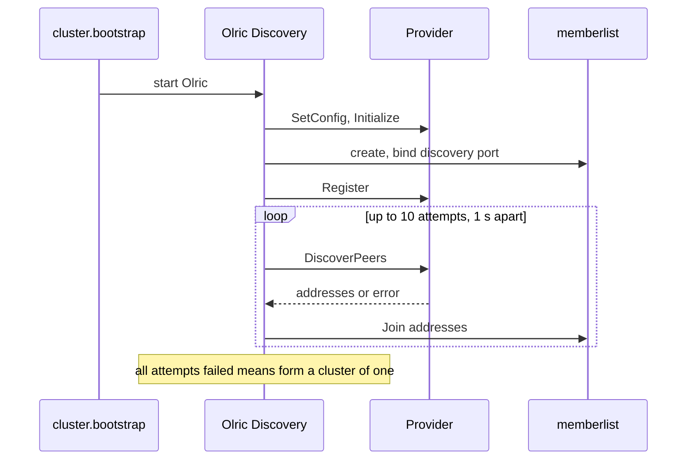

# 19. Clustering: Membership and Discovery

## Contents

- [What you will learn](#what-you-will-learn)
- [19.1 Three ports and a node's identity](#191-three-ports-and-a-nodes-identity)
- [19.2 The provider contract](#192-the-provider-contract)
- [19.3 From provider to Olric](#193-from-provider-to-olric)
- [19.4 The eight providers](#194-the-eight-providers)
  - [Consul](#consul)
  - [DNS-SD](#dns-sd)
  - [etcd](#etcd)
  - [Kubernetes](#kubernetes)
  - [mDNS](#mdns)
  - [NATS](#nats)
  - [Self-managed](#self-managed)
  - [Static](#static)
- [19.5 Memberlist configuration and network profiles](#195-memberlist-configuration-and-network-profiles)
- [19.6 The TLS transport](#196-the-tls-transport)
- [Guarantees](#guarantees)
- [Implementation details (may change)](#implementation-details-may-change)
- [Behaviours to know](#behaviours-to-know)

## What you will learn

- The three ports of a cluster node, how a node describes itself to its peers, and how that description becomes a `Peer`.
- The `discovery.Provider` contract: its lifecycle, its errors, and the boot rule that keeps two nodes booting together from forming two clusters.
- How a GoAkt provider is plugged into Olric and memberlist, in which order Olric calls it, and how often.
- How each of the eight built-in providers registers a node and finds its peers, and where each one bends the contract.
- How a network profile selects memberlist's failure detection preset, and what TLS changes.
- How the TCP transport carries memberlist traffic when TLS is on.

Source files: `discovery/provider.go`, `discovery/node.go`, `discovery/provider_types.go`, `discovery/errors.go`, `discovery/consul/config.go`, `discovery/consul/discovery.go`, `discovery/dnssd/config.go`, `discovery/dnssd/discovery.go`, `discovery/etcd/config.go`, `discovery/etcd/discovery.go`, `discovery/kubernetes/config.go`, `discovery/kubernetes/discovery.go`, `discovery/mdns/config.go`, `discovery/mdns/option.go`, `discovery/mdns/discovery.go`, `discovery/nats/config.go`, `discovery/nats/option.go`, `discovery/nats/discovery.go`, `discovery/selfmanaged/config.go`, `discovery/selfmanaged/discovery.go`, `discovery/selfmanaged/broadcast.go` and its platform files, `discovery/static/config.go`, `discovery/static/discovery.go`, `internal/cluster/discovery.go`, `internal/memberlist/addr.go`, `internal/memberlist/transport.go`, `internal/memberlist/transport_config.go`, `remote/peer.go`, `internal/cluster/peer.go`, and the discovery and network-profile parts of `internal/cluster/config.go`, `internal/cluster/cluster.go` and `actor/cluster_config.go`. Olric (`github.com/tochemey/olric` v0.3.22) and memberlist (`github.com/hashicorp/memberlist` v0.7.0), the versions in `go.mod`, are described from their sources where GoAkt depends on their behaviour; their files are cited by module path.

## 19.1 Three ports and a node's identity

A clustered node listens on three ports. All three are fields of `Node` in `discovery/node.go`:

| Field | Carries | Set by |
|---|---|---|
| `DiscoveryPort` | memberlist gossip: membership, probes, the join handshake | `ClusterConfig.WithDiscoveryPort` in `actor/cluster_config.go` |
| `PeersPort` | Olric's own server: the registry map and the cluster events pub/sub ([Chapter 20](chap-20.md)) | `ClusterConfig.WithPeersPort` in `actor/cluster_config.go` |
| `RemotingPort` | GoAkt remoting ([Chapter 15](chap-15.md)) | the remoting configuration |

`actorSystem.setupCluster` in `actor/actor_system.go` builds the node on every `Start`, before the cluster engine starts, together with a new cluster engine around the configured provider. It refuses to cluster without remoting (`clustering needs remoting to be enabled`). The node's fields come from two places:

- `Name` is the actor system name; `Host` is the remoting bind address and `RemotingPort` the remoting bind port, both after `actorSystem.validate` has sanitised the remoting configuration when the actor system was created ([Chapter 17](chap-17.md)). Sanitising resolves the address with `net.ResolveTCPAddr` (`GetHostPort` in `internal/net/helper.go`), so `Host` is always an IP literal: a host name is replaced by its first resolved IP, once, and a wildcard by a concrete interface address;
- `DiscoveryPort`, `PeersPort` and `Roles` come from the cluster configuration. `ClusterConfig.getRoles` in `actor/cluster_config.go` returns the roles sorted with duplicates removed.

`ClusterConfig.Validate` in `actor/cluster_config.go` requires a provider, a positive discovery port and a positive peers port. It does not check that they differ from each other or from the remoting port.

**How peers learn the node.** `cluster.buildConfig` in `internal/cluster/cluster.go` serialises the whole `Node` to JSON and hands it to Olric as the member metadata. Olric encodes it, with the member's name and birth time, into the node metadata that memberlist gossips with the member (`Member.Encode` in `github.com/tochemey/olric/internal/discovery/member.go`). Memberlist caps that metadata at `MetaMaxSize` (512 bytes, `github.com/hashicorp/memberlist/net.go`) and panics in `Memberlist.setAlive` when it is longer; GoAkt does not check the size, so a very long system name or role list stops the node at boot. Olric binds its server to `Host:PeersPort`, and names the memberlist member after that address (`prepareConfig` in `github.com/tochemey/olric/olric.go`). A provider therefore only has to deliver discovery addresses: the peers port, the remoting port and the roles of every member travel in the metadata once the node is a member.

**From metadata to `Peer`.** `cluster.Members` in `internal/cluster/cluster.go` decodes each member's metadata back into a `Node`, sorts and compacts its roles, and returns a `Peer` (`internal/cluster/peer.go`) with the three ports, the roles, whether the member is the coordinator, and its birth time as `CreatedAt`. `cluster.Peers` drops the entry whose peers address equals the local node's. `ToRemotePeers` and `ToRemotePeer` in `internal/cluster/peer.go` copy them into the public `Peer` in `remote/peer.go`, which is what `ActorSystem.Peers` and `ActorSystem.Leader` return; the public type has no coordinator flag. Both types build their addresses with `net.JoinHostPort`, so an IPv6 host comes out bracketed (`Node.PeersAddress` and `Node.DiscoveryAddress` in `discovery/node.go`; `Peer.PeersAddress` and `Peer.RemotingAddress` in `remote/peer.go`).

`Node.String` prints the discovery port under the label `gossip`.

## 19.2 The provider contract

```go
type Provider interface {
    ID() string
    Initialize() error
    Register() error
    Deregister() error
    DiscoverPeers() ([]string, error)
    Close() error
}
```

`Provider` in `discovery/provider.go` is the only thing a deployment plugs in to tell a node where its peers are. The built-in IDs are constants in `discovery/provider_types.go`: `consul`, `dns`, `etcd`, `kubernetes`, `mdns`, `nats`, `selfmanaged` and `static`. Note that the DNS-SD provider's ID is `dns`, not `dnssd`.

**Lifecycle.** The providers that keep state share four sentinel errors (`discovery/errors.go`):

| Call | Precondition | Error when the precondition fails |
|---|---|---|
| `Initialize` | not yet initialised | `ErrAlreadyInitialized` |
| `Register` | initialised, not registered | `ErrNotInitialized`, `ErrAlreadyRegistered` |
| `DiscoverPeers` | initialised and registered | `ErrNotInitialized`, `ErrNotRegistered` |
| `Deregister` | initialised and registered | `ErrNotInitialized`, `ErrNotRegistered` |
| `Close` | none; releases resources | none |

`ErrInvalidConfig` is the fifth sentinel; only the self-managed provider returns it, for a nil configuration. Not every provider follows the table: [§19.4](#194-the-eight-providers) lists the exceptions. Every address returned by `DiscoverPeers` is handed to memberlist's join, so it must name a node's **discovery port**: either `host:port`, or a bare host to which memberlist adds this node's own discovery port (`Memberlist.resolveAddr` in `github.com/hashicorp/memberlist/memberlist.go`). A list may contain the local node: nothing removes it before the join.

**The boot rule.** The interface comments state what the cluster expects:

1. The cluster calls `Register` when the node boots, before `DiscoverPeers`. **Once `Register` has returned, `DiscoverPeers` on the other nodes must list this node**, so that two nodes booting at the same moment cannot both miss each other.
2. The cluster calls `DiscoverPeers` when the node boots and joins the nodes it returns. With the default minimum peers quorum of 1, it is not called again once it has succeeded.
3. A list that holds no other node means this node is alone and forms a cluster of one. **Two clusters formed separately never merge.**
4. An error makes the cluster retry, once a second for ten seconds, before the node forms a cluster alone. A provider whose view may be incomplete must therefore return an error rather than a list without any other node.

The user documentation (`docs/clustering/service-discovery.mdx`) adds the second half of rule 1: reads must be consistent, returning every node whose `Register` returned before the call. It also gives a wrapper that turns a list without another node into an error, for providers that cannot keep both rules.

## 19.3 From provider to Olric

GoAkt does not run discovery itself. The cluster engine hands the provider to Olric, which runs memberlist and calls the provider at fixed points.

**The adapter.** `discoveryProvider` in `internal/cluster/discovery.go` wraps a `Provider` and implements Olric's `service_discovery.ServiceDiscovery`. It adds four behaviours to plain delegation:

- `Initialize`, `Register`, `Deregister` and `DiscoverPeers` return `discovery provider is not set` when the provider is nil (`SetConfig` and `Close` call the provider without that check);
- `Initialize` swallows `ErrAlreadyInitialized` and `Register` swallows `ErrAlreadyRegistered`, so calling them on a provider already in that state is not an error;
- `SetConfig` requires an `id` entry in Olric's configuration map and compares it, ignoring case, with the provider's `ID`;
- `SetLogger` keeps Olric's standard logger; the adapter itself never logs.

`cluster.configureDiscovery` in `internal/cluster/cluster.go` installs the adapter as Olric's `ServiceDiscovery` plugin, with the `id` taken from the provider itself, so the `SetConfig` check always passes for the built-in path.

**Boot order.** `cluster.bootstrap` in `internal/cluster/cluster.go` builds the configuration, applies the memberlist settings ([§19.5](#195-memberlist-configuration-and-network-profiles)), installs the adapter and starts Olric. Inside Olric, in order:

1. `Discovery.Start` (`github.com/tochemey/olric/internal/discovery/discovery.go`) loads the plugin: `SetConfig`, `SetLogger`, then **`Initialize`**.
2. It creates memberlist. Without TLS, memberlist's own transport binds the discovery port here; with TLS, the transport of [§19.6](#196-the-tls-transport) bound it already, when `cluster.setupMemberlistConfig` built it.
3. It calls **`Register`**. The node is therefore already listening on its gossip port when another node can first read it.
4. `RoutingTable.attemptToJoin` (`github.com/tochemey/olric/internal/cluster/routingtable/discovery.go`) makes up to `DefaultMaxJoinAttempts` (10) attempts. Each one calls `Discovery.Join`, which calls **`DiscoverPeers`** and passes the whole list to `Memberlist.Join`.
5. `Memberlist.Join` contacts every address and succeeds if at least one answered (`github.com/hashicorp/memberlist/memberlist.go`). An empty list is a success with zero nodes.
6. A failed attempt, whether `DiscoverPeers` returned an error or no listed address answered, waits `DefaultJoinRetryInterval` (one second) and tries again, unless the coordinator has meanwhile pushed a routing table to this node, which ends the loop. After ten failures `RoutingTable.Join` logs that it is forming a new cluster and carries on alone.



**After boot.** `RoutingTable.Start` (`github.com/tochemey/olric/internal/cluster/routingtable/routingtable.go`) starts `RoutingTable.rejoinLoop` only when the member-count quorum is above one, that is when `WithMinimumPeersQuorum` is 2 or more. Every `DefaultRejoinInterval` (five seconds) it calls `RoutingTable.tryRejoin`, which, while the quorum is not met, calls `DiscoverPeers` again and joins what it returns. With the default quorum of 1 there is no such loop: the provider is read only during the join attempts above. Everything else about membership after boot is memberlist gossip and probing ([§19.5](#195-memberlist-configuration-and-network-profiles)).

**Shutdown order.** Stopping the cluster shuts Olric down ([Chapter 20](chap-20.md)), and `Discovery.Shutdown` in Olric then, in order: broadcasts a leave message with `Memberlist.Leave`, bounded by `DefaultLeaveTimeout` (five seconds); calls **`Deregister`**, logging and ignoring its error; shuts memberlist down; and finally calls **`Close`**, also logging and ignoring its error. Memberlist is shut down, and with it the transport, only if `Discovery.Start` got as far as creating it. A graceful stop therefore leaves the cluster before it leaves the provider's directory.

**The provider instance is reused.** `retryBootstrap` in `internal/cluster/cluster.go` runs the whole bootstrap up to three times ([Chapter 20](chap-20.md)). An attempt that fails after Olric has started shuts its Olric server down, which deregisters and closes the provider, and the next attempt initialises and registers **the same provider instance** again. A `Start` after a `Stop` does the same, since the cluster configuration keeps the provider. A provider must therefore accept `Initialize` and `Register` after `Deregister` and `Close`. Each subsection of [§19.4](#194-the-eight-providers) says what `Deregister` and `Close` leave behind.

## 19.4 The eight providers

| Provider | Package | Backend | `Register` does | Lists itself | Empty result |
|---|---|---|---|---|---|
| Consul | `discovery/consul` | Consul agent | registers a service with a TCP health check | no | `nil` error |
| DNS-SD | `discovery/dnssd` | system DNS | nothing remote | if DNS lists it | `nil` error, or the resolver's error |
| etcd | `discovery/etcd` | etcd | writes a key under a lease, keeps it alive | no | `nil` error |
| Kubernetes | `discovery/kubernetes` | Kubernetes API | creates the API client | yes | `ErrNoPodsAvailable` |
| mDNS | `discovery/mdns` | multicast DNS | starts an mDNS responder | yes | `nil` error |
| NATS | `discovery/nats` | NATS server | subscribes to the subject | no | `nil` error |
| Self-managed | `discovery/selfmanaged` | UDP broadcast | starts announcing and listening | no | `nil` error |
| Static | `discovery/static` | none | nothing | if configured | not possible: `Initialize` requires a host |

Five providers take the node's own address in their configuration (Consul, etcd and NATS as `Host` and `DiscoveryPort`, self-managed as `SelfAddress`, mDNS as `Port`). That configuration is separate from the cluster configuration, and nothing checks that the two agree. When they disagree, the provider advertises an address nobody listens on, and its self-exclusion misses the local node.

### Consul

`Config` in `discovery/consul/config.go` requires `ActorSystemName`, `Address`, `Host` and a positive `DiscoveryPort`. `NewDiscovery` copies the configuration, so the defaults do not change the caller's value, and sets the service ID to `Host:DiscoveryPort`. `Initialize` applies `Config.Sanitize`, validates, creates the client and probes the agent with `Self`.

- **Register** (`Discovery.Register` in `discovery/consul/discovery.go`) registers a service named and tagged with the actor system name, with the node's host and discovery port, and a TCP check on that address. `Config.Sanitize` replaces a nil `HealthCheck` with `defaultHealthCheck` (every 10 s, 3 s timeout), so the check is always registered, although the field comment says nil disables it.
- **DiscoverPeers** queries the health endpoint for the service, filtered by the tag. `QueryOptions` default to all instances, healthy or not (`OnlyPassing` false), no stale reads (`AllowStale` false) and the configured datacenter. Entries without a service or node are skipped, the local service ID is skipped, and the service address falls back to the Consul node's address when empty. An instance registered without a port comes back as a bare host.
- **Deregister** removes the service. `Close` deregisters if still registered, drops the error, and clears the client, so the provider can be initialised again.
- `Config.Context` and `Config.Timeout` are set by `Sanitize` but never used: requests use the Consul client's own HTTP settings.

### DNS-SD

`Config` in `discovery/dnssd/config.go` requires `DomainName`. `Register` and `Deregister` only flip a local flag: there is no directory to write to. `Close` does nothing, so the initialised flag survives it.

`Discovery.DiscoverPeers` in `discovery/dnssd/discovery.go` resolves the name with Go's own resolver, bounded by `lookupTimeout` (30 s). With `IPv6` set it looks up AAAA records only; otherwise it returns every address the name resolves to. The result is sorted and deduplicated **bare IP addresses**. Memberlist completes each with this node's own discovery port ([§19.2](#192-the-provider-contract)), so **every node must use the same discovery port**. A lookup error, such as an unknown name, is returned as is and therefore triggers the join retries.

### etcd

`Config` in `discovery/etcd/config.go` requires `ActorSystemName`, `Host`, a positive `DiscoveryPort`, a positive `TTL` in seconds, a positive `DialTimeout`, a positive `Timeout` and at least one endpoint; `TLS`, `Username` and `Password` are optional. `Config.Context` defaults to `context.Background()` and, as its comment says, must outlive the provider: cancelling it stops the lease keep-alive, so the node's key disappears once its lease expires.

- **Initialize** (`Discovery.Initialize` in `discovery/etcd/discovery.go`) creates the client and calls `MemberList`, bounded by `DialTimeout`, which succeeds through any reachable endpoint. All keys go through a namespace prefix `<ActorSystemName>/`.
- **Register** grants a lease of `TTL` seconds, writes the key `Host:DiscoveryPort` with the same value under it, and starts the keep-alive, whose responses a goroutine drains. A failed write or keep-alive revokes the lease at once.
- **DiscoverPeers** reads the prefix within `Timeout` and returns every value except the local key.
- **Deregister** (`Discovery.deregisterLocked`) cancels the keep-alive and revokes the lease on a best-effort basis; if etcd is unreachable, the key disappears when the lease expires. `Close` deregisters if needed, closes the client and clears the initialised flag, so the provider can be initialised again.

A node that dies without deregistering stays listed until its lease expires, at most `TTL` seconds later.

### Kubernetes

`Config` in `discovery/kubernetes/config.go` requires `Namespace`, `DiscoveryPortName` and at least one entry in `PodLabels`. `RemotingPortName` and `PeersPortName` are deprecated and ignored, because the other two ports travel in the member metadata ([§19.1](#191-three-ports-and-a-nodes-identity)).

The provider's state machine differs from the table in [§19.2](#192-the-provider-contract). `Discovery.Initialize` validates and builds the label selector but does **not** mark the provider initialised. `Discovery.Register` creates the client from the in-cluster configuration and marks it initialised; a second `Register` returns `ErrAlreadyRegistered`. `Deregister` clears the flag, so `DiscoverPeers` afterwards returns `ErrNotInitialized` and a later `Register` creates a fresh client. `Close` does nothing. `Register` does not require `Initialize`; without it the label selector is empty and `DiscoverPeers` lists every Running pod of the namespace.

`Discovery.DiscoverPeers` lists the pods of the namespace that match the labels and the field selector `status.phase=Running`, within `discoverPeersTimeout` (30 s). It skips pods being deleted (they stay `Running` until their containers exit) and pods without an IP yet, and pods with no container port named `DiscoveryPortName`, and returns `podIP:port` for that port (`discoveryPort`), sorted and deduplicated. Readiness is deliberately not required. The comment on the function gives the reason: on a cold start no pod is Ready until its actor system has joined, so requiring readiness would keep any cluster from forming. Liveness of the candidates is left to memberlist's failure detector.

The calling pod matches its own selector, so it is in its own result once the API reports it Running. The comment on `ErrNoPodsAvailable` draws the consequence: once the kubelet reports the pod Running, the pod must at least see itself, so an empty result means the API's view lags. **An empty result is returned as `ErrNoPodsAvailable`**, which makes the cluster retry instead of booting a cluster of one.

### mDNS

`Config` in `discovery/mdns/config.go` requires `ServiceName`, `Service` and `Domain`. `Port` is the discovery port this node announces and peers must announce; it is not validated. `WithLogger` in `discovery/mdns/option.go` sets the logger the mDNS library writes to.

- **Register** (`Discovery.Register` in `discovery/mdns/discovery.go`) announces a unique instance, `ServiceName` plus an eight-character random suffix, with a host name derived from the instance so no operating-system lookup is needed and host names never collide. It carries the cluster name in a TXT record `name=<ServiceName>`, which is what lets several nodes of one cluster share a service and domain. The addresses announced come from `advertisedAddresses`: every non-loopback address of the interfaces that are up and multicast capable, IPv4 first, then global IPv6, and link-local IPv6 only when there is no global one. They are **not** the node's configured host.
- **DiscoverPeers** browses for `browseTimeout` (five seconds) and collects the answers concurrently, because the library drops entries it cannot hand over. The query goes over IPv4 multicast only; the comment explains that the library gives up on the first family that fails, and an IPv6 multicast send needs an interface scope it sets only when pinned to one interface. `Discovery.matches` keeps entries with the same port, the same service and domain suffix, and the cluster's TXT record. `Discovery.addresses` returns `ip:port` for each entry's IPv4 address, and its IPv6 address too when `IPv6` is set, sorted and deduplicated. The node's own responder answers its query, so **the list includes the local node**.
- **Initialize** returns `ErrAlreadyInitialized` only while registered, as `Register` is what sets the flag; `Register` does not require `Initialize`, so it skips validation when called alone. **Deregister** clears it, shuts the responder down and closes an internal channel. `Close` does nothing.

### NATS

`Config` in `discovery/nats/config.go` requires `NatsServer`, `NatsSubject`, `Host` and a positive `DiscoveryPort`; `ServerAddrValidator.Validate` checks that `NatsServer` starts with `nats` and carries a valid `host:port` after `nats://`. `Discovery.Initialize` in `discovery/nats/discovery.go` sets the defaults (a one-second `Timeout`, five `MaxJoinAttempts`, a two-second `ReconnectWait`), and connects with unlimited reconnects, retrying the first connection up to `MaxJoinAttempts` times with the reconnect wait as its delay. `WithLogger` in `discovery/nats/option.go` sets the logger.

- **Register** subscribes to the subject. The handler answers a `REQUEST` message with this node's host and discovery port on the request's reply subject, and only logs a `DEREGISTER` message. `Register` does not check that the provider was initialised, and `Deregister` checks only the registered flag.
- **DiscoverPeers** subscribes to a fresh inbox through a buffered channel of `peerResponseBuffer` (32) messages, publishes a `REQUEST` on the subject with that inbox as the reply address, and collects answers for the whole `Timeout`. It drops the answer whose `host:port` equals its own and returns the rest in arrival order. A message it cannot decode ends the call with that error. The call always lasts `Timeout`, and an empty result is `nil` with no error.
- **Deregister** (`Discovery.deregisterLocked`) unsubscribes and publishes a `DEREGISTER` message. `Close` deregisters if needed, clears the initialised flag, flushes and closes the connection.

The messages are `internalpb.NatsMessage` protobufs. Only the nodes that answer within the timeout are listed: a node whose handler is slow to reply is missed.

### Self-managed

`Config` in `discovery/selfmanaged/config.go` requires `ClusterName` and a `SelfAddress` in `host:port` form, the address this node advertises on the discovery port. `BroadcastPort` defaults to 7947, `BroadcastInterval` to five seconds, and a peer not heard from for three intervals is expired (`Config.peerExpiry`). `Initialize` validates; `Register` starts a `broadcast`; `Deregister` stops it, checking only the registered flag; `Close` calls `Deregister` and ignores its error, so it can be called any number of times. Since `Close` does not clear the initialised flag, a later `Initialize` returns `ErrAlreadyInitialized`, which the adapter swallows ([§19.3](#193-from-provider-to-olric)).

**The packet** is plain text, `goakt-v1|<ClusterName>|<SelfAddress>` (`broadcast.encodePacket` in `discovery/selfmanaged/broadcast.go`). Nothing limits its size on the sending side; the receiver reads into a buffer of `maxPacketSize` (512 bytes). `broadcast.handlePacket` drops a packet with another version or cluster name, or whose address is not a `host:port` with a non-empty host and a numeric port, and otherwise records the address with the time it was heard.

**Sockets.** `broadcast.start` uses one socket to receive and one to send. Loopback mode is chosen by `Config.isLoopbackBroadcast` in `discovery/selfmanaged/config.go`, which is true only when `BroadcastAddress` holds the four-byte form of an IPv4 address whose first byte is 127. `net.IPv4` and `net.ParseIP` return the sixteen-byte form, so `net.IPv4(127, 0, 0, 1)` selects the default mode, and packets are sent to `127.0.0.1` itself (`Config.broadcastIP`).

| Mode | Receive socket | Send target |
|---|---|---|
| default | `0.0.0.0:BroadcastPort`, with `SO_REUSEPORT` on Linux and macOS (`listenUDPReusePortToAddr` in `discovery/selfmanaged/listen_udp_reuseport.go`) and `SO_REUSEADDR` on Windows | `255.255.255.255`, or `BroadcastAddress` when set |
| loopback, macOS | joins multicast group `224.0.0.1` on the loopback interface (`listenUDPMulticastLoopback` in `discovery/selfmanaged/listen_udp_multicast.go`); if that fails, as on Linux | `224.0.0.1` |
| loopback, Linux | `127.255.255.255`, with `SO_REUSEPORT` | `127.255.255.255`, with `SO_BROADCAST` set |
| loopback, Windows | `127.0.0.1`, with `SO_REUSEADDR` | `127.255.255.255`, with `SO_BROADCAST` set |

On other platforms the receive socket has no reuse option, so only one node per host can use a broadcast port.

**The loops.** `broadcast.sendLoop` sends the packet on every tick of the interval and ignores write errors. **The first packet leaves one interval after `Register`**, not at once. `broadcast.recvLoop` reads with a 100 ms deadline so it notices a stop, and ignores read errors until the socket is closed. `broadcast.getPeers` returns the addresses heard within the expiry window, excluding `SelfAddress`.

`Discovery.DiscoverPeers` returns that cache. **Right after `Register` the cache is empty**, unless another node's packet has arrived in between, and an empty cache is returned as an empty list with no error. Olric calls `DiscoverPeers` immediately after `Register` ([§19.3](#193-from-provider-to-olric)), so with a quorum of 1 a self-managed node depends on a packet arriving in that gap. The user documentation lists the self-managed provider among those to use with a quorum of 2 or more, whose rejoin loop reads the cache again every five seconds.

### Static

`Config` in `discovery/static/config.go` requires at least one host, each a `host:port` (a host name is allowed and resolved by memberlist). `Initialize` validates; `Register`, `Deregister` and `Close` do nothing and keep no state, so the provider can be reused freely. `Discovery.DiscoverPeers` in `discovery/static/discovery.go` returns the configured slice itself, local node included if it is listed. `DiscoverPeers` works without `Initialize`, and with an unvalidated configuration.

## 19.5 Memberlist configuration and network profiles

`cluster.setupMemberlistConfig` in `internal/cluster/cluster.go` builds the memberlist configuration that Olric uses.

1. It maps the network profile to a memberlist preset (`memberlistEnv` in `internal/cluster/config.go`) and asks Olric for it (`NewMemberlistConfig` in `github.com/tochemey/olric/config/memberlist.go`). An unknown profile is an error.
2. It binds and advertises memberlist on `Host:DiscoveryPort`. Olric rejects an advertise address that is not an IP literal (`Config.validateMemberlistConfig` in `github.com/tochemey/olric/config/memberlist.go`). On the actor system path `Host` is always one, because sanitising the remoting configuration resolved it ([§19.1](#191-three-ports-and-a-nodes-identity)); a node configured with a host name therefore advertises the IP that name resolved to when the actor system was created.
3. It sets the memberlist label to `prefix-<actor system name in lower case>`. The comment gives the reason: in Kubernetes, a pod IP can be reused by a pod of another namespace, and the label makes memberlist reject gossip from a node of another ring that arrives from a reused IP.
4. With TLS configured, it installs the TCP transport of [§19.6](#196-the-tls-transport) and adjusts failure detection (below).

**Profiles.** `NetworkProfile` in `internal/cluster/config.go` has three values, re-exported by `actor/cluster_config.go`. `NetworkProfileLAN` is the default in both `defaultConfig` and `NewClusterConfig`. `ClusterConfig.Validate` in `actor/cluster_config.go` rejects an undefined profile, using `NetworkProfile.Valid`.

| Profile | memberlist preset | Probe interval | Probe timeout | Suspicion multiplier | Failure confirmed in, per the code comments |
|---|---|---|---|---|---|
| `NetworkProfileLocal` | `DefaultLocalConfig` | 1 s | 200 ms | 3 | about 5 s on up to ten nodes; most sensitive to pauses such as garbage collection or CPU throttling |
| `NetworkProfileLAN` | `DefaultLANConfig` | 1 s | 500 ms | 4 | about 6 s on up to ten nodes; grows slowly with the cluster size |
| `NetworkProfileWAN` | `DefaultWANConfig` | 5 s | 3 s | 6 | about 40 s on up to ten nodes; tolerates high latency and packet loss |

The presets are in `github.com/hashicorp/memberlist/config.go`. Apart from the addresses, the label and the TLS changes below, GoAkt keeps each preset as it is: gossip interval, push-pull interval, indirect checks and stream timeout are the preset's.

**With TLS.** The transport carries every packet over a fresh TLS connection, so `cluster.setupMemberlistConfig` also:

- disables memberlist's TCP fallback ping: the transport already carries packets over TCP, so the fallback would only ping a dead node a second time (comment on `tlsProbeInterval`);
- for every profile except WAN, raises the probe interval to `tlsProbeInterval` (2 s) and the probe timeout to `tlsProbeTimeout` (1 s). The comment explains that memberlist runs the whole probe, direct, indirect and fallback, under one deadline of one probe interval, and a per-packet TLS dial makes the LAN preset's one second tight. WAN keeps its own preset, which is already slower;
- sets memberlist's UDP buffer size to 10 MiB.

**Join, leave and failure.** In terms of these settings, the life of a membership is:

- **join**: the provider's addresses are joined once at boot ([§19.3](#193-from-provider-to-olric)); memberlist then gossips the new member to everyone, metadata included;
- **leave**: a graceful stop broadcasts a leave message before it deregisters from the provider ([§19.3](#193-from-provider-to-olric));
- **failure**: a crashed node is found by probing, and confirmed after the suspicion window the profile implies. The cluster engine then waits for the routing table to converge, at most `WithConvergenceTimeout` (ten seconds by default), before it announces `NodeLeft`. That wait, the events and everything that follows a departure belong to [Chapter 20](chap-20.md) and [Chapter 21](chap-21.md).

Partitions are not resolved here either: a node only refuses registry operations while it sees fewer members than the quorum ([Chapter 20](chap-20.md)).

## 19.6 The TLS transport

Without TLS, memberlist uses its own transport: UDP packets and TCP streams on the discovery port. With TLS, `Transport` in `internal/memberlist/transport.go` replaces it. It implements memberlist's `NodeAwareTransport` with TCP for both of memberlist's channel kinds, a new connection per operation and no connection reuse.

**Construction.** `NewTransport` binds its listeners and starts accepting at once, before memberlist exists. It binds one TCP listener per address in `TransportConfig.BindAddrs` (`internal/memberlist/transport_config.go`), all on the same port; an empty list binds `0.0.0.0`, and a port of zero takes the kernel's port from the first listener. Each address must be an IP literal. With `TLSEnabled`, the listener is a TLS listener. `cluster.setupMemberlistConfig` passes the node's host and discovery port, five-second packet dial and write timeouts, the cluster logger, and **the client TLS configuration**, which the transport uses both to listen and to dial (`Transport.getConnection`).

**Wire format.** The first byte of every connection is the message type (`messageType` in `internal/memberlist/addr.go`): 1 for a packet, 2 for a stream.

| Kind | Sender | Bytes after the type byte |
|---|---|---|
| packet | `Transport.writeTo` | one length byte, the sender's advertised address, the payload, a 16-byte MD5 digest of the payload; then the connection is closed |
| stream | `Transport.DialTimeout` | memberlist's own stream; the connection is handed to memberlist as is |

The advertised address is in the packet because the receiver would otherwise see only the connection's ephemeral source port, which matches no member, and memberlist needs the real address to match probes to nodes (comment in `Transport.writeTo`). The digest only detects a packet that did not arrive whole; the comment notes it is not used cryptographically. The header, payload and digest go out in one vectored write.

**Receiving.** `Transport.tcpListen` accepts connections, backing off from 5 ms to 1 s on accept errors, and serves each on its own goroutine. `Transport.handleConnection` reads the type byte; a stream goes to memberlist's stream channel; a packet is read to the end, its digest checked, and delivered to memberlist's packet channel with the sender's advertised address as its origin (`addr` in `internal/memberlist/addr.go`). A packet shorter than a digest, or whose digest does not match, is logged and dropped; an unknown type byte is logged and the connection closed.

**Sending never fails.** `Transport.WriteTo` logs a failed packet send (at debug level for a refused connection, the normal state of a node that has stopped) and returns no error. The comment explains that memberlist treats packets as UDP and does not cope well with the extra errors TCP can report.

**Advertised address.** `Transport.FinalAdvertiseAddr` uses the configured advertise address when there is one. Otherwise it advertises a private interface address for a `0.0.0.0` bind, or the first listener's address, with the listener's port. GoAkt always passes the node's host, so the fallback is not used on the cluster path.

## Guarantees

| Statement | Enforced by |
|---|---|
| A node's peers and discovery addresses bracket an IPv6 host; `HasRole` matches only the node's roles | `TestNodePeersAddress`, `TestNodeDiscoveryAddress` and `TestNodeHasRole` in `discovery/node_test.go` |
| The adapter swallows `ErrAlreadyInitialized`, rejects a configuration without an `id` or with another provider's `id`, and fails `Initialize`, `Register`, `Deregister` and `DiscoverPeers` when no provider is set | `TestDiscoveryProvider` in `internal/cluster/discovery_test.go` |
| `Peers` drops the local node and decodes every peer's ports from its metadata | `TestPeersFiltersSelfAndParsesMeta` in `internal/cluster/cluster_test.go` |
| Each network profile selects its memberlist preset; an undefined profile is an error | `TestMemberlistEnv` in `internal/cluster/config_test.go`; `TestSetupMemberlistConfigNetworkProfile` in `internal/cluster/cluster_test.go` |
| LAN is the default profile; `ClusterConfig.Validate` rejects an undefined profile | `TestDefaultConfigFailureDetection` in `internal/cluster/config_test.go`; `TestClusterConfig` in `actor/cluster_config_test.go` |
| With TLS, the TCP transport is installed and the TCP fallback ping is off for every profile; LAN and Local probe every 2 s with a 1 s timeout; WAN keeps its preset | `TestSetupMemberlistConfigWithTLS` in `internal/cluster/cluster_test.go` |
| With TLS, a host that is not an IP literal fails the memberlist configuration | `TestSetupMemberlistConfigReturnsTLSTransportError` in `internal/cluster/cluster_test.go` |
| The transport delivers a packet whose digest matches and drops one whose digest does not | `TestTCPTransportPacketDigest` in `internal/memberlist/transport_test.go` |
| `WriteTo` returns no error on a refused or failed send; a `0.0.0.0` bind advertises a concrete address, not the wildcard; two memberlist nodes over the TLS transport exchange best-effort and reliable messages | `TestTCPTransport` in `internal/memberlist/transport_test.go` |
| Consul, etcd and NATS: `DiscoverPeers` fails before `Register`, lists the other registered node and not the local one, and stops listing a node once it deregisters | `TestDiscovery` in `discovery/consul/discovery_test.go`; `TestDiscoverPeers` in `discovery/etcd/discovery_test.go`; `TestDiscovery` in `discovery/nats/discovery_test.go` |
| etcd `Initialize` fails against an unreachable endpoint; its configuration requires `Timeout` | `TestDiscovery` in `discovery/etcd/discovery_test.go`; `TestConfig` in `discovery/etcd/config_test.go` |
| A NATS provider can register again after deregistering; its configuration rejects a server address that does not start with `nats`, or that has no host | `TestDiscovery` in `discovery/nats/discovery_test.go`; `TestConfig` in `discovery/nats/config_test.go` |
| Kubernetes discovery includes Running pods that are not Ready, excludes terminating pods and pods without an IP, and turns an empty result into `ErrNoPodsAvailable` | `TestDiscoverPeersFailures` in `discovery/kubernetes/discovery_test.go` |
| Kubernetes `Register` creates the client and marks the provider initialised, and fails without an in-cluster configuration | `TestRegister` in `discovery/kubernetes/discovery_test.go` |
| An mDNS entry counts only with the same port, service and cluster TXT record; two nodes of one cluster coexist under one service name; a lone registered node's `DiscoverPeers` is not empty | `TestMatches`, `TestTwoNodesShareServiceName` and `TestDiscovery` in `discovery/mdns/discovery_test.go` |
| mDNS returns IPv6 addresses only when asked, deduplicated | `TestAddresses` in `discovery/mdns/discovery_test.go` |
| A self-managed packet with another version, another cluster name or a malformed address is ignored; the local address is excluded; a silent peer expires | `TestBroadcast_handlePacket`, `TestBroadcast_getPeers_excludesSelf` and `TestBroadcast_getPeers_excludesExpired` in `discovery/selfmanaged/broadcast_test.go` |
| A self-managed node that has heard no packet returns an empty list with no error; `Close` can be called twice | `TestDiscovery_DiscoverPeers` and `TestDiscovery_Close` in `discovery/selfmanaged/discovery_test.go` |
| DNS-SD returns bare IP addresses | `TestDiscovery` in `discovery/dnssd/discovery_test.go` |
| Static discovery returns the configured hosts; its configuration rejects a host without a port | `TestDiscovery` in `discovery/static/discovery_test.go`; `TestConfig` in `discovery/static/config_test.go` |

## Implementation details (may change)

- Olric's join budget of ten attempts one second apart, which `cluster.buildConfig` sets explicitly to Olric's defaults; the five-second rejoin interval and the five-second leave timeout, which GoAkt leaves to Olric.
- The memberlist member name is `Host:PeersPort`; the label is `prefix-` plus the lower-cased system name.
- The TLS transport's five-second packet dial and write timeouts, the 10 MiB UDP buffer size, the 2 s and 1 s TLS probe overrides, and the 5 ms to 1 s accept backoff.
- Provider timeouts and defaults: DNS-SD 30 s lookup; Kubernetes 30 s listing; mDNS five-second browse, eight-character instance suffix, 32-entry buffer; NATS one-second collection, 32-message buffer, five connection attempts, two-second reconnect wait; Consul 10 s and 3 s health check; self-managed port 7947, five-second interval, three-interval expiry, 512-byte packets, 100 ms read deadline.
- DNS-SD, Kubernetes and mDNS results are sorted and deduplicated; self-managed results come in the cache's iteration order, which is unordered; NATS results are in arrival order; Consul and etcd results are in the backend's order.

## Behaviours to know

| Behaviour | Source |
|---|---|
| With a quorum of 1, `DiscoverPeers` is read only during the boot join; a node that booted alone stays alone, and two clusters formed separately never merge | `Provider` in `discovery/provider.go` |
| An empty list, or a list with only the local node, makes a cluster of one; only an error, from the provider or from a join that reached no listed address, is retried | `RoutingTable.attemptToJoin` in `github.com/tochemey/olric/internal/cluster/routingtable/discovery.go` |
| A failed bootstrap attempt, or a `Stop`, deregisters and closes the provider; the next attempt, or the next `Start`, initialises and registers the same instance again | `retryBootstrap` in `internal/cluster/cluster.go` |
| A provider's own host and port are configured separately from the cluster's and are never compared with them | `actorSystem.setupCluster` in `actor/actor_system.go` |
| A host name given as the remoting bind address is resolved once, when the actor system is created; the node advertises the resolved IP for gossip, peers and remoting, and does not follow a later DNS change | `GetHostPort` in `internal/net/helper.go` |
| Memberlist panics at boot when the encoded member metadata, which carries the JSON `Node` with its name, host and roles, exceeds 512 bytes; nothing in GoAkt checks the size | `Memberlist.setAlive` in `github.com/hashicorp/memberlist/memberlist.go` |
| DNS-SD returns IPs without a port; every node must use the same discovery port | `Discovery.DiscoverPeers` in `discovery/dnssd/discovery.go` |
| A self-managed node sends its first announcement one interval after `Register`, and its first `DiscoverPeers`, made right after `Register`, finds an empty cache unless a peer's packet arrived in between | `broadcast.sendLoop` in `discovery/selfmanaged/broadcast.go` |
| Self-managed loopback mode needs `BroadcastAddress` in four-byte form; `net.IPv4(127, 0, 0, 1)` selects the default mode and sends to `127.0.0.1` | `Config.isLoopbackBroadcast` and `Config.broadcastIP` in `discovery/selfmanaged/config.go` |
| Every NATS `DiscoverPeers` lasts the full `Timeout`, and NATS `Register` does not check for `Initialize` | `Discovery.DiscoverPeers` and `Discovery.Register` in `discovery/nats/discovery.go` |
| Consul always registers a health check, even with `HealthCheck` nil, and returns unhealthy instances unless `OnlyPassing` is set; `Context` and `Timeout` have no effect | `Config.Sanitize` in `discovery/consul/config.go`; `Discovery.DiscoverPeers` in `discovery/consul/discovery.go` |
| An etcd node that dies without deregistering stays listed for up to `TTL` seconds, and cancelling `Config.Context` removes a live node once its lease expires | `Discovery.Register` in `discovery/etcd/discovery.go` |
| mDNS announces every multicast-capable interface address, not the node's configured host | `advertisedAddresses` in `discovery/mdns/discovery.go` |
| The Kubernetes provider is marked initialised by `Register`, not `Initialize` | `Discovery.Register` in `discovery/kubernetes/discovery.go` |
| With TLS, memberlist listens with the client TLS configuration, so that configuration must carry a certificate the peers accept as a server certificate; the server configuration is not used for gossip | `cluster.setupMemberlistConfig` in `internal/cluster/cluster.go`; `NewTransport` in `internal/memberlist/transport.go` |
| A failed memberlist packet send over the TLS transport is never reported to memberlist | `Transport.WriteTo` in `internal/memberlist/transport.go` |
