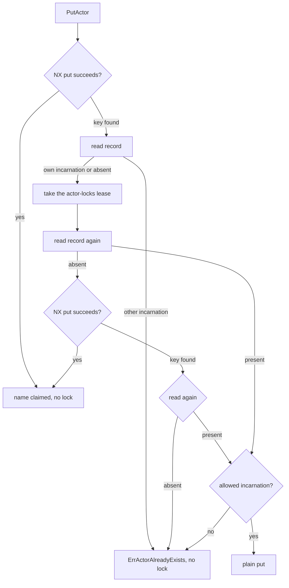
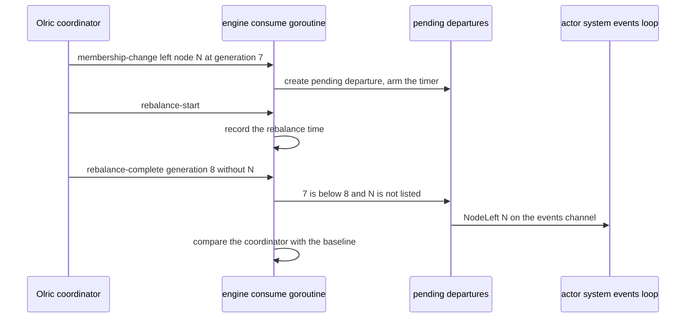

# 20. Clustering: the Cluster Core

## Contents

- [What you will learn](#what-you-will-learn)
- [20.1 The engine and what it delegates](#201-the-engine-and-what-it-delegates)
- [20.2 Configuration](#202-configuration)
  - [`ClusterConfig`](#clusterconfig)
  - [From `ClusterConfig` to the engine](#from-clusterconfig-to-the-engine)
- [20.3 Start and stop](#203-start-and-stop)
- [20.4 The registry](#204-the-registry)
  - [One map, namespaced keys](#one-map-namespaced-keys)
  - [Records and their encoding](#records-and-their-encoding)
- [20.5 Reads, writes and their consistency](#205-reads-writes-and-their-consistency)
  - [What Olric does with one operation](#what-olric-does-with-one-operation)
  - [Timeouts](#timeouts)
  - [Errors](#errors)
  - [Local locking](#local-locking)
- [20.6 Claims, fences and scans](#206-claims-fences-and-scans)
  - [Actor names](#actor-names)
  - [Grain identities](#grain-identities)
  - [Cron ticks](#cron-ticks)
  - [Round-robin counters](#round-robin-counters)
  - [Scans](#scans)
  - [Partition lookup](#partition-lookup)
- [20.7 Partition hashing](#207-partition-hashing)
- [20.8 Peers, members and the leader](#208-peers-members-and-the-leader)
  - [Peers](#peers)
  - [The leader](#the-leader)
- [20.9 Cluster events](#209-cluster-events)
  - [From Olric's events to the channel](#from-olrics-events-to-the-channel)
  - [Leader changes](#leader-changes)
- [20.10 The actor system on the engine](#2010-the-actor-system-on-the-engine)
  - [Setup and start](#setup-and-start)
  - [The events loop](#the-events-loop)
  - [Registry repair after a departure](#registry-repair-after-a-departure)
- [20.11 Network partitions](#2011-network-partitions)
- [20.12 The peer-state store](#2012-the-peer-state-store)
- [20.13 Wire messages in `cluster.proto`](#2013-wire-messages-in-clusterproto)
- [20.14 Olric's log output](#2014-olrics-log-output)
- [Guarantees](#guarantees)
- [Implementation details (may change)](#implementation-details-may-change)
- [Behaviours to know](#behaviours-to-know)

## What you will learn

- What the cluster engine in `internal/cluster` is, what it delegates to Olric, and what the `Cluster` interface offers the actor system.
- Every `ClusterConfig` option, its default, how it is validated and which Olric setting it becomes.
- How the engine starts, retries its bootstrap and stops.
- How the registry is laid out in one Olric map, how records are encoded, and what each read, write and claim guarantees, quorums and timeouts included.
- How a name, a grain identity and a cron tick are claimed by exactly one node, and how a claim is fenced and released.
- How Olric's membership and rebalance events become `NodeJoined`, `NodeLeft` and `LeaderChanged`, who the leader is, and what the actor system does with each event.
- How partitions are hashed, what the local peer-state store holds, and what the code does, and does not do, during a network partition.

Source files: `internal/cluster/cluster.go`, `internal/cluster/config.go`, `internal/cluster/codec.go`, `internal/cluster/errors.go`, `internal/cluster/event.go`, `internal/cluster/hasher.go`, `internal/cluster/peer.go`, `internal/cluster/store.go`, `internal/cluster/memory_store.go`, `internal/cluster/boltdb_store.go`, `internal/cluster/logwriter.go`, `hash/hasher.go`, `internal/quorum/quorum.go`, `actor/cluster_config.go`, the cluster setup and events loop in `actor/actor_system.go`, `protos/internal/cluster.proto`.

## 20.1 The engine and what it delegates

The cluster core is one type, `cluster` in `internal/cluster/cluster.go`, behind the `Cluster` interface in the same file. The actor system holds it as `x.cluster` and never talks to Olric directly. Discovery providers, the memberlist transport and the network profiles that tune failure detection are configured by this engine but explained in [Chapter 19](chap-19.md); placement, singletons and relocation are built on it and explained in [Chapter 21](chap-21.md).

The engine embeds an Olric server in the process: the module `github.com/tochemey/olric`, at v0.3.22 in `go.mod`. Olric source files are cited below by their path inside that module. Olric gives the engine everything distributed (`book/architecture.md`, "Why Olric for cluster state"):

| Olric provides | Used for |
|---|---|
| A distributed map with a replica count, read and write quorums, synchronous replication and read repair | the registry ([§20.4](#204-the-registry), [§20.5](#205-reads-writes-and-their-consistency)) |
| A put that writes only when the key is absent (`NX`), optionally with an expiry (`EX`) | single-claim records ([§20.6](#206-claims-fences-and-scans)) |
| A cluster-wide lock with a lease | fencing updates and removals ([§20.6](#206-claims-fences-and-scans)) |
| An atomic increment | the round-robin counters ([§20.6](#206-claims-fences-and-scans)) |
| Membership on HashiCorp memberlist, with a coordinator | peers and the leader ([§20.8](#208-peers-members-and-the-leader)) |
| A cluster events channel on its in-process, Redis-compatible pub/sub | membership events ([§20.9](#209-cluster-events)) |

The engine adds GoAkt's key layout, its record encoding, the incarnation fence on actor records, the timeouts, the conversion of Olric's raw events into three stable event types, and the leader-change detection.

The `Cluster` interface groups its methods as follows:

| Group | Methods |
|---|---|
| Lifecycle | `Start`, `Stop`, `IsRunning` |
| Actor records | `PutActor`, `ReplaceActor`, `GetActor`, `RemoveActor`, `ActorExists`, `Actors`, `ActorsByHost`, `CountActorsByHost` |
| Grain records | `PutGrain`, `GetGrain`, `ReleaseGrain`, `GrainExists`, `Grains`, `GrainsByHost`; the package function `PutGrainIfAbsent` |
| Other records | `ClaimScheduleFire`, `NextRoundRobinValue`, `PutJobKey`, `JobKey`, `DeleteJobKey` |
| Membership | `Peers`, `Members`, `IsMember`, `IsLeader`, `Events`, `LastRebalanceEvent` |
| Partitioning | `GetPartition` |

Every registry and membership method except `Events` and `LastRebalanceEvent` first checks the running flag and returns `ErrEngineNotRunning` (`internal/cluster/errors.go`) on a stopped engine; `IsLeader` returns `false`, `GetPartition` returns 0 and `NextRoundRobinValue` returns -1 with the error.

## 20.2 Configuration

### `ClusterConfig`

Users configure the cluster with `ClusterConfig` (`actor/cluster_config.go`), passed to `WithCluster` (`actor/option.go`). `NewClusterConfig` sets the defaults and registers `FuncActor` as a kind. `ClusterConfig.Validate` runs from `actorSystem.validate` in `actor/actor_system.go`, which `NewActorSystem` calls, so an invalid configuration fails construction; it collects every failed assertion, not only the first.

| Option | Default | Validation | Effect |
|---|---|---|---|
| `WithDiscovery` | none | must be set | the discovery provider ([Chapter 19](chap-19.md)) |
| `WithDiscoveryPort` | 0 | greater than 0 | memberlist's port ([Chapter 19](chap-19.md)) |
| `WithPeersPort` | 0 | greater than 0 | Olric's port; host and peers port form the **peers address** that names a node in events and in the peer-state store |
| `WithKinds` | `FuncActor` | more than one kind, or at least one grain | each kind is registered in the system's type registry by `setupCluster`; listed by `GetKinds` ([§20.13](#2013-wire-messages-in-clusterproto)) |
| `WithGrains` | none | see `WithKinds` | the same for grains |
| `WithRoles` | none | none | appended on each call; `ClusterConfig.getRoles` returns them sorted without duplicates; advertised in the node's member metadata |
| `WithPartitionCount` | 271 | greater than 0 | Olric's partition count; the option comment says it should be prime, which is not checked |
| `WithPartitionHasher` | unset | a nil hasher is ignored | [§20.7](#207-partition-hashing) |
| `WithReplicaCount` | 2 | at least 1 | Olric's replica count; 1 logs a warning at setup |
| `WithWriteQuorum` | 1 | at least 1 | Olric's write quorum |
| `WithReadQuorum` | 1 | at least 1 | Olric's read quorum |
| `WithMinimumPeersQuorum` | 1 | at least 1 | Olric's member-count quorum; also the member count the grain activation barrier waits for ([Chapter 13](chap-13.md)) |
| `WithTableSize` | 4 MB | none | the `tableSize` of Olric's storage engine |
| `WithWriteTimeout` | 1 s | none | bound on each registry write and on the wait for a record lock |
| `WithReadTimeout` | 1 s | none | bound on each registry read |
| `WithShutdownTimeout` | 3 min | none | bound on the engine's `Stop` |
| `WithBootstrapTimeout` | 10 s (`DefaultClusterBootstrapTimeout`) | none | Olric's bootstrap timeout and the initial-sync wait ([§20.3](#203-start-and-stop)) |
| `WithClusterStateSyncInterval` | 1 min (`DefaultClusterStateSyncInterval`) | none | Olric's routing-table push interval; also widens the correlated-departure window ([§20.10](#2010-the-actor-system-on-the-engine)) |
| `WithClusterBalancerInterval` | 1 s (`DefaultClusterBalancerInterval`) | a non-positive value is ignored by the option | Olric's balancer interval |
| `WithConvergenceTimeout` | 10 s (`DefaultClusterConvergenceTimeout`) | greater than 0 | the bounded wait of a membership event ([§20.9](#209-cluster-events)) |
| `WithNetworkProfile` | `NetworkProfileLAN` | a defined profile | memberlist's failure-detection preset ([Chapter 19](chap-19.md)) |
| `WithGrainActivationBarrier` | off | timeout not negative | [Chapter 13](chap-13.md) |
| `WithStoreDir` | empty, meaning `~/.goakt/cluster` | none | where the peer-state file lives ([§20.12](#2012-the-peer-state-store)) |
| `WithDataCenter` | none; nil is ignored | the datacenter configuration's own validation, when set | [Chapter 22](chap-22.md) |
| `WithCRDT` | off | none | [Chapter 24](chap-24.md) |

The defaults are in `NewClusterConfig` and the `DefaultCluster...` constants in `actor/defaults.go`.

**Quorums are not checked against the replica count by `Validate`.** Olric's own `Config.Validate` (`github.com/tochemey/olric/config/config.go`) rejects a read or write quorum greater than the replica count when the engine creates its Olric instance, so such a configuration fails at `Start`, after the three bootstrap attempts of [§20.3](#203-start-and-stop), not at `NewActorSystem`. The default (two replicas, both quorums 1) deliberately does not satisfy `readQuorum + writeQuorum > replicaCount`. The comments on `WithReplicaCount`, `WithWriteQuorum` and `WithReadQuorum` give the reasons: the registry can be rebuilt, single activation is decided by the partition's primary owner rather than by overlapping quorums ([§20.6](#206-claims-fences-and-scans)), read repair heals replicas that missed a write, and quorums of 1 keep registry writes succeeding while a node is down. The comment on `WithReplicaCount` says the default of 2 keeps a backup of every partition, so the registry survives the loss of one node and registry-derived crash recovery stays complete; with 1, a crashed node's partitions are lost with it.

### From `ClusterConfig` to the engine

`setupCluster` (`actor/actor_system.go`) builds the engine with `cluster.New`, the system's logger (`WithLogger`) and one engine option per setting: `WithShardCount`, `WithPartitioner`, `WithMinimumMembersQuorum`, `WithMembersWriteQuorum`, `WithMembersReadQuorum`, `WithReplicasCount`, `WithTLS`, `WithWriteTimeout`, `WithReadTimeout`, `WithShutdownTimeout`, `WithDataTableSize`, `WithBootstrapTimeout`, `WithRoutingTableInterval`, `WithBalancerInterval`, `WithConvergenceTimeout` and `WithNetworkProfile` (`internal/cluster/config.go`). Every engine option except `WithNetworkProfile` and `WithTLS` ignores a zero or nil value and keeps the engine default from `defaultConfig`. The engine defaults equal the `ClusterConfig` defaults except the replica count, which is 1 in the engine; the actor system always passes its own value. A `ClusterConfig` timeout of zero therefore reaches the engine as its one-second, three-minute or ten-second default. The TLS settings come from the remote configuration, or from the deprecated `WithTLS` option when the remote configuration has none (`actorSystem.validate`; [Chapter 18](chap-18.md)).

`cluster.buildConfig` (`internal/cluster/cluster.go`) turns the engine's fields into Olric's configuration:

| Olric field | Value |
|---|---|
| `BindAddr`, `BindPort` | the node's host and peers port |
| `ReplicaCount`, `WriteQuorum`, `ReadQuorum`, `MemberCountQuorum` | the four quorum settings |
| `ReadRepair` | `true` |
| `ReplicationMode` | synchronous |
| `PartitionCount` | the partition count |
| `BootstrapTimeout` | the bootstrap timeout |
| `InitialSyncEmptyPartitionTimeout` | half the bootstrap timeout |
| `RoutingTablePushInterval`, `TriggerBalancerInterval` | the state sync and balancer intervals |
| `MemberMeta` | the `discovery.Node` of this node as JSON: name, host, the three ports, roles |
| `EnableClusterEventsChannel`, `EnableProactiveSyncOnJoin` | `true` |
| `LogLevel`, `LogOutput` | derived from the GoAkt logger's level; the log writer of [§20.14](#2014-olrics-log-output) |
| `TLS` | client and server TLS configurations, when set |

The comment on `InitialSyncEmptyPartitionTimeout` explains it: with more than one replica, a partition that holds no data on any source never receives a fragment, so the initial sync completes only through this escape; Olric's own 15-second default exceeds the bootstrap budget, so a fresh cluster would always fail to bootstrap. Half the bootstrap timeout leaves the other half for real transfers.

## 20.3 Start and stop

`cluster.Start` returns at once on a running engine. Otherwise it runs `bootstrap` under `retryBootstrap`: at most three attempts (`defaultBootstrapMaxAttempts`), sleeping one second times the attempt number between them (`defaultBootstrapRetryBackoff`), stopping early when the context ends, and wrapping the last error with the attempt count. The comment on the constants gives the reason: a node joining a cluster that holds data can exceed the bootstrap timeout while partitions redistribute, and crashing the process would turn that transient into a restart loop. Every failure, permanent ones included, uses up an attempt.

One attempt, in order (`cluster.bootstrap`):

1. Build Olric's configuration ([§20.2](#202-configuration)) and set its hasher to the engine's partition hasher ([§20.7](#207-partition-hashing)).
2. Configure memberlist and the discovery plugin ([Chapter 19](chap-19.md)).
3. Create the Olric instance and start it on a goroutine (`cluster.startServer`). Wait until Olric's `Started` callback fires, `Start` returns an error, or the context ends. This wait has no bound of its own: Olric's routing table does not start, and `Started` does not fire, until the node sees at least the member-count quorum, which Olric waits for up to an hour (`RoutingTable.Start` in `github.com/tochemey/olric/internal/cluster/routingtable/routingtable.go`).
4. Wait up to the bootstrap timeout for the initial replica sync. A failure shuts the server down, so a failed attempt leaves no port bound and no member joined (`waitForInitialSync`).
5. Create the embedded client and the data map `goakt.dmap` (`dMapName`, `cluster.createDMap`).
6. Subscribe to Olric's cluster events channel through the embedded client's pub/sub, addressed to the local node (`cluster.createSubscription`).

A failure in steps 5 or 6 shuts the server down too. After a successful attempt, `Start` sets the running flag, records the current coordinator as the baseline for leader changes, without publishing an event (`lastCoordinatorAddr`, [§20.8](#208-peers-members-and-the-leader)), and starts the consume goroutine ([§20.9](#209-cluster-events)). The baseline is written before that goroutine exists and afterwards only under the events lock.

`cluster.Stop` returns at once on a stopped engine. Otherwise, under a context bounded by the shutdown timeout:

1. Cancel the consume goroutine and wait for it; if the bound passes first, log a warning and go on.
2. Under the events lock, drop every pending membership event and stop its timer, then close the events channel and set it to nil.
3. Shut the Olric server down.
4. Clear the running flag (deferred, so it is cleared even when the shutdown fails).

Once its events channel is closed and nil, an engine announces no further event, so it cannot be restarted usefully. The actor system builds a new engine and a new peer-state store in `setupCluster` on every `Start` ([Chapter 3, §3.7](chap-03.md#37-starting-again)).

## 20.4 The registry

### One map, namespaced keys

All cluster state lives in **one** Olric map, `goakt.dmap`. A key is a namespace, the separator `::` and an ID (`composeKey` and `namespaceSeparator` in `internal/cluster/cluster.go`):

| Namespace | ID | Value | Written by |
|---|---|---|---|
| `actors` | the actor's qualified name: its name for a top-level actor, `parent/name` for a child ([Chapter 4, §4.5](chap-04.md#45-names-addresses-and-identity)) | an encoded `Actor` record | `PutActor`, `ReplaceActor` |
| `actors` | `actors_rr_index` (`ActorsRoundRobinKey`) | an integer | `NextRoundRobinValue` |
| `grains` | the grain identity, `kind/name` | an encoded `Grain` record | `PutGrain`, `PutGrainIfAbsent` |
| `grains` | `grains_rr_index` (`GrainsRoundRobinKey`) | an integer | `NextRoundRobinValue` |
| `jobs` | a job ID | raw bytes | `PutJobKey` |
| `schedule-fire` | `<reference>@<fire time>` ([Chapter 11, §11.1](chap-11.md#111-the-scheduler)) | the single byte 1, with an expiry | `ClaimScheduleFire` |
| `actor-locks` | a qualified name | Olric's lock | `lockActor` |
| `grain-locks` | a grain identity | Olric's lock | `lockGrain` |

The namespaces are the `recordNamespace` constants. The registry of `book/architecture.md` (the glossary's "Olric map from actor qualified names and grain identities to the node that holds them") is the `actors` and `grains` namespaces; the other namespaces share the same map, partitions and quorums. There is no namespace for kinds: the kinds a node can create are its local configuration, which a remote caller reads with `GetKinds` ([§20.13](#2013-wire-messages-in-clusterproto)). No caller in the module uses the job keys.

Keying actors by qualified name means two children called `kid` under different parents have two records, `p1/kid` and `p2/kid`, and a bare `kid` finds neither.

**The registry keeps no tombstones.** A removal is Olric's delete, and a removed key is simply absent. ([Chapter 24, §24.7](chap-24.md#247-deletion-tombstones-and-pruning) describes the CRDT tombstones, which are unrelated.)

### Records and their encoding

An actor record is the protobuf message `Actor` (`protos/internal/actor.proto`): the address, the actor's type name, the singleton specification, the relocatable flag, the passivation strategy, the encoded dependencies, the stash flag, the role, the supervisor, the reentrancy configuration, the init timeout, the **incarnation ID**, and the reliable-delivery endpoint or companion specification. A grain record is the message `Grain` (`protos/internal/grain.proto`): the identity, the host and remoting port of the owning node, the dependencies, the activation timeout and retries, the mailbox capacity, the relocation flags, the reentrancy configuration and the role. `PID.toSerialize` in `actor/pid.go` and `grainPID.toWireGrain` in `actor/grain_pid.go` build them.

`encode`, `decode`, `encodeGrain` and `decodeGrain` in `internal/cluster/codec.go` are plain `proto.Marshal` and `proto.Unmarshal`. The encoders drop the marshal error and always return `nil`. A value that does not decode fails the read, the scan or the claim that met it.

## 20.5 Reads, writes and their consistency

### What Olric does with one operation

The engine calls the embedded client's map with the composed key. In Olric:

- **A write** is routed to the partition's primary owner (`DMap.put` in `github.com/tochemey/olric/internal/dmap/put.go`). With synchronous replication the owner sends the entry to each backup owner that is still a member, then stores it locally, and succeeds when the acknowledgements, its own store included, reach the write quorum; otherwise the write fails with Olric's `ErrWriteQuorum`. A backup that is no longer a member is skipped and counts as not acknowledged; an error from a live backup, an error reply as well as a failed call, fails the write with that error (`DMap.syncPutOnCluster` in the same file).
- **A conditional write** (`NX`) is checked against the owner's copy of the key under a lock held for the whole write, the key's lock or, with one replica, the partition fragment's lock (`DMap.checkPutConditions` and `DMap.putOnCluster` in the same file), so two concurrent claims of one key are decided at one place.
- **A read** on the owner gathers its own copy, the copies of previous primary owners still in the cluster and those of the live backup owners. A key found nowhere is key-not-found; fewer copies found than the read quorum fails with `ErrReadQuorum`. Otherwise the read returns the copy with the newest timestamp and, with read repair, writes it to every gathered copy that is older and to the owner's own copy when it lacks the key (`DMap.getOnCluster` and `DMap.readRepair` in `github.com/tochemey/olric/internal/dmap/get.go`). The comment there states the rule: last write wins.

### Timeouts

| Operation | Context | Bound |
|---|---|---|
| put, conditional put, delete (`putRecord`, `putRecordIfAbsent`, `deleteRecord`) | detached from the caller | write timeout |
| get (`getRecord`) | detached from the caller | read timeout |
| take a record lock (`lockRecord`) | detached from the caller | wait: write timeout; lease: twice the sum of read and write timeouts |
| release a record lock | detached | write timeout |
| `NextRoundRobinValue` | detached | read timeout |
| `GetPartition` | background | read timeout |
| scans ([§20.6](#206-claims-fences-and-scans)) | the caller's context | the timeout argument |

**A registry read or write ignores the caller's deadline and cancellation:** every single-key operation runs under `context.WithoutCancel` and the engine's own timeout. The lock's lease covers the longest critical section, at most two reads and two writes or deletes, so a holder that dies mid-operation frees the key when the lease expires (comment on `lockRecord`).

### Errors

| Error | Where it comes from | Meaning |
|---|---|---|
| `ErrEngineNotRunning` | the engine | the engine is not started |
| `ErrActorNotFound`, `ErrGrainNotFound` | `GetActor`, `GetGrain` | no record (Olric's key-not-found) |
| `ErrActorAlreadyExists`, `ErrGrainAlreadyExists`, `ErrScheduleFireClaimed` | the claims of [§20.6](#206-claims-fences-and-scans) | another incarnation, node or caller holds the key |
| Olric's `ErrWriteQuorum`, `ErrReadQuorum` | Olric | too few replicas acknowledged a write, too few copies were found for a read |
| Olric's `ErrClusterQuorum` | Olric, when the data map is created at bootstrap | too few members visible ([§20.11](#2011-network-partitions)). Another node that sees too few members also refuses the requests this node sends it (`Olric.preconditionFunc` in `github.com/tochemey/olric/olric.go`), but that refusal arrives as a plain error with Olric's message, not as this sentinel |
| Olric's `ErrLockNotAcquired` | `lockRecord` | the record's lock was still held when the wait ended; the caller retries |
| `ErrClusterRegistryTimeout` (`errors/errors.go`) | `registryReadError` | a read ran out of the engine's read timeout while the caller's context was still alive |

`registryReadError` wraps the deadline error with `ErrClusterRegistryTimeout`, so `errors.Is(err, context.DeadlineExceeded)` still matches and the caller can tell the registry's internal timeout from its own deadline; a timeout after the caller's context ended, and any other error, are returned unchanged. The sentinel's comment says the lookup is inconclusive and can be retried. Only reads that go through `getRecord` are marked; scans are not.

**Quorum errors exist twice.** `ErrWriteQuorum`, `ErrReadQuorum` and `ErrClusterQuorum` in `errors/errors.go` are GoAkt's sentinels; Olric has its own values with the same names. `IsQuorumError` in `internal/quorum/quorum.go` recognises either, and `NormalizeQuorumError` maps either to GoAkt's sentinel and returns any other error unchanged; `IsQuorumError` and `NormalizeQuorumError` in `internal/cluster/errors.go` wrap them. The actor package uses them in three places: the singleton spawn's retry loop returns the normalised error and retries on a quorum error (`actorSystem.retrySpawnSingleton` and `shouldRetrySpawnSingleton` in `actor/spawn.go`), and `spawnErrorToProto` sends a quorum error to a remote caller as `CODE_UNAVAILABLE` (`actor/remote_server.go`). Every other path, a plain `Spawn` among them, returns Olric's value, which `errors.Is` does not match against GoAkt's sentinel.

### Local locking

The engine also has a local `sync.RWMutex`. It protects no cluster state; it only orders calls on this node. `PutGrain`, `putGrainIfAbsent`, `PutJobKey`, `DeleteJobKey` and `NextRoundRobinValue` take it exclusively; every other registry and membership call, `PutActor`, `RemoveActor`, `ReleaseGrain` and `ClaimScheduleFire` included, takes it shared. `Events`, `LastRebalanceEvent` and `IsRunning` do not take it. The comments on `PutActor`, `ReleaseGrain` and `ClaimScheduleFire` explain the shared lock: atomicity comes from the conditional write and the cluster-wide lock, and holding the exclusive lock across a network wait would stall every registry access on the node.

## 20.6 Claims, fences and scans

A **single-claim record** is a key that at most one owner holds at a time. The registry has three kinds, each built on Olric's `NX` put.

### Actor names

`PutActor` keys the record by the address's qualified name. In order:

1. Write the record with `NX` (`putRecordIfAbsent`). If the key was absent, the name is claimed; the owner of the key applies at most one of two concurrent claims (comment on `PutActor`). No lock is taken.
2. The name is taken: `updateActor`. Read the record **outside** the lock. If another incarnation holds it, return `ErrActorAlreadyExists` at once: nothing would be written, and a lock taken for nothing stays held for its lease when its release fails (comment on `updateActor`).
3. Take the name's lock in `actor-locks` (`lockActor`) and read the record again.
4. If the record vanished meanwhile, claim with `NX` again. If that finds the key, read once more; still absent means the map lost the key, and the name is refused rather than taken.
5. If the record's incarnation is one of the allowed ones, overwrite it with a plain put; otherwise return `ErrActorAlreadyExists`.

The allowed incarnation for `PutActor` is the actor's own: that is how a restart or a registry repair republishes an actor the node already owns. `ReplaceActor` runs steps 2 to 5 with one more allowed incarnation, the stale one the caller names, which a node that left the cluster left behind. It writes over the stale record rather than deleting it first; the comment gives the reason: a delete is refused while a copy lives on a node the routing table has not dropped yet, whereas a write goes through and wins over that copy if it is ever merged back.

`RemoveActor` always takes the name's lock. With `AnyIncarnation` it deletes whatever is there; the constant's comment reserves it for names that identify one activation by construction, such as reliable-delivery controller companions. Otherwise it reads the record: absent returns `nil, nil`; another incarnation returns that record and deletes nothing; its own incarnation is deleted. **The cleanup of one activation therefore never deletes the record of a newer one.**

How the actor system uses this primitive (the spawn precondition, `departedClaim`, the takeover of a departed node's claim, and the death watch's fenced removal) is in [Chapter 4, §4.2](chap-04.md#42-the-local-spawn-path-step-by-step) and [Chapter 9, §9.8](chap-09.md#98-death-watch).

### Grain identities

`PutGrainIfAbsent` (a package function, not a method) writes the grain record with `NX` and maps Olric's key-found to `ErrGrainAlreadyExists`. On an implementation of `Cluster` other than the engine, such as a test double, it falls back to `GrainExists` followed by `PutGrain`, which is not atomic. `PutGrain` is an unconditional put; the actor system uses it to publish an activation it already owns and to repair the registry (`putGrainOnCluster` in `actor/actor_system.go`).

`ReleaseGrain(identity, owner)` deletes the record only while it names `owner`, the remoting address in the form `address.FormatHostPort` builds. Olric has no compare-and-delete, so the read, the comparison and the delete run under the grain's lock in `grain-locks`, which every release takes. A record naming another node is returned and kept; an absent record returns `nil, nil`. The comment explains why a claim needs no lock: a put-if-absent cannot succeed while a record exists, so it can only land after a release deleted the record, and a later release then finds the new owner and leaves it alone. How grains use the claim and the release for single activation is in [Chapter 13](chap-13.md).

### Cron ticks

`ClaimScheduleFire(key, ttl)` writes one byte under `schedule-fire::<key>` with `NX` and an expiry of `ttl`. The winner gets `nil`; every other caller gets `ErrScheduleFireClaimed`. An empty key is refused. Claims are never deleted: the expiry alone reclaims them, so a claim outlives cancellations and node stops. Because a key is used once per tick, a caller arriving after the winner's claim expired would win again; the method's comment makes the caller responsible for never claiming a tick older than `ttl`, which the scheduler enforces ([Chapter 11, §11.1](chap-11.md#111-the-scheduler)).

### Round-robin counters

`NextRoundRobinValue(key)` accepts only `ActorsRoundRobinKey` and `GrainsRoundRobinKey` and returns Olric's atomic increment of the counter in the matching namespace: 1 on the first call in the cluster, then 2, 3 and so on, whichever node calls. The counter is an ordinary key with the map's replication; the interface comment warns that the sequence may restart when the node that owns the key goes down. Round-robin placement uses it ([Chapter 21](chap-21.md)).

### Scans

`Actors`, `ActorsByHost`, `CountActorsByHost`, `Grains` and `GrainsByHost` share one protocol, `scanNamespace`:

1. Iterate over **every** key of the map with Olric's scan and keep those with the namespace prefix, skipping the namespace's round-robin counter.
2. Close the scanner, then fetch the kept keys with up to 16 concurrent gets (`actorScanConcurrency`). The comment on the constant gives the reason: one sequential get per key exceeds the scan's budget on large registries.
3. Skip a key deleted between the scan and its get; fail the scan on any other get error and on a record that does not decode.
4. Call the visitor for each record, from several goroutines and in no order.

`collectScan` wraps it for the four slice-returning scans: the running check, the caller's context bounded by the timeout argument, the shared lock, and a mutex around the result. `ActorsByHost` and `GrainsByHost` filter during the scan, and `CountActorsByHost` keeps only a count per `host:port` and skips a record whose address does not parse, so none of them keeps every record in memory (comments on the three methods). The leader's crash recovery and relocation load balancing use them ([Chapter 21](chap-21.md)).

### Partition lookup

`GetPartition(name)` reads the actor record and returns the partition Olric reports for it, or 0 when the read fails, the record is absent included. `ActorSystem.Partition` exposes it in cluster mode and returns 0 otherwise (`actorSystem.Partition` in `actor/actor_system.go`).

## 20.7 Partition hashing

The `Hasher` interface in `hash/hasher.go` has one method, `HashCode([]byte) uint64`. `DefaultHasher` returns an xxh3 implementation. `hasherWrapper` in `internal/cluster/hasher.go` adapts a `Hasher` to Olric's `Sum64`, and `bootstrap` installs it as Olric's hasher.

Olric hashes the map name concatenated with the key, `goakt.dmap` followed by the composed key, and takes the result modulo the partition count (`HKey` in `github.com/tochemey/olric/internal/cluster/partitions/hkey.go`; `Partitions.PartitionIDByHKey` in `github.com/tochemey/olric/internal/cluster/partitions/partitions.go`). Every record of every namespace is placed by the same function.

**Which hasher a node uses.** `NewActorSystem` starts with `hash.DefaultHasher()`. The deprecated option `WithPartitionHasher` (`actor/option.go`) replaces it; `ClusterConfig.WithPartitionHasher` replaces both, because `actorSystem.validate` copies it over the system's hasher when set. `setupCluster` passes the result to the engine with `WithPartitioner`. The comment on `ClusterConfig.WithPartitionHasher` states the contract: every node must use the same hasher, deterministic and stable across restarts, or nodes disagree on partition ownership and registry lookups fail. Nothing checks it.

Olric stores the hash function in a package variable set once per process (`SetHashFunc` in `github.com/tochemey/olric/internal/cluster/partitions/hkey.go`, guarded by `sync.Once`), which `New` in `github.com/tochemey/olric/olric.go` calls. In one process, the first Olric instance created, by the first engine to bootstrap, decides the hasher for every engine after it.

## 20.8 Peers, members and the leader

### Peers

`Members` reads the embedded client's member list, which is the local node's memberlist view, and turns each member's metadata (the JSON `discovery.Node` of [§20.2](#202-configuration)) into a `Peer` (`internal/cluster/peer.go`): host, discovery port, peers port, remoting port, roles sorted without duplicates, the `Coordinator` flag, and `CreatedAt`, the member's birth date in nanoseconds. `Peers` is `Members` without the local node, matched by peers address. `Peer.PeerAddress` and `Peer.RemotingAddress` join the host with the peers or remoting port; `Peer.HasRole` tests a role. `ToRemotePeer` and `ToRemotePeers` convert to the public `remote.Peer`, dropping the coordinator flag.

`IsMember(peersAddress)` reports whether a current member has that name or advertises that peers address in its metadata. Its comment states the rule the actor system follows: membership is the only authority on whether a node is alive; a failed request to the node is not.

### The leader

**GoAkt has no election of its own.** The leader is Olric's coordinator. The `Peer.Coordinator` comment says a peer is the coordinator when it is the oldest node in the cluster, and Olric marks as coordinator the member with the earliest birth date in the local memberlist view (`EmbeddedClient.Members` in `github.com/tochemey/olric/embedded_client.go`; `Discovery.GetCoordinator` and `Discovery.GetMembers` in `github.com/tochemey/olric/internal/discovery/discovery.go`). Each node computes the coordinator from its own view.

How code asks:

| Question | Call | Answer |
|---|---|---|
| Am I the leader? (engine) | `cluster.IsLeader` | whether the member whose metadata carries this node's peers address has the coordinator flag; `false` on a membership read error |
| Am I the leader? (public) | `ActorSystem.IsLeader` | `ErrActorSystemNotStarted` before `Start`, `ErrClusterDisabled` without a cluster, otherwise the engine's answer |
| Who is the leader? | `ActorSystem.Leader` | the same two errors as `IsLeader`, otherwise the member flagged coordinator as a `remote.Peer`, or `nil` when none is flagged (`actorSystem.coordinatorPeer` in `actor/actor_system.go`) |
| When did it change? | the `LeaderChanged` event | [§20.9](#209-cluster-events) |

`actorSystem.coordinatorPeer` does not require the system to be running, so code that runs during startup or on the events loop can use it. Leader-only work in the actor package: relocating a departed node's actors (`actorSystem.handleNodeLeftEvent`, [Chapter 21](chap-21.md)), hosting singletons (`actorSystem.spawnSingletonOnLeader` in `actor/cluster_singleton.go`, [Chapter 21](chap-21.md)), running the datacenter controller (`actorSystem.startDataCenterController` in `actor/data_center_controller.go`, [Chapter 22](chap-22.md)), and the Replicator's cross-datacenter flush and anti-entropy rounds (`replicatorActor.handleDataCenterFlush` and `replicatorActor.handleDataCenterAntiEntropy` in `actor/replicator.go`, [Chapter 24](chap-24.md)).

## 20.9 Cluster events

The engine delivers three event types on the channel `Events` returns (`internal/cluster/event.go`):

| `EventType` | Payload | `Address` | `Timestamp` |
|---|---|---|---|
| `NodeJoined` | `NodeJoinedEvent` | the joining node's peers address | the publisher's timestamp on the first copy of the join this node received, truncated to the millisecond |
| `NodeLeft` | `NodeLeftEvent` | the departed node's peers address | the same, for the departure |
| `LeaderChanged` | `LeaderChangedEvent` | the new coordinator's peers address | the time the change was detected |

The channel holds 256 events (`defaultEventsBufSize`). `sendEventLocked` never blocks: when the channel is full it logs a warning and drops the event.

### From Olric's events to the channel

Olric publishes JSON events on its `cluster.events` channel (`ClusterEventsChannel` in `github.com/tochemey/olric/events/cluster_events.go`), and the consume goroutine (`cluster.consume`) hands each payload to `cluster.handleClusterEvent`, which decodes it by kind. The engine uses five kinds and ignores the others:

| Olric event | Published by | Engine action |
|---|---|---|
| `node-join-event`, `node-left-event` | every member, for a change it observed, to its own subscribers only; carries the publisher's routing-table generation | track the change, not authoritative (`trackNodeJoinEvent`, `trackNodeLeftEvent`) |
| `membership-change-event`, join or left | the coordinator, once per change, before it recomputes the routing table | track the change, authoritative (`trackMembershipChangeEvent`); an update is ignored |
| `rebalance-start-event` | the coordinator | record the time (`processRebalanceStart`) |
| `rebalance-complete-event` | the coordinator; carries a generation and the member set of the converged table | record the time, take the convergence, announce what it reflects, check for a leader change (`processRebalanceComplete`) |

The engine does not announce a join or departure when it hears of it. **It holds the change as a pending event until a converged routing table reflects it**, so that subscribers act on a cluster in which every node routes on the same view (comments on `trackNodeJoinEvent` and `WithConvergenceTimeout`). A generation compares only with generations from the same source.

**Tracking a copy** (`cluster.trackLocked`). The first copy of a change creates the pending event with its timestamp, a sequence number in this node's order of observation, and a timer of the convergence timeout. The placement of the event, its source and generation, comes from the first copy and is replaced by the coordinator's announcement when that arrives. The engine then checks at once whether the newest convergence already reflects the event, since a convergence can arrive before the change it reflects. A copy is ignored when the engine has stopped, when it is this node's own join, and when the same change was already announced, unless the opposite change of the node is pending (the node came back, or restarted and left again).

**Taking a convergence** (`cluster.processRebalanceComplete`). A completion with generation 0 comes from an Olric that announces no convergences, and one not newer than the known convergence from the same source is stale; neither replaces the known one. A new convergence is checked against every pending event.

**Is the event reflected?** (`cluster.reflectedLocked`). When the event and the convergence have the same source, the event is reflected if its generation is **lower** than the convergence's: the coordinator observed the change before it computed the table. When the sources differ, the event cannot be placed; it is taken as reflected only when the check runs on a new convergence.

**What is announced** (`cluster.announceConvergedLocked`), for a node with pending events:

| Converged member set | Pending | Announced |
|---|---|---|
| lists the node | a reflected departure and a join | `NodeLeft`, then `NodeJoined`: it left and came back |
| lists the node | a departure the coordinator placed before this table | nothing; if the node is a member now, the departure is a stale copy and is dropped, otherwise it stays pending |
| lists the node | a reflected join | `NodeJoined` |
| does not list the node | a reflected join and a departure | `NodeJoined`, then `NodeLeft`: it joined and left |
| does not list the node | a reflected departure | `NodeLeft` |

The second row has a long comment. The coordinator completes a rebalance epoch on live members only but announces the member set the epoch started with, so an epoch that began before a crash and completed after it carries a newer generation and still lists the dead node. Only the current membership tells a restarted node from one that is gone. A failed membership read keeps the departure pending: a drop cannot be undone, and the wait is bounded.

**The bounded wait.** When the timer of a pending event fires before any convergence reflects it, the engine logs a warning and announces every pending event of that node in the order it observed them (`emitOverdueNodeJoined`, `emitOverdueNodeLeft`, `releaseNodeLocked`). The comment on `pendingEventEmitTimeout` explains why there is a bound at all: waiting orders the event after Olric's partition redistribution, but a rebalance can fail to complete, which would otherwise suppress the event forever and with it a crashed node's relocation. The comment on `DefaultClusterConvergenceTimeout` in `actor/defaults.go` explains why ten seconds: convergence after the oldest member leaves takes two to four seconds, and a shorter bound would publish the event while some node still routes to the departed one.

**Once per change.** `emitNodeJoinedLocked` and `emitNodeLeftLocked` keep two filters of the last announced change per node, so a node is announced as joined once until it is announced as departed, and the reverse. A member that leaves, restarts at the same address and leaves again is announced each time.

### Leader changes

After every rebalance completion, stale ones included, the engine compares the current coordinator's peers address with its baseline (`cluster.detectLeaderChangeLocked`). A different, non-empty address replaces the baseline and sends `LeaderChanged`. A membership read that fails yields an empty address, which is ignored so the baseline survives. Because `Start` records the first coordinator without publishing an event, a node joining a formed cluster announces no leader change; one change is announced when the coordinator departs, and none when another member departs. `LastRebalanceEvent` returns the time of the latest rebalance start or completion, which the leader's crash recovery uses to wait for partition repair to go quiet ([Chapter 21](chap-21.md)).

## 20.10 The actor system on the engine

### Setup and start

Inside the startup chain ([Chapter 3, §3.3](chap-03.md#33-start)), `setupCluster` runs second, after the remoting client: it refuses to run without remoting ("clustering needs remoting to be enabled"), warns when the replica count is 1, builds the node description (`clusterNode`, a `discovery.Node` with the system's name, the remoting bind address as host, the three ports and the roles), creates the engine ([§20.2](#202-configuration)) and the BoltDB peer-state store ([§20.12](#2012-the-peer-state-store)), and registers the kinds and grains in the type registry. `startCluster` runs near the end of the chain, after the remote server listens. In order:

1. Start the engine ([§20.3](#203-start-and-stop)).
2. Set up the grain activation barrier ([Chapter 13](chap-13.md)).
3. Fill the cache from peers address to remoting port from the current membership (`cachePeerRemotingPorts`), so a member present at startup can be resolved when it later crashes.
4. Take the engine's events channel and start `clusterEventsLoop` on its own goroutine.
5. Reconcile this node's own stale records left by a previous incarnation at the same address (`cleanupStaleLocalActors`); a failure is a warning. [Chapter 21](chap-21.md) describes it.

### The events loop

`clusterEventsLoop` is one goroutine that ranges over the engine's channel and ends when `Stop` closes it. `handleClusterEvent` drops an event while the system is stopping, when `InCluster` is false, and when the event or its payload is nil. `InCluster` requires the system's started flag, which is set after the startup chain ([Chapter 3, §3.3](chap-03.md#33-start)), so **an event delivered between `startCluster` and the end of `Start` is consumed and dropped**. Otherwise:

1. Convert the payload to the public `NodeJoined`, `NodeLeft` or `LeaderChanged` (`actor/messages.go`) and publish it on the event stream's `topic.events` (`eventsTopic` in `actor/reserved.go`; [Chapter 11, §11.3](chap-11.md#113-the-event-stream)).
2. Count joins and departures for the metrics `cluster.members.joined.count` and `cluster.members.left.count` (`internal/metric/cluster_metric.go`; [Chapter 12, §12.4](chap-12.md#124-opentelemetry-instruments)).
3. Run the handler for a join or a departure. A leader change has no handler: it is only published.

`handleNodeJoinedEvent` refreshes the remoting-port cache, closes the handoff window of a node that rejoined at the same address (`markEndpointRecovered`, [Chapter 21](chap-21.md)), tries to open the grain activation barrier, and triggers datacenter reconciliation ([Chapter 22](chap-22.md)). **It does not rewrite the registry.** Its comment gives the reason and the trade-off: Olric migrates partition data to the joining node, re-putting every local record on each join would cost a write per actor in the cluster, and with one replica a migration disrupted mid-flight can lose entries that stay lost until the next departure's repair.

`handleNodeLeftEvent` closes the remoting peer of the departed node, prunes the remote watches pointing at it ([Chapter 9, §9.9](chap-09.md#99-remote-watch)), repairs the registry if needed (below), triggers datacenter reconciliation, and, with relocation enabled, opens the handoff window and lets the leader relocate the departed node's actors and grains while every other node deletes its copy of that node's peer state. [Chapter 21](chap-21.md) covers everything after the repair.

The handlers run on the loop's goroutine. A slow handler, such as a repair that writes every local actor, delays the events behind it, and once 256 are waiting the engine drops new ones ([§20.9](#209-cluster-events)).

### Registry repair after a departure

`resyncAfterClusterEvent` (`actor/actor_system.go`) decides whether the survivors must write their own records again. With a replica count of 1 it always does: the departed node's partitions are gone. With more replicas, Olric promotes the backups itself, so the repair is skipped, unless as many distinct nodes as the replica count have departed within the **correlated-departure window** (`recordDeparture`, a TTL map of departed addresses). The window is two minutes (`correlatedDepartureWindow`), or twice `WithClusterStateSyncInterval` when that is longer (`NewActorSystem`). The constant's comment explains the bias: the window must exceed Olric's re-replication time, which follows the routing-table refresh; too long costs only idempotent re-puts, too short can lose the records of actors still alive on survivors.

The repair re-puts every local actor through `putActorOnCluster` (`resyncActors`) and, when the node has grains, every local grain through `putGrainOnCluster` (`resyncGrains`). An actor whose name another incarnation now owns is skipped with a warning; any other error stops that pass and is logged.

## 20.11 Network partitions

GoAkt has no split-brain resolver: no code picks a side of a partition or stops a minority. What each side may do follows from Olric's settings and from the per-node views above.

- **Member-count quorum.** `minimumPeersQuorum` becomes Olric's `MemberCountQuorum`, the number of members a node must see in its own memberlist view (`RoutingTable.CheckMemberCountQuorum` in `github.com/tochemey/olric/internal/cluster/routingtable/routingtable.go`). Olric checks it in four places:
  1. At startup, the routing table waits for it before it starts, so the engine's `Start` does not return before the node sees that many members ([§20.3](#203-start-and-stop)).
  2. When the data map is created at bootstrap (`Service.NewDMap` in `github.com/tochemey/olric/internal/dmap/dmap.go`).
  3. Before every command a node's server receives over the network (`Olric.preconditionFunc` in `github.com/tochemey/olric/olric.go`), except three internal commands that touch no data: the routing-table push, the partition key-count probe and the internal publish of cluster events (`preconditionExempt` in `github.com/tochemey/olric/internal/server/handler.go`).
  4. On the coordinator, before it recomputes the routing table (`RoutingTable.updateRoutingWithReason` in the same routing-table file). A side whose coordinator sees too few members therefore gets no new routing table and no convergence, and its `NodeJoined` and `NodeLeft` events come from the bounded wait ([§20.9](#209-cluster-events)).

  The map operations GoAkt calls on the embedded client (get, put, delete, lock, increment) go straight to the local map service, and nothing checks the quorum on the calling node. So on a node that sees too few members, a read or write of a key whose primary partition it owns proceeds. A request it sends to another node, the replication of its own write to a backup included, is refused only if that node sees too few members. The refusal arrives as a plain error carrying Olric's message, not as Olric's `ErrClusterQuorum`, so `IsQuorumError` does not recognise it.
- **Replica quorums.** A write that cannot reach its write quorum, or a read its read quorum, fails with Olric's quorum error. With the defaults (all 1), both sides keep reading and writing their own view of the registry once each side routes on a table computed for its own members; until then an operation on a key whose owner is on the other side fails, since that owner cannot be reached.
- **Two leaders.** Each node takes the oldest member of its own view as coordinator ([§20.8](#208-peers-members-and-the-leader)), so each side of a partition has a leader, and leader-only work runs on both sides.
- **Departures and returns.** Each side sees the other side's nodes leave, after convergence or the bounded wait, and runs departure handling on them ([Chapter 21](chap-21.md)). When the partition heals the returning nodes arrive as `NodeJoined`; the registry is not rewritten on a join, Olric moves partition data to the owners, and read repair settles divergent copies by last write wins ([§20.5](#205-reads-writes-and-their-consistency)).

## 20.12 The peer-state store

The `Store` interface in `internal/cluster/store.go` keeps `PeerState` records (`protos/internal/peers.proto`): a node's host, remoting port, peers port, and its actors and grains by name. `PersistPeerState` replaces the record of a peer, keyed by its peers address; `GetPeerState` returns it and whether it was found; `DeletePeerState` is idempotent.

**What it holds.** A node that stops gracefully sends its snapshot to the oldest peers ([Chapter 3, §3.5](chap-03.md#35-stop)); each receiver stores it through the `PersistPeerState` remoting handler (`actor/remote_server.go`). On `NodeLeft`, the leader reads the departed node's snapshot to relocate its actors and grains, and the other nodes delete their copy ([Chapter 21](chap-21.md)).

| | `BoltStore` (`internal/cluster/boltdb_store.go`) | `MemoryStore` (`internal/cluster/memory_store.go`) |
|---|---|---|
| Used by | the actor system, created by `setupCluster` with `WithStoreDir` | tests only |
| Storage | a BoltDB file `peers-*.db`, a fresh one per store, created with `os.CreateTemp` under the directory, or under `~/.goakt/cluster` when it is empty | a map under a read-write mutex |
| Values | protobuf in the bucket `peer_states`, keyed by `host:peersPort` | clones in and out |
| Context | checked before each operation; a done context fails a write or delete and makes a read report "not found" | ignored |
| `Close` | idempotent; closes the database and **deletes the file**; later writes and deletes fail with `errBoltStoreClosed` and later reads report "not found" | clears the map; the store stays usable |

A peer state therefore never survives a restart of the node that holds it. `BoltStore.GetPeerState` reports any read or decode error as "not found". `BoltStore.PersistPeerState` opens an empty read transaction after the write; its comment says this makes the write visible to a `NodeLeft` handled on another goroutine. The comment on `WithStoreDir` names the reason to set it: the default path fails on a read-only root filesystem, in a sandbox without a home directory, or wherever the home directory is not writable.

## 20.13 Wire messages in `cluster.proto`

`protos/internal/cluster.proto` defines two request and response pairs, served by the remoting server ([Chapter 17](chap-17.md)) and refused with `CODE_FAILED_PRECONDITION` on a node without a cluster and with `CODE_INVALID_ARGUMENT` when the request names another node's address:

| Request | Response | Handler |
|---|---|---|
| `GetNodeMetricRequest` (node address) | `GetNodeMetricResponse`: the node address and its load, the number of local actors plus the number of local grains | `actorSystem.getNodeMetricHandler` in `actor/remote_server.go` |
| `GetKindsRequest` (node address) | `GetKindsResponse`: the type names of the node's cluster kinds, `FuncActor` included | `actorSystem.getKindsHandler` in `actor/remote_server.go` |

Least-load placement asks every candidate for its load (`actorSystem.leastLoadedPeer` in `actor/grain_engine.go`; Chapters [13](chap-13.md) and [21](chap-21.md)), and the standalone client uses both ([Chapter 18](chap-18.md)).

## 20.14 Olric's log output

Olric and memberlist write plain log lines to an `io.Writer`. `logWriter` in `internal/cluster/logwriter.go` is that writer: it trims the line, finds the earliest of the prefixes `[INFO]`, `[DEBUG]`, `[WARN]`, `[ERROR]` and `[ERR]`, strips it and one following space, and forwards the rest to the GoAkt logger. `[INFO]` and `[DEBUG]` go to `Debug`, so Olric's steady-state chatter appears only at debug level; `[WARN]` to `Warn`; `[ERROR]` and `[ERR]` to `Error`. `[ERR]` does not occur inside `[ERROR]`, so an `[ERROR]` line is matched by `[ERROR]` alone and its whole prefix is stripped. A line without a known prefix is dropped. `Write` always reports the full length and no error, so logging never breaks Olric. Separately, `buildConfig` sets Olric's level from the GoAkt logger's and enables the Redis client's logs only at debug level.

## Guarantees

| Statement | Enforced by |
|---|---|
| On a stopped engine the actor, grain, job-key and peer calls return `ErrEngineNotRunning`; `IsLeader` is false, `GetPartition` 0 and `NextRoundRobinValue` -1 | `TestNotRunningReturnsErrEngineNotRunning` in `internal/cluster/cluster_test.go` |
| Bootstrap stops retrying on the first success, heals a transient failure within the budget, wraps the last error with the attempt count, and stops when the context ends | `TestRetryBootstrap` in `internal/cluster/cluster_test.go` |
| A bootstrap that cannot complete uses the whole attempt budget and leaves the discovery and peers ports free; a failed initial sync shuts the server down | `TestBootstrapFailureRetriesAndReleasesPorts` and `TestWaitForInitialSync` in `internal/cluster/cluster_test.go` |
| `Stop` finishes the teardown when the consume goroutine outlives the shutdown timeout | `TestStopWarnsWhenConsumeExceedsShutdownTimeout` in `internal/cluster/cluster_test.go` |
| A lone node with a replica count of 2 bootstraps and serves writes; a second node joining a cluster that holds data reads the earlier record, and its own writes are read on the first | `TestSingleNode` and `TestMultipleNodes` in `internal/cluster/cluster_test.go`; `TestClusterSingleNodeStartsWithDefaultReplication` in `actor/actor_system_test.go` |
| The first `PutActor` claims a name; another incarnation's write is refused and leaves the record; the owner's write updates it; `ReplaceActor` takes over only from the named incarnation; `RemoveActor` deletes only its own incarnation's record, returns another's, and treats an absent one as done; `AnyIncarnation` deletes any; a held lock makes the owner's write fail with `ErrLockNotAcquired` while another incarnation is refused without waiting; an undecodable record fails the claim and the removal | `TestSingleNode` in `internal/cluster/cluster_test.go` |
| A free name is claimed with one conditional write and no lock; a name freed or claimed again since the first read is decided under the lock; read, lock, write and unlock failures are reported | `TestPutActor`, `TestReplaceActor` and `TestRemoveActor` in `internal/cluster/cluster_test.go` |
| Sixteen concurrent claims of one name from two nodes produce exactly one winner, whose record both nodes read | `TestMultipleNodes` in `internal/cluster/cluster_test.go` |
| Same-named children under different parents keep separate records, and removing one leaves the other | `TestMultipleNodes` in `internal/cluster/cluster_test.go` |
| `ReleaseGrain` keeps a record naming another node and returns it, fails with `ErrLockNotAcquired` while the grain's lock is held, deletes the owner's record, treats an absent one as done, and fails on an undecodable one | `TestSingleNode` in `internal/cluster/cluster_test.go` |
| `PutGrainIfAbsent` maps a found key to `ErrGrainAlreadyExists`; on another `Cluster` implementation it checks, then puts | `TestPutGrainIfAbsentReturnsAlreadyExists`, `TestPutGrainIfAbsentFallbackReturnsAlreadyExists` and `TestPutGrainIfAbsentFallbackCallsPutGrain` in `internal/cluster/cluster_test.go` |
| `ClaimScheduleFire` passes two put options (`NX` and the expiry), maps a found key to `ErrScheduleFireClaimed`, and refuses an empty key | `TestClaimScheduleFireSucceeds`, `TestClaimScheduleFireReturnsClaimedWhenKeyExists` and `TestClaimScheduleFireReturnsErrorWhenKeyEmpty` in `internal/cluster/cluster_test.go` |
| The round-robin counters start at 1 and increase by one across all nodes, separately for actors and grains | `TestSingleNode` and `TestMultipleNodes` in `internal/cluster/cluster_test.go` |
| A record written on one node is read on the others; `Actors` and `Grains` list them from any node | `TestMultipleNodes` in `internal/cluster/cluster_test.go` |
| Scans skip the round-robin counter and a key deleted during the scan, and fail on a record that does not decode | `TestSingleNode` in `internal/cluster/cluster_test.go` |
| `CountActorsByHost` counts per `host:port` without fetching other namespaces or the counter, and skips a malformed address; `ActorsByHost` and `GrainsByHost` return only the named node's records | `TestCountActorsByHostTalliesPerHost`, `TestCountActorsByHostSkipsMalformedAddress`, `TestActorsByHostReturnsOnlyMatchingHost` and `TestGrainsByHostReturnsOnlyMatchingHost` in `internal/cluster/cluster_test.go` |
| A read that runs out of the engine's timeout under a live caller context carries `ErrClusterRegistryTimeout` and still matches `context.DeadlineExceeded`; after the caller's deadline, and for other errors, the error is unchanged | `TestGetActorRegistryReadTimeout` in `internal/cluster/cluster_test.go` |
| Olric's and GoAkt's quorum errors are both recognised and normalised to GoAkt's sentinels; any other error is returned as it is | `TestIsQuorumError` and `TestNormalizeQuorumError` in `internal/cluster/errors_test.go` |
| `GetPartition` returns the record's partition, and 0 once the record is removed; every node reports the same partition for an actor | `TestSingleNode` in `internal/cluster/cluster_test.go`; `TestActorSystem` in `actor/actor_system_test.go` |
| A join is announced only on a convergence of a later generation that lists the node; a departure only on one that does not; a convergence of the same generation does not count | `TestTrackNodeJoinEvent`, `TestTrackNodeLeftEvent` and `TestTrackMembershipChangeEvent` in `internal/cluster/cluster_test.go` |
| The coordinator's announcement replaces the placement of a local observation, never the reverse; this node's own join and an update are ignored | `TestTrackNodeJoinEvent`, `TestTrackNodeLeftEvent` and `TestTrackMembershipChangeEvent` in `internal/cluster/cluster_test.go` |
| A completion without a generation and a stale or duplicate one are ignored; a lower generation from a new coordinator is accepted | `TestProcessRebalanceCompleteKeepsTheNewestConvergence` in `internal/cluster/cluster_test.go` |
| A change arriving after the convergence that reflects it is announced at once; a copy from another node waits for the next convergence | `TestMembershipEventTrackedAfterConvergence` in `internal/cluster/cluster_test.go` |
| A node pending as both departed and joined is announced in the order the member set implies | `TestNodePendingAsJoinedAndDeparted` and `TestSecondDepartureWhileRestartIsPending` in `internal/cluster/cluster_test.go` |
| A stale departure of a live member is dropped; a departure of an absent node survives a convergence that lists it; a failed membership read keeps it pending | `TestStaleDepartureOfLiveMemberIsDropped`, `TestDepartureOfAbsentNodeSurvivesConvergenceListingIt` and `TestDepartureKeptWhenMembershipCannotBeRead` in `internal/cluster/cluster_test.go` |
| A node that leaves, restarts and leaves again is announced each time; an already announced change is not announced twice | `TestRestartedNodeDepartsAgain`, `TestEmitNodeLeftLockedDeduplicates` and `TestEmitNodeJoinedLockedDeduplicates` in `internal/cluster/cluster_test.go` |
| An unreflected event is announced when the bounded wait ends, with the node's other pending event in observation order; an announced event's timer is stopped | `TestPendingEventIsAnnouncedAfterTheBoundedWait`, `TestOverdueReleasesNodeEventsInObservationOrder` and `TestPendingEventTimerIsCancelledOnAnnounce` in `internal/cluster/cluster_test.go` |
| Stopping drops every pending event and its timer; a change tracked after the stop arms nothing | `TestCancelPendingEventsLocked` and `TestTrackingIsIgnoredAfterStop` in `internal/cluster/cluster_test.go` |
| In a three-node cluster the first node receives two events, the first a `NodeJoined` naming the second node; stopping the second node gives the first one `NodeLeft` naming it | `TestMultipleNodes` in `internal/cluster/cluster_test.go` |
| `LeaderChanged` is sent when the coordinator changes, not when it is unchanged, and not when the membership read fails | `TestDetectLeaderChange` in `internal/cluster/cluster_test.go` |
| The first node started is the leader; a joiner announces no leader change; when the leader stops, the survivor announces exactly one `LeaderChanged` with its own address and becomes the leader; another member's departure announces none | `TestLeaderChangedEvent` in `internal/cluster/cluster_test.go`; `TestActorSystem` in `actor/actor_system_test.go` |
| In a three-node cluster only the first node is the leader, and `Leader` returns it on every node; both need a started, clustered system | `TestIsLeader` and `TestLeader` in `actor/actor_system_test.go` |
| `Peers` excludes the local node and reads the ports from member metadata; `IsMember` matches a member by name or by advertised peers address | `TestPeersFiltersSelfAndParsesMeta` and `TestIsMember` in `internal/cluster/cluster_test.go` |
| A joining node's `NodeJoined` and a stopped node's `NodeLeft` are published on the other node's event stream | `TestActorSystem` in `actor/actor_system_test.go` |
| Joins and departures are counted, leader changes are not | `TestHandleClusterEventCountsMembershipChurn` in `actor/actor_system_test.go` |
| The registry repair is skipped with replicas, runs with one replica, and runs when departures within the window reach the replica count | `TestResyncAfterClusterEventSkipsWithReplicas`, `TestResyncAfterClusterEventRunsWithoutReplicas` and `TestResyncAfterClusterEventRunsOnCorrelatedDepartures` in `actor/actor_system_test.go` |
| The repair skips an actor whose name another incarnation owns and repairs the others | `TestResyncActorsSkipsNameOwnedElsewhere` in `actor/actor_system_test.go` |
| `ClusterConfig` defaults to two replicas, quorums of 1, a ten-second convergence timeout and the LAN profile; it rejects a zero partition count, a negative barrier timeout, a non-positive convergence timeout and an unknown profile; roles are deduplicated | `TestClusterConfig` in `actor/cluster_config_test.go` |
| Engine options set their fields and ignore zero or nil values | `TestConfigOptions` and `TestConfigOptionsIgnoreZeroOrNil` in `internal/cluster/config_test.go` |
| Clustering without remoting fails `Start`; a replica count of 1 logs a warning | `TestActorSystemStartClusterErrors` and `TestSetupClusterWarnsOnSingleReplica` in `actor/actor_system_test.go` |
| The cluster configuration's partition hasher wins over the deprecated option, which wins over the default | `TestActorSystem` in `actor/actor_system_test.go` |
| The hasher adapter returns the wrapped hasher's code | `TestHasher` in `internal/cluster/hasher_test.go` |
| With `WithStoreDir`, a system starts without a home directory and creates one peer-state file in the directory | `TestClusterConfig_WithStoreDirStartsWithoutAHomeDirectory` in `actor/cluster_config_test.go` |
| The BoltDB store round-trips a peer state, deletes its file on `Close`, closes idempotently, fails after `Close` and on a done context | `TestBoltDBStoreLifecycle`, `TestBoltDBStoreCloseIsIdempotent`, `TestBoltDBStoreOperationsAfterClose` and `TestBoltDBStoreContextCancellation` in `internal/cluster/boltdb_store_test.go` |
| The in-memory store round-trips and deletes a peer state | `TestMemoryStore` in `internal/cluster/memory_store_test.go` |
| Records round-trip through the codec, and a corrupt one fails to decode | `TestCodec` in `internal/cluster/codec_test.go` |
| `[INFO]` lines go to debug and vanish at info level; `[ERR]` maps to error; `[ERROR]` is stripped whole | `TestLogWriter` in `internal/cluster/logwriter_test.go` |
| `GetNodeMetric` reports actors plus grains; both handlers refuse a node without a cluster and a foreign address; `GetKinds` lists `FuncActor` with the configured kinds | `TestGetNodeMetric` and `TestGetKinds` in `actor/actor_system_test.go` |

## Implementation details (may change)

- The map name `goakt.dmap`, the separator `::`, the namespace names, and the counter keys `actors_rr_index` and `grains_rr_index`.
- Three bootstrap attempts with a linear one-second backoff; half the bootstrap timeout as Olric's empty-partition escape.
- The 256-event channel, the 16 concurrent gets of a scan, and the ten-second default convergence timeout of the engine (`pendingEventEmitTimeout`).
- The lock lease of twice the sum of the read and write timeouts, and the wait of one write timeout.
- The engine's own defaults, in particular its replica count of 1, which the actor system always overrides.
- The local read-write mutex and which operations take it exclusively.
- Leader changes detected only after a rebalance completion.
- The BoltDB file name pattern, bucket name, five-second open timeout and `NoGrowSync`.
- `MemoryStore`, `ErrPeerSyncNotFound` and `ErrInvalidTLSConfiguration` in `internal/cluster`, which production code does not use, and the job-key methods, which nothing in the module calls.
- The two-minute floor of the correlated-departure window.

## Behaviours to know

| Behaviour | Source |
|---|---|
| A registry read or write ignores the caller's deadline and cancellation; only the engine's timeouts bound it | `cluster.getRecord` and `cluster.putRecord` in `internal/cluster/cluster.go` |
| A plain `Spawn` that meets a quorum failure returns Olric's error, which does not match GoAkt's `ErrWriteQuorum` with `errors.Is`; only the singleton path normalises it | `actorSystem.putActorOnCluster` in `actor/actor_system.go`; `actorSystem.retrySpawnSingleton` in `actor/spawn.go` |
| A read or write quorum greater than the replica count passes `Validate` and fails at `Start`, after three bootstrap attempts | `ClusterConfig.Validate` in `actor/cluster_config.go`; `Config.Validate` in `github.com/tochemey/olric/config/config.go` |
| A zero timeout or interval in `ClusterConfig` reaches the engine as the engine's default | `WithWriteTimeout` in `internal/cluster/config.go` |
| `Partition` returns 0 both for an unknown actor and for an actor in partition 0 | `cluster.GetPartition` in `internal/cluster/cluster.go` |
| A scan reads every key of the map, locks, claims and counters included, before filtering by namespace | `scanNamespace` in `internal/cluster/cluster.go` |
| `PutGrainIfAbsent` is atomic only on the real engine | `PutGrainIfAbsent` in `internal/cluster/cluster.go` |
| A schedule-fire claim is never deleted; it lives until its expiry | `cluster.ClaimScheduleFire` in `internal/cluster/cluster.go` |
| A round-robin counter can restart when the node owning its key goes down | `Cluster` in `internal/cluster/cluster.go` |
| The leader is the oldest member of the local view; during a partition each side has one | `EmbeddedClient.Members` in `github.com/tochemey/olric/embedded_client.go` |
| `LeaderChanged` can lag `IsLeader`: the first is detected after a rebalance completes, the second reads the current view | `cluster.processRebalanceComplete` and `cluster.IsLeader` in `internal/cluster/cluster.go` |
| A membership event waits for convergence, up to ten seconds by default, after memberlist has confirmed the change | `cluster.trackLocked` in `internal/cluster/cluster.go` |
| An event is dropped, never retried, when the engine's channel is full; a slow handler on the events loop can cause it | `cluster.sendEventLocked` in `internal/cluster/cluster.go`; `actorSystem.clusterEventsLoop` in `actor/actor_system.go` |
| Events delivered while the system is still finishing `Start` are consumed and dropped | `actorSystem.handleClusterEvent` in `actor/actor_system.go` |
| A join does not rewrite the registry; with one replica, entries lost in a disrupted migration stay lost until the next departure's repair | `actorSystem.handleNodeJoinedEvent` in `actor/actor_system.go` |
| The registry repair stops at the first error other than a name owned elsewhere, leaving the remaining actors unrepaired in that pass | `actorSystem.resyncActors` in `actor/actor_system.go` |
| On a node that sees too few members, an operation on a partition it owns is not refused by the member-count quorum; a refusal by another node is a plain error that `IsQuorumError` does not recognise | `Olric.preconditionFunc` in `github.com/tochemey/olric/olric.go`; `EmbeddedDMap.Put` in `github.com/tochemey/olric/embedded_client.go` |
| With a member-count quorum above 1, the engine's `Start` waits until the node sees that many members; the bootstrap timeout does not bound that wait | `cluster.startServer` in `internal/cluster/cluster.go`; `RoutingTable.Start` in `github.com/tochemey/olric/internal/cluster/routingtable/routingtable.go` |
| In one process, the first engine to bootstrap fixes the partition hasher for all later engines | `SetHashFunc` in `github.com/tochemey/olric/internal/cluster/partitions/hkey.go` |
| The peer-state file is deleted on stop, so a snapshot never survives a restart | `BoltStore.Close` in `internal/cluster/boltdb_store.go` |
| `BoltStore.GetPeerState` reports a read or decode error as "not found", which the leader treats as a crash | `BoltStore.GetPeerState` in `internal/cluster/boltdb_store.go` |
| The record encoders never return an error | `encode` in `internal/cluster/codec.go` |
