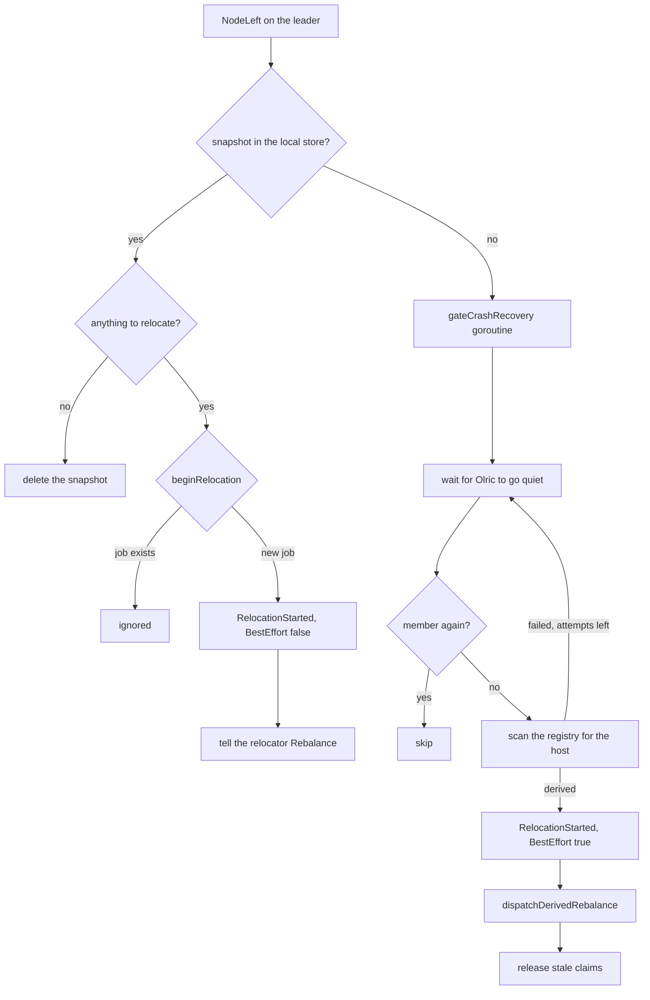
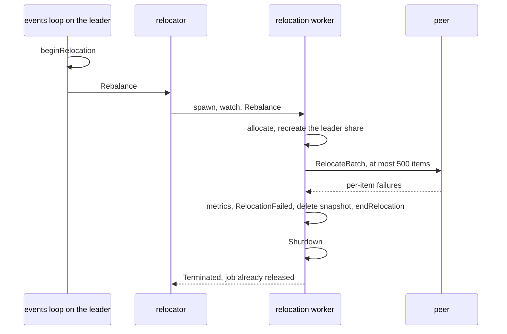

# 21. Clustering: Placement, Singletons and Relocation

## Contents

- [What you will learn](#what-you-will-learn)
- [21.1 Placement with `SpawnOn`](#211-placement-with-spawnon)
- [21.2 One name in the whole cluster](#212-one-name-in-the-whole-cluster)
- [21.3 What relocates](#213-what-relocates)
- [21.4 Cluster singletons](#214-cluster-singletons)
- [21.5 Singleton races, crashes and leadership](#215-singleton-races-crashes-and-leadership)
- [21.6 What every node does on `NodeLeft`](#216-what-every-node-does-on-nodeleft)
- [21.7 Crash: deriving the relocation set from the registry](#217-crash-deriving-the-relocation-set-from-the-registry)
- [21.8 Graceful leave: the peer-state snapshot](#218-graceful-leave-the-peer-state-snapshot)
- [21.9 The relocator and its workers](#219-the-relocator-and-its-workers)
- [21.10 Inside one relocation](#2110-inside-one-relocation)
- [21.11 Grain relocation](#2111-grain-relocation)
- [21.12 The handoff window](#2112-the-handoff-window)
- [21.13 Restart in place](#2113-restart-in-place)
- [Guarantees](#guarantees)
- [Implementation details (may change)](#implementation-details-may-change)
- [Behaviours to know](#behaviours-to-know)

## What you will learn

- How `SpawnOn` chooses a node, what each placement strategy costs, and what travels to the chosen node.
- How one name stays unique across the cluster, and when a name held by a dead node can be taken over.
- Which actors and grains are recreated when their node leaves, and which are lost with it.
- Where a cluster singleton runs, how concurrent callers converge on one instance, and what moves it.
- What every node does on `NodeLeft`, and how the leader relocates a departed node after a graceful leave and after a crash.
- How the relocator, its workers and the `RelocateBatch` handler split, send and recreate the work, and how failures are counted.
- What the handoff window hides from senders, and why `SendSync` waits while `SendAsync` fails with `ErrRelocationInProgress`.

Source files: `actor/spawn.go`, `actor/spawn_option.go`, `actor/cluster_singleton.go`, `actor/cluster_singleton_option.go`, `actor/relocator.go`, `actor/relocation_worker.go`, `actor/relocation_handoff.go`, `actor/pid_companion.go`, the departure, snapshot, crash-recovery and registry-repair code in `actor/actor_system.go`, and the relocation handlers in `actor/remote_server.go` and `actor/grain_engine.go`.

## 21.1 Placement with `SpawnOn`

`Spawn` always creates the actor on the calling node, or on the node named by `WithHostAndPort` ([Chapter 4, §4.1](chap-04.md#41-the-spawn-entry-points)). `SpawnOn` lets the cluster choose. It is the actor system's only balanced-spawn entry point; the standalone client balances with its own `Client.SpawnBalanced` in `client/client.go` ([Chapter 18](chap-18.md)). In order (`actorSystem.SpawnOn` in `actor/spawn.go`):

1. Fail with `ErrActorSystemNotStarted` when the system is not running.
2. Build the spawn config. A reliable-delivery endpoint combined with `WithDataCenter` is rejected ([Chapter 23, §23.14](chap-23.md#2314-cluster-publication-relocation-and-placement)).
3. With `WithDataCenter`, hand over to `spawnOnDatacenter`, which sends a `RemoteSpawn` to a random advertised endpoint of the target data center ([Chapter 22](chap-22.md)).
4. Check the name against the registry with `checkOrdinarySpawnPreconditions` ([§21.2](#212-one-name-in-the-whole-cluster)).
5. Outside a cluster, call `Spawn`.
6. Reject a reliable endpoint that names an explicit peer address (`spawnConfig.rejectReliableRemotePlacement` in `actor/spawn_option.go`).
7. Read the members, the local node included (`cluster.Members` in `internal/cluster/cluster.go`). With no member, call `Spawn`.
8. With `WithRole`, keep only the members that advertise the role; none left is an error, "no nodes with role … found in the cluster" (`actorSystem.filterPeersByRole` in `actor/grain_engine.go`).
9. Pick a member with the placement strategy (`actorSystem.selectPlacementPeer` in `actor/spawn.go`). No member picked means `Spawn` on this node.
10. Otherwise send a `RemoteSpawn` request to the member's remoting port and return a remote PID for the address it answers with.

The strategies (`SpawnPlacement` in `actor/spawn_option.go`; `RoundRobin` is the default set by `newSpawnConfig`):

| Strategy | How the member is chosen | Cost | Source |
|---|---|---|---|
| `RoundRobin` | increments a counter kept in the registry under `ActorsRoundRobinKey` and takes member `(next-1) mod n` | one registry increment; the counter is shared by every node, so the cycle is cluster-wide | `actorSystem.actorsRoundRobinPlacementPeer` in `actor/spawn.go`; `cluster.NextRoundRobinValue` in `internal/cluster/cluster.go` |
| `Random` | uniform over the candidates | none | `actorSystem.selectPlacementPeer` in `actor/spawn.go` |
| `LeastLoad` | asks every candidate for its load in parallel and takes the smallest; the first one wins a tie | one `GetNodeMetric` round trip per candidate; any failure fails the spawn | `actorSystem.leastLoadedPeer` in `actor/grain_engine.go` |
| `Local` | this node, through `Spawn` | none | `actorSystem.selectPlacementPeer` in `actor/spawn.go` |

A node's load is its count of live non-system actors plus its active grains (`actorSystem.getNodeMetricHandler` in `actor/remote_server.go`).

**What travels.** The `RemoteSpawn` request carries the name, the kind, the relocatable flag, the passivation strategy, the dependencies, stashing, reentrancy, the supervisor, the role, an explicit init timeout and the reliable-delivery spec (`actorSystem.SpawnOn` in `actor/spawn.go`). The mailbox does not: it is a Go value, so an actor placed on another node runs on the default mailbox (`WithMailbox` in `actor/spawn_option.go`). The target instantiates the actor from its registered kind, rebuilds the options and calls its own `Spawn`, which runs the full local path of [Chapter 4, §4.2](chap-04.md#42-the-local-spawn-path-step-by-step), registry write included (`actorSystem.remoteSpawnHandler` in `actor/remote_server.go`, covered in [Chapter 17](chap-17.md)). **`SpawnOn` therefore returns only after the registry record exists**, like `Spawn`.

## 21.2 One name in the whole cluster

In a cluster a top-level name identifies one actor across all nodes. Two mechanisms enforce it; [Chapter 20](chap-20.md) covers the registry itself and [Chapter 4, §4.2](chap-04.md#42-the-local-spawn-path-step-by-step) the spawn steps that call them:

1. **A read before the actor is built.** `checkSpawnPreconditions` asks the registry whether the name exists and refuses with `ErrActorAlreadyExists` (`actor/actor_system.go`). Its comment calls this "the first line of the name uniqueness rule, not the whole of it": two spawns can both pass it.
2. **The claim at publication.** `putActorOnCluster` writes the record, and the registry refuses a name another incarnation owns (`actorSystem.putActorOnCluster` in `actor/actor_system.go`). The spawn that loses is rolled back, so it leaves no actor behind.

**A dead owner's claim.** A node that crashed never removed its records. `checkOrdinarySpawnPreconditions` lets a spawn through when the name is held by a node that is no longer a member, and `putActorOnCluster` then writes over that record, fenced by the incarnation it carried (`actorSystem.departedClaim` in `actor/actor_system.go`). `departedClaim` decides:

| Holder of the record | Result |
|---|---|
| nobody | free |
| a node that is not a member | free, the record is written over |
| this node, and the local actor under the name is the incarnation the record names | taken |
| this node, but no such local incarnation (a stopped one whose record is not removed yet) | free, the record is written over |
| a live member | taken |
| a singleton, wherever it runs | taken: a singleton claim is never taken over |
| an owner whose membership cannot be read | taken |

The leader's crash recovery also releases the claims of a crashed node's non-relocatable actors ([§21.7](#217-crash-deriving-the-relocation-set-from-the-registry)), but only once its quiescence gate opens; `departedClaim` makes a spawn that arrives first succeed anyway.

**Lookups.** `getActorRecord` hides a record of a non-relocatable, non-singleton actor whose node has left the membership: `ActorOf` and `ActorExists` report it as not found as soon as the node is gone. Records of relocatable actors and singletons are returned as they are, because with relocation enabled the actor comes back under the same name (`actorSystem.getActorRecord` in `actor/actor_system.go`); [§21.6](#216-what-every-node-does-on-nodeleft) has what that means under `WithoutRelocation`.

## 21.3 What relocates

An actor relocates when it is relocatable, the system has relocation enabled, and the actor is not a system actor. Relocation is on by default (`NewActorSystem` in `actor/actor_system.go`); `WithoutRelocation` turns it off for the whole system (`actor/option.go`).

| Actor | Relocatable | Source |
|---|---|---|
| top-level actor from `Spawn` or `SpawnOn` | yes, unless `WithRelocationDisabled` | `newSpawnConfig` and `WithRelocationDisabled` in `actor/spawn_option.go` |
| child | never: the option is ignored | `PID.buildChildOptions` in `actor/pid.go` |
| function actor | never | `actorSystem.SpawnNamedFromFunc` in `actor/spawn.go` |
| router and its routees | never | `actorSystem.SpawnRouter` in `actor/spawn.go`; `router.spawnRoutees` in `actor/router.go` |
| system actor | never: reserved names are skipped everywhere | `actorSystem.localActors` in `actor/actor_system.go` |
| cluster singleton | yes, through the singleton path ([§21.10](#2110-inside-one-relocation)) | `recreateSingletonFromWire` in `actor/relocation_worker.go` |
| reliable-delivery endpoint | like any actor; its controller never relocates, and a non-relocatable endpoint has its records withdrawn | [Chapter 23, §23.14](chap-23.md#2314-cluster-publication-relocation-and-placement) |

The relocatable flag is a PID state bit (`PID.IsRelocatable` in `actor/pid.go`). It belongs to the actor alone: `WithoutRelocation` only sets the system's `relocationEnabled` flag and leaves the bit, and the registry record, saying "relocatable" ([§21.6](#216-what-every-node-does-on-nodeleft) has what that means after a departure). The flag travels in the actor's wire record with everything a respawn needs: kind, address, incarnation, passivation strategy, dependencies, stashing, role, supervisor, reentrancy, singleton spec, reliable-delivery and reliable-companion specs, and the init timeout only when it was an explicit override (`PID.toSerialize` in `actor/pid.go`). The per-actor settings most actors never set, the singleton spec and the role among them, live in a lazily allocated `pidCompanion` (`actor/pid_companion.go`).

**A relocated actor is a new incarnation.** It is built by a fresh `Spawn` from its kind: `PreStart` runs again, nothing in its memory or its mailbox survives, and its PID carries a new incarnation ID ([§21.10](#2110-inside-one-relocation)).

Grains relocate by their own flags ([§21.11](#2111-grain-relocation)).

## 21.4 Cluster singletons

A cluster singleton is a top-level actor of which the cluster runs one instance under a name. `SpawnSingleton` (`actorSystem.SpawnSingleton` in `actor/spawn.go`):

1. Fails with `ErrActorSystemNotStarted` or `ErrClusterDisabled`.
2. Builds the options (`newClusterSingletonConfig` in `actor/cluster_singleton_option.go`) and trims the role.
3. Runs the attempts below under `retrySpawnSingleton` ([§21.5](#215-singleton-races-crashes-and-leadership)).

Each attempt chooses the host:

- **Without a role**, the cluster coordinator (`actorSystem.spawnSingletonOnLeader` in `actor/cluster_singleton.go`). It reads the members, finds the one marked `Coordinator`, fails with `ErrLeaderNotFound` when none is, spawns locally when the coordinator is this node, and otherwise sends a `RemoteSpawn` carrying the singleton spec and the supervisor.
- **With a role**, the oldest member advertising it, by creation time (`actorSystem.spawnSingletonWithRole` in `actor/spawn.go`). No such member is `errNoRoleMembers`, a retryable error. A remote host gets a `RemoteSpawn` with the spec, the role and the supervisor.

The receiving node does not spawn blindly: `remoteSpawnHandler` calls its own `SpawnSingleton`, which chooses the host again from its own view (`actorSystem.remoteSpawnHandler` in `actor/remote_server.go`).

On the chosen host, `spawnSingletonOnLocal` (`actor/spawn.go`):

1. Falls back to the default singleton supervisor (below).
2. Serialises on the name with `runSpawnActivation`, so concurrent calls on one node share one attempt ([Chapter 4, §4.2](chap-04.md#42-the-local-spawn-path-step-by-step)).
3. Checks the registry with the plain `checkSpawnPreconditions`: a claim held by a departed node fails the check like a live one.
4. Returns a running top-level actor that already holds the name; a holder that is not running refuses with `ErrActorAlreadyExists` (`nameResolver` in `actor/spawn.go`).
5. Builds the PID long-lived, with the singleton spec, the role and the supervisor, and attaches it under the singleton manager, a system actor that only exists in cluster mode (`clusterSingletonManager` and `actorSystem.spawnSingletonManager` in `actor/cluster_singleton.go`). The record is written before the call returns.

**Options.**

| Option | Default | Effect | Source |
|---|---|---|---|
| `WithSingletonRole` | none | host on the oldest member with the role; an empty string is ignored | `WithSingletonRole` in `actor/cluster_singleton_option.go` |
| `WithSingletonSpawnTimeout` | 30 s | bound on the whole retry run; non-positive ignored | `WithSingletonSpawnTimeout` in `actor/cluster_singleton_option.go` |
| `WithSingletonSpawnWaitInterval` | 500 ms | first wait between attempts; later waits grow by a factor of two, with random jitter, capped by the spawn timeout (the exponential backoff of `Retrier.RunContext` in `internal/retry/retry.go`); non-positive ignored | `WithSingletonSpawnWaitInterval` in `actor/cluster_singleton_option.go` |
| `WithSingletonSpawnRetries` | 5 | number of attempts; non-positive ignored | `WithSingletonSpawnRetries` in `actor/cluster_singleton_option.go` |
| `WithSingletonSupervisor` | the default singleton supervisor | travels with a delegated spawn and with relocation; nil ignored | `WithSingletonSupervisor` in `actor/cluster_singleton_option.go` |

The default singleton supervisor stops the actor on a panic, an internal error or a nil panic, one-for-one; the system's default supervisor does not apply. Its comment gives the reason: the singleton lifecycle stays "in the hands of the relocation machinery rather than a local restart loop" (`defaultSingletonSupervisor` in `actor/spawn.go`). A singleton that stops this way is not re-created: nothing but a node departure ever calls the singleton path again ([§21.10](#2110-inside-one-relocation)).

## 21.5 Singleton races, crashes and leadership

**Retry classification.** `spawnSingletonRetryError` sorts every failed attempt (`actor/spawn.go`):

| Error | Outcome |
|---|---|
| `ErrSingletonAlreadyExists`, emitted by hosts of an older version | stop |
| `ErrActorAlreadyExists` | resolved by `handleSingletonNameConflict`, below |
| the caller's context is done | stop with its error |
| a quorum error, `ErrLeaderNotFound`, `ErrEngineNotRunning`, no role member, `ErrRemoteSendFailure`, `ErrRequestTimeout`, `ErrAddressNotFound`, `ErrInvalidResponse`, a deadline, a network timeout, a refused connection | retry |
| anything else | stop |

The leader-delegated entries exist because a coordinator's transient failures come back over the wire as these error values rather than as the locally detected ones; the comment says a node calling `SpawnSingleton` during a rolling restart would otherwise fail terminally (`shouldRetrySpawnSingleton` in `actor/spawn.go`). The final error goes through `cluster.NormalizeQuorumError`.

**A name that is taken.** `handleSingletonNameConflict` reads the registry record (`actor/spawn.go`):

- a singleton of the same kind and role: **success**. This is how a repeated call, and every loser of a race, returns the existing singleton. The address just read is kept so the caller needs no second lookup;
- any other actor, or another singleton: stop with `ErrActorAlreadyExists`;
- no record visible yet: retry, letting the registry catch up;
- a failed read: retry when transient, stop otherwise.

A successful run that produced no PID resolves one with `resolveExistingSingleton`: a live local top-level actor first, then a remote PID from the kept address, then `ActorOf`. A not-found from that last lookup is turned into a plain error, because "a creation call must not tell the caller the actor it just created does not exist" (`actorSystem.resolveExistingSingleton` in `actor/spawn.go`).

**Concurrent callers.** On one node they share one attempt. Across nodes they normally delegate to the same host; when their views of the coordinator differ, the registry claim at publication decides, the loser's actor is rolled back, and its caller's conflict handler turns the `ErrActorAlreadyExists` into success with the winner's address. Fifteen concurrent calls from three nodes end with one instance and one address (see Guarantees).

**A crash or departure of the host.** The singleton is in the departed node's relocation set like any relocatable actor and is always assigned to the leader, which re-establishes it through `SpawnSingleton`, so the placement rule applies again: the new coordinator, or the oldest remaining member with the role ([§21.10](#2110-inside-one-relocation)).

**A call while a crashed host's record stands.** A crashed host leaves the singleton's record behind, and neither a spawn nor a lookup removes it: `departedClaim` never frees a singleton claim, and `getActorRecord` returns a singleton record without checking the membership (`actor/actor_system.go`). A `SpawnSingleton` for the name in that interval fails the registry check with `ErrActorAlreadyExists`; the conflict handler finds a singleton of the same kind and role and turns it into **success with the record's address**, so the caller receives a remote PID on the dead node and sends to it fail. This lasts until the leader's recovery removes the record ([§21.10](#2110-inside-one-relocation)), which is after the quiescence gate of [§21.7](#217-crash-deriving-the-relocation-set-from-the-registry) at the earliest. With `WithoutRelocation` no recovery runs, and only a restart of the node at the same address removes the record ([§21.13](#2113-restart-in-place)). After a graceful leave the record is withdrawn before the node leaves ([§21.8](#218-graceful-leave-the-peer-state-snapshot)), so the name is free in that interval; a singleton spawned under it meanwhile is left alone by the relocation, because its record names a live node.

**A leadership change.** `handleClusterEvent` only publishes `LeaderChanged` (`actor/actor_system.go`). No code moves a running singleton when the coordinator changes; a singleton moves only when its host leaves. With `WithoutRelocation`, it does not move at all: it is lost with its host.

## 21.6 What every node does on `NodeLeft`

Membership events reach the actor system through its cluster events loop, one goroutine ([Chapter 20](chap-20.md)). `handleClusterEvent` ignores events while the system stops or is out of the cluster, publishes `NodeLeft` on the event stream, and calls `handleNodeLeftEvent` (`actor/actor_system.go`). In order:

1. Prune the remote watches pointing at the departed node: local watchers of its actors receive a `Terminated` stamped with the departure time (`actorSystem.pruneRemoteWatchesForNode` in `actor/actor_system.go`).
2. Repair the registry if needed (below). This runs synchronously on the events loop.
3. Trigger data-center reconciliation ([Chapter 22](chap-22.md)).
4. Stop here when relocation is disabled.
5. Open the handoff window for the departed endpoint ([§21.12](#2112-the-handoff-window)). Every node does this, "because any node may route a message to the departed node's actors".
6. On the **leader** (`IsLeader` at the time the event is handled): read the departed node's snapshot from its own store. With a snapshot, start the relocation from it ([§21.8](#218-graceful-leave-the-peer-state-snapshot)); with an empty one, delete it and stop; with none, start crash recovery on its own goroutine ([§21.7](#217-crash-deriving-the-relocation-set-from-the-registry)).
7. On **any other node**, delete its copy of the departed node's snapshot.

The cached remoting port of the departed node is forgotten when the handler returns, except when crash recovery takes it over, because the recovery needs it seconds later (comment in `handleNodeLeftEvent`).

**The remoting-port cache.** A `NodeLeft` carries only the peers address, while actor and grain records name the remoting address. `peerRemotingPorts` maps one to the other; it is seeded from the membership when the cluster starts and refreshed on every `NodeJoined` (`actorSystem.startCluster` and `actorSystem.cachePeerRemotingPorts` in `actor/actor_system.go`). A node this node never saw alive has no entry, and its crash cannot be recovered from the registry.

**Registry repair.** `resyncAfterClusterEvent` re-puts this node's own live actors and grains, so registry entries whose partitions were lost with the departed node come back (`actor/actor_system.go`):

- with a replica count of 1, on every departure;
- with more, only once `replicaCount` distinct nodes have departed within the correlated-departure window, because Olric tolerates at most `replicaCount-1` simultaneous losses; otherwise Olric promotes the backups itself.

The window is `correlatedDepartureWindow`, two minutes, widened to twice the cluster state sync interval when that is longer (`NewActorSystem` in `actor/actor_system.go`); departures are counted in the `recentDepartures` TTL map (`actorSystem.recordDeparture` in `actor/actor_system.go`), and only when the replica count is above 1. The comment on `correlatedDepartureWindow` explains the bias: a window too long costs redundant, idempotent re-puts, one too short can lose entries of actors alive on survivors. The re-put of an actor whose name another incarnation now owns is skipped; any other failure ends the actor pass, logged (`actorSystem.resyncActors` in `actor/actor_system.go`). Repair does not touch the departed node's own actors; relocation does.

**With `WithoutRelocation`.** Steps 1 to 3 still run, then the handler returns: no handoff window, no snapshot read, no crash recovery, no release of claims. What happens to the departed node's names depends on how it left:

| Departure | Records | Lookups | Spawning the name again |
|---|---|---|---|
| graceful leave | withdrawn by `cleanupCluster` before the node leaves ([§21.8](#218-graceful-leave-the-peer-state-snapshot)); no snapshot is built | not found | free |
| crash, non-relocatable actor | left behind | hidden by `getActorRecord`: not found | free through `departedClaim` |
| crash, actor with the relocatable bit | left behind | returned as they are: a remote PID on the dead node, sends fail | free through `departedClaim` |
| crash, singleton | left behind | a remote PID on the dead node | taken: `Spawn` fails with `ErrActorAlreadyExists`, `SpawnSingleton` returns the dead address as success ([§21.5](#215-singleton-races-crashes-and-leadership)) |

Apart from a spawn that takes a name over, only a restart of the node at the same address cleans up after a crash, and it respawns relocatable actors whatever the relocation setting ([§21.13](#2113-restart-in-place)).

## 21.7 Crash: deriving the relocation set from the registry

With no snapshot in its store, the leader runs `gateCrashRecovery` on a new goroutine, so the events loop never waits (`actor/actor_system.go`). In order:

1. **Wait for Olric to go quiet.** After a crash Olric keeps promoting backups and moving fragments; scanning or respawning meanwhile reads inconsistent replicas. `awaitRelocationQuiescence` waits until no partition rebalance has been seen for 3 s, polling every 200 ms, and proceeds anyway after 30 s. A stopping system abandons the recovery.
2. **Skip a transient departure.** If the node is a member again, nothing is relocated: its actors never left it, and relocating them would create second instances (`actorSystem.isPeerAlive` in `actor/actor_system.go`). A failed membership read counts as "gone".
3. **Derive the set** with `deriveRelocationSetFromRegistry`. On failure, retry the whole quiesce-then-derive cycle, at most four attempts five seconds apart, then give up with an error log; nothing is published and no claim is released. A missing cached port fails every attempt the same way. A system that stopped under a failed attempt abandons the recovery.
4. Check the stop flag and the membership once more: the scan can take a while.
5. **Publish `RelocationStarted` with `BestEffort` true**, even for an empty set, which on a crash "is suspicious rather than benign" (`RelocationStarted` in `actor/messages.go`).
6. **Dispatch** through `dispatchDerivedRebalance`: skip an empty set, register the job with `beginRelocation`, tell the relocator.
7. **Release the stale claims** of the node's non-relocatable actors (`actorSystem.releaseStaleClaims` in `actor/actor_system.go`): one fenced `RemoveActor` each, at most ten at a time. A name that another incarnation took meanwhile is left alone; a failed removal is only logged, since the next spawn of the name takes the claim over anyway ([§21.2](#212-one-name-in-the-whole-cluster)). This runs after the dispatch so the claims never delay the recreation of relocatable actors.

At the end the goroutine forgets the cached port, unless the node rejoined (`actorSystem.forgetPeerUnlessRejoined` in `actor/actor_system.go`).

**The derivation** (`actorSystem.deriveRelocationSetFromRegistry` in `actor/actor_system.go`):

1. Resolve the remoting port from the cache; without it, fail.
2. Scan the registry for the actors and the grains of that host and port (`ActorsByHost` and `GrainsByHost`), with a budget of the configured cluster read timeout or one minute, whichever is longer: the comment on `relocationDeriveScanTimeout` in `actor/relocation_worker.go` says a lookup-sized timeout cannot scan thousands of records, and a timed-out scan abandons the rebalance, losing every actor of the node.
3. Skip reserved names.
4. Keep relocatable actors and non-relocatable reliable endpoints, keyed by name. For any other actor, record a claim to release, except for a singleton or a record without an incarnation ID, which cannot be fenced.
5. Keep every grain, keyed by identity; the worker sorts them by their flags.

With a replica count of 1, the partitions the crashed node owned are gone, so the set can be incomplete; `setupCluster` warns about that at start (`actor/actor_system.go`).

## 21.8 Graceful leave: the peer-state snapshot

A node that stops gracefully hands its relocation set to its peers before it leaves ([Chapter 3, §3.5](chap-03.md#35-stop) has the whole shutdown order):

1. **Build.** After the shutdown hooks and the stop of the data-center controller, and before any user actor stops, `preShutdown` builds a `PeerState`: host, peers port, remoting port, every relocatable actor that is running and not stopping (keyed by its address string), and every active grain whatever its flags (keyed by identity). Actors already being stopped are left out so a deliberately stopped actor is not resurrected elsewhere. With relocation disabled or no cluster it builds nothing. If any actor or grain fails to serialise, there is no snapshot at all and the error is returned by `Stop` (`actorSystem.preShutdown` and `actorSystem.shutdown` in `actor/actor_system.go`).
2. **Stop** the user actors, the singleton manager, the relocator, the dead-letter and death-watch actors, then the grains, then the remaining system actors.
3. **Persist** the snapshot, when there is one, to the peers (`actorSystem.persistPeerStateToPeers` in `actor/actor_system.go`). The peers (this node excluded) are ordered oldest first, because the oldest are the likeliest leaders (comment on `selectOldestPeers`), and tried in groups of three (`defaultReplicationFactor`). `actorSystem.replicatePeerState` sends to the whole group in parallel and collects the answers:
   - two acknowledgements (`defaultReplicationQuorum`) end the group at once and cancel the sends still in flight;
   - when every send has answered with fewer, one acknowledgement is accepted as partial success;
   - when the shutdown context ends first, the group succeeds if one peer acknowledged and fails otherwise;
   - when every peer of the group answered that it is leaving itself (`isPeerLeaving`: `ErrRemotingDisabled`, `ErrClusterDisabled`, a refused or reset connection, an end of file, a closed duplex session; a timeout does not count), the next group is tried;
   - otherwise, with no acknowledgement, the group fails with the last error and no further group is tried.

   Every listed peer leaving is not an error. A failure here is logged and returned by `Stop`, and the shutdown carries on.
4. **Withdraw** this node's registry records (`actorSystem.cleanupCluster` in `actor/actor_system.go`), for every non-system actor listed when the shutdown began: each removal is fenced by the actor's incarnation, so a record another incarnation owns stays; a reliable endpoint's controller record is removed with it; and each grain record is released while it still names this node. The removals run in parallel under one `errgroup` whose context the first failure cancels, so one failed removal can cut the others short. Failures are logged, never returned: a leftover record names a node that is leaving, and lookups and spawns already cope with such records (comment on `shutdownCluster`).
5. **Leave** the membership (`cluster.Stop`), then close the local store.

A peer stores the snapshot in its own local store, a BoltDB file (`actorSystem.persistPeerStateHandler` in `actor/remote_server.go`; `NewBoltStore` in `internal/cluster/boltdb_store.go`), not in the registry; a peer whose remoting or clustering is already off refuses it with `ErrRemotingDisabled` or `ErrClusterDisabled`. The records are normally withdrawn before the node leaves, so the relocation that follows finds no record to release and respawns directly ([§21.10](#2110-inside-one-relocation)).

On `NodeLeft` the leader reads **its own store** (`actorSystem.handleNodeLeftEvent` in `actor/actor_system.go`):

| What the leader's store holds | Leader action |
|---|---|
| no snapshot (it never reached the leader) | the crash path of [§21.7](#217-crash-deriving-the-relocation-set-from-the-registry) |
| a snapshot with no actor and no grain | delete it and stop, so a stale empty snapshot cannot later suppress crash recovery of a node that rejoins at the same address (comment in `handleNodeLeftEvent`) |
| a snapshot whose address already has a job in flight | ignore the event |
| any other snapshot | register the job with `beginRelocation`, publish `RelocationStarted` with `BestEffort` false, tell the relocator `Rebalance`; a failed tell releases the job but leaves the snapshot and the published event |

The snapshot stays in the store while the relocation runs; the worker deletes it when it finishes, and an abort deletes it too ([§21.9](#219-the-relocator-and-its-workers)).

## 21.9 The relocator and its workers

**One job per departed address.** `beginRelocation` registers a job in `relocationJobs`, keyed by the departed peers address and holding the snapshot, and refuses a second one while it is in flight; `endRelocation` releases it (`actor/actor_system.go`). A duplicate `NodeLeft` is ignored, and an address that departs again after its relocation completed is relocated again. A failed tell to the relocator releases the job at once. Shutdown drops every job (`actorSystem.shutdownCluster` in `actor/actor_system.go`).

**The relocator** is a long-lived system actor under the system guardian, spawned only with clustering and relocation both enabled (`actorSystem.spawnRelocator` in `actor/actor_system.go`). Its mailbox is the queue of departures, "so a burst of node departures never blocks the cluster events loop". It restarts on a panic or a rebalancing error and resumes on an internal or spawn error.

On `Rebalance`, `relocator.startWorker` (`actor/relocator.go`):

1. Names a worker `GoAktRelocationWorker-<n>` from a sequence, so a re-departed address gets a new name.
2. Spawns it as a long-lived system child whose supervisor stops it on a panic rather than restarting it. The comment explains: the `Rebalance` it was processing is gone with its mailbox, so a restarted worker would sit idle while the job blocks every retry for that address.
3. On spawn failure, aborts the relocation.
4. Watches it, records the job it owns, and tells it `Rebalance`.

There is no per-address check here: `beginRelocation` already gates dispatch, so every `Rebalance` is a new job.

**A worker that dies.** The worker does all its bookkeeping, outcome event, snapshot deletion and `endRelocation`, before it stops. So when its `Terminated` arrives, `relocator.handleTerminated` finds the registered job only if the worker died abnormally. It compares the snapshot **pointer**: local tells pass messages by reference, so the registered snapshot is the very one the worker held, and a stale `Terminated` cannot abort a newer job for the same address (`workerJob` in `actor/relocator.go`).

**Abort.** `relocator.abortRelocation` reports the loss with the shared abort rule, deletes the snapshot and releases the job. The rule (`actorSystem.reportAbortedRelocation` in `actor/actor_system.go`), also used when the worker cannot read the peers:

- every actor in the set is a failure;
- an eager grain is a failure, unless it is also relocation-disabled;
- a lazy or relocation-disabled grain has its registry entry released, within a 30 s budget shared by all of them, and is a failure only when that release fails.

It publishes one `RelocationFailed` and records the metrics.

## 21.10 Inside one relocation

`relocationWorker.relocate` (`actor/relocation_worker.go`) runs on the leader. In order:

1. Build two keys: the job key, `host:peersPort` in the form `NodeLeft` uses, and `departedNode`, `host:remotingPort` in the unbracketed form actor and grain addresses use (the comment notes that bracketing IPv6 hosts would break every comparison).
2. On a stopping system, release the job and return.
3. Read the peers, this node excluded. A failure aborts with the shared rule ([§21.9](#219-the-relocator-and-its-workers)).
4. Split the grains into relocatable and relocation-disabled ones (`relocatableGrains` in `actor/relocation_worker.go`).
5. When there are actors, read every node's actor count in one registry scan to seed placement (`relocationWorker.targetLoads` in `actor/relocation_worker.go`). The departed node's own records match no target. A failed scan only disables load awareness.
6. **Allocate the actors** over the targets, index 0 being the leader and index `i` peer `i-1` (`allocateActors` in `actor/relocation_worker.go`). Singletons always go to the leader, because the singleton path re-arbitrates their placement. Every other actor goes to the least-loaded target that advertises its role, counting the seeded load plus what this allocation has added; ties go to the lower index. An actor no target can host is unplaceable.
7. **Allocate the grains** (`allocateGrainsByRole` in `actor/relocation_worker.go`). Grains without a placement role split evenly, the leader taking the remainder and the first chunk (`allocateGrains`). An eager grain with an activation role then goes to the target advertising it that holds the fewest grains in this allocation, ties to the lower index, or is unplaceable (`grainPlacementRole`).
8. Record every unplaceable actor and grain as a failure.
9. Under one errgroup limited to ten goroutines (`defaultRelocationConcurrency` in `actor/relocator.go`): release the registry entries of relocation-disabled grains; recreate the leader's share locally; and send each peer its share on its own goroutine.
10. Wait, compute relocated as handled minus failed, record the metrics, and publish one `RelocationFailed` listing exactly the failed actors and grains, if any.
11. `relocationWorker.finish`: delete the snapshot and release the job.

**A peer's share.** `buildRelocateBatchRequests` cuts a share into requests of at most 500 actors, then requests of at most 500 grains (`defaultRelocationBatchSize`), "so a batch stays far below the transport's max frame size". `relocationWorker.sendBatches` sends them in order; each request gets two attempts with a 100 ms to 1 s backoff, and each attempt is bounded by 30 s, because the relocation context carries no deadline of its own and a black-holed target would otherwise stall the whole rebalance (`relocationBatchSendTimeout` in `actor/relocation_worker.go`). Per-item failures reported by the peer are merged.

**An unreachable peer.** `relocationWorker.sendBatches` stops at the first batch that fails both attempts and returns it with every batch after it; the batches the peer accepted before stay done, their per-item failures merged. `relocationWorker.relocateShare` redistributes that unsent remainder:

| Item | Goes to |
|---|---|
| actor | the remaining survivor with its role that has been handed the fewest actors so far, ties to the lower index; else the leader if the leader has the role; else a failure (`reassignByRole`) |
| eager grain with a role | the remaining survivor with the role that has been handed the fewest grains so far; else the leader if eligible; else a failure |
| other grain | round-robin over the remaining survivors, or the leader when none is left |

The leader's part is recreated locally. Each survivor's part is sent once; if that fails too, its actors and eager grains are failures (`recordUnsent`) and its lazy grains are released from the leader (`relocationWorker.releaseUndeliverableLazyGrains`).

**On the peer.** `relocateBatchHandler` refuses the batch when remoting or clustering is off, applies the propagated context and deadline, runs the same `enqueueRelocation` as the leader under a limit of ten, and answers with the per-item failures (`actor/remote_server.go`). Leader and peers share one dispatch rule, so they "cannot drift".

**One item.** `enqueueRelocation` (`actor/relocation_worker.go`) gives each item up to three attempts, 500 ms apart times the attempt number (`retryRelocationItem`), because registry operations time out while the cluster digests the loss and a failure report is final:

- a singleton goes through `recreateSingletonFromWire`, any other actor through `recreateActorFromWire`;
- a lazy grain is released, an eager grain recreated ([§21.11](#2111-grain-relocation)).

`recreateActorFromWire` (`actor/spawn.go`), in order:

1. Skip reserved names and singletons.
2. A non-relocatable actor is never respawned. A non-relocatable reliable endpoint has its endpoint and controller records withdrawn; any other one is left untouched ([Chapter 23, §23.14](chap-23.md#2314-cluster-publication-relocation-and-placement)).
3. **Release the departed entry** (`actorSystem.releaseDepartedEntry` in `actor/spawn.go`). A record pointing at another node means the actor already exists there: skip it. Otherwise remove it, fenced by the incarnation read; a record taken by another incarnation meanwhile is skipped the same way. A missing record proceeds.
4. Release a reliable endpoint's departed controller record.
5. Instantiate the actor from its kind and rebuild its options from the record (`actorSystem.wireSpawnOptions` in `actor/spawn.go`).
6. **Spawn** with `spawnRelocatedActor`. A spurious `ErrActorAlreadyExists` from a backup replica that has not applied the delete is answered by re-checking the entry and retrying, up to five attempts 100 ms apart; a name genuinely owned by a live node ends the retry with success, since the actor is not lost.
7. If any of steps 5 and 6 fails, **restore the departed record** (`actorSystem.restoreDepartedEntry` in `actor/spawn.go`): it is the actor's only remaining recovery source. A name another incarnation owns by then is left to it.

`recreateSingletonFromWire` (`actor/relocation_worker.go`) gates the same way, then calls `SpawnSingleton` with the record's timeout, interval, retries, role and supervisor, so a singleton is placed by [§21.4](#214-cluster-singletons), not by the allocation. It restores nothing on failure.

## 21.11 Grain relocation

Grains are covered in Chapters [13](chap-13.md) and [14](chap-14.md); on departure, each grain follows its own flags:

| Grain | On departure | Source |
|---|---|---|
| default (lazy) | its registry entry is released if it still names the departed node; the grain is activated again on its next message | `actorSystem.releaseGrainForLazyRelocation` in `actor/grain_engine.go` |
| `WithGrainEagerRelocation` | reactivated at once on its target, after its entry is released; an entry naming another node means it is already active there | `actorSystem.recreateGrainFromWire` in `actor/grain_engine.go` |
| `WithGrainDisableRelocation` | never recreated; its entry is released by the leader so the next message activates it afresh | `relocatableGrains` in `actor/relocation_worker.go` |

`WithGrainEagerRelocation` and `WithGrainDisableRelocation` are mutually exclusive: configuring both fails validation with `ErrGrainRelocationConflict` (`WithGrainEagerRelocation` in `actor/grain_option.go`). Only an eager grain is constrained by its `WithActivationRole`: a lazy grain's relocation is a release any node can perform, and its next activation applies whatever options its caller supplies (`grainPlacementRole` in `actor/relocation_worker.go`). Releases go through `cluster.ReleaseGrain`, which deletes the record only while it names the given node (`internal/cluster/cluster.go`). A lazy grain counts as relocated unless its release fails.

## 21.12 The handoff window

While a relocation runs, a name can still resolve to the departed node, or briefly to nothing between the removal of its record and the respawn. The handoff window hides that from name-based sends. It opens only on `NodeLeft`: after a graceful leave the records are withdrawn before the node leaves the membership ([§21.8](#218-graceful-leave-the-peer-state-snapshot)), and a send in that interval meets a not-found that is masked only if another departure's window happens to be open.

**The window.** `relocatingEndpoints` is a TTL map of remoting endpoints with a TTL of `relocationHandoffWindow`, three seconds (`NewActorSystem` in `actor/actor_system.go`). On `NodeLeft`, every node with relocation enabled adds the departed endpoint, using the cached remoting port; with no cached port it adds nothing (`actorSystem.markEndpointRelocating` in `actor/relocation_handoff.go`). A `NodeJoined` at the same peers address deletes it early, so a node that restarted in place is not stalled (`actorSystem.markEndpointRecovered` in `actor/relocation_handoff.go`). `relocationInFlight` asks the map for its **active** entries, not its length: entries are only evicted on a write, and a length check would read true forever after the first departure (comment on `actorSystem.relocationInFlight`).

**`SendSync`** uses `PID.deliverAcrossHandoff` (`actor/relocation_handoff.go`). It resolves the name once; outside a cluster it delivers at once. Otherwise it loops:

| Resolution | Action | Bound | Error when the bound is reached |
|---|---|---|---|
| a remote PID on an endpoint in its window | wait and resolve again; never dial the dead host | the window, or the caller's timeout when shorter | `ErrRelocationInProgress` |
| any other PID | deliver once, within what is left of the caller's timeout | the caller's timeout | the delivery's own error |
| a retryable error while some window is active | wait and resolve again | 500 ms from the first such error, or the caller's timeout when shorter (`relocationNotFoundMaskWindow`) | that error |
| anything else | fail at once | none | that error |

Retryable errors are `ErrActorNotFound`, `ErrAddressNotFound`, `ErrRemoteSendFailure`, `ErrRequestTimeout`, `ErrRelocationInProgress`, a deadline, a refused connection and a network timeout (`isHandoffRetryable` in `actor/relocation_handoff.go`). Waits start at 50 ms and double up to 300 ms, never past the bound (`sleepWithinHandoff`). The short not-found bound keeps a name that never existed fast to fail during someone else's relocation. The caller's timeout covers the masking and the delivery together, so a masked `SendSync` with a two-second timeout does not block for four. The first wait of a send counts once in `actorsystem.relocation.buffered.count` (`actorSystem.recordRelocationHandoff` in `actor/actor_system.go`).

**`SendAsync`** uses `PID.deliverBypassingHandoff` (`actor/relocation_handoff.go`): one resolution, and a remote PID on an endpoint in its window fails at once with **`ErrRelocationInProgress`**, "a retryable signal" rather than a connection error. It never sleeps, because it also backs `ReceiveContext.SendAsync` inside actor turns (`PID.SendAsync` in `actor/pid.go`). Both send paths then fall back to other data centers on `ErrActorNotFound` ([Chapter 5, §5.8](chap-05.md#58-sending-by-name)).

The window applies only to these two by-name sends. `Tell` and `Ask` on a PID already held are not masked.

## 21.13 Restart in place

A node that crashes and restarts at the same address before the cluster notices never produces a `NodeLeft`. When its cluster starts, after the events loop is running, `cleanupStaleLocalActors` scans the registry for records of this actor system's name at this node's remoting address that have no local PID (`actor/actor_system.go`). Reserved names are skipped, except reliable controllers:

- a relocatable, non-singleton actor that is not a reliable controller is respawned here with `recreateActorFromWire`, as crash relocation would have done on a survivor;
- any other record, singletons, non-relocatable actors and reliable controllers included, is removed, fenced by incarnation.

The scan reads the actor's relocatable bit from its record and does not consult `relocationEnabled`, so it respawns under `WithoutRelocation` too. It is best effort: errors are logged and never fail the start.

## Guarantees

| Statement | Enforced by |
|---|---|
| Two nodes spawning one name at once, both past the registry check: exactly one succeeds, the other gets `ErrActorAlreadyExists` and leaves no actor, a third node resolves the winner, and every node reports the name as existing | `TestSpawn` in `actor/spawn_test.go` |
| `SpawnOn` with `LeastLoad` places the actor on the least-loaded node; with a role no member advertises it fails; a failed round-robin increment fails it | `TestSpawn` in `actor/spawn_test.go` |
| An actor placed by `SpawnOn` with `Local` placement is resolvable and reachable from another node as soon as `SpawnOn` returns | `TestSpawnOnImmediateCrossNodeVisibility` in `actor/spawn_test.go` |
| Fifteen concurrent `SpawnSingleton` calls from three nodes all succeed, return one address, and leave exactly one live instance | `TestConcurrentSpawnSingletonSingleInstance` in `actor/cluster_singleton_test.go` |
| Spawning an existing singleton again succeeds; two singletons of one kind under different names both resolve | `TestSingletonActor` in `actor/cluster_singleton_test.go` |
| A singleton name held by another actor or another singleton fails with `ErrActorAlreadyExists`; a record not yet visible is retried; transient errors are retried within the budget; no role member is an error after the retries | `TestSpawnSingletonRetryBehavior` in `actor/cluster_singleton_test.go` |
| The default singleton supervisor stops on panics and internal errors; a custom supervisor survives delegation to the role host | `TestSingletonSupervisor` in `actor/cluster_singleton_test.go` |
| After a graceful leave, relocatable actors are recreated on a survivor, keep their reentrancy settings, and are reachable by name | `TestRelocation` in `actor/relocator_test.go` |
| A singleton is re-established on a live node after its host leaves | `TestRelocationWithSingletonActor` in `actor/relocator_test.go` |
| A role-constrained actor is relocated only to a node advertising its role | `TestRelocationWithActorRole` in `actor/relocator_test.go` |
| After a graceful leave, a non-relocatable actor, or any actor under `WithoutRelocation`, no longer resolves and a send to it fails | `TestRelocationWithActorRelocationDisabled` and `TestRelocationWithSystemRelocationDisabled` in `actor/relocator_test.go` |
| Grains of a departed node can be addressed again on survivors | `TestGrainsRelocation` in `actor/relocator_test.go` |
| One relocation job per address: a second `beginRelocation` is refused until `endRelocation` | `TestBeginEndRelocation` in `actor/actor_system_test.go` |
| An abnormal worker death aborts the job: one `RelocationFailed` lists the actor and the eager grain, the snapshot is deleted, the job released; a `Terminated` after normal completion, or a stale one for a re-registered address, does nothing | `TestRelocatorTerminatedAbortsInflightJob`, `TestRelocatorTerminatedAfterNormalCompletionIsNoOp` and `TestRelocatorStaleTerminatedDoesNotAbortNewerJob` in `actor/relocator_test.go` |
| `RelocationFailed` lists exactly the failed items, not the skipped non-relocatable ones | `TestRelocationWorkerPartialFailureListsExactlyFailedItems` in `actor/relocation_worker_test.go` |
| The abort rule: actors and eager grains fail, lazy and disabled grains (an eager one included) are released and not reported | `TestReportAbortedRelocation` in `actor/relocation_worker_test.go` |
| Lazy grains and relocation-disabled grains are released, not recreated, and not reported | `TestRelocationWorkerReleasesLazyGrains` and `TestRelocationWorkerReleasesPinnedGrains` in `actor/relocation_worker_test.go` |
| An unreachable peer's share is redelivered to another survivor | `TestRelocationWorkerReassignsShareOnPeerFailure` in `actor/relocation_worker_test.go` |
| A batch carries at most 500 items | `TestBuildRelocateBatchRequestsChunksLargeShares` in `actor/relocation_worker_test.go` |
| Allocation sends singletons to the leader, honours roles, reports unplaceable actors, and follows seeded loads | `TestAllocateActorsRoleAware` and `TestAllocateActorsLoadAware` in `actor/relocation_worker_test.go` |
| A singleton whose entry already names a survivor is neither torn down nor respawned | `TestRecreateSingletonFromWireSkipsWhenAlreadyRelocated` in `actor/relocation_worker_test.go` |
| A failed respawn restores the departed record; an ordinary non-relocatable record is not touched; an entry naming another node or another incarnation is skipped | `TestRecreateActorFromWireRestoresRecordOnFailure`, `TestRecreateActorFromWireNonRelocatableOrdinaryActorUntouched` and `TestReleaseDepartedEntryBranches` in `actor/spawn_test.go` |
| An item is retried a bounded number of times and stops on cancellation | `TestRetryRelocationItem` in `actor/relocation_worker_test.go` |
| Crash recovery skips a node that is a member again, before or after the scan | `TestGateCrashRecoverySkipsRejoinedNode` and `TestGateCrashRecoverySkipsNodeRejoinedDuringDerivation` in `actor/actor_system_test.go` |
| A failed derivation is retried and given up after the maximum attempts | `TestGateCrashRecoveryRetriesDerivation` and `TestGateCrashRecoveryGivesUpAfterMaxAttempts` in `actor/actor_system_test.go` |
| Crash recovery releases the stale claims and publishes `RelocationStarted` even with nothing to relocate; a rejoined node keeps its claims | `TestGateCrashRecoveryReleasesStaleClaims` and `TestGateCrashRecoveryKeepsClaimsOfRejoinedNode` in `actor/actor_system_test.go` |
| The derived set holds relocatable actors and non-relocatable reliable endpoints; other actors become claims, except singletons and unfenced records; no cached port means no set | `TestDeriveRelocationSetFromRegistry` in `actor/actor_system_test.go` |
| A name held by a departed node, or by a stopped local incarnation, is free; one held by a live member, a singleton, or an unreadable owner is taken | `TestDepartedClaim` in `actor/actor_system_test.go` |
| Registry repair is skipped with replicas, runs without, and runs once `replicaCount` nodes depart within the window | `TestResyncAfterClusterEventSkipsWithReplicas`, `TestResyncAfterClusterEventRunsWithoutReplicas` and `TestResyncAfterClusterEventRunsOnCorrelatedDepartures` in `actor/actor_system_test.go` |
| Snapshot replication returns at quorum, accepts partial success, and moves to younger peers only when the oldest are leaving | `TestPersistPeerStateToPeers` in `actor/actor_system_test.go` |
| `SendSync` waits for a target on a departing endpoint to re-register, masks not-found only while a relocation is in flight, returns `ErrRelocationInProgress` when the window closes, and keeps within the caller's timeout | `TestDeliverAcrossHandoff` in `actor/relocation_handoff_test.go` |
| `SendAsync` fails at once with `ErrRelocationInProgress` on a departing endpoint, without sleeping | `TestDeliverBypassingHandoff` in `actor/relocation_handoff_test.go` |
| The window is opened for the cached remoting endpoint and closed when the node rejoins | `TestRelocatingEndpointTracking` in `actor/relocation_handoff_test.go` |
| On restart in place, relocatable actors of the previous incarnation are respawned and singleton records removed | `TestCleanupStaleLocalActors` in `actor/actor_system_test.go` |

## Implementation details (may change)

- Handoff: the three-second window, 50 ms to 300 ms backoff, the 500 ms not-found bound.
- Crash recovery: 3 s quiet window, 200 ms poll, 30 s maximum wait, four derivation attempts five seconds apart, a scan budget of at least one minute.
- Relocation: 500-item batches, two attempts per batch with a 100 ms to 1 s backoff, 30 s per attempt, three attempts per item 500 ms apart times the attempt, five respawn attempts 100 ms apart, ten concurrent operations per relocation and per batch handler, a 2 s fallback for the load scan, a 30 s budget for the abort cleanup.
- Snapshot replication to groups of three peers with a quorum of two.
- The two-minute correlated-departure window.
- Singleton defaults: 30 s, 500 ms, five attempts.
- Worker names `GoAktRelocationWorker-<n>`; one worker per departed node, stopped after one rebalance.
- The snapshot keys actors by address string, the derived set by name.

## Behaviours to know

| Behaviour | Source |
|---|---|
| `RoundRobin`, `Random` and `LeastLoad` can choose the calling node; it then receives a `RemoteSpawn` from itself and the caller gets a remote PID | `actorSystem.SpawnOn` in `actor/spawn.go` |
| `Local` with `WithRole` spawns here even when this node lacks the role, as long as some member has it | `actorSystem.SpawnOn` in `actor/spawn.go` |
| `LeastLoad` fails the whole spawn if one candidate does not answer | `actorSystem.leastLoadedPeer` in `actor/grain_engine.go` |
| A custom mailbox is lost by remote placement and by relocation | `WithMailbox` in `actor/spawn_option.go` |
| Children, function actors and routers never relocate, whatever their options | `PID.buildChildOptions` in `actor/pid.go`; `actorSystem.SpawnNamedFromFunc` and `actorSystem.SpawnRouter` in `actor/spawn.go` |
| A relocated actor starts from scratch: `PreStart` again, empty state, empty mailbox, new incarnation | `actorSystem.recreateActorFromWire` in `actor/spawn.go` |
| A singleton that stops while its host stays in the cluster is not re-created; a coordinator change does not move it | `defaultSingletonSupervisor` in `actor/spawn.go`; `actorSystem.handleClusterEvent` in `actor/actor_system.go` |
| A singleton claim is never written over by a spawn, even when its node is gone | `actorSystem.departedClaim` in `actor/actor_system.go` |
| After a crash, a non-relocatable actor reads as not found at once; one with the relocatable bit, or a singleton, keeps resolving to the dead node until it is recreated, which under `WithoutRelocation` never happens | `actorSystem.getActorRecord` in `actor/actor_system.go` |
| With `WithoutRelocation`, a departure opens no handoff window, reads no snapshot, starts no crash recovery and releases no claim; a crashed node's non-singleton names are still reusable through `departedClaim`, its singleton names are not | `actorSystem.handleNodeLeftEvent` and `actorSystem.departedClaim` in `actor/actor_system.go` |
| `SpawnSingleton` for a name whose record still names a crashed host succeeds and returns a remote PID on the dead node | `actorSystem.handleSingletonNameConflict` in `actor/spawn.go` |
| At a graceful leave, one failed registry removal cancels the context of the removals still running | `actorSystem.cleanupCluster` in `actor/actor_system.go` |
| A failed snapshot hand-off, or an actor that cannot be serialised, makes `Stop` return an error, but the node still stops | `actorSystem.shutdown` and `actorSystem.shutdownCluster` in `actor/actor_system.go` |
| Crash recovery cannot start before three quiet seconds and can wait 30 s or more | `actorSystem.awaitRelocationQuiescence` in `actor/actor_system.go` |
| Only the leader's own store counts for the snapshot; the other nodes delete their copies on `NodeLeft` | `actorSystem.handleNodeLeftEvent` in `actor/actor_system.go` |
| A crash of a node this leader never saw alive is not recovered: there is no cached port to scan for | `actorSystem.deriveRelocationSetFromRegistry` in `actor/actor_system.go` |
| `RelocationStarted` with `BestEffort` true is published even for an empty set | `actorSystem.gateCrashRecovery` in `actor/actor_system.go` |
| `SendSync` may wait up to three seconds during a relocation; `SendAsync` fails with `ErrRelocationInProgress`; `Tell` and `Ask` on a held PID are not masked | `PID.deliverAcrossHandoff` and `PID.deliverBypassingHandoff` in `actor/relocation_handoff.go` |
