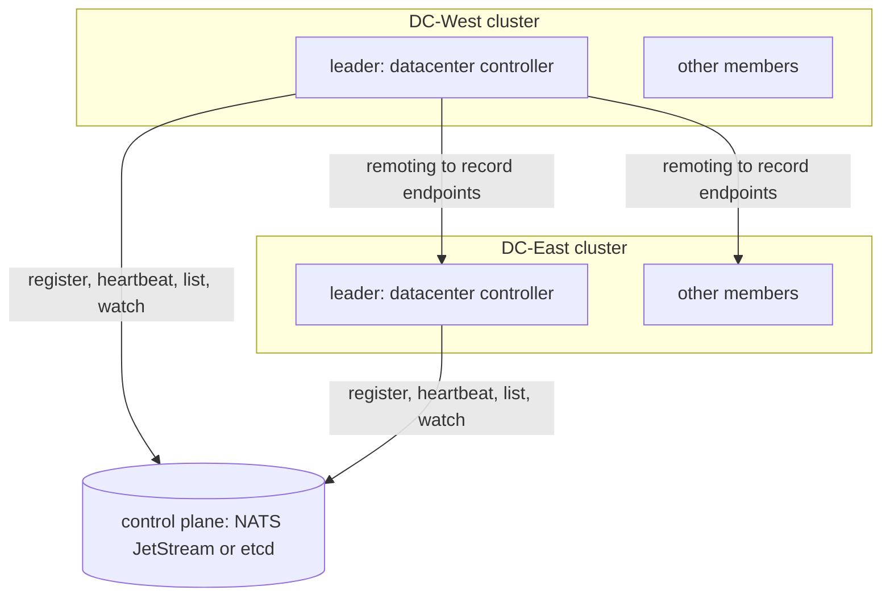
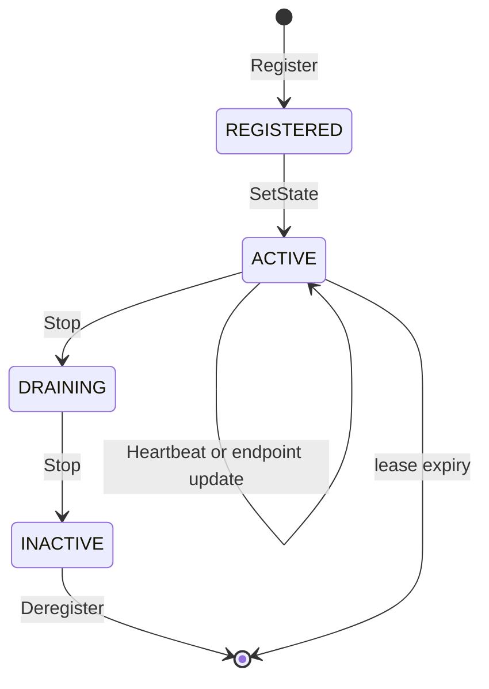
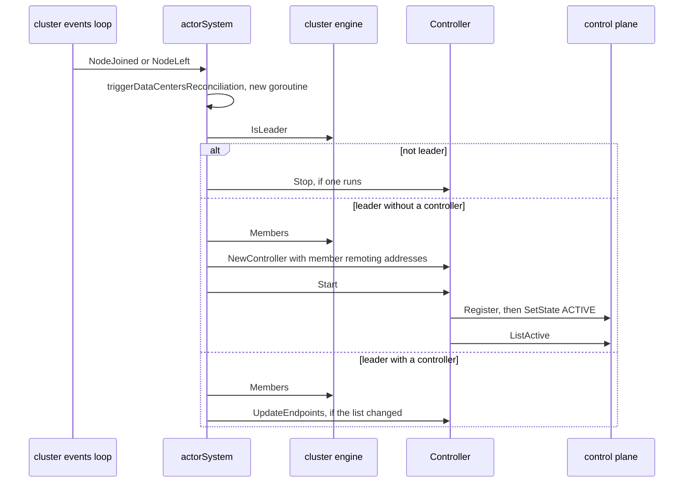

# 22. Multi-Datacenter

## Contents

- [What you will learn](#what-you-will-learn)
- [22.1 One cluster per datacenter](#221-one-cluster-per-datacenter)
- [22.2 Records, states and wire format](#222-records-states-and-wire-format)
- [22.3 Configuration and validation](#223-configuration-and-validation)
- [22.4 The `ControlPlane` contract](#224-the-controlplane-contract)
- [22.5 The NATS JetStream control plane](#225-the-nats-jetstream-control-plane)
- [22.6 The etcd control plane](#226-the-etcd-control-plane)
- [22.7 The datacenter controller](#227-the-datacenter-controller)
- [22.8 The cache of active datacenters](#228-the-cache-of-active-datacenters)
- [22.9 The actor system's side](#229-the-actor-systems-side)
- [22.10 Cross-datacenter operations](#2210-cross-datacenter-operations)
  - [Spawning in another datacenter](#spawning-in-another-datacenter)
  - [Sending by name](#sending-by-name)
  - [Grains](#grains)
- [Guarantees](#guarantees)
- [Implementation details (may change)](#implementation-details-may-change)
- [Behaviours to know](#behaviours-to-know)

## What you will learn

- How several independent clusters are linked through a control plane, and which operations cross from one to another.
- What a datacenter record holds, its four states, and how it is stored.
- The `ControlPlane` contract, and how the NATS JetStream and etcd implementations meet it: keys, versions, leases and watches.
- What the datacenter controller does: registration, heartbeats, the refresh and watch loops with their backoff, and the cache of active datacenters with its tombstones.
- Which node runs the controller, which call sites start and stop it, and what readiness reports.
- How `SpawnOn` with `WithDataCenter`, name lookup in `SendAsync` and `SendSync`, and grain messaging reach another datacenter, and what each does with a stale cache.

## 22.1 One cluster per datacenter

Each datacenter runs an independent GoAkt cluster, with its own discovery provider, membership and registry. **Nothing in the registry is shared between datacenters.** What links them is a control plane: an external store (NATS JetStream or etcd) that holds one record per datacenter, with the datacenter's identity, the remoting addresses of its nodes, a state and a leased liveness. In each cluster, the leader runs a datacenter controller that writes its own datacenter's record and caches the active records of every datacenter ([§22.7](#227-the-datacenter-controller) and [§22.8](#228-the-cache-of-active-datacenters)). [§22.9](#229-the-actor-systems-side) describes when the actor system creates that controller and how long its background loops run, which is less than the controller's design suggests. Cross-datacenter traffic is ordinary remoting ([Chapter 15](chap-15.md)) to the addresses in those records.

| Layer | Mechanisms | Scope |
|---|---|---|
| Within a datacenter | discovery, membership, the registry, placement, relocation, singletons, the topic actor | the nodes of one cluster |
| Across datacenters | control-plane records, the controller's cache, remoting to record endpoints | all active datacenters |

Four operations cross datacenters:

| Operation | Entry point | Section |
|---|---|---|
| Spawn in a named datacenter | `SpawnOn` with `WithDataCenter` | [§22.10](#2210-cross-datacenter-operations) |
| Send to an actor by name that the local cluster does not know | `SendAsync`, `SendSync` | [§22.10](#2210-cross-datacenter-operations) |
| Send to a grain that the local cluster does not know | `TellGrain`, `AskGrain` | [§22.10](#2210-cross-datacenter-operations) |
| Replicate CRDTs | the Replicator's flush and anti-entropy | [Chapter 24, §24.9](chap-24.md#249-cluster-integration-and-multi-datacenter) |

Cross-datacenter CRDT replication uses the same controller: the leader's Replicator reads the controller's active records and its stale-cache policy before each flush and each anti-entropy round, as [Chapter 24, §24.9](chap-24.md#249-cluster-integration-and-multi-datacenter) describes. `SpawnOn` without `WithDataCenter` places through `cluster.Members` and therefore stays inside the local datacenter (comment on `actorSystem.SpawnOn` in `actor/spawn.go`).

## 22.2 Records, states and wire format

**Metadata.** A `DataCenter` (`datacenter/data_center.go`) has a `Name` (required when multi-datacenter is enabled), an optional `Region`, an optional `Zone` and optional `Labels`. `DataCenter.ID` concatenates zone, region and name with no separator: `{Name: "dc-1", Region: "r", Zone: "z"}` has the ID `zrdc-1`. The ID is how the local datacenter's record is keyed ([§22.7](#227-the-datacenter-controller)) and how `SpawnOn` finds a target ([§22.10](#2210-cross-datacenter-operations)). `Labels` are stored in the record and in the CRDT batch origin; no routing code reads them.

**The record.** `DataCenterRecord` (`datacenter/data_center.go`) is the control plane's view of one datacenter:

| Field | Meaning |
|---|---|
| `ID` | stable identifier; the controller sets it to `DataCenter.ID` |
| `DataCenter` | the metadata above |
| `Endpoints` | the advertised remoting addresses, `host:port`; the controller fills it with the remoting addresses of the cluster members ([§22.9](#229-the-actor-systems-side)) |
| `State` | lifecycle state, below |
| `LeaseExpiry` | when the record expires unless renewed |
| `Version` | monotonic revision for optimistic concurrency; both control planes use the store's revision |

**States.** `DataCenterState` is a string, and the comments on the constants say providers should treat the values as stable wire strings:

| State | Meaning (constant comment) | Set by the controller |
|---|---|---|
| `DataCenterRegistered` | exists, not yet eligible for routing | written by `Register` |
| `DataCenterActive` | eligible for routing while the lease is valid | right after `Register`, and on every endpoint update |
| `DataCenterDraining` | avoid new placements | first step of `Stop` |
| `DataCenterInactive` | not eligible for routing | second step of `Stop`, before `Deregister` |

**Only `ACTIVE` records are ever routed to.** `ListActive` returns only active records with a valid lease in both control planes, the controller's cache drops every record that is not active ([§22.8](#228-the-cache-of-active-datacenters)), and spawning, name lookup and grain sends check `State == DataCenterActive` again before using a record ([§22.10](#2210-cross-datacenter-operations)).

**Wire format.** Both control planes store a record as the protobuf message `DataCenterRecord` of `protos/internal/datacenter.proto`, with its nested `DataCenter` and the `DataCenterState` enum, encoded by `EncodeDataCenterRecord` and decoded by `DecodeDataCenterRecord` in `internal/codec/codec.go`. The empty state maps to `DATA_CENTER_STATE_UNSPECIFIED`, an unknown state string fails the encoding (`toProtoState`), and an unspecified or unknown enum decodes to the empty state (`fromProtoState`). The encoded `version` is whatever the writer passed; `ListActive` and the watch overwrite it with the store's revision of the entry they read. A zero `LeaseExpiry` is not encoded. The proto file also declares `ControlPlaneEvent` and `ControlPlaneEventType`; no Go code outside the generated package uses them, because events are built directly as `datacenter.ControlPlaneEvent`. The proto `DataCenter` message is also the origin of CRDT batches ([Chapter 24, §24.9](chap-24.md#249-cluster-integration-and-multi-datacenter)).

## 22.3 Configuration and validation

Multi-datacenter is configured with a `Config` (`datacenter/config.go`) handed to `ClusterConfig.WithDataCenter` (`actor/cluster_config.go`). A nil config is ignored. Endpoints are not configured: the leader advertises the remoting addresses of its cluster's members ([§22.9](#229-the-actor-systems-side)).

| Field | `NewConfig` | `Sanitize` fills a zero value with | `Validate` | Used by |
|---|---|---|---|---|
| `ControlPlane` | unset | nothing | required | the controller |
| `DataCenter` | unset | nothing | `Name` not empty | the local record |
| `HeartbeatInterval` | 10 s | 10 s | > 0 | the heartbeat loop |
| `CacheRefreshInterval` | 10 s | 10 s | > 0 | the refresh loop; base delay of watch re-establishment |
| `MaxCacheStaleness` | 30 s | 30 s | > 0 | the stale flag of `Controller.ActiveRecords` |
| `LeaderCheckInterval` | 5 s | 5 s | > 0 | the leader watch ticker, which never starts ([§22.9](#229-the-actor-systems-side)) |
| `JitterRatio` | 0.1 | 0.1 | 0 to 0.5 | all periodic loops |
| `MaxBackoff` | 30 s | 30 s | > 0 | all periodic loops |
| `RequestTimeout` | 5 s | 5 s | > 0 | each control-plane call; cross-datacenter lookups and grain sends |
| `WatchEnabled` | true | nothing | none | the watch loop |
| `FailOnStaleCache` | true | nothing | none | every cross-datacenter operation |
| `Logger` | `log.DefaultLogger` | `log.DefaultLogger` | none | the controller |

`Sanitize` cannot tell a false boolean from an unset one, so `WatchEnabled` and `FailOnStaleCache` are true only in a config built by `NewConfig`. A `JitterRatio` of 0 is replaced by 0.1, so jitter cannot be switched off through a sanitized config.

**Where validation runs.** `ClusterConfig.Validate` runs `Config.Validate` through a conditional validator when a datacenter config is set (`actor/cluster_config.go`), and `actorSystem.validate` calls `ClusterConfig.Validate` from `NewActorSystem` in cluster mode (`actor/actor_system.go`). `Sanitize` runs later, in `NewController` ([§22.7](#227-the-datacenter-controller)). A config built by hand with zero intervals therefore fails `NewActorSystem`; `NewConfig` gives one that passes once `ControlPlane` and `DataCenter.Name` are set.

The control planes have their own configs ([§22.5](#225-the-nats-jetstream-control-plane), [§22.6](#226-the-etcd-control-plane)). Nothing checks that a control plane's TTL is longer than `HeartbeatInterval`.

## 22.4 The `ControlPlane` contract

`ControlPlane` (`datacenter/control_plane.go`) is the provider interface. Its comment states four rules: records are leased and `Heartbeat` renews the lease; updates are versioned, so a mutation takes the caller's current version and returns a new one; every method honours its context; implementations should be safe for concurrent use.

| Method | Contract (interface comment) |
|---|---|
| `Register(ctx, record) (id, version, err)` | creates or registers a record; the provider may assign the ID; the returned version is the one for later updates |
| `Heartbeat(ctx, id, version) (newVersion, leaseExpiry, err)` | renews the lease at the given version; errors on a stale version or a missing record |
| `SetState(ctx, id, state, version) (newVersion, err)` | sets the state at the given version; errors on a stale version or a missing record |
| `ListActive(ctx)` | only records whose state is active and whose lease has not expired |
| `Watch(ctx)` | a channel of ordered record changes, closed when the watch ends; `ErrWatchNotSupported` if the provider has none |
| `Deregister(ctx, id)` | removes the record at once on clean shutdown; safe to repeat; may return nil or `ErrDataCenterRecordNotFound` for a missing record |

A `ControlPlaneEvent` carries a `ControlPlaneEventType`, `ControlPlaneEventUpsert` or `ControlPlaneEventDelete`, and a record: the latest view for an upsert, possibly only the identifying fields for a delete. The sentinels the controller tests for are `ErrDataCenterRecordNotFound`, `ErrDataCenterRecordConflict` and `ErrWatchNotSupported` in `errors/errors.go`.

Both shipped implementations follow the same scheme:

- The ID is the caller's `record.ID`; neither assigns one. `Register` checks that the ID and `DataCenter.Name` are not empty and that `Endpoints` is not empty, defaults an empty state to `REGISTERED` and rejects an unknown state. `Heartbeat` and `SetState` reject an empty ID, and `SetState` an unknown state.
- The version is the store's revision of the record's key.
- `Register` with version 0 is **create-or-update**: it reads the current revision and writes conditionally on it, so it overwrites an existing record of the same ID. With a version above 0 it is a compare-and-set on that revision.
- `Heartbeat` and `SetState` read the entry, return `ErrDataCenterRecordConflict` if its revision differs from the version passed, and write conditionally on that revision. A missing record is `ErrDataCenterRecordNotFound`.
- `ListActive` returns the active, unexpired records sorted by ascending version.

## 22.5 The NATS JetStream control plane

`ControlPlane` in `datacenter/controlplane/nats/control_plane.go` stores records in a JetStream key-value bucket through the legacy KV API.

| `Config` field | Default (`Sanitize`) | `Validate` |
|---|---|---|
| `URL` | none | not blank |
| `Bucket` | `goakt_datacenters` | none |
| `TTL` | none | at least 1 s |
| `Timeout` | 5 s | > 0 |
| `ConnectTimeout` | 5 s | > 0 |
| `Context` | `context.Background()` | none |

**Construction.** `NewControlPlane` sanitizes and validates the config, connects with `ConnectTimeout`, and looks the bucket up. If it does not exist it creates it with `TTL` as the bucket TTL; if a concurrent creator won (`nats.ErrStreamNameAlreadyInUse`) it looks it up again. An existing bucket is used as it is, with whatever TTL it was created with. `Close` closes the connection and may be called twice.

**Keys and values.** A record lives at `<id>.datacenterrecord` (`recordKey`, `recordSuffix`); keys without the suffix are ignored everywhere. The value is the encoded record; the version is the KV revision of the entry.

**Liveness has two layers.** The bucket TTL ages every key, and each `Put` or `Update` resets the key's age (type comment). Independently, every write stores `LeaseExpiry = now + Config.TTL` in the record, and `ListActive` skips a record whose stored `LeaseExpiry` is not after the current time.

**Operations**, beyond the common scheme of [§22.4](#224-the-controlplane-contract):

- `Register` with version 0 reads the key. If it is missing or deleted, it `Put`s the record, and a `nats.ErrKeyExists` from the `Put` is `ErrDataCenterRecordConflict`; otherwise it `Update`s at the current revision, and a revision mismatch is `ErrDataCenterRecordConflict` (`isRevisionConflict` recognises `nats.ErrKeyExists` and JetStream's wrong-last-sequence error). With a version above 0 it `Update`s at that version, mapping `nats.ErrKeyNotFound` to `ErrDataCenterRecordNotFound`.
- `Heartbeat` decodes the stored record, sets a new `LeaseExpiry`, and `Update`s at the version, returning the new revision and the new expiry.
- `SetState` decodes, changes the state, and `Update`s at the version.
- `ListActive` lists the keys, reads each record key, skips deleted entries and entries whose operation is not a put, decodes (a decoding error fails the whole call), keeps active records with a future `LeaseExpiry`, sets each version to the entry's revision, and sorts.
- `Watch` opens a KV watch on all keys bound to the context and translates entries on a goroutine into an unbuffered channel. Nil entries and non-record keys are skipped. A put becomes an upsert carrying the decoded record with the entry's revision; a put whose value fails to decode is dropped. A delete or purge becomes a delete carrying the ID parsed from the key and, only when the entry has a value, the decoded record and its revision (`ControlPlane.toControlPlaneEvent`). The KV `Delete` and `Purge` calls write a marker with an empty value, so the delete events this provider produces carry the ID and version 0, which the controller's cache does not apply against a cached record ([§22.8](#228-the-cache-of-active-datacenters)). The channel closes when the context ends or the watcher's update channel closes.
- `Deregister` deletes the key; a missing or already deleted key is success.

**Contexts.** `Register`, `Heartbeat`, `SetState`, `ListActive` and `Deregister` ignore their context parameter, and no operation reads `Config.Timeout` or `Config.Context`; only `Watch` uses its context. The controller's `RequestTimeout` therefore does not bound those calls on this provider.

## 22.6 The etcd control plane

`ControlPlane` in `datacenter/controlplane/etcd/control_plane.go` stores records in etcd under a namespace and models liveness with etcd leases.

| `Config` field | Default (`Sanitize`) | `Validate` |
|---|---|---|
| `Endpoints` | none | not empty |
| `Namespace` | `/goakt/datacenters` | none |
| `TTL` | none | at least 1 s |
| `DialTimeout` | 5 s | > 0 |
| `Timeout` | 5 s | > 0 |
| `TLS`, `Username`, `Password` | none | none |
| `Context` | `context.Background()` | none |

**Construction.** `NewControlPlane` sanitizes and validates, creates the client, and checks the first endpoint with `Status` within `DialTimeout`, closing the client on failure. KV, lease and watcher are wrapped in the namespace, normalised to end with a slash (`normalizeNamespace`). Every operation except `Watch` runs under its context bounded by `Config.Timeout` (`ControlPlane.withTimeout`); `Watch` uses its context as given.

**Keys and values.** A record lives at `<namespace>/<id>/datacenterrecord` (`recordKey`, `recordSuffix`). The version is the key's `ModRevision`; a write returns the transaction header's revision, which is the new `ModRevision`.

**Operations**, beyond the common scheme of [§22.4](#224-the-controlplane-contract):

- `Register` grants a **new lease** of `TTL` seconds, at least one (`ControlPlane.leaseTTLSeconds`), and sets `LeaseExpiry` from the granted TTL. `registerCompare` builds the condition: `ModRevision == version` for a version above 0; for version 0, `CreateRevision == 0` if the key is absent, else `ModRevision == current`. The record is put with the new lease in one transaction; a failed condition is `ErrDataCenterRecordConflict`. A previous lease of the record is not revoked.
- `Heartbeat` refuses a record without a lease, renews the lease with `KeepAliveOnce`, then rewrites the record with the new `LeaseExpiry` on the same lease, conditionally on the `ModRevision`. **Every heartbeat is therefore a write**, with a new version, and an upsert event for every watcher.
- `SetState` rewrites the record conditionally, keeping its lease if it has one.
- `ListActive` reads the whole prefix, skips non-record keys, decodes (a decoding error fails the call), keeps active records, and asks etcd for each record's remaining lease TTL (`ControlPlane.leaseExpiry`). A record without a lease, or whose lease has no time left, is skipped; `LeaseExpiry` is set from the remaining TTL.
- `Watch` opens a prefix watch with previous values and no start revision. A put becomes an upsert with the `ModRevision` and the lease expiry. A delete carries the previous record and the previous `ModRevision` when etcd supplies them, and otherwise only the ID parsed from the key. A watch response with an error ends the goroutine and closes the channel. An event of an unknown type is forwarded as an empty event, which the controller skips because its ID is empty.
- `Deregister` deletes the key.

| | NATS JetStream | etcd |
|---|---|---|
| Version | KV revision | `ModRevision` |
| Liveness | bucket TTL plus the stored `LeaseExpiry` | an etcd lease per `Register` |
| `ListActive` expiry check | stored `LeaseExpiry` | remaining lease TTL |
| Delete event payload | ID, plus record and revision when the entry has a value | previous record and previous `ModRevision`, or ID only |
| Contexts | ignored except by `Watch` | every call; all but `Watch` bounded by `Config.Timeout` |

## 22.7 The datacenter controller

`Controller` in `internal/datacentercontroller/controller.go` owns one datacenter's record and the cache of all active records. It holds the record's ID, version and lease expiry and the advertised endpoints under `mu`; `lifecycleMu` serialises `Start` and `Stop`; `updateMu` serialises `UpdateEndpoints`.

**Construction.** `NewController(config, endpoints)` rejects a nil config and an empty endpoint list, then runs `Sanitize` and `Validate`. Nothing runs until `Start`.

**Start.** `Controller.Start`, under `lifecycleMu`:

1. Returns nil if already started.
2. Derives its own context from the one it is given. **All background loops run under that context**, so they end when it ends or when `Stop` cancels it.
3. Registers (`Controller.register`): builds the record with `REGISTERED` state, the current endpoints, and as ID the stored record ID, else `DataCenter.ID`, else `DataCenter.Name` (`Controller.record`); calls `Register`; calls `SetState(ACTIVE)` at the returned version; stores the ID and version. Any error cancels the context and is returned, and the controller stays not started.
4. Refreshes the cache once. A failure is logged and does not fail `Start`.
5. Starts the heartbeat loop and the refresh loop, and the watch loop when `WatchEnabled`.
6. Marks itself started.

Every control-plane call the controller makes, except `Watch`, runs under `RequestTimeout` (`Controller.withTimeout`); `Watch` runs under the controller's context.

**Loops.** `runLoop` waits a delay, runs one step, and waits again. The delay is the interval when the last step succeeded; after `n` consecutive failures it is the interval doubled `n - 1` times, capped at `MaxBackoff` (`Controller.backoffDelay`). Each delay is then jittered by up to plus or minus `JitterRatio` of itself, drawn from `crypto/rand` (`jitterDuration`, `secureFloat64`).

| Loop | Interval | One step |
|---|---|---|
| heartbeat | `HeartbeatInterval` | `heartbeatOnce` |
| refresh | `CacheRefreshInterval` | `refreshCache` |
| watch | none: event-driven | `watchLoop` |

**One heartbeat.** `Controller.heartbeatOnce` does nothing without a record ID. It calls `Heartbeat` with the stored version. On `ErrDataCenterRecordNotFound` or `ErrDataCenterRecordConflict` it **registers again** (step 3 of `Start`), which with both control planes is a create-or-update that overwrites the stored record. On success it stores the new version and lease expiry.

**One refresh.** `Controller.refreshCache` calls `ListActive`. While a watch is established it merges the result into the cache; otherwise it replaces the cache with it ([§22.8](#228-the-cache-of-active-datacenters)).

**The watch loop.** `Controller.watchLoop`:

1. Calls `Watch`. On `ErrWatchNotSupported` it logs and returns for good: the cache is then maintained by polling alone. On another error it counts a failure, sleeps the backoff delay based on `CacheRefreshInterval`, and tries again.
2. On success it marks the watch as established and resets the failure count.
3. Applies each event with a non-empty record ID to the cache.
4. When the channel closes, it marks the watch as not established, counts a failure, sleeps the backoff, and opens a new watch.

The loop exits whenever the context ends.

**Stop.** `Controller.Stop`, under `lifecycleMu`:

1. Returns nil if not started, then marks itself not started.
2. Cancels the context and waits for the loops to end.
3. Returns nil if no record was ever registered.
4. Sets the record `DRAINING` at the stored version. `ErrDataCenterRecordNotFound` resets the cache and returns nil; any other error is returned.
5. Sets the record `INACTIVE` at the version step 4 returned. An error other than `ErrDataCenterRecordNotFound` is returned.
6. Calls `Deregister`. An error is only logged: the record will expire with its lease.
7. Resets the cache, which makes `Ready` false and `LastRefresh` zero.

The version checks of steps 4 and 5 mean that a controller whose stored version is behind the record, for example because another controller has re-registered it since, gets `ErrDataCenterRecordConflict` and returns before `Deregister`.

**Endpoint updates.** `Controller.UpdateEndpoints` requires a started controller, a non-empty list and a registered record. Under `updateMu`, it calls `Register` with the stored ID and version, the new endpoints and the `ACTIVE` state, a compare-and-set on the stored version. On success it stores the endpoints, the returned ID and the new version; on failure it keeps the old endpoints and returns the error. `Endpoints` returns a copy of the stored endpoints.

## 22.8 The cache of active datacenters

`recordCache` (`internal/datacentercontroller/controller.go`) holds, under its own lock, a map of active records by ID, a map of **tombstones** from deleted record IDs to the version at which they were deleted, and the time of the last refresh. The type comment gives the reason for tombstones: they keep a deleted record from being resurrected by an out-of-order update that arrives after its deletion.

**The version rule.** `recordCache.shouldApplyLocked` compares a record's version with the current version of its ID, which is the cached record's version, else the tombstone's, else 0:

- a record with version 0 applies only when the current version is 0;
- any other record applies when its version is **at least** the current one.

| Operation | Called by | What it does |
|---|---|---|
| `recordCache.replace` | a refresh without an established watch | builds a new map from the active records that pass the version rule, clears their tombstones, discards every other cached record, stamps the refresh time |
| `recordCache.merge` | a refresh while a watch is established | adds or updates the active records that pass the version rule, clears their tombstones, never removes a record, stamps the refresh time |
| `recordCache.apply` | each watch event | turns an upsert of a record that is not active into a delete; if the version rule passes, a delete removes the record and, for a version above 0, records a tombstone at that version, and an upsert stores the record and clears its tombstone; stamps the refresh time |
| `recordCache.reset` | `Controller.Stop` | empties both maps and zeroes the refresh time |

Two consequences of these rules:

- **While a watch is established, a record leaves the cache only through an event**: a delete, or an upsert whose state is not active. The periodic refresh only adds and updates. With the NATS provider, whose delete events carry version 0 ([§22.5](#225-the-nats-jetstream-control-plane)), a delete event never passes the version rule against a cached record, so only an upsert whose state is not active removes one; a record whose lease lapsed without such a write stays cached.
- A replace drops a cached record whose fresh copy has version 0 while the cached one has a higher version, because the fresh copy fails the version rule and is left out of the new map.

**Reading the cache.** `Controller.ActiveRecords` returns a copy of the cached records and a stale flag: true when the cache has never been refreshed, or when the last refresh is older than `MaxCacheStaleness`. An applied watch event counts as a refresh. `Controller.Ready` is true when the controller is started and the cache has been refreshed at least once; an empty refresh counts. `Controller.LastRefresh` returns the refresh time, zero before the first refresh and after `Stop`. `Controller.FailOnStaleCache` returns the config flag; the controller itself never acts on it, the callers do ([§22.10](#2210-cross-datacenter-operations)). The cache includes the local datacenter's own record.

## 22.9 The actor system's side

The actor system holds at most one controller, in the `dataCenterController` field of `actorSystem` (`actor/actor_system.go`). `getDataCenterController` reads the field under `locker`, and every write holds `locker`; the start and stop paths also hold `dataCenterControllerMutex`, which serialises them.

**When multi-datacenter is enabled.** `actorSystem.isDataCenterEnabled` (`actor/data_center_controller.go`) requires all of: the system is running (`actorSystem.Running`, which reports `started`), a cluster config with a datacenter config, cluster mode, and a cluster engine.

**Only the cluster leader runs the controller.** `actorSystem.startDataCenterController` reconciles the controller with the node's leadership:

1. Returns nil while the system is stopping, or when multi-datacenter is not enabled.
2. Returns nil if another reconciliation is in flight (`dataCenterReconcileInFlight`, a compare-and-swap); the flag is cleared on return.
3. Asks `cluster.IsLeader` (`internal/cluster/cluster.go`), then takes `dataCenterControllerMutex`.
4. **Not the leader**: stops a running controller and clears the field (`actorSystem.stopControllerLocked`). The comment gives the reason: followers must not run it, to avoid multiple writers and conflicting heartbeats in the control plane, and a node that lost leadership must stop being a writer. If `Stop` fails, the error is returned and the field is kept.
5. **The leader, with a controller**: updates the endpoints if membership changed (`actorSystem.maybeUpdateEndpoints`).
6. **The leader, without one**: builds the endpoints from `cluster.Members`, one `Peer.RemotingAddress` (`internal/cluster/peer.go`) per member, creates the controller with `NewController`, starts it with the context it was given, and stores it.

`maybeUpdateEndpoints` reads the members again, keeps the old endpoints when there are none, compares the new list with `Controller.Endpoints` using `slices.Equal`, which is **order-sensitive**, and calls `UpdateEndpoints` when they differ.

**What calls it.**

| Call site | When | Context given to `startDataCenterController` |
|---|---|---|
| the startup chain of `actorSystem.Start` | once, after `startCluster` | the `Start` context |
| `triggerDataCentersReconciliation`, from `handleNodeJoinedEvent` and `handleNodeLeftEvent` in `actor/actor_system.go` | on every `NodeJoined` and `NodeLeft` event this node handles; `LeaderChanged` triggers nothing | a new context from `context.Background`, bounded by `shutdownTimeout` and cancelled by a deferred `cancel` when `startDataCenterController` returns |
| `dataCenterLeaderWatchLoop`, through `triggerDataCentersReconciliation` | on every tick of a `LeaderCheckInterval` ticker | as above |

`triggerDataCentersReconciliation` does nothing while the system stops or while a reconciliation is in flight, and otherwise runs `startDataCenterController` on a new goroutine, logging its error. A trigger that finds a reconciliation in flight is dropped, not queued.

**What actually happens at run time.** Traced through the code, the three call sites do less than the table suggests:

1. **The startup chain does nothing.** `Start` sets `started` only after its startup chain has run ([Chapter 3, §3.3](chap-03.md#33-start)). During the chain `actorSystem.Running` is false, so `isDataCenterEnabled` is false, and both `startDataCenterController` and `startDataCenterLeaderWatch` return nil at their first check.
2. **The leader watch never runs.** `startDataCenterLeaderWatch` has no other caller, so the `LeaderCheckInterval` ticker is never created and `dataCenterLeaderWatchLoop` never runs.
3. **The first controller comes from a membership event.** `actorSystem.handleClusterEvent` drops every event while `InCluster` is false, which includes the whole of `Start`, so only a `NodeJoined` or `NodeLeft` event handled after `Start` returns triggers a reconciliation. The reconciliation runs on every node that handles the event, and only the node that `IsLeader` reports as leader at that moment creates a controller. A node is never told of its own join (`cluster.trackJoinLocked` in `internal/cluster/cluster.go`), so a datacenter whose cluster has one node never gets a controller.
4. **The controller's loops end almost at once.** `Controller.Start` derives its context from the one it is given and runs the heartbeat, refresh and watch loops under it ([§22.7](#227-the-datacenter-controller)). The reconciliation's context is cancelled by the deferred `cancel` in `triggerDataCentersReconciliation` as soon as `startDataCenterController` returns, right after the controller has registered the record, set it `ACTIVE` and refreshed the cache once. The heartbeat and refresh loops therefore exit before their first step, which would come only after a full interval, and any watch the watch loop opened ends with the context.

The controller is left stored and marked started, so later reconciliations on the leader take the "with a controller" branch and only update endpoints; nothing restarts the loops. From then on:

- `Controller.Ready`, and so `DataCenterReady`, stays true, because the controller is started and the cache was refreshed once.
- The cache is never refreshed again, so `ActiveRecords` reports it stale once `MaxCacheStaleness` (30 s by default) has passed since the initial refresh. With `FailOnStaleCache` true, the default, every cross-datacenter operation then takes the stale branch of [§22.10](#2210-cross-datacenter-operations).
- The record is never heartbeated, so it expires once the control plane's TTL has passed and the other datacenters stop listing it. An endpoint update before that re-registers the record (`Controller.UpdateEndpoints`), which starts a new lease of one TTL in both control planes.

**The leader watch, as written.** If it were started, `startDataCenterLeaderWatch` would create one ticker of `LeaderCheckInterval` and a one-slot stop channel, under `dataCenterLeaderMutex`, and run `dataCenterLeaderWatchLoop`, which triggers a reconciliation on each tick and exits on the stop signal or when its context ends; a second call while a ticker exists would do nothing. `stopDataCenterLeaderWatch`, which shutdown calls whether or not a ticker exists, stops the ticker, clears both fields and sends the stop signal without blocking.

**Stopping.** `actorSystem.shutdown` runs the coordinated shutdown hooks, then stops the leader watch and the controller (`stopDataCenterController`), whose error joins the hooks' error, all under the shutdown context bounded by `shutdownTimeout` ([Chapter 3, §3.5](chap-03.md#35-stop)). `startupCleanup` stops both too after a failed `Start`, under the `Start` context, and discards the controller's error. `reset` clears the controller field, the ticker field and the in-flight flag. A controller's `Stop` drains, deactivates and deregisters the record ([§22.7](#227-the-datacenter-controller)), so a leader that stops gracefully removes its datacenter's record if the record still exists at the version the controller holds; a record that has already expired makes `Stop` return nil at the `DRAINING` step. A non-leader has no controller and changes nothing there.

**Readiness.**

| Method (`actor/data_center_controller.go`) | Multi-datacenter not enabled | Enabled, no controller | Enabled, controller present |
|---|---|---|---|
| `actorSystem.DataCenterReady` | true | false | `Controller.Ready` |
| `actorSystem.DataCenterLastRefresh` | zero time | zero time | `Controller.LastRefresh` |

"Not enabled" includes a system that is not running, so `DataCenterReady` is true before `Start` and after `Stop`. The interface comment on `DataCenterReady` in `actor/actor_system.go` intends it for readiness probes and notes that it does not guarantee a fresh cache; freshness is the stale flag of `ActiveRecords`.

**Followers.** Every cross-datacenter path reads the controller through `getDataCenterController`, and a node that is not the leader has none: `DataCenterReady` is false, and the operations of [§22.10](#2210-cross-datacenter-operations) take their "no controller" branch. `SpawnOn` with `WithDataCenter` fails with `ErrDataCenterNotReady`, `SendAsync` and `SendSync` return `ErrActorNotFound` for a name the local cluster does not know, and `TellGrain` and `AskGrain` activate an unknown grain on the local node. The Replicator checks leadership itself and does nothing cross-datacenter on a follower ([Chapter 24, §24.9](chap-24.md#249-cluster-integration-and-multi-datacenter)). The one exception is a node whose controller `Stop` failed when it lost leadership: it keeps the stopped controller until a later reconciliation's `Stop`, now a no-op, clears the field. Meanwhile `Ready` is false, but name lookups and grain sends still read the controller's last cache.

## 22.10 Cross-datacenter operations

Every operation starts from `Controller.ActiveRecords` and applies the same stale-cache policy, with one difference in how its caller treats the result:

| Operation | No controller | Stale cache, `FailOnStaleCache` true | Stale cache, false |
|---|---|---|---|
| `SpawnOn` with `WithDataCenter` | `ErrDataCenterNotReady` | `ErrDataCenterStaleRecords` | warns, goes on |
| `DiscoverActor`, behind `SendAsync` and `SendSync` | `ErrActorNotFound` | `ErrDataCenterStaleRecords`, returned to the sender | warns, goes on |
| `tellGrainAcrossDataCenters`, `askGrainAcrossDataCenters` | `ErrActorNotFound` | `ErrDataCenterStaleRecords` | warns, goes on |
| Replicator flush and anti-entropy | skipped | skipped | goes on ([Chapter 24, §24.9](chap-24.md#249-cluster-integration-and-multi-datacenter)) |

For grains, every error from the cross-datacenter step, the stale error included, leads to local activation (below).

### Spawning in another datacenter

`actorSystem.SpawnOn` (`actor/spawn.go`) returns `ErrActorSystemNotStarted` on a system that is not running, then rejects a reliable-delivery endpoint combined with `WithDataCenter`, because the endpoint's controller pair and the registry live in the local cluster (comment in `SpawnOn`; [Chapter 23](chap-23.md)). With a datacenter set, it skips the local preconditions and placement and calls `actorSystem.spawnOnDatacenter`:

1. `DataCenterReady` must be true, else `ErrDataCenterNotReady`.
2. Reads the active records and applies the stale policy above.
3. Finds the record whose state is active and whose ID equals the target's `DataCenter.ID`, else `ErrDataCenterRecordNotFound`. Zone, region and name must therefore all match what the target registered.
4. Picks one of its endpoints uniformly at random and splits it into host and port; a malformed endpoint is an error.
5. Sends `RemoteSpawn` ([Chapter 16](chap-16.md)) with a `SpawnRequest` (`remote/spawn_request.go`) carrying the name, the actor's registered kind, `Relocatable`, the passivation strategy, the dependencies, stashing, reentrancy and the init timeout. The supervisor, role and mailbox options are not carried. The kind must be registered on the target node, else the remote error, typically `ErrTypeNotRegistered`, is returned.
6. Returns a remote PID for the address the target returned.

Which node runs the actor depends only on the endpoints the target datacenter advertised; with a leader that advertises every member, it is a random member (comment on `actorSystem.spawnOnDatacenter`). The target node handles the request like any remote spawn ([Chapter 17](chap-17.md)).

### Sending by name

`PID.SendAsync` and `PID.SendSync` (`actor/pid.go`) resolve the name in the local datacenter first, through the relocation handoff helpers ([Chapter 5, §5.8](chap-05.md#58-sending-by-name)). **Only `ErrActorNotFound` falls through** to the other datacenters; any other error is returned. They then call `PID.DiscoverActor` with a timeout of `RequestTimeout` (5 s without a datacenter config); `SendSync` lowers it to its own timeout when that is positive and smaller. On success they `Tell` or `Ask` the remote PID found. `ReceiveContext.SendAsync` and `ReceiveContext.SendSync` (`actor/receive_context.go`) delegate to these methods.

`DiscoverActor`, in order:

1. Returns `ErrNotLocal` for a remote PID and `ErrDead` for a stopped one; without a controller, `ErrActorNotFound`.
2. Reads the active records and applies the stale policy.
3. Returns `ErrActorNotFound` when no active record has an endpoint.
4. Starts one goroutine per endpoint of every active record, the local datacenter's included, each calling `PID.RemoteLookup` under one shared context bounded by the timeout. Malformed endpoints are skipped. The result channel is sized for all of them, so no goroutine blocks.
5. Takes the first lookup that returns a PID, cancels the others, and returns it. A lookup that returns `NoSender` counts as not found.
6. Returns `ErrActorNotFound` when none succeeds.

On the remote node, `actorSystem.remoteLookupHandler` (`actor/remote_server.go`) resolves a non-system name in its own cluster's registry, so any endpoint of a datacenter can answer for an actor anywhere in that datacenter.

### Grains

In cluster mode, `actorSystem.remoteTellGrain` and `actorSystem.remoteAskGrain` (`actor/grain_engine.go`) deliver to a grain active on this node, then consult the local registry, and only on `cluster.ErrGrainNotFound` try the other datacenters before activating the grain locally ([Chapter 14](chap-14.md) describes the grain runtime). Any other registry error is returned.

`tellGrainAcrossDataCenters` does not look the grain up; it **sends the message itself** to every endpoint of every active record, the local datacenter's included, concurrently, with `RemoteTellGrain`, or `RemoteTellGrainOneWay` for a one-way tell. The `GrainRequest` carries only the grain's name and kind. The shared context is bounded by `RequestTimeout`, lowered to the timeout passed in when that is positive and smaller; `TellGrain` passes `DefaultGrainRequestTimeout` (5 s, `actor/defaults.go`), `AskGrain` the caller's timeout. Malformed endpoints are skipped. The first send that succeeds returns nil and cancels the shared context; if none succeeds, the result is `ErrActorNotFound`. `askGrainAcrossDataCenters` does the same with `RemoteAskGrain`, passing the caller's timeout, and returns the first response that is not nil; a nil response without an error counts as a failure.

A receiving node handles the request in `actorSystem.remoteTellGrainHandler` or `actorSystem.remoteAskGrainHandler` (`actor/remote_server.go`), which call `actorSystem.localSendGrain`: the grain is activated in that node's cluster if it is not active there, or the message is forwarded to the owner that cluster's registry records. Every endpoint that receives a copy before the shared context is cancelled delivers it this way. The local datacenter's record lists the remoting address of every member of the local cluster, this node included, so on a node whose cache holds that record the sends to the local endpoints already deliver the message in the local cluster, once per member, through these handlers; the send to a node succeeds only if the grain's kind is registered there.

If the cross-datacenter step returns any error, `remoteTellGrain` and `remoteAskGrain` activate the grain on the local node and deliver there (`localSendGrain`).

## Guarantees

| Statement | Enforced by |
|---|---|
| `NewConfig` sets the documented defaults, with `WatchEnabled` and `FailOnStaleCache` true; `Sanitize` fills zero durations and the logger | `TestConfigDefaults` and `TestConfigSanitizeDefaults` in `datacenter/config_test.go` |
| `Validate` requires a control plane, a datacenter name, positive intervals, timeout and backoff, and a jitter ratio of at most 0.5 | `TestConfigValidate` in `datacenter/config_test.go` |
| A cluster config with a datacenter config validates and keeps it | `TestClusterConfig` in `actor/cluster_config_test.go` |
| `NewController` rejects a nil config, an empty endpoint list and an invalid config | `TestControllerNewManagerNilConfig`, `TestControllerNewManagerNilEndpoints` and `TestControllerNewManagerWithInvalidConfig` in `internal/datacentercontroller/controller_test.go` |
| `Start` registers the record and sets it `ACTIVE`, a second `Start` is a no-op, and `Stop` sets `DRAINING` then `INACTIVE` | `TestControllerStartStopHappyPath` in `internal/datacentercontroller/controller_test.go` |
| A failed `Register` fails `Start` and leaves the controller not started; a failed initial refresh does not fail `Start` | `TestControllerStartRegisterError` and `TestControllerStartRefreshError` in `internal/datacentercontroller/controller_test.go` |
| `Stop` returns the error of a failed `DRAINING` or `INACTIVE` transition, and treats a missing record at the `INACTIVE` step as success | `TestControllerStopDrainingError`, `TestControllerStopInactiveError` and `TestControllerStopInactiveNotFound` in `internal/datacentercontroller/controller_test.go` |
| A heartbeat stores the new version and lease expiry; a heartbeat that finds the record missing registers it again | `TestControllerHeartbeatOnce` in `internal/datacentercontroller/controller_test.go` |
| Without a watch a refresh replaces the cache; with one it merges | `TestControllerRefreshCache` in `internal/datacentercontroller/controller_test.go` |
| The record ID is the stored ID if any, else zone, region and name concatenated | `TestControllerRecordUsesExistingID` and `TestControllerRecordUsesDataCenterID` in `internal/datacentercontroller/controller_test.go` |
| `ActiveRecords` is stale before the first refresh and once `MaxCacheStaleness` has passed | `TestControllerActiveRecords` in `internal/datacentercontroller/controller_test.go` |
| `Ready` needs a started controller and one refresh, an empty one included, and is false after `Stop`; `LastRefresh` is zero before a refresh and after a reset | `TestControllerReady` and `TestControllerLastRefresh` in `internal/datacentercontroller/controller_test.go` |
| An unsupported watch ends the watch loop; watch events without an ID are skipped and the others applied | `TestControllerWatchLoopUnsupported` and `TestControllerWatchLoopEvents` in `internal/datacentercontroller/controller_test.go` |
| The backoff doubles per failure from the second one and is capped at `MaxBackoff` | `TestControllerRunLoopAndBackoff` in `internal/datacentercontroller/controller_test.go` |
| The cache keeps only active records; a delete leaves a tombstone that rejects an older upsert, in an event and in a merge; an upsert of a non-active record removes it | `TestRecordCacheSemantics` and `TestRecordCacheMergeHonorsVersions` in `internal/datacentercontroller/controller_test.go` |
| `UpdateEndpoints` re-registers the record as `ACTIVE` with the new endpoints; on failure it keeps the old ones; it refuses an unstarted controller and an empty list; `Endpoints` returns a copy | `TestControllerUpdateEndpointsHappyPath`, `TestControllerUpdateEndpointsRegisterError`, `TestControllerUpdateEndpointsNotStarted`, `TestControllerUpdateEndpointsEmptyEndpoints` and `TestControllerEndpoints` in `internal/datacentercontroller/controller_test.go` |
| `DataCenterReady` is true without multi-datacenter, false without a controller or with an unstarted one, and true with a ready controller | `TestDataCenterReady` in `actor/data_center_controller_test.go` |
| A follower stops and clears its controller; a leader without one creates and starts it; a leader with one updates changed endpoints | `TestStartDataCenterController` and `TestStartDataCenterControllerUpdatesEndpoints` in `actor/data_center_controller_test.go` |
| Endpoints are updated only when the member list differs, order included, and a failed update keeps the old ones | `TestMaybeUpdateEndpointsUnchanged`, `TestMaybeUpdateEndpointsOrderMatters` and `TestMaybeUpdateEndpointsUpdateFails` in `actor/data_center_controller_test.go` |
| `spawnOnDatacenter` fails with `ErrDataCenterNotReady`, `ErrDataCenterStaleRecords` or `ErrDataCenterRecordNotFound` as described, fails on a malformed endpoint, returns the `RemoteSpawn` error, and otherwise sends `RemoteSpawn` to the record's endpoint with the name, kind, relocation, passivation and stashing settings | `TestSpawnOnDatacenter` in `actor/spawn_test.go` |
| A reliable-delivery endpoint cannot be spawned in another datacenter | `TestReliableEndpointDataCenterRejected` in `actor/reliable_delivery_companion_test.go` |
| `DiscoverActor` returns `ErrActorNotFound` without a controller, records, a valid endpoint or a successful lookup, treats `NoSender` as not found, and returns the first PID found | `TestDiscoverActor` in `actor/pid_datacenter_test.go` |
| The cross-datacenter grain send returns `ErrActorNotFound` without a controller or when every send fails, succeeds on one success, and uses the one-way call for a one-way tell | `TestTellGrainAcrossDataCenters` and `TestAskGrainAcrossDataCenters` in `actor/grain_engine_datacenter_test.go` |
| A grain the local registry does not know is sent across datacenters, with the one-way call for a one-way tell, and a registry error other than not-found is returned | `TestRemoteTellGrain_FallbackPaths` and `TestRemoteAskGrain_FallbackPaths` in `actor/grain_engine_test.go` |
| NATS: `Register` and `ListActive` round-trip an active record with a future lease; a wrong version is a conflict; version 0 overwrites an existing record | `TestControlPlaneRegisterAndListActive`, `TestControlPlaneRegisterConflict` and `TestControlPlaneRegisterUpdateExistingVersion0Success` in `datacenter/controlplane/nats/control_plane_test.go` |
| NATS: `Heartbeat` and `SetState` return a higher version, a conflict on a wrong version and not-found on a missing record | `TestControlPlaneHeartbeat` and `TestControlPlaneSetState` in `datacenter/controlplane/nats/control_plane_test.go` |
| NATS: `ListActive` skips non-active and expired records and sorts by version | `TestControlPlaneListActiveFiltersNonActive`, `TestControlPlaneListActiveFiltersExpiredLease` and `TestControlPlaneListActiveMultiple` in `datacenter/controlplane/nats/control_plane_test.go` |
| NATS: the watch reports puts as upserts and deletes and purges as deletes naming the record | `TestControlPlaneWatch`, `TestControlPlaneWatchDelete` and `TestControlPlaneWatchPurge` in `datacenter/controlplane/nats/control_plane_test.go` |
| NATS: a second control plane reuses an existing bucket | `TestControlPlaneBucketAlreadyExists` in `datacenter/controlplane/nats/control_plane_test.go` |
| etcd: `Register` and `ListActive` round-trip an active record; a wrong version is a conflict; an empty state is stored as `REGISTERED` | `TestControlPlaneRegisterAndListActive`, `TestControlPlaneRegisterConflict` and `TestControlPlaneRegisterDefaultsState` in `datacenter/controlplane/etcd/control_plane_test.go` |
| etcd: `Heartbeat` refuses a record without a lease and reports conflicts and missing records; `SetState` reports conflicts and missing records | `TestControlPlaneHeartbeat` and `TestControlPlaneSetState` in `datacenter/controlplane/etcd/control_plane_test.go` |
| etcd: `ListActive` returns only active records; the watch reports upserts and deletes; a delete without a previous value carries the ID from the key | `TestControlPlaneListActiveSkipsInactive`, `TestControlPlaneWatch` and `TestControlPlaneEventConversion` in `datacenter/controlplane/etcd/control_plane_test.go` |

## Implementation details (may change)

- The defaults: 10 s heartbeat and refresh intervals, 30 s staleness, 5 s leader check and request timeout, 0.1 jitter, 30 s backoff cap; the NATS bucket `goakt_datacenters` and the etcd namespace `/goakt/datacenters`; 5 s connect, dial and operation timeouts for the control planes.
- The key suffixes `.datacenterrecord` (NATS) and `/datacenterrecord` (etcd).
- Up to three controller goroutines (heartbeat, refresh, watch) plus one translation goroutine per open watch in the control plane; one goroutine per reconciliation; one goroutine per endpoint for each cross-datacenter lookup or grain send.
- Jitter drawn from `crypto/rand`, falling back to the midpoint when the read fails.
- One new etcd lease per `Register`, with earlier leases left to expire.
- The record's encoded `version` field, which `ListActive` and the watch overwrite with the store's revision.

## Behaviours to know

| Behaviour | Source |
|---|---|
| The controller runs only on the cluster leader; on any other node every cross-datacenter operation finds no controller, so `SpawnOn` with `WithDataCenter` fails with `ErrDataCenterNotReady`, a name the local cluster does not know gives `ErrActorNotFound`, and an unknown grain is activated locally | `actorSystem.startDataCenterController` in `actor/data_center_controller.go` |
| The startup chain's two runners return at once because the system is not yet running, and the leader watch has no other caller, so its ticker never runs; the first controller is created by the first `NodeJoined` or `NodeLeft` event handled after `Start`, on the node that is leader then, and a one-node datacenter never gets one | `actorSystem.isDataCenterEnabled` and `actorSystem.startDataCenterLeaderWatch` in `actor/data_center_controller.go`; `actorSystem.handleClusterEvent` in `actor/actor_system.go` |
| The controller's loops run under the context passed to `Start`, and the reconciliation cancels that context when it returns; the controller stays started and `Ready`, its cache turns stale after `MaxCacheStaleness`, and its record is no longer heartbeated and expires with the control plane's TTL | `Controller.Start` in `internal/datacentercontroller/controller.go`; `actorSystem.triggerDataCentersReconciliation` in `actor/data_center_controller.go` |
| `LeaderChanged` events trigger no reconciliation; only `NodeJoined` and `NodeLeft` do | `actorSystem.handleClusterEvent` in `actor/actor_system.go` |
| `DataCenterReady` is true whenever multi-datacenter is not enabled, including before `Start` and after `Stop` | `actorSystem.DataCenterReady` in `actor/data_center_controller.go` |
| `DataCenter.ID` concatenates zone, region and name without a separator, so different triples can share an ID, and a `WithDataCenter` target must match all three fields | `DataCenter.ID` in `datacenter/data_center.go`; `actorSystem.spawnOnDatacenter` in `actor/spawn.go` |
| `Register` with version 0, which the controller uses at start and after a failed heartbeat, overwrites another controller's record of the same ID | `ControlPlane.Register` in `datacenter/controlplane/nats/control_plane.go` and in `datacenter/controlplane/etcd/control_plane.go`; `Controller.heartbeatOnce` in `internal/datacentercontroller/controller.go` |
| While a watch is established, the periodic refresh never removes a cached record; only a delete event or a non-active upsert does | `recordCache.merge` and `recordCache.apply` in `internal/datacentercontroller/controller.go` |
| A version-0 event or record does not displace a cached record with a higher version; NATS delete events always carry version 0, so on NATS a delete event never removes a cached record | `recordCache.shouldApplyLocked` in `internal/datacentercontroller/controller.go`; `ControlPlane.toControlPlaneEvent` in `datacenter/controlplane/nats/control_plane.go` |
| The NATS control plane ignores the context of every call except `Watch` and never reads `Config.Timeout` | `ControlPlane.Register` and `ControlPlane.ListActive` in `datacenter/controlplane/nats/control_plane.go` |
| An existing NATS bucket keeps the TTL it was created with, whatever `Config.TTL` now says | `newControlPlane` in `datacenter/controlplane/nats/control_plane.go` |
| Every etcd heartbeat rewrites the record, so each one is an upsert event for every watcher | `ControlPlane.Heartbeat` in `datacenter/controlplane/etcd/control_plane.go` |
| A hand-built `datacenter.Config` with zero intervals fails `NewActorSystem`; `Sanitize` runs only later, in `NewController` | `ClusterConfig.Validate` in `actor/cluster_config.go`; `NewController` in `internal/datacentercontroller/controller.go` |
| `WatchEnabled` and `FailOnStaleCache` are true only through `NewConfig`; a zero `JitterRatio` becomes 0.1 | `NewConfig` and `Config.Sanitize` in `datacenter/config.go` |
| Endpoint lists are compared in order, so the same members in another order trigger a re-registration | `actorSystem.maybeUpdateEndpoints` in `actor/data_center_controller.go` |
| A cross-datacenter spawn does not carry the supervisor, role or mailbox options | `actorSystem.spawnOnDatacenter` in `actor/spawn.go` |
| Name lookup and grain sends query the local datacenter's own endpoints too | `PID.DiscoverActor` in `actor/pid.go`; `actorSystem.tellGrainAcrossDataCenters` in `actor/grain_engine.go` |
| With `FailOnStaleCache`, a stale cache makes `SendAsync` and `SendSync` return `ErrDataCenterStaleRecords` for a name the local cluster does not know | `PID.DiscoverActor` in `actor/pid.go` |
| A stale cache does not fail a grain send: every error of the cross-datacenter step, the stale error included, leads to local activation | `actorSystem.remoteTellGrain` and `actorSystem.remoteAskGrain` in `actor/grain_engine.go` |
| The cross-datacenter grain send delivers the message to every endpoint concurrently; each receiving node activates the grain in its cluster or forwards to that cluster's owner, so one call can deliver the message more than once and activate the grain in more than one datacenter | `actorSystem.tellGrainAcrossDataCenters` in `actor/grain_engine.go`; `actorSystem.remoteTellGrainHandler` in `actor/remote_server.go` |
| A leader that stops gracefully deregisters its datacenter; a leader that crashes leaves its record until the lease or TTL expires or the next leader overwrites it | `Controller.Stop` in `internal/datacentercontroller/controller.go` |
