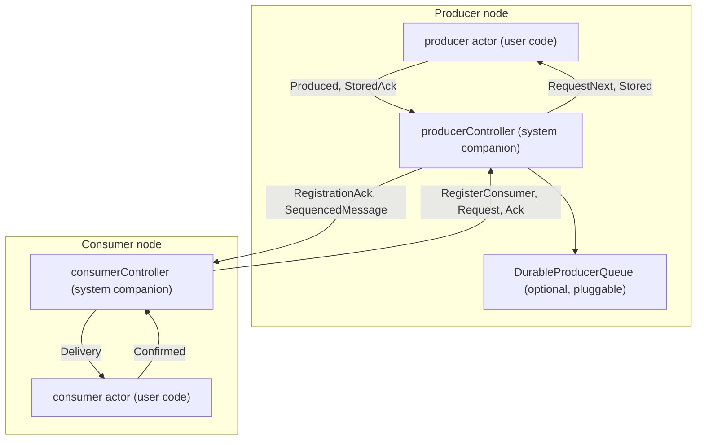
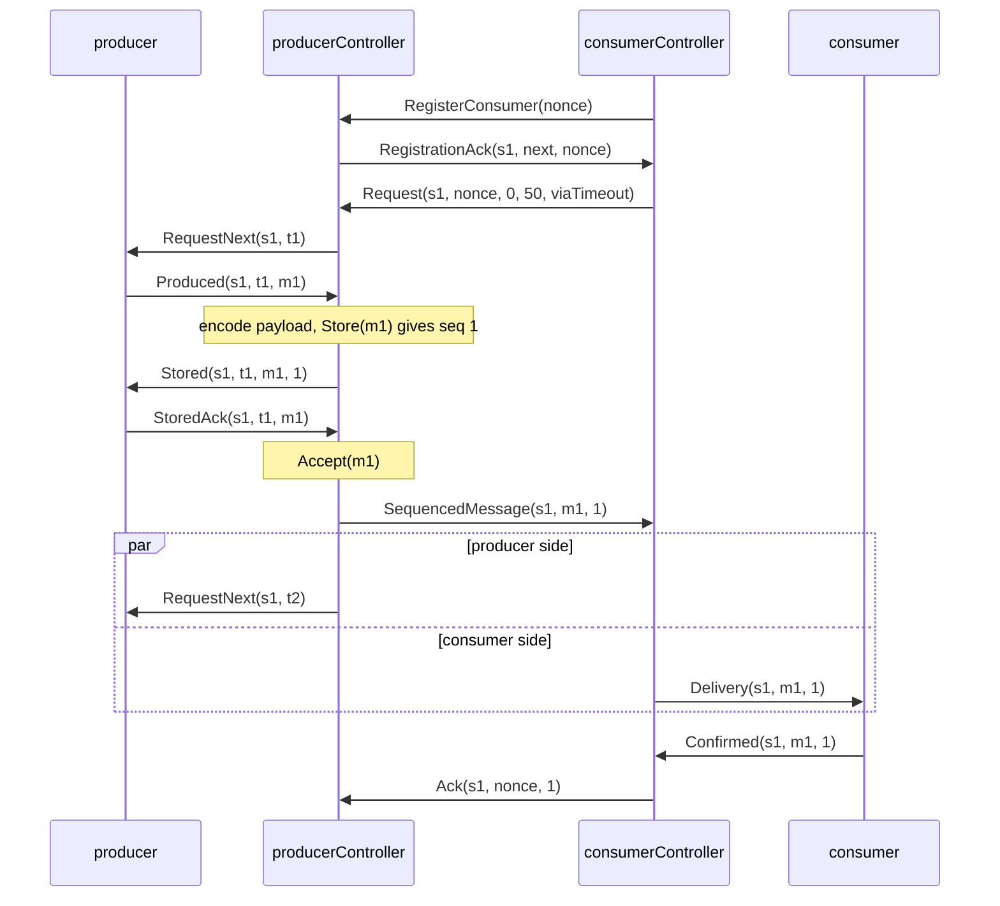

# 23. Reliable Delivery

Verified against: `cf7a7c6d` and the uncommitted changes of branch `issue-1432` (2026-10-03): every statement checked against the code

## Contents

- [What you will learn](#what-you-will-learn)
- [23.1 The model and its principles](#231-the-model-and-its-principles)
- [23.2 Delivery semantics](#232-delivery-semantics)
- [23.3 Components and the public surface](#233-components-and-the-public-surface)
- [23.4 The wire protocol](#234-the-wire-protocol)
  - [Cross-node commands](#cross-node-commands)
  - [Local messages](#local-messages)
  - [Payload encoding](#payload-encoding)
- [23.5 The handshake](#235-the-handshake)
- [23.6 Sessions and restart resync](#236-sessions-and-restart-resync)
  - [Session identity](#session-identity)
  - [Adoption on the consumer controller](#adoption-on-the-consumer-controller)
  - [Registration on the producer controller](#registration-on-the-producer-controller)
  - [Restart cases](#restart-cases)
- [23.7 Flow control and confirmation batching](#237-flow-control-and-confirmation-batching)
- [23.8 Timers and liveness](#238-timers-and-liveness)
- [23.9 The producer controller](#239-the-producer-controller)
  - [The handshake state machine](#the-handshake-state-machine)
  - [The durable-operation lane](#the-durable-operation-lane)
  - [Chunking](#chunking)
  - [Delivery confirmation](#delivery-confirmation)
  - [Peers](#peers)
- [23.10 The consumer controller](#2310-the-consumer-controller)
  - [Chunk assembly](#chunk-assembly)
- [23.11 The durable producer queue](#2311-the-durable-producer-queue)
- [23.12 Work pulling](#2312-work-pulling)
  - [Two sequence spaces](#two-sequence-spaces)
  - [Dispatch and credit](#dispatch-and-credit)
  - [Worker lifecycle](#worker-lifecycle)
  - [The durable work queue](#the-durable-work-queue)
  - [Confirmation and validation](#confirmation-and-validation)
- [23.13 Companions: identity, spawn and resolution](#2313-companions-identity-spawn-and-resolution)
  - [Identity](#identity)
  - [The spawn transaction](#the-spawn-transaction)
  - [Resolution](#resolution)
- [23.14 Cluster publication, relocation and placement](#2314-cluster-publication-relocation-and-placement)
- [23.15 Failure classification](#2315-failure-classification)
- [Guarantees](#guarantees)
- [Implementation details (may change)](#implementation-details-may-change)
- [Behaviours to know](#behaviours-to-know)
- [Exercises](#exercises)

## What you will learn

- What reliable delivery adds on top of the at-most-once transport, and exactly where its guarantee starts and stops.
- The messages of the protocol, on the wire and local, and the path of one message from `Produced` to `Confirmed`.
- How sessions, registration nonces and incarnation-scoped controller names make every restart reduce to one resync rule.
- How demand, confirmation batching, the two ticks and the gap request recover every lost message without a per-message acknowledgement.
- The state machines of the producer controller and the consumer controller, including chunking and the durable-operation lane.
- What a durable queue must guarantee, and how work pulling reuses the same protocol with one sequence space per worker.
- How controllers are spawned, published, resolved, relocated and stopped, and which failures are terminal.

Source files: `actor/reliable_delivery_protocol.go`, `actor/reliable_delivery_producer_controller.go`, `actor/reliable_delivery_consumer_controller.go`, `actor/reliable_delivery_work_pulling_controller.go`, `actor/reliable_delivery_durable_queue.go`, `actor/reliable_delivery_durable_work_queue.go`, `actor/reliable_delivery_options.go`, `actor/reliable_delivery_config.go`, `actor/reliable_delivery_companion.go`, `remote/reliable_delivery.go`, `internal/commands/delivery.go`, `internal/commands/delivery_serializer.go`, `protos/internal/delivery.proto`, and the spawn, relocation and cleanup paths in `actor/actor_system.go`, `actor/spawn.go`, `actor/pid.go` and `actor/remote_server.go`.

## 23.1 The model and its principles

Ordinary messaging is at-most-once: a `Tell` that races a crash, a full bounded mailbox or a network fault is lost without a trace. Reliable delivery adds a confirmed, flow-controlled flow above that transport, in two modes. **Point-to-point** connects one producer actor to one consumer actor, in order. **Work pulling** spreads one producer's messages over a changing set of workers, with no order across workers (§23.12).

The mechanism is a pair of unexported controller actors that the actor system spawns next to the user's actors: a `producerController` beside the producer endpoint and a `consumerController` beside the consumer endpoint. The user enables it with one spawn option per side. Work still enters the producer through an ordinary `Tell`.



The design rests on seven principles.

- **The transport stays at-most-once.** The remoting frame carries no sequence or acknowledgement field. Reliability is a controller protocol above `Tell` and remoting, so every existing send path keeps its cost and its semantics.
- **Controllers are invisible infrastructure.** They are unexported, carry reserved `GoAkt`-prefixed names scoped to one endpoint incarnation, and are hidden from `Actors`, `ActorOf`, `Kill` and `ReSpawn`.
- **Demand is consumer-driven.** The producer controller never emits a sequenced message above the demand the consumer controller granted. This bounds the consumer-side buffer whatever the producer's speed.
- **Confirmation is business-level.** The consumer sends `Confirmed` after it has processed a `Delivery`, not when the message is enqueued. A message is resent until it is confirmed; it is never dropped, skipped or marked done without confirmation.
- **`MessageID` is the deduplication identity.** The producer chooses a `MessageID` once and keeps it across retries, controller restarts and durable recovery. `Seq` orders messages within one sequencing history; `MessageID` names the same business message across histories.
- **Values are immutable.** Every protocol, queue-state and event struct has unexported fields, a validating constructor and value-receiver accessors. Serialised forms exist only at the wire boundary.
- **Tell only.** Every hop is a `Tell`. A controller never uses `Ask`, so nothing blocks on a reply or inherits a request timeout.

## 23.2 Delivery semantics

| Condition | Guarantee |
|---|---|
| Neither side crashes and the controllers are connected | Each sequence is presented once, in order, within the demand window |
| A message is lost, or the consumer controller restarts | At-least-once: a message may be delivered again, so the consumer handler must be idempotent |
| The producer controller restarts without a durable queue | Messages the controller held unconfirmed are lost; the consumer resumes on the new session |
| The producer controller restarts with a `DurableProducerQueue` | Stored messages are reloaded and delivered again; an item the producer never saw acknowledged is resubmitted by the producer |

"Once, in order" holds only on the no-fault path. Any lost `Delivery` or `Confirmed`, any controller restart and any relocation permits redelivery. The library never claims exactly-once business effects; a consumer that needs them commits the `MessageID` and the business change in one transaction.

The guarantee **begins at the producer's handoff to its controller**, not at the producer's mailbox. The hop into the producer is an ordinary at-most-once `Tell`. A producer that needs reliable ingress feeds itself from its own durable source and removes an item only at the acceptance boundary (§23.11).

Work pulling keeps the per-message at-least-once guarantee and orders delivery only within one worker's sub-flow.

## 23.3 Components and the public surface

| File | Responsibility |
|---|---|
| `actor/reliable_delivery_protocol.go` | Local protocol values (`RequestNext`, `Produced`, `Stored`, `StoredAck`, `Delivery`, `Confirmed`, `DeliveryConfirmed`), `ReliablePayload`, queue value types, `ReliableDeliveryFailed`, the role and stage enums, the window and chunk-size bounds |
| `actor/reliable_delivery_producer_controller.go` | `producerController`: registration fencing, the credit loop, the durable-operation lane, chunking, resend |
| `actor/reliable_delivery_consumer_controller.go` | `consumerController`: registration, session adoption, the receive buffer, chunk assembly, confirmation batching |
| `actor/reliable_delivery_work_pulling_controller.go` | `workPullingProducerController`: the pending pool, per-worker bindings, round-robin dispatch, requeue |
| `actor/reliable_delivery_durable_queue.go` | `DurableProducerQueue`, `QueueEpoch`, derived chunk identities |
| `actor/reliable_delivery_durable_work_queue.go` | `DurableWorkQueue` |
| `actor/reliable_delivery_options.go` | The four spawn options and the per-side option types |
| `actor/reliable_delivery_config.go` | The in-memory configuration, its validation and its wire round trip |
| `actor/reliable_delivery_companion.go` | Controller identity, resolution, ownership validation, the spawn transaction, worker authentication, relocation cleanup |
| `internal/commands/delivery.go`, `internal/commands/delivery_serializer.go` | The five cross-node commands and their serializer |
| `protos/internal/delivery.proto` | The wire form of the commands, the endpoint configuration and the companion record |
| `remote/reliable_delivery.go` | `remote.ReliableDeliverySpec`, carried by `remote.SpawnRequest` for remote placement |

The user documentation (`docs/clustering/reliable-delivery/point-to-point.mdx` and `work-pulling.mdx`) explains the API in full. In short:

- `AsReliableProducer(consumerName, opts...)` and `AsReliableConsumer(producerName, opts...)` name the peer's user-visible actor name. `AsReliableWorkPullingProducer(opts...)` names no peer; `AsReliableWorkPullingWorker(producerName, opts...)` returns `AsReliableConsumer` unchanged.
- The producer answers each `RequestNext` with `NewProduced(request, messageID, payload)`, removes its pending head on `Stored` and replies `NewStoredAck(stored)`. It must answer a repeated `RequestNext` with the same `Produced` and a repeated `Stored` with the same `StoredAck`.
- The consumer processes each `Delivery` idempotently and tells the sender `NewConfirmed(delivery)`.
- `RequestNext`, `Stored`, `Delivery` and `DeliveryConfirmed` carry the endpoint and controller PIDs they were built for; `IsAuthorizedFor(ctx.Self(), ctx.Sender())` rejects a spoofed copy without the user knowing any controller name (`isAuthorizedFor` in `actor/reliable_delivery_protocol.go`).
- `Ask` works only at the edges. A caller may `Ask` the producer, which can answer "accepted into my buffer" and nothing more. The consumer cannot reply to the submitter through the flow, because the sender of `Delivery` is the consumer controller.
- `WithReliableDeliveryConfirmation` makes the producer controller tell the producer one `DeliveryConfirmed` per confirmed message (§23.9).
- `WithReliableChunking(maxChunkBytes)` splits a large payload into sequenced chunks (§23.9, §23.10).

## 23.4 The wire protocol

### Cross-node commands

Five commands cross nodes. They are Go values in `internal/commands/delivery.go` with validating constructors.

| Command | Direction | Purpose |
|---|---|---|
| `RegisterConsumer(Nonce)` | consumer controller to producer controller | Announce or re-announce the consumer; the sender is the consumer controller |
| `RegistrationAck(SessionID, NextSeq, Nonce)` | producer controller to consumer controller | Give the session and the first sequence to expect, for the echoed nonce |
| `Request(SessionID, Nonce, ConfirmedSeq, RequestUpToSeq, ViaTimeout)` | consumer controller to producer controller | Grant demand, confirm cumulatively, and ask for a resend when `ViaTimeout` is set |
| `Ack(SessionID, Nonce, ConfirmedSeq)` | consumer controller to producer controller | Confirm cumulatively without new demand |
| `SequencedMessage(SessionID, MessageID, Seq, payload, chunk marks)` | producer controller to consumer controller | One sequenced message, or one chunk of one, marked first or last |

There is no separate resend message: a resend is asked for with `Request{ViaTimeout: true}`.

`DeliverySerializer` encodes a command as an eight-byte magic prefix followed by a `DeliveryEnvelope` protobuf (`protos/internal/delivery.proto`). The prefix stops remoting from mistaking the frame for a generated protobuf type. `actorSystem.setupRemoting` registers the serializer for the five command types, so the user registers nothing for the protocol itself.

### Local messages

| Message | Direction | Purpose |
|---|---|---|
| `RequestNext(SessionID, Token)` | producer controller to producer | Grant one send credit |
| `Produced(SessionID, Token, MessageID, Payload)` | producer to producer controller | Hand over one message for the outstanding token |
| `Stored(SessionID, Token, MessageID, Seq)` | producer controller to producer | Acknowledge storage and the assigned sequence |
| `StoredAck(SessionID, Token, MessageID)` | producer to producer controller | The producer has completed its retention handoff |
| `Delivery(SessionID, MessageID, Seq, Payload)` | consumer controller to consumer | Present one message |
| `Confirmed(SessionID, MessageID, Seq)` | consumer to consumer controller | Business-level confirmation |
| `DeliveryConfirmed(SessionID, MessageID, Seq)` | producer controller to producer | Opt-in notice that the consumer confirmed a message |

These never cross nodes. Their constructors require a local endpoint and a local controller (`validateLocalOwnership` in `actor/reliable_delivery_protocol.go`).

### Payload encoding

Every application message is encoded before a sequence is assigned or anything is stored, on a local-only flow as well. `handleProduced` asks remoting for the serializer of the payload's type and calls `Serialize` once; the resulting frame is self-describing, so no manifest is stored beside it. The consumer controller decodes a fresh value for every `Delivery` (`consumerController.deliverFrame`).

`ReliablePayload` wraps the frame. It is exported because the durable-queue contract stores it. `Bytes` returns a clone and is the only mutable boundary; copying the value does not copy the frame.

A missing serializer, an encode error and a decode error are terminal (`ReliableDeliveryStageProtocol`). All three are deterministic: they mean the payload type is not registered on one side, and neither a retry nor a restart can repair that. Protobuf payloads use the default serializer; other payload types must be registered through `remote.WithSerializables`, which also enables remoting, even for a local-only flow.

## 23.5 The handshake

The path of one message through a durable flow:



The next `RequestNext` leaves as soon as acceptance completes and demand remains; it does not wait for the consumer's confirmation (`producerController.completeAccept`).

The `Stored` and `StoredAck` exchange is the producer's **retention handoff**. An in-memory producer drops its pending head on `Stored`. A producer fed from a recoverable source durably marks or removes the item before it sends `StoredAck`. Only after `StoredAck` does the controller record durable acceptance and emit the sequenced message. Without a queue, storage and acceptance complete synchronously, through the same functions in the same order (`producerController.startStore` and `startAccept`).

## 23.6 Sessions and restart resync

### Session identity

Each producer-controller incarnation generates a random `SessionID` in `PreStart`. With a durable queue, `Load` restores the sequence and confirmation state; without one, sequencing starts from zero. The session is never persisted. Every message from the consumer controller must carry the current session and the current registration nonce.

### Adoption on the consumer controller

A session is adopted only through a `RegistrationAck`, gated by a nonce. Session IDs are unordered UUIDs, so a delayed ack from a dead incarnation must not be able to roll the consumer onto a stale session. The consumer controller generates a fresh nonce for every `RegisterConsumer` and remembers only the latest. `consumerController.handleRegistrationAck` applies, in order:

1. An ack whose sender is not the producer controller resolved at the last registration is dropped.
2. An ack whose nonce is not the latest is dropped.
3. An ack with a different session (or when none is held) is adopted: `expectedSeq = NextSeq`, `confirmedSeq = NextSeq - 1`, the buffer, the in-flight delivery and the chunk hint are cleared.
4. In both the new-session and the same-session case the controller sends a `Request` with `ViaTimeout` set. For the same session this reasserts demand: the producer side reset its demand when it saw the new nonce, so treating the ack as a no-op would leave the flow without credit.

A `SequencedMessage` whose session differs from the current one is dropped.

### Registration on the producer controller

`producerController.handleRegisterConsumer`:

1. Resolves the consumer endpoint's current controller (§23.13) under `DefaultReliableRegistrationLookupTimeout` and requires it to equal the sender. A failed lookup, a timeout or a different sender drops the registration; the consumer controller retries. This rejects an unrelated consumer and a delayed controller of an earlier incarnation alike.
2. A repeat with the same PID and the same nonce only sends the ack again.
3. A new PID or a new nonce starts a new registration generation: watch the sender, store the PID and the nonce, and **reset demand to `currentSeq`**, because a grant from a dead generation must not authorise new emissions. Unconfirmed messages are kept; they are still owed to the consumer.
4. The ack always carries `NextSeq = confirmedSeq + 1`.

`Request` and `Ack` are accepted only from the registered controller with the matching session and nonce (`producerController.fromRegisteredConsumer`); anything else is dropped without a state change. Registration itself grants no demand.

### Restart cases

| Case | What happens |
|---|---|
| Producer controller restarts, durable queue | `Load` restores state under a new session. The consumer controller's tick registers again, adopts the new session at `confirmedSeq + 1` and requests with `ViaTimeout`; unconfirmed messages are resent. A message processed but not durably confirmed is delivered again |
| Producer controller restarts between `Store` and `StoredAck` | The producer resubmits the same `MessageID`. `Store` returns that ID's original sequence and first-write payload, so one message never gets two durable sequences |
| Producer controller restarts, no queue | Same handshake with `NextSeq = 1`. Messages the controller held are lost. An item that never received `Stored` is still in the producer and is resubmitted |
| Consumer controller restarts | The fresh incarnation resolves the producer's controller, registers with a new nonce, adopts the unchanged session at the acked `NextSeq` and requests with `ViaTimeout`; the unconfirmed delivery is delivered again |
| Both restart | The two rules compose; nothing extra is needed |
| Node loss or relocation | See §23.14 |

## 23.7 Flow control and confirmation batching

`RequestUpToSeq` is the highest sequence the producer controller may emit. Every `Request` grants `confirmedSeq + window` (`consumerController.sendRequest`). After adoption the first request is `Request{ConfirmedSeq: expectedSeq - 1, RequestUpToSeq: expectedSeq - 1 + window, ViaTimeout: true}`.

Confirmations are batched; there is no per-message remote acknowledgement. On each `Confirmed`, `consumerController.batchConfirmation` applies the first rule that matches:

1. `requestUpToSeq - confirmedSeq <= window / 2`: send a top-up `Request` (not `ViaTimeout`). The top-up carries the confirmation.
2. The buffer is empty and nothing is in flight: send an `Ack` at once, so an idle producer controller does not keep confirmed messages.
3. Otherwise do nothing; a later `Confirmed` will match rule 1 or 2.

With the default window of 50, a burst of 30 messages produces one top-up at sequence 25 and one `Ack` at 30. A single message produces one `Ack`. A saturated stream settles into one top-up per 25 confirmations.

**Resend has one rule.** The producer controller re-emits the unconfirmed messages up to `min(currentSeq, demandUpTo)`, in sequence order, only for a `Request` with `ViaTimeout` set (`producerController.resendUnconfirmed`). A top-up never triggers a resend, because those messages are usually already buffered at the consumer.

**Range checks.** The producer controller requires `0 <= ConfirmedSeq <= currentSeq` and `ConfirmedSeq <= RequestUpToSeq <= ConfirmedSeq + MaxReliableFlowControlWindow`; a violation from the authenticated controller is terminal (`producerController.handleRequest`, `handleAck`). The consumer controller, after the sender and session checks, drops `Seq < 1` and `Seq > requestUpToSeq`, re-acks `Seq < expectedSeq` as a duplicate, and accepts the rest.

**Confirmation on the producer side.** `producerController.advanceConfirmed` ignores a value at or below `confirmedSeq`, cuts the confirmed prefix from the unconfirmed slice, and, with a queue, records the value as the dirty watermark. Only the highest dirty value is kept while a `Confirm` is in flight, so duplicate or idle control traffic cannot grow a backlog of queue operations.

**The producer-side invariant** is that no `SequencedMessage` leaves with `seq > demandUpTo` (`producerController.emitSequenced`). An emission above demand is skipped, not queued; the consumer's next `ViaTimeout` request recovers it.

## 23.8 Timers and liveness

Watch and `Terminated` are a fast path only. Remote watch registration can fail without a signal, so the protocol never depends on it. The recovery of record is one recurring timer per controller, created in `PostStart` handling and cancelled in `PostStop`. Each incarnation has a generation counter; the tick carries it, and a tick with an older generation is ignored. The scheduler reference is derived from the controller's name and generation (`reliableTickReference`), so `PostStop` reads no field that `PostStart` writes.

**Consumer controller tick** (`consumerController.handleTick`), every resend interval, exactly one of:

1. No session yet, or no valid producer-controller message since the previous tick: resolve the producer endpoint's current controller again and send `RegisterConsumer` with a fresh nonce. This one rule covers a lost registration, a producer-controller restart, an endpoint respawned on another node and plain idleness. A failed resolution is retried on the next tick.
2. Else a `Delivery` is in flight: tell the same `Delivery` to the consumer again. This recovers a drop by a bounded mailbox or a lost `Confirmed`, and deliberately allows duplicate processing.
3. Else a gap is open: check the head chunk run for a structural violation (§23.10), then send `Request{ViaTimeout: true}`.

The "valid traffic" flag is cleared at the end of every tick.

**Gap fast path.** When a buffered arrival leaves a gap (`consumerController.gapOpen`), `bufferMessage` sends a `ViaTimeout` request at once, limited to one per resend interval so a reordered burst does not become a request storm. A confirmation that uncovers a gap sends one outside that limit (`consumerController.handleConfirmed`).

**Producer controller tick** (`producerController.handleTick`), every retry interval:

1. A `RequestNext` is outstanding: send it again with the same session and token.
2. A `Stored` awaits its `StoredAck`: send the same `Stored` again.
3. Otherwise nothing. The store and accept phases wait on the durable lane, whose result arrives as a message.

Bounded user mailboxes are part of the fault model. Controller mailboxes are unbounded, but `RequestNext`, `Stored` and `Delivery` go to user actors and rely on these retries. A controller sends with `PID.Tell`, not `ctx.Tell`, and only logs a failed send, so a lost outbound message is never recorded as a failure of the inbound message being handled (`producerController.tell`, `consumerController.tell`).

## 23.9 The producer controller

The controller is a child of the producer endpoint; the producer PID is bound at construction and must be local. `PreStart` rejects a missing producer, a blank consumer name and non-positive retry settings, resets all incarnation state, generates the session, and with a queue calls `Load`.

State (`producerController` in `actor/reliable_delivery_producer_controller.go`):

- `sessionID`, `epoch`, `currentSeq`, `confirmedSeq`, `persistedConfirmedSeq`;
- `unconfirmed`, a slice in ascending contiguous sequence order: append on store, cut the prefix on confirmation. A slice, not a map, because resend iterates in order;
- `consumerController`, `registrationNonce`, `demandUpTo`, and `windowSpan`, the span of the latest grant;
- one local handshake: phase, token, pending `MessageID`, sequence, payload and chunks, plus the token and `MessageID` of the last completed handshake;
- the durable lane: `opInFlight`, `nextOperationID`, one deferred handshake operation, and the dirty confirmation watermark.

### The handshake state machine

At most one handshake exists at a time. A new one opens only when the phase is idle and `currentSeq < demandUpTo` (`producerController.allowNextRequest`), which bounds stored-but-unconfirmed messages by the granted demand.

| State | Event | Action | Next state |
|---|---|---|---|
| Idle | a `Request` leaves `currentSeq < demandUpTo`, or acceptance completes with demand left | generate a token, send `RequestNext` | Credit |
| Credit | tick | resend `RequestNext`, same token | Credit |
| Credit | `Produced` with the token | serialise once; route to resubmission, chunked store or whole store | Store |
| Credit | `Produced` with another token | terminal | stopped |
| Store | store result | for a new append, set `currentSeq` and append to `unconfirmed`; send `Stored` | StoredAck |
| Store | `Store` fails with `ErrQueueChunkedBatch` | relaunch as `StoreChunked` (`recoverChunkedBatch`) | Store |
| StoredAck | tick | resend `Stored` | StoredAck |
| StoredAck | matching `StoredAck` | start `Accept` | Accept |
| Accept | accept result | emit the message or its chunks, remember the token as completed, clear the handshake, try the next credit | Idle or Credit |
| Store, StoredAck, Accept | `Produced` with the current token and `MessageID` | ignore | unchanged |
| Accept | `StoredAck` with the current token and `MessageID` | ignore | unchanged |
| any | `Produced` or `StoredAck` matching the last completed token and `MessageID` | ignore | unchanged |
| any but Credit | any other `Produced` | terminal | stopped |
| any | any other `StoredAck` | terminal | stopped |

`Produced` and `StoredAck` are first checked for sender and session: one from another actor or with an old session is dropped, not terminal. Duplicates are recognised before violations because the tick resends `RequestNext` and `Stored`, so the producer may legitimately answer twice, in any later phase.

The order in `completeAccept` is the crash boundary: emit first, then clear. If the controller dies between acceptance and emission, the unconfirmed entry still holds the message and the next `ViaTimeout` request resends it.

### The durable-operation lane

Queue calls must not block the mailbox. `producerController.launchOp` runs each one as a `PipeTo` task; the retry backoff sleeps in the task goroutine (`retryQueueOp`). The task never returns an error: the outcome comes back as a `queueOpResult` data message, so a completion cannot trip the supervisor by itself.

- One operation is in flight at a time. A handshake operation that finds the lane busy is stored in `deferredOp`; one slot is enough because there is one handshake.
- `handleQueueOpResult` accepts a result only if the session matches, the lane is occupied and the operation ID is the latest. A result piped by a previous incarnation is dropped.
- `pumpLane` launches the deferred handshake operation first, then a `Confirm` if the dirty watermark is above the persisted one. Message progress gates throughput; confirmation persistence can wait a turn.
- `retryQueueOp` stops at once on `ErrQueueFenced`, `ErrQueueConflict` and `ErrQueueChunkedBatch`; these are verdicts a retry cannot change.

`Store` returns the assigned sequence and the authoritative first-write payload. For a `MessageID` already stored, `completeStore` reuses the original sequence and payload and appends nothing, even if this incarnation's serializer produced different bytes.

### Chunking

With `WithReliableChunking`, `handleProduced` sends a frame larger than `maxChunkBytes` to `storeChunks`, which cuts it into `ceil(len / maxChunkBytes)` entries under contiguous sequences, marked first and last.

- The handshake stays one `Produced`, one `Stored`, one `StoredAck` per business message. `Stored` carries the last chunk's sequence.
- A message that needs more chunks than `windowSpan` is terminal. The consumer confirms nothing mid-message, so such a message could never drain; the error names the remedy.
- Without a queue the chunk payloads alias the frame without copying and keep the business `MessageID`. With a queue the batch is stored atomically through `StoreChunked` under derived identities `GoAktChunk:<index>/<count>:<businessID>` (`durableChunkMessageID`), which keeps the queue's unique-ID invariant true. `NewProduced` rejects an application `MessageID` that starts with the prefix. On the wire and in notices the business ID is always used (`UnconfirmedMessage.id`).
- A demand boundary inside a message pauses emission between chunks; the consumer's gap request resumes it.
- After a reload, `hydrateLoadedUnconfirmed` restores the first and last marks from the derived identities. A reloaded incarnation resends chunks as stored and never cuts them again.
- **Resubmissions are routed by stored shape, not by the size of the fresh encode.** On a durable flow, a `MessageID` whose entries are still in `unconfirmed` goes to `resubmitStored`: `StoreChunked` for a chunked batch, `Store` for a whole message. A confirmed batch whose index the queue still holds is reached even when the re-encode falls below the threshold: `Store` answers `ErrQueueChunkedBatch` and the controller relaunches a `StoreChunked` whose proposal the queue ignores in favour of the original chunks (`recoverChunkedBatch`, `completeStoreChunked`).

### Delivery confirmation

With `WithReliableDeliveryConfirmation`, `sendConfirmation` tells the producer one `DeliveryConfirmed` for each business message leaving the unconfirmed slice, in sequence order; a chunked message notifies once, at its last chunk. It exists so a producer can report completion to whoever submitted the work: the protocol never learns the submitter, so the producer keeps its own correlation. The notice is best effort and is not retried. A bounded mailbox may drop it, a controller restart may lose it, and a message delivered and confirmed again is reported again, so the producer treats it idempotently by `MessageID`.

### Peers

`handleTerminated`: when the producer dies the controller stops itself. When the registered consumer controller dies it clears the registration and resets demand to `currentSeq`, keeping the unconfirmed messages and the handshake.

## 23.10 The consumer controller

The controller is a child of the consumer endpoint. The consumer PID, the producer name, the window and the resend interval are constructor state and survive restarts; `PreStart` validates them and resets everything else.

State (`consumerController` in `actor/reliable_delivery_consumer_controller.go`): the resolved producer controller, `sessionID`, `registrationNonce`, `expectedSeq`, `confirmedSeq`, `requestUpToSeq`, one receive buffer sorted by sequence and capped at `window` entries, at most one in-flight `Delivery`, the chunk hint `runLastSeq`, the valid-traffic flag and the time of the last gap request. There is one buffer and one drain path, and no stashing.

| Event | Condition | Action |
|---|---|---|
| `PostStart` | | watch the consumer, try to register (a failure is tolerated), start the tick |
| `RegistrationAck` | | the rules of §23.6 |
| `SequencedMessage` | wrong sender, no session or another session | drop |
| | `seq < 1` or `seq > requestUpToSeq` | drop; the producer still holds it |
| | `seq < expectedSeq` | duplicate: send `Ack` with the current watermark |
| | chunked | buffer, update the hint, drain |
| | `seq == expectedSeq`, nothing in flight | decode, tell the consumer a `Delivery`, mark it in flight |
| | `seq` equals the in-flight sequence | drop; the tick retries it |
| | otherwise | buffer, drain |
| `Confirmed` | not from the consumer, or not matching the in-flight session, `MessageID` and `Seq` | drop; a late confirmation is not a violation |
| | matches | advance `confirmedSeq` and `expectedSeq`, purge the buffer below `expectedSeq`, rebuild the hint, batch the confirmation (§23.7), drain, and ask for a resend if a gap is now open |
| tick | | the rules of §23.8 |
| `Terminated` | the consumer | stop |
| | the producer controller | clear the resolved PID, the session and the nonce; keep ticking |

`bufferMessage` inserts by binary search and ignores a sequence already buffered. When the buffer is full it keeps what it has and drops the arrival without moving `expectedSeq`; the producer still holds the message and a timeout resend recovers it.

### Chunk assembly

A chunk is never deliverable alone, so chunks always buffer. `drain` assembles when the head of the buffer is a chunk at `expectedSeq` and the run is complete. `chunkRunComplete` answers with one index probe: the buffer is sorted and deduplicated, so `buffer[k]` holding `expectedSeq + k` proves the whole prefix is present. `runLastSeq` is the sequence of the head run's last chunk; it keeps the work per arrival constant, and it is only a hint that assembly verifies.

`assemble` concatenates the run and delivers one `Delivery` under the first chunk's `MessageID` and the **last chunk's sequence**. The entries stay buffered until the confirmation purges the whole run, because `expectedSeq` moves only at message boundaries.

`scanChunkRun` classifies the run. A missing interior or last chunk is ordinary loss: wait for the gap request. Four shapes are terminal, because the producer controller emits one message's chunks contiguously under one ID and no resend can reorder what it stored wrongly: a run that does not start with a first chunk, a whole message inside the run, a changed `MessageID`, and a second first chunk. Assembly raises them once coverage is complete. A run that can never complete, such as a whole message sitting where the run should continue, would otherwise resend forever; the tick's gap rule scans the contiguous prefix and fails terminally instead (`consumerController.failWedgedChunkRun`).

## 23.11 The durable producer queue

`DurableProducerQueue` makes producer state survive a crash and a relocation. It is optional. It embeds `extension.Dependency`: `ID` is the reconstruction key, and `MarshalBinary` carries only what is needed to reconnect to the store, never queued messages.

| Method | Contract |
|---|---|
| `Load` | Atomically restore state and acquire writership. Returns a positive epoch newer than every earlier one. A failed `Load` must not change ownership |
| `Store` | A new `MessageID` must propose `CurrentSeq + 1`, else `ErrQueueConflict`. An existing `MessageID` returns its original sequence and payload with `AlreadyStored` set and appends nothing. A `MessageID` owned by a chunked batch returns `ErrQueueChunkedBatch` |
| `StoreChunked` | Store every chunk of one business message or none. First-write-wins applies to the whole batch, keyed by the business `MessageID`: a retry returns every original chunk and ignores the proposal |
| `Accept` | Record that the producer removed the message from its recoverable source. For a batch, the argument is the business `MessageID`. Idempotent; an unknown ID is `ErrQueueConflict` |
| `Confirm` | Advance the highest confirmed sequence. A value at or below it is a no-op; a value above `CurrentSeq` is `ErrQueueConflict` |

The value types (`DurableQueueState`, `UnconfirmedMessage`, `StoreRequest`, `StoreResult`) are immutable and validated by their constructors. `NewDurableQueueState` requires `0 <= ConfirmedSeq <= CurrentSeq`, exactly one unconfirmed entry per sequence in `(ConfirmedSeq, CurrentSeq]` in ascending order, and unique non-blank `MessageID`s.

**Fencing.** All methods must be linearisable and safe for concurrent use. Every write under an epoch that is zero or no longer the owner returns `ErrQueueFenced`. The epoch must be checked in the same transaction as the state. This is what makes relocation safe: the replacement controller's `Load` fences the departed incarnation's writes.

**First write wins.** The first successful `Store` of a `MessageID` is authoritative, so a serializer that is not deterministic cannot create a conflict or change an accepted message. The batch rule holds in both directions (§23.9), so a chunked message that is confirmed but still indexed can never be appended a second time as a whole message.

**Acceptance boundary.** Durability begins when `Store` returns nil. The producer's retention handoff happens before `StoredAck`. An implementation may drop a `MessageID` from its index only after both `Accept` and `Confirm` cover it, so normal traffic does not grow a permanent index. A crash inside the `Stored`, `StoredAck`, `Accept` window keeps that one mapping until the producer resubmits and acceptance completes.

**Throughput cost.** The credit loop is serialised per message: durable `Store`, the local `Stored` and `StoredAck` exchange, durable `Accept`, then the next `RequestNext`. One flow is therefore bounded by about two backend round trips per message, plus coalesced `Confirm` writes on the same lane. To scale, use several independent flows.

**Relocation.** The queue is an ordinary user dependency referenced by ID from the endpoint's configuration. It must show the same state from every node, and its type must be registered on every node that may host the producer.

## 23.12 Work pulling

Work pulling is a composition, not a second protocol. Each worker runs the unmodified `consumerController`. The producer keeps the same `RequestNext`, `Produced`, `Stored`, `StoredAck` contract. The wire carries the same five commands. Only the producer-side controller differs: `workPullingProducerController` shares one pending pool among per-worker point-to-point sub-flows.

### Two sequence spaces

- `storeSeq` is the producer-visible append cursor. It is assigned at storage, carried on `Stored` and `DeliveryConfirmed`, and is the identity under which durable state is kept.
- Each worker has a `bindingWork`: its own contiguous sequence space (`currentSeq`, `confirmedSeq`), its demand (`demandUpTo`), its registration nonce and its unconfirmed list. A worker sequence is assigned only at dispatch and is never persisted.

Delivery is ordered within one worker's sub-flow exactly as in point-to-point; across the pool, completion order is arbitrary.

### Dispatch and credit

`completeAccept` appends the accepted message to the pending pool unless the pool or a binding already owns that `MessageID` (`owns`), which absorbs a first-write-wins resubmission. `dispatchPending` takes the pool head and gives it to the next binding with free demand, round-robin over registration order (`nextEligibleBinding`). The dispatch assigns the worker's next sequence and appends to that binding's unconfirmed list before it emits.

Credit is pool-aware: `allowNextRequest` opens a `RequestNext` only when the free demand summed over all bindings exceeds the pool size. Accepted work that is still waiting for a worker therefore never takes capacity that is not there, and with no worker registered the producer receives no credit at all. The handshake phases, the tick and the single durable lane are those of §23.9.

### Worker lifecycle

Workers register with `RegisterConsumer`. No peer is configured, so authentication starts from the sender (`actorSystem.authenticateWorkPullingWorker`): the sender must be the live consumer companion of an endpoint whose consumer configuration names this producer. A local sender is checked against the local tree. A remote sender is checked against the cluster registry: the companion record, its role, its address, the endpoint record on the same node, the incarnation and the producer name. Remote registration needs cluster mode; on a node without it the registration is dropped. This is why a worker set that spans nodes requires clustering and why work pulling rejects an explicit peer address. A failed authentication is dropped, never terminal; the worker's tick retries.

Two registration cases (`workPullingProducerController.handleRegisterConsumer`):

- **Same companion PID, fresh nonce.** The consumer controller's silence rule registers again after every quiet tick. Only the nonce is replaced. The sequence space is kept: within one session the worker's controller keeps its delivery state, so a reset space would put every later demand grant out of bounds.
- **A verified new companion PID for the same worker endpoint.** The old binding ends and a fresh one starts at sequence zero, matching the `NextSeq` the fresh consumer controller adopts.

A binding ends for four reasons: a replaced companion, an illegal demand range, an illegal confirmation, or the worker's `Terminated`. `endBinding` stops watching the companion and puts the binding's unconfirmed messages back **at the head** of the pool with their original `MessageID`, `storeSeq` and payload; a later dispatch gives them a fresh sequence in another worker's space. This is the at-least-once path that makes idempotent workers mandatory. Requeued work is not stored or accepted again. There is no producer-side silence timeout: a quiet worker keeps its binding until its watch fires, its registration is replaced or it breaks its bounds.

An illegal demand range or confirmation from a verified worker ends only that binding. In point-to-point the same violation is terminal for the flow; here a bad worker must not take down the pool.

### The durable work queue

Durability uses `WithReliableDurableWorkQueue` and `DurableWorkQueue`, because workers complete out of order and a cumulative watermark cannot express holes. `Load`, `Store` and `Accept` keep the point-to-point contract. `ConfirmMessage(epoch, messageID)` replaces `Confirm`: it marks one message complete, is idempotent, and returns `ErrQueueConflict` for an unknown ID. `WorkQueueState` holds `CurrentSeq` and the accepted, unconfirmed messages in ascending store order with unique IDs; holes are normal (`NewWorkQueueState`). There is no `StoreChunked`.

- Confirmed IDs queue in `dirtyConfirmIDs` and drain one `ConfirmMessage` at a time on the single lane, behind any handshake operation.
- On reload the loaded set becomes the pending pool (`pendingFromWorkQueueState`). Worker assignments are forgotten; bindings are rebuilt as workers register under the new session.

### Confirmation and validation

With `WithReliableDeliveryConfirmation`, each worker confirmation is reported with the message's `storeSeq`. The notice is sent when the binding's confirmation advances, not after `ConfirmMessage` completes, and it repeats when requeued work is confirmed again.

`reliableProducerConfig.validatePattern` validates by mode. Work pulling rejects a consumer name, chunking, `WithReliableDurableQueue` and `WithReliableRemoteConsumer`. Point-to-point rejects `WithReliableDurableWorkQueue`. The wire configuration carries an explicit pattern; unspecified means point-to-point, so older records keep their meaning.

## 23.13 Companions: identity, spawn and resolution

### Identity

Every address has an incarnation ID, a UUID that survives `ReSpawn` because the PID keeps its address. A controller's name is derived from its endpoint's incarnation (`reliableCompanionName`):

```
GoAktReliableProducerController-<endpointIncarnationID>
GoAktReliableConsumerController-<endpointIncarnationID>
```

The reserved prefix keeps user actors off these names. The incarnation makes each name unique to one endpoint incarnation, so a delayed message addressed to a dead incarnation's controller can never reach its successor. The controller PID also carries a `reliableCompanionSpec`: role, endpoint name, endpoint incarnation.

### The spawn transaction

A spawn option only records the configuration in `spawnConfig`. `spawnConfig.Validate` validates it and rejects any passivation strategy other than long-lived; the validation mirrors the controllers' `PreStart` guards, so a valid configuration always builds a controller. `actorSystem.configPID` makes the endpoint and the controller long-lived and forces the controller non-relocatable.

`actorSystem.completeSpawn` attaches and publishes the endpoint (`attachAndPublish`), then calls `ensureReliableCompanion`, which:

1. returns at once if a running controller exists under the incarnation's name, and returns a retryable error if one exists but is still stopping;
2. builds the controller for the role (`newReliableController`) with the supervisor of `reliableCompanionSupervisor`, which restarts on any error;
3. attaches it **as a child of the endpoint** and publishes it.

Being a child gives three properties: stopping the endpoint stops the controller, restarting the endpoint restarts it with the subtree, and a failed spawn leaves nothing behind, because `rollbackReliableSpawn` stops the endpoint and removes both registry records.

`PID.SpawnChild` rejects a reliable option with `ErrReliableChildSpawnUnsupported`: only a top-level spawn creates the controller.

`PID.Shutdown` refuses reserved names while the system runs, with one exception: a PID carrying the companion spec. That single gate serves rollback, subtree shutdown and the controller's own terminal stop; a supervised restart tears the controller down through `PID.stop`, which skips the check.

`actorSystem.ReSpawn` of a reliable endpoint calls `ensureReliableCompanion` after the restart. A live controller is left alone, a terminally stopped one is created again under the same name, and one still stopping returns an error while the endpoint keeps running. This is the supported recovery after a terminal failure; for a durable producer it acquires a new epoch through `Load`. The endpoint PID keeps its queue instance for this purpose (`PID.durableQueue`, `PID.durableWorkQueue`).

### Resolution

`actorSystem.resolveReliableCompanion(ctx, endpointName, role, peer)`:

1. **A local endpoint record exists.** The endpoint must be running. Its incarnation gives the controller name; the controller must be in the local tree, carry the companion spec with the same role, endpoint name and incarnation, and be running (`validateReliableCompanion`). Any mismatch is "unavailable". Resolution never falls back from a local pair that is present but invalid to a remote record: a mixed local pair means a spawn or restart is in flight, and an older record must not win.
2. **No local record, a peer address is configured.** Call the `GetReliableCompanion` remoting RPC on that node. The serving node runs step 1 against its own tree (`actorSystem.getReliableCompanionHandler`) and never consults a registry. Any failure is "unavailable".
3. **No local record, no peer, no cluster.** "Unavailable".
4. **No local record, no peer, cluster enabled.** Read the endpoint record, derive the controller name from its incarnation, read the controller record, and require the same role, endpoint name and incarnation and the same node for both. A pair that points at the resolving node itself is rejected: the local tree is the authority there.

"Unavailable" is always transient; the caller retries on its next tick. After resolution, traffic goes to the controller PID with an ordinary remote `Tell`.

The peer address comes from `WithReliableRemoteConsumer` and `WithReliableRemoteProducer` and exists only for remoting-only flows. `actorSystem.rejectReliablePeerTopology`, called from `configPID`, rejects it without remoting (`ErrReliablePeerRemotingRequired`) and with clustering (`ErrReliablePeerClusterConflict`): one flow follows one resolution authority. A peer address is never serialised.

## 23.14 Cluster publication, relocation and placement

**Publication.** The endpoint is published like any actor. `actorSystem.putActorOnCluster` skips reserved names except those carrying the companion spec; the actor record carries `reliable_delivery` for an endpoint and `reliable_companion` for a controller (`PID.toSerialize`). `Actors` filters reserved names, so controllers stay out of listings. The endpoint is published before its controller exists; the window is covered by the consumer controller's retry. Without clustering, attaching to the local tree is the whole step.

**Relocation.** There is no second relocation system. The additions are:

1. `newSpawnConfig` appends the queue to the dependency list once, by ID, whatever the option order (`spawnConfig.normalizeDurableQueue`), so it travels with the actor record.
2. `reliableSpawnOptionFromWire` decodes the configuration and finds the queue by ID among the reconstructed dependencies. Relocation (`wireSpawnOptions`) and remote placement (`remoteSpawnHandler`) both use it. A missing or mistyped queue fails reconstruction rather than degrading to a volatile flow.
3. `actorSystem.recreateActorFromWire` releases the departed controller's record before the respawn (`releaseDepartedReliableCompanion`). The name comes from the departed record's role and incarnation, so the release can never touch the new controller. If reconstruction fails, for example because the queue type is not registered on the survivor, the departed endpoint record is restored for a later retry.
4. The normal spawn path then creates a new controller bound to the new endpoint PID. Controllers do not relocate: they hold incarnation state and constructor-bound PIDs.
5. The new producer controller's `Load` returns the durable state under a new epoch and fences the departed writer. The new consumer controller has no durable state; registration and the session rules recover the in-flight delivery.
6. A non-relocatable reliable endpoint has its endpoint and controller records withdrawn on node loss (`deriveRelocationSetFromRegistry`, `recreateActorFromWire`). This is required: a leaked record would keep the endpoint name reserved in the whole cluster.
7. On graceful stop, `actorSystem.cleanupCluster` removes the controller record next to each reliable endpoint's record, because controllers are absent from the user-actor list and per-actor removal is off while the system stops. `cleanupStaleLocalActors` removes controller records left by a previous incarnation of the node; a controller is never recovered from a record.

Relocating a reliable endpoint needs a registry replica count of at least two. With one copy, records whose partition lived on the departed node are lost with it, and a lost peer-endpoint record blocks resolution for good. Without a durable queue, relocation loses what a producer crash loses.

**Placement restrictions.**

| Path | Rule |
|---|---|
| `SpawnOn` with `WithDataCenter` | rejected: the peer and the registry are in the local cluster |
| `Spawn` with `WithHostAndPort`, `SpawnOn` in a cluster, `remoteSpawnHandler` | needs clustering, else `ErrReliableClusterRequired`; a peer address is `ErrReliablePeerClusterConflict` (`spawnConfig.rejectReliableRemotePlacement`) |
| `SpawnChild`, local or remote | `ErrReliableChildSpawnUnsupported` |
| The standalone cluster client | `ErrReliableSpawnUnsupported`: its caller takes no part in the protocol |
| `remote.SpawnRequest` | `ReliableDelivery` is validated with the request and excludes `Singleton` |

## 23.15 Failure classification

- **Loss.** A failed lookup, remoting call, watch or local `Tell` is treated as message loss. The controller stays alive and the timers recover.
- **Obsolete traffic.** A wrong sender, a stale session or nonce and an old operation result are dropped without a state change, with a debug log.
- **Duplicates.** An exact duplicate is idempotent and repeats the earlier response where the protocol needs one.
- **Contract violations.** A violation from the bound endpoint or the registered controller of the current incarnation (an unexpected `Produced`, a changed token, an illegal demand range, an impossible sequence, a broken chunk run, a value the constructors reject) is terminal: publish `ReliableDeliveryFailed` with `ReliableDeliveryStageProtocol`, stop the controller, leave the endpoint alive. The exception is the work-pulling controller, which ends only the offending binding.
- **Payload failures.** A missing serializer and an encode or decode error are terminal, as explained in §23.4.
- **Queue backend errors.** An error other than fencing and conflict is retried under the queue retry policy. When the attempts are used up, the controller escalates the cause wrapped in `ErrReliableStore`, `ErrReliableAccept` or `ErrReliableConfirm` (`handleQueueFailure`); the supervisor restarts it and `Load` reloads the authoritative state. No terminal event is published.
- **Fencing and conflict.** `ErrQueueFenced` and `ErrQueueConflict` are verdicts about ownership and integrity: no retry, no restart. The controller stops and publishes `ReliableDeliveryFailed` with the stage of the operation.
- **`ErrQueueChunkedBatch`** from `Store` is a routing verdict, not a failure (§23.9).
- **`Load`.** `PreStart` calls `Load` once per attempt; the actor's init retries (Chapter 4, §4.4) repeat `PreStart`. A failing initial or remote spawn rolls back the endpoint and the controller and returns the error; during relocation the departed record is restored. `PreStart` publishes `ReliableDeliveryFailed` with `ReliableDeliveryStageLoad` once, on the first failed `Load` that follows a start which had loaded successfully, that is, on a restart. The retried attempts of that restart publish nothing more, and neither does any attempt of a first start, whose error goes to the spawner (the `reportLoadFailure` field of `producerController` and `workPullingProducerController`).
- **Late `Confirmed`.** A `Confirmed` that no longer matches the in-flight delivery is dropped.

`terminate` (producer side) and `fail` (consumer side) publish one event per incarnation: a `failed` flag suppresses a second. `ReliableDeliveryFailed` exposes `EndpointName`, `ControllerRole`, `Stage`, `Err` and `Timestamp`, and names the flow by the user-visible endpoint, never by the controller. A terminally stopped controller is not created again until `ReSpawn` is called for the endpoint.

## Guarantees

| Statement | Enforced by |
|---|---|
| On the no-fault path the consumer sees each sequence once, in order; the first request is `(0, window, ViaTimeout)`; a top-up follows at half the window and an `Ack` when the stream drains | `TestConsumerControllerNoFaultOrdering` in `actor/reliable_delivery_consumer_controller_test.go` |
| A duplicate below `expectedSeq` is acked again and not delivered again | `TestConsumerControllerDuplicateRecovery` in `actor/reliable_delivery_consumer_controller_test.go` |
| An unconfirmed `Delivery` is told again on the tick | `TestConsumerControllerLostDeliveryAndConfirmed` in `actor/reliable_delivery_consumer_controller_test.go` |
| An arrival above the expected sequence is buffered and a `ViaTimeout` request is sent; both deliver in order once the gap closes | `TestConsumerControllerGapRecovery` in `actor/reliable_delivery_consumer_controller_test.go` |
| A message of another session is dropped, and a sequence beyond the granted window is not delivered | `TestConsumerControllerSequenceBounds` in `actor/reliable_delivery_consumer_controller_test.go` |
| A restarted consumer controller registers with a fresh nonce, drops the old session and resumes at the acked `NextSeq` | `TestConsumerControllerRestartResync` in `actor/reliable_delivery_consumer_controller_test.go` |
| A decode failure publishes one `ReliableDeliveryFailed` with stage `Protocol` and stops the consumer controller | `TestConsumerControllerDecodeFailure` in `actor/reliable_delivery_consumer_controller_test.go` |
| Chunks assemble into one `Delivery`; a missing chunk and a full buffer are recovered by resend; the four structural violations are terminal, on the tick when the run cannot complete | `TestConsumerControllerChunkedDelivery` in `actor/reliable_delivery_consumer_controller_test.go` |
| A `ViaTimeout` request resends only unconfirmed messages | `TestProducerControllerVolatileFlow` in `actor/reliable_delivery_producer_controller_test.go` |
| `RequestNext` and `Stored` are retried unchanged; a duplicate `Produced` and a late `StoredAck` are idempotent | `TestProducerControllerDuplicateHandshake` in `actor/reliable_delivery_producer_controller_test.go` |
| With a queue, `Store` precedes `Accept`, the confirmation reaches the queue, and a restart calls `Load` again | `TestProducerControllerDurableFlow` in `actor/reliable_delivery_producer_controller_test.go` |
| A resubmitted `MessageID` keeps its original sequence and first-write payload | `TestProducerControllerFirstWriteWins` in `actor/reliable_delivery_producer_controller_test.go` |
| A registration from anything but the consumer's current controller is dropped; a `Request` with a stale nonce is dropped | `TestProducerControllerRegistrationFencing` in `actor/reliable_delivery_producer_controller_test.go` |
| A resend never goes above the granted demand | `TestProducerControllerResendCappedByDemand` in `actor/reliable_delivery_producer_controller_test.go` |
| An illegal confirmation, an illegal demand range, a fenced queue and an unregistered payload type are terminal with the matching stage | `TestProducerControllerIllegalAck` and `TestProducerControllerTerminalFailures` in `actor/reliable_delivery_producer_controller_test.go` |
| A non-fencing queue failure escalates wrapped in `ErrReliableStore`, `ErrReliableAccept` or `ErrReliableConfirm`; a `Load` failure on restart publishes stage `Load` | `TestProducerControllerEdgeBranches` and `TestProducerControllerDurableQueueFailures` in `actor/reliable_delivery_producer_controller_test.go` |
| A large payload is cut into flagged chunks under one `Stored` at the last sequence; more chunks than the window is terminal; a demand boundary pauses and a timeout request resumes | `TestProducerControllerChunkedFlow` in `actor/reliable_delivery_producer_controller_test.go` |
| A durable chunked batch is stored once, reloaded and resent, and reused on resubmission whatever the size of the re-encode | `TestProducerControllerDurableChunkedFlow` in `actor/reliable_delivery_producer_controller_test.go` |
| `DeliveryConfirmed` is sent once per confirmed message in order, at the last chunk for a chunked one, again after a durable restart, and never when disabled | `TestProducerControllerDeliveryConfirmation` in `actor/reliable_delivery_producer_controller_test.go` |
| A controller stops when its endpoint stops | `TestProducerControllerProducerTerminated` in `actor/reliable_delivery_producer_controller_test.go`; `TestConsumerControllerConsumerTerminated` in `actor/reliable_delivery_consumer_controller_test.go`; `TestReliableEndpointShutdownStopsCompanion` in `actor/reliable_delivery_companion_test.go` |
| A controller is hidden from `ActorOf`, `Actors`, `Kill` and `ReSpawn` | `TestReliableCompanionHiddenFromPublicAPIs` in `actor/reliable_delivery_companion_test.go` |
| Endpoint and controller are long-lived; the endpoint is relocatable and the controller is not | `TestReliableEndpointDefaults` in `actor/reliable_delivery_companion_test.go` |
| `ReSpawn` creates a terminally stopped controller again under the same name and never duplicates a live one | `TestReliableEndpointReSpawnRecreatesCompanion` in `actor/reliable_delivery_companion_test.go` |
| A spawn whose `Load` fails leaves no endpoint behind and the name is free | `TestReliableEndpointSpawnRollback` in `actor/reliable_delivery_companion_test.go` |
| Local and registry resolution accept only a validated pair on one node | `TestResolveReliableCompanion` and `TestResolveRemoteReliableCompanion` in `actor/reliable_delivery_companion_test.go` |
| Child spawns, data-centre placement, remoting-only remote placement and the cluster client reject a reliable endpoint | `TestReliableEndpointLocalChildSpawnRejected`, `TestReliableEndpointRemoteChildSpawnRejected`, `TestReliableEndpointDataCenterRejected` and `TestReliableEndpointRemotingOnlyRemotePlacementRejected` in `actor/reliable_delivery_companion_test.go`; `TestSpawnRejectsReliableDelivery` in `client/client_test.go` |
| A peer address is rejected without remoting and with clustering; a remoting-only flow delivers in order and survives a consumer restart | `TestReliablePeerTopologyGuard`, `TestReliableDeliveryRemotingOnlyFlow` and `TestReliableDeliveryRemotingOnlyConsumerRestartResync` in `actor/reliable_delivery_remoting_test.go` |
| Work pulling delivers every job across the workers; a lost worker's unconfirmed job goes to a survivor; a quiet worker keeps its sequence space; an unverified registration gets no ack | `TestWorkPullingDeliveryEndToEnd`, `TestWorkPullingWorkerLossRequeues`, `TestWorkPullingSilenceReregistrationKeepsDelivering` and `TestWorkPullingRegistrationFencingDropsUntrusted` in `actor/reliable_delivery_work_pulling_controller_test.go` |
| A durable work queue sees `Store`, `Accept` and `ConfirmMessage` per job, and a reloaded job is dispatched again | `TestWorkPullingDurableEndToEnd` and `TestWorkPullingDurableReloadRedispatches` in `actor/reliable_delivery_durable_work_queue_test.go` |
| A relocated producer loads under a new epoch that fences the old writer; a missing queue type restores the departed record; a non-relocatable endpoint's records are withdrawn | `TestReliableProducerRelocation`, `TestWorkPullingProducerRelocation`, `TestReliableRelocationMissingQueueTypeRestoresRecord` and `TestReliableNonRelocatableEndpointRecordsWithdrawnOnShutdown` in `actor/reliable_delivery_relocation_test.go` |
| Graceful stop and node restart remove controller records | `TestCleanupClusterRemovesReliableCompanionRecord` and `TestCleanupStaleLocalActorsReliableCompanion` in `actor/actor_system_test.go` |
| The five commands are registered with `DeliverySerializer`, and `RegisterConsumer` round-trips through it | `TestReliableDeliverySerializersRegistered` in `actor/reliable_delivery_protocol_test.go` |
| Queue states reject gaps, duplicates and out-of-range sequences; `NewProduced` rejects the reserved chunk prefix | `TestDurableQueueValueValidation` in `actor/reliable_delivery_durable_queue_test.go`; `TestNewWorkQueueState` in `actor/reliable_delivery_durable_work_queue_test.go`; `TestReliableProtocolValidation` in `actor/reliable_delivery_protocol_test.go` |

## Implementation details (may change)

- Defaults: window 50 (`DefaultReliableFlowControlWindow`), consumer resend interval 2 s (`DefaultReliableResendInterval`), producer retry interval 500 ms (`DefaultReliableProducerRetryInterval`), queue retry 3 attempts with 100 ms between them (`DefaultReliableQueueRetryAttempts`, `DefaultReliableQueueRetryBackoff`), registration lookup timeout 500 ms (`DefaultReliableRegistrationLookupTimeout`).
- Bounds: `MaxReliableFlowControlWindow` is 10,000; `MinReliableChunkSize` is 1,024 bytes; `MaxReliableChunkSize` is 16 MiB minus 64 KiB of headroom for the envelope and the remoting frame.
- The queue retry delay is constant: `retryQueueOp` passes the same value as initial and maximum delay.
- The top-up threshold is the integer `window / 2`; the gap request is limited to one per resend interval.
- The eight-byte magic prefix of `DeliverySerializer` and the `GoAktChunk:<index>/<count>:<businessID>` format.
- The tick reference `<controller name>-tick-<generation>`.
- The generation of both controllers is atomic, because `PostStop` can run on another goroutine than the `PreStart` that last incremented it (a restart racing a forced stop).
- Round-robin keeps an index into the registration order; ending a binding can make the next dispatch skip one worker.
- The unconfirmed buffer is a slice cut from the front; the receive buffer is a sorted slice with binary-search insertion.

## Behaviours to know

| Behaviour | Source |
|---|---|
| An idle flow registers again on every second consumer tick, with a new nonce, because the ack of one registration counts as valid traffic for the tick that follows; each ack triggers a `ViaTimeout` request and a resend of everything unconfirmed | `consumerController.handleTick` in `actor/reliable_delivery_consumer_controller.go` |
| While the producer side is quiet and a `Delivery` is unconfirmed, ticks alternate between registering and re-telling the `Delivery`, so a slow consumer sees its message again every two intervals | `consumerController.handleTick` in `actor/reliable_delivery_consumer_controller.go` |
| A new nonce resets the producer's demand to `currentSeq`; nothing is emitted until the next `Request` | `producerController.handleRegisterConsumer` in `actor/reliable_delivery_producer_controller.go` |
| The producer controller resolves the consumer's controller inside its mailbox turn, for up to 500 ms, on every registration | `producerController.handleRegisterConsumer` in `actor/reliable_delivery_producer_controller.go` |
| An emission above demand or without a registered consumer is skipped, not queued; only a `ViaTimeout` request sends it | `producerController.emitSequenced` in `actor/reliable_delivery_producer_controller.go` |
| Without a queue there is no `MessageID` deduplication on the producer side: the same ID under a new token gets a new sequence | `producerController.handleProduced` in `actor/reliable_delivery_producer_controller.go` |
| A chunked message is delivered and confirmed under its last chunk's sequence, and occupies the receive buffer until it is confirmed | `consumerController.assemble` in `actor/reliable_delivery_consumer_controller.go` |
| A full receive buffer drops the arriving message even when its sequence is lower than buffered ones | `consumerController.bufferMessage` in `actor/reliable_delivery_consumer_controller.go` |
| `DeliveryConfirmed` is best effort and can repeat; in work pulling it is sent before `ConfirmMessage` is durable | `producerController.sendConfirmation` in `actor/reliable_delivery_producer_controller.go`; `workPullingProducerController.advanceConfirmed` in `actor/reliable_delivery_work_pulling_controller.go` |
| Queue operations run with a background context; stopping the controller does not cancel one in flight | `retryQueueOp` in `actor/reliable_delivery_producer_controller.go` |
| A work-pulling producer receives no `RequestNext` until a worker has granted demand | `workPullingProducerController.allowNextRequest` in `actor/reliable_delivery_work_pulling_controller.go` |
| A worker's bounds violation ends its binding and requeues its work; the same violation stops a point-to-point flow | `workPullingProducerController.handleRequest` in `actor/reliable_delivery_work_pulling_controller.go` |
| Requeued work goes to the head of the pool and may reach another worker while the first still processes it | `workPullingProducerController.endBinding` in `actor/reliable_delivery_work_pulling_controller.go` |
| A terminal failure stops the controller only; the endpoint keeps running with no flow until `ReSpawn` | `producerController.terminate` in `actor/reliable_delivery_producer_controller.go`; `actorSystem.ensureReliableCompanion` in `actor/reliable_delivery_companion.go` |

## Exercises

1. A consumer with a window of 6 has confirmed sequences 1 to 3 and holds nothing else. Using §23.7, say which message the consumer controller sends on the third confirmation and what its `RequestUpToSeq` is. What does it send if a fourth message then arrives and is confirmed?
2. A producer controller without a queue restarts while sequence 7 is delivered but unconfirmed. Trace through §23.6 and §23.8 what the consumer controller does on its next ticks, which `NextSeq` it adopts, and what happens to the consumer's late `Confirmed` for sequence 7.
3. Why does a top-up `Request` never trigger a resend, and which two events make the consumer controller send a `ViaTimeout` request outside the tick?
4. A durable producer resubmits a `MessageID` that was stored as three chunks and is already confirmed, and this time the payload encodes below the chunk size. Name the queue calls the controller makes and explain why no second copy is appended.
5. In work pulling, a worker endpoint restarts under a new incarnation while it holds two unconfirmed jobs. Using §23.12, describe what the producer-side controller does at the new registration and where the two jobs go.
6. Why is the controller a child of its endpoint, and why does its name contain the endpoint's incarnation ID? Give one failure that each choice prevents.
