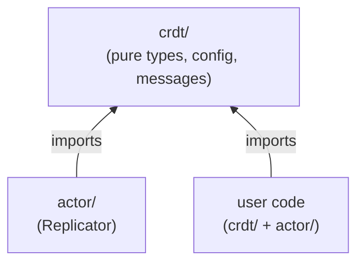
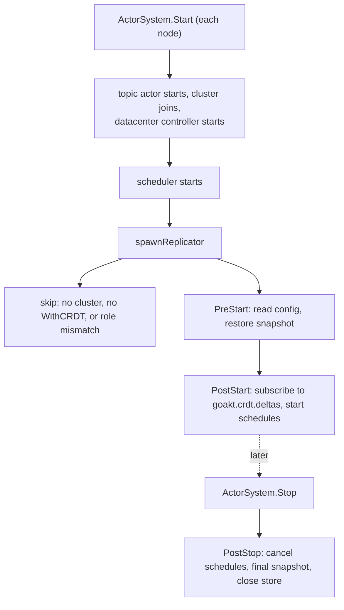
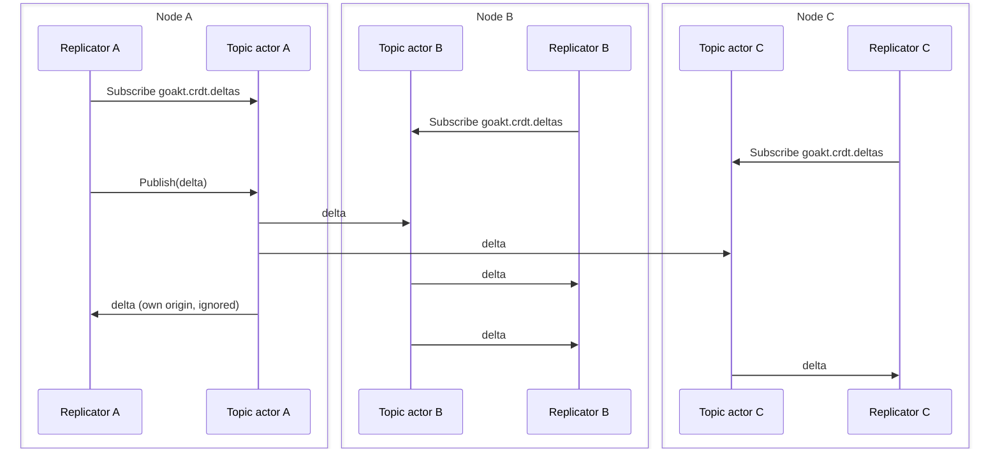
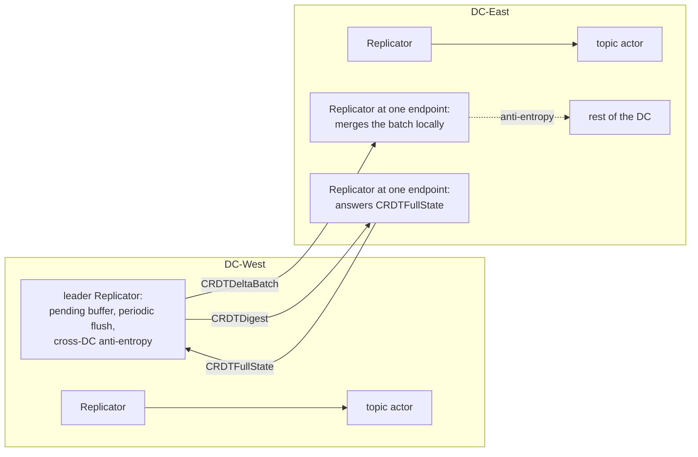

# 24. Distributed Data (CRDTs)

Verified against: `cf7a7c6d` and the uncommitted changes of branch `issue-1432` (2026-10-03): every statement checked against the code

## Contents

- [What you will learn](#what-you-will-learn)
- [24.1 Motivation and design principles](#241-motivation-and-design-principles)
  - [Package layout](#package-layout)
- [24.2 The CRDT types](#242-the-crdt-types)
  - [Keys](#keys)
- [24.3 The Replicator](#243-the-replicator)
  - [One per node](#one-per-node)
  - [Spawning](#spawning)
  - [State](#state)
  - [Lifecycle](#lifecycle)
  - [Messages](#messages)
- [24.4 Replication through the topic actor](#244-replication-through-the-topic-actor)
  - [A local update](#a-local-update)
  - [A peer delta](#a-peer-delta)
  - [Watchers](#watchers)
  - [Division of work](#division-of-work)
- [24.5 Anti-entropy](#245-anti-entropy)
  - [The content hash](#the-content-hash)
- [24.6 Consistency model](#246-consistency-model)
- [24.7 Deletion, tombstones and pruning](#247-deletion-tombstones-and-pruning)
- [24.8 Snapshots](#248-snapshots)
- [24.9 Cluster integration and multi-datacenter](#249-cluster-integration-and-multi-datacenter)
  - [Join and departure](#join-and-departure)
  - [One cluster per datacenter](#one-cluster-per-datacenter)
- [24.10 Wire format](#2410-wire-format)
- [24.11 Memory, metrics and performance](#2411-memory-metrics-and-performance)
  - [Allocation rules](#allocation-rules)
  - [Metrics](#metrics)
  - [Performance](#performance)
- [Guarantees](#guarantees)
- [Implementation details (may change)](#implementation-details-may-change)
- [Behaviours to know](#behaviours-to-know)
- [Exercises](#exercises)

## What you will learn

- Why GoAkt has replicated data types, and the design principles the implementation follows.
- The seven CRDT types: their state, their operations, their merge rule and what each one sends as a delta.
- What the Replicator system actor owns, how it is spawned, and what it does on every message it accepts.
- How a delta travels through the topic actor, and what anti-entropy repairs when a delta is lost.
- What `WriteTo` and `ReadFrom` add, and what they do not guarantee.
- How deletion, tombstones, pruning and snapshots work.
- How one cluster per datacenter exchanges CRDT state through the cluster leader.

Source files: `crdt/crdt.go`, `crdt/hash.go`, `crdt/key.go`, `crdt/gcounter.go`, `crdt/pncounter.go`, `crdt/lww_register.go`, `crdt/or_set.go`, `crdt/or_map.go`, `crdt/flag.go`, `crdt/mv_register.go`, `crdt/consistency.go`, `crdt/config.go`, `crdt/messages.go`, `actor/replicator.go`, `internal/ddata/crdt_codec.go`, `internal/ddata/crdt_serializer.go`, `internal/ddata/snapshot.go`, `internal/metric/replicator_metric.go`, `protos/internal/crdt.proto`, the CRDT key helpers in `internal/codec/codec.go`, `ClusterConfig.WithCRDT` in `actor/cluster_config.go`, and the replicator wiring in `actor/actor_system.go`.

## 24.1 Motivation and design principles

GoAkt has actors, clustering, remoting and grains. The CRDT layer adds **replicated data that actors on different nodes can read and write without coordination**. Without it, shared state means routing through one actor, using Olric maps directly, or adding an external store.

A conflict-free replicated data type (CRDT) is a data structure that can be updated independently on any node and still converges, with no locks and no consensus rounds.

| Use case | Without CRDTs | With CRDTs |
|---|---|---|
| Distributed counter (rate limits, metrics) | one actor as a bottleneck, or an external store | a `PNCounter` updated locally |
| Cluster-wide session registry | quorum writes to an Olric map | an `ORSet`, always readable locally |
| Feature flags, configuration | an external configuration service | an `LWWRegister` written from any node |
| Topic membership | a central topic actor | an `ORSet` of subscribers |
| Shopping cart | conflict resolution in user code | an `ORMap` with merge semantics |

CRDTs fit the actor model: actors encapsulate state and CRDTs say how that state merges; actors exchange messages and a delta is a message; actors are location-transparent and replication does not care where the peer is; actors tolerate partitions and CRDTs make progress during one and converge after it.

The design principles, with what the code does for each:

| Principle | Meaning in the code |
|---|---|
| Zero import cycles | `crdt/` imports nothing from GoAkt. `actor/` imports `crdt/` for `crdt.Config`, the message types and the data types. The Replicator lives in `actor/replicator.go`. |
| No breaking changes | The CRDT layer adds one method to `ActorSystem`: `Replicator() *PID`. CRDTs are opt-in through `ClusterConfig.WithCRDT`; without it no Replicator is spawned. |
| Reuse existing infrastructure | Deltas are disseminated through the topic actor (Chapter 11, §11.4). There is no separate gossip layer. |
| Actor-native | All access goes through `Tell` and `Ask` to the Replicator PID. |
| Delta-based | The Replicator publishes `Delta()`, not the stored value. How small that delta is depends on the type (§24.2). |
| CRDT-as-value | Every mutator returns a new value. Only `ResetDelta` changes a value in place. |
| GC-friendly | Capacity-hinted maps, no closures in merge paths, periodic compaction of causal metadata (§24.11). |
| Local-first, coordination-optional | A write applies locally and returns. `WriteTo` and `ReadFrom` add direct peer calls (§24.6). |
| Composable | `ORMap` values are themselves CRDTs and merge with their own rule. |

### Package layout

```
crdt/                          public, no GoAkt imports
  crdt.go                      ReplicatedData, Compactable
  hash.go                      StateHasher and the hashing of values, clocks and dots
  key.go                       Key, DataType, key constructors
  gcounter.go pncounter.go lww_register.go or_set.go or_map.go flag.go mv_register.go
  consistency.go               Coordination (Majority, All, DCMajority, DCAll)
  config.go                    Config, Option, With... options
  messages.go                  Update, Get, Subscribe, Unsubscribe, Delete, Changed and responses
actor/
  replicator.go                replicatorActor, spawnReplicator, registerReplicatorMetrics
  cluster_config.go            ClusterConfig.WithCRDT
  actor_system.go              ActorSystem.Replicator, the call to spawnReplicator in Start
  reserved.go                  replicatorType -> "GoAktReplicator"
internal/ddata/
  crdt_codec.go                EncodeCRDT, DecodeCRDT
  crdt_serializer.go           CRDTValueSerializer (protobuf + CBOR)
  snapshot.go                  Store (BoltDB)
internal/codec/codec.go        EncodeCRDTKey, DecodeCRDTKey
internal/metric/replicator_metric.go   OpenTelemetry instruments
protos/internal/crdt.proto     wire format
```



User code imports `crdt/` for types and messages and `actor/` for `Tell`, `Ask` and the actor system.

## 24.2 The CRDT types

Every type implements `ReplicatedData` (`crdt/crdt.go`):

```go
type ReplicatedData interface {
    Merge(other ReplicatedData) ReplicatedData
    Delta() ReplicatedData
    ResetDelta()
    Clone() ReplicatedData
}
```

`Merge` must be commutative, associative and idempotent, and leaves both inputs unchanged. `Delta` returns what changed since the last `ResetDelta`, or `nil`. A type may also implement `Compactable` (`CompactData() ReplicatedData`); `ORSet` and `ORMap` do. Every type implements `StateHasher` (`StateHash() uint64`, `crdt/hash.go`), the content hash that anti-entropy compares (§24.5).

| Type | State | Operations | Merge rule | Delta |
|---|---|---|---|---|
| `GCounter` | one `uint64` slot per node ID | `Increment(nodeID, n)`, `Value` (sum of slots) | per-node maximum | the **full slot value** of each node that changed, not the increment |
| `PNCounter` | two `GCounter`s, increments and decrements | `Increment`, `Decrement`, `Value` (difference, `int64`) | each `GCounter` merged on its own | the two `GCounter` deltas |
| `LWWRegister` | value, timestamp in nanoseconds, node ID | `Set(value, time, nodeID)`, `Value` | higher timestamp wins; on a tie the lexicographically higher node ID wins | the whole register |
| `ORSet` | per element a list of dots `(nodeID, counter)`, and a clock per node | `Add(nodeID, e)`, `Remove(e)`, `Contains`, `Elements`, `Len`, `Compact` | a dot is kept if the other side's clock does not cover it, or if the other side also holds it; an element with no dot left is gone (add wins) | every live dot of the nodes whose dots changed, and their clock entries (see below) |
| `ORMap` | an `ORSet` of keys and a map of key to `ReplicatedData` | `Set(nodeID, k, v)`, `Remove(k)`, `Get`, `Keys`, `Entries`, `Len`, `Compact` | keys by `ORSet` merge; a value present on both sides by its own `Merge` | the **whole map** |
| `Flag` | one boolean | `Enable`, `Enabled` | logical OR; it never returns to false | the whole flag |
| `MVRegister` | a list of values each with a dot, and a clock | `Set(nodeID, v)`, `Values` | same dot rule as `ORSet`: concurrent writes are all kept, a write covered by the other clock is dropped | the whole register |

A `Merge` given another type returns the receiver unchanged. Elements of an `ORSet`, keys of an `ORMap` and nothing else are used as Go map keys, so they must be comparable at run time.

**Node IDs are the caller's.** The `nodeID` argument of `Increment`, `Add` and `Set` is whatever the caller passes. It is not the Replicator's own identifier, which is its actor ID and is used only as the delta origin (§24.4).

**`ORMap.Set` merges.** If the key exists, the new value is merged into the old one with the value type's `Merge`; it does not replace it (`ORMap.Set` in `crdt/or_map.go`).

**`ORSet` deltas.** `ORSet.Merge` reads a clock entry as "every dot this node issued up to this counter has been seen, and the ones not listed are removed". A delta is merged with that same `Merge`, so a delta that names a node must list **all** of that node's live dots; otherwise a peer would drop elements the sender still has. `ORSet.Delta` therefore returns the current state restricted to the nodes whose dots changed since the last reset (`crdt/or_set.go`):

1. Its clock holds the set's counter for each node that produced an added or a removed dot.
2. Its entries are every **live** dot of those nodes, changed or not.

A remove travels as an absence: the removed dot is covered by the clock and not listed, so the peer drops it. A dot added and removed again before the delta is taken is not live and is not sent. Because the delta is a full state for the nodes it names, it can be merged in any order and more than once. The price is size: for a set written mostly by one node, each delta approaches the full state, as an `ORMap` delta already does. A delta that carried only the changed dots would need a dot-based causal context in the wire format, which the version-vector clock cannot express.

**`ORSet.Compact`** keeps, per element, the highest dot of each node and discards the others. `ORMap.Compact` compacts the key set and drops values whose key is gone.

### Keys

A `Key` is an ID and a `DataType` (`crdt/key.go`). The constructors `GCounterKey`, `PNCounterKey`, `LWWRegisterKey`, `ORSetKey`, `ORMapKey`, `FlagKey` and `MVRegisterKey` set the type. The ID is the store key and travels inside every delta; the type travels with it so a peer can record it. `DataType` starts at zero for `GCounterType`; the wire enum reserves zero for "unspecified", so `EncodeCRDTKey` adds one and `DecodeCRDTKey` subtracts one and rejects zero and unknown values (`internal/codec/codec.go`).

## 24.3 The Replicator

### One per node

Every participating node runs its own Replicator. There is no coordinator, no cluster singleton and no election for CRDT state: N identical actors with the same reserved name, `GoAktReplicator`, on N nodes.

Why an actor per node:

1. **Serialised access.** The store is touched only inside the Replicator's `Receive`, so it needs no lock.
2. **Backpressure.** The mailbox throttles local writers.
3. **Supervision.** A failed Replicator is restarted and rebuilds from its snapshot and from peers.
4. **Observability.** The usual actor metrics apply.
5. **Idiom.** Users talk to it like to any actor.

### Spawning

`ActorSystem.Start` calls `spawnReplicator` after the startup chain (remoting, cluster, guardians, topic actor, datacenter controller) and after the scheduler is started, because the Replicator schedules its own ticks (`actorSystem.Start` in `actor/actor_system.go`). `spawnReplicator` (`actor/replicator.go`):

1. Returns without spawning unless the cluster is enabled and `ClusterConfig.WithCRDT` was called.
2. Returns without spawning when `crdt.WithRole` names a role that the node's `ClusterConfig` roles do not contain. An empty role means every node participates.
3. Stores a `crdtConfigExtension`, holding the `crdt.Config` and the local `datacenter.DataCenter`, in the system's extensions under `goakt.crdt.config`. The actor reads its configuration from there in `PreStart`, so a supervisor restart finds it again. It is set again on every `Start`.
4. Spawns the actor as a system actor, long-lived, with a one-for-one supervisor that restarts on any error.
5. Registers the metrics when a meter is available; a failure is logged, not returned.
6. Adds the PID under the system guardian.

If `spawnReplicator` fails, `Start` shuts the Replicator down if it exists, stops the scheduler, runs the startup clean-up and returns the error.

`ActorSystem.Replicator()` returns the PID, or `nil` when CRDTs are not enabled or the role does not match. System actors are not reachable through `ActorOf`, so this is the only way to get it.

### State

`replicatorActor` (`actor/replicator.go`) holds, all owned by its turn:

| Field | Content |
|---|---|
| `store` | key ID to `crdt.ReplicatedData` |
| `keyTypes` | key ID to `crdt.DataType`, filled by `trackKey` |
| `versions` | key ID to a local `uint64` counter (§24.5) |
| `hashes` | key ID to the cached content hash of the stored value (§24.5) |
| `tombstones` | key ID to the time and node of a deletion |
| `watchers` | key ID to the PIDs subscribed to changes |
| `subscriptions` | key IDs seen; written by `trackKey`, never read |
| `pendingDeltas`, `pendingTombstones` | key ID to the one delta or the one tombstone waiting for the cross-datacenter flush, each with the sequence number of its last write (§24.9) |
| `pendingSeq` | the counter that numbers the writes to the two pending buffers |
| `dataCenterAccepted` | remote datacenter ID to the highest pending sequence number that datacenter accepted; filled on the leader only (§24.9) |
| `nodeID` | the Replicator's own actor ID, used as delta origin and as `deleted_by_node` |
| atomic counters | values read by the metrics callback on another goroutine |

### Lifecycle

`PreStart` reads the extension, builds the `internalpb.DataCenter` used as batch origin, allocates the maps, and calls `restoreFromSnapshot` (§24.8). The two pending maps and the accepted marks are allocated only when they do not exist, so what is owed to the remote datacenters survives a supervisor restart. A missing extension fails the start.

On `PostStart`, `handlePostStart`:

1. Records its PID, the topic actor, the cluster, the remoting client and a `CRDTValueSerializer`.
2. Sends `Subscribe` for the topic `goakt.crdt.deltas` to the topic actor.
3. Schedules, each under a fixed reference and each only when its interval is positive: the anti-entropy tick; the prune tick; the snapshot tick when a snapshot store is open; the cross-datacenter flush tick when cross-datacenter replication is enabled; the cross-datacenter anti-entropy tick when that is enabled too.

A scheduling error is reported with `ctx.Err`, which hands the actor to its supervisor.

`PostStop` cancels the five schedules and, when a snapshot store is open, writes a final snapshot and closes the store. An error from either is returned.



After every message, `Receive` copies the sizes of the store and of the tombstone map into two atomics for the gauges.

### Messages

| Message | From | Handler |
|---|---|---|
| `*crdt.Update` | user | `handleUpdate` |
| `*crdt.Get` | user | `handleGet` |
| `*crdt.Subscribe`, `*crdt.Unsubscribe` | user actor | `handleSubscribe`, `handleUnsubscribe` |
| `*crdt.Delete` | user | `handleDelete` |
| `*Terminated` | death watch | `handleTerminated` |
| `*internalpb.CRDTDelta` | topic actor, or a peer directly | `handleProtoDelta`, then `handleDelta` |
| `*internalpb.CRDTTombstone` | topic actor, or a peer directly | `handleProtoTombstone`, then `applyTombstone` |
| `*internalpb.CRDTReadRequest` | peer Replicator | `handleReadRequest` |
| `*internalpb.CRDTDigest`, `*internalpb.CRDTFullState` | peer Replicator | `handleDigest`, `handleFullState` |
| `*internalpb.CRDTDeltaBatch` | Replicator of another datacenter | `handleIncomingBatch` |
| the five tick types | scheduler | the matching handler |
| `*dataCenterDigestRequest` | nothing in the library sends it | `handleDataCenterDigestRequest` replies with the local digest |

The user messages are matched through small interfaces (`updateCommand`, `getCommand`, `subscribeCommand`, `unsubscribeCommand`, `deleteCommand`) that the `crdt` message structs implement, so `actor/` needs no type switch on `crdt` structs. The `SubscribeAck` the topic actor sends back is accepted and ignored. Anything else is unhandled.

The user-facing API (`Update`, `Get`, `Subscribe`, `Unsubscribe`, `Delete`, `Changed`, the options of `WithCRDT`) is documented in `docs/advanced/distributed-data.mdx`. In short: `Update` carries a key, an initial value, a `Modify` function and an optional `WriteTo`; `Get` carries a key and an optional `ReadFrom` and is answered with a `GetResponse`; `Subscribe` registers the sending actor for `Changed` messages; `Delete` carries a key and an optional `WriteTo`.

## 24.4 Replication through the topic actor

All Replicators subscribe to one topic, `goakt.crdt.deltas`. **One topic, all keys**: the delta carries the key ID, the data type, the origin and the encoded state, and the receiver routes on the key ID. The topic actor provides delivery to local subscribers, a send to the topic actor of every peer, a time-limited duplicate filter keyed by sender, topic and message ID, and removal of terminated subscribers (Chapter 11, §11.4).



Each Replicator holds its own store, and each subscribes to the topic at its local topic actor.

### A local update

`handleUpdate` (`actor/replicator.go`):

1. If the key has a tombstone, do nothing. An `Ask` still receives an empty `UpdateResponse`; there is no error.
2. Take the current value, or `Initial` when the key is new, and record the key's type.
3. Call `Modify`, take the result's `Delta()`, call `ResetDelta()` on the result, store it with `setValue`, and increment the key's version.
4. If the delta is not `nil`: with no `WriteTo`, `publishDelta`; otherwise `coordinatedWrite` (§24.6), which also ends with `publishDelta`.
5. Send `Changed` to the key's watchers.
6. Reply with `UpdateResponse` when there is a sender.

`publishDelta` encodes the delta as an `internalpb.CRDTDelta` with the Replicator's ID as origin, and tells the topic actor to publish it under the message ID `<nodeID>:<sequence>`. It counts the publish, and when cross-datacenter replication is enabled it hands the delta, not yet encoded, to `bufferDelta` (§24.9). An encoding error is reported with `ctx.Err`.

Every write to `store` after `PreStart` goes through `setValue`, which also drops the key's cached content hash (§24.5). `restoreFromSnapshot` fills `store` directly in `PreStart`, while `hashes` is still empty.

`Modify` runs inside the Replicator's turn. It must be a pure function of its argument.

### A peer delta

`handleDelta`:

1. Ignore it when the origin is this Replicator. The topic actor delivers a publication to local subscribers too, so the publisher receives its own delta.
2. Count it as received.
3. Ignore it when the key has a tombstone.
4. If the key is unknown, store the delta as the value, record the type, increment the version and notify the watchers.
5. Otherwise call `mergeValue`, which stores `current.Merge(delta)` and reports whether the content hash of the value changed, and count a merge.
6. Increment the version and notify the watchers only when the value changed.

A delta that changes nothing, such as a second delivery of the same delta, is merged and counted as a merge and has no other effect. `mergeValue` reports a change for a value whose type has no content hash.

### Watchers

`handleSubscribe` appends the sender to the key's watcher list and watches it. A `Subscribe` that arrives with a nil sender is ignored. One sent with the package-level `Tell` carries the system's `NoSender` PID as its sender (`Tell` in `actor/api.go`), so that PID is registered as a watcher and is sent `Changed` messages it does not handle. `handleUnsubscribe` removes the first matching PID by swap-remove. `handleTerminated` removes the dead actor from every key. `notifyChanged` sends a `crdt.Changed` carrying the key and the current value to each watcher that is running and drops those that are not. The Replicator stores only the key's ID and type, so it rebuilds the `Key` from them (`crdtKeyOf` in `actor/replicator.go`). Watchers hear of updates, peer deltas and anti-entropy merges; they do not hear of deletions or of a coordinated read that changed the stored value.

### Division of work

| The Replicator | The topic actor |
|---|---|
| owns the store | keeps topic subscriptions |
| applies mutations and merges | delivers to local subscribers |
| extracts and publishes deltas | sends to peer topic actors over remoting |
| tracks watchers | filters duplicate publications |
| runs anti-entropy and coordination | removes terminated subscribers |

## 24.5 Anti-entropy

Publication through the topic actor can lose messages: a partition, a node restart, a topic actor restart. Anti-entropy is the periodic repair. It uses a direct `RemoteTell` between Replicators, not the topic, because it is a point-to-point exchange.

On each `antiEntropyTick` (default every 30 seconds), `handleAntiEntropy`:

1. Returns when there is no cluster, no remoting client, or no peer.
2. Picks one peer at random and looks up its Replicator by reserved name.
3. Sends it a `CRDTDigest` built by `buildDigest`: one entry per stored key with the key, its type, its local version and the content hash of its value, and every tombstone this node retains that is within the tombstone TTL.
4. Counts the round, whether or not the send succeeded. A failed lookup is not counted.

The peer's `handleDigest` first applies every tombstone in the digest by the rule of `applyTombstone` (§24.7), so a key the sender deleted is removed before anything is compared. It then answers with a `CRDTFullState` holding its full value of every key the sender needs, and its own tombstone for every key the digest lists that it has deleted, when that tombstone is within its TTL. A key the digest lacks is always sent; for a key both nodes hold, `differsFromPeer` decides:

| The digest entry | The key is sent when |
|---|---|
| the key is absent from the digest | always |
| carries a content hash | the hash differs from the local one, whatever the versions |
| carries no content hash | the local version is higher than the entry's |

It sends nothing when no key and no tombstone qualifies. A tombstoned key is not in the store, so it is never sent. `handleFullState` on the first node applies the tombstones of the answer by the same rule, then skips tombstoned keys. It stores an unknown key, increments its version and notifies its watchers. It merges a known key with `mergeValue`, and increments the version and notifies the watchers only when the value changed.

**The exchange is a pull, and it converges.** A round is one-directional: A sends its digest, receives B's state and merges it, and B learns nothing. Every node sends its own digest to a random peer on every tick, so for any two nodes each one sooner or later pulls from the other. Once A has pulled from B and B from A, both hold the merge of the two states, their hashes are equal, and the rounds between them send nothing. Neither direction depends on the other node's choice of peer, so neither can starve. When only one node is behind, the node that is ahead still receives the older state; the merge changes nothing and is neither counted in the version nor announced.

**Deletions travel both ways.** For as long as one node retains a tombstone, every peer it exchanges with ends up without the key: the digest carries the deletion to the peer, and the peer's answer carries its own deletions back for the keys the digest listed. A tombstone for a key the digest does not list is not answered; the sender does not have the key. A node that lost its own tombstones in a restart is told of them again. A node that predates the fields sends digests and answers without tombstones, and ignores the tombstones it receives; against it, deletions travel neither way.

**Versions are local counters.** A key's version is incremented on every local update and on every received delta or full-state entry that changes the value. It is not a vector clock and two nodes do not count the same events, so two nodes can hold different values under the same version. The version is kept in the digest and in the snapshot, and it decides an exchange only against a node that sends no content hash.

A restarted Replicator starts from its snapshot, or empty, and is filled by the answers to its own digests.

### The content hash

`StateHasher` (`crdt/hash.go`) is an optional interface with one method, `StateHash() uint64`. All seven types implement it. The hash is **canonical**: two replicas that hold the same replicated state return the same hash, whatever the order of the operations and merges that produced it, whatever the iteration order of their maps, and whichever node computes it. Two different states return different hashes except for a 64-bit collision.

The construction is the same for every type:

1. Hash each independent entry of the state on its own into 64 bits with xxh3.
2. Add the entry hashes modulo 2^64. Addition is commutative and associative, so the order in which the entries are visited cannot matter.
3. Hash the sums once more, in a fixed order, seeded with a tag that names the type (`hashParts`). The tag keeps an empty `GCounter` and an empty `ORSet` apart, and the fixed order keeps the increments of a `PNCounter` apart from its decrements.

| Type | Entries that are summed | Other parts |
|---|---|---|
| `GCounter` | each non-zero slot: node ID and count | |
| `PNCounter` | the slots of the increments; the slots of the decrements | |
| `Flag` | | the boolean |
| `LWWRegister` | | the timestamp, the node ID, the value |
| `MVRegister` | each value with its dot | the clock |
| `ORSet` | each element with its live dots | the clock |
| `ORMap` | each present key with the content hash of its value | the hash of the key set |

Three rules decide what counts as the same state:

- **A zero slot is no slot.** `hashNodeCounters` skips a counter at zero, in counter slots and in clocks, because a slot at zero and a missing slot merge identically.
- **Only live dots count.** `hashLiveDots` takes, per element, the highest dot of each node. These are the dots `ORSet.Compact` keeps, so a set hashes the same before and after compaction, and two nodes that prune at different times do not see a difference.
- **Bookkeeping does not count.** The pending delta and the changed marks are not replicated and take no part.

User values (register values, set elements, map keys) are hashed by `hashValue`. The bytes hashed are a canonical encoding of the value, seeded with the name of its Go type, so the integer 1 and the string "1" differ. A string is hashed directly. A `proto.Message` is marshalled deterministically. Any other value is encoded as core deterministic CBOR, which sorts map keys. A pointer and the value it points to hash alike. Deterministic protobuf marshalling is stable for one build of a message type and not across protobuf versions; two nodes that disagree on the bytes of a value see different hashes for the same state, and the only consequence is an exchange that changes nothing.

**The cache.** The Replicator keeps the hash of each stored value in `hashes`. `contentHash` returns the cached hash or computes and caches it. `setValue`, through which every write to `store` after `PreStart` goes, drops the entry, and `removeValue` drops it with the key. `restoreFromSnapshot` writes to `store` directly in `PreStart`, when `hashes` is still empty. So a local update computes no hash; a received delta or full-state entry for a known key computes the hash of the merged value, and of the value before the merge when that one is not cached; and a key that has not changed since the last round costs one map lookup in `buildDigest`.

**Cost.** `BenchmarkStateHash` in `crdt/benchmark_test.go` measures the hash on an Apple M1: about 190 ns for a `GCounter` with five slots; about 24 ns per element for an `ORSet` of strings, with no allocation; about 66 ns per element and one allocation each for an `ORSet` of integers, which take the CBOR path. A set of 10,000 strings hashes in about 0.23 ms. The cost is linear in the size of the value, as the merge that precedes it is.

**Mixed versions.** The hash travels in the optional field `state_hash` of `CRDTDigestEntry`. A node whose code has no such field sends entries without it and ignores it in the entries it receives. For such an entry `differsFromPeer` applies the version rule. Between a node that sends the hash and one that does not, both directions therefore follow the version rule.

## 24.6 Consistency model

By default every operation is **local-first**. A write applies to the local store and publishes; a read returns the local value. Convergence is bounded by the topic actor's delivery and, when that fails, by the anti-entropy interval.

`Update`, `Delete` and `Get` accept a `crdt.Coordination` level (`crdt/consistency.go`): `Majority`, `All`, `DCMajority`, `DCAll`. The Replicator implements `Majority` and `All` against the peers returned by the cluster, which exclude the local node. `targetCount` returns `peers/2 + 1` for `Majority`, capped at the number of peers, all peers for `All`, and zero for anything else. `selectPeers` picks that many at random with a partial Fisher-Yates shuffle. `DCMajority` and `DCAll` are defined but not wired: they select no peer.

| Operation | With `Majority` or `All` |
|---|---|
| `Update` (`coordinatedWrite`) | looks up each selected peer's Replicator and sends it the delta with `RemoteTell`, one after the other, then publishes the delta on the topic as usual |
| `Delete` (`coordinatedTombstone`) | sends the tombstone to each selected peer with `RemoteTell`, then publishes it on the topic as usual |
| `Get` (`coordinatedRead`) | sends a `CRDTReadRequest` to each selected peer with `RemoteAsk` and the coordination timeout (default 5 seconds), merges every answer into the local value, stores the result and returns it |

Coordination is **best-effort**. A peer whose lookup, send or ask fails is logged or skipped; the operation does not fail. When the peer list is empty or cannot be read, a write falls back to the topic alone and a read returns the local value. A `RemoteTell` carries no acknowledgement from the peer's Replicator. `WriteTo` and `ReadFrom` therefore narrow the staleness window; they do not give quorum intersection. With or without them the system is eventually consistent: replicas that have applied the same updates hold the same state.

A coordinated write reaches a selected peer twice, once directly and once through the topic. The merge is idempotent, and the second delivery changes nothing, so the peer's version and its watchers see one event.

All of this runs in the Replicator's turn. A coordinated read with slow peers holds the Replicator for up to the timeout per peer.

## 24.7 Deletion, tombstones and pruning

`handleDelete`:

1. Removes the key from `store`, `versions` and `hashes` (`removeValue`).
2. Records a tombstone with the current time and this Replicator's ID.
3. **If the key's type is known locally**: builds a `CRDTTombstone`, sends it to selected peers when `WriteTo` is set, publishes it on the topic under the message ID `<nodeID>:del:<sequence>`, and hands it to `bufferTombstone` when cross-datacenter replication is enabled (§24.9).
4. Replies with `DeleteResponse` when there is a sender.

A key this node has never seen gets a local tombstone and nothing is published.

`handleProtoTombstone`, for a tombstone from the topic or from a batch, ignores one this node issued itself and hands the rest to `applyTombstone`. The anti-entropy exchange hands its tombstones to `applyTombstone` directly, so a node that lost its own tombstones in a restart takes them back. `applyTombstone` is the one rule for a deletion made elsewhere:

1. A tombstone this node already holds for the key, with the same or a later deletion time, leaves everything as it is. A tombstone that comes back on every anti-entropy round is applied once, and two nodes that deleted the same key independently settle on the later deletion.
2. Otherwise the key is removed, whenever its value was written, and so is its pending cross-datacenter delta. Watchers are not notified.
3. The tombstone is recorded with the sender's time and node, unless the deletion is older than the tombstone TTL: such a tombstone has nothing left to reject, would be pruned on the next tick, and is not kept.

While a tombstone exists, local updates, peer deltas and full-state entries for the key are ignored. This prevents a late delta from resurrecting the key.

On each `pruneTick` (default every 5 minutes), `handlePrune`:

1. Removes every tombstone older than the tombstone TTL (default 24 hours).
2. Replaces every stored value that implements `Compactable` with its `CompactData()`. The content hash of the value is the same after compaction (§24.5).

After a tombstone expires the key can be created again, by a new update or by a peer that never received the tombstone. The TTL must outlast the time a deletion needs to reach every replica, across datacenters too.

## 24.8 Snapshots

Snapshots are enabled when both `WithSnapshotInterval` (default zero, disabled) and `WithSnapshotDir` are set.

`ddata.Store` (`internal/ddata/snapshot.go`) is a BoltDB file `crdt-snapshot.db` in that directory, mode `0600`, with one bucket `crdt_snapshots`. It stores bytes: the Replicator does the encoding. `Save` clears the bucket and writes every entry in one transaction, keyed by key ID. `Load` returns every entry. `Close` is idempotent; `Save` and `Load` on a closed store return `ErrStoreClosed`; `Remove` deletes the file and requires a closed store.

`restoreFromSnapshot`, in `PreStart`:

1. Does nothing when snapshots are not configured.
2. Opens the store. A failure to open or to load is logged as a warning and the Replicator starts without that data; it does not fail the start.
3. For each entry, decodes the key and the data with a `CRDTValueSerializer`; an entry that fails is skipped with a warning. The value, its type and its **version** are restored.

`handleSnapshot`, on each `snapshotTick`, builds one `CRDTSnapshotEntry` per stored key (`buildSnapshotEntries`) and saves them. An error is logged. `PostStop` does the same and returns the error. `buildSnapshotEntries` fails for the whole snapshot when one stored key has no recorded type or cannot be encoded.

Tombstones, watchers and the cross-datacenter buffers are not part of the snapshot.

## 24.9 Cluster integration and multi-datacenter

### Join and departure

**Join.** The new node spawns its Replicator, empty or restored from its snapshot. The other nodes' topic actors send to every current peer, so later publications reach it. It catches up on existing state through anti-entropy.

**Departure.** The remaining nodes stop sending to it. No CRDT state is lost: it exists on the other replicas. The slots a departed node contributed to counters stay; they are historical contributions. Nothing prunes them.

**Olric.** The CRDT store is independent of Olric. Olric keeps the actor and grain registry with quorum semantics; CRDTs are a separate, eventually consistent layer.

**Roles.** With `crdt.WithRole`, nodes without the role run no Replicator and `Replicator()` returns `nil` there.

### One cluster per datacenter

Each datacenter runs an independent GoAkt cluster with its own discovery. A control plane (NATS JetStream or etcd) holds one record per datacenter with its endpoints and a leased liveness; each cluster's leader registers and renews it and caches the active records.

| Layer | Mechanisms | Scope |
|---|---|---|
| Within a datacenter | membership, Olric, topic actor, deltas, anti-entropy, coordinated reads and writes | the nodes of one cluster |
| Across datacenters | control-plane records, direct remoting, batch flush, cross-datacenter anti-entropy | all active datacenters |

Cross-datacenter replication is handled by the same Replicator. There is no bridge actor.



It is opt-in: `crdt.WithDataCenterReplication()` enables buffering and the flush tick, and `ClusterConfig.WithDataCenter` must supply the local datacenter and a running controller.

**Buffering.** Every Replicator, leader or not, keeps what it has published and not yet handed to the remote datacenters, **one entry per key**:

- `bufferDelta` stores the first delta of a key in `pendingDeltas` and merges every further delta of that key into it with the type's `Merge`. A receiver that merges the one pending delta reaches the same value as a receiver that merges the deltas one after the other.
- `bufferTombstone` stores the tombstone of a key in `pendingTombstones` and removes the key's pending delta: the receiver deletes the key, so the change before the deletion is not worth sending. A tombstone received from a peer also removes the key's pending delta.
- While a key's tombstone exists, `handleUpdate` ignores updates of the key, so no delta of it enters the buffer. A key updated again after its tombstone expired, while that tombstone is still pending, is sent as both. The receiver applies the tombstone before the delta and ends with the new incarnation of the key (see Receive below).

Every write to a pending entry takes the next value of `pendingSeq`: a new delta, a merge into the pending delta, a tombstone. A merged delta is cumulative since it entered the buffer, so sending it to a datacenter that accepted an earlier form is one more idempotent merge.

The buffers hold at most one entry per key changed since every remote datacenter on record last caught up, so at most one per key in the store. A non-leader buffers so that, when it becomes the leader, it has its own latest changes to send.

**Flush.** There is one buffer for all datacenters and one **accepted mark** per datacenter: `dataCenterAccepted` maps a remote datacenter to the highest sequence number of a batch it accepted from this node. The key is `DataCenter.ID()` of the control-plane record, the zone, region and name joined, which is also the ID the record is registered under (`datacenter/data_center.go`). On each `dataCenterFlushTick` (default every 5 seconds), `handleDataCenterFlush`:

1. Returns when both buffers are empty, or when there is no cluster or remoting client.
2. When this node is not the cluster leader, forgets its marks and returns. The buffers are kept.
3. Returns when there is no controller. When the controller's cache is stale and it is configured to fail on a stale cache, counts a stale skip and returns.
4. `sendPendingToRemoteDataCenters` encodes every pending delta once. For each active record that is not the local datacenter and has endpoints, `buildPendingBatch` builds a `CRDTDeltaBatch` of the entries stamped **above that datacenter's mark**, with the origin datacenter and the send time. An empty batch is not sent.
5. `sendToDataCenter` shuffles the endpoints and tries each one, a lookup and a `RemoteTell` under the send timeout (default 10 seconds), until one succeeds. A success counts one send and raises the datacenter's mark to the highest sequence number in the batch that was sent. A failure leaves the mark.
6. `dropAcceptedPending` forgets the mark of every datacenter that is not on record, then removes every entry stamped at or below the lowest mark of the remote datacenters on record. A datacenter on record without a mark, or without an endpoint, counts as zero.

What follows from these steps:

- A datacenter that did not take its batch is sent the entries again on the next tick, with what was buffered in between. The datacenters that took theirs are sent nothing until an entry changes.
- An entry changed after a datacenter accepted it carries a higher sequence number and is sent to that datacenter again, in its merged form.
- A datacenter that leaves the records stops holding entries back. One that appears has no mark and is sent everything still pending.
- With no remote datacenter on record nothing is removed.
- A node that becomes the leader has entries and no marks. It sends everything pending to every datacenter; for those that received it from the previous leader these are idempotent merges and deletions. A node that stops being the leader forgets its marks on its next tick.
- A key with both a pending tombstone and a pending delta is sent as both, in one batch, to a datacenter that has accepted neither, and as the delta alone to one that has accepted the tombstone.

The flush runs inside one turn of the actor, sends included, so no entry is written while it runs. The mark is still taken from the batch that was sent, not from `pendingSeq`.

**Receive.** `handleIncomingBatch` drops a batch whose origin has the local name, region and zone. Otherwise it records the lag (receive time minus send time), counts the batch, and passes each tombstone to `handleProtoTombstone` and then each delta to `handleProtoDelta`. **Tombstones come first.** A batch holds a tombstone and a delta of one key only when the sender deleted the key and created it again after its tombstone expired. The tombstone removes the incarnation held by the receiver; it is older than the TTL, so it is not kept; the delta then creates the new incarnation, and the receiver holds what the sender holds. A tombstone still within its TTL is kept and rejects a delta of its key in the same batch, as it rejects any other. It does **not** republish on the local topic: the other nodes of the receiving datacenter converge through their own anti-entropy.

**Cross-datacenter anti-entropy.** With `crdt.WithDataCenterAntiEntropy()` and a positive interval (default 2 minutes), on each tick the leader picks one remote datacenter with endpoints at random, one of its endpoints at random, and sends its digest there under the send timeout (`handleDataCenterAntiEntropy`). The remote Replicator applies the digest's tombstones and answers with a `CRDTFullState` exactly as within a cluster, deletions included, so a round **pulls**: the leader that sent the digest receives what the remote node has more of. This is what carries data written on non-leader nodes, whose buffers are flushed only if they become the leader: every node of the origin datacenter holds that data through the topic, and the other datacenter's leader pulls it on one of its own rounds.

**Failure modes.**

| Failure | Behaviour |
|---|---|
| Leader changes | the new leader flushes its own buffer on its next tick; anti-entropy repairs what was missed |
| Partition between datacenters | each side continues and its leader keeps its pending entries; state converges when batches and anti-entropy resume |
| Control plane unavailable | no remote endpoints, so nothing is sent and the pending entries wait; replication inside the datacenter is unaffected |
| One node fails | handled inside its cluster |
| Stale datacenter cache | with fail-on-stale, the flush is skipped and counted, the pending entries wait, and the anti-entropy round is skipped; otherwise the cached list is used |
| Leader has no Replicator | when `crdt.WithRole` excludes the leader, neither flush nor cross-datacenter anti-entropy runs |

## 24.10 Wire format

`protos/internal/crdt.proto` defines everything Replicators exchange.

| Message | Use |
|---|---|
| `CRDTKey` | key ID and `CRDTDataType` |
| `CRDTData` | a `oneof` over `GCounterData`, `PNCounterData`, `LWWRegisterData`, `ORSetData`, `ORMapData`, `FlagData`, `MVRegisterData` |
| `CRDTDelta` | key, origin node, data |
| `CRDTTombstone` | key, deletion time in nanoseconds, deleting node |
| `CRDTDigest`, `CRDTDigestEntry` | key, version and the optional content hash `state_hash` per entry; the sender's live tombstones in `tombstones` |
| `CRDTFullState`, `CRDTFullStateEntry` | key and data per entry; the responder's live tombstones for the keys the digest listed in `tombstones` |
| `CRDTReadRequest`, `CRDTReadResponse` | key and requesting node; key, data (absent when the key is unknown) and answering node |
| `CRDTSnapshotEntry` | key, data, version |
| `CRDTDeltaBatch` | deltas, tombstones, origin `DataCenter`, send time in nanoseconds |

Per type: `GCounterData` is a map of node to count; `PNCounterData` is two of them; `LWWRegisterData` is value bytes, timestamp and node; `ORSetData` is a list of entries (element bytes and dots) and a clock; `ORMapData` is a list of entries (key bytes and a nested `CRDTData`) and the key set as `ORSetData`; `FlagData` is a boolean; `MVRegisterData` is a list of entries (value bytes, node, counter) and a clock.

`EncodeCRDT` and `DecodeCRDT` (`internal/ddata/crdt_codec.go`) convert between `crdt.ReplicatedData` and `CRDTData`. They read state through the exported accessors of the types (`State`, `RawState`) and rebuild through `GCounterFromState`, `PNCounterFromState`, `LWWRegisterFromState`, `ORSetFromRawState`, `ORMapFromRawState`, `MVRegisterFromRawState`; a flag is rebuilt with `NewFlag().Enable()`. A decoded value carries no pending delta, except that an enabled flag is marked changed.

User values (register values, set elements, map keys) are `any`. `CRDTValueSerializer` (`internal/ddata/crdt_serializer.go`) encodes a `proto.Message` with the protobuf serializer and everything else with the CBOR serializer; on decode it tries protobuf first and falls back to CBOR. A value that neither can encode fails the encoding of the whole delta.

## 24.11 Memory, metrics and performance

### Allocation rules

| Rule | Rationale |
|---|---|
| Copy-on-write values | every mutator returns a new value; no hidden shared state |
| Pre-sized maps | `Clone`, `State`, `Delta` and merge paths use a capacity hint where the size is known |
| Snapshot accessors | `ORSet.Elements` and `ORMap.Entries` return fresh containers, so internal maps do not escape |
| No closures in merge paths | `Merge` and `Delta` allocate none; `Update.Modify` is the user's and is outside them |
| Concrete counter state | counters hold `map[string]uint64`; set, map and register elements are `any` because they must be comparable at run time |

| Type | What a merge allocates |
|---|---|
| `GCounter` | a clone of the receiver, then per-node maximum in place |
| `PNCounter` | twice that |
| `LWWRegister`, `Flag` | one small struct; the winning value is referenced, not copied |
| `ORSet` | new entry and clock maps; dot slices grow with concurrent adds until `Compact` |
| `ORMap` | a key-set merge and one merge or clone per value |
| `MVRegister` | a new clock map and entry slice |

In the Replicator: pending entries are removed one at a time with `delete` (`dropAcceptedPending`, `applyTombstone`, `bufferTombstone`) and the pending maps are never reallocated, so they keep their buckets; the content hash of a value is cached until the value changes; the origin datacenter message is built once in `PreStart`; metric values are atomics because the metrics callback runs on another goroutine; watcher removal is a swap-remove; `buildDigest` allocates the digest entries and keys as two contiguous slices.

### Metrics

Registered by `registerReplicatorMetrics` with the attribute `actor.system` (`actor/replicator.go`, `internal/metric/replicator_metric.go`):

| Instrument | Kind | Value |
|---|---|---|
| `crdt.replicator.store.size` | gauge | keys in the store |
| `crdt.replicator.merge.count` | counter | merges into an existing key, from deltas and from full-state entries |
| `crdt.replicator.delta.publish.count` | counter | deltas handed to the topic actor |
| `crdt.replicator.delta.receive.count` | counter | deltas received from another origin |
| `crdt.replicator.coordinated.write.count` | counter | updates with `WriteTo` set |
| `crdt.replicator.coordinated.read.count` | counter | reads with `ReadFrom` set |
| `crdt.replicator.antientropy.count` | counter | digests sent or attempted |
| `crdt.replicator.tombstone.count` | gauge | tombstones held |
| `crdt.replicator.crossdc.send.count` | counter | batches accepted, one per remote datacenter; an empty batch is not sent and not counted |
| `crdt.replicator.crossdc.receive.count` | counter | batches received from another datacenter |
| `crdt.replicator.crossdc.replication.lag` | gauge, milliseconds | lag of the last received batch; stored in nanoseconds and divided when observed |
| `crdt.replicator.crossdc.stale.skip.count` | counter | flushes skipped on a stale datacenter cache |

### Performance

- **Memory.** All state is in memory and grows with the number of keys and the size of each value. `ORSet` and `ORMap` carry dots that grow with adds until compaction. Tombstones live for their TTL.
- **Network.** The topic actor sends every publication to every peer. The design accepts this for large clusters because deltas are small and the rate is the update rate. Anti-entropy is one digest to one peer per interval. Cross-datacenter batching turns an interval's deltas into one message per datacenter, with one delta per key.
- **CPU.** Merges are map walks and comparisons. The Replicator is one actor, so its throughput is bounded by one core.

The design set these targets; no test enforces them: more than 500,000 local updates per second on one `PNCounter` key; more than 1,000,000 local reads per second; convergence under one second at the 95th percentile for five nodes and under three seconds for fifty. `crdt/benchmark_test.go` reports allocations for the merge path of every type, for the mutators of every type but `Flag`, for clone and delta on every type but `LWWRegister` (which has neither) and `ORMap` (which has clone only), and for the content hash. Merges clone before combining, so their allocations scale with the state size.

## Guarantees

| Statement | Enforced by |
|---|---|
| Each type's `Merge` is commutative and idempotent and leaves its inputs unchanged; every type but `LWWRegister` is also tested for associativity; a merge with another type returns the receiver | `TestGCounter` in `crdt/gcounter_test.go`, `TestPNCounter` in `crdt/pncounter_test.go`, `TestLWWRegister` in `crdt/lww_register_test.go`, `TestORSet` in `crdt/or_set_test.go`, `TestORMap` in `crdt/or_map_test.go`, `TestFlag` in `crdt/flag_test.go`, `TestMVRegister` in `crdt/mv_register_test.go` |
| A `GCounter` delta holds the full slot value of the nodes that changed | `TestGCounter` in `crdt/gcounter_test.go` |
| In an `LWWRegister` the higher timestamp wins, and on a tie the higher node ID | `TestLWWRegister` in `crdt/lww_register_test.go` |
| An `ORSet` keeps an element added concurrently with its removal | `TestORSet` in `crdt/or_set_test.go` |
| An `ORSet` delta never removes an element its sender still has, omits an element added and removed before it was taken, and converges in any delivery order with duplicates; delta merge is commutative, associative and idempotent | `TestORSet` in `crdt/or_set_test.go` |
| A `Changed` notification carries the key that changed | `TestReplicatorChangedCarriesKey` in `actor/replicator_test.go` |
| A coordinated read of a key the node did not know records the key's type, so it is snapshotted and advertised correctly | `TestReplicatorCoordinatedReadTracksUnknownKey` in `actor/replicator_test.go` |
| `ORSet.Compact` keeps one dot per node per element; `ORMap.Compact` leaves a map with no orphaned value | `TestORSetCompact` in `crdt/or_set_test.go`; `TestORMapCompact` in `crdt/or_map_test.go` |
| An `MVRegister` keeps concurrent writes of different nodes and drops a value both sides have seen superseded | `TestMVRegister` in `crdt/mv_register_test.go` |
| The configuration defaults are 30 s anti-entropy, 5 min prune, 24 h tombstone TTL, 5 s coordination timeout, snapshots off, cross-datacenter replication off with a 5 s flush, a 2 min anti-entropy and a 10 s send timeout | `TestConfig` in `crdt/config_test.go` |
| A Replicator is spawned on every node with `WithCRDT`, on none without it, and only on nodes holding the configured role | `TestReplicatorCluster` in `actor/replicator_test.go` |
| An update on one of three nodes is readable on all three; concurrent counter updates on three nodes converge; an `ORSet` with one add per node holds all three elements everywhere | `TestReplicatorCluster` in `actor/replicator_test.go` |
| A peer delta merges into the store; a delta with the local origin is ignored; a delta for an unknown key creates it | `TestReplicatorActor` in `actor/replicator_test.go` |
| After a delete, `Get` returns no data and an update to the key is answered and changes nothing; a peer's tombstone removes the key and one's own is ignored | `TestReplicatorTombstones` in `actor/replicator_test.go` |
| Pruning removes tombstones older than the TTL and compacts an `ORSet` in the store | `TestReplicatorPrune` and `TestReplicatorPruneCompacts` in `actor/replicator_test.go` |
| The digest has one entry per stored key with its version | `TestReplicatorDigest` in `actor/replicator_test.go` |
| Each type's content hash is the same for the same state reached through different operation orders and through merges in either direction, differs for different states, and is unchanged by `Clone` and `ResetDelta`; for `GCounter`, `LWWRegister`, `MVRegister`, `ORSet` and `ORMap` also by a round trip through the raw state | `TestGCounterStateHash` in `crdt/gcounter_test.go`, `TestPNCounterStateHash` in `crdt/pncounter_test.go`, `TestFlagStateHash` in `crdt/flag_test.go`, `TestLWWRegisterStateHash` in `crdt/lww_register_test.go`, `TestMVRegisterStateHash` in `crdt/mv_register_test.go`, `TestORSetStateHash` in `crdt/or_set_test.go`, `TestORMapStateHash` in `crdt/or_map_test.go` |
| Compaction does not change the content hash of an `ORSet` or an `ORMap`; only the highest dot of a node counts for an element | `TestORSetStateHash` in `crdt/or_set_test.go`, `TestORMapStateHash` in `crdt/or_map_test.go`, `TestHashLiveDots` in `crdt/hash_test.go` |
| A user value hashes by type and content: map order inside it does not matter, a pointer hashes like its value, and protobuf messages hash by content | `TestHashValue` in `crdt/hash_test.go` |
| A digest entry carries the content hash of the stored value. Different hashes send the key's state whatever the versions; equal hashes send nothing whatever the versions; an entry without a hash follows the version rule; a key the peer lacks is sent | `TestReplicatorAntiEntropyContentHash` in `actor/replicator_test.go` |
| Two Replicators holding different values of a key at the same version hold the merged value after each has pulled from the other, and further rounds change no version | `TestReplicatorAntiEntropyRepairsEqualVersions` in `actor/replicator_test.go` |
| A delta delivered twice advances the version once and sends one `Changed`; a full-state entry that changes nothing advances no version and sends no `Changed` | `TestReplicatorUnchangedMergeIsSilent` in `actor/replicator_test.go` |
| `Majority` of 1, 2, 3 and 5 peers is 1, 2, 2 and 3; `All` is every peer; no level is zero | `TestReplicatorTargetCount` in `actor/replicator_test.go` |
| A write with `Majority` or `All` is visible on all three nodes; a read with `Majority` or `All` returns the merge of the peers' values; a delete with `Majority` removes the key on all three | `TestReplicatorCluster` in `actor/replicator_test.go` |
| A full-state entry for a tombstoned key is skipped | `TestReplicatorHandleDigestAndFullState` in `actor/replicator_test.go` |
| A read request is answered with the local value, or with no data for an unknown key | `TestReplicatorHandleReadRequest` in `actor/replicator_test.go` |
| A snapshot restores value, type and version; stopping the system writes a final snapshot; a stored key without a type fails the snapshot build | `TestReplicatorRestoreFromSnapshot`, `TestReplicatorPostStopWithSnapshot` and `TestReplicatorBuildSnapshotEntriesErrors` in `actor/replicator_test.go` |
| The snapshot store round-trips entries, overwrites on save, and refuses use after `Close` | `TestStore` in `internal/ddata/snapshot_test.go` |
| A batch from another datacenter merges its deltas and applies its tombstones; a batch from the local datacenter is dropped; a batch without origin is processed | `TestReplicatorIncomingBatch` and `TestReplicatorIncomingBatchEdgeCases` in `actor/replicator_test.go` |
| A non-leader sends no batch; a leader does and empties its buffers; a stale cache with fail-on-stale skips the flush and counts it | `TestReplicatorDataCenterFlushNonLeaderSkips`, `TestReplicatorDataCenterFlushLeaderSendsToRemoteDC`, `TestReplicatorDataCenterFlushDrainsPendingBuffers` and `TestReplicatorDataCenterFlushStaleCacheSkips` in `actor/replicator_test.go` |
| A batch the leader could not send, or had no datacenter to send to, stays in the buffer and goes out on a later tick with the changes made in between; a non-leader holds one pending delta per key; a local tombstone replaces the pending delta of its key and a peer's tombstone drops it | `TestReplicatorDataCenterPendingBuffers` in `actor/replicator_test.go` |
| A batch with a tombstone older than the TTL and a delta of the same key leaves the receiver with the delta's value only; with a tombstone inside its TTL the key is deleted and the delta rejected; a key recreated while its tombstone is pending is put in the batch as both | `TestReplicatorIncomingBatchRecreatedKey` and `TestReplicatorDataCenterPendingBuffers` in `actor/replicator_test.go` |
| With two remote datacenters of which one fails, the one that accepted is sent nothing on the next tick and the other is sent the entries again; the buffer empties when both have accepted; only accepted batches are counted. An entry changed after a datacenter accepted it is sent to it again, and both datacenters reach the sender's content hash. A datacenter that leaves the records stops holding entries back; one that appears is sent what is pending. A node that becomes the leader sends what it buffered, and one that stops forgets its marks | `TestReplicatorDataCenterAcceptedMarks` in `actor/replicator_test.go` |
| A node that deleted a key answers a digest listing it with its tombstone; a digest carrying a tombstone deletes the key and the tombstone is retained; the deletion wins over a value written after it in both directions; a digest without tombstones deletes nothing; an expired tombstone is not sent; two replicators reach "no key" whichever one pulls first, further rounds leave their tombstones and stores untouched, and watchers hear nothing; the cross-datacenter round carries the deletion both ways | `TestReplicatorAntiEntropyDeletions` in `actor/replicator_test.go` |
| The one pending delta of a key gives a receiver the same value as the individual deltas merged in turn, for an `ORSet` and for a `PNCounter` | `TestReplicatorCoalescedDeltaMatchesIndividualDeltas` in `actor/replicator_test.go` |
| Primitive values and protobuf messages round-trip through the value serializer; an unregistered type fails to serialise | `TestCRDTValueSerializer_PrimitiveRoundTrip`, `TestCRDTValueSerializer_ProtoMessageRoundTrip` and `TestCRDTValueSerializer_SerializeUnregisteredType` in `internal/ddata/crdt_serializer_test.go` |

## Implementation details (may change)

- The topic name `goakt.crdt.deltas`, the reserved name `GoAktReplicator`, the extension ID `goakt.crdt.config` and the five schedule references.
- The message IDs `<nodeID>:<sequence>` and `<nodeID>:del:<sequence>`.
- `WithMaxDeltaSize` and its 64 KB default: the option is stored and nothing reads it.
- The `subscriptions` map, which is written and never read.
- The snapshot file name, bucket name, file mode, and BoltDB's five-second open timeout.
- The wire enum being the Go `DataType` plus one.
- The per-key version being a plain counter.
- The content hash: xxh3, its 64-bit width, the tags, and the encodings used for user values.
- The digest carrying every live tombstone on every round.
- One pending buffer for all remote datacenters with a sequence number per entry and an accepted mark per datacenter.
- The performance targets of §24.11.

## Behaviours to know

| Behaviour | Source |
|---|---|
| An update to a tombstoned key is dropped and still answered with a normal `UpdateResponse` | `replicatorActor.handleUpdate` in `actor/replicator.go` |
| Deleting a key the node has never seen publishes no tombstone | `replicatorActor.handleDelete` in `actor/replicator.go` |
| Watchers are not told about deletions | `replicatorActor.handleDelete` in `actor/replicator.go` |
| Subscribing twice yields two `Changed` per change; one `Unsubscribe` removes one of them | `replicatorActor.handleSubscribe` and `replicatorActor.removeWatcher` in `actor/replicator.go` |
| `Get` and `Changed` hand out the stored value itself, not a copy | `replicatorActor.handleGet` and `replicatorActor.notifyChanged` in `actor/replicator.go` |
| A coordinated write is received twice by the selected peers; the second delivery is merged, counted as a merge, and changes neither the version nor what watchers see | `replicatorActor.coordinatedWrite` and `replicatorActor.handleDelta` in `actor/replicator.go` |
| Against a node that sends no content hash, anti-entropy compares versions, which are local event counts: equal versions with different values exchange nothing | `replicatorActor.differsFromPeer` in `actor/replicator.go` |
| An anti-entropy round is a pull: the node that answers a digest learns nothing from it, and a node that is ahead of its peer still receives the peer's older state | `replicatorActor.handleDigest` in `actor/replicator.go` |
| Two nodes that encode a protobuf value to different bytes see different hashes for the same state and exchange it on every round, changing nothing | `hashValue` in `crdt/hash.go` |
| A coordinated read stores the merged value without incrementing its version or notifying watchers | `replicatorActor.handleGet` in `actor/replicator.go` |
| `Majority` is computed over the peers, which exclude the local node; `DCMajority` and `DCAll` contact no peer | `replicatorActor.targetCount` in `actor/replicator.go` |
| Coordination never fails an operation: unreachable peers are skipped | `replicatorActor.coordinatedWrite` and `replicatorActor.coordinatedRead` in `actor/replicator.go` |
| Coordinated calls and cross-datacenter sends run in the Replicator's turn and hold it for their duration | `replicatorActor.coordinatedRead` and `replicatorActor.sendToDataCenter` in `actor/replicator.go` |
| An `ORSet` delta carries every live element of each node it touches, so its size grows with the set, not with the change | `ORSet.Delta` in `crdt/or_set.go` |
| An `ORMap` delta is the whole map; `ORMap.Set` merges into an existing value | `ORMap.Delta` and `ORMap.Set` in `crdt/or_map.go` |
| Tombstones and watchers do not survive a Replicator restart; the store does only with snapshots; the cross-datacenter buffers do | `replicatorActor.PreStart` in `actor/replicator.go` |
| A snapshot store that cannot be opened is a warning; the Replicator runs without persistence | `replicatorActor.restoreFromSnapshot` in `actor/replicator.go` |
| A failed final snapshot makes `PostStop` return an error | `replicatorActor.PostStop` in `actor/replicator.go` |
| A non-leader's cross-datacenter buffers are flushed only if it becomes the leader; they hold one entry per key | `replicatorActor.handleDataCenterFlush` and `replicatorActor.bufferDelta` in `actor/replicator.go` |
| A remote datacenter that cannot be reached keeps the entries it has not accepted in the buffer for as long as it stays on record | `replicatorActor.dropAcceptedPending` in `actor/replicator.go` |
| A node that becomes the leader sends every remote datacenter everything it has pending, whatever the previous leader had delivered | `replicatorActor.handleDataCenterFlush` in `actor/replicator.go` |
| A `RemoteTell` that returns no error counts as acceptance; a receiver that then rejects an entry, for example a delta of a key whose tombstone it still holds, is not sent it again | `replicatorActor.sendToDataCenter` and `replicatorActor.handleDelta` in `actor/replicator.go` |
| With cross-datacenter replication enabled and no remote datacenter on record, the pending entries are never cleared | `replicatorActor.dropAcceptedPending` in `actor/replicator.go` |
| A tombstone that arrives later than the tombstone TTL after the deletion deletes the key and is not kept | `replicatorActor.handleProtoTombstone` in `actor/replicator.go` |
| A receiver whose clock or tombstone TTL makes an old tombstone look live keeps it and rejects the delta of the recreated key in the same batch | `replicatorActor.handleProtoTombstone` and `replicatorActor.handleDelta` in `actor/replicator.go` |
| Anti-entropy carries a deletion only while some node retains the tombstone; a node away for longer than the tombstone TTL that still holds the key spreads it again on its return | `replicatorActor.buildDigest` and `replicatorActor.handlePrune` in `actor/replicator.go` |
| A node away for longer than the TTL that missed a deletion and the later re-creation of a key holds the old incarnation; anti-entropy merges it into the new one on every node | `replicatorActor.handleFullState` in `actor/replicator.go` |
| Two nodes that deleted the same key independently keep the later deletion; a deletion wins over any value of the key, whenever the value was written | `replicatorActor.applyTombstone` in `actor/replicator.go` |
| Against a node whose digests carry no tombstones, deletions travel neither way | `replicatorActor.handleDigest` in `actor/replicator.go` |
| A batch from another datacenter is merged on the receiving node only | `replicatorActor.handleIncomingBatch` in `actor/replicator.go` |
| The anti-entropy counter counts a round whose digest failed to send | `replicatorActor.handleAntiEntropy` in `actor/replicator.go` |
| Pruning does not remove the counter slots of departed nodes | `replicatorActor.handlePrune` in `actor/replicator.go` |

## Exercises

1. Node A increments a `GCounter` slot from 4 to 5 and the delta is delivered twice to node B. Using §24.2, explain why B's value is correct, and using §24.4 and §24.5 say how B knows that the second delivery changed nothing and what it therefore leaves alone.
2. A three-node cluster handles an `Update` with `WriteTo: Majority`. How many peers receive the delta directly, by which path do they receive it again, and what does the caller learn if both peers are unreachable?
3. Node A deletes a key while node C is partitioned. The partition heals after the tombstone TTL has passed on A and B. Trace, through §24.5 and §24.7, how the key returns.
4. A Replicator restarts with snapshots enabled. List what it has again after `PreStart` and what it has lost, and say how each lost item is or is not recovered.
5. In a two-datacenter deployment a non-leader node of DC-West updates a key. Describe the two steps by which the value reaches a non-leader node of DC-East, and name the interval that bounds each.
6. Nodes A and B each apply one local update to the same `GCounter` key, on different slots, and every delta between them is lost. Why can a version counter alone not tell them apart, how does the content hash, and how many rounds in which direction does it take until both hold the merged value? What changes in your answer if B runs code that sends no `state_hash`?
