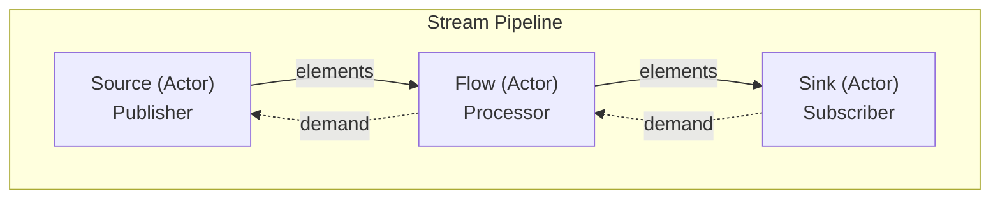
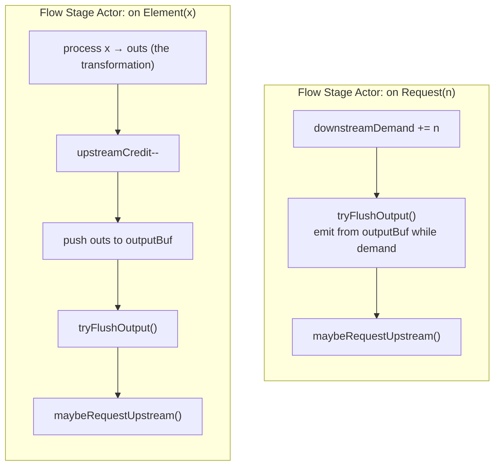
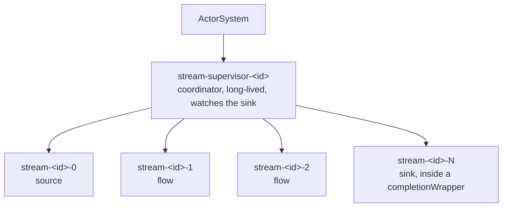
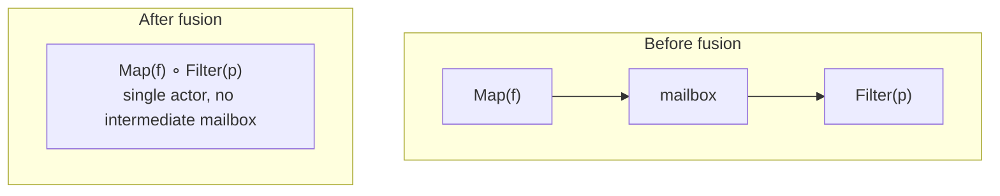
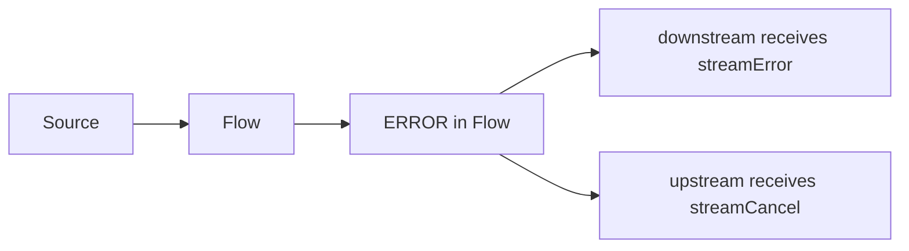
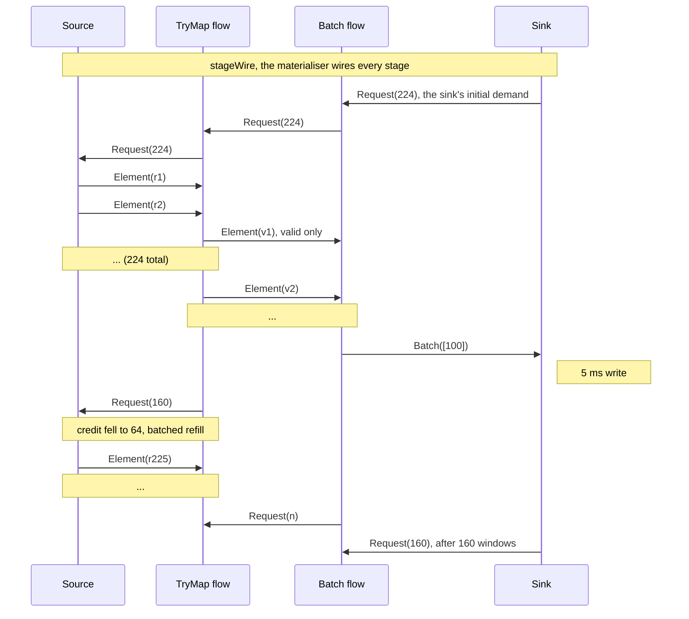

# 25. Streams

Verified against: `cf7a7c6d` and the uncommitted changes of branch `issue-1432` (2026-10-03): every statement checked against the code

## Contents

- [What you will learn](#what-you-will-learn)
- [25.1 What a stream is](#251-what-a-stream-is)
- [25.2 The public surface in brief](#252-the-public-surface-in-brief)
- [25.3 The protocol](#253-the-protocol)
- [25.4 The demand ledger and credit refill](#254-the-demand-ledger-and-credit-refill)
- [25.5 Materialisation](#255-materialisation)
  - [Completion](#completion)
  - [The handle](#the-handle)
- [25.6 Stage actors](#256-stage-actors)
- [25.7 Stage fusion](#257-stage-fusion)
- [25.8 Fan-in, fan-out and sub-pipelines](#258-fan-in-fan-out-and-sub-pipelines)
  - [Fan-in](#fan-in)
  - [Fan-out](#fan-out)
  - [The Graph DSL](#the-graph-dsl)
  - [Nested streams](#nested-streams)
  - [Substreams](#substreams)
- [25.9 Error handling](#259-error-handling)
- [25.10 Concurrency model](#2510-concurrency-model)
- [25.11 Stream refs across nodes](#2511-stream-refs-across-nodes)
- [25.12 Observability](#2512-observability)
- [25.13 Performance considerations](#2513-performance-considerations)
- [25.14 Comparison with other systems](#2514-comparison-with-other-systems)
- [25.15 Protocol sequence](#2515-protocol-sequence)
- [25.16 Stage configuration reference](#2516-stage-configuration-reference)
- [Guarantees](#guarantees)
- [Implementation details (may change)](#implementation-details-may-change)
- [Behaviours to know](#behaviours-to-know)
- [Exercises](#exercises)

## What you will learn

- What a stream is in GoAkt: a lazy description that becomes a small tree of actors when it runs.
- The six internal messages that carry demand, elements and termination between stages, and the credit window every stage keeps.
- What `RunnableGraph.Run` does step by step, what the coordinator and the completion wrapper are for, and how `Stop` and `Abort` differ.
- How stage fusion turns a run of `Map` and `Filter` stages into one actor, and what that actor gives up.
- How fan-in, fan-out, nested and keyed stages are built from sub-pipelines, and which of them bound their buffers.
- How errors travel, what each `ErrorStrategy` does in the code, and which configuration fields nothing reads yet.
- How `SourceRef` and `SinkRef` carry the same protocol across nodes.

Source files: `stream/stream.go`, `stream/source.go`, `stream/flow.go`, `stream/sink.go`, `stream/pipeline.go`, `stream/graph.go`, `stream/graph_builder.go`, `stream/subflow.go`, `stream/materializer.go`, `stream/handle.go`, `stream/protocol.go`, `stream/config.go`, `stream/errors.go`, `stream/overflow.go`, `stream/queue.go`, `stream/metrics.go`, `stream/tracer.go`, `stream/remote.go`, `stream/remote_protocol.go` and the stage actors in `stream/stage_*.go`.

## 25.1 What a stream is

The `stream` package is a demand-driven processing library built on the actor model. It does not replace actors; it composes with them. A pipeline is a graph of three kinds of stage, and **every stage runs as an actor**, so a stream gets a mailbox, a lifecycle and a place in the actor tree from the runtime. Of GoAkt's own packages it imports only `actor` and `remote`, plus `internal/retry` for endpoint lookup.

The design rests on four principles, as the maintainer states them:

| Principle | Meaning |
|---|---|
| Correctness | Exactly-once delivery inside a local pipeline: an element a stage accepts is passed on once, unless a strategy drops it on purpose (§25.9) |
| Backpressure | Demand-driven pull; a stage sends only what was requested |
| Composability | Stages are values; pipelines are assembled declaratively |
| Actor-native | Every stage is an actor |



| Type | Role | Holds | Source |
|---|---|---|---|
| `Source[T]` | origin of elements | `stages []*stage`: the source stage followed by the flows attached so far | `stream/source.go` |
| `Flow[In, Out]` | transformation; subscriber to its upstream and publisher to its downstream | one `*stage` | `stream/flow.go` |
| `Sink[T]` | terminal consumer; the stage that starts demand | one `*stage` | `stream/sink.go` |
| `RunnableGraph` | a complete pipeline | `stages` for one linear pipeline, or `pipelines` for several (Graph DSL), and a `FusionMode` | `stream/graph.go` |
| `StreamHandle` | control of a running stream | see §25.5 | `stream/handle.go` |

A `stage` is a description, not an actor: an id, a kind (`sourceKind`, `flowKind`, `sinkKind`), a `StageConfig`, an `actorFn` that builds the stage actor from a config, and for stateless stages a `fuseFn` (`stage` in `stream/graph.go`). Elements are type-erased to `any` between stages. Go generics check the types when the pipeline is assembled; at runtime each stage type-asserts the element and fails the stream on a mismatch.

**Execution is fully lazy.** `Via` and `To` copy stage slices and allocate descriptors; no actor exists until `Run`. A `RunnableGraph` is a value, and `Run` may be called on it several times; each call produces an independent stream, because the per-run state of a stage is created inside its `actorFn`. The branches of a `Broadcast`, `Balance` or `Partition` are separate graphs that share a pairing object; each run of all the branches gets its own hub (§25.8).

## 25.2 The public surface in brief

The user documentation (`docs/advanced/streams.mdx`) lists every operator with examples. This section only names the families so the rest of the chapter can refer to them.

| Family | Constructors |
|---|---|
| Sources | `Of`, `Range`, `Unfold`, `FromChannel`, `FromActor`, `FromConn`, `Tick` |
| Fan-in sources | `Merge`, `MergePreferred`, `MergePrioritized`, `MergeLatest`, `MergeSequence`, `Concat`, `Combine`, `Zip`, `ZipWith` |
| Fan-out | `Broadcast`, `Balance`, `Partition`, `Unzip`; each returns one `Source` per branch |
| Flows | `Map`, `TryMap`, `Filter`, `FlatMap`, `Flatten`, `Buffer`, `Batch`, `Throttle`, `Deduplicate`, `Scan`, `ParallelMap`, `OrderedParallelMap`, `FlatMapConcat`, `FlatMapMerge`, `WithContext` |
| Sinks | `ForEach`, `Collect`, `Fold`, `First`, `Ignore`, `ToActor`, `ToActorNamed`, `Chan` |
| Substreams | `GroupBy`, `SplitWhen`, `SplitAfter`, `SubFlowVia`, `MergeSubstreams` |
| Assembly | `Source.Via`, `Source.To`, free `Via`, `From`, `LinearGraph.Via`, `LinearGraph.To`, `ViaLinear`, the `Graph` builder |
| Remote | `Source.SourceRef`, `Sink.SinkRef`, `SourceRef.Source`, `SinkRef.Sink`, `RemoteOptions` |

Two rules explain the shape of the API. A Go method cannot introduce a type parameter, so `Source.Via` and `LinearGraph.Via` accept only `Flow[T, T]`; a flow that changes the element type goes through the free functions `Via` or `ViaLinear`. And `Collect`, `Fold` and `First` return a result object next to the sink (`Collector`, `FoldResult`) whose accessor blocks until the stream completes.

```go
collector, sink := stream.Collect[int]()

handle, err := stream.From(stream.Of(1, 2, 3, 4, 5)).
    Via(stream.Filter(func(n int) bool { return n%2 == 0 })).
    Via(stream.Map(func(n int) int { return n * 10 })).
    To(sink).
    Run(ctx, system)
if err != nil {
    return err
}

<-handle.Done()
items := collector.Items() // [20 40]
```

A user actor can feed a stream with `FromActor`: the stream sends it `*PullRequest{N}` with `Ask`, and the actor replies with `*PullResponse[T]`; an empty `Elements` slice ends the stream (`stream/stream.go`). An actor can also own a stream: it materialises the graph from `Receive` (its own PID is only available there), keeps the handle, and calls `Stop` on it in `PostStop`, which ties the stream's lifetime to the actor's.

## 25.3 The protocol

All signalling between stages is ordinary actor messages (`stream/protocol.go`). There is no external reactive-streams interface.

| Message | Direction | Meaning |
|---|---|---|
| `stageWire{subID, upstream, downstream}` | materialiser → stage | first message; gives the stage its neighbours (`upstream` is nil for a source, `downstream` for a sink) |
| `streamRequest{subID, n}` | downstream → upstream | "I can accept `n` more elements" |
| `streamElement{subID, value, seqNo}` | upstream → downstream | one element; `seqNo` is a per-stage counter of emitted elements |
| `streamComplete{subID}` | upstream → downstream | normal end |
| `streamError{subID, err}` | upstream → downstream | failure |
| `streamCancel{subID}` | downstream → upstream | stop producing |

`subID` identifies the materialisation. Every message carries it, but no local stage compares it; only the remote wire messages are filtered by stream id (§25.11).

The demand rules:

1. A stage sends elements only after it has received demand.
2. Demand is cumulative: `Request(10)` then `Request(5)` leaves 15 outstanding.
3. A stage asks its upstream for more before its outstanding credit is used up (the refill, §25.4).
4. `streamCancel` ends the subscription upstream.

Other internal messages exist for one stage each: `chanBatch` and `chanDone` (channel source), `fetchResult` and `fetchErr` (actor source), `tickTick`, `batchFlush`, `throttleTick`, `mergeSubValue`, `mergeSubDone`, `mergeSubErr` and `mergeSubAck` (fan-in), `slotDemand`, `hubReady` and `slotCancel` (fan-out hubs), and the `sub*` family (substreams and nested streams).

## 25.4 The demand ledger and credit refill

Each stage keeps a **demand ledger**: plain `int64` counters. Because an actor processes one message at a time, the counters need no atomics and no locks. A flow has no input buffer; its mailbox plays that role. Outputs it cannot send yet wait in a `queue` (§25.13).

The flow stage actor keeps these fields:

| Field | Holds |
|---|---|
| `downstreamDemand` | `int64`: demand from downstream |
| `upstreamCredit` | `int64`: requested, not yet received |
| `outputBuf` | GC-safe FIFO queue |

It reacts to a request and to an element in these steps:



**The refill rule** of a flow (`flowActor.maybeRequestUpstream` in `stream/stage_flow.go`):

1. Do nothing once upstream has completed.
2. Compute `available = InitialDemand − upstreamCredit − len(outputBuf)`. If it is not positive, do nothing: the window is full.
3. If `upstreamCredit` is above `RefillThreshold`, do nothing.
4. Otherwise add `available` to the credit and send one `streamRequest{n: available}` upstream.

With the defaults (`InitialDemand` 224, `RefillThreshold` 64) a flow first asks for 224, lets its credit fall to 64, and then asks for the difference in one message. The reason for refilling early rather than at zero is to smooth over processing jitter without giving up backpressure; the reason for one batched request is that it replaces one request per element. Elements waiting in `outputBuf` count against the window, so a flow whose downstream is slow stops asking.

A flow's request does not depend on how much its downstream asked for. Any `streamRequest`, even for one element, makes an idle flow ask for a full window. Each hop therefore holds up to one window in flight.

**The sink** starts the pipeline. On `stageWire` it sets `credit = InitialDemand` and sends that as the first request. After each element it decrements the credit, and when `credit ≤ RefillThreshold` it requests `InitialDemand − credit`, which is 160 with the defaults (`sinkActor.Receive` in `stream/stage_sink.go`). `First` requests exactly one element and cancels after it.

**Who asks when.** Every flow in this table except `flatMapStreamActor` waits for downstream demand before pulling:

| Stage actor | First upstream request | Honours downstream `streamRequest` |
|---|---|---|
| `flowActor` (`Map`, `TryMap`, `Filter`, `FlatMap`, `Flatten`, `Buffer`, `Deduplicate`, `Scan`, `WithContext`), `batchFlowActor`, `throttleActor` | on the first request from downstream | yes |
| `fusedFlowActor` | on the first request from downstream, for exactly what was asked | yes: it requests only the downstream demand that its outstanding credit does not cover |
| `parallelMapActor` | on the first request from downstream, at most one per worker | yes: it requests the smaller of its free workers and the downstream demand not yet covered |
| `flatMapStreamActor` | at wire time, `breadth` | yes, for its output buffer |

**Backpressure towards a user actor.** The stage mailbox is bounded and blocking (§25.10), and demand reaches `FromActor` sources as a normal `Ask`. The actor source keeps one pull in flight; demand that arrives meanwhile accumulates in `pendingDemand` and goes out with the next pull. A reply with fewer elements than asked restores the missing demand and pulls again (`actorSourceActor` in `stream/stage_source.go`).

## 25.5 Materialisation

`RunnableGraph.Run` applies fusion (§25.7) and calls `materialize` for a linear graph, or `materializeAll` for a multi-pipeline graph (`stream/graph.go`, `stream/materializer.go`). `materializeWithHead` does the work:

1. **Validate.** At least two stages, or `ErrInvalidGraph`; the first must be a source and the last a sink (`RunnableGraph.validate`).
2. **Allocate the id and the handle.** The id is the next value of a process-wide counter, as a decimal string (`newStreamSubID`). A counter is used instead of a UUID because it only needs to be unique inside the process and costs no entropy read.
3. **Wrap the sink.** The sink's `actorFn` is replaced, in a copy of the descriptor, by one that wraps the actor in a `completionWrapper` whose `PostStop` calls `handle.signalDone`.
4. **Spawn the coordinator.** A `streamCoordinator` named `stream-supervisor-<id>` is spawned at the top of the user tree, long-lived.
5. **Spawn the stages** as children of the coordinator, in order. Each gets a copy of its config with `System` set, the handle's `sourceMetrics` for stage 0 and `sinkMetrics` for the sink, and the name `stream-<id>-<index>` unless `WithName` set one. Each is long-lived, with the config's `Mailbox` or a `BoundedMailbox` of `BufferSize × 2`. A stage that receives from many producers (a fan-in source, a FlatMap, a splitter, a fan-out hub) is marked `manyProducers` and gets an unbounded mailbox instead.
6. **Watch the sink.** The coordinator stores the sink's PID and watches it. This happens before the stages are wired: no stage acts before its `stageWire`, so the coordinator cannot miss a sink that stops early.
7. **Wire.** Each stage receives a `stageWire` with its neighbours.
8. **Return the handle.**

A failure to spawn the coordinator in step 4 signals the handle with the error and returns it. A failure in step 5 or 7 also shuts the coordinator down first, which stops the stages already spawned.



The names are deterministic within a materialisation, which makes a stream easy to find in a dashboard.

### Completion

The stream is done when the sink stops. The `completionWrapper` runs the sink's own `PostStop`, reads the sink's terminal error through the `terminalErrorActor` interface if the sink implements it, and calls `signalDone` with it. `signalDone` stores the first error and closes the `Done` channel exactly once (`streamHandleImpl.signalDone` in `stream/handle.go`). This lets completion travel from source to sink with no cross-stage supervision wiring.

The coordinator has three jobs (`streamCoordinator.Receive` in `stream/stage_coordinator.go`). It is a single root, so that `Abort` is one `Shutdown`. It catches a sink that stops without the handle being signalled: it signals `stream: sink … terminated unexpectedly` and shuts down at once, which stops the stages that would otherwise wait for a sink that is gone. And it stops itself when the stream has ended, so a finished stream leaves no actor behind.

A parent receives `Terminated` for each of its children. After a regular end the coordinator waits for the sink's `Terminated` and then for its last stage to stop, and only then shuts down. It does not stop the remaining stages itself, because stopping an actor discards its mailbox, and a stage must be left to handle a pending `streamCancel`: a fan-out slot, for example, tells its hub. The handle does not depend on the coordinator. `Done`, `Err` and `Metrics` read state the handle holds, so they keep working after the coordinator is gone.

The sink actor also fires its completion hook from `PostStop`, behind a `sync.Once`, so a `Collector` or `FoldResult` waiter is released even on `Abort`.

### The handle

| Method | What the code does | Source |
|---|---|---|
| `ID` | the stream id | `streamHandleImpl.ID` |
| `Done` | channel closed by `signalDone` | `streamHandleImpl.Done` |
| `Err` | the first error stored; nil on normal completion | `streamHandleImpl.Err` |
| `Stop(ctx)` | sends `streamCancel` to stage 0 and waits for `Done` or for `ctx`. The source answers a cancel with `streamComplete`, so the stages downstream drain what they hold and the stream ends with a nil error. A stream whose in-flight work never finishes, such as a `FlatMapMerge` with endless inner sources, does not end on `Stop`; `Abort` ends it | `streamHandleImpl.Stop` |
| `Abort` | signals the handle with `ErrStreamCanceled` first, then shuts the coordinator down, which stops every stage; buffered elements are discarded. On a stream that has already ended it changes nothing: the handle keeps its first signal and the coordinator has stopped | `streamHandleImpl.Abort` |
| `Metrics` | sum of the source-stage and sink-stage counters (§25.12) | `streamHandleImpl.Metrics` |

A multi-pipeline graph returns a `multiHandle`: `Done` closes when every pipeline is done, `Err` is the first error seen, `Stop` runs the pipelines' `Stop` concurrently, `Abort` and `Metrics` fan out (`stream/handle.go`). If one pipeline fails to materialise, those already started are aborted.

## 25.6 Stage actors

Every stage type implements `actor.Actor`. The lifecycle of the generic flow:

| Message | `flowActor` reaction |
|---|---|
| `stageWire` | record neighbours and id |
| `streamRequest` | add to downstream demand; flush the output queue; maybe refill upstream |
| `streamElement` | transform; on success decrement credit, queue outputs, flush, maybe refill; on error apply the `ErrorStrategy` (§25.9) |
| `streamComplete` | mark completing; flush; once the queue is empty forward `streamComplete` and stop. With elements still queued the actor stays alive and serves further requests |
| `streamError` | forward downstream and stop |
| `streamCancel` | forward upstream and stop |

Sources, in `stream/stage_source.go` unless noted:

| Actor | Backs | How it produces |
|---|---|---|
| `pullSourceActor` | `Of`, `Range`, `Unfold` | calls `pullFn(n)` inside the request and emits the batch; completes when the function reports no more |
| `chanSourceActor` | `FromChannel` | a goroutine reads the channel only against downstream demand: every `streamRequest` adds to a shared credit and each value read spends one unit. It gathers up to 64 values that are immediately available, within the credit, and sends them as one `chanBatch`. With no demand the values stay in the channel and the producer blocks. `PostStop` ends the goroutine, so nothing is read after the stream has ended. Batching amortises the mailbox cost per element |
| `actorSourceActor` | `FromActor` | `PipeTo` of an `Ask` with `PullTimeout`; watches the user actor and fails the stream if it terminates |
| `tickSourceActor` | `Tick` | a recurring schedule delivers `tickTick`; with demand it emits the time read at receipt, without demand the tick is dropped |
| `connSourceActor` | `FromConn` | one blocking `Read` per unit of demand, inside `Receive`; `io.EOF` completes, any other error fails the stream |

Every source answers `streamCancel` by sending `streamComplete` downstream and stopping. That is what makes `Stop` an orderly drain.

Other flows: `batchFlowActor` collects a window and seals it at `n` elements, when its one-shot flush schedule fires, or when upstream completes. The first element of a window starts the schedule, `maxWait` ahead, only when no schedule is pending, and sealing a window by size does not cancel it; a window that follows one sealed by size is therefore sealed when the earlier schedule fires, which can be less than `maxWait` after its own first element. A sealed window is a fresh copy queued as one batch; the window slice is reused. Batches leave the queue one per unit of downstream demand, so a batch never holds more than `n` elements, and completion is forwarded only after the last batch has been delivered. Its credit window is the larger of `InitialDemand` and `n`, less the elements it holds, so a window larger than 224 still fills by size. `throttleActor` queues input and emits one element per recurring `throttleTick`, at `per / n` intervals. Both use the actor system's scheduler with the stage's actor name as the schedule reference, and cancel it when they stop (`stream/stage_flow.go`).

## 25.7 Stage fusion

Fusion removes one actor and one mailbox hop per fused stage. It is the optimisation with the largest effect.



`applyFusion` runs over the stage list at `Run` (`stream/materializer.go`):

1. With `FuseNone`, or fewer than two stages, return the list unchanged.
2. Walk the list. A stage is fusable when it is a flow, has a `fuseFn`, its config has `Fusion` true, its `ErrorStrategy` is `FailFast` and it has no `Tracer` (`fusable`). Only `Map`, `TryMap` and `Filter` have a `fuseFn`.
3. Extend a run over consecutive fusable stages, composing the functions: apply the first; on an error or a filtered-out element stop; otherwise apply the next.
4. A run of length one is left as it is. A longer run is replaced by one stage whose actor is a `fusedFlowActor` over the composed function, **with the config of the last stage of the run**.

Sources and sinks are never fused. `FuseStateless` is the default. `FuseAggressive` is accepted and behaves exactly like `FuseStateless`: `applyFusion` only distinguishes `FuseNone`.

A `fusedFlowActor` is deliberately minimal (`stream/stage_flow.go`):

- It always fails fast and calls no tracer. That is why a stage with another `ErrorStrategy` or with a tracer is not fusable: it keeps its own `flowActor`, and fusion never changes what a stage does. On an error the fused actor cancels its upstream, sends `streamError` downstream and stops.
- It has no output buffer, because the composed function yields at most one output per input. It requests from upstream only the downstream demand that its outstanding credit does not cover, in batches once the credit has fallen to `RefillThreshold`, and forwards each result as it is produced. A filtered-out element leaves demand unmet and is requested again (`fusedFlowActor.maybeRequestUpstream`).
- A `streamCancel` from downstream is forwarded upstream and answered with `streamComplete` downstream.

`WithFusion(FuseNone)` keeps every stage as its own actor. The `Fusion` field would disable fusion for one stage, but no exported builder sets it (§25.16). Sub-pipelines spawned by composite stages (§25.8) call `materialize` directly and are never fused.

Akka Streams fuses everything into one interpreter by default. GoAkt fuses only adjacent stateless stages, and keeps stateful stage boundaries visible as distinct actors for easier supervision and debugging.

## 25.8 Fan-in, fan-out and sub-pipelines

A composite stage is one actor in its own pipeline that starts other pipelines. A **sub-pipeline** is a full materialisation: its own id, its own top-level coordinator, its own handle.

### Fan-in

`Merge`, `Concat`, `Combine`, `Zip`/`ZipWith`, `MergeLatest`, `MergeSequence`, `MergePreferred` and `MergePrioritized` are sources. At wire time the actor appends an internal sink to each input's stage list and materialises it (`inputPipelines.spawn`, `makeMergeSinkDesc` in `stream/stage_source.go`). The internal sink is a `mergeSinkActor`. It sends each element to the composite actor as `mergeSubValue{slot, value, sink}`, the input's completion as `mergeSubDone{slot}` and its failure as `mergeSubErr{slot, err}`. The composite buffers values and emits them as its own downstream asks.

A failed input fails the stream: on `mergeSubErr` the composite sends `streamError` downstream with the input's error and stops. An input that cannot be materialised does the same. The composite keeps the handle of every input (`inputPipelines`) and aborts them all in `PostStop`, so the inputs stop however the composite ends: completion, failure, `Stop` or `Abort` of the outer stream. A stage can be stopped while it is still materialising its inputs, because `PostStop` may run on another goroutine during that turn. `inputPipelines.abort` therefore sets a flag under the same mutex as the handle list; `inputPipelines.spawnWithHead` starts nothing once the flag is set, and aborts at once a pipeline that the abort overtook. The list forgets the pipelines that have ended, so a stage that starts many over its life does not keep a handle for each.

| Source | Buffering and completion | File |
|---|---|---|
| `Merge` | one FIFO in arrival order; completes when all inputs are done and the buffer is empty | `stream/stage_source.go` |
| `Concat` | materialises one input at a time; the next starts on the previous one's `mergeSubDone` | `stream/stage_concat.go` |
| `Combine`, `Zip`, `ZipWith` | one queue per input; emits when every queue has an element; completes when any input is done with an empty queue | `stream/stage_source.go`, `stream/stage_zipn.go` |
| `MergePreferred`, `MergePrioritized` | one queue per input and a selector: preferred slot first, or weighted random among non-empty slots | `stream/stage_merge_select.go` |
| `MergeLatest` | latest value per input; one snapshot per arrival once every input has produced | `stream/stage_merge_latest.go` |
| `MergeSequence` | min-heap by extracted sequence number, starting at 0; a gap left when all inputs are done fails the stream | `stream/stage_merge_sequence.go` |

**Backpressure.** A `mergeSinkActor` requests one window of `InitialDemand` when it is wired and after that only what the composite acknowledges. The composite calls `inputPipelines.release` when an element leaves its buffer, and the acknowledgements go to the sink as `mergeSubAck{n}` in batches of 160, so the sink refills at the same rate as an ordinary sink. The elements of one input that the composite holds therefore never exceed one window, however little its downstream asks for. Two sources differ, by their meaning. `MergeLatest` keeps only the latest value of each input, so it acknowledges an element on arrival and never holds an input back. `MergeSequence` counts the elements waiting in its heap against the window, but while the next expected sequence number has not arrived it releases everything it holds, because it must read on to find it.

The composite itself runs on an unbounded mailbox (`stage.manyProducers` in `stream/graph.go`). A bounded mailbox blocks the sender's goroutine while it is full, and the senders here are the input sinks, which run on dispatcher workers: with as many fast inputs as workers, every worker would wait on the composite's mailbox and nothing would be left to drain it. The windows already bound what the mailbox can hold, to one window per input.

### Fan-out

`Broadcast(src, n)` returns `n` sources. Each is a `broadcastSlotActor`; all share one `sharedBroadcast` created when `Broadcast` is called (`stream/stage_broadcast.go`). Each branch is materialised on its own. A slot registers itself when it is wired (`fanOutGenerations.register`). When one materialisation of every branch is waiting, the oldest of each are paired into a **generation**: the shared object builds a new `broadcastHubActor` over those slots and materialises `src` with it as the sink, in a goroutine (`spawnFanOutUpstream`). Waiting slots whose actors have stopped are dropped before the pairing. If the upstream cannot be materialised, every slot of the generation receives a `streamError` with the materialisation error, so the branches fail instead of waiting. The hub tells every slot `hubReady`; slots turn downstream requests into `slotDemand` (buffering them until the hub is known) and forward elements, completion and errors unchanged.

| Hub | Pull rule | Routing | File |
|---|---|---|---|
| `broadcastHubActor` | when nothing is in flight, request the minimum demand over the active slots | every element to every active slot | `stream/stage_broadcast.go` |
| `balanceHubActor` | request the sum of the slots' demand | next slot with demand, round-robin | `stream/stage_balance.go` |
| `partitionHubActor` | request the minimum demand, so that whichever slot the function picks has room | the slot `partitionFn` returns; out-of-range or cancelled slots drop the element | `stream/stage_partition.go` |

A slot that is cancelled tells the hub `slotCancel`, and answers its own downstream with `streamComplete`. The hub also watches its slots: a slot that stops without cancelling, because its branch was aborted, is released in the same way, so it cannot stall the other branches. Watching an actor that has already stopped delivers nothing, so when the hub is wired it also releases every slot whose actor has stopped (`stoppedSlots`). That covers a branch aborted between the pairing and the wiring of the hub. The hub cancels its upstream once every slot is gone. `Unzip` is `Broadcast` into two branches with a `Map` on each.

**Running the branches again.** The branch graphs can be run any number of times, also while an earlier run is in flight. The k-th run of each branch belongs to generation k, whatever the order in which the runs arrive, and every generation has its own hub and its own materialisation of `src`. A branch that is run without its siblings waits for them, in the first generation as in any later one: the upstream starts when the last branch of the generation is materialised. `Stop` or `Abort` on the waiting branch's handle ends the wait, and its slot withdraws from the pairing in `PostStop` (`fanOutGenerations.withdraw`), so a later generation never pairs with a dead slot. A branch whose partner has withdrawn, or was aborted before it registered, is in the same position as a branch run alone: it waits for a new partner, and `Stop` or `Abort` on its own handle ends the wait. `Balance`, `Partition` and the fan-out nodes of the Graph DSL follow the same rules.

### The Graph DSL

`Graph` is a builder of named, type-erased nodes (`Source[any]`, `Flow[any, any]`, `Sink[any]`) for fan-out, fan-in and diamond shapes (`stream/graph_builder.go`). `Build`:

1. checks that every referenced node exists, failing with a plain error that names the unknown node, and that there is at least one source and one sink (`ErrInvalidGraph`);
2. orders the nodes topologically and rejects a cycle (`ErrInvalidGraph`);
3. turns every node with more than one downstream into a `sharedBroadcast` over the chain that leads to it;
4. compiles one stage list per sink: `MergeInto` becomes a `mergeSourceActor`, `ConcatInto` a `concatSourceActor`, a fan-out node a broadcast slot.

One sink gives a linear `RunnableGraph`; several give a multi-pipeline graph and a `multiHandle`.

### Nested streams

`FlatMapConcat` and `FlatMapMerge` use `flatMapStreamActor` (`stream/stage_flatmap_stream.go`). For each input it calls the user function, appends a `mergeSinkActor` and materialises the result. The sink takes an input slot that is free, so slots stay below `breadth`; a slot is freed by its pipeline's `mergeSubDone`, which follows all of its elements. The FlatMap acknowledges elements as they leave its buffer, like the fan-in sources, so each nested stream runs at most one window ahead and the buffer holds at most `breadth` windows. An element whose slot has since been reused is not acknowledged (`inputPipelines.releaseValue`). Upstream credit plus active sub-pipelines never exceeds `breadth`, which is 1 for `FlatMapConcat`; that bound is what gives it strict ordering. Like the fan-in sources it keeps the sub-pipelines' handles in an `inputPipelines` and aborts them on cancellation, failure and `PostStop`, and it distinguishes a sub-pipeline's failure (`mergeSubErr`) from its completion (`mergeSubDone`).

### Substreams

`GroupBy`, `SplitWhen` and `SplitAfter` produce a `SubFlow`; `SubFlowVia` appends flows to the per-substream chain; `MergeSubstreams` turns it back into a `Source` backed by `subFlowSourceActor`, the splitter (`stream/subflow.go`, `stream/stage_subflow.go`). The splitter:

1. materialises the upstream ending in a `mergeSinkActor` on input slot 0, so the upstream elements arrive as `mergeSubValue` and its end as `mergeSubDone` or, when the upstream failed, `mergeSubErr`; an upstream failure, or an upstream that cannot be materialised, fails the stream;
2. derives a key when an element arrives: the key function for `GroupBy`, a counter for the split modes (`SplitWhen` advances it before a matching element, `SplitAfter` after it), so the key function and the predicate run once per element (`subFlowSourceActor.assign`);
3. delivers the element, or keeps it in a queue of waiting elements when it must wait or when earlier elements wait already, which keeps the upstream order (`routeElement`, `deliver`, `drainPending`). An element waits while the merged buffer holds a window (224 elements), and while its substream is at the per-key buffer (default 256) if the strategy is `BackpressureSource` or the downstream asks for nothing. The second condition matters for one substream on its own: up to 159 of its acknowledgements wait to be batched, so it can stall with fewer than a window of elements in the merged buffer. The upstream sink is acknowledged an element only once it is delivered, in batches like a fan-in input, so a slow downstream or a slow substream holds the upstream back and at most one upstream window waits;
4. for a new key, materialises `feedSourceActor → per-substream flows → mergeSinkActor` on a free input slot from 1 up, or fails with `ErrTooManySubstreams` when `maxSubstreams` open substreams already exist; a slot is freed when its substream completes or fails, and reused;
5. pushes the element with `subPush` and counts it in the key's in-flight counter; the feed source acknowledges dispatches in batches of a quarter of the per-key buffer (`subFeedAck`). A split substream is told its feed is done (`subFeedDone`) when the first element of the next one is delivered, or, for `SplitAfter`, right after its matching element;
6. when the counter has reached the per-key buffer under another strategy while the downstream asks for elements, applies it: `FailSource` fails the stream with `ErrSubstreamOverflow`; `DropTail` and `DropHead` drop the new element, count it and call `OnDrop`;
7. collects the substreams' `mergeSubValue` into the merged buffer and emits on demand, acknowledging each element to its sink as it leaves, so a substream runs at most one window ahead of the downstream (`inputPipelines.releaseValue`); completes when the upstream is done, no element waits, every substream is done and the buffer is empty.

The splitter keeps the handles of the upstream and of every substream in an `inputPipelines` and aborts them in `PostStop`, so they stop with the merged stream however it ends.

A failing substream is handled per `SubstreamErrorStrategy`: `SubstreamFailAll` (default) fails the stream, `SubstreamDrop` blocklists the key and drops its later elements, `SubstreamRestart` forgets the pipeline so the next element of that key starts a new one.

## 25.9 Error handling

Errors flow **downstream**; cancellation flows upstream:



A sink that receives `streamError` records it as its terminal error, which the completion wrapper hands to `StreamHandle.Err`. The sinks keep that error in a `terminalError`, an atomic holder, because the wrapper reads it from `PostStop`, which may run while the sink's turn is still in progress (`stream/materializer.go`).

`ErrorStrategy` applies to errors a stage's own function returns (`stream/errors.go`):

| Strategy | In `flowActor` | In `sinkActor` |
|---|---|---|
| `FailFast` (default) | cancel upstream, send `streamError` downstream, stop | record the error, cancel upstream, stop |
| `Resume` | count the drop, call `OnDrop`, consume one credit, continue | same, then refill if due |
| `Retry` | call the function again up to `RetryConfig.MaxAttempts` more times; on success continue, otherwise fail as `FailFast` | same; on exhaustion also counts a drop and calls `OnDrop` |
| `Supervise` | same as `FailFast`. The code comment says it will delegate to a stream supervisor once a dedicated hierarchy is wired in | same as `FailFast` |

The retries come after the failed first call, so `MaxAttempts: 1`, the default, means two calls in total. `WithRetryConfig` raises a value below 1 to 1.

The sentinels: `ErrInvalidGraph`, `ErrStreamCanceled` (set by `Abort`), `ErrTooManySubstreams`, `ErrSubstreamOverflow`, and `ErrPullTimeout`, which is declared but returned nowhere; a pull that times out fails the stream with the error `Ask` returned.

**Overflow.** `OverflowStrategy` has four values: `DropHead`, `DropTail` (default), `BackpressureSource`, `FailSource` (`stream/overflow.go`). The only code that reads a strategy is the splitter (§25.8), whose default is `BackpressureSource`: it holds the upstream back, `FailSource` fails the stream, and `DropHead` and `DropTail` drop the newest element. The strategy applies only while the downstream asks for elements, to a substream slower than its feed; a slow downstream holds the upstream back under every strategy. A key that carries most of the elements reaches the cap in bursts while the downstream keeps up, so `DropTail` drops some of its elements and `FailSource` can fail. `Source.WithOverflowStrategy` and `Buffer` store the strategy in the stage config and nothing consults it. The linear sources never drop: they emit only on demand and queue what arrives early. `Buffer(size, strategy)` is an identity flow whose window is `size` and whose refill threshold is `size / 4`.

**Dropped elements.** `StageConfig.OnDrop(value, reason)` is called by `flowActor` and `sinkActor` on `Resume`, by the sink on exhausted retries, and by the splitter on overflow and on a blocklisted key. No exported builder sets `OnDrop`.

## 25.10 Concurrency model

Each stage actor processes one message at a time, the guarantee every actor has (Chapter 7, §7.2). So there are no locks inside `Receive`, no races on stage state, and elements from one upstream arrive in the order they were sent. Stage actors run on the shared dispatcher pool like any other actor; a stage has no goroutine of its own. State shared across goroutines is limited and guarded: the metrics counters, the sink's `terminalError`, the coordinator's sink PID and the channel source's read credit are atomic, and the result objects (`Collector`, `FoldResult`), the sub-pipeline list (`inputPipelines`) and the fan-out pairing (`fanOutGenerations`) have a mutex.

Three stages start goroutines or block: `FromChannel` runs one reader goroutine, and `FromConn` and the `Chan` sink block inside `Receive` (on `Read` and on a full channel) and hold a worker while they do (Chapter 7, §7.1). In addition, the fan-out slot that completes a generation materialises the upstream on a goroutine of its own (`spawnFanOutUpstream`, §25.8).

| Scenario | Ordering |
|---|---|
| One source, linear flows | strictly ordered |
| Fan-out then merge | order kept per branch; the merge interleaves in arrival order |
| Several sources merged | interleaved; each source's own order kept |
| `ParallelMap` | not ordered |
| `OrderedParallelMap` | ordered |

`ParallelMap` spawns `n` function actors with `SpawnFromFunc` at wire time and dispatches each element round-robin with a sequence number. After each downstream request and each result it requests the smaller of two numbers: its free workers, and the downstream demand that no element is already on its way for (`parallelMapActor.maybeRequestUpstream`). So at most `n` elements are in flight, and because each input yields exactly one output, a result can always be emitted without exceeding downstream demand. A worker recovers a panic in the user function and reports it as an error, which fails the stream. The ordered variant pushes results on a min-heap and emits while the top carries the next expected number (`parallelMapActor` in `stream/stage_parallel.go`).

**Mailboxes.** The default stage mailbox is `actor.NewBoundedMailbox(BufferSize × 2)`, 512 slots, whose `Enqueue` blocks when full (Chapter 6). With demand control it is rarely full, and it has better cache locality than an unbounded one. `WithMailbox` replaces it per stage; `UnboundedFairMailbox` is the alternative when one busy upstream must not starve other senders. The stages that receive from many producers get an unbounded mailbox (§25.8); their demand windows bound it.

## 25.11 Stream refs across nodes

`Source.SourceRef` and `Sink.SinkRef` publish one end of a stream as a small serialisable value: actor name, host, port (`stream/remote.go`). The ref names an **endpoint actor**, spawned long-lived at the top of the tree as `src-ref-<id>` or `sink-ref-<id>`. `SourceRef.Source` and `SinkRef.Sink` turn a ref back into a stage, a **bridge actor**, on any node.

1. At wire time the bridge resolves the endpoint: through the local tree when host and port are its own, otherwise with `RemoteLookup`, retried with backoff for up to ten seconds (`resolveEndpoint`).
2. The bridge sends `streamSubscribeWire{StreamID}`, and the endpoint takes the sender as its subscriber. The source bridge (`remoteSourceBridgeActor`) watches the endpoint first and fails its stream if the endpoint stops before completion; the sink bridge (`remoteSinkBridgeActor`) does not watch it.
3. A source endpoint materialises its source with an internal sink that feeds it; a sink endpoint materialises `feedSourceActor → user sink`.
4. Demand crosses as `streamRequestWire`. Elements cross as ordinary remote messages with no envelope, to avoid encoding them twice: with one subscription per endpoint, any message that is not a control message is an element.
5. Completion, failure and cancellation cross as `streamCompleteWire`, `streamErrorWire` and `streamCancelWire` (`stream/remote_protocol.go`).

An endpoint accepts one subscription; a second subscriber receives `streamErrorWire`. The source endpoint ships an element only against wire credit and queues the rest, up to 1,024 elements, beyond which it fails the stream; after the stream ends it stays alive for 30 seconds so that a late subscriber gets a rejection instead of silence (`stream/stage_source_ref.go`). When the source behind a source ref fails, the endpoint sends `streamErrorWire` and the consuming stream fails with that error. The endpoint aborts its source pipeline as soon as the stream has ended (`sourceRefEndpointActor.scheduleTermination`), not at the end of the grace window, and in `PostStop`. It also watches its subscriber: a consumer that is aborted sends no `streamCancelWire`, and its `Terminated` stops the endpoint and with it the source. Watching an actor that has already stopped delivers nothing, so when a local subscriber is not running at subscription time the endpoint stops at once and never starts the source. The sink endpoint grants 256 elements of credit on subscribe and renews it as its feed source acknowledges, in steps of 64 (`stream/stage_sink_ref.go`). When the producing side fails, the remote sink sees a normal completion; the error is on the producer's handle.

`RemoteOptions()` registers the five control types with remoting. Element types must be registered by the user.

## 25.12 Observability

`StreamMetrics` has five fields: `ElementsIn`, `ElementsOut`, `DroppedElements`, `Errors`, `BackpressureMs`. A stage counts into a `stageMetrics` of atomics. The materialiser shares two of them with the handle, one for stage 0 and one for the sink; every other stage counts into a private object nobody reads. `Metrics()` adds the two snapshots (`stream/metrics.go`, `stream/handle.go`). Consequences:

- `ElementsIn` is the elements the source produced plus the elements the sink received.
- `Errors` and `DroppedElements` reflect the sink and the source stage only, not the flows between them.
- `BackpressureMs` is always zero: the field and its aggregation exist, and no stage writes the counter.

`Tracer` has four hooks: `OnElement`, `OnDemand`, `OnError`, `OnComplete` (`stream/tracer.go`). Only `flowActor` calls them. `Source.WithTracer` and `Sink.WithTracer` store the tracer and nothing calls it. A flow with a tracer is never fused (§25.7), so the tracer of a `Map`, `TryMap` or `Filter` always fires. `flowActor` reads the clock per element only when a tracer is attached, because `time.Now` on every element is not free. `MetricsReporter` is an interface with no caller, and `StageConfig.Tags` is stored and never read.

## 25.13 Performance considerations

- **The queue.** `queue` is a slice with a head index (`stream/queue.go`). `pop` sets the vacated slot to nil at once, so the garbage collector can free the value while the backing array lives, and compacts when the dead prefix reaches half the slice, which amortises the copy.
- **Plain counters** for demand, protected by the one-message-at-a-time rule; atomics only for metrics. No mutex on the element path.
- **Refill batching.** One `streamRequest` covers a window of elements.
- **Fusion** (§25.7).
- **Batching.** Each element between two stages costs one mailbox enqueue and dequeue. `Batch(n, maxWait)` turns `n` elements into one message for everything downstream of it, which the design document calls the single most effective throughput measure.
- **`FromChannel`** batches up to 64 values per message, within the outstanding demand. **`FromConn`** reads into pooled buffers of `bufSize` (default 4,096) and emits an exact-sized copy.

The design document set these throughput targets. They are targets, not measurements: the package has no benchmark.

| Scenario | Target | Note |
|---|---|---|
| Source → Sink | > 10M elements/s | no transformation |
| Source → Map → Filter → Sink | > 5M elements/s | fused |
| Source → Buffer(256) → Sink | > 8M elements/s | decoupled producer and consumer |
| Source → Batch(100) → ToActor | > 2M batches/s | |
| Fan-out to 10 sinks | > 1M elements/s per sink | per-branch backpressure |

## 25.14 Comparison with other systems

| Aspect | Akka Streams | RxGo | Go channels | GoAkt streams |
|---|---|---|---|---|
| Model | graph DSL, materialiser | push-based observable | manual goroutines and `select` | fluent builder, fan-in/fan-out functions, Graph DSL, substreams (acyclic only) |
| Backpressure | Reactive Streams, async pull | limited, per operator | blocking on a full channel | demand messages with credit refill |
| Execution | all stages fused in one interpreter | goroutines per operator | goroutines | one actor per stage; stateless runs fused |
| Errors | supervision | terminal `OnError` | error channels | strategy per stage |
| Lifecycle | materialised values | unsubscribe | close, `WaitGroup` | `StreamHandle`, `Collector`, `FoldResult` |
| Distribution | cluster | none | none | `SourceRef` / `SinkRef` over remoting |

Go channels suit a single producer and consumer. They become unwieldy for multi-stage, branching pipelines with error handling; streams give that structure without leaving the Go concurrency model.

## 25.15 Protocol sequence

A worked trace for `FromActor → TryMap (Resume) → Batch(100, 50 ms) → Map → ToActor`, with a sink actor that takes 5 ms per window. `TryMap` and `Map` are not adjacent, so nothing is fused. The diagram leaves the last `Map` out; it behaves like any flow.



1. The sink receives `stageWire` and requests 224.
2. The first demand travels hop by hop: each flow, on its first request, asks its own upstream for a full window of 224.
3. The source stage receives `Request(224)` and sends `PullRequest{N: 224}` to the user actor.
4. `TryMap` forwards the valid readings. A reading dropped by `Resume` also consumes one credit, so after 160 inputs its credit is 64 and it sends one `Request(160)`.
5. `Batch` flushes a window at 100 elements, or when its pending 50 ms schedule fires. The first element of a window starts that schedule only when none is pending, so a window that follows one flushed by size can be flushed less than 50 ms after its own first element.
6. The sink's credit after one window is 223, far above the threshold, so it sends nothing. It refills by 160 after 160 windows.
7. In the steady state the sink takes one window per 5 ms. Upstream stages stop asking when their windows are full, so the user actor is asked for about what the sink absorbs, roughly 100 readings per 5 ms, not for what it could produce. No rate-limiting code is involved.

## 25.16 Stage configuration reference

`StageConfig` (`stream/config.go`); defaults from `defaultStageConfig`.

| Field | Default | Read by | Set through |
|---|---|---|---|
| `InitialDemand` | 224 (87.5% of 256, leaving room for elements in flight) | sinks, flows, the internal sinks of fan-in inputs: size of the credit window | `Buffer(size, …)` sets it to `size`; otherwise no builder |
| `RefillThreshold` | 64 (25% of 256) | sinks, flows, fused flow: refill when credit is at or below it | `Buffer` sets `size / 4`; otherwise no builder |
| `ErrorStrategy` | `FailFast` | `flowActor`, `sinkActor`; `fusable`, to keep a stage with another strategy out of fusion | `Flow.WithErrorStrategy`, `Sink.WithErrorStrategy` |
| `RetryConfig` | `MaxAttempts: 1` | `flowActor`, `sinkActor` under `Retry` | `WithRetryConfig` |
| `OverflowStrategy` | `DropTail` | nothing | `Source.WithOverflowStrategy`, `Buffer` |
| `PullTimeout` | 5 s | `actorSourceActor` | no builder |
| `System` | set by the materialiser | composite stages, to materialise sub-pipelines; schedule cancellation in `PostStop` | not user-set |
| `Metrics` | set by the materialiser for stage 0 and the sink | every stage that counts | not user-set |
| `BufferSize` | 256 | the materialiser: mailbox of `BufferSize × 2` | `Buffer` |
| `Mailbox` | nil | the materialiser | `WithMailbox` |
| `Name` | `stream-<id>-<index>` | the materialiser, as the actor name; `flowActor`, as the tracer's stage name | `WithName` |
| `Tags` | nil | nothing | `WithTags` |
| `Tracer` | nil | `flowActor`; `fusable`, to keep a traced stage out of fusion | `WithTracer` |
| `OnDrop` | nil | `flowActor`, `sinkActor`, splitter | no builder |
| `Fusion` | true | `applyFusion` | no builder |

Builder calls compose. Each `With…` method copies the stage descriptor and changes one field of its config; the `actorFn` is untouched and receives, at `Run`, the config the materialiser completed (§25.5). A chain of calls therefore applies every option, in any order.

## Guarantees

| Statement | Enforced by |
|---|---|
| The default stage config is 224 / 64 / `FailFast` / `DropTail` / 5 s / 256 / fusion on | `TestDefaultStageConfig` in `stream/config_test.go` |
| An empty graph fails `Run` with `ErrInvalidGraph`; a graph whose first stage is not a source, or whose last is not a sink, fails validation | `TestMaterialize_InvalidGraph_NoPanic` in `stream/materializer_test.go`; `TestValidate_FirstStageNotSource` and `TestValidate_LastStageNotSink` in `stream/graph_internal_test.go` |
| `Metrics` adds the source and sink counters: three elements give `ElementsIn` 6 and `ElementsOut` 3 | `TestMaterialize_Metrics` in `stream/materializer_test.go` |
| `Stop` on an endless source returns nil and closes `Done` | `TestMaterialize_HandleStop` in `stream/materializer_test.go` |
| `Abort` closes `Done` with `ErrStreamCanceled` | `TestMaterialize_HandleAbort` in `stream/materializer_test.go` |
| The handle keeps the first error it is signalled with | `TestStreamHandle_SignalDone_Idempotent` in `stream/handle_test.go` |
| `Resume` skips the failing element and keeps the rest in order, in a flow and in a sink | `TestTryMap_ErrorResume` in `stream/flow_test.go`; `TestSinkActor_ErrorResume_SkipsElement` in `stream/stage_sink_test.go` |
| With `WithErrorStrategy(Retry).WithRetryConfig({MaxAttempts: 3})` the stage's function is called four times in total for an element that always fails | `TestFlow_WithRetryConfig_AppliesConfig` in `stream/graph_builder_test.go` |
| Builder calls compose in any order, and a stage built with them still gets the materialiser's actor system, shared metrics and default name | `TestBuilders_ComposeAndKeepMaterializerConfig` in `stream/graph_builder_test.go` |
| A stage with `Resume` and a tracer next to a fusable stage keeps both: the failing element is skipped and the tracer fires | `TestFusion_KeepsStageErrorStrategy` in `stream/materializer_test.go` |
| When a stream ends, by completion, `Stop`, failure or a sink that cancels, no stream actor remains, sub-pipelines of `FlatMapConcat` included; `Done`, `Err` and `Metrics` still work, and `Abort` afterwards changes nothing | `TestStreamHandle_CoordinatorStopsWhenStreamEnds` in `stream/handle_test.go` |
| A sink that stops without the handle having been signalled ends the stream with an error, and the coordinator stops the remaining stages | `TestStreamCoordinator_SinkCrash_StopsTheStream` in `stream/handle_test.go` |
| A `FlatMapMerge` stream aborted right after `Run` leaves no nested stream behind | `TestFlatMapMerge_AbortRightAfterRun_StopsSubPipelines` in `stream/flow_test.go` |
| A `flowActor` with an empty queue forwards completion exactly once | `TestFlowActor_StreamComplete_EmptyBuffer_CompletesOnce` in `stream/stage_flow_test.go` |
| A fused stage requests only what downstream asked for and replaces a filtered-out element; on an error it cancels its upstream, and the source stops | `TestFusedFlowActor_RespectsDownstreamDemand`, `TestFusedFlowActor_FnError_CancelsUpstream` and `TestFusedFlow_FnError_StopsSource` in `stream/stage_flow_test.go` |
| `Batch` holds full windows as batches of at most `n` until downstream asks, delivers a window whose timer fired without demand, keeps the partial window when upstream completes without demand, and fills a window larger than `InitialDemand` by size | `TestBatchFlowActor_NoDemand_KeepsBatchSize`, `TestBatchFlowActor_TimerFlush_WithoutDemand`, `TestBatchFlowActor_Complete_WithoutDemand_KeepsPartialWindow` and `TestBatch_SizeAboveInitialDemand` in `stream/stage_flow_test.go` |
| `FromChannel` takes values off its channel only against demand and takes nothing after the stream has ended | `TestChanSourceActor_ReadsOnlyAgainstDemand` and `TestChanSourceActor_StopsReadingWhenStreamEnds` in `stream/stage_source_test.go` |
| A `First` sink whose upstream fails reports the error on the handle | `TestFirstSinkActor_UpstreamError_ReportsErr` in `stream/stage_sink_test.go` |
| A fused `Filter → Map → Filter` run produces the same output as the separate stages would | `TestMaterialize_MultipleFlowStages` in `stream/materializer_test.go` |
| `OrderedParallelMap` keeps input order; `ParallelMap` never runs more than `n` calls at once; a panic in the function fails the stream; both pull only against downstream demand | `TestOrderedParallelMap_PreservesOrder`, `TestParallelMap_WorkerCountMatchesConcurrency`, `TestParallelMap_WorkerPanicPropagatesError` and `TestParallelMapActor_RespectsDownstreamDemand` in `stream/stage_parallel_test.go` |
| `Broadcast` delivers every element to every branch; `Balance` delivers each element exactly once | `TestBroadcast_TwoSlots` and `TestBalance_EachElementDeliveredOnce` in `stream/source_test.go` |
| The branch graphs of `Broadcast`, `Balance`, `Partition` and a Graph DSL fan-out can be run repeatedly, each run delivering the full data; a second run is independent of a first one still in flight; runs started from several goroutines are paired into complete generations | `TestFanOut_RunsMoreThanOnce`, `TestFanOut_SecondRunWhileFirstIsRunning` and `TestFanOut_ConcurrentRuns` in `stream/stage_broadcast_test.go` |
| A fan-out branch run without its siblings waits for them, in the first generation and in later ones; it completes when they are run, it can be stopped while it waits without disturbing the next generation, and a branch whose partner has withdrawn waits for a new one | `TestFanOut_PartialGeneration` in `stream/stage_broadcast_test.go` |
| Aborting one fan-out branch does not stall the others, also when the abort comes right after `Run`; when every branch is aborted the hub pipeline stops too | `TestFanOut_AbortedBranchDoesNotStallSiblings` and `TestFanOut_BranchAbortedRightAfterRun` in `stream/stage_broadcast_test.go` |
| When the upstream of a fan-out cannot be materialised, every branch fails with the materialisation error | `TestFanOut_UpstreamMaterializationFailure_FailsEveryBranch` in `stream/stage_broadcast_test.go` |
| `Partition` drops an element whose index is out of range | `TestPartition_DropsOutOfRange` in `stream/junctions_test.go` |
| A failed input of `Merge`, `Concat`, `Zip`, `Combine`, `MergeLatest`, `MergePreferred` or `MergeSequence` fails the stream with the input's error; so does an input that cannot be materialised | `TestFanIn_InputFailure_FailsTheStream`, `TestFanIn_InputMaterializationFailure_FailsTheStream` and `TestFanIn_InputMaterializationFailure_AllStages` in `stream/stage_source_test.go` |
| Aborting a fan-in stream stops its input pipelines, also when the abort comes right after `Run`, while the inputs are still being materialised | `TestFanIn_Abort_StopsInputPipelines` and `TestFanIn_AbortRightAfterRun_StopsInputPipelines` in `stream/stage_source_test.go` |
| A `Merge` of more fast inputs than dispatcher workers keeps delivering and `Stop` ends it; a `FlatMapMerge` of 16 endless inner sources keeps delivering and `Abort` ends it | `TestFanIn_ManyFastInputs_KeepsFlowing` in `stream/stage_source_test.go`; `TestFlatMapMerge_ManyEndlessInnerSources_KeepsFlowing` in `stream/flow_test.go` |
| `MergeSequence` reads on past one demand window while the next sequence number is missing | `TestMergeSequence_GapLargerThanOneWindow` in `stream/stage_merge_sequence_test.go` |
| With no downstream demand, `Merge`, `Concat`, `Zip`, `Combine`, `ZipWith`, `MergePreferred`, `MergePrioritized` and `MergeSequence` pull each active input for one window and then wait | `TestFanIn_BoundsItsBufferWithoutDownstreamDemand` in `stream/stage_source_test.go` |
| `Concat` and `FlatMapConcat` keep end-to-end order; an inner failure of `FlatMapConcat` reaches `Err` | `TestConcat_PreservesOrder` in `stream/junctions_test.go`; `TestFlatMapConcat_PreservesEndToEndOrder` and `TestFlatMapConcat_InnerErrorFailsTheStream` in `stream/flow_test.go` |
| `MergeSequence` fails the stream on a missing sequence number | `TestMergeSequence_MissingSequenceErrors` in `stream/junctions_test.go` |
| A substream over its buffer with `FailSource` ends the stream with `ErrSubstreamOverflow`; one substream too many with `ErrTooManySubstreams`; `SubstreamFailAll` surfaces the substream's error; `SubstreamDrop` drops the key and continues | `TestSubFlow_OverflowFailSource_TerminatesStream`, `TestSubFlow_TooManySubstreamsFailsStream`, `TestSubFlow_ErrorStrategyFailAll_TerminatesStream` and `TestSubFlow_ErrorStrategyDrop_BlocklistsKeyAndContinues` in `stream/subflow_test.go` |
| A failure of the pipeline feeding a splitter, or a feeding pipeline that cannot be materialised, fails the merged stream; aborting the merged stream stops the feeding pipeline and the open substreams | `TestSubFlow_UpstreamFailure_FailsTheStream`, `TestSubFlow_UpstreamMaterializationFailure_FailsTheStream` and `TestSubFlow_Abort_StopsUpstreamAndSubstreams` in `stream/subflow_test.go` |
| A stopped downstream holds the source of `MergeSubstreams` back under every overflow strategy, for `GroupBy` with keys of equal share, one key or skewed keys, and for short `SplitAfter` substreams; nothing is lost under `BackpressureSource`; a substream slower than its feed holds the source back under `BackpressureSource`, drops under `DropTail` and fails under `FailSource` | `TestSubFlow_SlowDownstream_HoldsUpstreamBack`, `TestSubFlow_SlowDownstream_HoldsSplitUpstreamBack`, `TestSubFlow_SlowSubstream_Backpressure`, `TestSubFlow_SlowSubstream_DropTail` and `TestSubFlow_SlowSubstream_FailSource` in `stream/subflow_test.go` |
| Elements waiting in a splitter are delivered after the upstream completes, keep the split boundaries, are dropped for a key blocklisted by `SubstreamDrop`, start a new substream on a reused slot under `SubstreamRestart`, and do not survive an abort | `TestSubFlow_Backpressure_UpstreamEndsWhileElementsWait`, `TestSubFlow_Backpressure_SplitBoundaries`, `TestSubFlow_Backpressure_DropWhileElementsWait`, `TestSubFlow_Backpressure_RestartWhileElementsWait` and `TestSubFlow_Abort_WhileElementsWait` in `stream/subflow_test.go` |
| An acknowledgement from the feed source of a failed substream does not lower the in-flight count of the substream that took its key | `TestSubFlowSourceActor_HandleAck_IgnoresAnotherFeedSource` in `stream/stage_subflow_test.go` |
| A cyclic graph fails `Build` with `ErrInvalidGraph`; a diamond delivers both branches | `TestGraph_Build_CycleDetection` and `TestGraph_Diamond` in `stream/graph_test.go` |
| `Collector.Items` blocks until the stream completes | `TestCollector_Items_BlocksUntilComplete` in `stream/sink_test.go` |
| A source ref serves exactly one subscriber; a dead endpoint fails the consuming stream; a failure of the source behind a source ref fails the consuming stream; the source pipeline stops when the endpoint has ended the stream and when the consumer stops or is aborted, also right after `Run`; a producer failure reaches the producer's handle through a sink ref | `TestSourceRef_AlreadySubscribed`, `TestSourceRef_EndpointDeathSurfacedAsError`, `TestSourceRef_ProducerErrorPropagates`, `TestSourceRef_TerminatedEndpoint_StopsItsSource`, `TestSourceRef_ConsumerGone_StopsTheSource` and `TestSinkRef_UpstreamErrorPropagates` in `stream/remote_test.go` |

## Implementation details (may change)

- The window numbers: 224, 64, 256, the `BufferSize × 2` mailbox, the five-second pull timeout.
- The unbounded mailbox of the stages that receive from many producers.
- The channel source's batch of 64; the 4,096-byte default read buffer.
- Fan-in inputs: a window of 224 per input, acknowledged in batches of 160.
- Stream ids from a process-wide counter; the `stream-supervisor-<id>` and `stream-<id>-<index>` names; eight-character stage and ref ids.
- The queue's compaction at half the slice.
- Substream defaults: per-key buffer 256, acknowledgements at a quarter of it; a merged buffer window of 224.
- Stream refs: 1,024 pending elements, 30-second grace, 256 credit with refills of 64, lookup budget of ten seconds.
- `FuseAggressive` being the same as `FuseStateless`, and `Supervise` the same as `FailFast`.

## Behaviours to know

| Behaviour | Source |
|---|---|
| The workers of `ParallelMap` and `OrderedParallelMap` are top-level actors, not children of the stream; the stage stops them in `PostStop` | `parallelMapActor.Receive` and `parallelMapActor.PostStop` in `stream/stage_parallel.go` |
| A stage with an `ErrorStrategy` other than `FailFast`, or with a tracer, is never fused and keeps its own actor and mailbox hop | `fusable` in `stream/materializer.go` |
| `MergeLatest` never holds its inputs back, and `MergeSequence` reads on without bound while the next sequence number is missing | `mergeLatestSourceActor.Receive` in `stream/stage_merge_latest.go`; `mergeSequenceSourceActor.tryEmit` in `stream/stage_merge_sequence.go` |
| With no outstanding demand `FromChannel` does not read its channel, so it notices that the channel was closed only when the next demand arrives | `chanSourceActor.readLoop` in `stream/stage_source.go` |
| A fan-out branch that is run without its siblings waits until they are run or until it is stopped or aborted; nothing times the wait out | `fanOutGenerations.register` in `stream/stage_broadcast.go` |
| The coordinator outlives the sink until its last stage has stopped; a stage that never stops keeps it alive | `streamCoordinator.Receive` in `stream/stage_coordinator.go` |
| An actor source's user actor must answer every pull within `PullTimeout`, and an empty answer ends the stream; it cannot answer "nothing yet" | `actorSourceActor.startFetch` in `stream/stage_source.go` |
| By default a substream with 256 unacknowledged elements holds the upstream back, and with it every other substream: one slow key stalls the rest | `subFlowSourceActor.deliver` in `stream/stage_subflow.go` |
| `FromConn` and `Chan` block inside `Receive` and hold a dispatcher worker | `connSourceActor.Receive` in `stream/stage_source.go`; `Chan` in `stream/sink.go` |
| `ElementsIn` double-counts; flow errors and drops are not in the handle's metrics; `BackpressureMs` is zero | `streamHandleImpl.Metrics` in `stream/handle.go` |
| The tracer fires only in the generic flows; `Tags`, `OverflowStrategy` outside substreams, `MetricsReporter` and `ErrPullTimeout` are declared and unused | `flowActor` in `stream/stage_flow.go`; `stream/config.go`; `stream/tracer.go`; `stream/errors.go` |
| `WithContext(key, value)` discards both arguments; it is an identity flow | `WithContext` in `stream/flow.go` |

## Exercises

1. A pipeline is `Of(1..1000) → Scan → Collect`. Using §25.4, list the `streamRequest` messages the sink and the `Scan` stage send until the first refill of each, with their sizes.
2. `Stop` and `Abort` both end a `Tick` stream. Trace each through §25.5 and §25.6: which actor receives what, what the sink's `Collector` sees, and what `Err` returns.
3. A graph is `Of(...) → Map → TryMap.WithErrorStrategy(Resume) → Filter → Collect`, run with the default fusion mode. Using §25.7, say which actors exist and why none of the three flows is fused, and what happens when the `TryMap` function returns an error. How does the answer change without `WithErrorStrategy(Resume)`?
4. `Merge(a, b)` feeds a sink that takes one second per element, and `a` and `b` are `Range(0, 1_000_000)`. Using §25.8, say where the elements wait, how many of them at most, and through which messages the sink's slowness reaches `a` and `b`.
5. A `TryMap` stage is built with `WithErrorStrategy(Retry).WithRetryConfig(RetryConfig{MaxAttempts: 5}).WithName("parse")`. How many times is the function called for an element that always fails, and what is the actor called? Using §25.5 and §25.16, explain why the order of the three builder calls does not matter.
