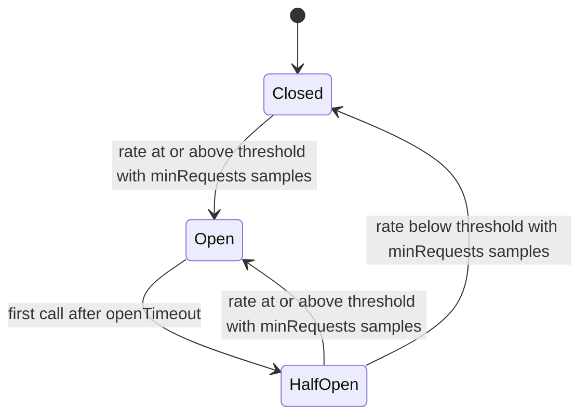

# 26. Circuit Breaker, Memory, Testkit

## Contents

- [What you will learn](#what-you-will-learn)
- [26.1 The circuit breaker's states](#261-the-circuit-breakers-states)
- [26.2 Options, defaults and validation](#262-options-defaults-and-validation)
- [26.3 The rolling window](#263-the-rolling-window)
- [26.4 `Execute`, step by step](#264-execute-step-by-step)
- [26.5 Recording an outcome and changing state](#265-recording-an-outcome-and-changing-state)
- [26.6 Errors and metrics](#266-errors-and-metrics)
- [26.7 Concurrency](#267-concurrency)
- [26.8 Where GoAkt uses the breaker](#268-where-goakt-uses-the-breaker)
- [26.9 Reading memory on each platform](#269-reading-memory-on-each-platform)
- [26.10 Where the memory figures are used](#2610-where-the-memory-figures-are-used)
- [26.11 `TestKit`](#2611-testkit)
- [26.12 Probes](#2612-probes)
- [26.13 Grain probes](#2613-grain-probes)
- [26.14 Multi-node clusters](#2614-multi-node-clusters)
- [Guarantees](#guarantees)
- [Implementation details (may change)](#implementation-details-may-change)
- [Behaviours to know](#behaviours-to-know)

## What you will learn

- The circuit breaker's three states, what moves it between them, and why half-open recovery needs `minRequests` probes, not one.
- How the rolling window of buckets counts outcomes and ages them out, and what each option does when it is invalid.
- How `Execute` decides whether to run a call, what it records, and which errors and fallbacks a caller sees.
- Where GoAkt uses the breaker (the `PipeTo` family) and what an open breaker actually stops.
- How the `memory` package reads total, free and used memory on each platform, what "free" means on each, and the one place GoAkt reads these figures.
- How `TestKit`, `Probe`, `GrainProbe` and `MultiNodes` work inside, and the traps in using them.

The three packages are independent of each other. `breaker` and `memory` are small leaf packages the actor system imports; `testkit` sits on top of the actor system and is never imported by it. How the repository's own test suite is organised is [Chapter 27](chap-27.md), Testing GoAkt.

## 26.1 The circuit breaker's states

A `CircuitBreaker` (`breaker/breaker.go`) guards a call that can fail. It counts the outcomes of recent calls in a rolling window and, when too many fail, stops running calls for a while. It has three states, `Closed`, `Open` and `HalfOpen` in `breaker/state.go`, stored as an `int32` (`State`); `State.String` in `breaker/state.go` renders them as `closed`, `open` and `half-open`, and any other value as `unknown`.

| State | A call | What ends the state |
|---|---|---|
| `Closed` | runs, with no limit on concurrency | a recorded outcome that leaves at least `minRequests` samples in the window with a failure rate at or above `failureRate` |
| `Open` | is rejected with `ErrOpen`, without running | the first call after `openTimeout` has elapsed |
| `HalfOpen` | runs only if one of `halfOpenMaxCalls` tokens is free; otherwise rejected with `ErrOpen` | at least `minRequests` samples: below the threshold closes, at or above reopens |

Two points the diagram hides:

- **Nothing happens on a timer.** There is no goroutine. `Open` becomes `HalfOpen` only when a call arrives after the deadline (`CircuitBreaker.tryAcquire` in `breaker/breaker.go`); a breaker nobody calls stays `Open` forever, and `State` keeps reporting `open`.
- **Half-open recovery is decided by the same rule as tripping.** Entering `HalfOpen` empties the window, and the breaker then waits for `minRequests` fresh samples before it decides either way (`CircuitBreaker.record` in `breaker/breaker.go`). With the defaults (`minRequests` 10, one half-open token), recovery takes ten probes run one after another, and a single failed probe does not reopen the breaker: five failures out of ten do.

## 26.2 Options, defaults and validation

The options are fields of `options` in `breaker/options.go`, set by functional options:

| Option | Field | Default (`defaultOptions`) | `options.Validate` rejects |
|---|---|---|---|
| `WithFailureRate(r)` | `failureRate` | 0.5 | `r < 0` or `r > 1` |
| `WithMinRequests(n)` | `minRequests` | 10 | `n < 1` |
| `WithOpenTimeout(d)` | `openTimeout` | 30 s | `d <= 0` |
| `WithWindow(d, n)` | `window`, `buckets` | 60 s, 12 buckets of 5 s | `d <= 0`, `n < 1`, or a bucket (`d / n`) shorter than 1 ms |
| `WithHalfOpenMaxCalls(n)` | `halfOpenMaxCalls` | 1 | `n < 1` |
| `WithClock(c)` | `clock` | `time.Now` | `nil` |

There are two constructors, which differ only in what they do with an invalid value:

- `NewCircuitBreaker` in `breaker/breaker.go` applies the options to the defaults and calls `options.Sanitize` in `breaker/options.go`, which **replaces each invalid field with its default, field by field**. A failure rate of 1.5 becomes 0.5; `WithWindow(0, 0)` becomes 60 s and 12 buckets. `Sanitize` does not apply the 1 ms bucket rule, so `WithWindow(time.Millisecond, 2)` is accepted with 500 µs buckets.
- `NewCircuitBreakerWithValidation` in `breaker/breaker.go` calls `options.Validate` and returns its first error instead of a breaker. The errors are plain `fmt.Errorf` values describing the offending value; there is no sentinel to match.

Both end in `newCircuitBreaker` in `breaker/breaker.go`, which builds the window, creates the half-open token channel `semCh` with capacity `halfOpenMaxCalls`, and stores `Closed`.

`failureRate` is compared with `>=`, not `>` (`CircuitBreaker.record` in `breaker/breaker.go`). With the default 0.5, five failures in ten samples trip the breaker. With 0, any sample trips it once `minRequests` samples exist, successes included; the package's own tests use `WithFailureRate(0.0)` with `WithMinRequests(1)` to open a breaker with one failure. With 1, only a window of nothing but failures trips it.

## 26.3 The rolling window

The window is a ring of `bucket` values, each holding a success count, a failure count and its start time (`bucket` and `bucketWindow` in `breaker/bucket.go`). `newBuckets` in `breaker/bucket.go` divides the window into `n` buckets of `window / n`; it raises `n` to at least 1 and the bucket length to at least 1 ns, so even values that bypass both `Validate` and `Sanitize` cannot make a zero-length bucket. The `bucketWindow` keeps a `cursor` on the current bucket and `lastUpdate`, the start time of that bucket.

**Advancing.** Adding and snapshotting first move the window to the present (`bucketWindow.advanceLocked` in `breaker/bucket.go`). In order:

1. If less than one bucket length has passed since `lastUpdate`, nothing moves.
2. If a whole window or more has passed, every bucket is cleared and the window is realigned at the current time (`bucketWindow.hardResetLocked` in `breaker/bucket.go`).
3. Otherwise, for each whole bucket length that has passed, the cursor steps forward, `lastUpdate` grows by exactly one bucket length, and the bucket entered is cleared. Adding the bucket length rather than setting `lastUpdate` to now keeps the buckets aligned to their grid: after 1.5 bucket lengths, the cursor moves once and the remaining half bucket still counts towards the next step.

Counts therefore expire a whole bucket at a time. A sample is dropped when the cursor comes back round to its bucket, `n` bucket lengths after that bucket started, so it stays in the totals for between `(n - 1)` and `n` bucket lengths depending on where in its bucket it landed.

**Adding.** `bucketWindow.add` in `breaker/bucket.go` advances, increments the current bucket and returns the totals of all buckets, all under one lock acquisition, so the caller evaluates the state from a consistent snapshot. `bucketWindow.snapshot` advances and sums in the same way, reading the clock under the lock, and reports the window as `[now - window, now]`. `bucketWindow.reset` clears every bucket and realigns the window at the current time.

## 26.4 `Execute`, step by step

`CircuitBreaker.Execute` in `breaker/breaker.go` takes a context, the function to protect, and an optional fallback. In order:

1. **Context already done.** If `ctx.Err()` is set, the call goes to the fallback with an `*Error` of type `ErrorTypeTimeout`, message "context done before execution" and the context's error as cause (`contextError` in `breaker/breaker.go`). `fn` does not run, no token is taken and nothing is recorded.
2. **Admission.** `CircuitBreaker.tryAcquire` in `breaker/breaker.go` returns whether the call may run and whether it holds a token:
   - `Closed`: allowed, no token.
   - `Open` before `openUntil`: rejected.
   - `Open` at or after `openUntil`: the breaker moves to `HalfOpen` (which empties the window), then continues as half-open.
   - `HalfOpen`: a non-blocking send on `semCh`; if the channel is full the call is rejected.

   A rejected call goes to the fallback with `ErrOpen`, and nothing is recorded. A token is released by a deferred `CircuitBreaker.release` when `Execute` returns: after the outcome is recorded and after the fallback, if one is called, has returned. A slow fallback therefore keeps holding a half-open token.
3. **Run.** `CircuitBreaker.invoke` in `breaker/breaker.go` runs `fn` on the calling goroutine and turns a panic into an `*Error` of type `ErrorTypePanic` (`CircuitBreaker.panicError` in `breaker/breaker.go`). The cause is a GoAkt `PanicError`: a panic value that already is one is kept, any other error or value is wrapped in a new one.
4. **Classify.** The outcome is recorded or not:

| `fn` returned | `ctx.Err()` afterwards | Recorded | Caller receives |
|---|---|---|---|
| no error | anything | success | `fn`'s value; the fallback is not called |
| an error, or a panic | `context.Canceled` | nothing | the fallback's result with `fn`'s error, or `fn`'s error |
| an error, or a panic | anything else, deadline expiry included | failure | the fallback's result with `fn`'s error, or `fn`'s error |

The comment on `Execute` gives the reason for the second row: cancellation by the caller says nothing about the health of the protected resource, so it neither trips nor heals the breaker, whereas a deadline expiry counts as a failure.

**The fallback.** Only the first fallback passed is used (`CircuitBreaker.withFallback` in `breaker/breaker.go`). It receives the error that would otherwise be returned (`ErrOpen`, the pre-execution timeout, or `fn`'s error) and its own `(value, error)` becomes the result, so a fallback can turn a rejection into a default value or into a different error. Without a fallback, the caller gets `nil` and the error.

**`fn` must honour its context.** The breaker never abandons a running call: `Execute` returns only when `fn` does. It does not impose a timeout of its own; a deadline must come from `ctx`.

## 26.5 Recording an outcome and changing state

`CircuitBreaker.record` in `breaker/breaker.go` runs after every call that ran, except a failed call whose context was cancelled (a successful call is recorded even then). In order:

1. Add the outcome to the window and take the totals from the same lock acquisition ([§26.3](#263-the-rolling-window)).
2. Store the time in `lastSuccess` or `lastFailure`.
3. If the window holds fewer than `minRequests` samples, stop.
4. If `failures / total >= failureRate`, move to `Open`.
5. Otherwise, if the state is `HalfOpen`, move to `Closed`.

A success can therefore open the breaker, when it is the sample that brings the window up to `minRequests` and the rate is already at or above the threshold.

All three moves go through `CircuitBreaker.transitionTo` in `breaker/breaker.go`, under the breaker's mutex:

- If the breaker is already in the target state, it returns `false` and changes nothing. An `Open` breaker that records another failure (from a call admitted before it opened) does **not** push `openUntil` further out.
- Moving to `Open` sets `openUntil` to now plus `openTimeout`, before the state is stored.
- Moving to `HalfOpen` or `Closed` empties the window, so, in the words of the code comment, probing and recovery evaluate fresh samples. Moving to `Open` does not: while the breaker is open, `Metrics` still shows the counts that tripped it, until they age out of the window.

**Half-open probing.** The `halfOpenMaxCalls` tokens bound how many probes run **at the same time**, not how many run in total: a probe that finishes returns its token and the next call can take it. The decision to close or reopen waits for `minRequests` samples, as in step 3. A reopen from `HalfOpen` re-arms `openUntil`, because the state actually changes. A call admitted while the breaker was `Closed` that finishes while it is `HalfOpen` holds no token, but its outcome is recorded in the fresh window like a probe's.

## 26.6 Errors and metrics

`Error` in `breaker/errors.go` carries a `Type` (`ErrorTypeOpen`, `ErrorTypeTimeout` or `ErrorTypePanic`), the `State` when it was made, a `Message` and an optional `Cause`. `Error.Error` formats it as `circuit-breaker [<state>]: <message>`, followed by `: <cause>` when there is one. `Error.Unwrap` returns the cause.

`Error.Is` in `breaker/errors.go` matches another `*Error` **by type alone**, ignoring state, message and cause. That is what makes the two sentinels usable with `errors.Is`:

| Sentinel | Type | Returned when | Also matches |
|---|---|---|---|
| `ErrOpen` | `ErrorTypeOpen` | the breaker is open, or half-open with every token taken | nothing else |
| `ErrTimeout` | `ErrorTypeTimeout` | the context was done before `fn` ran (a fresh `*Error` from `contextError`, not the sentinel itself) | the context's error through `Unwrap`: `context.Canceled` or `context.DeadlineExceeded` |

There is no sentinel for panics; check the `Type` of an `*Error` obtained with `errors.As`, or look for the `PanicError` cause. A deadline that expires while `fn` is running produces `fn`'s own error, typically `context.DeadlineExceeded`, which does not match `ErrTimeout`. `ErrOpen` always says `State: Open`, even when it rejects a call because the half-open tokens are taken.

`CircuitBreaker.Metrics` in `breaker/breaker.go` returns a `Metrics` value (`breaker/metrics.go`): the state, the successes, failures and total in the window, the failure rate (0 for an empty window), the window length and bounds, and the times of the last success and failure (zero if none). The counts come from `bucketWindow.snapshot`, so reading metrics also advances the window. The state is read separately after the counts, so under concurrent calls the two can belong to slightly different moments. `lastSuccess` and `lastFailure` are never cleared by a state change.

## 26.7 Concurrency

The breaker is safe for concurrent use and keeps the closed-state path cheap:

| Data | Protection |
|---|---|
| `state` | `atomic.Int32`; read without a lock on every call |
| `openUntil`, `lastSuccess`, `lastFailure` | `atomic.Int64`, Unix nanoseconds |
| the window | the `bucketWindow`'s own mutex |
| state changes | the breaker's mutex, in `CircuitBreaker.transitionTo` |
| half-open admission | the buffered channel `semCh` |

A call in `Closed` state takes no breaker lock: it reads the state atomically, runs `fn`, and takes only the window's mutex to record. The success path in `Closed` state does not allocate. The field comment on `semCh` explains why it is created once and never replaced: every acquired token is released on the same channel, so the accounting stays balanced across state changes, and `release` can never block. `CircuitBreaker` carries a `locker.NoCopy` marker and a mutex, so it must be shared by pointer, never copied.

## 26.8 Where GoAkt uses the breaker

The only user inside GoAkt is the `PipeTo` family, through `WithCircuitBreaker` in `actor/pipe_option.go`, which stores the breaker in `pipeConfig.circuitBreaker`. [Chapter 5, §5.7](chap-05.md#57-pipeto) explains `PipeTo` itself, including how `WithTimeout` combines with the breaker. The breaker's role is the same in every variant:

| Caller | Completion path | On a breaker error |
|---|---|---|
| `PID.PipeTo` in `actor/pid.go`, and `ReceiveContext.PipeTo` in `actor/receive_context.go` which calls it | `PID.handleCompletion` in `actor/pid.go` | dead letter |
| `PID.PipeToName` in `actor/pid.go`, and `ReceiveContext.PipeToName` in `actor/receive_context.go` and `GrainContext.PipeToActor` in `actor/grain_context.go` which call it | a goroutine in `PID.PipeToName` | dead letter |
| `GrainContext.PipeToGrain` and `GrainContext.PipeToSelf` in `actor/grain_context.go` | `handleGrainCompletion` in `actor/grain_context.go` | a `StatusFailure` message to the target grain |

Each path first starts the task with `New` in `internal/future/future.go`, which runs it on its own goroutine at once, and then calls `Execute` with a function that **awaits** the future. So:

- **An open breaker does not stop the task.** The task is already running when `Execute` rejects the await; its result is discarded, and the dead letter or `StatusFailure` carries the text of `ErrOpen` as its reason.
- **What counts as a failure** is the task's error, or the await's context ending by deadline (a `WithTimeout`, or a deadline already on the caller's context). A task error is a failure even though it says nothing about delivery.
- **Cancellation is mostly absent.** The `ReceiveContext` and `GrainContext` variants pass a context without cancellation, so only a `WithTimeout` deadline can end the await early. A direct `PID.PipeTo` or `PID.PipeToName` with a cancellable context that is cancelled during the await records nothing ([§26.4](#264-execute-step-by-step)).
- **The breaker's panic recovery does not cover the task.** It wraps only the await; the task runs on the future's goroutine, outside `Execute`, and `New` installs no recovery there, so a panicking task crashes the process.
- **The breaker only learns across calls.** `PipeTo` uses whatever instance it is given. To trip after repeated failures, the same `CircuitBreaker` must be passed to many `PipeTo` calls; a fresh breaker per call sees one sample and, with `minRequests` above 1, never opens.

## 26.9 Reading memory on each platform

The `memory` package has three functions. `Used` is portable; `Size` and `Free` have one implementation per platform, selected by build tags.

`Used` in `memory/memory.go` returns `runtime.MemStats.Alloc`: the bytes allocated on the **Go heap of this process** and not yet freed. Its comment notes that this excludes stacks, mapped regions and cgo allocations. It is not the host's used memory, and `Size - Free` is not `Used`.

| Platform (build tag) | `Size` | `Free` | What "free" means |
|---|---|---|---|
| `linux` (`memory/memory_linux.go`) | `sysinfo(2)`: `Totalram * Unit` | `sysinfo(2)`: `Freeram * Unit` | memory not used at all; reclaimable buffers and cache are excluded |
| `darwin` (`memory/memory_darwin.go`) | sysctl `hw.memsize`, read as 64-bit | sysctl `vm.page_free_count` × `hw.pagesize`, both read as 32-bit | pages on the free list only; inactive, purgeable and speculative pages are excluded, so it understates what an allocation could get |
| `freebsd`, `openbsd`, `dragonfly`, `netbsd` (`memory/memory_bsd.go`) | sysctl `hw.physmem64`, else `hw.physmem` | sysctl `hw.usermem64`, else `hw.usermem` | physical memory available to user space; this includes memory applications are using |
| `windows` (`memory/memory_windows.go`) | `GlobalMemoryStatusEx`: `ullTotalPhys` | `GlobalMemoryStatusEx`: `ullAvailPhys` | available physical memory |
| any other `GOOS` (`memory/memory_unsupported.go`) | `errors.ErrUnsupported` | `errors.ErrUnsupported` | none |

Details that matter when changing these files:

- **Integer widths are part of the contract.** On macOS, `vm.page_free_count` and `hw.pagesize` are 32-bit nodes; the comment on `Free` in `memory/memory_darwin.go` records that an 8-byte read of `vm.page_free_count` fails with `EIO`. The page size is read from the kernel rather than assumed, because Apple Silicon and Intel Macs differ (16 KiB and 4 KiB pages), as the darwin tests explain.
- **The BSDs probe for the 64-bit node first.** `sysctlMemSize` in `memory/memory_bsd.go` tries the name with a `64` suffix, then the classic name. Its comment explains: NetBSD and OpenBSD type the classic nodes as 32-bit and would truncate above 4 GiB, while FreeBSD and DragonFly type them as `long` and publish no 64-bit variant. If neither node gives a 64-bit read, the error is returned rather than a truncated value.
- **Windows resolves the API once.** `loadGlobalMemoryStatusEx` in `memory/memory_windows.go` loads `kernel32.dll` and finds `GlobalMemoryStatusEx` under a `sync.Once`, caching the error too. `callGlobalMemoryStatusEx` fills a `memStatusEx`, a 64-byte mirror of `MEMORYSTATUSEX` whose `dwLength` is set to 64, and inspects the call's error only when the return value is 0.
- **The unsupported stub keeps builds green.** Its comment gives the reason: importing the package compiles on every platform (`wasip1`, `js`, `solaris`, `aix`, `plan9` and others), and the limitation surfaces as a runtime error instead of a build failure in a consumer's toolchain. `Used` still works there.

## 26.10 Where the memory figures are used

There is one call site: `actorSystem.Metric` in `actor/actor_system.go`. When the system is started, every call reads `Size`, `Free` and `Used` afresh and puts them in a `Metric`, readable through `Metric.MemorySize`, `Metric.MemoryAvailable` and `Metric.MemoryUsed` in `actor/metric.go`. Errors from `Size` and `Free` are ignored, so on an unsupported platform the two figures are 0. `Metric` returns `nil` when the system is not started.

The figures are informational only. **Nothing in the actor system decides anything from memory.** In particular, least-load placement does not: `actorSystem.selectPlacementPeer` in `actor/spawn.go` and `actorSystem.selectActivationPeer` in `actor/grain_engine.go` both call `actorSystem.leastLoadedPeer` in `actor/grain_engine.go`, which asks every candidate peer for its node metric and picks the lowest load; the peer answers in `actorSystem.getNodeMetricHandler` in `actor/remote_server.go` with its number of actors plus its number of grains. Placement is [Chapter 21](chap-21.md), Placement, Singletons and Relocation.

## 26.11 `TestKit`

`New` in `testkit/testkit.go` builds a `TestKit` around a fresh, started, standalone actor system named `testkit`: no remoting, no cluster, an actor init timeout of one second with five retries, the extensions given with `WithExtensions`, and a discard logger unless `WithLogging(level)` installs a Zap logger on standard error (`testkit/option.go`). A failure to create or start the system calls `t.Fatal`.

Every helper turns an error into a test failure through `require`, and every helper except `ActorSystem` and `Shutdown` first requires the kit to be started:

| Helper | What it does |
|---|---|
| `TestKit.ActorSystem` | the underlying system, for anything not wrapped |
| `TestKit.Spawn` | spawns a top-level actor; returns nothing, so look the PID up with `ActorOf` if you need it |
| `TestKit.SpawnChild` | finds the parent by name with `ActorOf`, then spawns the child under it |
| `TestKit.Kill` | finds the actor by name and calls `Shutdown` on it |
| `TestKit.Subscribe` | subscribes to the event stream and registers a `t.Cleanup` that unsubscribes |
| `TestKit.NewProbe`, `TestKit.NewGrainProbe` | create the probes of [§26.12](#2612-probes) and [§26.13](#2613-grain-probes) |
| `GrainOf` in `testkit/grain_of.go` | `actor.GrainOf[T]` on the kit's system: activates or finds the grain of kind `T` |
| `TestKit.GrainIdentity` | the older, factory-based form; deprecated in favour of `GrainOf` |
| `TestKit.Shutdown` | stops the system and marks the kit stopped |

`Shutdown` is not idempotent: a second call fails the test, because stopping a stopped system returns `ErrActorSystemNotStarted`. The same error defeats `Subscribe`'s cleanup when the kit was shut down first, which a `defer kit.Shutdown(ctx)` in the test body does: deferred calls run before `t.Cleanup` functions, and `actorSystem.Unsubscribe` in `actor/actor_system.go` refuses to run on a stopped system, so the cleanup's `require.NoError` fails the test. Shut the kit down from a `t.Cleanup` registered before `Subscribe` is called, as the package's own `newTestKit` in `testkit/testkit_test.go` does, or avoid `Subscribe` when shutting down in the body.

## 26.12 Probes

A `Probe` (`testkit/probe.go`) is an ordinary actor whose `Receive` hands every message to the test goroutine, plus a set of assertions that read them.

**Creation.** `newProbe` in `testkit/probe.go` creates a buffered channel of `MessagesQueueMax` (1,000) entries, spawns a `probeActor` that holds it, under the name `probe-N` where `N` comes from the process-wide counter `probeCounter` (its comment: to avoid name collisions between probes in one test or across tests in the same process), and subscribes to the event stream. The default timeout is `DefaultTimeout`, three seconds. The probe actor is spawned with no options, so it gets the system's default passivation, two idle minutes ([Chapter 10, §10.1](chap-10.md#101-strategies)).

**Recording.** `probeActor.Receive` in `testkit/probe.go` ignores `PostStart` and `PoisonPill` and pushes every other message onto the channel together with `ctx.Sender()`. The push blocks when the channel is full, which blocks the dispatcher worker running the probe's turn ([Chapter 7](chap-07.md)) until the test reads.

**Reading.** Every assertion goes through `probe.receiveOne` in `testkit/probe.go`: wait for the next queued message or for a pooled timer (`Pool` in `internal/timer/timer.go`) set to the timeout, and return `nil` on timeout. When it returns a non-nil message, it records the sender, which `Sender` returns afterwards. The assertions are thin checks on that one message:

| Assertion (default timeout / `Within`) | Passes when the next message, within the timeout, ... |
|---|---|
| `ExpectMessage` / `ExpectMessageWithin` | has the same type and is `reflect.DeepEqual` to the expected value |
| `ExpectMessageOfType` / `ExpectMessageOfTypeWithin` | has exactly the same dynamic type as the example |
| `ExpectAnyMessage` / `ExpectAnyMessageWithin` | exists; it is returned |
| `ExpectMessageMatching` (default timeout only) | satisfies the predicate |
| `ExpectNoMessage` (default timeout only) | does not exist: the full timeout passes with nothing queued |
| `ExpectTerminated` / `ExpectTerminatedWithin` | is a `*Terminated` whose sender has the given name |

Each assertion consumes exactly one message and looks at nothing beyond it. `ExpectMessage` of B fails if A is queued first; there is no "skip until". `ClearMessages` drains the queue without waiting, and leaves `Sender` as it was.

**Sending.**

- `probe.Send` in `testkit/probe.go` uses the probe's own PID as sender, so replies come back to the probe. In a cluster it calls `SendAsync` by name, which finds actors on any node; otherwise it resolves the name with `ActorOf` and calls `Tell`.
- `probe.SendSync` resolves the name with `ActorOf`, then calls `SendSync` by name in a cluster or `Ask` otherwise, and **pushes the reply onto the probe's own queue** with the target as sender, so the reply is asserted with the `Expect` methods like any message. The push is from the test goroutine and blocks if the queue is full.

**Watching.** `probe.Watch` and `probe.WatchNamed` (which resolves the name first) make the probe actor watch the target. When the target stops, it tells its watchers `Terminated` with itself as sender ([Chapter 9, §9.8](chap-09.md#98-death-watch)), and `ExpectTerminated` checks that sender's name. The watch must be in place before the stop.

**Children.** `probe.expectChildSpawned` in `testkit/probe.go` reads the probe's event-stream subscriber, not the message queue. Every 50 ms it drains everything the subscriber has buffered (`subscriber.Iterator` in `eventstream/subscriber.go`; [Chapter 11, §11.3](chap-11.md#113-the-event-stream)) and looks for an `ActorChildCreated` whose parent and child names match. The subscriber exists from the probe's creation, so a child spawned before the probe was created is never seen. The drain discards every other event in the batch, including the `ActorChildCreated` of other children.

**Stopping.** `probe.Stop` in `testkit/probe.go` shuts the subscriber down, unsubscribes it (ignoring the error) and shuts the probe actor down, failing the test if that fails. It also works after the kit has shut down: shutting down an actor that is no longer running returns `nil` (`PID.stop` in `actor/pid.go`).

## 26.13 Grain probes

A `GrainProbe` (`testkit/grain_probe.go`) is not an actor and has no PID. `newGrainProbe` creates only a 1,000-entry queue, a timer pool and a reference to the system; the default timeout is `GrainDefaultTimeout`, 500 ms.

- `grainProbe.SendSync` in `testkit/grain_probe.go` calls `AskGrain` and pushes the reply onto the queue. **It is the only thing that ever fills the queue.**
- `grainProbe.Send` calls `TellGrain` and returns. A grain has no sender to reply to for a tell sent this way, so after `Send` the only meaningful assertion is `ExpectNoResponse`.
- The `ExpectResponse…` methods mirror the probe's: `grainProbe.receiveOne` waits for the next queued reply, and the checks are the same `reflect.DeepEqual`, type and presence tests.
- `grainProbe.ExpectTerminated` in `testkit/grain_probe.go` does not use the queue and has no default-timeout form. It requires the system to be running, then polls `Grains` every 10 ms until the identity is absent or the duration has passed. In a cluster, `actorSystem.Grains` in `actor/grain_engine.go` also lists the grains the cluster registry knows of, so absence means deactivated everywhere the registry can see; if the registry query fails, that poll sees only the local grains.

There is no `Stop`: nothing needs releasing. `NodeGrainOf` in `testkit/grain_of.go` is the cluster-node counterpart of `GrainOf`, and requires the node to be running.

## 26.14 Multi-node clusters

`MultiNodes` (`testkit/multi_nodes.go`) runs a whole cluster inside the test process.

**`NewMultiNodes`** records the testing value, a logger, the actor kinds to register on every node and the extensions. It starts nothing.

**`MultiNodes.Start`** in `testkit/multi_nodes.go` starts an embedded NATS server on `127.0.0.1` with a random port, waits up to two seconds for it to accept connections, and fails the test otherwise. A second call is a no-op. Each `MultiNodes` has its own server, so two in one process form two separate clusters.

**`MultiNodes.StartNode`** builds and starts one node; it fails the test if `Start` has not been called. In order:

1. Take three free ports from `Get` in `internal/net/dynaport.go` (ports free on both TCP and UDP, never handed out twice in the process; it panics rather than failing the test if it cannot find them): discovery, peers and remoting.
2. Create a NATS discovery provider ([Chapter 19](chap-19.md), Membership and Discovery) on the shared server, subject `testSubject`, with the discovery port.
3. Create an actor system named `testSystem` with remoting on the remoting port, the extensions, a three-minute shutdown timeout, and a cluster config: the kinds, 7 partitions, replica count 1, minimum peers quorum 1, the peers and discovery ports, and a 300 ms cluster state sync interval.
4. Start it and **pause two seconds**, then register a `TestNode` under the given name.

The name is only the key in the `MultiNodes` map and the value `TestNode.NodeName` returns; every node's actor system is called `testSystem`. Starting a second node under a name already in use replaces the first in the map, and the replaced node is then never stopped by `Stop`.

**`TestNode`** (`testkit/testnode.go`) offers `Spawn`, `SpawnSingleton`, `Kill`, `Subscribe`, `SpawnProbe`, `SpawnGrainProbe` and the deprecated `GrainIdentity`, with the same behaviour as the `TestKit` helpers, on that node's system, plus `NodeName` and `ActorSystem`. The helpers that act on the system, except `GrainIdentity`, require the node to be running. Its methods have value receivers but share the `created` flag by pointer, so a node stopped through `MultiNodes.StopNode` refuses further use.

**Stopping.** `MultiNodes.StopNode` stops the node's actor system, then closes its discovery provider, fails the test on error, marks the node stopped (its `created` flag) and removes the node from the map. `MultiNodes.Stop` stops the actor system and closes the discovery provider of every node in map order, without touching their `created` flags, then shuts the NATS server down and empties the map; it is a no-op when not started, so it can be registered with `t.Cleanup(multi.Stop)` right after `Start`. If one node fails to stop, `Stop` calls `Fatalf` at once, leaving the remaining nodes and the NATS server running. `MultiNodes.GetNode` and `MultiNodes.StopNode` fail the test for an unknown name or before `Start`, and `MultiNodes.NodeCount` returns the number of nodes in the map.

A typical cluster test therefore reads: `NewMultiNodes`, `Start`, `t.Cleanup(multi.Stop)`, three `StartNode` calls, then probes spawned on the nodes. Each `StartNode` costs at least two seconds.

## Guarantees

| Statement | Enforced by |
|---|---|
| `NewCircuitBreakerWithValidation` rejects invalid options; `NewCircuitBreaker` replaces each invalid value with its default | `TestNewCircuitBreakerWithValidation` and `TestNewCircuitBreakerSanitizesInvalidOptions` in `breaker/breaker_test.go` |
| `Validate` accepts the defaults and rejects each out-of-range field, a nil clock and a bucket shorter than 1 ms; `Sanitize` makes empty options valid and resets an out-of-range failure rate to 0.5 | `TestOptionsValidate`, `TestOptionsSanitize` and `TestOptionsSanitizeClampsFailureRate` in `breaker/options_test.go` |
| A failure reaching the threshold with `minRequests` samples opens the breaker; an open breaker returns `ErrOpen` without running `fn`, and hands `ErrOpen` to the fallback | `TestExecuteFailureOpensBreaker`, `TestExecuteOpenWithoutFallback` and `TestExecuteOpenInvokesFallbackWithErrOpen` in `breaker/breaker_test.go` |
| The fallback receives `fn`'s error, and the fallback's own error is returned | `TestExecuteFallbackReceivesFunctionError` and `TestExecuteFallbackErrorPropagates` in `breaker/breaker_test.go` |
| A context done before the call skips `fn` and returns an error matching `ErrTimeout` and the context's error, recording nothing | `TestExecuteContextDoneBeforeExecution` in `breaker/breaker_test.go` |
| Caller cancellation during `fn` is not recorded; a deadline expiry is a failure | `TestExecuteCallerCancellationIsNotRecorded` and `TestExecuteDeadlineExpiryIsRecordedAsFailure` in `breaker/breaker_test.go` |
| A panic in `fn` becomes an `ErrorTypePanic` error wrapping a `PanicError` and counts as a failure | `TestExecutePanicHandledAsFailure` in `breaker/breaker_test.go` |
| An open breaker rejects until `openTimeout`, then admits a probe in `HalfOpen`; a successful probe with `minRequests` 1 closes it | `TestOpenRejectsUntilTimeoutThenRecovers` and `TestOpenTimeoutMovesToHalfOpen` in `breaker/breaker_test.go` |
| Half-open admits at most `halfOpenMaxCalls` concurrent probes, rejects the rest with `ErrOpen`, and releases every token | `TestHalfOpenCapsConcurrentProbes` in `breaker/breaker_test.go` |
| A failed probe reopens the breaker and re-arms the open timeout | `TestHalfOpenFailureReopensBreaker` in `breaker/breaker_test.go` |
| Half-open stays half-open until `minRequests` samples are recorded | `TestHalfOpenStaysUntilEnoughSamples` in `breaker/breaker_test.go` |
| A closed breaker admits a call without a token; a transition to the current state reports `false` | `TestTryAcquireClosedNeedsNoToken` and `TestTransitionToSameStateReturnsFalse` in `breaker/breaker_test.go` |
| `Metrics` reports counts, rate, window bounds and last success and failure times; an empty breaker reports zeros | `TestMetricsSnapshot` and `TestMetricsEmptySnapshot` in `breaker/breaker_test.go` |
| The closed-state success path does not allocate | `TestExecuteSuccessPathDoesNotAllocate` in `breaker/breaker_test.go` |
| Counts older than the window are dropped, a bucket at a time; a window idle for longer than its length is reset at the current time | `TestHardResetAfterIdle` in `breaker/breaker_test.go`; `TestBucketAdvanceRotatesAndExpiresOldCounts`, `TestBucketHardResetWhenWindowGoesStale` and `TestBucketSnapshotExpiresStaleWindow` in `breaker/bucket_test.go` |
| Advancing keeps buckets aligned; `reset` realigns at the current time; `newBuckets` raises the count to 1 and the bucket length to 1 ns | `TestBucketAdvanceKeepsAlignment`, `TestBucketResetClearsCountsAndRealignsWindow`, `TestNewBucketsNormalizesCount` and `TestNewBucketsEnforcesMinimumDuration` in `breaker/bucket_test.go` |
| `Error` formats with and without a cause, matches sentinels by type only, and unwraps to its cause; states render as `closed`, `open`, `half-open`, `unknown` | `TestError_Error`, `TestError_Is` and `TestError_Unwrap` in `breaker/errors_test.go`; `TestStateString` in `breaker/state_test.go` |
| `PipeTo` and `PipeToName` with a breaker deliver a successful result, and send a failed task's error to the dead letters | `TestPipeTo` and `TestPipeToName` in `actor/pid_test.go` |
| `PipeToGrain` with a breaker delivers a successful result | `TestGrainContextPipeToGrain` in `actor/grain_context_test.go` |
| On supported platforms `Size` is above 64 MiB, `Free` is non-zero and at most `Size`, and `Used` is non-zero | `TestSize`, `TestFree`, `TestFreeDoesNotExceedSize` and `TestUsed` in `memory/memory_test.go` |
| On macOS the page size matches the runtime's, `Free` is a whole number of pages, and the sysctls are read at their kernel widths | `TestPageSizeMatchesRuntime`, `TestFreeIsWholePages` and `TestSysctlWidths` in `memory/memory_darwin_test.go` |
| On unsupported platforms `Size` and `Free` return `errors.ErrUnsupported` and `Used` still works | `TestSizeUnsupported`, `TestFreeUnsupported` and `TestUsedOnUnsupportedPlatform` in `memory/memory_unsupported_test.go` |
| `ActorSystem.Metric` reports non-zero memory size, used and available | `TestActorSystem` in `actor/actor_system_test.go` |
| `TestKit` spawns actors and children, kills by name, subscribes, creates grain identities, and `Shutdown` stops its system | `TestTestKit` in `testkit/testkit_test.go` |
| A probe receives replies with their sender, checks value, type, predicate and absence, records a `SendSync` reply, observes `Terminated` after `Watch` or `WatchNamed`, sees a child spawned after its creation, and two probes get distinct names | `TestTestProbe` in `testkit/probe_test.go` |
| A grain probe records `SendSync` replies, sees nothing after `Send`, and observes a grain's deactivation | `TestGrainProbe` in `testkit/grain_probe_test.go` |
| `GrainOf` and `NodeGrainOf` return usable identities | `TestGrainOf` and `TestNodeGrainOf` in `testkit/grain_of_test.go` |
| A `TestNode`'s helpers work on a cluster node; `NodeCount`, `GetNode` and `StopNode` track the nodes | `TestTestNode` and `TestMultiNodes` in `testkit/testnode_test.go` |
| Three nodes started by one `MultiNodes` form one cluster that agrees on a single leader | `TestLeaderElection` in `testkit/leader_test.go` |

## Implementation details (may change)

- The breaker defaults: failure rate 0.5, 10 minimum requests, 30 s open timeout, 60 s window of 12 buckets, one half-open token.
- The 1 ms minimum bucket in `Validate`, and the 1 ns floor in `newBuckets`.
- No goroutine in the breaker: the move from `Open` to `HalfOpen` happens on the first call after the deadline.
- `openUntil` is written before the state when opening; the window is emptied on entering `HalfOpen` and `Closed` but not `Open`.
- `Free` on macOS counts the free list only; on Linux it excludes buffers and cache; on the BSDs it is `hw.usermem`.
- The probe queue of 1,000 entries, the three-second probe and 500 ms grain-probe default timeouts, the 50 ms child-spawn poll and the 10 ms grain-termination poll.
- Probe names `probe-N` from a process-wide counter.
- The `TestKit` system's name, one-second init timeout and five init retries.
- The `MultiNodes` cluster settings: system name `testSystem`, NATS subject `testSubject`, 7 partitions, replica count 1, quorum 1, 300 ms state sync, three-minute shutdown timeout, and the two-second pause after each node starts.

## Behaviours to know

| Behaviour | Source |
|---|---|
| A failure rate of 0 opens the breaker once `minRequests` samples exist, even if all succeeded; the threshold is reached at equality | `CircuitBreaker.record` in `breaker/breaker.go` |
| Half-open needs `minRequests` probes to decide; one failed probe does not reopen it unless `minRequests` is 1 | `CircuitBreaker.record` in `breaker/breaker.go` |
| An open breaker that nobody calls stays `Open`; `State` does not change on its own | `CircuitBreaker.tryAcquire` in `breaker/breaker.go` |
| `NewCircuitBreaker` replaces invalid values with defaults, without an error, and skips the 1 ms bucket rule | `options.Sanitize` in `breaker/options.go` |
| `ErrOpen` also rejects half-open calls when every token is taken, and says `State: Open` | `CircuitBreaker.tryAcquire` in `breaker/breaker.go` |
| `ErrTimeout` matches only a context done before `fn` ran; a deadline during `fn` returns `fn`'s error | `contextError` in `breaker/breaker.go` |
| The breaker never stops a running `fn`; `fn` must honour its context | `CircuitBreaker.Execute` in `breaker/breaker.go` |
| In `PipeTo`, an open breaker drops the outcome but the task still runs, and a panic in the task is recovered by nothing and crashes the process | `PID.handleCompletion` in `actor/pid.go`; `New` in `internal/future/future.go` |
| A breaker only trips across calls; pass one instance to many `PipeTo` calls | `WithCircuitBreaker` in `actor/pipe_option.go` |
| `Used` is the Go heap of the process, not the host's used memory, although `Metric.MemoryUsed` calls it "used memory of the system" | `Used` in `memory/memory.go`; `Metric.MemoryUsed` in `actor/metric.go` |
| On an unsupported platform, `Metric` reports 0 for memory size and available | `actorSystem.Metric` in `actor/actor_system.go` |
| Least-load placement uses actor and grain counts, never memory | `actorSystem.getNodeMetricHandler` in `actor/remote_server.go` |
| `TestKit.Subscribe`'s cleanup fails the test if the kit was already shut down, as with `defer kit.Shutdown(ctx)` | `TestKit.Subscribe` in `testkit/testkit.go`; `actorSystem.Unsubscribe` in `actor/actor_system.go` |
| `TestKit.Shutdown` called twice fails the test | `TestKit.Shutdown` in `testkit/testkit.go` |
| Every message assertion (all `Expect` methods except `ExpectChildSpawned`) consumes exactly the next message; an unexpected message first fails the assertion | `probe.receiveOne` in `testkit/probe.go` |
| A passing `ExpectNoMessage` always takes the full three seconds (a passing `ExpectNoResponse`, 500 ms) | `probe.expectNoMessage` in `testkit/probe.go` |
| A full probe queue blocks a dispatcher worker inside the probe's `Receive` | `probeActor.Receive` in `testkit/probe.go` |
| A probe idle for two minutes is passivated like any actor spawned without options | `newProbe` in `testkit/probe.go` |
| `ExpectChildSpawned` sees only children spawned after the probe was created, and discards the other events it drains | `probe.expectChildSpawned` in `testkit/probe.go` |
| `ExpectMessage` compares with `reflect.DeepEqual`, not `proto.Equal` | `probe.expectMessage` in `testkit/probe.go` |
| A grain probe records only `SendSync` replies; `Send` never yields a response | `grainProbe.Send` in `testkit/grain_probe.go` |
| Reusing a node name in `StartNode` orphans the earlier node, which `Stop` then never stops | `MultiNodes.StartNode` in `testkit/multi_nodes.go` |
| `MultiNodes.Stop` stops at the first node that fails to stop, leaving the rest and the NATS server running | `MultiNodes.Stop` in `testkit/multi_nodes.go` |
| Every node's actor system is named `testSystem`; the node name is only a map key | `MultiNodes.StartNode` in `testkit/multi_nodes.go` |
