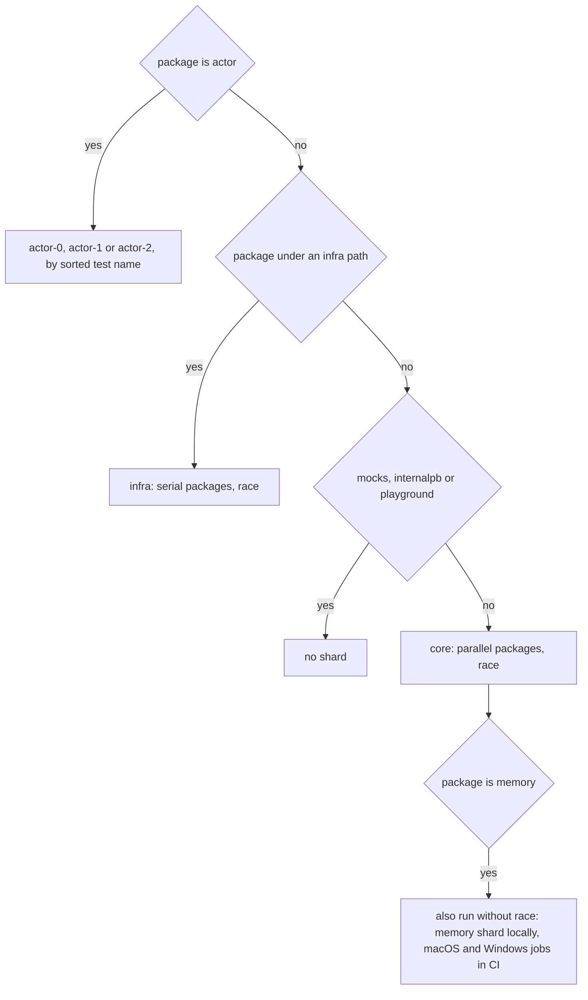

# 27. Testing GoAkt

## Contents

- [What you will learn](#what-you-will-learn)
- [27.1 The suite in numbers](#271-the-suite-in-numbers)
- [27.2 Where tests and fixtures live](#272-where-tests-and-fixtures-live)
  - [Test files and shared files](#test-files-and-shared-files)
  - [Generated mocks](#generated-mocks)
  - [Test protobuf messages](#test-protobuf-messages)
  - [TLS fixtures](#tls-fixtures)
- [27.3 Which shard runs a new test](#273-which-shard-runs-a-new-test)
- [27.4 Libraries and helpers](#274-libraries-and-helpers)
  - [Waiting for something to happen](#waiting-for-something-to-happen)
  - [Ports](#ports)
  - [Goroutine leaks](#goroutine-leaks)
  - [Contexts and cleanup](#contexts-and-cleanup)
- [27.5 How tests build actor systems](#275-how-tests-build-actor-systems)
  - [A single node](#a-single-node)
  - [Cluster mode over mocks](#cluster-mode-over-mocks)
  - [Real clusters](#real-clusters)
  - [Discovery in tests](#discovery-in-tests)
  - [Containers](#containers)
  - [The testkit](#the-testkit)
- [27.6 Coverage](#276-coverage)
- [27.7 The testing rules and the suite](#277-the-testing-rules-and-the-suite)
- [Guarantees](#guarantees)
- [Implementation details (may change)](#implementation-details-may-change)
- [Behaviours to know](#behaviours-to-know)

## What you will learn

- Where tests, shared fixtures, generated mocks, test protos and TLS fixtures live, and how each is regenerated.
- Which shard a new test runs in, with which flags, and what a test author must change to move a package between shards.
- Which libraries and helpers the suite uses, how often, and what each one really does.
- How tests build actor systems: in-process, over mocks, as real three-node clusters, and against Consul or etcd in containers.
- How coverage is measured per shard and judged by Codecov.
- How the testing rules in `CODING_STANDARDS.md` map to the suite as it stands.

Source files: `scripts/unit-test.sh`, `scripts/test-shard.sh`, `.github/workflows/pr.yml`, `.github/workflows/build.yml`, `.mockery.yml`, `codecov.yml`, `Makefile`, `CODING_STANDARDS.md`, `internal/pause/pause.go`, `internal/net/dynaport.go`, `internal/tlstest/tlstest.go`, `actor/helpers_test.go`, `actor/mocks_test.go`, `internal/cluster/helpers_test.go`, `stream/mocks_test.go`, `testkit/multi_nodes.go`.

## 27.1 The suite in numbers

Counted over the committed `_test.go` files outside `vendor/` and `playground/`:

| Measure | Value |
|---|---|
| Test files | 316, in 53 packages |
| Test lines | 170,386 |
| Top-level `Test` functions | 2,969, two of them `TestMain` |
| `Benchmark` functions | 123 |
| `Fuzz` and `Example` functions | none |
| Subtests (`t.Run` calls) | 3,889, in 198 files |

The `actor` package dominates: 101 test files, 98,567 lines and 1,253 top-level tests. Next come `internal/net` (31 files, 386 tests), `stream` (25 files, 324 tests), `internal/cluster` (13 files, 146 tests) and the `discovery` packages (20 files, 47 tests).

Nine hand-written packages have no test file: `extension`, `hash`, `internal/id`, `internal/locker`, `internal/pause`, `internal/quorum`, `internal/size`, `internal/timer` and `tls`. The generated packages (`mocks/...`, `internal/internalpb`, `test/data/testpb`) have none either.

**Nearly every test is an in-package test.** Only `stream` has external tests: 13 of its 25 test files are `package stream_test`. Everywhere else a test file declares the package it tests, so it can read and set unexported state. The actor helpers rely on this: they build `*actorSystem` values field by field ([§27.5](#275-how-tests-build-actor-systems)).

## 27.2 Where tests and fixtures live

### Test files and shared files

A test sits next to the code it tests, `client.go` beside `client_test.go`. Beyond those pairs, a package keeps the mocks, fixtures and helpers its tests share in one of three kinds of file:

| File | Packages | What it holds |
|---|---|---|
| `mocks_test.go` | `actor`, `internal/cluster`, `internal/remoteclient`, `stream` | Hand-written actors, grains and fakes. `actor/mocks_test.go` alone is 4,741 lines with 164 types, from `MockNoopActor` to `MockMessageProbe` |
| `helpers_test.go` | `actor`, `internal/cluster` | System and cluster builders, container starters, assertion helpers. `actor/helpers_test.go` is 3,527 lines |
| `fixtures_test.go` | `datacenter`, `remote` | `MockControlPlane` in `datacenter/fixtures_test.go`, a hand-written control plane; three context propagators in `remote/fixtures_test.go`, one of whose `Inject` always fails |

A shared file has no implementation file to pair with. Thirty test files in total have no matching source file: the shared files above, the `benchmark` package's files, the `benchmark_test.go` files of `crdt`, `eventstream` and `internal/net`, scenario files in `actor` (`actor/grain_engine_datacenter_test.go`, `actor/pid_datacenter_test.go` and the three `actor/reliable_delivery_*_test.go` files), `log/log_test.go`, `stream/graph_internal_test.go`, `stream/junctions_test.go` and `testkit/leader_test.go`.

### Generated mocks

`make mock` runs mockery inside the tools container with `.mockery.yml` (`Makefile`). The configuration lists six interfaces in five packages and sets `all: false`, so nothing else is mocked:

| Interface | Mock package |
|---|---|
| `hash.Hasher` | `mocks/hash` |
| `discovery.Provider` | `mocks/discovery` |
| `internal/cluster.Cluster` | `mocks/cluster` |
| `extension.Dependency`, `extension.Extension` | `mocks/extension` |
| `internal/remoteclient.Client` | `mocks/remoteclient` |

The mocks use mockery's `testify` template: each is a `mock.Mock` with a typed `EXPECT()` builder and a constructor that takes the test. The constructor registers a cleanup that calls `AssertExpectations`, so an expected call that never happened fails the test (`NewCluster` in `mocks/cluster/cluster.go`). Tests use the constructor 586 times and `new(...)` 108 times; they set expectations with `EXPECT()` (1,449 calls in 24 files) far more than with `On` (13 calls in 2 files, `internal/cluster/discovery_test.go` and `internal/codec/codec_test.go`), and mark 121 of them optional with `Maybe()`.

Importing files choose their own alias for a mock package: `mockcluster`, `mockscluster` and `mocks` all name `mocks/cluster`. Four `actor` test files and `internal/cluster/discovery_test.go` import `mocks/discovery` as `testkit`, and `internal/cluster/hasher_test.go` imports `mocks/hash` as `testkit`. In those files `testkit.Provider` is the discovery mock, not the `testkit` package.

Interfaces outside `.mockery.yml` are faked by hand, for example `datacenter.ControlPlane` by `MockControlPlane` in `datacenter/fixtures_test.go`.

### Test protobuf messages

`protos/test/test.proto` declares 37 top-level messages in package `testpb` (`TestSend`, `TestReply`, `Account`, `TestWait`, ...). `make protogen` generates them with `buf.gen.yaml` and moves the result to `test/data/testpb` (`Makefile`); like `internal/internalpb`, the code uses the opaque API ([Chapter 2, "Generated code"](chap-02.md#generated-code)). Sixty-five test files import `test/data/testpb`. Outside the tests, only `playground/` samples import it.

### TLS fixtures

`test/data/certs` holds committed certificates and keys, and `make certs` regenerates them with openssl inside the tools container (`Makefile`):

| Files | What they are |
|---|---|
| `ca.cert`, `ca.key` | The CA that signs the server certificates |
| `auto.pem`, `auto.key` | Server certificate for `localhost`, `127.0.0.1` and `::1` (`test/data/certs/auto.conf`) |
| `auto_no_ip_san.pem`, `auto_no_ip_san.key` | A server certificate without IP subject alternative names |
| `client-auth-ca.pem`, `client-auth-ca.key` | A second CA, which signs the client certificate |
| `client-auth.pem`, `client-auth.key` | The client certificate for mutual TLS |

Tests load them through one helper, except one `internal/cluster` test that reads `auto.pem` directly. `Load` in `internal/tlstest/tlstest.go` takes the directory and returns a `tls.Info` whose server side presents `auto.pem`, requires and verifies a client certificate against `client-auth-ca.pem`, and advertises `h2` and `http/1.1`, and whose client side presents `client-auth.pem` and trusts `ca.cert`; both sides set TLS 1.3 as the minimum version. Tests in `actor`, `client`, `internal/cluster` and `internal/memberlist` call it with a relative path such as `../test/data/certs`. No Go code reads `auto_no_ip_san.pem`. The `internal/net` tests do not use the fixtures: they generate a self-signed certificate in memory (`generateTestCert` in `internal/net/tcp_server_test.go`).

Because the client certificate is signed by a CA the client side does not trust, a single `tls.Config` cannot serve as both listener and dialer. The memberlist transport uses one configuration for both, so its tests and the cluster's TLS case set `InsecureSkipVerify` on the client config, as their comments explain (`newNode` in `internal/memberlist/transport_test.go`; `TestMultipleNodes` in `internal/cluster/cluster_test.go`).

## 27.3 Which shard runs a new test

[Chapter 2, "How the full suite is split"](chap-02.md#how-the-full-suite-is-split), describes the two-phase runner and the six shards. This section covers what the author of a new test needs from it. The shard is decided by the test's package path (`scripts/test-shard.sh`, `.github/workflows/pr.yml`, `.github/workflows/build.yml`):

| Shard | Packages | Flags |
|---|---|---|
| `actor-0`, `actor-1`, `actor-2` | `./actor/...`, one third of the top-level tests each | `-race -p 1 -timeout 30m`, atomic coverage |
| `infra` | `./internal/cluster/...`, `./internal/net/...`, `./internal/remoteclient/...`, `./remote/...`, `./client/...`, `./testkit/...`, `./discovery/...`, `./datacenter/...` | `-race -p 1 -timeout 30m`, atomic coverage |
| `core` | `go list ./...` minus the paths above and minus `goaktpb`, `mocks`, `internal/internalpb`, `bench` and `playground` | `-race -timeout 30m`, atomic coverage, default package parallelism |
| `memory` (local only) | `./memory/...` | `-count=1 -timeout 5m -v`, no race detector, no coverage |

What follows from the table:

- **An `actor` test does not choose its slice.** The runner lists the top-level tests, sorts them, and gives the `n`th name to `actor-(n mod 3)`. A new name shifts every name that sorts after it into another slice, so it changes which tests share a process ([Chapter 2](chap-02.md)).
- **`infra` runs one package at a time; `core` runs packages concurrently.** The workflow's comment says the port-binding and cluster packages "keep the serialized -p 1 they have always run with". Two `core` packages bind ports taken from `Get`: `stream`, which starts clusters (`newClusterPair` in `stream/mocks_test.go`), and `internal/memberlist`, whose transport tests bind memberlist nodes and listeners. They run alongside the other `core` packages.
- **A new package lands in `core`** unless its path matches one of the excluded names. Moving it to `infra` takes edits in three files: the `infra` list and the `core` exclusion pattern in `scripts/test-shard.sh`, and the same two in each of the two workflow files. The script's header asks for the definitions to be kept in step.
- **Every test except the `memory` shard runs under the race detector**, and so does the local compile phase (`go test -race -exec true` in `scripts/unit-test.sh`; CI has no separate compile step). Both runners set `CGO_ENABLED=1`.
- **`memory` runs twice.** The `core` pattern does not exclude it, so its tests run in `core` with the race detector and again without it, in the local `memory` shard and in CI's macOS and Windows `memory-tests` jobs.
- **The timeout is per test binary.** All of an `actor` slice's roughly 418 top-level tests share one 30-minute budget. A CI shard job has 90 minutes, the memory jobs 15.
- **The `bench` and `goaktpb` exclusions match no package.** `benchmark` therefore lands in `core`. Its only `Test` functions are behind the `scale` build tag (`benchmark/scale_test.go`, `benchmark/grain_scale_test.go`), and its benchmarks run only with `-bench`, so it compiles and runs no test.
- **Seven files use `t.Parallel`**: six in `internal/metric` and `actor/grain_props_test.go`. Everywhere else, tests in a package run one after another.

Locally, `make unit-test SHARD=infra` runs one shard after the full compile phase, and `V=1` adds `-v` to the race shards (`scripts/unit-test.sh`). Test files are linted too: `.golangci.yml` sets `tests: true` and exempts `_test.go` files only from revive's context-first rule and its "exported func returns unexported type" rule.

## 27.4 Libraries and helpers

| Library or helper | Use in the suite |
|---|---|
| testify `require` and `assert` | `require` in 253 of the 316 test files, `assert` in 196 |
| testify `mock` | Through the generated mocks ([§27.2](#272-where-tests-and-fixtures-live)); imported directly in 19 `actor` test files and `client/client_test.go`, mostly for `mock.Anything` |
| testify `suite` | Four files in `internal/validation`, for example `booleanTestSuite` in `internal/validation/boolean_test.go` |
| `go.uber.org/goleak` | Two packages: `VerifyNone` in 8 of the 31 `internal/net` test files (91 calls), `VerifyTestMain` in `internal/future` |
| Port allocator | `Get` in `internal/net/dynaport.go`, imported under the alias `dynaport` by 29 test files and by `testkit/multi_nodes.go` |
| `internal/pause` | `pause.For`: 1,958 calls in 86 test files |
| `require.Eventually` | 459 calls in 55 test files; `assert.Eventually` 8 calls in 4 |
| `github.com/nats-io/nats-server/v2` | An embedded NATS server for cluster discovery ([§27.5](#275-how-tests-build-actor-systems)) |
| testcontainers-go, with its consul and etcd modules | Consul and etcd in Docker ([§27.5](#275-how-tests-build-actor-systems)) |

### Waiting for something to happen

**`pause.For` is a sleep.** `For` in `internal/pause/pause.go` calls `time.Sleep` and does nothing else. Replacing `time.Sleep` with it changes the spelling, not the behaviour. No test file calls `time.Sleep` directly.

There are three ways to wait without a fixed delay, and the suite uses all three:

1. **Poll a condition.** `require.Eventually(t, cond, waitFor, tick)` fails the test if `cond` is not true within `waitFor`. Cluster tests poll membership this way, for example until `Peers` reports two peers.
2. **Receive on a channel the code under test sends to.** `MockMessageProbe` in `actor/mocks_test.go` hands every message except `PostStart` to a 64-slot channel, "so a test can wait for a message instead of polling for its effect". The `internal/net` tests `select` on a reply channel against a context deadline.
3. **Wait on a readiness signal.** `startConsulAgent` and `startEtcdCluster` in `actor/helpers_test.go` return a channel that closes once the service answers.

The comment in `newClusterPair` in `stream/mocks_test.go` gives the reason to prefer them: a fixed pause is unreliable when the test binary is loaded, because peer-list propagation "can lag well past one second", while polling `Peers` "gives a deterministic readiness signal".

### Ports

`Get(n)` in `internal/net/dynaport.go` returns `n` ports that are free on both TCP and UDP. In order:

1. Bind TCP on `127.0.0.1:0`, read the port, then bind UDP on the same port; retry up to 32 times if either bind fails (`reserveBoth`).
2. Refuse a port already handed out by this process: a process-wide set records every port returned, and a duplicate is rejected and retried, again up to 32 times (`reserveUnique`).
3. Hold every socket until all `n` ports are collected, so one call cannot return the same port twice, then close them all and return.

A port `reserveUnique` rejects as a duplicate stays bound until it returns, so the kernel cannot hand the same port back on the next attempt. `Get` panics on failure; `GetWithErr` returns the error. The de-duplication set covers one test binary; it does not see the ports another process is using.

A second pattern lets the kernel choose: the `internal/net` and `internal/remoteclient` tests give servers and listeners the address `127.0.0.1:0` (205 times), and `newNode` in `internal/memberlist/transport_test.go` sets `BindPort` to 0. The 46 calls of `remote.NewConfig("127.0.0.1", 0)` in tests are different: they build configurations for serializer, client and configuration tests that never bind the port.

### Goroutine leaks

`goleak.VerifyNone(t)` fails the test if goroutines other than the test's own are still running when it is called; goleak retries for a short while before it reports. The `internal/net` tests call it with `defer` as their first statement (`TestDuplexPingAnsweredWithPong` in `internal/net/duplex_test.go`), and `internal/future` checks the whole package once from `TestMain` in `internal/future/future_test.go`. No call passes ignore options.

A deferred call runs when the test function returns, which is before the functions registered with `t.Cleanup`. A goroutine that only a cleanup function stops is therefore still running when `VerifyNone` looks. The `internal/net` tests close their connections explicitly before returning.

### Contexts and cleanup

`t.Context()` (358 uses in 21 files) is cancelled just before the cleanup functions run, so a cleanup that stops a system with it would pass a cancelled context. `startTestActorSystem` in `actor/helpers_test.go` starts its system with `t.Context()` but stops it in the cleanup with a fresh `context.WithTimeout(context.Background(), time.Second)`. `context.Background()` (1,905 uses) and `context.TODO()` (961 uses) remain the most common contexts in tests.

`require` stops the test with `t.FailNow`, which must run on the test goroutine. `startNATsSystems` in `actor/helpers_test.go` starts nodes concurrently and, as its comment says, sends failures "through an error slice asserted on the test goroutine instead of a require call inside a goroutine".

## 27.5 How tests build actor systems

### A single node

Most tests create systems directly: `NewActorSystem` is called over 1,000 times in 56 test files, usually with `WithLogger(log.DiscardLogger)` (1,248 uses of `log.DiscardLogger`). The pattern is: build, `Start`, test, `Stop`, with the stop either inline or in `t.Cleanup`. `startTestActorSystem` in `actor/helpers_test.go` packages it; `newTestSystem` in `stream/mocks_test.go` does the same and names each system after the current nanosecond, so that, as its comment says, several tests in one process "do not race on the system-name registry during Start/Stop". `newRequestTestSystem` in `actor/helpers_test.go` uses a debug-level logger writing to `io.Discard`, so that logging code paths run.

### Cluster mode over mocks

To test a cluster code path without a cluster, `actor` helpers build an `actorSystem` struct literal and wire the mocks into it. `newReplicationSystem` in `actor/helpers_test.go` fills the maps, the dispatcher and the counters, sets `cluster` to a `mocks/cluster` mock, and flips `started` and `clusterEnabled`; `newClusterReadySystem` builds a smaller literal from a given remoting client, cluster and node. These systems never call `NewActorSystem` or `Start`: no listener is opened, so the fixed port 8080 that `newReplicationSystem` names is never bound. The cost is that they bypass the constructor. A field that `NewActorSystem` initialises and a code path dereferences must also be set in these helpers.

`withBoltPathGenerator` in `internal/cluster/helpers_test.go` shows the other seam the suite uses: production code reads a package variable (`boltPathGenerator` in `internal/cluster/boltdb_store.go`, commented "allows tests to override BoltDB path generation"), and the test swaps it and restores it in `t.Cleanup`.

### Real clusters

`newClusterSystem` in `actor/helpers_test.go` builds a real cluster node. In order:

1. Take three ports from `Get`: discovery, remoting and peers.
2. Build the discovery provider from a `providerFactory`: `createNATsProvider`, `createConsulProvider`, `createEtcdProvider` or `createSelfManagedProvider`.
3. Build the cluster configuration from `testClusterConfig` and its options (`withTestTLS`, `withTestReplication`, `withTestCRDT`, `withTestRoles` and others): mock actor and grain kinds, 7 partitions, replica count and quorums of 1 unless overridden, a minimum peers quorum of 1, a one-second bootstrap timeout, a 300 ms state sync interval and a 100 ms balancer interval.
4. Create the system on `127.0.0.1` with the discard logger and a three-minute shutdown timeout.

`startClusterSystem` builds and starts one node; `startNATsSystems` builds `count` nodes and starts them concurrently, so that, per `newClusterSystem`'s comment, members with a replica count above one can sync from each other. Every node uses the system name `accountsSystem` and, with NATS, the subject `some-subject`; the tests start their own NATS server or container.

Ten of the twelve `startNATsSystems` calls start three nodes. `newReliableClusterFixture` gives the reason for reliable delivery, then pauses one second to let membership settle: "Three nodes place the endpoint pair on two members with one uninvolved member, so registry records regularly live on partitions owned by nodes that host neither endpoint." Other packages have their own builders: `startEngine` in `internal/cluster/helpers_test.go` starts the cluster engine alone over NATS, and `newClusterPair` in `stream/mocks_test.go` starts two systems and polls `Peers` for up to 15 seconds.

### Discovery in tests

| Provider | How tests run it | Where |
|---|---|---|
| NATS | An embedded server on a random loopback port. Each package defines its own `startNatsServer`, six copies in all counting the NATS control plane tests in `datacenter/controlplane/nats`; `MultiNodes.Start` has a seventh inline | `actor`, `client`, `internal/cluster`, `stream`, `discovery/nats` |
| Self-managed | UDP broadcast on `127.0.0.1`, every 100 ms (`createSelfManagedProvider` in `actor/helpers_test.go`) | `discovery/selfmanaged`; a three-node case in `TestActorSystem` in `actor/actor_system_test.go` and `TestRelocationWithSelfManagedProvider` in `actor/relocator_test.go` |
| Consul | A `hashicorp/consul:1.15` container | `discovery/consul`; `TestRelocationWithConsulProvider` in `actor/relocator_test.go` |
| etcd | A three-node `gcr.io/etcd-development/etcd:v3.5.14` container, also used by the etcd control plane tests in `datacenter/controlplane/etcd` | `discovery/etcd`; `TestRelocationWithEtcdProvider` in `actor/relocator_test.go` |
| Kubernetes | The client-go fake clientset | `discovery/kubernetes` |
| Static | Its own package tests, and the `benchmark` package | `discovery/static` |
| DNS | Real DNS lookups of `google.com`, with the default lookup and with IPv6 only (`TestDiscovery` in `discovery/dnssd/discovery_test.go`) | `discovery/dnssd` |
| mDNS | A real mDNS server and query on the host | `discovery/mdns` |

`startNatsServer` creates the server with port `-1`, starts it on a goroutine, and fails the test unless it accepts connections within two seconds (`actor/helpers_test.go`).

### Containers

Four test files start containers: `discovery/consul/discovery_test.go`, `discovery/etcd/discovery_test.go`, `datacenter/controlplane/etcd/control_plane_test.go` and `actor/helpers_test.go`. The `discovery` and `actor` helpers start one container per test and terminate it in `t.Cleanup`. The `actor` versions also return a readiness channel: Consul is ready when `/v1/status/leader` answers 200, etcd when a `Put` succeeds, both polled every 100 ms. `TestMain` in `datacenter/controlplane/etcd/control_plane_test.go` starts one etcd container for the whole package and terminates it after `m.Run`.

The local runner gives every shard container the host's Docker socket, "because some tests start consul and etcd containers", maps `host.docker.internal` to the host gateway and sets `TESTCONTAINERS_HOST_OVERRIDE=host.docker.internal` (`scripts/unit-test.sh`). In CI the shards run directly on the `ubuntu-latest` runner, not in a container.

### The testkit

The `testkit` package is the public test harness for GoAkt users; [Chapter 26, §26.11](chap-26.md#2611-testkit) to [§26.14](chap-26.md#2614-multi-node-clusters), covers its internals. `New` in `testkit/testkit.go` starts a local system named `testkit`; `NewMultiNodes` in `testkit/multi_nodes.go` runs a cluster in-process: `MultiNodes.Start` starts an embedded NATS server, and `MultiNodes.StartNode` builds a node with the same kind of configuration as `newClusterSystem` (three ports from `Get`, 7 partitions, replica count 1, 300 ms sync), starts it and pauses two seconds.

**No other package's tests use the testkit.** No file in the repository imports it; its own tests are `package testkit`. The `actor` tests cannot: they are `package actor`, and `testkit` imports `actor`, so the import would be a cycle. The `actor` tests use their own helpers and mock actors instead.

## 27.6 Coverage

Every race shard writes `coverage-<shard>.out` with `-covermode=atomic` (`scripts/test-shard.sh`). CI uploads each shard's profile to Codecov with `fail_ci_if_error: false`, so a failed upload does not fail the job (`.github/workflows/pr.yml`). The memory jobs produce no profile. A local `make unit-test` leaves the profiles in the repository root.

No shard passes `-coverpkg`, so a package's coverage comes only from its own tests. The `actor` tests that drive `internal/cluster` code through a real cluster add nothing to `internal/cluster`'s figure.

`codecov.yml` sets two status targets, both 85%: `patch`, the changed lines, and `project`, against an automatic base. It ignores `test`, `internal/internalpb`, `testkit`, `mocks` and `goaktpb`; the last names no directory in the repository.

## 27.7 The testing rules and the suite

`CODING_STANDARDS.md` sets the testing rules. They apply to code that is added or changed, not to existing code. The suite as it stands:

| Rule | State of the suite |
|---|---|
| Focused tests covering positive and negative cases for every changed path | Not measurable from the code; the coverage targets of [§27.6](#276-coverage) are the enforced proxy |
| Standard `testing` plus testify `require` and `assert`; cases as `t.Run` subtests | `require` in 253 and `assert` in 196 of the 316 test files, `t.Run` in 198; the four `suite` files in `internal/validation` are the only other framework |
| Every test file pairs with its implementation file; the package's `mocks_test.go` is the one exception | Thirty unpaired files ([§27.2](#272-where-tests-and-fixtures-live)), four of them `mocks_test.go` |
| Shared mocks, fixtures and helpers in the package's `mocks_test.go` | Four packages have one. `actor` and `internal/cluster` also keep `helpers_test.go`; `datacenter` and `remote` keep `fixtures_test.go` |
| `require.Eventually` for asynchronous conditions; `pause.For`, not `time.Sleep`, for a fixed delay | 459 `require.Eventually` calls against 1,958 `pause.For` calls; no test file calls `time.Sleep` directly |
| Ports from `Get` in `internal/net/dynaport.go` (imported as `dynaport`), not hard-coded numbers | 29 test files and `testkit/multi_nodes.go` use `Get`; the `internal/net`, `internal/remoteclient` and `internal/memberlist` tests also bind port 0 ([§27.4](#274-libraries-and-helpers)) |
| No coverage regression; 85% on patch and project; `test`, `testkit`, `mocks` and `internal/internalpb` ignored | As configured in `codecov.yml`, which also ignores `goaktpb` |

Two practices the helpers encode are not rules in `CODING_STANDARDS.md` but recur through the cluster tests: three-node clusters ([§27.5](#275-how-tests-build-actor-systems)), and readiness signals instead of fixed pauses ([§27.4](#274-libraries-and-helpers)). The contributor page `docs/contributing/testing-strategy.mdx` asks for testkit probes in message assertions and for containers instead of services assumed on the host. Outside `testkit`, the repository's tests use their own helpers rather than probes ([§27.5](#275-how-tests-build-actor-systems)), and the DNS and mDNS tests use the host's network.

## Guarantees

| Statement | Enforced by |
|---|---|
| `Get` returns ports that can be bound on both TCP and UDP on `127.0.0.1` | `TestGetReturnsBindablePorts` in `internal/net/dynaport_test.go` |
| One `Get` call never returns the same port twice, and concurrent calls in one process never share a port | `TestGetReturnsDistinctPorts` and `TestConcurrentGetProducesDistinctPorts` in `internal/net/dynaport_test.go` |
| `Get(0)` and `GetWithErr(-1)` return no port and no error | `TestGetZeroAndNegative` in `internal/net/dynaport_test.go` |
| `reserveBoth` holds TCP and UDP sockets on the same port | `TestReserveBoth` in `internal/net/dynaport_test.go` |
| `Load` builds a server config with a TLS 1.3 minimum that requires and verifies client certificates and a client config that verifies the server, and the two complete a mutual handshake | `TestLoad` and `TestLoadHandshake` in `internal/tlstest/tlstest_test.go` |
| `Load` fails on a directory without fixtures, on a CA file that holds no certificate (naming the file) and on an invalid key | `TestLoadMissingDirectory`, `TestLoadInvalidCA` and `TestLoadInvalidKeyPair` in `internal/tlstest/tlstest_test.go` |
| A three-node `MultiNodes` cluster elects exactly one leader that every node agrees on, and elects a new one when the leader stops | `TestLeaderElection` in `testkit/leader_test.go` |
| `MultiNodes` tracks started and stopped nodes in `NodeCount` and returns a started node from `GetNode` | `TestMultiNodes` in `testkit/testnode_test.go` |

## Implementation details (may change)

- The counts in [§27.1](#271-the-suite-in-numbers), [§27.4](#274-libraries-and-helpers) and [§27.7](#277-the-testing-rules-and-the-suite), measured at this commit.
- The 30-minute per-binary timeout, the 5-minute `memory` timeout, and the 90-minute and 15-minute CI job limits.
- The cluster test settings in `newClusterSystem`: 7 partitions, a one-second bootstrap timeout, a 300 ms sync interval, a 100 ms balancer interval and a three-minute shutdown timeout.
- The two-second pause after every `MultiNodes.StartNode` and the two-second NATS readiness wait.
- 32 attempts in each of `reserveBoth` and `reserveUnique`.
- The 64-slot channel of `MockMessageProbe`.
- The one-second settling pause in `newReliableClusterFixture`.
- The container images: `hashicorp/consul:1.15` and `gcr.io/etcd-development/etcd:v3.5.14` with three nodes.
- `make certs`: 4096-bit RSA keys for `ca.key` and the two server certificates, 2048 bits for the client key, openssl's default size for the client CA key, ten-year validity.

## Behaviours to know

| Behaviour | Source |
|---|---|
| Adding a top-level `actor` test moves every test that sorts after it into another slice | `scripts/test-shard.sh` |
| `stream` and `internal/memberlist` start clusters or bind ports but run in `core`, in parallel with other packages | `newClusterPair` in `stream/mocks_test.go` |
| The `memory` package runs in `core` with the race detector as well as in its own shard without it | `scripts/test-shard.sh` |
| `pause.For` is `time.Sleep`; using it does not make a test less timing-dependent | `For` in `internal/pause/pause.go` |
| Port de-duplication is per process only | `reserveUnique` in `internal/net/dynaport.go` |
| A mock built with `new(...)` has no test attached: an unexpected call panics instead of failing the test, and its expectations are not asserted at cleanup | `NewCluster` in `mocks/cluster/cluster.go` |
| In five test files, `testkit` is an alias for the discovery mocks | `startGrainSchedulerClusterNode` in `actor/helpers_test.go` |
| A deferred `goleak.VerifyNone` runs before `t.Cleanup` functions | `TestDuplexPingAnsweredWithPong` in `internal/net/duplex_test.go` |
| `t.Context()` is already cancelled when cleanup functions run; stop systems in a cleanup with a fresh context | `startTestActorSystem` in `actor/helpers_test.go` |
| Mock-backed systems bypass `NewActorSystem`, so a new field a code path needs must also be set in the helper | `newReplicationSystem` and `newClusterReadySystem` in `actor/helpers_test.go` |
| The fixture client certificate is signed by a CA the client side does not trust, so a config used for both listening and dialling needs `InsecureSkipVerify` | `newNode` in `internal/memberlist/transport_test.go` |
| The DNS discovery tests need network access and resolve `google.com` | `TestDiscovery` in `discovery/dnssd/discovery_test.go` |
| `newClusterPair` returns after 15 seconds even if the two nodes have not seen each other | `newClusterPair` in `stream/mocks_test.go` |
