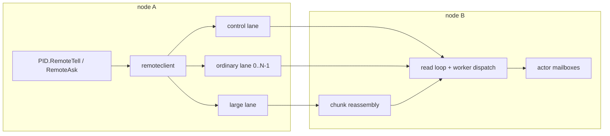
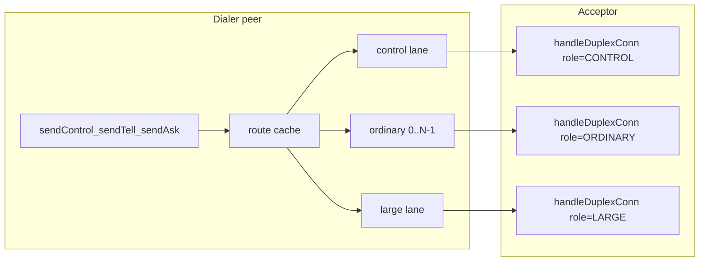
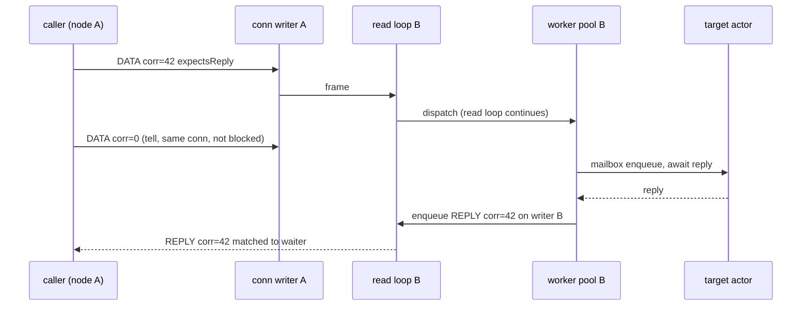
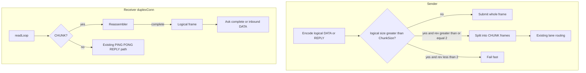
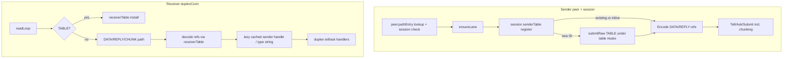
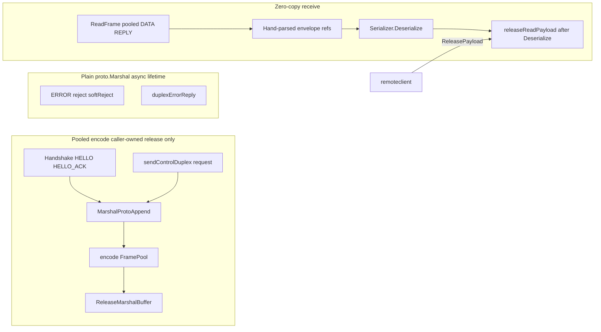
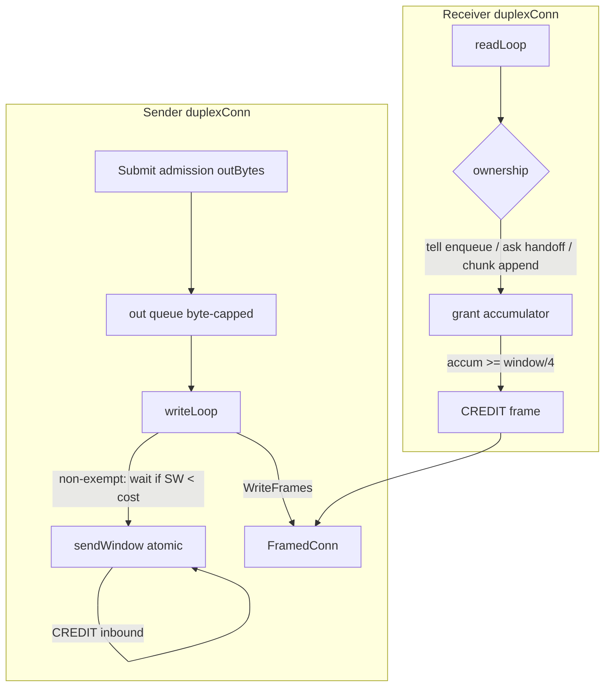
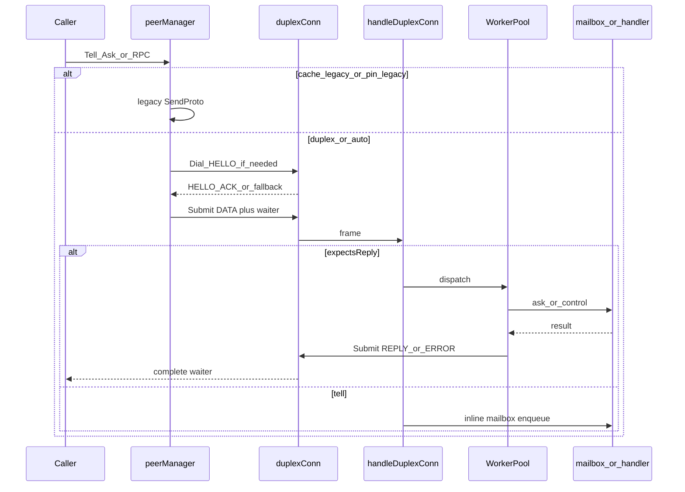

# Remoting Transport Protocol Design

> The maintainer reference for GoAkt's multiplexed remoting engine.

## Contents

- [1. Overview](#1-overview)
  - [Goals and non-goals](#goals-and-non-goals)
  - [Protocol status](#protocol-status)
- [2. Why the engine changed](#2-why-the-engine-changed)
- [3. Architecture](#3-architecture)
  - [Protocol and transport boundary](#protocol-and-transport-boundary)
  - [Peer lanes and ordering](#peer-lanes-and-ordering)
  - [Connection lifecycle and liveness](#connection-lifecycle-and-liveness)
- [4. Wire protocol](#4-wire-protocol)
  - [Frame header and frame types](#frame-header-and-frame-types)
  - [Handshake and capability negotiation](#handshake-and-capability-negotiation)
  - [Envelope formats](#envelope-formats)
- [5. Message processing](#5-message-processing)
  - [Correlation and dispatch](#correlation-and-dispatch)
  - [Large messages](#large-messages)
  - [Compression tables and receive caches](#compression-tables-and-receive-caches)
  - [Serialization and buffer ownership](#serialization-and-buffer-ownership)
  - [Credit-based flow control](#credit-based-flow-control)
- [6. Compatibility and semantics](#6-compatibility-and-semantics)
  - [Rolling upgrades](#rolling-upgrades)
  - [Failure, delivery, and backpressure](#failure-delivery-and-backpressure)
  - [Configuration defaults](#configuration-defaults)
- [7. Design evolution](#7-design-evolution)
  - [Baseline and duplex protocol](#baseline-and-duplex-protocol)
  - [Lanes, chunking, and tables](#lanes-chunking-and-tables)
  - [Allocation and credit control](#allocation-and-credit-control)
- [8. Operations, verification, and future work](#8-operations-verification-and-future-work)
  - [Verification invariants](#verification-invariants)
  - [Code ownership map](#code-ownership-map)
  - [Deferred work](#deferred-work)

---

## 1. Overview

GoAkt remoting is a persistent, duplex, correlation-driven protocol over TCP. It replaces the legacy unary protobuf-over-socket exchange with a framed protocol that multiplexes concurrent work, isolates system traffic from user traffic, carries messages larger than a frame, compresses recurring wire references, and applies receiver-driven backpressure.

The protocol layer owns framing, handshake negotiation, lanes, correlation, chunking, reference tables, and flow control. The transport layer only moves complete frames and manages connection lifecycle. TCP is the default transport; the boundary permits a future QUIC implementation without changing the protocol.

### Goals and non-goals

#### Goals

1. Eliminate head-of-line blocking in socket use, server dispatch, and outbound batching.
2. Carry messages above the legacy 16 MiB frame ceiling without starving small-message traffic.
3. Reduce default protobuf-path copies and avoid per-message envelope allocations where possible.
4. Replace heuristic wire detection with a versioned, negotiated protocol.
5. Replace silent overload drops with bounded, credit-based backpressure.

#### Non-goals

- Transport delivery remains **at-most-once**. Reliable delivery is a controller protocol above remoting; see [Reliable Delivery](RELIABLE_DELIVERY.md).
- Public actor APIs (`Tell`, `Ask`, `RemoteTell`, `RemoteAsk`, and batch variants) and the public `remote.Serializer` contract do not change.
- Cluster membership and distributed-registry transports are not remoting traffic.
- User payload formats remain unchanged. The envelope optimization is not a new public serialization format.

### Protocol status

Capability revisions are cumulative:

| Revision | Capability                                                |
|----------|-----------------------------------------------------------|
| 1        | Duplex baseline: `DATA`, `REPLY`, `ERROR`, `PING`, `PONG` |
| 2        | Chunked large messages                                    |
| 3        | Reference compression tables and receive-path caches      |
| 4        | Receiver-granted byte credits                             |

The TCP implementation supports revision 4. Generated protobuf types use the Go Protobuf Opaque API. The legacy unary path remains for mixed-version clusters and is removed only in a future major release. A QUIC transport is deferred.

---

## 2. Why the engine changed

The legacy engine was a length-prefixed, unary protobuf-over-TCP protocol. A caller checked out a pooled socket, performed a write-then-read round trip, then returned it. This created several coupled bottlenecks:

| Legacy limitation                                           | Design response                                                                           |
|-------------------------------------------------------------|-------------------------------------------------------------------------------------------|
| A socket was held for a complete request/response exchange. | Long-lived duplex connections with correlation IDs.                                       |
| Server handlers ran inline on the read loop.                | A read loop that only parses and hands off work; reply-bearing work uses the worker pool. |
| One coalescer writer serialized a destination's traffic.    | Per-connection writer batching and independent lanes.                                     |
| Frames above 16 MiB closed the connection.                  | Chunking with bounded reassembly and in-band errors.                                      |
| Addresses and type names repeated on every message.         | Per-connection `TABLE` frames and varint references.                                      |
| Compression configuration had to match manually.            | HELLO negotiation before compression wrapping.                                            |
| Queue overflow silently dropped batches.                    | Byte-bounded admission plus receiver-granted credits.                                     |
| Write and read-idle configuration was ineffective.          | Deadline enforcement and per-lane PING/PONG liveness.                                     |

---

## 3. Architecture

### Protocol and transport boundary



`Transport` dials and accepts a lane connection, while `FramedConn` reads and writes complete protocol frames. TCP supplies the current implementation. A future QUIC implementation can map lanes to streams without changing frame, envelope, correlation, or flow-control rules.

```go
type Transport interface {
    Dial(ctx context.Context, peer string, lane LaneSpec) (FramedConn, error)
    Listen(addr string) (Acceptor, error)
}

type FramedConn interface {
    WriteFrames(frames ...Frame) error
    ReadFrame() (Frame, error)
    Close() error
}
```

### Peer lanes and ordering

Every peer pair has lazily established, persistent duplex lane connections:

| Lane     |                      Count | Traffic                                                 | Purpose                                              |
|----------|---------------------------:|---------------------------------------------------------|------------------------------------------------------|
| Control  |                          1 | Watch/unwatch, spawn/stop, cluster and system RPCs      | Keeps system actions independent of user traffic.    |
| Ordinary | `OrdinaryLanes`, default 1 | User tells and asks                                     | Hashes by receiver path for sticky per-pair FIFO.    |
| Large    |                          1 | Configured bulk destinations and large control payloads | Keeps bulk transfers from delaying ordinary traffic. |

User traffic routes by `hash(receiver path) % OrdinaryLanes`, unless the receiver matches `LargeMessageDestinations`, in which case it uses the large lane. Patterns match hierarchical actor paths, not node addresses.

The documented ordering guarantee is **per sender–receiver pair FIFO**. With the default one ordinary lane, ordinary traffic to a peer remains effectively FIFO; control traffic intentionally may overtake user messages, and configured large destinations have their own ordering domain. Raising `OrdinaryLanes` trades a narrower ordering domain for parallelism.



### Connection lifecycle and liveness

Each lane owns one reader and one writer goroutine, a byte-bounded outbound queue, a pending-request table, and its own negotiated limits. Lanes are dialed on first use, retained while healthy, and closed on peer-down events or actor-system shutdown. A failed connection fails its pending waiters immediately; it does not retransmit messages.

`writeTimeout` bounds writes and admission waits. `readIdleTimeout` drives PING/PONG liveness on every lane: after idle intervals without inbound traffic, a connection sends PING probes and closes after two missed responses. Liveness is timer-based rather than a socket read deadline, because expiring a deadline during frame assembly would desynchronize the stream.

---

## 4. Wire protocol

### Frame header and frame types

Every frame begins with a fixed, big-endian 16-byte header:

```text
byte 0        1        2        3        4..7          8..15
+--------+--------+--------+--------+--------------+------------------+
| ver    | type   | flags  | lane   | length (BE)  | correlation (BE) |
+--------+--------+--------+--------+--------------+------------------+
```

| Field         | Meaning                                                                                                   |
|---------------|-----------------------------------------------------------------------------------------------------------|
| `ver`         | Protocol discriminator, currently `0x02`.                                                                 |
| `type`        | `HELLO`, `HELLO_ACK`, `DATA`, `REPLY`, `ERROR`, `CHUNK`, `CREDIT`, `TABLE`, `PING`, or `PONG`.            |
| `flags`       | `hasMetadata`, `expectsReply`, `firstChunk`, and `lastChunk`; reserved bits must be zero.                 |
| `lane`        | Control `0`, ordinary `1..N`, or large `0xFF`; validated against the negotiated lane.                     |
| `length`      | Body length, bounded by the negotiated frame limit.                                                       |
| `correlation` | Nonzero for asks, replies, request errors, and chunk groups; zero for tells and connection-scoped errors. |

Unknown frame types, reserved flag bits, invalid lane identity, or use of a capability above the negotiated revision are protocol violations. The receiver sends connection-scoped `ERROR` then closes.

### Handshake and capability negotiation

The dialer sends `HELLO`; the acceptor returns `HELLO_ACK`. Both include node identity, lane role/index, compression proposal, frame/message limits, credit window, concurrent-transfer cap, and capability revision.

Effective limits use pairwise minima. The acceptor selects the compression codec, or `NONE` when it does not support the dialer's proposal. Compression attaches only after the handshake, keeping negotiation readable. A version mismatch returns `ERROR` and closes cleanly.

Capability use is gated by `min(local revision, peer revision)`. Frames requiring a higher revision are rejected, except that inbound `CREDIT` on a revision below 4 is safely ignored to tolerate buggy peers.

### Envelope formats

`DATA` is hand-parsed rather than encoded as the legacy `RemoteMessage` protobuf:

```text
senderRef | receiverRef | typeRef | serializerID (1 byte) | [metaLen (4B) metadata] | payload
```

Each reference is either a nonzero table ID or inline form: `0`, followed by a uvarint length and literal bytes. Metadata is present only with `hasMetadata` and preserves remaining-deadline rebasing.

| Serializer ID | Payload behavior                                                            |
|--------------:|-----------------------------------------------------------------------------|
|             0 | Internal protobuf codec: raw protobuf bytes; `typeRef` identifies the type. |
|             1 | Public protobuf frame.                                                      |
|             2 | JSON.                                                                       |
|             3 | CBOR.                                                                       |
|           255 | Custom serializer bytes, kept self-describing; `typeRef` is zero.           |

`REPLY` is `typeRef | serializerID | [metaLen metadata] | payload`. `ERROR` contains `internalpb.Error` bytes. `CREDIT` contains a uvarint byte grant. `TABLE` is `kind | id | literal length | literal`. `PING` and `PONG` have no body.

---

## 5. Message processing

### Correlation and dispatch

Asks allocate a per-connection atomic correlation ID and register a pooled waiter in a pending table. The client reader matches `REPLY` and request-scoped `ERROR` frames to that waiter. A local ask timeout removes its waiter; a late response is dropped without disturbing the lane.

The read loop only reads, validates, reassembles, handles connection signaling, and hands off frames:

- `DATA` without `expectsReply` takes the mailbox-enqueue fast path.
- `DATA` with `expectsReply` uses the existing worker pool. Its completion enqueues `REPLY` or `ERROR` on the same connection's writer.
- Replies always return on the request connection; the server never dials back.



The writer batches frames with vectored writes. This byte-level batching is distinct from the destination tell coalescer: a transport failure affects unwritten frames rather than an entire request batch. The coalescer remains active for duplex peers; only its legacy unary flush path is retired with legacy compatibility.

### Large messages

Logical frames larger than `ChunkSize` are encoded once and split into `CHUNK` frames. The first chunk carries the logical frame and total size; each chunk carries a monotonically increasing index. A chunked tell gets a correlation ID solely for its group, while a chunked ask or reply reuses its request correlation.

The receiver reassembles groups per connection. It rejects size and concurrency violations before allocation with request-scoped `ERROR`; index gaps, duplicates, or non-monotonic chunks are protocol violations. Reassembly has independent `MaxMessageSize` and `MaxConcurrentLargeTransfers` bounds. Incomplete groups are discarded on connection loss.



Matched large destinations use the large lane. An unmatched oversize user message chunks **in place** on its ordinary lane, preserving that actor's FIFO order. Therefore `LargeMessageDestinations` is a performance and isolation knob, not a correctness gate. Large replies remain on the request lane. Bulk control requests (`RelocateBatch`, `PersistPeerState`, and peer-state operations) use the large lane when oversized.

### Compression tables and receive caches

At revision 3, each connection has independent sender and receiver tables for actor paths and type names. On first use, the sender assigns a monotonic ID and queues a `TABLE` frame before the referencing message. The single writer guarantees table-before-use without acknowledgement rounds. IDs reset at reconnect.

Tables are capped at 8192 entries per kind per connection. Sender overflow falls back to inline literals; receiver overflow, unknown IDs, invalid kinds, or conflicting registrations are protocol violations.



The peer route cache binds a cached receiver-path table ID to the owning session. A reconnect invalidates that association and lazily registers a new ID. On the receive path, table hits cache the type name and an opaque sender handle. The actor layer resolves that handle to a sender `*PID` lazily, avoiding per-message sender-PID construction while preserving `internal/net`'s independence from `actor`.

### Serialization and buffer ownership

On the default protobuf path, a pooled frame body is hand-parsed and the payload is passed as a subslice to deserialization. The body returns to the pool only after deserialization or control decoding finishes. Client response owners call `ReleasePayload`; late correlation misses and other drop paths also release their payloads.

Custom serializers may retain their input. For serializer ID 255, the payload is copied before `Deserialize`, retaining the public serializer contract.

Generated protobuf types use the Go Protobuf Opaque API. The protobuf generator configuration sets `default_api_level=API_OPAQUE`; generated fields are private implementation details, and remoting code must use generated builders and accessors rather than relying on struct-field access. This changes generated-code access patterns only; it does not change the remoting wire format or the public serializer contract.

Control and handshake request encoding uses `proto.MarshalOptions{UseCachedSize: true}.MarshalAppend` with a pooled caller-owned buffer only where release timing is deterministic. Error and reject frames remain plain `proto.Marshal`, because their payload is asynchronously queued and has no writer-completion release hook.



### Credit-based flow control

Revision 4 uses two distinct byte counters:

1. The **admission queue** bounds local memory before socket writes.
2. The **send window** bounds `DATA` and `CHUNK` bytes the peer has not yet accepted.

The writer decrements the send window immediately before write, not at admission. It parks windowed frames when insufficient credit exists, while exempt control frames bypass parked frames. This prevents credit, error, and liveness deadlocks. One frame larger than the negotiated window may proceed when the window is full, temporarily making the signed counter negative; it guarantees progress under asymmetric configuration.



Only `DATA` and `CHUNK` consume the window. `REPLY`, `ERROR`, `TABLE`, `CREDIT`, `PING`, and `PONG` are exempt. The receiver grants charged bytes when it first owns them: mailbox enqueue for tells, worker-pool handoff for asks, and reassembly-buffer append for chunks. Grants are accumulated and sent around each quarter window. This timing allows a message larger than the window to complete without waiting for application processing.

---

## 6. Compatibility and semantics

### Rolling upgrades

One listener accepts both protocols. After TLS but before compression wrapping, it peeks the first byte: `0x02` starts the duplex protocol; other bytes replay unchanged into the legacy path. The match is exact because legacy gzip and zstd have distinct first bytes. Legacy Brotli cannot be safely sniffed and requires a protocol pin.

In `auto` mode, a new dialer attempts HELLO first. EOF or reset before `HELLO_ACK` identifies a legacy peer, triggers a one-time legacy retry, and caches the result until reconnect. A protocol transition drains in-flight legacy sends before opening duplex traffic to preserve ordering. `legacy` and `duplex` pins let operators require a specific behavior.

### Failure, delivery, and backpressure

- Successful tell admission returns `nil`; it does not mean remote delivery.
- A full outbound admission queue waits for the caller deadline, or `writeTimeout` when no deadline exists, then returns `errors.ErrRemoteSendBackpressure`.
- Transport failure after tell admission produces the existing dead-letter/event signal.
- Slow receivers slow senders through credits rather than causing silent drops.
- Ask timeout is local to its pending waiter; it does not stall the connection.
- No transport-level retransmission occurs. Connection loss fails pending work, preserves at-most-once semantics, and discards partial reassembly.

### Configuration defaults

| Setting                       |          Default | Role                                                           |
|-------------------------------|-----------------:|----------------------------------------------------------------|
| `OrdinaryLanes`               |                1 | Number of sticky user-traffic lanes.                           |
| `ChunkSize`                   |          256 KiB | Logical-frame threshold and chunk body limit.                  |
| `MaxFrameSize`                |           16 MiB | Negotiated per-frame bound, retained for legacy compatibility. |
| `MaxMessageSize`              | 16 MiB, raisable | Reassembly cap for one logical message.                        |
| `MaxConcurrentLargeTransfers` |                4 | Concurrent reassembly-group cap per connection.                |
| Table capacity                |             8192 | Per kind, per connection; not a public knob.                   |
| `CreditWindow`                |           16 MiB | HELLO initial credits and outbound admission sizing.           |

`MaxFrameSize` remains larger than a chunk during the transition because a revision-1 peer cannot chunk. A future major release can tighten frame bounds after legacy removal.

---

## 7. Design evolution

The engine was delivered as cumulative capabilities, but this document records the resulting design rather than implementation work items.

### Baseline and duplex protocol



The baseline established the fixed frame header, negotiated duplex session, correlation table, dispatch split, and dual-protocol fallback. Those invariants support every subsequent capability.

### Lanes, chunking, and tables

Lanes isolate system traffic, chunking separates logical-message size from frame size, and tables remove repeated identities from steady-state envelopes. Together they preserve per-pair ordering while allowing small messages, asks, and bulk transfers to proceed independently where their guarantees permit.

### Allocation and credit control

Zero-copy receive preserves buffer ownership until decode completes, while caller-owned control encoding pools only buffers with deterministic release. Credit control then bounds the in-flight work that reaches the receiver. The two mechanisms are intentionally separate: ownership controls buffer lifetime; credits control network admission and peer memory pressure.

---

## 8. Operations, verification, and future work

### Verification invariants

Maintainers changing remoting should preserve these invariants:

- A frame is valid only on its negotiated lane and capability revision.
- `TABLE` registration precedes every reference to its ID on that connection.
- A chunk group never allocates before its declared size and concurrent-group caps pass.
- Every accepted `DATA` or `CHUNK` byte at revision 4 is granted exactly once on a healthy connection.
- Credits, errors, and liveness frames can pass a parked windowed writer.
- A pooled payload has exactly one release, and custom serializer bytes are copied before user code can retain them.
- Per sender–receiver pair FIFO holds on the selected lane; no stronger cross-lane ordering is promised.
- Mixed legacy/duplex transitions drain before switching transport to avoid reordering.

Tests should cover adversarial headers, handshake negotiation, capability gating, correlation timeout cleanup, lane ordering/isolation, reassembly caps, table overflow/reconnect, custom-serializer ownership, credit exhaustion and replenishment, and legacy fallback.

### Code ownership map

| Area                                                                     | Primary location                          |
|--------------------------------------------------------------------------|-------------------------------------------|
| Framing, handshake, transport, duplex lifecycle, chunks, tables, credits | `internal/net`                            |
| Peer management, routing, session selection, protocol cache              | `internal/remoteclient`                   |
| Actor dispatch and cached sender-PID resolution                          | `actor/remote_server.go`                  |
| Configuration and public options                                         | `remote/config.go` and `remote/option.go` |
| Protobuf schemas                                                         | `protos/internal`                         |
| Generated Opaque API types and codegen configuration                     | `internal/internalpb` and `buf.gen.yaml`  |
| Operator-facing behavior and examples                                    | `docs/advanced/remoting.mdx`              |

### Deferred work

- **QUIC transport:** implement the existing transport boundary with one connection per peer, streams for lanes, and ephemeral streams for large transfers. TCP remains the default because it is broadly deployable.
- **Legacy removal:** delete the unary fallback, dual-protocol negotiation, protocol pins, and legacy coalescer flush path in the next major release. Retain the coalescer for duplex tell batching, then tighten the frame limit around chunk-sized frames.
