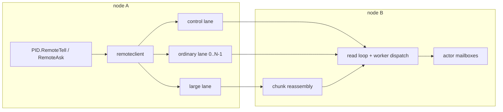
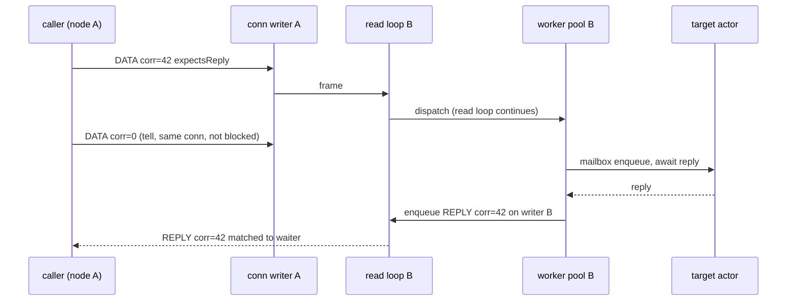

# Remoting Engine Refactor (Artery-Class Protocol over TCP)

**Overview:** Refactor the remoting engine from a unary request/response protocol over pooled sockets into a multiplexed, lane-based, correlation-driven protocol over persistent duplex TCP connections, with chunked large-message support, wire-level compression tables, credit-based flow control, and a transport abstraction that later admits a QUIC implementation. The design follows the architecture Akka Artery uses in its default TCP mode. No Aeron port is involved: the Go Aeron client is unmaintained (last commit June 2024), Akka itself defaults Artery to TCP, and Akka.NET's Artery plan rejected Aeron in favor of QUIC.

## Goals

1. Remove head-of-line blocking at all three layers where it exists today: the write-then-read connection hold, the server's inline dispatch on the read loop, and the single per-destination coalescer writer.
2. Support messages far larger than the current 16 MiB ceiling without stalling small-message traffic, with a proper in-band error instead of a connection kill on overflow.
3. Cut the per-message cost on the default protobuf path from roughly 4 payload copies and per-message envelope allocations to 2 copies and near-zero envelope allocations.
4. Replace heuristic wire-format detection with a versioned, negotiated protocol.
5. Replace silent overload drops with credit-based backpressure.

## Non-goals

* Delivery semantics stay **at-most-once** at the transport. Reliable delivery remains a controller protocol layered above (see [RELIABLE_DELIVERY.md](../RELIABLE_DELIVERY.md)).
* No change to the public actor API (`Tell`, `Ask`, `RemoteTell`, `RemoteAsk`, batch variants) or to the public `remote.Serializer` contract.
* Cluster membership and the distributed registry (olric, memberlist, [internal/cluster/cluster.go](../internal/cluster/cluster.go)) keep their own transports; only traffic that rides remoting today is affected.
* No new user payload formats. FlatBuffers or Cap'n Proto for user payloads would break the public API for gains the envelope work already captures.

## Implementation todos

1. [x] Frame protocol and handshake: versioned fixed header, HELLO negotiation, duplex connection type replacing pooled unary sockets
2. [x] Async correlation: pending-request table, per-connection writer goroutine, worker-pool dispatch off the read loop
3. [x] Lanes: control, ordinary (hashed by target), large; deadline enforcement on every path
4. [x] Large messages: chunking, reassembly limits, frame pool rework for chunk-sized buffers (Milestone 4; docs for `LargeMessageDestinations` deferred with `remoting.mdx`)
5. [x] Wire compression tables for actor paths and type names, receive-path sender-PID cache (Milestone 5 complete; envelope layout and serializer IDs already fixed in Milestone 2; benchstat comment on #1301 at commit handoff)
6. [x] Serialization pass: zero-copy duplex payload handoff, pooled stock-protobuf control encode, allocation audit (Milestone 6 complete; vtprotobuf deferred / Opaque API is Milestone 8; benchstat comment on #1301 at commit handoff)
7. [x] Flow control: per-connection byte credits, coalescer and dead-letter semantics rework (Milestone 7 complete; commit pending maintainer approval)
8. [ ] Opaque API migration (Milestone 8): move `internal/internalpb` to the Go Protobuf Opaque API via `API_HYBRID` plus the `open2opaque` rewrite, then flip to `API_OPAQUE`; generation scoped to `protos/internal` (`testpb` stays on the open API); footprint-gated (heap benches on control-plane paths, binary-size delta, lazy-decoding spike); no wire, revision, or dependency change (section 7 / Decision 4)
9. [x] Documentation: update the remoting pages under `docs/` for the new knobs, presenting `LargeMessageDestinations` as a performance and isolation knob, not a correctness gate (section 3)
10. [ ] Deferred work: QUIC transport behind the `Transport` interface

Implementation prerequisite: each phase requires an approved issue filed with the GoAkt issue templates before framework code changes, as required by `AGENTS.md`. Phases 1 to 7 and the documentation phase are covered by the comprehensive `feat` issue [#1301](https://github.com/Tochemey/goakt/issues/1301) with a milestone checklist; the per-milestone implementation specification with acceptance criteria is [REMOTING_REFACTOR_MILESTONES.md](REMOTING_REFACTOR_MILESTONES.md). Milestone 8 (Opaque API migration) and the QUIC transport each get their own `feat` issue when taken up; #1301's checklist ends at Milestone 7. Documentation lands with each milestone, as `AGENTS.md` requires. vtprotobuf was considered for `internalpb` and is deferred (Decision 4); any future codegen dependency needs its own justified issue (the Opaque API needs none).

---

## Current state (what the refactor replaces)

The engine is a hand-rolled length-prefixed protobuf-over-TCP protocol, entirely unary, in [internal/net](../internal/net) and [internal/remoteclient](../internal/remoteclient). The foundation worth keeping: raw TCP with no HTTP or gRPC tax, the bucketed [FramePool](../internal/net/frame_pool.go), the sharded [WorkerPool](../internal/net/worker_pool.go), pooled buffered readers, the proto type-name cache, `MarshalAppend` into pooled frame tails, per-endpoint client caching, and the socket option plumbing.

The problems, each load-bearing for this design:

| #  | Problem                                                                                                                                                              | Where                                                                                                                                                |
|----|----------------------------------------------------------------------------------------------------------------------------------------------------------------------|------------------------------------------------------------------------------------------------------------------------------------------------------|
| 1  | `SendProto` holds a connection exclusively for a full write-then-read round trip; concurrency exists only by opening more sockets                                    | [internal/net/client.go:311](../internal/net/client.go#L311)                                                                                         |
| 2  | Server dispatches handlers inline on the connection read loop; a `RemoteAsk` blocks the socket on the target actor's reply for up to the ask timeout                 | [internal/net/proto_server.go:533](../internal/net/proto_server.go#L533), [actor/actor_system.go:2281](../actor/actor_system.go#L2281)               |
| 3  | One coalescer writer goroutine per destination performs one synchronous RPC at a time; a 16 MiB message monopolizes the peer's entire outbound path                  | [internal/remoteclient/coalescer.go:165](../internal/remoteclient/coalescer.go#L165)                                                                 |
| 4  | 16 MiB hard frame ceiling enforced by closing the connection with no error frame; the limit is server-only, the client read limit is hard-coded                      | [internal/net/proto_server.go:456](../internal/net/proto_server.go#L456), [remote/config.go:261](../remote/config.go#L261)                           |
| 5  | `FramePool` tops out at 4 MiB; frames between 4 and 16 MiB allocate fresh on every message and are never pooled                                                      | [internal/net/frame_pool.go:27](../internal/net/frame_pool.go#L27)                                                                                   |
| 6  | Roughly 4 copies of payload bytes end to end: inner serializer frame, proto marshal into `RemoteMessage.message`, `proto.Unmarshal` copy out, inner deserialize copy | [remote/proto_serializer.go:119](../remote/proto_serializer.go#L119), [protos/internal/remoting.proto](../protos/internal/remoting.proto)            |
| 7  | Sender and receiver travel as full address strings on every message; for small payloads the addresses dominate wire bytes                                            | `RemoteMessage` fields 1 and 2                                                                                                                       |
| 8  | Wire format detection is heuristic (guessing metadata layout from length arithmetic), not versioned                                                                  | [internal/net/client.go:649](../internal/net/client.go#L649), [internal/net/proto_server.go:483](../internal/net/proto_server.go#L483)               |
| 9  | Coalescer overflow and flush failures drop whole 256-message batches to dead letters, silently on queue-full                                                         | [internal/remoteclient/coalescer.go:186](../internal/remoteclient/coalescer.go#L186), [actor/remote_server.go:1999](../actor/remote_server.go#L1999) |
| 10 | Connection pool bounds retention (32 idle), not concurrency: the 33rd concurrent caller to one peer pays a fresh dial plus TLS handshake                             | [internal/net/client.go:197](../internal/net/client.go#L197)                                                                                         |
| 11 | Compression is a whole-connection wrapper with no negotiation; both sides must be configured identically or the connection is garbage                                | [internal/net/compress.go:55](../internal/net/compress.go#L55)                                                                                       |
| 12 | `remote.Config.writeTimeout` and `readIdleTimeout` are dead fields; the non-coalesced tell path can block on a black-holed peer indefinitely                         | [remote/config.go](../remote/config.go), [internal/net/client.go:366](../internal/net/client.go#L366)                                                |

## Design principle

One protocol, pluggable transports. The protocol layer owns framing, lanes, correlation, chunking, compression tables, and flow control. The transport layer owns byte movement and connection lifecycle. TCP is the first and default transport; QUIC maps onto the same abstractions later (each lane becomes a QUIC stream, each large message an ephemeral stream) without touching the protocol layer. This is the same split Akka uses to run one Artery protocol over both TCP and Aeron.



---

## 1. Frame protocol

### Fixed header, 16 bytes

```
byte 0        1        2        3        4..7          8..15
+--------+--------+--------+--------+--------------+------------------+
| ver    | type   | flags  | lane   | length (BE)  | correlation (BE) |
+--------+--------+--------+--------+--------------+------------------+
```

* `ver`: protocol version. Starts at `0x02` and doubles as the discriminator that lets one listener serve both protocols during rolling upgrades. The sniff must happen after TLS unwrap but before any compression wrapper, because both sides install wrappers in that order ([internal/net/client.go:554](../internal/net/client.go#L554), [internal/net/tcp_server.go:444](../internal/net/tcp_server.go#L444)); `serveConn` must be restructured to read one byte between the TLS wrap and the compression wrap. At that point the first byte is `0x00`/`0x01` for an uncompressed legacy frame (32-bit big-endian length capped at 16 MiB), `0x1f` for legacy gzip, `0x28` for legacy zstd, or `0x02` for the new protocol, so the match must be exact, not `>= 0x02`. Legacy brotli emits no magic byte and its first byte can collide with `0x02`; the dual-protocol listener is therefore unsupported when legacy peers use brotli compression, and those clusters take the config-gated rollout path instead.
* `type`: `HELLO`, `HELLO_ACK`, `DATA`, `REPLY`, `ERROR`, `CHUNK`, `CREDIT`, `TABLE`, `PING`, `PONG`.
* `flags`: `hasMetadata`, `expectsReply`, `firstChunk`, `lastChunk`, reserved bits.
* `lane`: lane index on multi-lane transports; ignored on QUIC where the stream is the lane.
* `length`: payload bytes following the header.
* `correlation`: nonzero for asks, replies, request-scoped errors, and chunk groups; zero for fire-and-forget and connection-scoped `ERROR` frames (protocol violations / handshake failures with no originating request).

Fixed size keeps the parse branch-free; the reader pulls 16 bytes, switches on `type`, and reads `length` more.

### DATA payload layout (hand-parsed, replaces `RemoteMessage`)

```
senderRef | receiverRef | typeRef | serializerID (1B) | [metaLen(4B) metadata] | payload bytes
```

`senderRef`, `receiverRef`, `typeRef` are varints: either a compression-table ID or, before registration, `0` followed by a length-prefixed inline string. The metadata blob keeps the existing binary format from [internal/net/metadata.go](../internal/net/metadata.go), now gated by a flag instead of guessed.

`serializerID` needs care, for two reasons found in the current implementation. First, the public [`remote.Serializer`](../remote/serializer.go) contract explicitly requires self-describing payload bytes and hands `Deserialize` nothing but those bytes, so the envelope cannot strip type information from a custom serializer's output without breaking the contract. Second, custom serializers are registered per node in arbitrary order and the interface carries no name, so no stable cross-node numeric identity exists for them today. Resolution:

* Fixed IDs for the built-in formats, including an internal proto codec that is the hot path: `typeRef` supplies the type, payload bytes are raw protobuf with no inner frame, and the frame-in-proto-in-frame nesting disappears along with one full payload copy and the redundant type-name header. The public `ProtoSerializer` type keeps its current framed output for direct use and legacy interop.
* One reserved ID marks a custom-serializer payload. Its bytes remain the serializer's verbatim self-describing output with `typeRef` zero, and receive-side resolution keeps the existing dispatch in [internal/remoteclient/serializer_dispatch.go](../internal/remoteclient/serializer_dispatch.go). The public contract and existing custom serializers work unchanged. A later additive `NamedSerializer` optional interface can give custom serializers precise IDs negotiated in `HELLO`; that is deferred work, not part of this refactor.

The zero-copy and copy-count claims in section 7 therefore apply to the default proto path; custom-serializer payloads keep their current copy profile.

Control-plane RPCs (Spawn, Stop, Watch, and the rest of the ~25 pairs) stay protobuf request/response types, carried as `DATA` frames with `expectsReply` on the control lane. They need no envelope flattening; they are not the hot path. The exception is control payloads that can be arbitrarily large in practice (`RelocateBatch`, `PersistPeerState`, `GetState`): above the chunk threshold they route over the large lane, which is safe because request/response correlation does not depend on lane ordering, and it keeps the control lane reserved for small latency-critical traffic.

`ERROR` frames carry `internalpb.Error` with the correlation ID of the failed request, which finally gives oversize and handler failures an in-band response instead of a dead socket.

### Handshake

First frames on any new connection, both directions:

```
HELLO { protocolVersion, nodeIdentity (system name, host:port), laneRole, laneIndex,
        compressionCodec, maxFrameSize, maxMessageSize, initialCredits }
```

The server replies `HELLO_ACK` with its own parameters; effective limits are the pairwise minimum, and the compression codec is negotiated instead of assumed (fixes problem 11). A version mismatch produces an `ERROR` frame and a clean close. All post-handshake bytes may pass through the negotiated compression wrapper, reusing the existing codec pools in [internal/net/compress_zstd.go](../internal/net/compress_zstd.go).

## 2. Async correlation

Connections become long-lived duplex channels, not checkout/checkin resources.

* **Client side:** each connection gets one writer goroutine draining a bounded outbound queue and one reader goroutine. Asks allocate a correlation ID from an atomic counter and park a pooled waiter (channel or future, reusing the response-channel pooling in [actor/actor_system.go:2293](../actor/actor_system.go#L2293)) in a per-connection `xsync.Map`. The reader matches `REPLY`/`ERROR` frames to waiters by ID. Ask timeouts fire locally against the pending table; the connection keeps flowing.
* **Server side:** the read loop's only jobs are frame reassembly and handoff. Fire-and-forget `DATA` frames take an inline fast path, mailbox enqueue directly on the read loop, since enqueue is non-blocking and cheaper than a pool hop; bounded-mailbox rejection keeps its existing dead-letter semantics. `expectsReply` frames are dispatched to the existing [WorkerPool](../internal/net/worker_pool.go); handler completions enqueue `REPLY` frames on the connection's writer queue, so responses from concurrent handlers interleave freely. A slow actor now delays only its own caller (fixes problem 2).
* **Writer batching replaces request coalescing.** The writer drains its queue and issues one `writev`-style flush per wakeup, so batching happens at the byte level with no 256-message all-or-nothing proto envelope. It also removes a latency tax: today's batching only accretes while an RPC is in flight, so every batch pays a round-trip sync point before the next flush, while the writer drains continuously with no per-batch acknowledgment. A transport failure fails the frames actually unwritten, not an entire batch (fixes problem 9's blast radius). The [coalescer](../internal/remoteclient/coalescer.go) and its flush timeout leave the duplex path entirely; during the dual-protocol transition they survive solely to serve legacy peers and are deleted together with the legacy path in the next major release. `RemoteBatchTell`/`RemoteBatchAsk` remain as API and simply enqueue N frames.



Connections per peer drop from up to 32 pooled sockets to the fixed lane set (typically 3 to 6), each fully multiplexed; the 33rd concurrent caller shares an existing connection instead of dialing (fixes problems 1 and 10). Lifecycle changes with them: lanes are dialed lazily on first send to a peer and kept alive with `PING`/`PONG` instead of the current 30 s idle eviction, and are torn down on peer-down cluster events or shutdown. On connection loss, pending waiters fail immediately with a transport error, partially reassembled chunk groups are discarded, and the dialer reconnects with backoff while new sends queue against the backpressure rules in section 6. At-most-once semantics are unchanged; nothing is retransmitted.

Replies always return on the connection that carried the request; the server never dials back. An oversized reply chunks in place on that same lane, which briefly serializes the lane behind it. Ask patterns that return bulk data should therefore be listed as large-message destinations (section 3) so both directions ride the large lane.

## 3. Lanes

Per peer pair, the lane set is:

* **Control lane (1):** watch/unwatch, spawn/stop, cluster RPCs, and anything system-critical. A flood of user messages can no longer delay a death-watch notification, which is the isolation Artery calls out as its primary robustness win.
* **Ordinary lanes (N, default 1):** user tells and asks, assigned by `hash(receiver path) % N`. Per-lane FIFO plus sticky assignment preserves per-target-actor ordering. `N > 1` trades ordering-domain granularity for parallel serialization exactly as Artery's `outbound-lanes`; the default stays 1 for lowest latency.
* **Large lane (1):** messages to configured large-message destinations, chunked (section 4). Bulk transfer saturates its own TCP connection while small messages flow untouched.

Deadlines: every write path gets a write deadline and every read path an idle deadline from `remote.Config`, resurrecting the currently dead `writeTimeout`/`readIdleTimeout` fields (fixes problem 12). `PING`/`PONG` on every lane connection gives failure detection independent of traffic: each lane is its own TCP connection, so a probe on the control lane alone could not detect a black-holed ordinary or large connection.

One ordering guarantee narrows by design. Today the default coalesced path incidentally serializes all traffic to a destination node through one writer goroutine, which yields per-destination-node FIFO. The new design guarantees per sender-target pair FIFO only, which is the actor-model contract and what Akka guarantees. At the default `OrdinaryLanes = 1` the narrowing is almost entirely theoretical: all ordinary traffic to a node still rides one FIFO connection, so today's effective ordering survives except that control messages can overtake user messages (the deliberate death-watch isolation this design exists for) and configured large destinations ride their own lane (user opted in). The guarantee narrows further only if an operator raises `OrdinaryLanes`, which is that knob's documented trade. Per-pair FIFO is the documented contract so the stronger incidental behavior is never relied upon.

**Large-message routing (decided):** explicit configuration, Akka-style: `remote.WithLargeMessageDestinations(patterns...)`. Matched actors always use the large lane, so their ordering is preserved per actor. An unmatched message above the chunk threshold neither errors nor switches lanes: it chunks in place on its ordinary lane (section 4), which keeps per-pair FIFO intact and is never worse than today, where the same message stalls the single per-node coalescer writer carrying strictly more traffic. Size-threshold routing was rejected because silently reordering mixed small and large traffic to one actor violates the per-pair contract. The routing decision costs nothing steady-state: it is computed once per receiver and cached on the peer sticky route entry that Milestone 5 also uses for the receiver path table ID (section 5), a lookup the send path performs anyway.

A consequence worth stating plainly: with in-place chunking as the fallback, `LargeMessageDestinations` is a performance and isolation knob, not a correctness gate. Any actor can receive any message up to `maxMessageSize` whether or not it is listed; listing it moves the bulk traffic onto the dedicated lane so it cannot stall ordinary traffic, and that is the only difference. The public documentation and examples must present the option exactly this way, so nobody reads an unlisted actor as size-capped or a listed one as a prerequisite for large payloads, and so in-place chunking on an ordinary lane reads as designed behavior rather than a bug.

## 4. Large messages

* `CHUNK` frames carry the correlation ID as the chunk-group key, a varint chunk index, and on the first chunk the total message size (so the receiver can reject oversize before buffering anything). Every chunked message allocates a correlation ID, including fire-and-forget tells whose unchunked frames carry zero; `expectsReply` alone decides whether a waiter is registered. The first chunk's payload begins with the logical frame header and envelope, so a reassembled group is processed exactly like a single `DATA` frame.
* Chunk payload size defaults to 256 KiB: large enough to amortize header and syscall cost, small enough to sit in an existing `FramePool` bucket, so large-message traffic finally pools (fixes problem 5). The 4 MiB pool ceiling stays; nothing larger than a chunk is ever pooled.
* `maxMessageSize` (reassembly limit) becomes independently configurable and may exceed 16 MiB. The `maxFrameSize` per-frame sanity bound eventually shrinks to chunk size plus headers, but only when the legacy path is removed in the next major: negotiation takes the pairwise minimum and a pre-chunking peer cannot split, so advertising the tight bound during the transition would kill every mid-size message in a mixed cluster. Until then the advertisement stays at 16 MiB, and between chunking-capable peers no legitimate frame exceeds chunk-plus-headroom anyway because the sender splits above the chunk threshold. Oversize now yields an `ERROR` frame with a diagnosable message instead of a dead connection (fixes problem 4).
* Reassembly memory is bounded explicitly, not by the credit window: credits must replenish as soon as chunk bytes are accepted into a reassembly buffer (section 6), because replenishing only on dispatch would deadlock every message larger than the window. The bounds are `maxMessageSize` per transfer plus a `maxConcurrentLargeTransfers` cap per connection (default 4); a chunk group beyond the cap is rejected with an in-band `ERROR`, not a dead connection.
* Interaction with reliable delivery: the chunking added for #1300's payloads stays at that layer for its own sequencing needs; transport chunking is transparent beneath it. No coordination required beyond both respecting `maxMessageSize`.

## 5. Compression tables

**Status:** Implemented (Milestone 5). Gated by capability `revision >= 3`. Envelope layout and serializer IDs were fixed in Milestone 2; this section is table compression and receive-path caching only.

Per connection, sender-assigned, carried in `TABLE` frames:

* On first use of an actor path or message type name, the sender assigns a monotonic ID under the per-kind sender-table mutex and admits `TABLE { kind, id, literal }` via a non-blocking-on-backpressure enqueue (`admitFrame`) before the referencing frame, so TABLE-before-use holds on the single-writer queue without acknowledgment rounds. Tables reset with the connection.
* Subsequent frames reference the varint ID. A typical steady-state envelope shrinks from two full address strings plus a fully qualified type name (often 150+ bytes) to a few varint bytes, which for small payloads more than pays back the loss of the old batch envelope's field sharing.
* Tables are bounded (default 8192 entries per kind per connection, matching the existing sender-address cache size in [actor/remote_server.go](../actor/remote_server.go)); on overflow the sender falls back to inline literals for new entries. The peer sticky route cache (same cap) stores lane + receiver path ID + owning session so reconnects re-register without sweeping stale IDs.
* The receive path stores an opaque sender handle on path-table hits (actor layer installs a resolver; `internal/net` does not import `actor`). Duplex tell uses the cached `*PID` and skips per-message `newRemoteSenderPID` materialization; legacy and inline refs keep the address-parse cache in [actor/remote_server.go](../actor/remote_server.go).

## 6. Flow control

**Status:** Implemented (Milestone 7). Commit pending maintainer approval. Performance comment on #1301.

Credit-based, per connection, byte-denominated:

* `HELLO` grants `initialCredits` (default 16 MiB). The sender decrements per frame written; at zero it parks new frames in the byte-bounded outbound queue and, when that fills, `submit` blocks the caller (the existing backpressure point in [coalescer.go:125](../internal/remoteclient/coalescer.go#L125) moves here) until the context deadline or `writeTimeout` expires, per the decided semantics below.
* The receiver returns `CREDIT { bytes }` once it takes ownership of the bytes: on mailbox enqueue for ordinary frames, on reassembly-buffer append for chunks (section 4 explains why the earlier point is required). Grants are batched to roughly every quarter-window to keep credit traffic negligible.
* The window bounds in-flight and pre-dispatch bytes; reassembly memory is bounded separately (section 4). Backpressure replaces silent queue-full drops, and slow receivers slow fast senders without dropping. `errors.ErrRemoteSendBackpressure` keeps its meaning: returned when the outbound queue cannot accept a frame within the caller's deadline.

**Tell failure semantics (decided):** unified async semantics. Enqueue success returns nil; transport failures dead-letter with an event; a full queue blocks up to the context deadline and then returns `errors.ErrRemoteSendBackpressure`; a caller with no deadline is bounded by the resurrected `writeTimeout` instead of blocking forever. This matches what default users already experience since coalescing is on by default; only the non-coalesced synchronous-error path changes, and keeping it would force write-then-confirm and kill pipelining. The outbound queue is capped in bytes, not messages, sized to the credit window (16 MiB default): the current coalescer queue is message-counted (1024 deep per destination), which at 1 MiB payloads is a potential gigabyte per peer, so the byte cap makes per-peer memory bounded and predictable for the first time.

## 7. Serialization and allocation pass

**Status:** Implemented (Milestone 6). vtprotobuf deferred; Opaque API remains Milestone 8. Benchstat comment on #1301 at commit handoff.

* **Zero-copy receive (Milestone 6):** the `DATA` envelope is hand-parsed (section 1), so the receive path is: read frame into a pooled buffer, parse refs as integer reads (or table IDs after section 5), hand the payload as a subslice directly to deserialization, return the buffer to the pool only after `Deserialize` completes. On the default proto path, payload copies drop from 4 to 2 (kernel to frame buffer, frame buffer to concrete message); custom-serializer payloads (ID 255) are copied out of the pooled buffer before `Deserialize` so user code may retain the slice without a public contract change. Client-owned REPLY/ERROR bodies return via a session `ReleasePayload` hook. The `unsafe.String` type-name view technique already used in [internal/net/proto_serializer.go:252](../internal/net/proto_serializer.go#L252) extends to inline literals; table hits skip the global registry.
* **Control-plane encode (Milestone 6):** handshake and control *request* encode use stock `proto.MarshalOptions{UseCachedSize: true}.MarshalAppend` into a package-level encode [FramePool](../internal/net/frame_pool.go) via an exported helper, only where the caller still owns the buffer at a deterministic release point (handshake after synchronous write; control request after the envelope copies the bytes). ERROR/reject frames and ask error replies keep plain `proto.Marshal` because their bytes become asynchronously queued frame payloads with no writer-completion release hook. Decode stays stock `proto.Unmarshal`. No message-object pools in this milestone.
* **vtprotobuf (deferred); Opaque API designated as successor:** vtprotobuf was previously approved in Decision 4 for `internalpb` reflection-free codecs and is reversed for Milestone 6: `planetscale/vtprotobuf` has had no tagged release since `v0.6.0` (2024-01-29) and is not an acceptable long-lived dependency for GoAkt. After envelope flattening the user hot path never touches generated `internalpb` code anyway. The designated successor is the first-party Go Protobuf **Opaque API** (`protobuf-go` v1.36+, already vendored, zero new dependencies): Google recommends it for new development (“We recommend you select the Opaque API for new development. Protobuf Edition 2024 will make the Opaque API the default.”, <https://go.dev/blog/protobuf-opaque>). Adoption is **Milestone 8** of this refactor (own `feat` issue; #1301's checklist ends at Milestone 7): migrate `internalpb` via `API_HYBRID` plus the `open2opaque` rewrite tool, scope generation to `protos/internal` (`testpb` stays on the open API), and gate on footprint neutrality: heap benches on the control-plane paths, a recorded binary-size delta, and a spike on lazy-decoding applicability to the proto3 message set. Expectation to keep honest: with plain proto3 and five `optional` fields total, struct memory is unchanged, so the migration is a correctness and alignment play (aliasing protection next to pooled buffers), not a memory win. New `.proto` files added before that migration adopt the Opaque API immediately per the Google recommendation. User-facing generated code stays untouched either way.
* Frame buffer lifetime and registry caching as above; allocation audit of steady-state tell/ask lands with Milestone 6 and is benchstat-gated on #1301.

## 8. Transport abstraction and QUIC (deferred work)

```go
// Transport dials and accepts lane sets for a peer.
type Transport interface {
    Dial(ctx context.Context, peer string, lane LaneSpec) (FramedConn, error)
    Listen(addr string) (Acceptor, error)
}

// FramedConn moves whole frames with the section 1 header.
type FramedConn interface {
    WriteFrames(frames ...Frame) error
    ReadFrame() (Frame, error)
    Close() error
}
```

The TCP implementation is the refactor above. The QUIC implementation (quic-go, actively maintained, Go 1.26 compatible, production users include Caddy, Cloudflare, and Traefik) maps one connection per peer, one stream per lane, one ephemeral stream per large message (making section 4's chunking a TCP-only concern), TLS 1.3 built in, and no cross-stream loss blocking. It stays deferred because UDP remains blocked in some datacenter environments (TCP must stay the default), it is a new dependency, and the protocol work above captures most of the win on both transports.

## Rollout and compatibility

* One listener serves both protocols by first-byte sniff (section 1, with the brotli exclusion), so a cluster can roll node by node. Dial-side detection is concrete: a new node's `HELLO` starts with `0x02`, which a legacy server reads as a frame length above its 16 MiB limit and answers by silently closing the socket ([internal/net/proto_server.go:456](../internal/net/proto_server.go#L456)); the new client treats EOF-before-`HELLO_ACK` as a legacy peer, redials through the legacy path (including whatever legacy compression wrapper it is configured with), and caches the peer's protocol until the next reconnect. Per-peer switchover happens only at (re)connect and must drain legacy in-flight sends first so the transition cannot reorder messages. The legacy client path is kept intact during the transition and deleted in the following major release.
* Decided: the dual-protocol listener is on by default and dial-side fallback with per-peer caching is the default dialing mode. The accept-side sniff costs one byte peek at connection setup, amortized to nothing on persistent lanes; the dial-side fallback costs one failed dial per legacy peer per reconnect, then caches. A `remote.Config` protocol pin (legacy protocol or new protocol) covers the brotli exclusion and operators who want determinism. Requiring a homogeneous cluster was rejected because it forces full-cluster restarts on users who roll nodes.
* `remote.Config` additions: `LargeMessageDestinations` (section 3 decision), `OrdinaryLanes`, `ChunkSize`, `MaxMessageSize` (decoupled from `MaxFrameSize`), `MaxConcurrentLargeTransfers` (section 4), `InitialCredits`, and the protocol pin. Existing knobs keep their meaning; `MaxFrameSize` finally applies to the client side too.

## Verification

* Correctness: targeted unit tests per phase (framing round-trips including truncated and adversarial headers, handshake negotiation and version mismatch, correlation table under concurrent asks and timeouts, chunk reassembly including out-of-order and oversize rejection, table overflow fallback, credit exhaustion and replenishment, per-actor ordering under lane hashing). Cross-version tests dial a legacy endpoint from a new client and vice versa, cover the EOF-fallback path, and exercise the first-byte sniff against each legacy compression codec, including the brotli exclusion. Three dedicated regression tests: a message larger than the credit window must complete (the reassembly-replenishment rule in section 4), a chunk group beyond `maxConcurrentLargeTransfers` must fail with an in-band error while the connection stays usable, and an unmatched oversized message chunked in place on its ordinary lane must stay in order with surrounding small messages to the same actor.
* Performance: benchmark before/after with benchstat on three axes: small-message throughput per peer pair (target: order of 1M msgs/sec aggregate, Artery's published class), ask p99 latency under mixed load with one slow actor (target: unaffected by the slow actor), and a 100 MiB transfer concurrent with small-message traffic (target: no measurable small-message latency impact). Benchmark scaffolding is temporary and deleted at wrap-up per project practice.
* No coverage regression; each phase lands with its tests.

## Decisions (all resolved)

1. **Large-message routing:** explicit `LargeMessageDestinations` patterns; unmatched oversized messages chunk in place on their ordinary lane instead of erroring or switching lanes. The option is therefore a performance and isolation knob, not a correctness gate, and the public docs must present it that way. Section 3.
2. **Tell failure semantics:** unified async semantics with a byte-capped outbound queue sized to the credit window and `writeTimeout` as the no-deadline bound. Section 6.
3. **Rollout:** dual-protocol listener on by default with dial-side fallback and per-peer caching; config pin for legacy-brotli clusters and operators who want determinism. Homogeneous-cluster gating rejected.
4. **vtprotobuf:** previously approved for `internalpb`, sequenced last, benchstat-gated. **Amended:** deferred out of the #1301 milestone series because the project is not release-maintained (last tag `v0.6.0`, 2024-01-29). Milestone 6 ships zero-copy receive and pooled stock-protobuf control encode instead. **Successor:** the first-party Go Protobuf Opaque API (recommended by Google for new development, <https://go.dev/blog/protobuf-opaque>) is adopted for `internalpb` as Milestone 8 under its own `feat` issue, footprint-gated; new proto files use it immediately. Section 7.
5. **Coalescer deletion:** approved, staged: the coalescer leaves the duplex path immediately but survives to serve legacy peers during the dual-protocol transition, and is deleted with the legacy path in the next major release. Internal change only: `remoteclient.WithSendCoalescing` is wired from [actor/actor_system.go:2960](../actor/actor_system.go#L2960) and not exposed publicly; `errors.ErrRemoteSendBackpressure` keeps its meaning under the writer queue. Writer batching removes the per-batch round-trip sync point, shrinks failure blast radius to unwritten frames, and cuts per-peer sockets from up to 32 to the lane set. Section 2.
6. **Ordering narrowing:** per sender-target pair FIFO is the documented contract. At the default `OrdinaryLanes = 1` the change is almost entirely theoretical: control-lane priority and configured large destinations only. Section 3.
