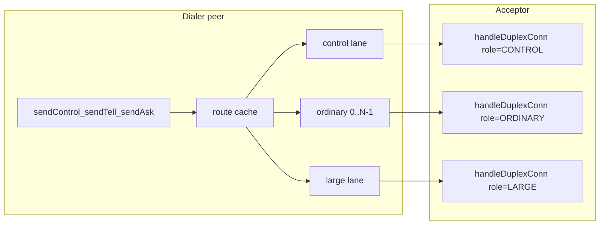

# Milestone 3 Implementation Plan: Lanes and Deadline Enforcement

**Issue:** [#1301](https://github.com/Tochemey/goakt/issues/1301)
**Authoritative scope:** [REMOTING_REFACTOR_MILESTONES.md](REMOTING_REFACTOR_MILESTONES.md) (Milestone 3)
**Design rationale:** [REMOTING_REFACTOR_DESIGN.md](REMOTING_REFACTOR_DESIGN.md) §3
**Depends on:** Milestone 2 (duplex dial-first, correlation, envelopes, peer cache) — landed

**Overview:** Implement Milestone 3 end-to-end: per-peer role-separated duplex lanes (control / ordinary×N / large), receiver-path routing with `LargeMessageDestinations`, live `writeTimeout` and `readIdleTimeout` PING/PONG liveness, and peer-down / shutdown lane-set teardown — as one reviewable diff (no commit until approved).

## Scope

From the milestones guide, Milestone 3 delivers:

- Lane manager: one control lane, `OrdinaryLanes` ordinary lanes, one large lane per peer (duplex peers only; legacy peers keep unary `SendProto`)
- Routing: control RPCs → control; user traffic hashed by receiver path; `LargeMessageDestinations` → large
- Live `writeTimeout` on every duplex write path (already partially wired in M2; assert with black-hole test)
- Live `readIdleTimeout`: idle PING, close after two missed PONGs
- Peer lifecycle teardown on cluster `NodeLeft` and system shutdown (no auto-redial until new traffic)

**Out of scope:** chunking / large FramePool rework (M4), compression tables (M5), vtprotobuf (M6), credit windows (M7), coalescer deletion, enforcement of `MaxConcurrentLargeTransfers` (HELLO/config only in M3; reassembly cap is M4).

**Known interim state:** Until Milestone 4, the large lane carries **whole frames** only (still bounded by `MaxFrameSize`). `RelocateBatch`, `PersistPeerState`, and `GetState` stay on the control lane until chunking lands. Document both as transitional.

## Locked decisions

| Topic                              | Decision                                                                                                                                                                                                                                                                                                                                                                                                                                                                                                                                                                                                                                                                                                                                                                                                             |
|------------------------------------|----------------------------------------------------------------------------------------------------------------------------------------------------------------------------------------------------------------------------------------------------------------------------------------------------------------------------------------------------------------------------------------------------------------------------------------------------------------------------------------------------------------------------------------------------------------------------------------------------------------------------------------------------------------------------------------------------------------------------------------------------------------------------------------------------------------------|
| Default `OrdinaryLanes`            | `1` (preserves today’s effective ordering); validated `1..254` (indexes `0..maxOrdinaryLaneIndex` encode as header bytes `1..0xFE`; expose the count bound as an exported `internal/net` constant so `remote` validation does not duplicate the magic number)                                                                                                                                                                                                                                                                                                                                                                                                                                                                                                                                                        |
| Large-destination match            | Glob against the receiver’s **hierarchical actor path** (the `/…` suffix of `goakt://system@host:port/…`), not the full URI — Go `path.Match` is unsuitable for `:`/`@` in URIs. Empty pattern list matches nothing. Invalid patterns fail config validation.                                                                                                                                                                                                                                                                                                                                                                                                                                                                                                                                                        |
| Large-lane payloads (M3)           | Whole frames only; isolation knob, not a size gate                                                                                                                                                                                                                                                                                                                                                                                                                                                                                                                                                                                                                                                                                                                                                                   |
| Bulk control RPCs                  | Stay on control until M4                                                                                                                                                                                                                                                                                                                                                                                                                                                                                                                                                                                                                                                                                                                                                                                             |
| HELLO_ACK lane identity            | Acceptor adopts dialer’s `lane_role` / `lane_index` (fix today’s CONTROL-only ACK). Validate well-formedness only: known role, ordinary index within the wire bound (`maxOrdinaryLaneIndex`); invalid role/index → ERROR then close. The acceptor must **not** bound the index by its own `OrdinaryLanes`: the lane count is not negotiated in HELLO and is a dialer-side sharding choice, so enforcing the local count would break peers whose configs differ mid-rollout. The dialer stamps and enforces the lane identity **from the ACK**, not from its request: a baseline acceptor that predates lane echo answers CONTROL for every dial, and adopting its identity keeps frame stamping consistent with that peer’s ERROR/REPLY lane bytes instead of failing the lane on its first server-originated frame. |
| Liveness scope                     | PING/PONG on **every** duplex lane connection (each is its own TCP socket); a probe on the control lane alone cannot detect a black-holed ordinary or large connection. Design §3 is updated to say so: control isolation is about user vs system *traffic*; failure detection is per connection.                                                                                                                                                                                                                                                                                                                                                                                                                                                                                                                    |
| Liveness mechanics                 | Duplex-owned when `readIdleTimeout > 0`: idle detection is a timer over last-inbound-activity (atomic timestamp updated by `readLoop` on every frame), **not** a socket read deadline. A deadline expiring mid-frame would desync the framed stream (`ReadFrame` is not resumable) and `readLoop` treats every read error as transport loss. On each interval with no inbound activity: submit a correlated PING (best-effort, non-blocking). A miss is counted one interval **after** a probe was admitted with no inbound traffic since, so a peer always gets a full interval to answer each probe; the second such miss → `failTransport` (teardown at the third silent interval, not the second). Any inbound frame resets the miss counter.                                                                    |
| PING/PONG in `readLoop`            | `readLoop` consumes both liveness types, on both sides (the server wraps accepted connections in `duplexConn` too, `proto_server.go:524`). Inbound PING → submit a PONG echoing the correlation, best-effort non-blocking (drop it rather than block the reader on a full writer queue; a saturated outbound means the peer sees traffic and is not probing). Inbound PONG → record activity, complete a registered waiter if the correlation matches one, else drop. Neither reaches `Recv`. This adds the missing client-side PING responder: today a server-initiated PING is silently dropped by `monitorSession` and the healthy connection would die of missed PONGs. The `FrameTypePing` case in `handleDuplexConn` becomes dead code and is removed with this change.                                        |
| `monitorSession` coexistence       | Client monitor keeps draining unsolicited inbound (connection-scoped ERROR). PING/PONG frames never enter `inbound` (handled in `readLoop`). Do not run a second Recv loop that races the duplex liveness owner.                                                                                                                                                                                                                                                                                                                                                                                                                                                                                                                                                                                                     |
| `readIdleTimeout` vs `IdleTimeout` | Distinct knobs. `ReadIdleTimeout` drives PING/PONG (this milestone). `IdleTimeout` remains the long-lived connection reclaim / server idle setting and is not redefined here. The liveness PING doubles as the keepalive design §2 promises (“kept alive with PING/PONG instead of the current 30 s idle eviction”): a healthy idle lane emits a PING every `readIdleTimeout`, which resets the peer server’s `IdleTimeout` reclaim (10s vs 1200s by default). Validate locally that `readIdleTimeout < idleTimeout` when both are nonzero; if a peer reclaims anyway (liveness disabled on our side), the lane redials on the next send.                                                                                                                                                                            |
| Reconnect                          | Lazy, dial-on-demand: no background redial goroutine anywhere. The next send’s `ensureLane` redials, single-flight, so concurrent senders wait on the one in-flight dial (design §2’s “new sends queue while the dialer reconnects”). Exponential backoff (cap ~30s) gates redial after consecutive dial failures: a send inside an active backoff window fails fast with the transport error. Backoff state clears on successful dial, `ClosePeer`, or shutdown. No retransmission (at-most-once).                                                                                                                                                                                                                                                                                                                  |
| Protocol cache                     | Remains **per peer** (host:port), not per lane. Lane set exists only for duplex-classified peers.                                                                                                                                                                                                                                                                                                                                                                                                                                                                                                                                                                                                                                                                                                                    |
| Frame lane byte                    | Must match the connection’s negotiated role/index; mismatch → connection-scoped ERROR then close                                                                                                                                                                                                                                                                                                                                                                                                                                                                                                                                                                                                                                                                                                                     |
| `MaxConcurrentLargeTransfers`      | Add config field + HELLO advertisement in M3; **no runtime enforcement** until M4 reassembly                                                                                                                                                                                                                                                                                                                                                                                                                                                                                                                                                                                                                                                                                                                         |
| Peer-down hook                     | Cluster emits `NodeLeft` (no separate “removed” event); that is the teardown trigger, using `peerRemotingPorts` before it is deleted                                                                                                                                                                                                                                                                                                                                                                                                                                                                                                                                                                                                                                                                                 |

## Architecture

### Routing rules

| Traffic                                                                           | Lane                                                                                                                |
|-----------------------------------------------------------------------------------|---------------------------------------------------------------------------------------------------------------------|
| Control RPCs (`sendControl`)                                                      | CONTROL                                                                                                             |
| User tell/ask whose receiver hierarchical path matches `LargeMessageDestinations` | LARGE                                                                                                               |
| Other user tell/ask                                                               | `hash(receiverPath) % OrdinaryLanes` (FNV-1a over the canonical receiver address string used for sticky assignment) |

Per sender–receiver pair FIFO is preserved by sticky ordinary-lane assignment. Raising `OrdinaryLanes` narrows the ordering domain (documented tradeoff). Control traffic may overtake user traffic by design (death-watch isolation).

Hash input: use the same stable receiver string the route cache keys on (canonical `Address.String()`), so assignment does not change when only display formatting differs.

### Large-destination pattern examples

Patterns match the hierarchical path after `host:port` (leading `/` optional in the matcher normalization):

- `orders/*` — actors under `orders/`
- `*/bulk-ingest` — any `…/bulk-ingest` leaf
- `shard-*/inbox` — single-segment wildcard

They do **not** match host, system name, or port unless those appear inside the hierarchical path (they should not).

## Layered deliverables

### 1. Config knobs

**Files:** `remote/config.go`, `remote/option.go`, tests

- `OrdinaryLanes` (default `1`), `WithOrdinaryLanes`
- `LargeMessageDestinations` (`[]string`), `WithLargeMessageDestinations`
- `MaxConcurrentLargeTransfers` field (default `DefaultMaxConcurrentLargeTransfers`), option + getter

Validate: `OrdinaryLanes >= 1` and `<= 254` (the exported `internal/net` count bound); each large-destination pattern non-empty and accepted by the matcher; transfers `>= 1`; `readIdleTimeout < idleTimeout` when both are nonzero (a liveness interval at or above the reclaim window would let the server cull lanes the client believes healthy). Document that `writeTimeout` / `readIdleTimeout` are live on the duplex path (defaults already 10s).

Wire through `actor/actor_system.go` (`setupRemoting`) and `actor/remote_server.go` (`startRemoteServer`): `readIdleTimeout`, ordinary lanes, large destinations, max concurrent large transfers (replace hard-coded HELLO constant).

### 2. Handshake and server lane identity

**Files:** `internal/net/handshake.go`, `duplex_open.go`, `proto_server.go`, duplex session fields

- Fix `acceptHello` / `negotiateHello` so ACK `LaneRole` / `LaneIndex` come from the **dialer** HELLO; node identity and pairwise minima still come from local/minima.
- Validate dialer lane for well-formedness only: known role, ordinary index `<= maxOrdinaryLaneIndex`; invalid → ERROR then close. Do not bound the index by the acceptor’s `OrdinaryLanes` (not negotiated, dialer-side choice; peers with differing lane counts must interoperate). Note `acceptHello` today returns without writing an ERROR when `laneByte` fails on the ACK; the validation lands before the ACK and answers ERROR then close.
- Persist negotiated lane on the duplex connection (set from `OpenDuplex` and the server accept path).
- `OpenDuplex`: caller supplies `LaneSpec`; implementation writes role/index into the local HELLO (single source of truth — do not take conflicting Hello lane fields from the caller).
- In `handleDuplexConn`, reject frames whose `frame.Lane` does not match the connection lane (ERROR then close).

### 3. Liveness and PONG correlation

**Files:** `internal/net/duplex.go` (+ options), ProtoServer / OpenDuplex wiring

Required `readLoop` change (one change covers both sides, since the server wraps accepted connections in `duplexConn` at `proto_server.go:524`):

- Inbound `FrameTypePing`: submit a PONG echoing the correlation, best-effort and non-blocking (drop the PONG rather than block the reader on a full writer queue; a saturated outbound means the peer is receiving traffic and will not be probing). Never deliver PING to `inbound`. This is the missing client-side responder: today a server-initiated PING reaches `monitorSession`, which drops it, and the healthy connection would be closed for missed PONGs. Remove the now-dead `FrameTypePing` case from `handleDuplexConn` with this change.
- Inbound `FrameTypePong`: record inbound activity, complete a registered pending waiter when the correlation matches one, otherwise drop. Never deliver PONG to `inbound`.

When `readIdleTimeout > 0` (duplex-owned):

- Idle detection is a timer over last-inbound-activity (atomic timestamp updated by `readLoop` on every frame), not a socket read deadline: a deadline expiring mid-frame desyncs the framed stream (`ReadFrame` is not resumable), and `readLoop` treats every read error as transport loss.
- On each interval with no inbound activity: submit a correlated PING (best-effort, non-blocking) and count a miss; after **two** consecutive misses → `failTransport`. Any inbound frame resets the miss counter.
- The liveness owner never blocks on `Ask`: the reader cannot wait on itself, and the activity clock already proves liveness without waiter traffic.

Client `monitorSession` (per lane after M3 refactor) continues to `Recv` only for unsolicited frames (connection-scoped ERROR). PING/PONG never reach it. Propagate `readIdleTimeout` into `newDuplexConn` / `OpenDuplex` / ProtoServer options. `writeTimeout` remains applied on `Submit` and before `WriteFrames` (M2). The liveness PING doubles as the keepalive the design promises: it arrives inside the peer server’s `IdleTimeout` reclaim window, so healthy idle lanes stop being reclaimed (design §2: kept alive with PING/PONG instead of idle eviction).

### 4. Lane manager and routing

**Files:** `internal/remoteclient/peer.go`, new `routing.go` / `lanes.go` (+ colocated tests), `send.go`

Refactor `peer`:

- Replace single `session` with a lane set: `control`, `ordinary[]`, `large` (lazy nil slots). Used only when the peer is duplex (or being probed as duplex).
- `ensureLane(ctx, role, index) (DuplexSession, error)` — dial HELLO with that role/index; protocol cache/fallback stays per peer; switchover drain unchanged.
- Per-lane monitor + identity-safe `retireLane` (like today’s `retireSession`).
- Per-lane reconnect backoff after loss; cancelled by `ClosePeer` / `closeAllLanes`.
- `closeAllLanes()` for shutdown / peer-down; clear protocol + route caches; fail pending waiters via session close.
- Public `Client.ClosePeer(host, port)` for cluster teardown.

Routing:

- `routing.go` — hierarchical-path matcher, FNV-1a sticky assignment, route cache keyed by canonical receiver address string (the cache slot migrates onto the sender compression-table entry in Milestone 5, per the milestones guide).
- `sendControl` → control lane + `LaneControl` frame byte.
- `sendTell` / `sendAsk` / batches → `route(receiver)` then ensure that lane; set frame `Lane` to the negotiated lane byte.

### 5. Peer-down and shutdown

**Files:** `actor/actor_system.go` (`handleNodeLeftEvent`, ~3341), remoting close path

On `NodeLeft`, **before** deleting `peerRemotingPorts`, resolve remoting host/port and call `ClosePeer` so pending waiters fail and lanes drop with no reconnect. System shutdown already closes the remoting client; ensure that path closes the full lane set (not a single session).

### 6. Docs

**File:** `docs/advanced/remoting.mdx`

Document lanes, the `OrdinaryLanes` ordering tradeoff, `LargeMessageDestinations` as an isolation/performance knob (not a size gate) with hierarchical-path pattern examples, transitional whole-frame large lane, and live `writeTimeout` / `readIdleTimeout` / two-miss PONG semantics. Clarify `ReadIdleTimeout` vs `IdleTimeout`.

## Tests (focused, no parallel)

| Area       | Coverage                                                                                                                                                                                                       |
|------------|----------------------------------------------------------------------------------------------------------------------------------------------------------------------------------------------------------------|
| routing    | stable hash assignment; `OrdinaryLanes=4`; large-pattern match on hierarchical path; URI host/port not required in patterns; invalid pattern rejected                                                          |
| handshake  | dial ordinary/large; ACK echoes role/index; ordinary index beyond the wire bound → ERROR+close; a dialer whose `OrdinaryLanes` differs from the acceptor’s still connects; mismatched frame lane → ERROR+close |
| isolation  | saturate ordinary lane; concurrent **watch / control** RPC on control lane stays within latency budget (milestones wording)                                                                                    |
| FIFO       | same receiver, `OrdinaryLanes=1` and `4`, tell order preserved per pair                                                                                                                                        |
| black-hole | accept+no-read trips `writeTimeout` / backpressure                                                                                                                                                             |
| liveness   | idle → PING; inbound PING answered with PONG on both sides; correlated PONG completes a registered waiter; two missed PONGs close session; waiters error; reconnect on next send                               |
| peer-down  | `ClosePeer` tears down all lanes, cancels backoff; no spontaneous redial; subsequent send re-dials                                                                                                             |

**Acceptance criteria (from milestones guide — tick after review):**

- [x] Control-lane isolation test passes: system traffic latency is independent of ordinary-lane saturation.
- [x] No send or read path can block indefinitely: every blocking call is bounded by a deadline, a context, or liveness, verified by the black-hole test.
- [x] Per-pair FIFO verified at `OrdinaryLanes = 1` and `4`.
- [x] `writeTimeout` and `readIdleTimeout` are live config with validation and documented defaults.

## Implementation order

1. Config knobs + actor wiring
2. PING/PONG handling in `readLoop` (responder on both sides, waiter completion, no delivery to `Recv`)
3. Handshake lane identity + OpenDuplex `LaneSpec` + frame-lane validation + ordinary-index bounds
4. Duplex liveness (read-idle PING/PONG)
5. Peer lane set + routing + send-path migration
6. Peer-down / shutdown teardown
7. Integration tests + docs + milestones checklist (unticked until review)

## File map (expected touch list)

| Area                   | Path                                                                              |
|------------------------|-----------------------------------------------------------------------------------|
| Config                 | `remote/config.go`, `remote/option.go` (+ tests)                                  |
| Handshake / duplex     | `internal/net/handshake.go`, `duplex_open.go`, `duplex.go`, `proto_server.go`     |
| Lane manager / routing | `internal/remoteclient/peer.go`, `routing.go`, `lanes.go`, `send.go` (+ tests)    |
| Actor wiring           | `actor/actor_system.go`, `actor/remote_server.go`                                 |
| Docs                   | `docs/advanced/remoting.mdx`                                                      |
| Untouched              | `internal/remoteclient/coalescer.go` (legacy only); chunking / credit enforcement |

## Handoff

1. Present the full diff for maintainer approval.
2. Do **not** commit until approved.
3. After approval: exactly one semantic `feat:` commit referencing #1301.
4. Mark Milestone 3 acceptance boxes in `REMOTING_REFACTOR_MILESTONES.md` complete before starting Milestone 4.

## Suggested commit (when approved)

`feat: remoting lanes with deadline and liveness enforcement (#1301)`
