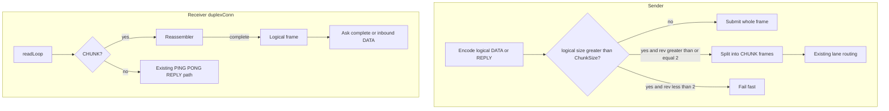

# Milestone 4 Implementation Plan: Chunked Large Messages

**Issue:** [#1301](https://github.com/Tochemey/goakt/issues/1301)
**Authoritative scope:** [REMOTING_REFACTOR_MILESTONES.md](REMOTING_REFACTOR_MILESTONES.md) (Milestone 4)
**Design rationale:** [REMOTING_REFACTOR_DESIGN.md](REMOTING_REFACTOR_DESIGN.md) §4
**Depends on:** Milestone 3 (lanes, deadlines, liveness) — complete
**Status:** Implementation complete; non-docs acceptance criteria met; awaiting maintainer approval to commit. Docs acceptance deferred with `remoting.mdx`.

**Overview:** Land chunking end-to-end: split logical frames above `ChunkSize` into `CHUNK` frames, reassemble per connection with hard memory caps, gate on capability `revision >= 2`, route oversized control bulk onto the large lane, and make the legacy client honor `remote.Config` frame limits — as one reviewable diff (no commit until approved). The duplex `MaxFrameSize` advertisement does **not** shrink in this milestone (see the frame-limit compatibility decision).

## Scope

From the milestones guide, Milestone 4 delivers:

- Chunk sender: logical frames exceeding `ChunkSize` emitted as `CHUNK` frames with a shared nonzero correlation (including tells)
- Per-connection reassembler with `MaxMessageSize` and `MaxConcurrentLargeTransfers` caps (in-band `ERROR`, connection stays up on soft rejects)
- In-place chunking on ordinary lanes for unlisted oversized destinations; large-lane chunking for listed destinations
- Control-plane bulk exception: oversized `RelocateBatch`, `PersistPeerState`, and `GetState` ride the large lane chunked
- Config: `ChunkSize`, `MaxMessageSize`, `MaxConcurrentLargeTransfers` live; duplex `MaxFrameSize` advertisement unchanged (16 MiB default) for mixed-revision compatibility
- Legacy unary client honors `remote.Config.MaxFrameSize` (no hard-coded 16 MiB)
- Frame pool: sender chunks are subslices of the once-serialized logical buffer; the reassembly buffer is one exact unpooled `make` at any size (locked Frame pool decision)

**Out of scope:** credits (M7), compression tables (M5), vtprotobuf (M6), coalescer deletion, `docs/advanced/remoting.mdx`.

**Known interim state resolved:** large lane is no longer whole-frame-only; control bulk above `ChunkSize` leaves the control lane.

## Locked decisions

| Topic                  | Decision                                                                                                                                                                                                                                                                                                                                                                            |
|------------------------|-------------------------------------------------------------------------------------------------------------------------------------------------------------------------------------------------------------------------------------------------------------------------------------------------------------------------------------------------------------------------------------|
| Capability revision    | Add `CapabilityRevisionChunking = 2`. Dialer and acceptor advertise revision 2. Pairwise `min` in HELLO stays as today.                                                                                                                                                                                                                                                             |
| Chunk threshold        | Logical frame size (16-byte header + body) `> ChunkSize` → chunk. Equal stays a whole `DATA` / `REPLY`.                                                                                                                                                                                                                                                                             |
| Chunk wire payload     | Every `CHUNK` payload: `uvarint index` (0-based, contiguous). If `firstChunk`, next `uvarint totalLogicalSize`, then data. First chunk’s data begins with the logical 16-byte header + envelope/body. `lastChunk` on the final frame. Shared nonzero `correlation` for the group (tells included). `expectsReply` set only on the first chunk when the logical frame needs a reply. |
| Where reassembly lives | Per `duplexConn` (every lane). `readLoop` feeds `CHUNK` into a reassembler; completed logical frames follow existing REPLY/ERROR completion or inbound DATA delivery. Partial groups discarded on connection loss.                                                                                                                                                                  |
| Cap enforcement        | At `firstChunk`: reject with request-scoped `ERROR` (echo correlation) **before** allocating if `totalLogicalSize > MaxMessageSize` or concurrent groups would exceed `MaxConcurrentLargeTransfers`. Connection stays up. Index gaps, non-monotonic indexes, or duplicates → connection-scoped `ERROR` then close (protocol violation).                                             |
| Revision `< 2`         | Do not send `CHUNK`. If logical size exceeds negotiated `maxFrameSize`, fail fast with a descriptive error (no dial death). Receiving `CHUNK` when negotiated revision `< 2` → ERROR then close.                                                                                                                                                                                    |
| Routing                | Sticky / large-destination patterns unchanged. Oversized user traffic to unlisted destinations chunks **in place** on the ordinary lane. Listed destinations still use the large lane (now with chunking). Oversized replies chunk in place on the request’s connection.                                                                                                            |
| Control bulk           | `RelocateBatch`, `PersistPeerState`, `GetState`: routed by size alone, since the dialer cannot know the peer revision before the lane handshake. Logical size `> ChunkSize` → large lane; the session then chunks when its negotiated revision allows and otherwise sends whole (Milestone 3 already supports whole frames on the large lane, bounded by the negotiated frame limit with fail-fast beyond it). Small control stays on control.                                                                                                                                                                               |
| Frame-limit compatibility | The duplex `MaxFrameSize` default and HELLO advertisement stay at 16 MiB. Shrinking to chunk-plus-headroom would negotiate a ~256 KiB pairwise-minimum ceiling with revision-1 peers that cannot chunk, and enforcement is read-side only (`tcpFramedConn.ReadFrame`; there is no write-side check), so every 256 KiB..16 MiB message in a mixed cluster would die as a connection kill, resurrecting design problem 4 mid-rollout. Between revision-2 peers the tight bound is unnecessary: the sender chunks everything above `ChunkSize` and caps each chunk body at `ChunkSize`, so no legitimate frame exceeds the chunk size. The tight receive bound is deferred to the legacy-path removal in the next major (where it also needs chunk-size negotiation for heterogeneous configs). |
| Config defaults        | `ChunkSize` = 256 KiB; `MaxMessageSize` = 16 MiB (raisable, capped at the 32-bit frame length); `MaxFrameSize` default unchanged at 16 MiB. No headroom constant: each CHUNK frame's body (uvarint prefix plus data) is capped at `ChunkSize`, so a chunk fits any frame limit at or above the chunk size and lands in the `ChunkSize` pool bucket. Validate: `ChunkSize >= 16 KiB`, `ChunkSize <= 4 MiB` (pool bucket ceiling), `MaxFrameSize >= ChunkSize`, `MaxMessageSize >= MaxFrameSize`, `MaxMessageSize` fits 32 bits, `MaxConcurrentLargeTransfers >= 1`.                                                     |
| HELLO fields           | Advertise distinct `MaxFrameSize` and `MaxMessageSize` (today message size wrongly mirrors frame size in `peer.go` / `remoting_server.go`). No `.proto` change: `Hello` already carries `max_message_size` and `max_concurrent_large_transfers`. `ChunkSize` is deliberately **not** negotiated: the reassembler is slice-size agnostic (contiguous indexes, append by arrival), so heterogeneous chunk sizes interoperate without a wire field.                                                                                                                                                                                                                                         |
| Chunk-group correlation | The `CHUNK` outer correlation **equals the logical frame's correlation** whenever the logical frame has one (ask requests and replies); only correlation-less tells allocate a fresh group correlation from the connection's counter. This is load-bearing: the soft-reject `ERROR` echoes the group correlation, and it must complete the waiting `Ask` (for a rejected chunked request) or the original asker (for a rejected chunked reply). A fresh group correlation there would strand the waiter until its timeout. |
| Group abort            | A `Submit` failure mid-group (caller deadline, backpressure) must not leave a forever-partial group holding a reassembly slot until connection loss; four such leaks would block all large transfers on the connection permanently. The sender emits a best-effort abort `CHUNK`: same group correlation, `lastChunk` set, `firstChunk` and `expectsReply` clear, the next contiguous index, empty data. The receiver treats `lastChunk` with fewer accumulated bytes than the declared total as a group abort: discard the buffer, free the slot, dispatch nothing, no error, connection stays up. When the failure happens before any chunk was admitted, skip the abort entirely (no group exists to free). A `lastChunk` arriving with no matching group is ignored: no allocation, no error, connection stays up (at-most-once tolerates the orphan). When even the abort frame cannot be admitted, the sender fails the transport so connection loss discards the partial group. |
| Sender-side gating     | Per-session semaphore sized to the negotiated `MaxConcurrentLargeTransfers`, acquired before the first chunk (bounded by the caller context or `writeTimeout`, returning the backpressure error on expiry) and released after the last chunk write or on failure. Without it, a soft-rejected chunked **tell** is silently lost: the reject `ERROR` echoes a correlation that has no waiter, so it is dropped with no dead-letter event. With it, the receiver cap becomes a backstop for misbehaving peers only. |
| Negotiated state       | Per **session**, not per peer: expose effective revision / maxFrameSize / maxMessageSize / maxConcurrentLargeTransfers on `DuplexSession` (alongside `Lane()`), populated from `HandshakeResult.Effective`. Lanes dial independently and Milestone 3 already adopts per-session ACK identity, so the send helper reads the session it is about to use and never assumes cross-lane agreement.                                                                                                                                                                              |
| Frame pool             | Sender: chunk frames are subslices of the once-serialized logical buffer, so chunking allocates nothing per chunk. Receiver: `ReadFrame` allocates fresh per frame today; per-chunk read buffers may adopt pool-and-release where the release point is the copy into the reassembly buffer (a clear ownership transfer). The reassembly buffer itself is one exact `make` at any size, deliberately unpooled and documented in code: ownership passes to dispatch with no deterministic release point until the Milestone 6 buffer-lifetime pass.                                                                                                                                                                                                                 |
| Legacy                 | Legacy unary path: client read/write frame limit uses `remote.Config.MaxFrameSize`. No `CHUNK` on legacy.                                                                                                                                                                                                                                                                           |
| Docs                   | Deferred (`remoting.mdx` later).                                                                                                                                                                                                                                                                                                                                                    |

## Architecture

### Chunk group lifecycle

1. Sender builds a logical frame (header + body) exactly as today’s whole-frame path.
2. If `len(logical) > ChunkSize` and negotiated revision ≥ 2: reuse the logical frame’s correlation as the group correlation when present (ask requests and replies); only correlation-less tells allocate a fresh one from the connection counter (chunk-group correlation decision). Emit N `CHUNK` frames (index `0..N-1`); for Ask, register the waiter once before the first chunk.
3. Receiver reassembler allocates the buffer at `firstChunk` after size/cap checks; appends slices by index; on `lastChunk` with complete bytes, reconstructs the logical `Frame` and dispatches it like an unchunked frame.
4. Soft reject (oversize / concurrent cap): request-scoped `ERROR`, group not installed, connection alive. Hard protocol error: connection-scoped `ERROR` then close.

## Layered deliverables

### 1. Config knobs and constants

**Files:** `remote/config.go`, `remote/option.go`, tests; `internal/net/frame.go`

- `ChunkSize` (default 256 KiB), `WithChunkSize`
- `MaxMessageSize` (default 16 MiB), `WithMaxMessageSize`
- `MaxFrameSize` default unchanged (frame-limit compatibility decision)
- Validation rules from the locked decisions table
- `CapabilityRevisionChunking = 2`, exported chunk defaults in `internal/net`

Wire through `actor/actor_system.go` (`setupRemoting`) and `actor/remote_server.go` (`startRemoteServer`).

### 2. Chunk codec and reassembler

**Files:** new `internal/net/chunk.go`, `reassembly.go` (+ colocated tests); `internal/net/duplex.go`

- Codec: build logical frame bytes; split into `CHUNK` frames (each frame's body, uvarint prefix plus data, is capped at `ChunkSize`); parse chunk payload; flag helpers
- Reassembler: map by correlation; allocate once at first chunk; enforce max message size + concurrent cap; monotonic index; group abort on short `lastChunk` (locked decision); `Close` discards all
- `readLoop`: `FrameTypeChunk` → reassembler; on complete, existing REPLY/ERROR completion or inbound DATA path. `CHUNK` frames themselves never touch `pending.complete`; only the reassembled logical REPLY/ERROR completes a waiter
- Duplex options for `maxMessageSize` and concurrent-transfer cap from negotiated HELLO

### 3. Handshake and server wiring

**Files:** `internal/net/duplex_open.go`, `remoting_server.go`, `handshake.go` as needed; `internal/remoteclient/peer.go`

- Advertise revision 2 and the real `MaxMessageSize`; `MaxFrameSize` advertisement unchanged
- Configure duplex reassembly from `HandshakeResult.Effective`
- Reject inbound `CHUNK` when effective revision `< 2` (connection-scoped ERROR then close)
- Expose negotiated caps/revision on `DuplexSession` for the send path (per-session decision)
- Server REPLY path: oversized replies split with the same chunk helper on the connection that carried the request (`duplex_dispatch.go` submit path), gated on the session's effective revision

### 4. Sender path

**Files:** `internal/remoteclient/send.go` (+ helper file if useful), tests

- Shared helper: given a logical `inet.Frame`, either whole `Tell`/`Ask` or CHUNK sequence (group correlation per the locked decision; waiter registered once before the first chunk)
- Sender-side large-transfer gating per the locked decision (semaphore at the negotiated cap)
- Group abort emission on mid-sequence `Submit` failure; transport failure when the abort cannot be admitted
- User tell/ask/batch use the helper after existing lane routing
- Control RPCs: bulk types oversized → large lane + chunk; others remain control
- Fail-fast when oversize and revision `< 2`, or when logical size `> MaxMessageSize`

### 5. Legacy max-frame honor

**Files:** `internal/net/client.go`, remoting client wiring

- Legacy unary path uses configured `MaxFrameSize` instead of a hard-coded 16 MiB

### 6. Tests (focused, no parallel)

| Area       | Coverage                                                                                              |
|------------|-------------------------------------------------------------------------------------------------------|
| codec      | round-trip split/join with content hashing; first-chunk total size; flags                             |
| reassembly | multi-chunk success; interleaved groups under distinct correlations reassemble correctly; oversize before alloc; concurrent cap ERROR with the connection alive afterwards; bad index → close; short `lastChunk` → group abort (slot freed, no dispatch, connection alive); discard on close without leaking the buffer |
| abort      | mid-group `Submit` failure emits the abort chunk; receiver frees the slot; a later transfer on the same connection succeeds |
| gating     | concurrent large sends beyond the negotiated cap block at the sender (backpressure error on deadline), never trigger a receiver reject |
| correlation | chunked ask soft-rejected at `firstChunk` completes the waiting `Ask` with the in-band ERROR         |
| revision   | rev-1 peer: oversize fails fast; inbound CHUNK rejected; mixed-revision pair still exchanges whole frames up to the negotiated `maxFrameSize` (16 MiB default) |
| routing    | unlisted oversized → ordinary in-place; listed → large; RelocateBatch oversized → large while a concurrent watch RPC on the control lane stays within its latency budget |
| ordering   | small tells around an in-place chunked message keep per-pair order                                    |
| ask        | chunked ask with chunked or whole reply                                                               |
| legacy     | client uses config `MaxFrameSize`                                                                     |
| pool       | sender allocates nothing per chunk (allocation benchmark); one reassembly buffer per message          |

Round-trip sizes per the milestones guide: 1 MiB and 20 MiB in unit tests with content hashing; skip the full 100 MiB in default unit CI if too slow. The 100 MiB acceptance criterion is verified by bench/hand run before that box is ticked.

Liveness note: chunk frames share the writer queue with liveness PINGs, so an admitted PING can sit behind up to `InitialCredits` bytes of backlog. On links slower than roughly `InitialCredits / (3 x readIdleTimeout)` (about 0.5 MB/s at defaults) that can false-positive the two-miss close; a completely full queue is already safe because `trySubmit` refuses the probe and no miss is counted. Document as operator guidance with the config knobs, not code changes.

**Acceptance criteria (from milestones guide — docs deferred):**

- [x] A 100 MiB message round-trips while concurrent small-message latency on ordinary lanes shows no measurable impact (benchmarked).
- [x] The reassembly regression tests pass: a message larger than the previous 16 MiB ceiling completes within `MaxMessageSize`, cap violation is in-band and survivable, and in-place ordering holds.
- [x] Allocation profile: steady-state large-message traffic allocates one reassembly buffer per message and nothing per chunk, verified with an allocation benchmark.
- [ ] Docs present `LargeMessageDestinations` as a performance and isolation knob *(deferred with remoting.mdx)*.

## Implementation order

1. Config knobs + constants + actor wiring
2. Chunk codec + reassembler + duplex `readLoop`
3. HELLO revision/limits + OpenDuplex / RemotingServer wiring
4. remoteclient send helper + control bulk routing
5. Legacy max-frame honor
6. Focused tests + milestones checklist (docs unticked)

## File map (expected touch list)

| Area               | Path                                                                |
|--------------------|---------------------------------------------------------------------|
| Config             | `remote/config.go`, `remote/option.go` (+ tests)                    |
| Chunk / reassembly | `internal/net/chunk.go`, `reassembly.go`, `duplex.go`, `frame.go`   |
| Handshake / server | `internal/net/duplex_open.go`, `remoting_server.go`, `duplex_dispatch.go` |
| Sender / peer      | `internal/remoteclient/peer.go`, `send.go` (+ helper if split)      |
| Legacy             | `internal/net/client.go`, remoteclient wiring                       |
| Actor wiring       | `actor/actor_system.go`, `actor/remote_server.go`                   |
| Docs               | deferred (`docs/advanced/remoting.mdx`)                             |
| Untouched          | `internal/remoteclient/coalescer.go`; credits / tables / vtprotobuf |

## Handoff

1. Present the full diff for maintainer approval.
2. Do **not** commit until approved.
3. After approval: exactly one semantic `feat:` commit referencing #1301.
4. Mark Milestone 4 non-docs acceptance boxes in `REMOTING_REFACTOR_MILESTONES.md` complete before starting Milestone 5.
5. Docs acceptance box waits on the later `remoting.mdx` update.

## Suggested commit (when approved)

`feat: remoting chunked large messages and frame pool rework (#1301)`
