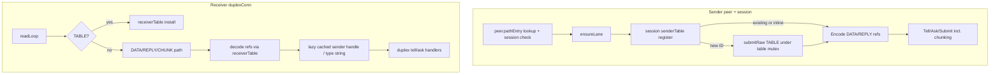

# Milestone 5 Implementation Plan: Compression Tables and Receive-Path Caches

**Issue:** [#1301](https://github.com/Tochemey/goakt/issues/1301)
**Authoritative scope:** [REMOTING_REFACTOR_MILESTONES.md](REMOTING_REFACTOR_MILESTONES.md) (Milestone 5)
**Design rationale:** [REMOTING_REFACTOR_DESIGN.md](REMOTING_REFACTOR_DESIGN.md) §5
**Depends on:** Milestone 4 (chunking, revision 2), complete
**Status:** Implementation complete; acceptance criteria met in tests; awaiting maintainer approval to commit. Benchstat comment on #1301 at commit handoff.

**Overview:** Land per-connection compression tables end-to-end: senders assign monotonic IDs for actor paths and type names, emit `TABLE` frames before first use, encode steady-state DATA/REPLY refs as varint IDs, and resolve those IDs on the receive path into cached strings and sender `*PID` handles. Capability `revision >= 3` gates the feature. The DATA/REPLY envelope **layout does not change** (fixed in Milestone 2); only the ref encoding mode switches from always-inline to table-or-inline.

## Scope

From the milestones guide, Milestone 5 delivers:

- Sender tables per duplex connection, per kind (actor path / type name): IDs from 1, capacity 8192, `TABLE` before first referencing frame, overflow → inline literal (no error)
- Receiver tables per duplex connection, capped at the same 8192 per kind as an enforced protocol bound: ID → literal; sender-position path hits lazily resolve and cache a sender `*PID` through an actor-layer hook; type ID → string used without the global registry lookup
- Peer sticky route cache upgraded so steady-state send is one lookup for route + path table ID, validated against the owning session (see locked decision)
- Revision bump to 3 on dialer and acceptor; pairwise `min` unchanged
- Revision gating: no `TABLE` / no table refs below 3; inbound `TABLE` or nonzero ref below 3 → connection-scoped `ERROR` then close

**Out of scope:** credits (M7), zero-copy DATA/REPLY pooling and allocation audit (M6; vtprotobuf deferred), coalescer deletion, shrinking `MaxFrameSize`, `docs/advanced/remoting.mdx`, any `.proto` change (TABLE payload is hand-parsed bytes; `Hello.revision` already documents value 3).

**Known interim state resolved:** `ErrTableRefUnsupported` and “unsupported frame type” for `TABLE` become the revision-3 success path; `peer.routes` migrates from lane-only sticky cache to route + table-ID cache.

## Current codebase anchors

| Area                      | Today                                                                                                                                                                | M5 change                                                                                          |
|---------------------------|-----------------------------------------------------------------------------------------------------------------------------------------------------------------------|-----------------------------------------------------------------------------------------------------|
| Envelope refs             | Always `putInlineRef` (`0` + length + bytes); `readRef` rejects nonzero IDs with `ErrTableRefUnsupported`                                                            | Encode table ID when registered; resolve ID via receiver table when `revision >= 3`                |
| `FrameTypeTable` (`0x08`) | Valid type; falls through `readLoop` to inbound; server treats non-DATA as unsupported                                                                               | Handled in `readLoop` like `CHUNK`                                                                 |
| Capability revision       | Advertise `CapabilityRevisionChunking = 2` in `peer.dialLane` and `RemotingServer.handleDuplexConn`                                                                  | Advertise `CapabilityRevisionTables = 3`                                                           |
| Sender PID                | `actorSystem.newRemoteSenderPID` caches parsed `*address.Address` (cap 8192) but allocates a fresh `*PID` per message                                                | Table-hit path returns a connection-cached `*PID` (zero per-message PID materialization)           |
| Route cache               | `peer.routes map[string]laneKey`, `routeCacheLimit = 8192`; reset only by `closeAllLanes`. `retireLane` leaves entries in place, which is safe today because an entry holds only a stable lane slot | Entry gains path table ID plus the owning session; stale IDs self-invalidate by session identity   |
| File pattern              | M4: `chunk.go` / `reassembly.go` / `duplex_chunk.go`                                                                                                                 | Mirror: `table.go` / receiver state in table or `duplex_table.go` / colocated `*_test.go`          |

## Locked decisions

| Topic                             | Decision                                                                                                                                                                                                                                                                                                                                                                                                                                                                                                                                                                                                                                    |
|-----------------------------------|-----------------------------------------------------------------------------------------------------------------------------------------------------------------------------------------------------------------------------------------------------------------------------------------------------------------------------------------------------------------------------------------------------------------------------------------------------------------------------------------------------------------------------------------------------------------------------------------------------------------------------------------------|
| Capability revision               | Add `CapabilityRevisionTables = 3`. Dialer and acceptor advertise revision 3. Pairwise `min` in HELLO unchanged. Cumulative: revision 3 implies chunking (2) and baseline (1).                                                                                                                                                                                                                                                                                                                                                                                                                                                              |
| TABLE wire payload                | Hand-parsed, no protobuf: `kind (1B) \| uvarint id \| uvarint literalLen \| literal bytes`. `kind`: `0` = actor path, `1` = type name. Correlation `0`. Lane = connection lane. Never chunked (`submitRaw` only).                                                                                                                                                                                                                                                                                                                                                                                                                           |
| Table ownership                   | **Per `duplexConn` (every lane), both directions.** Each session owns an outbound sender table (literal → id) and an inbound receiver table (id → entry). Tables die with the connection; reconnect re-registers lazily.                                                                                                                                                                                                                                                                                                                                                                                                                    |
| ID assignment                     | Monotonic `uint64` starting at **1** per kind per sender table. ID `0` is reserved for the inline-ref sentinel on the DATA/REPLY wire and is never assigned.                                                                                                                                                                                                                                                                                                                                                                                                                                                                                |
| Capacity                          | `DefaultTableCapacity = 8192` entries **per kind per connection** (`internal/net` constant, not a `remote.Config` knob), enforced on **both sides**. Sender at capacity: new literals stay inline forever on that connection (no eviction, no error). Receiver: an inbound `TABLE` that would exceed the bound is a protocol violation (`ERROR` then close); a conforming sender never exceeds it, and the bound caps per-connection memory against a buggy or malicious peer.                                                                                                                                                                |
| Registration ordering             | The sender-table mutex covers lookup-or-assign **and**, for a fresh assignment, a TABLE admit via `admitFrame` (not reader-safe `trySubmit`), so no frame referencing the new ID can enter the single-writer queue ahead of its TABLE: a concurrent loser blocks on the table mutex only for the duration of that admit, then observes the existing ID and emits nothing. The admit may wait briefly on the connection mutex (lock order: sender-table mutex → connection mutex) but never waits on byte capacity or a full writer queue — deliberately avoiding `trySubmit`, whose TryLock fails spuriously under mutex contention and would surface as false backpressure; when the queue cannot accept the TABLE immediately, the mapping is rolled back (literal unmapped; `nextID` stays monotonic, so a retry assigns a fresh ID) and the send fails with the backpressure or closed error. The DATA/REPLY itself is encoded and submitted after the mutex is released, on the same goroutine, so the writer queue preserves TABLE-before-use without ACK rounds. Steady state (ID already assigned) is a mutex-guarded map hit only. Empty literals are never registered: `register` returns inline for them and the receive side hard-rejects them. |
| Overflow                          | At capacity, skip assignment and encode an inline ref. No `ERROR`, no connection impact.                                                                                                                                                                                                                                                                                                                                                                                                                                                                                                                                                    |
| Revision `< 3`                    | Do not emit `TABLE`. Do not encode nonzero refs. Receiving `TABLE` or a nonzero ref → connection-scoped `ERROR` then close (`rejectProtocol` / existing table-ref close path), same class as CHUNK below revision 2. Traffic continues with inline literals when both peers are revision ≥ 2 but the pairwise min is `< 3`.                                                                                                                                                                                                                                                                                                                 |
| Duplicate / unknown inbound TABLE | Unknown kind → ERROR+close. Install beyond `DefaultTableCapacity` → ERROR+close. ID already mapped to a **different** literal → ERROR+close. ID already mapped to the **same** literal → ignore (idempotent). Nonzero DATA/REPLY ref with no mapping → ERROR+close.                                                                                                                                                                                                                                                                                                                                                                          |
| Envelope API                      | Keep `DataEnvelope` / `ReplyEnvelope` string fields as the resolved view for handlers. Add an encode path that accepts optional pre-resolved table IDs (or a small `envelopeRef` helper used only by the duplex send helper) so the hot path does not re-string-intern. Decode resolves table IDs to strings **and** attaches the connection-scoped opaque sender handle for the actor layer (see receive caches). No wire layout change.                                                                                                                                                                                                     |
| Peer route + path ID cache        | Upgrade `peer.routes` to `pathEntry{lane laneKey; pathID uint64; session inet.DuplexSession}` (pathID `0` = not yet registered / inline). A cached pathID is valid **only for the session that assigned it**: after `ensureLane` returns a session, the entry's ID is used only when `pathEntry.session` is that same session; on mismatch the send re-registers on the new session's sender table (idempotent lookup-or-assign) and rewrites the entry. Single-lane reconnects are therefore self-healing with no sweep: `retireLane` stays untouched (it never cleared routes) and `closeAllLanes` keeps resetting the whole map as today. On a route-cache miss (receivers beyond 8192): the lane is computed per send and the **receiver** path ref is encoded inline with no session-table lookup for it; the sender path and type name still resolve through the session tables, which remain authoritative for the wire. |
| Type-name tables                  | Per session only (not on `peer`). Control RPCs and user messages both register `TypeName` when non-empty and revision ≥ 3. Custom serializer ID `255` keeps empty typeRef (no table entry).                                                                                                                                                                                                                                                                                                                                                                                                                                                 |
| REPLY path                        | Server replies register `ReplyEnvelope.TypeName` on the **request connection's** sender table the same way (TABLE then REPLY/CHUNK group).                                                                                                                                                                                                                                                                                                                                                                                                                                                                                                  |
| Chunk interaction                 | For chunked logical frames: emit any needed `TABLE` frames **before** `submitLogical` / first `CHUNK`. Refs live inside the logical envelope bytes; reassembly does not see TABLE.                                                                                                                                                                                                                                                                                                                                                                                                                                                          |
| Receive caches                    | `internal/net` cannot import `actor`, so receiver table entries never hold a typed `*PID`. Each path entry stores the literal plus an opaque `handle any` slot, empty at install. The remoting server installs a resolver hook (`WithRemotingServerSenderResolver(func(path string) any)`) supplied by the actor layer; a nil resolver (client side, unit tests) leaves handles empty and decode falls back to inline behavior. On a DATA decode whose **sender** ref is a table hit: resolve once through the hook, cache the handle in the entry for the connection lifetime, and attach it to the decode result (`DataEnvelope` gains an opaque `SenderHandle any` field; `DuplexTellHandler` signature unchanged). `duplexRemoteTell` type-asserts `*PID` and falls back to `newRemoteSenderPID` when absent. Materialization is lazy: entries that only ever appear in receiver position never resolve a PID. Receiver path table-hit: resolve the local actor via the cached literal without re-parsing the address string when possible. Type table-hit: use the cached type name string and skip the global registry string→type cold path where the dispatch layer already keys by name (inline literals keep today's registry behavior). |
| Legacy sender-address cache       | `actorSystem.remoteSenderAddresses` and `newRemoteSenderPID` remain for the **legacy unary** path and for duplex **inline** sender refs. Table-hit duplex path does not depend on it.                                                                                                                                                                                                                                                                                                                                                                                                                                                       |
| Config / HELLO                    | No new `remote.Config` knobs. No HELLO field additions. Only the advertised `revision` changes (2 → 3).                                                                                                                                                                                                                                                                                                                                                                                                                                                                                                                                     |
| Docs                              | Deferred (`remoting.mdx` later).                                                                                                                                                                                                                                                                                                                                                                                                                                                                                                                                                                                                            |

## Architecture

### Registration lifecycle (one new actor path)

1. `peer.route` / pathEntry miss → compute lane, store entry with `pathID=0`.
2. `ensureLane` returns session with `revision >= 3`.
3. Session sender table assigns ID `N`, emits `TABLE{kind=path, id=N, literal}` under the table mutex.
4. `pathEntry` records `pathID = N` and the owning session.
5. DATA envelope encodes sender/receiver path refs as uvarint `N` (no inline bytes).
6. Peer installs ID `N` → literal before the DATA frame is read (TCP order); the sender `*PID` is resolved and cached on the first DATA whose sender ref hits the entry.
7. Later sends to the same receiver: pathEntry hit with matching session → reuse `N` → no TABLE.
8. Lane dies and re-dials: `pathEntry.session` no longer matches the session `ensureLane` returns, so the next send re-registers on the new session and rewrites the entry; no stale ID ever reaches the wire.

## Layered deliverables

### 1. Constants and revision advertising

**Files:** `internal/net/frame.go`; `internal/remoteclient/peer.go`; `internal/net/remoting_server.go`; tests

- `CapabilityRevisionTables = 3`
- `DefaultTableCapacity = 8192`
- `TableKindActorPath byte = 0`, `TableKindTypeName byte = 1`
- HELLO local revision: `CapabilityRevisionTables` in `dialLane` and `handleDuplexConn`
- `withDuplexNegotiated`: when `revision >= CapabilityRevisionTables`, allocate empty sender/receiver tables on the conn (in addition to existing chunking setup for `>= 2`)

### 2. TABLE codec and table state

**Files:** new `internal/net/table.go` (+ `table_test.go`)

- `encodeTablePayload(kind, id, literal) []byte` / `parseTablePayload([]byte) (kind, id, literal, err)`
- `senderTable`: mutex, `nextID`, `byLiteral map[string]uint64`, kind-specific or two instances
- `senderTable.register(literal string, emit func(id uint64) error) (uint64, error)`: lookup-or-assign under the mutex; for a fresh assignment the `emit` callback runs while the mutex is still held and must not wait on capacity or a full writer queue (it may briefly wait on the connection mutex; lock order is table mutex then connection mutex); a callback error rolls the mapping back (`nextID` stays monotonic) and is returned. At capacity or for an empty literal: `0, nil` meaning “use inline”
- `receiverTable`: mutex, `byID map[uint64]*tableEntry`; an entry holds the literal and an opaque `handle any` slot filled lazily by the duplex layer (`internal/net` cannot import `actor`, so no typed `*PID` lives here); `install` enforces `DefaultTableCapacity` and the duplicate rules
- No direct I/O in `table.go`; the `emit` callback supplied by the caller owns the frame write

### 3. Duplex integration

**Files:** new `internal/net/duplex_table.go` (+ tests); `internal/net/duplex.go` (`readLoop`); envelope encode/decode

- `readLoop`: `FrameTypeTable` → `handleInboundTable` (revision gate, parse, install); never deliver TABLE on `inbound`
- `handleInboundTable`: revision `< 3` → `rejectProtocol`; parse errors, unknown kind, capacity overflow, and conflicting duplicates → `rejectProtocol`; same-literal duplicates ignored
- Send helper on `duplexConn` (used by remoteclient and server reply path): `PrepareRef(kind, literal) (id uint64, err error)` built on `senderTable.register` with an `admitFrame` emit callback, so the TABLE enqueue happens under the table mutex without waiting on capacity or a full writer queue (see locked decision)
- Envelope: extend encode to write a table ref (`putTableRef`) when `id != 0`; extend decode to accept nonzero IDs when a `receiverTable` is supplied. Prefer keeping exported `EncodeDataEnvelope` / `DecodeDataEnvelope` inline-only and adding `encodeDataEnvelopeWithTables` / `decodeDataEnvelopeWithTables` used by the duplex path, so existing call sites do not break
- `DataEnvelope` gains an opaque `SenderHandle any` field populated on sender-ref table hits; `DuplexTellHandler` signature is unchanged. New server option `WithRemotingServerSenderResolver(func(path string) any)` installs the actor-layer resolver; nil resolver leaves handles empty

### 4. remoteclient send path

**Files:** `internal/remoteclient/peer.go`, `send.go`, `routing.go` as needed; tests

- Replace `routes map[string]laneKey` with `pathEntry{lane laneKey; pathID uint64; session inet.DuplexSession}` cache (same cap 8192)
- After `ensureLane`, before encode: register the sender path and type name on the session when revision ≥ 3; register the receiver path only through its route-cache entry (a cache miss beyond 8192 encodes the receiver ref inline); encode with IDs
- Stale-ID safety: use `pathEntry.pathID` only when `pathEntry.session` is the session `ensureLane` just returned; on mismatch re-register on the new session's table (idempotent) and rewrite the entry. `retireLane` stays untouched (it never cleared routes); `closeAllLanes` keeps resetting the map as today
- Control RPCs: empty paths (no path TABLE); still register non-empty control `TypeName`
- Revision `< 3` sessions: skip registration; current inline encode unchanged

### 5. Actor receive path (cached PID)

**Files:** `actor/remote_server.go`, `internal/net/remoting_server.go`, `duplex_dispatch.go` as needed; tests

- Install the sender resolver on the remoting server: a closure over the actor system returning `newRemoteSenderPID(literal)` as `any`
- Duplex tell path: type-assert `env.SenderHandle.(*PID)` and use it; else fall back to `newRemoteSenderPID(env.Sender)` (inline / legacy behavior)
- Assert in an allocation test that the table-hit path does not allocate a new PID per message (benchmark / `testing.AllocsPerRun`)
- Do not remove or shrink `remoteSenderAddresses`; legacy and inline duplex keep using it

### 6. Tests (focused, no parallel)

| Area              | Coverage                                                                                                                                                                                                                                                             |
|-------------------|------------------------------------------------------------------------------------------------------------------------------------------------------------------------------------------------------------------------------------------------------------------------|
| codec             | TABLE round-trip; reject truncated / unknown kind / zero id / empty literal (hard rules; control uses no path refs)                                                                                                                                                  |
| sender table      | assign, idempotent re-lookup, overflow → id 0, emit-callback failure rolls the mapping back and surfaces the error, concurrent first-use single TABLE                                                                                                                |
| receiver table    | install, duplicate same literal OK, duplicate different literal hard error, install beyond capacity hard error, unknown ID on DATA hard error                                                                                                                        |
| ordering          | TABLE admitted before DATA on the wire (net.Pipe capture); concurrent first-use of one literal across goroutines: exactly one TABLE on the wire and it precedes every referencing frame; chunked send emits TABLE before first CHUNK                                  |
| revision          | rev-2 peer: no TABLE frames; inbound TABLE closes; nonzero ref closes; inline traffic still works                                                                                                                                                                    |
| correlation / ask | chunked or whole ask with table-compressed type/path refs still completes                                                                                                                                                                                            |
| route cache       | pathEntry returns lane + id; single-lane retire and re-dial: session mismatch re-registers on the new session with no protocol close; full reconnect (`closeAllLanes`) clears entries and re-emits TABLE                                                              |
| PID cache         | TABLE install alone materializes no PID (receiver-position entries stay handle-free); first sender-position hit resolves once; table-hit duplex tell reuses same `*PID` pointer (or same underlying address pointer with zero PID allocs; pick one assertion and stick to it); sender restart / new connection gets a new registration (address equality, not pointer identity across connections) |
| wire bytes        | steady-state small tell envelope size below a recorded budget (literal threshold in the test)                                                                                                                                                                        |
| alloc             | `AllocsPerRun` on table-hit sender-PID path meets acceptance (zero per-message PID materialization)                                                                                                                                                                  |
| server REPLY      | type name registered on reply connection                                                                                                                                                                                                                             |

Round-trip sizes: small payload only for wire-budget and alloc tests; no 100 MiB requirement in M5.

## Acceptance criteria (from milestones guide)

- [x] Steady-state small-message envelope overhead drops from full strings to table refs, asserted numerically in tests (`TestPrepareRefEmitsTableBeforeData`); benchstat throughput gain for small messages to be posted on #1301 at commit handoff.
- [x] Zero per-message allocations for sender-PID materialization on the table-hit path, verified with an allocation benchmark (`TestDecodeDataEnvelopeTableHitAllocs`).
- [x] Revision gating verified: no `TABLE` frames are sent to a revision-2 peer and traffic still flows with inline literals (`TestPrepareRefNoopBelowRevisionThree`, `TestRevisionTwoRejectsInboundTable`).

Record benchstat output as a comment on #1301 at handoff (milestones ground rule 6).

## Implementation order

1. Constants + HELLO revision bump (inert until tables exist; mixed clusters negotiate `min`)
2. `table.go` codec + sender/receiver table units
3. `duplex_table.go` + `readLoop` + envelope table-aware encode/decode
4. remoteclient pathEntry + send-path registration
5. Server reply registration + actor cached-PID wiring
6. Focused tests + acceptance benches + tick milestones boxes

## File map (expected touch list)

| Area                 | Path                                                                                               |
|----------------------|----------------------------------------------------------------------------------------------------|
| Constants / revision | `internal/net/frame.go`                                                                            |
| TABLE codec + tables | `internal/net/table.go`, `table_test.go` (new)                                                     |
| Duplex integration   | `internal/net/duplex_table.go`, `duplex_table_test.go` (new); `duplex.go`; `envelope.go` (+ tests) |
| Handshake / server   | `internal/net/remoting_server.go`; `duplex_dispatch.go` if reply encode touches tables             |
| Client / peer        | `internal/remoteclient/peer.go`, `send.go` (+ tests)                                               |
| Actor PID path       | `actor/remote_server.go` (+ tests)                                                                 |
| Docs                 | deferred                                                                                           |
| Untouched            | `coalescer.go`; credits; vtprotobuf; `.proto` / `make protogen`                                    |

## Risks and non-goals to keep explicit

- **Per-lane tables mean re-registration across lanes.** A receiver that moves from ordinary to large (should not happen; sticky route) would re-TABLE; accept the cost. Type names re-register per lane connection; capacity 8192 is ample.
- **`pathEntry` holds a session reference after its lane dies** until the next send to that receiver rewrites the entry. Bounded by the route cache cap and released by `closeAllLanes`; accepted.
- **TABLE admit under the table mutex does not wait on backpressure.** It uses `admitFrame` (may wait on the connection mutex; never on capacity or a full queue). A full writer queue at first registration fails that send instead of stalling other registrations on capacity waits; accepted, first use under hard backpressure is rare and the send would have hit the same backpressure immediately after.
- **Exported envelope helpers** stay inline-safe for unit tests and any external-ish callers inside the module.
- **Benchstat** needs a small before/after harness; delete investigative scaffolding before the milestone commit if it is not permanent (milestones ground rule 6). Keep only the acceptance alloc/wire-budget tests.

## Handoff

1. Present the full diff for maintainer approval.
2. Do **not** commit until approved.
3. After approval: exactly one semantic `feat:` commit referencing #1301.
4. Mark Milestone 5 acceptance boxes in `REMOTING_REFACTOR_MILESTONES.md` complete before starting Milestone 6.
5. Optionally sync the one-line “chunk-plus-headroom” wording still lingering in the main design §4 / milestones M4 prose with the M4 body-cap decision; not required for M5.

## Suggested commit (when approved)

`feat: remoting compression tables and cached sender PIDs (#1301)`
