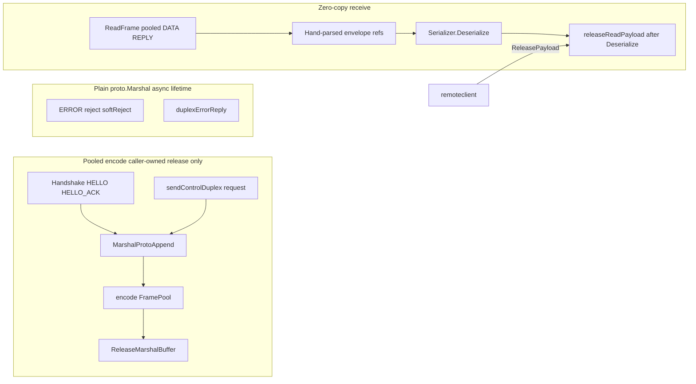

# Milestone 6 Implementation Plan: Zero-Copy Receive and Allocation Pass

**Issue:** [#1301](https://github.com/Tochemey/goakt/issues/1301)
**Authoritative scope:** [REMOTING_REFACTOR_MILESTONES.md](REMOTING_REFACTOR_MILESTONES.md) (Milestone 6)
**Design rationale:** [REMOTING_REFACTOR_DESIGN.md](REMOTING_REFACTOR_DESIGN.md) §7 (amended: vtprotobuf deferred) and the zero-copy / allocation goals
**Depends on:** Milestone 5 (compression tables, revision 3), complete
**Status:** Implementation complete; acceptance criteria met in tests (benchstat box open until #1301 comment at commit handoff); awaiting maintainer approval to commit.

**Overview:** Land zero-copy duplex DATA/REPLY payload handoff through the existing `FramePool`, tighten control-plane encode to `MarshalAppend` into pooled frame tails (stock `google.golang.org/protobuf`, no new generator), and run a benchstat-gated allocation audit of the steady-state tell/ask path. The DATA/REPLY envelope layout does not change (fixed in Milestone 2; table refs landed in Milestone 5). There is no capability revision bump and **no new `go.mod` dependency**.

**Decision (vtprotobuf):** Dropped from Milestone 6. `planetscale/vtprotobuf` last tagged release is `v0.6.0` (2024-01-29); main has seen occasional commits but no maintained release cadence, and adopting it would pin GoAkt to an unmaintained codegen + runtime helper. Design Decision 4 and the earlier M6 draft assumed vtprotobuf; that is reversed here. The zero-copy win in §7 (pooled frame → hand-parsed refs → payload subslice → Deserialize → put) does **not** require vtprotobuf and remains the load-bearing deliverable for the user hot path. Reflection-free `internalpb` codegen has a named successor: the first-party Go Protobuf Opaque API, adopted as Milestone 8 under its own `feat` issue (see design §7 and Decision 4); it is not required to hit the envelope/copy goals after Milestone 2 flattening.

## Scope

Milestone 6 delivers:

- Zero-copy receive handoff: pool DATA/REPLY frame bodies and return the buffer only after Deserialize / control decode completes; hand-parsed envelope already landed in Milestone 2
- `DuplexSession.ReleasePayload` so remoteclient can return REPLY/ERROR bodies it owns
- Control / handshake encode: replace bare `proto.Marshal` with `proto.MarshalOptions{UseCachedSize: true}.MarshalAppend` via an exported pooled helper at caller-owned release sites (handshake, control request encode); ERROR/reject frames and `duplexErrorReply` stay on plain marshal (async payload lifetime, see locked decision)
- Allocation audit of steady-state duplex tell and ask: target zero allocations beyond the payload buffer, the concrete message, and the envelope refs; fix stragglers (waiter pooling, metadata maps, context values, envelope buffer copies)
- Duplex tell admission (M2 semantics completion): fire-and-forget tells admit before a session exists and return nil; a per-lane pump dials, encodes with tables, and writes; transport failures fan out as dead letters through the shared tell-failure handler; a full admission queue blocks to the caller's deadline then reports backpressure. The coalescer stays legacy-only.
- Benchstat + steady-state tell allocation count recorded on #1301

**Out of scope:** vtprotobuf / `protoc-gen-go-vtproto` / `_vtproto.pb.go` / `ReturnToVTPool`; credits / revision 4 (M7); coalescer deletion; shrinking `MaxFrameSize`; `docs/advanced/remoting.mdx`; public `remote.Serializer` contract changes; user-facing protobuf codegen; QUIC; any frame or DATA envelope wire layout change.

**Name mapping (unchanged):** milestones/design “GetState” means **PeerState** load/store for any control-bulk / store benches. Not `RemoteStateRequest`.

## Current codebase anchors

| Area                 | Today                                                                                                                                                                                                                                                                          | M6 change                                                                                                                                                 |
|----------------------|--------------------------------------------------------------------------------------------------------------------------------------------------------------------------------------------------------------------------------------------------------------------------------|-----------------------------------------------------------------------------------------------------------------------------------------------------------|
| Codegen / deps       | Stock `protoc-gen-go` only; no vtproto                                                                                                                                                                                                                                         | **Unchanged** — no new dependency                                                                                                                         |
| Handshake / ERROR    | `proto.Marshal` in [`handshake.go`](../internal/net/handshake.go), [`duplex.go`](../internal/net/duplex.go), [`duplex_chunk.go`](../internal/net/duplex_chunk.go), [`duplex_dispatch.go`](../internal/net/duplex_dispatch.go); [`duplexErrorReply`](../actor/remote_server.go) | Handshake encode via exported `MarshalProtoAppend` / `ReleaseMarshalBuffer`; ERROR/reject sites and `duplexErrorReply` unchanged (async payload lifetime) |
| Control RPC          | [`send.go`](../internal/remoteclient/send.go) `proto.Marshal(req)`; stock `Unmarshal`; Ask `(frame, err)` drops payload today                                                                                                                                                  | Encode via exported helper; decode stays stock `Unmarshal`; `ReleasePayload` on all Ask returns that hold a payload                                       |
| Legacy unary frame   | [`proto_serializer.go`](../internal/net/proto_serializer.go) already `MarshalAppend` into `FramePool`                                                                                                                                                                          | Keep; exported helper is the duplex/handshake counterpart (separate encode pool)                                                                          |
| Delivery / PeerState | Stock marshal/unmarshal                                                                                                                                                                                                                                                        | Optional: pooled `MarshalAppend` on encode paths touched by the audit; no message object pools                                                            |
| Duplex read payloads | [`transport.go`](../internal/net/transport.go): only `CHUNK` uses `readPool`; DATA/REPLY always `make`                                                                                                                                                                         | Pool DATA/REPLY; enforce put-after-Deserialize; `ReleasePayload` on the session                                                                           |
| User tell/ask        | Public serializer + hand-parsed envelope                                                                                                                                                                                                                                       | Unchanged contract; zero-copy + alloc audit around that path                                                                                              |
| Envelope             | Encode allocates + copies payload                                                                                                                                                                                                                                              | Layout unchanged; audit may pool outer buffer / reduce copies                                                                                             |

## Locked decisions

| Topic                           | Decision                                                                                                                                                                                                                                                                                                                                                                                                                                                                                                                                                                                                                                                                                                                                                                                                                                                                                                                                                                                                                                                                                                                                                                                                                                                                                                                                                                                                                                                                                                                                                                                                                                                                                                 |
|---------------------------------|----------------------------------------------------------------------------------------------------------------------------------------------------------------------------------------------------------------------------------------------------------------------------------------------------------------------------------------------------------------------------------------------------------------------------------------------------------------------------------------------------------------------------------------------------------------------------------------------------------------------------------------------------------------------------------------------------------------------------------------------------------------------------------------------------------------------------------------------------------------------------------------------------------------------------------------------------------------------------------------------------------------------------------------------------------------------------------------------------------------------------------------------------------------------------------------------------------------------------------------------------------------------------------------------------------------------------------------------------------------------------------------------------------------------------------------------------------------------------------------------------------------------------------------------------------------------------------------------------------------------------------------------------------------------------------------------------------|
| vtprotobuf                      | **Out of Milestone 6.** Do not add `github.com/planetscale/vtprotobuf`, do not install `protoc-gen-go-vtproto`, do not generate `_vtproto.pb.go`. Community forks are not an approved substitute. The designated successor is the Go Protobuf Opaque API as Milestone 8 under its own `feat` issue (design §7 / Decision 4); no vtproto revisit.                                                                                                                                                                                                                                                                                                                                                                                                                                                                                                                                                                                                                                                                                                                                                                                                                                                                                                                                                                                                                                                                                                                                                                                                                                                                                                                                                         |
| Zero-copy (mandatory)           | Extend `getReadPayload` pooling to DATA and REPLY (and ERROR if release is equally deterministic). Dispatch wrappers call `releaseReadPayload` only after Deserialize / handler consumption completes. Payload subslices remain views into that buffer for the handler duration. Supersedes today’s comment that DATA/REPLY cannot be pooled.                                                                                                                                                                                                                                                                                                                                                                                                                                                                                                                                                                                                                                                                                                                                                                                                                                                                                                                                                                                                                                                                                                                                                                                                                                                                                                                                                            |
| Custom serializer (ID 255)      | Release-after-Deserialize is safe only for goakt-owned decoders (serializer IDs 0–3, which copy into concrete values). ID 255 may retain its input, so custom-serializer payloads are **copied out of the pooled buffer before Deserialize**. Carve-out sites are **ID-gated** (not the whole default Deserialize branch): server [`deserializeDuplexPayload`](../actor/remote_server.go) when `SerializerID == SerializerIDCustom`, and client [`deserializeReplyEnvelope`](../internal/remoteclient/send.go) on the same ID. Public `Serializer` contract unchanged. The carve-out ships in the **same change** that enables DATA/REPLY pooling so there is no intermediate window where pooled frames reach ID 255 without a copy.                                                                                                                                                                                                                                                                                                                                                                                                                                                                                                                                                                                                                                                                                                                                                                                                                                                                                                                                                                    |
| Pooled-buffer release points    | Exactly one release per pooled frame. Server side: tell (after the inline handler returns); ask (end of `handleDuplexAskTask`, including every early error return); `handleDuplexData` failures **before** enqueue (envelope decode error, metadata unmarshal error, and the `askPool.AddTask` failure branch, each of which currently drops the frame after `submitErrorFrame`). Client side: ask / control / batch-ask release after reply decode plus deserialize on the success path. **`duplexConn.Ask` can return `(replyFrame, err)` with a non-empty `replyFrame.Payload`** (notably `FrameTypeError` from `decodeErrorPayload`, and the Submit-failure race that still delivers a response); every caller that observes a non-nil/non-empty payload must `ReleasePayload` before returning — today `sendAsk`, `sendControlDuplex`, and batch-ask drop those frames on the `if err != nil` branch. Also release on reply-envelope decode failure and deserialize failure after a successful Ask. Drop sites: the `readLoop` late-correlated REPLY/ERROR whose `pending.complete` returns false, and `monitorSession`'s dropped unsolicited frames. Frames stranded in `inbound` at connection close may fall to the GC (`FramePool` is `sync.Pool`-backed); every steady-state drop path releases explicitly.                                                                                                                                                                                                                                                                                                                                                                                    |
| `DuplexSession` release surface | Add `ReleasePayload(Frame)` (name may match existing style) delegating to the framed connection’s pool; safe on non-pooled buffers. remoteclient calls it after ask / control / batch-ask decode **and on every Ask `(frame, err)` early return that still holds a payload**; `stubDuplexSession` is a no-op. Without this, client-received REPLY/ERROR bodies silently defeat the pool.                                                                                                                                                                                                                                                                                                                                                                                                                                                                                                                                                                                                                                                                                                                                                                                                                                                                                                                                                                                                                                                                                                                                                                                                                                                                                                                 |
| Buffer-origin safety            | `ReleasePayload` / `releaseReadPayload` must be safe on any payload origin: pooled read buffer, chunk-reassembly buffer (reassembled logical frames are **not** `getReadPayload` buffers; the reassembler hands ownership off at `dispatchLogical`, so there is exactly one owner to release), or plain `make`. `FramePool.Put` already drops oversized or misaligned-capacity buffers for GC, so foreign buffers recycle when bucket-aligned and fall to GC otherwise. The invariant callers own is single release, never origin checking.                                                                                                                                                                                                                                                                                                                                                                                                                                                                                                                                                                                                                                                                                                                                                                                                                                                                                                                                                                                                                                                                                                                                                              |
| Exported encode helper          | `actor` and `remoteclient` cannot call an unexported `internal/net` helper. Lock: export a small pair next to `ProtoSerializer`, e.g. `MarshalProtoAppend(msg proto.Message) ([]byte, error)` drawing from a package-level encode `FramePool`, plus `ReleaseMarshalBuffer([]byte)` (or equivalent names matching existing style). **Scope: only call sites where the caller still owns the buffer at a deterministic release point.** In M6 that is the handshake (released after its synchronous `WriteFrame`) and the `sendControlDuplex` request encode (released after `EncodeDataEnvelopeWithTables` copies the bytes into the envelope buffer). The duplex ERROR/reject family (`submitErrorFrame`, `rejectProtocol`, `softRejectChunk`, chunk aborts) and `duplexErrorReply` are **excluded**: their marshal buffer becomes an asynchronously queued frame payload (`Submit` returns at enqueue, and `writeLoop` has no buffer-release hook), or escapes through the `DuplexAskHandler` return where the same field carries user `Serialize` output on the normal path. They are cold error paths with zero steady-state footprint value and keep plain `proto.Marshal`. Do not invent per-package pools. Separate from `tcpReadPool` (read-side); one shared encode pool is enough.                                                                                                                                                                                                                                                                                                                                                                                                              |
| Control / handshake encode      | Replace bare `proto.Marshal` with `proto.MarshalOptions{UseCachedSize: true}.MarshalAppend` via the exported helper at the helper-eligible sites above; the ERROR/reject family and `duplexErrorReply` keep plain marshal in M6. No generated VT APIs.                                                                                                                                                                                                                                                                                                                                                                                                                                                                                                                                                                                                                                                                                                                                                                                                                                                                                                                                                                                                                                                                                                                                                                                                                                                                                                                                                                                                                                                   |
| Control / handshake decode      | Stock `proto.Unmarshal` into concrete `internalpb` values. No message pooling via generated VT pools.                                                                                                                                                                                                                                                                                                                                                                                                                                                                                                                                                                                                                                                                                                                                                                                                                                                                                                                                                                                                                                                                                                                                                                                                                                                                                                                                                                                                                                                                                                                                                                                                    |
| Envelope encode pooling         | Allowed as part of the allocation audit, **but the encoded envelope buffer is itself an asynchronously queued frame payload**, so pooling it requires a writer-completion release mechanism (a pool-owned marker on `Frame`; `writeLoop` and `drainOutbound` release after `WriteFrames`; frames abandoned at close fall to GC per the close rule). Build that machinery only if the audit bench justifies it; otherwise the envelope buffer stays heap-allocated. Avoiding an extra payload copy when the caller already owns a stable buffer remains in scope. No wire change.                                                                                                                                                                                                                                                                                                                                                                                                                                                                                                                                                                                                                                                                                                                                                                                                                                                                                                                                                                                                                                                                                                                         |
| Capability revision             | **No bump.** Revision stays at 3 from Milestone 5.                                                                                                                                                                                                                                                                                                                                                                                                                                                                                                                                                                                                                                                                                                                                                                                                                                                                                                                                                                                                                                                                                                                                                                                                                                                                                                                                                                                                                                                                                                                                                                                                                                                       |
| Wire stability                  | Frame header and DATA/REPLY envelope layout unchanged. No new frame types.                                                                                                                                                                                                                                                                                                                                                                                                                                                                                                                                                                                                                                                                                                                                                                                                                                                                                                                                                                                                                                                                                                                                                                                                                                                                                                                                                                                                                                                                                                                                                                                                                               |
| User-facing codegen             | Untouched.                                                                                                                                                                                                                                                                                                                                                                                                                                                                                                                                                                                                                                                                                                                                                                                                                                                                                                                                                                                                                                                                                                                                                                                                                                                                                                                                                                                                                                                                                                                                                                                                                                                                                               |
| Docs                            | Deferred (`remoting.mdx` later).                                                                                                                                                                                                                                                                                                                                                                                                                                                                                                                                                                                                                                                                                                                                                                                                                                                                                                                                                                                                                                                                                                                                                                                                                                                                                                                                                                                                                                                                                                                                                                                                                                                                         |
| Investigative benches           | Allowed during development; delete before commit unless they become the permanent acceptance benchmarks.                                                                                                                                                                                                                                                                                                                                                                                                                                                                                                                                                                                                                                                                                                                                                                                                                                                                                                                                                                                                                                                                                                                                                                                                                                                                                                                                                                                                                                                                                                                                                                                                 |
| Duplex tell admission           | Fire-and-forget contract on the duplex path: admit success returns nil; transport failure after admit fans out through the shared `TellFailureHandler` (dead letters); a full per-lane admission window blocks to the caller's deadline then reports `ErrRemoteSendBackpressure`. The admission window is byte-capped by `admitMaxBytes` (matched to `initialCredits`, floored to the default when zero, mirroring the duplex writer), not a fixed message count. `tell_pump.go`: admission copies payload/metadata (callers may recycle pooled buffers); one pump goroutine per lane drains FIFO. The synchronous fast path resolves legacy-preference, sticky route, and a live session under a single `peer.mu` acquisition (`tellSendPlan`); a nonzero pending count fences it so direct sends never overtake admitted tells. A write that loses the session is retried in place against a freshly dialed lane, bounded by `maxTellRedeliverAttempts`, so the message keeps its position ahead of tells admitted behind it (per-lane FIFO) and the retry never re-enters the admission window (the pump cannot self-stall). A peer that proves legacy mid-pump delivers through the coalescer (enabled) or unary legacy send, failures fanning out. A torn-down peer dead-letters the tell through `admitTellOrFanOut` rather than surfacing the internal teardown sentinel; peer teardown drains queued tells through the fan-out. `isLegacyHandshakeFailure` stays EOF/reset-only (protocol truth); `sendTellLegacy` stays unary; asks and control RPCs keep synchronous dial errors. Three legacy client tests asserting synchronous dial errors on tells were updated to the admit-nil contract. |
| `go.mod`                        | Unchanged for this milestone.                                                                                                                                                                                                                                                                                                                                                                                                                                                                                                                                                                                                                                                                                                                                                                                                                                                                                                                                                                                                                                                                                                                                                                                                                                                                                                                                                                                                                                                                                                                                                                                                                                                                            |

## Architecture

Steady-state user tell after M5 + M6:

1. Route cache + table refs encode the envelope (M5).
2. User payload comes from the public serializer (unchanged).
3. On receive: pooled frame body → integer/table ref parse → payload subslice → Deserialize → put frame body (via dispatch or `ReleasePayload`).
4. Control *request* encode may use the exported pooled helper; ERROR/reject/`duplexErrorReply` stay on plain `proto.Marshal`.

## Layered deliverables

### 1. Baseline benches (investigative)

**Files:** temporary benches under `internal/net`, `benchmark/`, as needed

- Capture duplex tell (and ask) allocation counts before zero-copy and audit fixes.
- Optional: control marshal sizes/allocs for RelocateBatch / PeerState encode with today’s `proto.Marshal` vs pooled `MarshalAppend`.
- Delete non-permanent scaffolding before commit.

### 2. Zero-copy duplex receive (includes ID 255 carve-out)

**Files:** `internal/net/transport.go`, `duplex_open.go` (session interface), duplex dispatch / remoting server tell-ask paths, `actor/remote_server.go` (`deserializeDuplexPayload`), `internal/remoteclient/send.go` (`deserializeReplyEnvelope` + Ask error returns), tests

- Pool DATA and REPLY (and ERROR if release is equally deterministic) via `getReadPayload`.
- In the **same change**: ID-gated copy-before-Deserialize in `deserializeDuplexPayload` and `deserializeReplyEnvelope` for `SerializerIDCustom`.
- Thread buffer ownership through dispatch so every success and error path releases exactly once (see locked release-point list).
- Add `ReleasePayload` to `DuplexSession`; call from remoteclient on success decode paths **and** on every `Ask` `(frame, err)` early return that still holds a payload; update `stubDuplexSession`.
- Update transport tests that currently assert DATA allocates fresh while CHUNK pools.
- Do not return a pooled buffer while a handler still holds a payload subslice.

### 3. Pooled control encode (stock protobuf)

**Files:** `handshake.go`, `proto_serializer.go` (exported `MarshalProtoAppend` / `ReleaseMarshalBuffer` + package-level encode pool); `remoteclient/send.go`

- Replace bare `proto.Marshal` with the exported pooled helper at the caller-owned sites: handshake (release after the synchronous write) and the `sendControlDuplex` request encode (release after the envelope copies the bytes).
- The ERROR/reject family and `duplexErrorReply` keep plain `proto.Marshal` (async frame-payload lifetime; see locked decision).
- Leave decode on stock `Unmarshal`.
- Do not introduce message object pools.

### 4. Allocation audit

**Files:** duplex send/receive hot path as found by benches; likely `envelope.go`, waiter/correlation helpers, metadata maps, remoteclient tell/ask

- Target: steady-state duplex tell allocates nothing beyond the payload buffer, the concrete user message, and envelope-ref bookkeeping described in the milestones guide.
- Fix only stragglers the benches identify.
- Add a permanent allocation benchmark (or `AllocsPerRun` test) that states the tell allocation count for the #1301 comment.

### 5. Gate and handoff artifacts

- Run benchstat vs Milestone 5 tip; post tables on #1301 (tell/ask allocs and any control-encode comparisons worth keeping).
- `make lint` clean. No `make vendor` / `make protogen` unless something unexpected forces it.

## Tests (focused, no parallel)

| Area        | Coverage                                                                                                                                                                                                                                                                                                                                                                                                                                                                                                                                                                                           |
|-------------|----------------------------------------------------------------------------------------------------------------------------------------------------------------------------------------------------------------------------------------------------------------------------------------------------------------------------------------------------------------------------------------------------------------------------------------------------------------------------------------------------------------------------------------------------------------------------------------------------|
| Handshake   | HELLO / HELLO_ACK round-trip with pooled encode (release after the synchronous write); ERROR encode unchanged; version mismatch path unchanged                                                                                                                                                                                                                                                                                                                                                                                                                                                     |
| Control RPC | Lookup / PersistPeerState / RelocateBatch / RemoteState round-trips over duplex                                                                                                                                                                                                                                                                                                                                                                                                                                                                                                                    |
| Zero-copy   | DATA/REPLY bodies come from the read pool; released after handler; use-after-release does not occur on tell/ask/control success and error paths; pre-enqueue server failures (decode error, `AddTask` error) release; client `Ask` `(frame, err)` early returns with payload release (`sendAsk`, `sendControlDuplex`, batch-ask); post-Ask decode/deserialize failures release; drop paths (late correlated reply, monitor-dropped frame) release; `ReleasePayload` safe on reassembled logical payloads; ID 255 retain-across-reuse covered at both carve-out sites; transport unit tests updated |
| Alloc       | Permanent steady-state duplex tell alloc benchmark / `AllocsPerRun`; document expected count for the #1301 statement                                                                                                                                                                                                                                                                                                                                                                                                                                                                               |
| Regression  | Existing remoting focused tests for changed packages still pass via targeted `go test -run`                                                                                                                                                                                                                                                                                                                                                                                                                                                                                                        |

## Acceptance criteria (from milestones guide — amended)

- [x] Zero-copy receive verified: DATA/REPLY bodies are pooled and released after Deserialize on tell, ask, and control paths (including remoteclient `ReleasePayload` and drop paths), with a focused test suite (`TestGetReadPayloadPoolsDataReplyError`, `TestDuplexTellReleasePayloadReusable`, `TestLateCorrelatedReplyDoesNotStallReader`, `TestDeserializeReplyEnvelopeCustomCopiesPayload`).
- [x] The steady-state tell allocation count is stated with a benchmark proving it (`TestDecodeDataEnvelopeTableHitAllocs`: 0 allocs on table-hit decode); count to be posted on #1301 at commit handoff.
- [ ] Benchstat tables posted on #1301 show no regression on the duplex tell/ask path versus the Milestone 5 tip (and any control-encode wins from pooled `MarshalAppend` that are worth recording).
- [x] `make lint` clean; `go.mod` unchanged (no vtprotobuf).

Record benchstat output and tell alloc count as a comment on #1301 at commit handoff (milestones ground rule 6).

## Implementation order

1. Investigative baseline alloc benches.
2. `ReleasePayload` on `DuplexSession` + transport DATA/REPLY pooling + server dispatch release discipline **and** ID 255 carve-out at both Deserialize sites (one change; no pooled-without-carve-out window).
3. remoteclient release call sites: success paths, `Ask` `(frame, err)` early returns with payload, post-Ask decode/deserialize failures; plus readLoop / `monitorSession` drop-path releases.
4. Exported `MarshalProtoAppend` / `ReleaseMarshalBuffer` + swap the handshake and `sendControlDuplex` encode sites (ERROR/reject family and `duplexErrorReply` stay on plain marshal).
5. Allocation audit fixes + permanent tell alloc benchmark.
6. Benchstat → #1301 comment → tick acceptance boxes.

## File map (expected touch list)

| Area           | Path                                                                                                                                                                                                                                                                  |
|----------------|-----------------------------------------------------------------------------------------------------------------------------------------------------------------------------------------------------------------------------------------------------------------------|
| Zero-copy      | `internal/net/transport.go`, `duplex_open.go` (`ReleasePayload`), duplex dispatch / remoting server release paths; `actor/remote_server.go` (`deserializeDuplexPayload` ID 255 carve-out); `internal/remoteclient/send.go` (carve-out + release call sites) (+ tests) |
| Control encode | `internal/net/proto_serializer.go` (exported `MarshalProtoAppend` / `ReleaseMarshalBuffer` + encode pool); `handshake.go`; `internal/remoteclient/send.go`                                                                                                            |
| Alloc audit    | envelope / waiter / metadata sites as identified by benches                                                                                                                                                                                                           |
| Benches        | permanent tell alloc bench; temporary investigative benches deleted before commit                                                                                                                                                                                     |
| Docs           | deferred                                                                                                                                                                                                                                                              |
| Untouched      | `go.mod` / vendor / vtprotobuf; coalescer; credits; capability revision; public `remote/` serializers; `testpb`; boltdb unless the audit pulls encode there                                                                                                           |

## Risks and non-goals to keep explicit

- **Pooled DATA/REPLY lifetime bugs.** Returning a frame buffer while a handler still holds `env.Payload` is a use-after-free class bug; release must sit in one dispatch wrapper per path, including error returns and client `ReleasePayload`. Missing a release on `Ask` `(frame, err)` early returns is the easy client-side leak.
- **Custom serializers.** The ID 255 copy carve-out is mandatory at the two pinned sites and must land with pooling; do not “optimize” it without a public contract change.
- **Encode-pool lifetime.** A pooled marshal buffer must never become an asynchronously queued frame payload: `Submit` returns at enqueue, `writeLoop` has no buffer-release hook, and a call-site Put while the frame waits in the queue corrupts the wire. M6 scopes the exported helper to caller-owned release windows (handshake, control request encode) instead of building writer-completion machinery.
- **Cross-package encode helper.** The marshal helper must be exported; an unexported net-only helper would leave `sendControlDuplex` on bare `proto.Marshal`.
- **No vtprotobuf escape hatch mid-milestone.** Opaque API is Milestone 8 under its own issue — not a silent mid-M6 dependency add.
- **M5 must be committed first.** Benchstat baseline is the Milestone 5 tip.
- **No wire/revision escape hatches.**

## Handoff

1. Present the full diff for maintainer approval.
2. Do **not** commit until approved.
3. After approval: exactly one semantic `feat:` commit referencing #1301.
4. Post benchstat tables and steady-state tell alloc count as a comment on #1301.
5. Mark Milestone 6 acceptance boxes in `REMOTING_REFACTOR_MILESTONES.md` complete and tick Implementation todo 6 in `REMOTING_REFACTOR_DESIGN.md` before starting Milestone 7.

## Suggested commit (when approved)

`feat: remoting zero-copy receive and allocation pass (#1301)`
