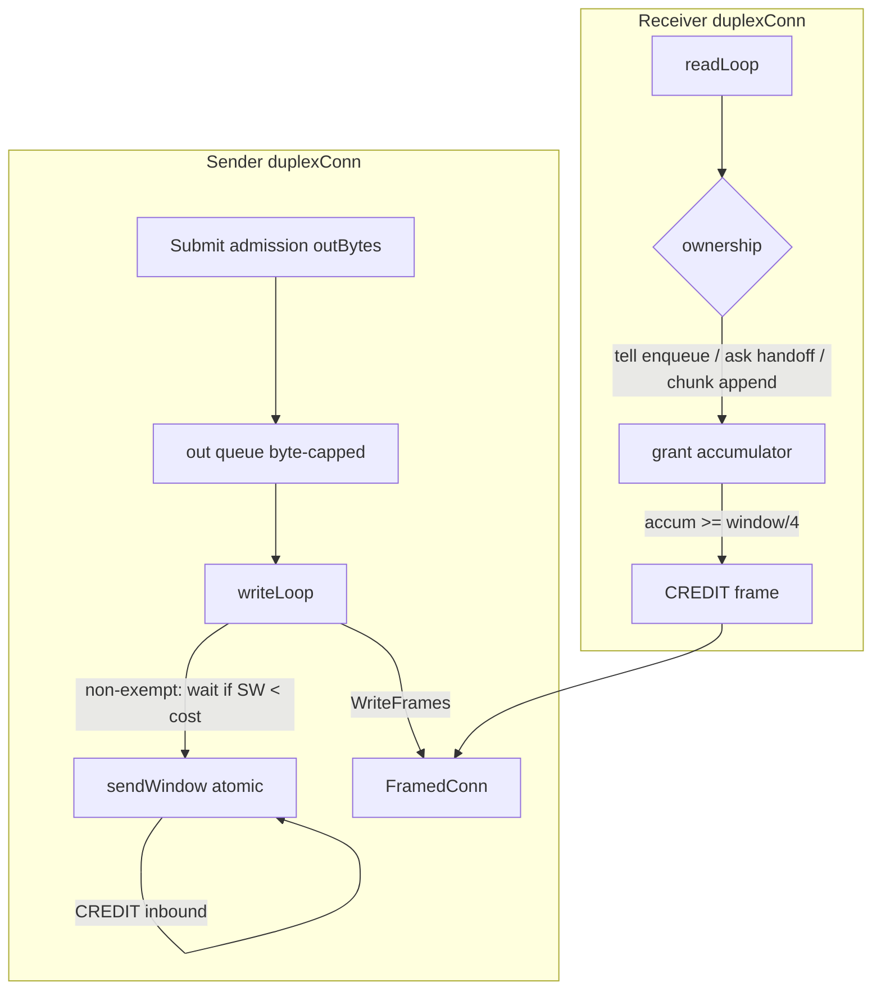

# Milestone 7 Implementation Plan: Credit-Based Flow Control and Semantics Completion

**Issue:** [#1301](https://github.com/Tochemey/goakt/issues/1301)
**Authoritative scope:** [REMOTING_REFACTOR_MILESTONES.md](REMOTING_REFACTOR_MILESTONES.md) (Milestone 7)
**Design rationale:** [REMOTING_REFACTOR_DESIGN.md](REMOTING_REFACTOR_DESIGN.md) §6 (flow control) and Decision 2 (tell failure semantics)
**Depends on:** Milestone 6 (zero-copy receive, duplex tell admission, revision 3), committed tip as benchstat baseline
**Status:** Implementation complete; acceptance criteria met (tests, `docs/advanced/remoting.mdx`, #1301 checklist + performance comment). Present diff for approval before commit.

**Overview:** Complete end-to-end backpressure by adding a receiver-granted, byte-denominated **send window** on each duplex connection. Today `InitialCredits` only sizes the **local admission** queue (`maxOutBytes` / `outBytes`); the writer drains that queue without waiting for the peer. Milestone 7 keeps that admission cap and adds a second counter decremented at **write time**, parked when a write would drive the window negative, and replenished by inbound `CREDIT` frames. Capability `revision >= 4` gates the feature; below that the send window is unlimited (pre-credit behavior). This milestone also finishes the public semantics statement and configuration surface for every remoting knob introduced by #1301.

## Scope

From the milestones guide and design §6, Milestone 7 delivers:

- **Sender send window:** signed atomic byte counter per duplex connection, initialized from negotiated `InitialCredits`, decremented at **write time** (not admission); writer parks when a write would make the window negative and resumes on `CREDIT`
- **Local admission queue unchanged in role:** still byte-capped (sized to the credit window); total per-connection buffering stays bounded by queue + window
- **Receiver grants:** emit `CREDIT` for every windowed frame at its first terminal disposition — mailbox enqueue for ordinary `DATA`, worker-pool handoff for `expectsReply` frames, reassembly-buffer append for `CHUNK`, and the failure dispositions that keep the connection open (decode-error reply, dead-letter, reject-and-drop); batch roughly one `CREDIT` per quarter window consumed
- **`CreditWindow` as a real config knob:** `remote.WithCreditWindow` / `Config.CreditWindow` + `Validate`; actor system wires server and client from config (maps to HELLO `initial_credits`)
- **Exempt frames:** only `DATA` and `CHUNK` consume the send window. `ERROR`, `REPLY`, `TABLE`, `CREDIT`, `PING`, `PONG` neither consume it nor wait for it, and they must also bypass a parked writer (see locked decisions): control signaling and liveness must not deadlock behind windowed data
- **Ordering:** credits sit **below** the writer queue — windowed frames already admitted are written FIFO among themselves as the window allows; exempt control frames may overtake parked windowed frames (no ordering contract crosses the two classes)
- **Revision bump to 4** on dialer and acceptor; pairwise `min` unchanged; revision `< 4` ⇒ unlimited send window (no `CREDIT` expected/required)
- **Final semantics:** enqueue success returns nil; full admission queue blocks to deadline / `writeTimeout` then `errors.ErrRemoteSendBackpressure`; transport failures dead-letter with an event; slow receivers slow senders without loss. Stated in GoDoc (`WithCreditWindow`) and in the `remoting.mdx` send-semantics section shipped with this milestone.
- **Full performance validation** recorded on #1301 (see acceptance)

**Out of scope:** coalescer deletion; legacy path deletion; shrinking `MaxFrameSize`; Opaque API (Milestone 8); QUIC; vtprotobuf; public `remote.Serializer` contract changes; reliable-delivery changes; any frame header or DATA/REPLY envelope layout change.

**Name mapping (unchanged):** milestones/design “GetState” means **PeerState** load/store for any control-bulk / store benches. Not `RemoteStateRequest`.

## Current codebase anchors

| Area | Today | M7 change |
|------|-------|-----------|
| Capability revision | Advertise `CapabilityRevisionTables = 3` in [`peer.dialLane`](../internal/remoteclient/peer.go) and [`RemotingServer.handleDuplexConn`](../internal/net/remoting_server.go) | Add `CapabilityRevisionCredits = 4`; advertise 4; gate send-window enforcement and inbound `CREDIT` handling |
| `FrameTypeCredit` (`0x07`) | Valid type in [`frame.go`](../internal/net/frame.go); no dedicated handler — falls through like other non-DATA control | Decode uvarint grant in `readLoop` (or helper); apply to send window; never deliver to `Recv` |
| `HELLO.initial_credits` | Negotiated via pairwise min in [`handshake.go`](../internal/net/handshake.go); seeds **admission** `maxOutBytes` only | Still seeds admission cap; **also** seeds send window when `revision >= 4` |
| Outbound admission | [`duplexConn.maxOutBytes` / `outBytes`](../internal/net/duplex.go): cap at Submit / trySubmit | Unchanged role (admission). Do **not** conflate with the send window |
| Writer | [`writeLoop`](../internal/net/duplex.go) drains `out` and writes immediately; **all** frames share this one FIFO, including PONG replies and liveness PINGs admitted via `trySubmit` | Before writing a windowed frame, wait until send window ≥ cost; decrement at write; wake on CREDIT. Hold the unwritten windowed suffix in a writer-local pending buffer; keep pulling and writing exempt frames while parked |
| Receiver ownership | Tell: mailbox enqueue in [`duplexRemoteTell`](../actor/remote_server.go); Ask: worker-pool handoff; CHUNK: reassembly append in chunk path | Call into duplex grant helper at those ownership points |
| `remote.Config` | `DefaultCreditWindow` exists as constant only in early milestones; actor hardcoded the default for client/server | Public `WithCreditWindow` / `CreditWindow` + Validate; wire through `actor_system` / remoting start |
| Tell admission (M6) | Per-lane pump + `TellFailureHandler`; `admitMaxBytes` matched to `initialCredits` | Keep; document interaction (admission full ⇒ backpressure; send window empty ⇒ writer parks, Submit may still admit until queue full) |
| Docs | Deferred across M3–M6 | `remoting.mdx` updated for knobs + send semantics; credit purpose also in `WithCreditWindow` GoDoc |

## Locked decisions

| Topic | Decision |
|-------|----------|
| Two counters, not one | **Admission queue** (`outBytes` / `maxOutBytes`) and **send window** (new atomic) are distinct. Admission still bounds memory on the sender before the socket. The send window bounds bytes the peer has not yet taken ownership of. Conflating them would either deadlock large messages or lose end-to-end backpressure. |
| Decrement at write time | Cost is charged when `writeLoop` (or `drainOutbound`) is about to call `WriteFrames`, not at `Submit`. Frames may sit in `out` without consuming peer credits. Matches milestones deliverable wording. |
| Park, do not drop | When the next non-exempt frame's cost exceeds the remaining window, the writer waits (condition / channel) until `CREDIT` arrives or the connection closes. Never silently drop admitted frames for credit starvation. |
| Windowed vs exempt frame types | Only `DATA` and `CHUNK` consume the send window. `REPLY` is exempt: reply volume is bounded by outstanding asks that the receiving side itself created, and charging it would require client-side grant hooks on correlation delivery for no backpressure benefit. `TABLE` is exempt: volume is bounded by table capacity (8192 per kind) and the literal length cap, and charging it would leak the window because installs never grant. `ERROR`, `CREDIT`, `PING`, `PONG` are exempt control signaling. `HELLO`/`HELLO_ACK` are pre-session. The window exists to bound the one unbounded-rate flow (fire-and-forget data); every other flow is already peer-bounded, and exempting them is what keeps the charge/grant ledger closed. |
| Exempt frames bypass a parked writer | All frames share the single outbound FIFO (`out`): PONG replies and liveness PINGs are admitted with `trySubmit` from the read and liveness loops, and connection ERROR and CREDIT ride the same queue. Exemption from charging is therefore not enough. A writer parked on a windowed head frame would strand CREDIT (bidirectional grant deadlock: both writers parked, each side's grants stuck behind its own parked data), PING/PONG (the peer's liveness loop kills a legitimately backpressured connection after two idle intervals), and best-effort ERROR. Lock: the writer keeps unwritten windowed frames in a writer-local pending buffer and continues to pull and write exempt frames while parked. Reordering exempt ahead of parked windowed frames is safe: PING/PONG/CREDIT are connection-level, and an ERROR correlates to a request the peer already delivered, so no ordering contract crosses the two classes. FIFO among windowed frames is preserved (the writer is the sole queue consumer and the buffer is ordered). Admission bytes for parked frames stay charged until the frame is written, so Submit backpressure holds while parked. |
| Control frames bypass admission byte cap | Because parked windowed frames keep their admission cost charged, a full window of parked DATA would otherwise block `trySubmit` of CREDIT/PING/PONG/ERROR on `outBytes+cost > maxOutBytes` even when the writer queue has free slots. Lock: those four types may exceed the admission byte cap (still fail immediately on a full channel). One oversized windowed frame may also enter an empty admission queue so a peer with a smaller `InitialCredits` can make progress under the negative-allowance write rule. |
| Cost basis, single grant | Charge and grant use the same per-wire-frame basis, `FrameHeaderSize + frame.Length`, matching the existing admission cost. Each charged frame is granted exactly once, at its first terminal disposition. Chunked messages grant per `CHUNK` frame at reassembly append; the reassembled logical frame grants nothing (it was never charged as a wire frame). Ask frames grant at worker-pool handoff, not at the worker's deferred `ReleasePayload`, which runs after user code and would violate the no-deadlock rule. Dispositions that close the connection do not grant (the window dies with the connection). Unsolicited `DATA` arriving at the remoting client is dropped without grant: only a misbehaving peer sends it, and the window loss is confined to that peer. |
| Progress guarantee for oversized frames | The negotiated window is the pairwise min of both peers' `InitialCredits`, so a frame costing more than the whole window is reachable through config asymmetry (the peer advertises a small window while the local `ChunkSize`, or an unchunked frame, exceeds it). Lock: a windowed frame whose cost is at least the full negotiated window is written when the window is at its full value, driving the signed counter negative; later windowed frames wait until grants return it positive. This guarantees one oversized frame in flight at a time instead of a permanent park. `Validate` additionally requires `InitialCredits >= ChunkSize` locally as a belt; the negative-allowance rule is the real guarantee because the peer's advertisement is not under local control. |
| `CREDIT` payload | Hand-parsed **uvarint** grant size in bytes (wire reference). Correlation `0`. Empty/zero grant is a protocol no-op (ignore). Oversized absurd grants may be clamped to `math.MaxInt64 - current` to protect the signed counter; do not close the connection for a large grant. `readLoop` intercepts `FrameTypeCredit` before inbound delivery at **every** revision: parse and apply when credits are enabled, silently discard otherwise (today the frame falls through to `Recv`, where the client monitor drops it and the server would misroute it as a task). CREDIT bodies are not pooled by `poolsReadPayload`, so no release call is needed. |
| Grant batching | Accumulate owned bytes; emit one `CREDIT` when accumulated ≥ `window/4` (integer division, minimum 1 when window > 0), then reset the accumulator. Final flush on connection close is best-effort / skip (peer is gone). |
| Grant ownership points | (1) Ordinary tell: after mailbox enqueue, or at the dead-letter / decode-failure disposition that keeps the connection open, whichever the frame reaches first (grant once when the duplex layer will not re-read those bytes). (2) Ask / expectsReply: when the frame is handed to the worker pool (ownership leaves the read loop; never at the worker's deferred release, which runs after user code). (3) CHUNK: when bytes are appended to the reassembly buffer (required so a message larger than the window can complete — design §4 / §6). Do **not** wait for actor processing or ask completion. |
| Revision gating | `revision >= 4`: enforce send window; handle inbound `CREDIT`; emit outbound `CREDIT`. `revision < 4`: send window treated as unlimited; ignore inbound `CREDIT` (or treat unexpected `CREDIT` as protocol violation — **lock: ignore**, so a buggy peer cannot kill a revision-3 session); never emit `CREDIT`. Inbound frame type unknown still closes (existing rule). |
| Advertise revision | Dialer and acceptor advertise `CapabilityRevisionCredits` (4). Effective revision remains `min(local, remote)`. |
| Config surface | Public API is `WithCreditWindow` / `CreditWindow` / `DefaultCreditWindow` (not "initial credits": that is the HELLO wire field name). `Validate`: `> 0` and `>= ChunkSize` (see the oversized-frame progress row; the local floor is a belt, the negative-allowance rule is the guarantee). Actor system passes `CreditWindow()` into `WithRemotingServerInitialCredits` and `WithClientInitialCredits`. |
| Interaction with tell pump | Per-lane `admitMaxBytes` remains matched to `initialCredits` (M6). A stalled peer fills the admission queue; callers then see `ErrRemoteSendBackpressure`. The send window alone must not unbounded-buffer on the sender — admission already caps that. |
| Sync tell path | Unchanged contract: live session + empty pump fence may `Tell` synchronously; mid-write session death re-admits (documented cross-sender lane sharing). Credits apply inside `session.Tell` → `Submit` → writer park, so sync callers can block on `writeTimeout` / ctx while the window is exhausted — same as a full admission queue. |
| Legacy / coalescer | Untouched. Legacy peers never negotiate revision 4. |
| Docs | `docs/advanced/remoting.mdx` updated in M7 for the configuration table, send semantics, credit window, and `LargeMessageDestinations`. |
| Wire stability | Frame header and DATA/REPLY layout unchanged. `CREDIT` type already allocated (`0x07`). |
| `go.mod` | Unchanged. |

## Architecture

**Invariant:** For `revision >= 4`, windowed bytes written (`DATA` + `CHUNK`, at `FrameHeaderSize + Length` each) ≤ HELLO initial window + sum of `CREDIT` grants, with one allowed negative excursion for a single oversized frame written at full window. On a connection that stays open, every charged frame is eventually granted exactly once, so the steady-state window returns to its initial value when the receiver drains. Receiver memory for unreassembled / undelivered data remains bounded by window accounting plus existing reassembly caps (`MaxMessageSize`, `MaxConcurrentLargeTransfers`).

## Work items

### 1. Constants and revision advertise

- Add `CapabilityRevisionCredits uint32 = 4` next to the other revision constants in [`frame.go`](../internal/net/frame.go).
- Advertise revision 4 from [`peer.dialLane`](../internal/remoteclient/peer.go) and [`RemotingServer.handleDuplexConn`](../internal/net/remoting_server.go).
- Document cumulative gating in GoDoc (1 baseline, 2 chunking, 3 tables, 4 credits).

### 2. Send window on `duplexConn`

- Fields: `sendWindow atomic.Int64` (or mutex + int64 if wake logic prefers); `creditEnabled bool` from `revision >= 4`; waiter cond/channel for the writer.
- Init from negotiated `InitialCredits` when credits enabled; otherwise treat as unlimited.
- `writeLoop`: pull available frames as today, write every exempt frame immediately (even while parked), then write the longest prefix of pending windowed frames whose total cost fits the window; subtract at write. Keep the unwritten windowed suffix in a writer-local pending buffer across wakeups: frames cannot be pushed back onto the channel, and local retention preserves FIFO because the writer is the sole consumer. Wake on CREDIT or new admissions. Apply the full-window oversized-frame rule (write one frame regardless of cost when the window is at its full value; the signed counter goes negative).
- `drainOutbound` (shutdown flush) ignores the window entirely: the best-effort connection ERROR must not park on a dead peer's credits. The writer-local pending buffer is flushed there too.
- Inbound `CREDIT`: intercept in `readLoop` before inbound delivery at every revision; add the grant to `sendWindow` and wake the writer when `creditEnabled`, silently discard otherwise.

### 3. CREDIT encode/decode helpers

- Colocate in `internal/net/duplex_credit.go` (mirror `duplex_chunk.go` / `duplex_table.go`) with colocated tests.
- `appendCreditPayload` / `consumeCreditPayload` for uvarint bytes.
- `submitCreditFrame` / `noteOwnedBytes` on the receiver side (accumulator + quarter-window flush). CREDIT is exempt on the grant sender in both senses: it is never charged against the send window, and the parked-writer bypass carries it to the wire ahead of parked windowed frames.

### 4. Receiver ownership hooks

- **Tell path:** after mailbox accept in the duplex tell handler path ([`actor/remote_server.go`](../actor/remote_server.go) / remoting server tell callback), notify owned byte count (header + payload length of the logical frame).
- **Ask path:** when dispatching to the worker pool (`expectsReply`), notify owned bytes at handoff.
- **Chunk path:** on reassembly-buffer append ([`duplex_chunk.go`](../internal/net/duplex_chunk.go) / reassembler), notify appended byte count (not only on final dispatch).
- Failure dispositions that keep the connection open (decode-error reply, dead-letter, reject-and-drop) **do** grant, at the point the frame is released: the sender charged at write, and without a grant every such frame permanently shrinks the window on a healthy connection until the writer parks forever. Only dispositions that close the connection skip the grant (the window dies with it). Each frame grants exactly once; the success-path and failure-path hooks must be mutually exclusive per frame.

### 5. `remote.Config` CreditWindow

- Add field + `WithCreditWindow` + `Validate` (`> 0` and `>= ChunkSize`), with GoDoc that explains end-to-end backpressure (not just the HELLO field name).
- Wire [`actor_system`](../actor/actor_system.go) remoting client and [`remote_server`](../actor/remote_server.go) server options from `CreditWindow()` instead of a hardcoded default.

### 6. Docs and semantics

- Update `docs/advanced/remoting.mdx`: configuration table for every remoting knob, send-semantics section, credit-window purpose, and `LargeMessageDestinations` as a performance/isolation knob with an example.
- Keep the credit purpose in GoDoc (`WithCreditWindow`) as well.

### 7. Tests (focused, no `t.Parallel()`)

| Test | Asserts |
|------|---------|
| Window exhaustion parks writer; `CREDIT` resumes | Writer blocks; grant unblocks; frames drain FIFO |
| Message larger than window completes | CHUNK + grant-on-append; no deadlock |
| Stalled receiver (no grants) | Sender hits `ErrRemoteSendBackpressure` by deadline; per-peer admitted+window bytes bounded |
| Exempt frames while window is 0 | ERROR / REPLY / TABLE / PING / PONG / CREDIT still flow, including when queued behind parked windowed frames (parked-writer bypass); no liveness kill while parked |
| Bidirectional exhaustion | Both directions exhaust their windows simultaneously; CREDIT still flows both ways and both writers resume (no grant deadlock) |
| Oversized frame vs small window | Frame cost exceeds the negotiated window; written at full window, counter goes negative, recovers on grants |
| Drop-path grants | Decode-error DATA on a connection that stays open; steady-state window returns to initial (no leak) |
| No double grant | Chunked message; total grants equal the sum of CHUNK wire-frame costs exactly once (reassembled dispatch grants nothing) |
| Revision 3 peer | Windowless; traffic flows; no CREDIT emitted; inbound CREDIT ignored |
| Fairness | Two senders → one receiver under tiny window; both make progress |
| Config | `WithCreditWindow` + Validate (`> 0`, `>= ChunkSize`); actor wiring uses config value |
| Grant batching | Quarter-window batching (count CREDIT frames under load) |

**Regression gate:** after the implementation is complete, all existing remote-related tests must pass unmodified: the full `internal/net` and `internal/remoteclient` packages, and the remoting-related actor suites (remote tell/batch, dead-letter, async-reply, reliable-delivery-remoting). Credits default on at revision 4, so every existing test exercises the windowed path; any failure is an M7 defect, not a test to update.

### 8. Benchstat / performance validation

- Against Milestone 6 tip: no unexpected small-message throughput regression on the duplex path with default 16 MiB window (credits should be invisible when the peer keeps up).
- Against pre-refactor baseline (issue comment from before M1): small-message aggregate order of 1M msgs/sec per peer pair; slow-actor ask p99 isolation; 100 MiB concurrent transfer without measurable small-message latency impact.
- Post tables as a comment on #1301. Keep only permanent acceptance benches.

## Implementation order

1. Constants + revision advertise + credit encode/decode helpers + unit tests.
2. Send window in `writeLoop` + inbound CREDIT handling + exhaustion/resume tests.
3. Receiver `noteOwnedBytes` hooks (tell, ask handoff, chunk append) + larger-than-window + stalled-receiver tests.
4. Exempt-frame and revision-3 gating tests.
5. `remote.Config` CreditWindow + actor wiring + fairness test.
6. Benchstat → #1301 comment → tick acceptance boxes (docs page deferred).

## File map (expected touch list)

| Area | Path |
|------|------|
| Credits core | `internal/net/frame.go` (revision const); new `duplex_credit.go` + `duplex_credit_test.go`; `duplex.go` writeLoop / fields; `duplex_open.go` init |
| Chunk grants | `internal/net/duplex_chunk.go` / reassembly |
| Server / actor grants | `internal/net/remoting_server.go`; `actor/remote_server.go` |
| Advertise revision | `internal/remoteclient/peer.go`; remoting server HELLO |
| Config | `remote/config.go` (+ options/validate); `actor/actor_system.go`; `actor/remote_server.go` |
| Untouched | `go.mod` / vendor; coalescer deletion; legacy unary path; DATA/REPLY layout; Opaque API |

## Risks and non-goals to keep explicit

- **Deadlock if grants wait on actor completion.** Grant at ownership handoff only (mailbox / pool / reassembly), never after user code runs. The ask worker's deferred `ReleasePayload` runs after user code and must not be the grant hook.
- **Deadlock or liveness kill if exempt frames wait behind parked frames.** CREDIT must stay uncharged on the grant sender **and** bypass a parked writer; so must PING/PONG, or the peer's liveness loop kills every legitimately backpressured connection after two idle intervals, converting backpressure into connection churn.
- **Window ledger must close.** Every charged frame is granted exactly once on a connection that stays open. Charging any flow without a matching grant path (TABLE installs, REPLY delivery, drop paths) is a permanent window leak that ends in a permanently parked writer.
- **Conflating admission with send window.** Would either allow unbounded peer buffering or block large messages; keep both counters.
- **Revision-3 mixed clusters.** Must remain windowless and functional; ignoring inbound CREDIT on revision < 4 avoids killshots from buggy peers.
- **M6 must be committed first.** Benchstat baseline is the Milestone 6 tip; pre-refactor baseline must already exist on #1301 for the final comparison.
- **No wire/layout escape hatches.**

## Handoff

1. Confirm the regression gate: all existing remote-related tests pass unmodified (see Tests section).
2. Present the full diff for maintainer approval.
3. Do **not** commit until approved.
4. After approval: exactly one semantic `feat:` commit referencing #1301.
5. Post benchstat tables (vs M6 tip and pre-refactor baseline) as a comment on #1301.
6. Mark Milestone 7 acceptance boxes in `REMOTING_REFACTOR_MILESTONES.md` complete; tick design todos 7 and 9; tick the issue draft M7 checkbox.

## Suggested commit (when approved)

`feat: remoting credit-based flow control and semantics completion (#1301)`
