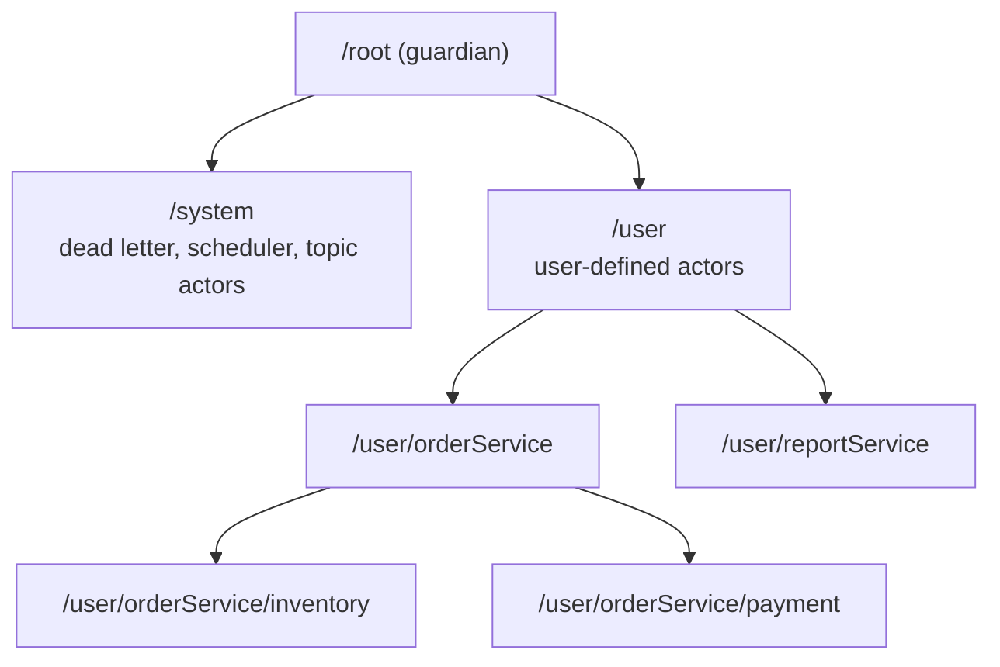
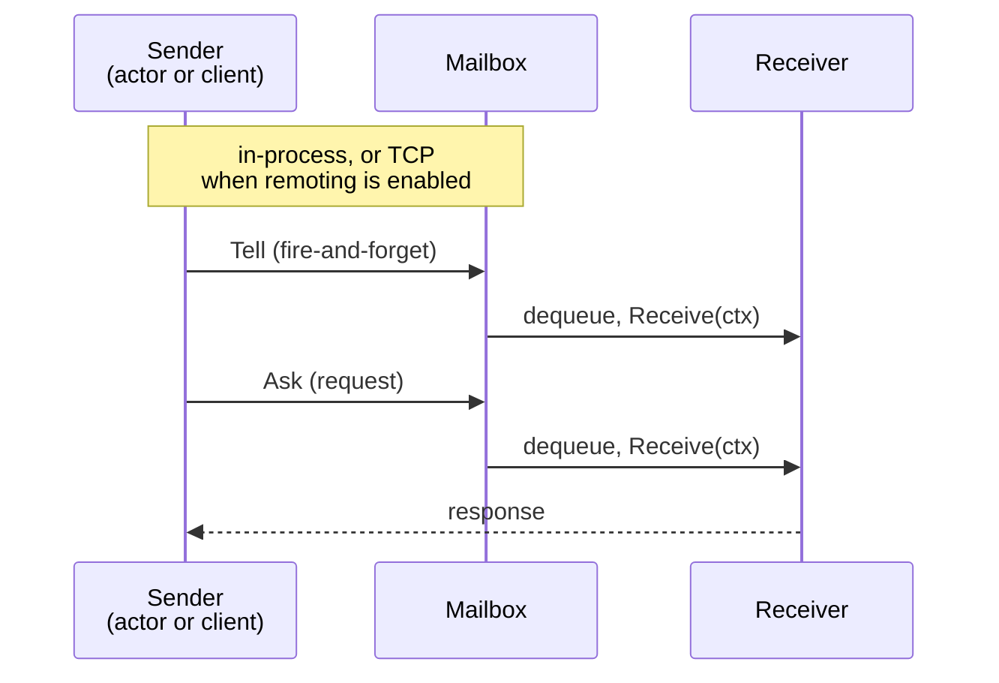

## What is the actor model?

The actor model treats **actors** as the fundamental unit of computation. Each actor is an isolated entity that:

- Processes messages **sequentially** (one at a time)
- Maintains **private state** (no shared memory with other actors)
- Communicates **exclusively via message passing**

There is no shared state between actors. The only way to interact with one is to send it a message.

An actor resembles an object whose fields are unreachable and whose only public method is "here is a message". The send
is asynchronous: the sender hands the message over and carries on, rather than waiting on a stack frame.

## What an actor does with a message

In the model's original formulation, everything an actor may do in response to one message falls into three categories.
GoAkt maps each to a concrete API:

- **Create more actors**: `ctx.Spawn` for a child; `system.Spawn` from outside an actor.
- **Send messages to other actors**: `ctx.Tell`, `ctx.Ask`; see [Messaging](/actor/messaging).
- **Designate how to handle the _next_ message**: `ctx.Become` / `ctx.UnBecome`; see [Behaviors](/actor/behaviors).

The third is the one that surprises people. A classical actor does not so much mutate state as decide what it will be
when the next message arrives: a counter receiving `add(1)` designates "I am now 1" rather than editing a cell someone
else might be reading. Nothing outside can observe the difference, so GoAkt lets you write the direct form and assign to
a private field. Behavior designation is then reserved for when the _shape_ of the handling changes rather than a value:
a connection becoming authenticated, a circuit breaker opening, an order moving to `paid`.

## Why use actors?

Actors provide a natural model for concurrent and distributed systems:

- **Encapsulation**: State is private; no locks or mutexes needed inside an actor
- **Location transparency**: You send to a PID; the framework routes locally or remotely
- **Fault isolation**: A failing actor does not corrupt others; supervision handles recovery
- **Scalability**: Actors can be distributed across nodes; the cluster manages placement

## Core concepts

- **Actor**: The fundamental unit. Receives messages, updates private state, spawns children, sends messages.
- **ActorSystem**: The runtime host. Manages lifecycle, messaging, cluster membership, and remoting. See
  [Actor System](/actor/actor-system).
- **PID**: Process identifier: a live handle to a running actor. Used for all interactions.
- **Path**: The canonical location of an actor: `goakt://system@host:port/path/to/actor`.
- **Mailbox**: Each actor has one. Messages wait here until the actor processes them.

## Actor hierarchy

Every actor lives inside a tree. GoAkt creates guardian actors at startup:

- **Root**: Top of the tree
- **System**: Parent of internal actors (dead letter, scheduler, etc.)
- **User**: Parent of all user-spawned actors



When a parent stops, all children stop first (depth-first). A parent supervises its children: on failure, the configured
strategy decides whether to resume, restart, stop, or escalate.

## Let it crash

The actor model's answer to failure is not to defend against it in every handler. Code that tries to anticipate every
fault buries the common path in error handling and still misses the fault nobody imagined. The Erlang tradition inverts
this: let the failing actor crash, and make recovery an explicit job that belongs to somebody else.

That somebody is the parent. A crash arrives at the supervisor as a message, and it applies a directive: `Resume` to
keep the state and drop the offending message, `Restart` to discard state that may now be inconsistent and begin again
from a known-good one, `Stop`, or `Escalate` to its own parent. Isolation is what makes this safe. The crashed actor's
state was private, so nothing else was corrupted and no peer ever observed a half-finished mutation.

A restart is therefore a repair rather than an outage. See [Supervision](/actor/supervision) for the strategies and
[Lifecycle](/actor/lifecycle) for what a restart means for `PreStart` and `PostStop`.

## Concurrency without synchronization

A data race needs two ingredients: more than one goroutine reaching the same memory, and no ordering between them. For
state that lives inside an actor, GoAkt removes both.

- **Mutual exclusion, not worker affinity.** At most one goroutine is inside a given actor's `Receive` at any instant.
  The dispatcher enforces this with a per-actor state transition from `Scheduled` to `Processing`; a second worker that
  reaches the same actor loses the compare-and-swap and moves on. Successive turns can run on different workers, because
  idle workers steal work, so a handler must never rely on goroutine or thread identity.
- **Sequential delivery.** Messages are drained from the mailbox in FIFO order, so handler N returns before handler N+1
  starts.
- **No shared memory.** Actor state lives in unexported fields, and the only way in is a message, unless you hand out a
  reference yourself.

A mutex exists to serialize concurrent callers. An actor has none, because the dispatcher already serialized them before
the handler ran, which is why GoAkt actors hold plain fields and mutate them directly.

### The same counter, both ways

```go The same counter with mutex
// Shared memory: correctness depends on every caller remembering the lock.
type Counter struct {
    mu    sync.Mutex
    count int64
}

func (c *Counter) Inc() {
    c.mu.Lock()
    defer c.mu.Unlock()
    c.count++
}

func (c *Counter) Count() int64 {
    c.mu.Lock()
    defer c.mu.Unlock()
    return c.count
}
```

```go The same counter as an Actor
// As an actor: no lock to forget, because no second goroutine can get in.
type Counter struct {
    count int64
}

func (a *Counter) PreStart(ctx *actor.Context) error { return nil }
func (a *Counter) PostStop(ctx *actor.Context) error { return nil }

func (a *Counter) Receive(ctx *actor.ReceiveContext) {
    switch ctx.Message().(type) {
    case *Inc:
        a.count++
    case *GetCount:
        ctx.Response(&Count{Value: a.count})
    default:
        ctx.Unhandled()
    }
}
```

## Never block inside Receive

<Warning>A `Receive` handler must never block. In GoAkt this is a hard rule, not a performance preference.</Warning>

Actors do not own goroutines. They run on a fixed [dispatcher pool](/architecture/dispatcher-pool) of
`max(GOMAXPROCS, 2)` workers that multiplexes the entire actor population. A worker picks up an actor, runs its turn to
completion, and only then moves on. A handler that blocks holds its worker for as long as it is stuck, withdrawing a
fixed fraction of the whole process's processing capacity. Block a handful of handlers at once and every actor in the
system stalls, including the ones being waited on.

The fairness budget does not rescue you. `WithThroughputBudget` (default 32) caps how many messages an actor drains per
turn, but a turn ends only when your handler returns. A blocked handler is not preemptible.

So, inside `Receive`, do not:

- acquire a mutex that another goroutine may hold
- send on or receive from a Go channel
- call `WaitGroup.Wait`
- perform blocking network, disk, or database I/O
- call `time.Sleep`
- `Ask` or `SendSync` an actor that may be waiting on you

The last one deadlocks rather than merely slowing things down. If A blocks in `Ask` to B while B blocks in `Ask` to A,
both handlers are stuck, both hold a worker, and neither reply can ever be dequeued, because the goroutine that would
process it is the one that is blocked. Use `Request` with [reentrancy](/actor/reentrancy) for call cycles.

`PreStart` and `PostStop` are different: they run on the caller's goroutine, not on a dispatcher worker. Blocking setup
and teardown belong there. `PreStart` is bounded by the init timeout, configurable per actor with `WithInitTimeout`.

### Doing real work without blocking

- **Call an HTTP API or a database**: [`ctx.PipeTo`](/actor/pipeto) or `ctx.PipeToName`; the result arrives as a
  message.
- **Ask another actor and stay responsive**: `ctx.Request` or `ctx.RequestName` under a [reentrancy](/actor/reentrancy)
  policy; the reply runs through `Then` on the mailbox thread.
- **Wait for a precondition**: [`ctx.Stash`](/actor/stashing), then `ctx.UnstashAll` once the condition holds.
- **CPU-heavy computation**: `PipeTo`, or spread the work across child actors.
- **Periodic work**: [Scheduling](/actor/scheduling), not a sleep loop.

The one way to bring the race back is a goroutine you start yourself. A `PipeTo` task runs off the mailbox thread, so it
must not touch actor fields. Copy what it needs, return the result, and mutate state when the result arrives as a
message.

## Message flow



For remote messages, the remoting layer serializes the payload over a custom TCP frame protocol with optional
compression.

## The Actor interface

Every actor must implement the `Actor` interface:

```go The Actor interface
package actor

type Actor interface {
    PreStart(ctx *Context) error
    Receive(ctx *ReceiveContext)
    PostStop(ctx *Context) error
}
```

- **PreStart**: called once, before the actor processes any message. Initialize dependencies, caches, or recover
  persistent state. Return an error to prevent startup; the supervisor handles the failure.
- **Receive**: called for each message in the mailbox. Handle messages. Use a type switch on `ctx.Message`. Call
  `ctx.Unhandled` for unknown types.
- **PostStop**: called when the actor is about to shut down. Release resources, flush logs, notify other systems. Called
  after the mailbox is drained.

Keep actor state in unexported fields. Initialize in `PreStart`, not in constructors. The framework guarantees
single-threaded execution per actor, so no locks are needed inside `Receive`.
