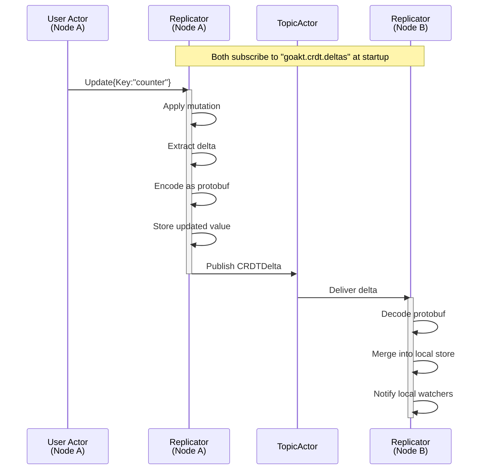

**Distributed Data** provides replicated data structures — **Conflict-free Replicated Data Types (CRDTs)** — that can be updated independently on any node and are guaranteed to converge to a consistent state. No coordination, no locks, no consensus rounds.

This enables use cases like distributed counters, cluster-wide session registries, feature flags, and shopping carts where every node can read and write locally with immediate response, and all nodes converge automatically.

## Architecture

Each node in the cluster runs its own **Replicator** system actor (`GoAktReplicator`). There is no central coordinator — each Replicator owns its node's local CRDT store and communicates with peer Replicators via GoAkt's existing [TopicActor](/advanced/pubsub) pub/sub system.


### Data Flow

**Step 1 — Subscription at startup.** When a Replicator starts (in `PostStart`), it subscribes to the well-known topic `goakt.crdt.deltas` via the TopicActor. This is a one-time operation — there is no per-key subscription. Every delta for every key flows through this single topic.

**Step 2 — Local update.** A user actor sends an `Update` message to its local Replicator. The Replicator applies the mutation to its local CRDT store, extracts the delta, encodes it as a protobuf `CRDTDelta` message (which includes the key ID, data type, origin node, and serialized delta state), and publishes it to the shared topic via the TopicActor.

**Step 3 — Dissemination.** The TopicActor delivers the protobuf delta to all subscribers of `goakt.crdt.deltas` — which is the Replicator on every other node. The TopicActor handles serialization (protobuf), remote TCP delivery, and deduplication. This is not a Replicator concern.

**Step 4 — Remote merge.** Each peer Replicator receives the protobuf delta, decodes it back to the CRDT type, ignores it if the origin is itself, and merges it into its local store using the type's merge function. If the merge changes the value, it notifies any local user actors watching that key.



Both Replicators are **equal participants** — they both subscribe to the same topic and both can publish to it. There is no publisher/subscriber distinction. When Node B updates the same key, the flow is identical with roles reversed.

**Anti-entropy** runs periodically as a safety net. Each Replicator exchanges version digests with a random peer, and any divergent keys are repaired. This ensures convergence even if some deltas were lost during a network partition.

---

## CRDT types

All types implement the `ReplicatedData` interface and are **immutable values** — every mutation returns a new value plus a delta. Values stored in generic CRDT types (`LWWRegister`, `ORSet`, `MVRegister`, `ORMap`) are typed as `any` and serialized over the wire using a composite Proto+CBOR serializer. Go primitives (`string`, `int`, `bool`, etc.) work out of the box; custom struct types require CBOR registration via `remote.WithSerializers`.

| Type          | Description                                                                                             | Primary use cases                    |
| ------------- | ------------------------------------------------------------------------------------------------------- | ------------------------------------ |
| `GCounter`    | Grow-only counter. Each node maintains its own increment slot; value = sum of all slots.                | Monotonic metrics, event counts      |
| `PNCounter`   | Positive-negative counter. Two GCounters: one for increments, one for decrements.                       | Rate limiters, gauges, inventory     |
| `LWWRegister` | Last-writer-wins register. Stores a single value (`any`) with a timestamp.                              | Configuration, feature flags         |
| `ORSet`       | Observed-remove set. Supports add and remove without conflict (add-wins semantics). Elements are `any`. | Session tracking, subscriptions      |
| `ORMap`       | Map where keys (`any`) are an OR-Set and values are themselves CRDTs.                                   | Shopping carts, user profiles        |
| `Flag`        | Boolean that can only transition from `false` to `true`.                                                | One-time signals, feature activation |
| `MVRegister`  | Multi-value register. Concurrent writes are preserved, not overwritten. Values are `any`.               | Conflict-visible state               |

### Keys

CRDT keys are **serializable** and carry the CRDT data type for wire-level validation.

```go
var (
    requestCount   = crdt.PNCounterKey("request-count")
    activeSessions = crdt.ORSetKey("active-sessions")
    featureFlag    = crdt.LWWRegisterKey("dark-mode")
    cartItems      = crdt.ORMapKey("cart")
)
```

---

## Enabling CRDTs

CRDT replication is enabled through `ClusterConfig.WithCRDT(...)`. When not enabled, no Replicator is spawned — zero overhead.

```go
clusterConfig := actor.NewClusterConfig().
    WithDiscovery(discoveryProvider).
    WithCRDT(
        crdt.WithAntiEntropyInterval(30 * time.Second),
        crdt.WithPruneInterval(5 * time.Minute),
        crdt.WithTombstoneTTL(24 * time.Hour),
    )

system, _ := actor.NewActorSystem("my-system",
    actor.WithCluster(clusterConfig),
)
```

### Configuration options

| Option                    | Default       | Description                                                                          |
| ------------------------- | ------------- | ------------------------------------------------------------------------------------ |
| `WithAntiEntropyInterval` | 30s           | Interval between anti-entropy digest exchanges with a random peer                    |
| `WithMaxDeltaSize`        | 64KB          | Maximum serialized delta size per publish; larger deltas trigger full-state transfer |
| `WithPruneInterval`       | 5m            | Interval for pruning expired tombstones and compacting CRDTs                         |
| `WithTombstoneTTL`        | 24h           | How long deletion tombstones are retained to prevent key resurrection                |
| `WithCoordinationTimeout` | 5s            | Timeout for coordinated `WriteTo`/`ReadFrom` operations                              |
| `WithRole`                | _(all nodes)_ | Restrict CRDT replication to nodes with this role                                    |
| `WithSnapshotInterval`    | _(disabled)_  | Interval for periodic BoltDB snapshots (requires `WithSnapshotDir`)                  |
| `WithSnapshotDir`         | _(disabled)_  | Directory for snapshot files                                                         |

---

## Using the Replicator

The Replicator PID is accessed via `ActorSystem.Replicator()`. It returns `nil` if CRDTs are not enabled. All interaction uses standard `Tell` and `Ask` from within an actor's `Receive` handler.

### Writing data

Send an `Update` to the Replicator. The `Modify` function receives the current value as `ReplicatedData` — use a type assertion to access the concrete type.

```go
func (a *RateLimiter) Receive(ctx *actor.ReceiveContext) {
    switch ctx.Message().(type) {
    case *IncomingRequest:
        replicator := ctx.ActorSystem().Replicator()
        ctx.Tell(replicator, &crdt.Update{
            Key:     crdt.PNCounterKey("request-count"),
            Initial: crdt.NewPNCounter(),
            Modify: func(current crdt.ReplicatedData) crdt.ReplicatedData {
                return current.(*crdt.PNCounter).Increment(ctx.ActorSystem().PeersAddress(), 1)
            },
        })
    }
}
```

| Field     | Purpose                                                                           |
| --------- | --------------------------------------------------------------------------------- |
| `Key`     | Key identifying the CRDT                                                          |
| `Initial` | Zero value used if the key does not yet exist                                     |
| `Modify`  | Function that receives the current `ReplicatedData` and returns the updated value |
| `WriteTo` | _(optional)_ Coordination level: `crdt.Majority` or `crdt.All`                    |

### Reading data

Send a `Get` to the Replicator. The response's `Data` field is `ReplicatedData` — use a type assertion to access the concrete type.

```go
func (a *Dashboard) Receive(ctx *actor.ReceiveContext) {
    switch ctx.Message().(type) {
    case *RefreshMetrics:
        replicator := ctx.ActorSystem().Replicator()
        reply := ctx.Ask(replicator, &crdt.Get{
            Key: crdt.PNCounterKey("request-count"),
        }, time.Second)
        if resp, ok := reply.(*crdt.GetResponse); ok && resp.Data != nil {
            a.currentCount = resp.Data.(*crdt.PNCounter).Value()
        }
    }
}
```

| Field      | Purpose                                                        |
| ---------- | -------------------------------------------------------------- |
| `Key`      | Key to read                                                    |
| `ReadFrom` | _(optional)_ Coordination level: `crdt.Majority` or `crdt.All` |

### Subscribing to changes

Actors can watch keys and receive `Changed` notifications whenever the value changes — from local updates or peer deltas.

```go
func (a *SessionMonitor) Receive(ctx *actor.ReceiveContext) {
    switch msg := ctx.Message().(type) {
    case *actor.PostStart:
        replicator := ctx.ActorSystem().Replicator()
        if replicator != nil {
            ctx.Tell(replicator, &crdt.Subscribe{
                Key: crdt.ORSetKey("active-sessions"),
            })
        }
    case *crdt.Changed:
        if set, ok := msg.Data.(*crdt.ORSet); ok {
            log.Printf("active sessions updated: %v", set.Elements())
        }
    }
}
```

### Deleting data

```go
ctx.Tell(replicator, &crdt.Delete{
    Key:     crdt.ORSetKey("active-sessions"),
    WriteTo: crdt.Majority, // optional coordination
})
```

Deletion removes the key from the local store and publishes a tombstone to all peers. Tombstones are retained for the configured TTL and pruned periodically. While a tombstone is active, updates for that key are rejected to prevent resurrection.

---

## Consistency model

### Default: local-first

Every operation is **local-first** by default:

- **Writes** apply the mutation locally and publish the delta asynchronously. The Replicator returns immediately.
- **Reads** return the local value immediately.

This is eventually consistent, with convergence bounded by TopicActor delivery latency (typically sub-second in a healthy cluster).

### Optional coordination

When stronger guarantees are needed, set `WriteTo` or `ReadFrom` on the message:

| Level       | `WriteTo` behavior                                        | `ReadFrom` behavior                               |
| ----------- | --------------------------------------------------------- | ------------------------------------------------- |
| _(not set)_ | Apply locally + publish via TopicActor                    | Return local value                                |
| `Majority`  | Apply locally + send delta to N/2+1 peers + wait for acks | Query N/2+1 peers, merge results with local value |
| `All`       | Apply locally + send delta to all peers + wait for acks   | Query all peers, merge results with local value   |

When `ReadFrom: Majority` and `WriteTo: Majority` are used together, the system provides **strong eventual consistency with read-your-writes** guarantees.

---

## Durable snapshots

By default, the CRDT store is purely in-memory. If the Replicator crashes, state is rebuilt from peers via anti-entropy. For faster recovery, enable **durable snapshots** to persist the store to BoltDB periodically.

```go
crdt.WithSnapshotInterval(1 * time.Minute),
crdt.WithSnapshotDir("/var/data/goakt/crdt-snapshots"),
```

When enabled:

- The Replicator saves the full store to BoltDB at the configured interval.
- On startup (or supervisor restart), the Replicator restores from the latest snapshot before participating in anti-entropy.
- A final snapshot is persisted during graceful shutdown. The snapshot file is retained on disk so the Replicator can restore quickly on the next startup.

Snapshots are a **recovery optimization**, not a durability guarantee. The source of truth is always the distributed CRDT state across all peers. If a snapshot is lost or corrupted, the Replicator rebuilds from peers.

---

## Observability

When `WithMetrics()` is enabled on the actor system, the Replicator registers OpenTelemetry instruments:

| Instrument                                | Type                   | Description                             |
| ----------------------------------------- | ---------------------- | --------------------------------------- |
| `crdt.replicator.store.size`              | Int64ObservableGauge   | Number of CRDT keys in the local store  |
| `crdt.replicator.merge.count`             | Int64ObservableCounter | Total merges performed from peer deltas |
| `crdt.replicator.delta.publish.count`     | Int64ObservableCounter | Deltas published via TopicActor         |
| `crdt.replicator.delta.receive.count`     | Int64ObservableCounter | Deltas received from peers              |
| `crdt.replicator.coordinated.write.count` | Int64ObservableCounter | Coordinated write operations            |
| `crdt.replicator.coordinated.read.count`  | Int64ObservableCounter | Coordinated read operations             |
| `crdt.replicator.antientropy.count`       | Int64ObservableCounter | Anti-entropy rounds completed           |
| `crdt.replicator.tombstone.count`         | Int64ObservableGauge   | Active tombstones pending pruning       |

All instruments carry an `actor.system` attribute with the actor system name.

---

## Full example

A complete working example: a `SessionTracker` actor that uses an ORSet to maintain a cluster-wide set of active sessions, and a `SessionReporter` that watches for changes.

```go
package main

import (
    "context"
    "fmt"
    "log"
    "time"

    "github.com/tochemey/goakt/v4/actor"
    "github.com/tochemey/goakt/v4/crdt"
    "github.com/tochemey/goakt/v4/discovery"
)

// -- Keys (defined once, typically package-level) --

var sessionsKey = crdt.ORSetKey("active-sessions")

// -- Messages --

type AddSession struct{ SessionID string }
type RemoveSession struct{ SessionID string }
type PrintSessions struct{}

// -- SessionTracker: writes to the distributed set --

type SessionTracker struct{}

func (a *SessionTracker) PreStart(*actor.Context) error  { return nil }
func (a *SessionTracker) PostStop(*actor.Context) error  { return nil }

func (a *SessionTracker) Receive(ctx *actor.ReceiveContext) {
    replicator := ctx.ActorSystem().Replicator()
    if replicator == nil {
        return
    }

    switch msg := ctx.Message().(type) {
    case *AddSession:
        nodeID := ctx.ActorSystem().PeersAddress()
        ctx.Tell(replicator, &crdt.Update{
            Key:     sessionsKey,
            Initial: crdt.NewORSet(),
            Modify: func(current crdt.ReplicatedData) crdt.ReplicatedData {
                return current.(*crdt.ORSet).Add(nodeID, msg.SessionID)
            },
        })
    case *RemoveSession:
        ctx.Tell(replicator, &crdt.Update{
            Key:     sessionsKey,
            Initial: crdt.NewORSet(),
            Modify: func(current crdt.ReplicatedData) crdt.ReplicatedData {
                return current.(*crdt.ORSet).Remove(msg.SessionID)
            },
        })
    case *PrintSessions:
        reply := ctx.Ask(replicator, &crdt.Get{
            Key: sessionsKey,
        }, time.Second)
        if resp, ok := reply.(*crdt.GetResponse); ok && resp.Data != nil {
            set := resp.Data.(*crdt.ORSet)
            fmt.Printf("active sessions: %v\n", set.Elements())
        }
    }
}

// -- SessionReporter: watches for changes --

type SessionReporter struct{}

func (a *SessionReporter) PreStart(*actor.Context) error  { return nil }
func (a *SessionReporter) PostStop(*actor.Context) error  { return nil }

func (a *SessionReporter) Receive(ctx *actor.ReceiveContext) {
    switch msg := ctx.Message().(type) {
    case *actor.PostStart:
        replicator := ctx.ActorSystem().Replicator()
        if replicator != nil {
            ctx.Tell(replicator, &crdt.Subscribe{
                Key: sessionsKey,
            })
        }
    case *crdt.Changed:
        if set, ok := msg.Data.(*crdt.ORSet); ok {
            log.Printf("[reporter] sessions changed: %v (count=%d)",
                set.Elements(), set.Len())
        }
    }
}

// -- Main --

func main() {
    ctx := context.Background()

    // Replace with your discovery provider (NATS, Kubernetes, etc.)
    // See: /clustering/service-discovery
    var discoveryProvider discovery.Provider

    clusterConfig := actor.NewClusterConfig().
        WithDiscovery(discoveryProvider).
        WithKinds(&SessionTracker{}, &SessionReporter{}).
        WithCRDT(
            crdt.WithAntiEntropyInterval(30 * time.Second),
            crdt.WithPruneInterval(5 * time.Minute),
        )

    system, _ := actor.NewActorSystem("session-app",
        actor.WithCluster(clusterConfig),
    )
    _ = system.Start(ctx)
    defer system.Stop(ctx)

    // Spawn actors
    tracker, _ := system.Spawn(ctx, "tracker", &SessionTracker{})
    _, _ = system.Spawn(ctx, "reporter", &SessionReporter{})

    // Simulate usage
    _ = actor.Tell(ctx, tracker, &AddSession{SessionID: "sess-abc"})
    _ = actor.Tell(ctx, tracker, &AddSession{SessionID: "sess-def"})
    time.Sleep(time.Second)
    _ = actor.Tell(ctx, tracker, &PrintSessions{})

    // On other nodes, the SessionReporter will receive Changed notifications
    // as deltas replicate via TopicActor.
}
```

---

## Limitations

CRDTs are a powerful tool for distributed state, but they are not a silver bullet. Be aware of the following limitations before choosing this approach.

### Eventual consistency only

CRDTs guarantee **convergence**, not immediate consistency. If your domain requires strong consistency (e.g., financial transactions, inventory with strict accuracy), CRDTs are not the right fit. The optional `WriteTo`/`ReadFrom` coordination levels (`Majority`, `All`) improve consistency guarantees but still do not provide linearizability.

### Not intended for Big Data

The CRDT subsystem is designed for moderate working sets, not billions of entries:

- **All data is held in memory.** The in-memory store (`map[string]crdt.ReplicatedData`) is bounded only by the Go runtime's memory limits. There is no disk-backed storage for the working set — snapshots are a recovery optimization, not a storage tier.
- **New node convergence cost.** When a new node joins the cluster, it starts with an empty store and catches up via anti-entropy (periodic digest exchange with random peers, default every 30 seconds). All existing nodes collaborate, but transferring a large number of entries takes time proportional to the store size.
- **No built-in entry count limit.** There is no enforced ceiling, but as a practical guideline, keep the number of top-level keys reasonable for your cluster size and network bandwidth. Tens of thousands of keys is fine; millions will strain anti-entropy and increase convergence time for new nodes.

### Full-state transfer for large values

When a data entry is changed, the Replicator publishes a **delta** (incremental change) to peers. However, the full state of the entry is replicated in several situations:

- The serialized delta exceeds `MaxDeltaSize` (default 64KB) — the Replicator falls back to full-state transfer.
- During anti-entropy, when a peer is detected to be behind on a key.
- When new nodes join and need to catch up from scratch.

This means you should avoid very large individual CRDT values (e.g., an ORSet with millions of elements), because full-state replication of those values will produce large messages on the wire.

### CRDT garbage accumulation

Some CRDT types accumulate metadata that grows over the lifetime of the system:

- **GCounter and PNCounter** keep a counter slot per node ID. If many nodes are added and removed over time, the counter maps retain entries for every node that ever incremented them. There is currently **no automatic pruning of departed node slots** from counters — these entries persist indefinitely. For long-running clusters with high node churn, this can become a source of unbounded (though individually small) memory growth.
- **ORSet and ORMap** track causal dots (one per unique add operation). Periodic compaction (`Compactable` interface) reduces redundant dots by keeping only the highest counter per node, but the number of distinct node entries still grows with cluster membership history.

The Replicator runs a **prune cycle** (default every 5 minutes) that handles tombstone expiry and CRDT compaction, but does not yet implement full removed-node pruning (reassigning departed node state to a surviving node). This is a known gap and is planned for a future release.

### Single-topic dissemination

All deltas for all keys flow through one TopicActor topic (`goakt.crdt.deltas`). This simplifies the protocol but means a high update rate on many keys produces proportional TopicActor throughput. For most workloads this is not a bottleneck.

### No cross-datacenter replication

CRDTs replicate within a single cluster. Cross-datacenter delta exchange via the DataCenter control plane is planned for a future release.

### Tombstone window

Deleted keys are protected by a tombstone for the configured TTL (default 24 hours). If a node is partitioned for longer than the TTL and still holds the key, it may resurrect the key when it rejoins. Set `WithTombstoneTTL` appropriately for your partition tolerance requirements.

### Value serialization

CRDT values are serialized using a composite Proto+CBOR serializer. Go primitives (`string`, `int`, `bool`, `float64`, etc.) and `proto.Message` types work out of the box. Custom struct types must be registered via `remote.WithSerializers(new(MyType), remote.NewCBORSerializer())`.

### No partial updates

The `Modify` function in `Update` receives the full current value and must return the full updated value. There is no patch or field-level delta mechanism.
