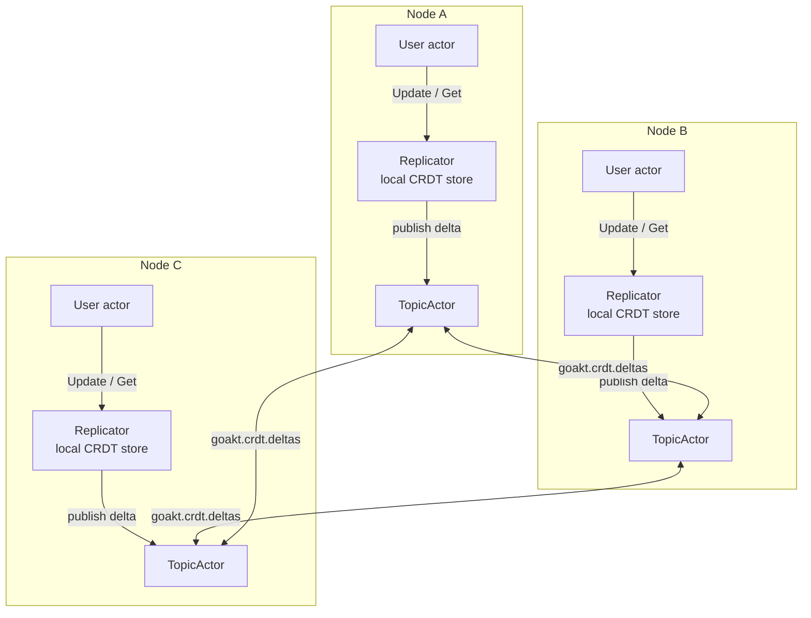
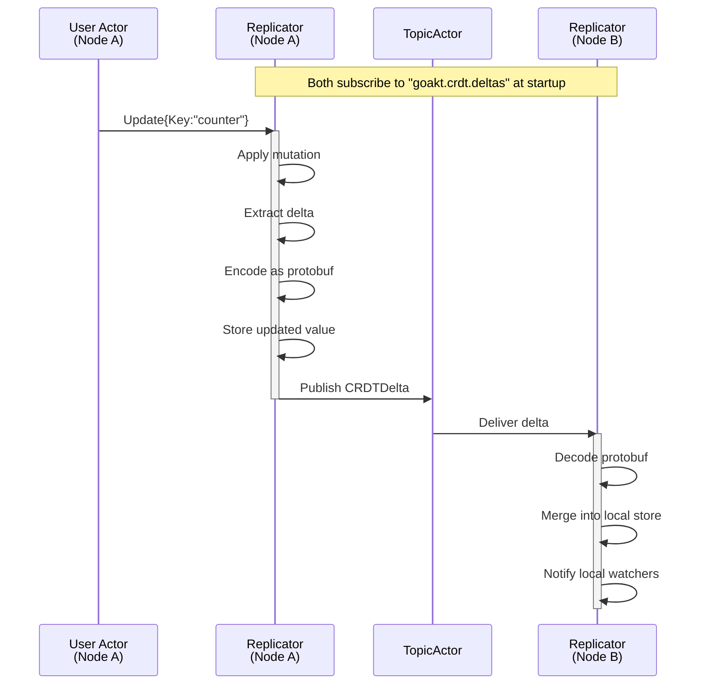

**Distributed Data** provides replicated data structures (**Conflict-free Replicated Data Types (CRDTs)**) that can be
updated independently on any node and are guaranteed to converge to a consistent state. No coordination, no locks, no
consensus rounds.

This enables use cases like distributed counters, cluster-wide session registries, feature flags, and shopping carts
where every node can read and write locally with immediate response, and all nodes converge automatically. With
**multi-datacenter** cluster configuration and `WithDataCenterReplication`, the same CRDTs can also replicate **across**
datacenters (leader batch flush over remoting), while each DC keeps its own cluster and TopicActor fan-out.

## Architecture

Each node in the cluster runs its own **Replicator** system actor (`GoAktReplicator`). There is no central coordinator:
each Replicator owns its node's local CRDT store and communicates with peer Replicators via GoAkt's existing
[TopicActor](/advanced/pubsub) pub/sub system.


```mermaid
graph TB
    subgraph A["Node A"]
        UA["User actor"] -->|Update / Get| RA["Replicator<br/>local CRDT store"]
        RA -->|publish delta| TA["TopicActor"]
    end

    subgraph B["Node B"]
        UB["User actor"] -->|Update / Get| RB["Replicator<br/>local CRDT store"]
        RB -->|publish delta| TB["TopicActor"]
    end

    subgraph C["Node C"]
        UC["User actor"] -->|Update / Get| RC["Replicator<br/>local CRDT store"]
        RC -->|publish delta| TC["TopicActor"]
    end

    TA <-->|goakt.crdt.deltas| TB
    TB <-->|goakt.crdt.deltas| TC
    TA <-->|goakt.crdt.deltas| TC
```

### Data flow

**Step 1: Subscription at startup.** When a Replicator starts (in `PostStart`), it subscribes to the well-known topic
`goakt.crdt.deltas` via the TopicActor. This is a one-time operation: there is no per-key subscription. Every delta for
every key flows through this single topic.

**Step 2: Local update.** A user actor sends an `Update` message to its local Replicator. The Replicator applies the
mutation to its local CRDT store, extracts the delta, encodes it as a protobuf `CRDTDelta` message (which includes the
key ID, data type, origin node, and serialized delta state), and publishes it to the shared topic via the TopicActor.

**Step 3: Dissemination.** The TopicActor delivers the protobuf delta to all subscribers of `goakt.crdt.deltas`: which
is the Replicator on every other node. The TopicActor handles serialization (protobuf), remote TCP delivery, and
deduplication. This is not a Replicator concern.

**Step 4: Remote merge.** Each peer Replicator receives the protobuf delta, decodes it back to the CRDT type, ignores it
if the origin is itself, and merges it into its local store using the type's merge function. If the merge changes the
value, it notifies any local user actors watching that key.


```mermaid
sequenceDiagram
    participant UA as User Actor<br/>(Node A)
    participant RA as Replicator<br/>(Node A)
    participant TA as TopicActor
    participant RB as Replicator<br/>(Node B)

    Note over RA,RB: Both subscribe to "goakt.crdt.deltas" at startup

    UA->>RA: Update{Key:"counter"}
    activate RA
    RA->>RA: Apply mutation
    RA->>RA: Extract delta
    RA->>RA: Encode as protobuf
    RA->>RA: Store updated value
    RA->>TA: Publish CRDTDelta
    deactivate RA
    TA->>RB: Deliver delta
    activate RB
    RB->>RB: Decode protobuf
    RB->>RB: Merge into local store
    RB->>RB: Notify local watchers
    deactivate RB
```

Both Replicators are **equal participants**: they both subscribe to the same topic and both can publish to it. There is
no publisher/subscriber distinction. When Node B updates the same key, the flow is identical with roles reversed.

**Anti-entropy** runs periodically as a safety net. Each Replicator sends a digest to a random peer: one entry per key
with a **content hash** of its value. The peer answers with its full state of every key whose hash differs from its own
and of every key the sender does not have, and the sender merges the answer. The digest also carries the tombstones the
sender retains, and the answer the peer's tombstones for keys the digest listed, so a deletion either side knows of
reaches the other. Both also carry the time from which their sender knows every deletion, which resolves the stale keys of a
node back from a long absence (see [Tombstone window](#tombstone-window)). Every node pulls this way on its own
schedule, so any two nodes end up holding the merge of their states. This ensures convergence even if some deltas were
lost during a network partition.

The content hash is canonical: two replicas that hold the same state compute the same hash, whatever the order of the
updates and merges that produced it. A merge that leaves the hash unchanged, such as a delta delivered twice or the
state of a peer that is behind, changes nothing: it does not notify watchers.

<Note>
During a rolling upgrade, a node that predates the content hash sends digests without it. For those entries a
Replicator falls back to comparing its per-key version counter with the peer's, as before.
</Note>

## CRDT types

All types implement the `ReplicatedData` interface and are **immutable values**: every mutation returns a new value plus
a delta. Values stored in generic CRDT types (`LWWRegister`, `ORSet`, `MVRegister`, `ORMap`) are typed as `any` and
serialized over the wire using a composite Proto+CBOR serializer. Go primitives (`string`, `int`, `bool`, etc.) work out
of the box; custom struct types require CBOR registration via `remote.WithSerializers`.

- **GCounter**: Description: Grow-only counter. Each node maintains its own increment slot; value = sum of all slots.
  Primary use cases: Monotonic metrics, event counts.
- **PNCounter**: Description: Positive-negative counter. Two GCounters: one for increments, one for decrements. Primary
  use cases: Rate limiters, gauges, inventory.
- **LWWRegister**: Description: Last-writer-wins register. Stores a single value (`any`) with a timestamp. Primary use
  cases: Configuration, feature flags.
- **ORSet**: Description: Observed-remove set. Supports add and remove without conflict (add-wins semantics). Elements
  are `any`. Primary use cases: Session tracking, subscriptions.
- **ORMap**: Description: Map where keys (`any`) are an OR-Set and values are themselves CRDTs. Primary use cases:
  Shopping carts, user profiles.
- **Flag**: Description: Boolean that can only transition from `false` to `true`. Primary use cases: One-time signals,
  feature activation.
- **MVRegister**: Description: Multi-value register. Concurrent writes are preserved, not overwritten. Values are `any`.
  Primary use cases: Conflict-visible state.

### Keys

CRDT keys are **serializable** and carry the CRDT data type for wire-level validation.

```go Keys
var (
    requestCount   = crdt.PNCounterKey("request-count")
    activeSessions = crdt.ORSetKey("active-sessions")
    featureFlag    = crdt.LWWRegisterKey("dark-mode")
    cartItems      = crdt.ORMapKey("cart")
)
```

## Enabling CRDTs

CRDT replication is enabled through `ClusterConfig.WithCRDT(...)`. When not enabled, no Replicator is spawned: zero
overhead.

```go Enabling CRDTs
clusterConfig := actor.NewClusterConfig().
    WithDiscovery(discoveryProvider).
    WithCRDT(
        crdt.WithAntiEntropyInterval(30 * time.Second),
        crdt.WithPruneInterval(5 * time.Minute),
        crdt.WithTombstoneTTL(24 * time.Hour),
    )

system, _ := actor.NewActorSystem("my-system",
    actor.WithCluster(clusterConfig),
)
```

### Configuration options

- **WithAntiEntropyInterval**: Interval between anti-entropy digest exchanges with a random peer. Default: 30s.
- **WithMaxDeltaSize**: Maximum serialized delta size per publish; larger deltas trigger full-state transfer. Default:
  64KB.
- **WithPruneInterval**: Interval for pruning expired tombstones and compacting CRDTs. Default: 5m.
- **WithTombstoneTTL**: How long deletion tombstones are retained to prevent key resurrection. Default: 24h.
- **WithCoordinationTimeout**: Timeout for coordinated `WriteTo`/`ReadFrom` operations. Default: 5s.
- **WithRole**: Restrict CRDT replication to nodes with this role. Default: _(all nodes)_.
- **WithSnapshotInterval**: Interval for periodic BoltDB snapshots (requires `WithSnapshotDir`). Default: _(disabled)_.
- **WithSnapshotDir**: Directory for snapshot files. Default: _(disabled)_.
- **WithDataCenterReplication**: Enable cross-DC batch flush from the cluster leader’s Replicator (requires
  `WithDataCenter` on the cluster). Default: _(off)_.
- **WithDataCenterReplicationInterval**: How often the leader flushes buffered deltas/tombstones to remote DCs. Default:
  5s.
- **WithDataCenterAntiEntropy**: Enable periodic cross-DC digest exchange (leader only). Default: _(off)_.
- **WithDataCenterAntiEntropyInterval**: Interval between cross-DC anti-entropy rounds. Default: 2m.
- **WithDataCenterSendTimeout**: Per-attempt timeout for cross-DC `RemoteLookup` + `RemoteTell`. Default: 10s.

## Multi-datacenter replication

When you run **one GoAkt cluster per datacenter**, CRDT deltas still replicate **inside** each cluster via TopicActor.
To **also** replicate across DCs, enable multi-DC on the cluster and cross-DC CRDT on the CRDT config.

**Requirements**

- `ClusterConfig.WithDataCenter(...)` with a validated `datacenter.Config` (control plane + local `DataCenter`
  metadata).
- `ClusterConfig.WithCRDT(...)` including `crdt.WithDataCenterReplication()` (and optional anti-entropy / interval /
  send-timeout options).

**Behavior**

- Every node runs a Replicator; only the **cluster leader** periodically sends a protobuf `CRDTDeltaBatch` (buffered
  deltas and tombstones, origin DC, send timestamp) to remote DCs using the DC controller’s `ActiveRecords()` and
  remoting.
- The buffer holds **one entry per key**: a further change of a key is merged into the pending one, and a deletion
  replaces it. Its size is bounded by the number of keys changed since the last successful flush.
- The leader tracks what **each** remote DC has accepted. On every tick a DC is sent only the entries it has not
  accepted yet, and nothing when it is up to date. A DC that could not be reached is sent its entries again on the next
  tick; the DCs that accepted theirs are not. An entry leaves the buffer once every remote DC on record has accepted
  it.
- A DC that leaves the records stops holding entries back; one that appears is sent everything still pending. A node
  that becomes the leader sends everything it has pending to every DC, which is harmless because merges and deletions
  are idempotent.
- Remote Replicators apply the batch locally; those updates then spread **within** that DC through the usual
  `goakt.crdt.deltas` topic.
- A remote Replicator applies the tombstones of a batch before its deltas. A key that was deleted and, after its
  tombstone expired, created again travels as both, and the receiver ends up with the new value only.
- Optional **cross-DC anti-entropy** sends a digest to a random remote DC on a slower schedule, similar in spirit to
  intra-DC anti-entropy.

`crdt.DCMajority` and `crdt.DCAll` exist for future **coordinated** read/write across DCs; today, use `Majority` / `All`
for intra-cluster coordination only.

```go Multi-datacenter replication
dcCfg := datacenter.NewConfig()
dcCfg.ControlPlane = controlPlane
dcCfg.DataCenter = datacenter.DataCenter{Name: "dc-west", Region: "us-west-2", Zone: "us-west-2a"}

clusterConfig := actor.NewClusterConfig().
    WithDiscovery(discoveryProvider).
    WithDataCenter(dcCfg).
    WithCRDT(
        crdt.WithAntiEntropyInterval(30 * time.Second),
        crdt.WithDataCenterReplication(),
        crdt.WithDataCenterReplicationInterval(5 * time.Second),
        // optional:
        // crdt.WithDataCenterAntiEntropy(),
        // crdt.WithDataCenterAntiEntropyInterval(2 * time.Minute),
        // crdt.WithDataCenterSendTimeout(10 * time.Second),
    )
```

## Using the Replicator

The Replicator PID is accessed via `ActorSystem.Replicator()`. It returns `nil` if CRDTs are not enabled. All
interaction uses standard `Tell` and `Ask` from within an actor's `Receive` handler.

### Writing data

Send an `Update` to the Replicator. The `Modify` function receives the current value as `ReplicatedData`: use a type
assertion to access the concrete type.

```go Writing data
func (a *RateLimiter) Receive(ctx *actor.ReceiveContext) {
    switch ctx.Message().(type) {
    case *IncomingRequest:
        replicator := ctx.ActorSystem().Replicator()
        ctx.Tell(replicator, &crdt.Update{
            Key:     crdt.PNCounterKey("request-count"),
            Initial: crdt.NewPNCounter(),
            Modify: func(current crdt.ReplicatedData) crdt.ReplicatedData {
                return current.(*crdt.PNCounter).Increment(ctx.ActorSystem().PeersAddress(), 1)
            },
        })
    }
}
```

- **Key**: Key identifying the CRDT.
- **Initial**: Zero value used if the key does not yet exist.
- **Modify**: Function that receives the current `ReplicatedData` and returns the updated value.
- **WriteTo**: _(optional)_ Coordination level: `crdt.Majority` or `crdt.All`.

### Reading data

Send a `Get` to the Replicator. The response's `Data` field is `ReplicatedData`: use a type assertion to access the
concrete type.

```go Reading data
func (a *Dashboard) Receive(ctx *actor.ReceiveContext) {
    switch ctx.Message().(type) {
    case *RefreshMetrics:
        replicator := ctx.ActorSystem().Replicator()
        reply := ctx.Ask(replicator, &crdt.Get{
            Key: crdt.PNCounterKey("request-count"),
        }, time.Second)
        if resp, ok := reply.(*crdt.GetResponse); ok && resp.Data != nil {
            a.currentCount = resp.Data.(*crdt.PNCounter).Value()
        }
    }
}
```

- **Key**: Key to read.
- **ReadFrom**: _(optional)_ Coordination level: `crdt.Majority` or `crdt.All`.

### Subscribing to changes

Actors can watch keys and receive `Changed` notifications whenever the value changes: from local updates or peer deltas.
Each `Changed` carries the `Key` that changed and its current `Data`, so one actor can watch several keys and tell them
apart with `msg.Key.ID()`. When a watched key is deleted, the watcher receives a `Deleted` carrying the `Key`. It stays
subscribed, and receives `Changed` again if the key is created after its tombstone has expired.

```go Subscribing to changes
func (a *SessionMonitor) Receive(ctx *actor.ReceiveContext) {
    switch msg := ctx.Message().(type) {
    case *actor.PostStart:
        replicator := ctx.ActorSystem().Replicator()
        if replicator != nil {
            ctx.Tell(replicator, &crdt.Subscribe{
                Key: crdt.ORSetKey("active-sessions"),
            })
        }
    case *crdt.Changed:
        if set, ok := msg.Data.(*crdt.ORSet); ok {
            log.Printf("active sessions updated: %v", set.Elements())
        }
    case *crdt.Deleted:
        log.Printf("active sessions deleted: %s", msg.Key.ID())
    }
}
```

### Deleting data

```go Deleting data
ctx.Tell(replicator, &crdt.Delete{
    Key:     crdt.ORSetKey("active-sessions"),
    WriteTo: crdt.Majority, // optional coordination
})
```

Deletion removes the key from the local store and publishes a tombstone to all peers. Tombstones are retained for the
configured TTL and pruned periodically. While a tombstone is active, updates for that key are rejected to prevent
resurrection.

Each node sends `Deleted` to its watchers of the key when it removes its copy: at once on the node that deleted it, when
the tombstone arrives on its peers, and after the cross-DC flush or anti-entropy round that brings the deletion in
another datacenter. A node that does not hold the key sends nothing, and a deletion is announced once per node.

## Consistency model

### Default: local-first

Every operation is **local-first** by default:

- **Writes** apply the mutation locally and publish the delta asynchronously. The Replicator returns immediately.
- **Reads** return the local value immediately.

This is eventually consistent, with convergence bounded by TopicActor delivery latency (typically sub-second in a
healthy cluster).

### Optional coordination

When stronger guarantees are needed, set `WriteTo` or `ReadFrom` on the message:

- **_(not set)_**: `WriteTo` behavior: Apply locally + publish via TopicActor. `ReadFrom` behavior: Return local value.
- **Majority**: `WriteTo` behavior: Apply locally + send delta to N/2+1 peers + wait for acks. `ReadFrom` behavior:
  Query N/2+1 peers, merge results with local value.
- **All**: `WriteTo` behavior: Apply locally + send delta to all peers + wait for acks. `ReadFrom` behavior: Query all
  peers, merge results with local value.

When `ReadFrom: Majority` and `WriteTo: Majority` are used together, the system provides **strong eventual consistency
with read-your-writes** guarantees.

`crdt.DCMajority` and `crdt.DCAll` are reserved for future cross-DC coordinated operations; today they do not add remote
DC fan-out beyond normal local apply + TopicActor publish.

## Durable snapshots

By default, the CRDT store is purely in-memory. If the Replicator crashes, state is rebuilt from peers via anti-entropy.
For faster recovery, enable **durable snapshots** to persist the store to BoltDB periodically.

```go Durable snapshots
crdt.WithSnapshotInterval(1 * time.Minute),
crdt.WithSnapshotDir("/var/data/goakt/crdt-snapshots"),
```

When enabled:

- The Replicator saves the full store to BoltDB at the configured interval.
- On startup (or supervisor restart), the Replicator restores from the latest snapshot before participating in
  anti-entropy.
- A final snapshot is persisted during graceful shutdown. The snapshot file is retained on disk so the Replicator can
  restore quickly on the next startup.

Snapshots are a **recovery optimization**, not a durability guarantee. The source of truth is always the distributed
CRDT state across all peers. If a snapshot is lost or corrupted, the Replicator rebuilds from peers.

## Observability

When `WithMetrics()` is enabled on the actor system, the Replicator registers OpenTelemetry instruments:

- **crdt.replicator.store.size**: Type: Int64ObservableGauge. Description: Number of CRDT keys in the local store.
- **crdt.replicator.merge.count**: Type: Int64ObservableCounter. Description: Total merges performed from peer deltas.
- **crdt.replicator.delta.publish.count**: Type: Int64ObservableCounter. Description: Deltas published via TopicActor.
- **crdt.replicator.delta.receive.count**: Type: Int64ObservableCounter. Description: Deltas received from peers.
- **crdt.replicator.coordinated.write.count**: Type: Int64ObservableCounter. Description: Coordinated write operations.
- **crdt.replicator.coordinated.read.count**: Type: Int64ObservableCounter. Description: Coordinated read operations.
- **crdt.replicator.antientropy.count**: Type: Int64ObservableCounter. Description: Anti-entropy rounds completed.
- **crdt.replicator.tombstone.count**: Type: Int64ObservableGauge. Description: Active tombstones pending pruning.
- **crdt.replicator.crossdc.send.count**: Type: Int64ObservableCounter. Description: Delta batches sent to remote DCs
  (leader).
- **crdt.replicator.crossdc.receive.count**: Type: Int64ObservableCounter. Description: Delta batches received from
  remote DCs.
- **crdt.replicator.crossdc.replication.lag**: Type: Int64ObservableGauge. Description: Lag (ms) from last received
  cross-DC batch.
- **crdt.replicator.crossdc.stale.skip.count**: Type: Int64ObservableCounter. Description: Flushes skipped due to stale
  DC cache.

All instruments carry an `actor.system` attribute with the actor system name.

## Full example

A complete working example: a `SessionTracker` actor that uses an ORSet to maintain a cluster-wide set of active
sessions, and a `SessionReporter` that watches for changes.

```go Full example
package main

import (
    "context"
    "fmt"
    "log"
    "time"

    "github.com/tochemey/goakt/v4/actor"
    "github.com/tochemey/goakt/v4/crdt"
    "github.com/tochemey/goakt/v4/discovery"
)

// -- Keys (defined once, typically package-level) --

var sessionsKey = crdt.ORSetKey("active-sessions")

// -- Messages --

type AddSession struct{ SessionID string }
type RemoveSession struct{ SessionID string }
type PrintSessions struct{}

// -- SessionTracker: writes to the distributed set --

type SessionTracker struct{}

func (a *SessionTracker) PreStart(*actor.Context) error  { return nil }
func (a *SessionTracker) PostStop(*actor.Context) error  { return nil }

func (a *SessionTracker) Receive(ctx *actor.ReceiveContext) {
    replicator := ctx.ActorSystem().Replicator()
    if replicator == nil {
        return
    }

    switch msg := ctx.Message().(type) {
    case *AddSession:
        nodeID := ctx.ActorSystem().PeersAddress()
        ctx.Tell(replicator, &crdt.Update{
            Key:     sessionsKey,
            Initial: crdt.NewORSet(),
            Modify: func(current crdt.ReplicatedData) crdt.ReplicatedData {
                return current.(*crdt.ORSet).Add(nodeID, msg.SessionID)
            },
        })
    case *RemoveSession:
        ctx.Tell(replicator, &crdt.Update{
            Key:     sessionsKey,
            Initial: crdt.NewORSet(),
            Modify: func(current crdt.ReplicatedData) crdt.ReplicatedData {
                return current.(*crdt.ORSet).Remove(msg.SessionID)
            },
        })
    case *PrintSessions:
        reply := ctx.Ask(replicator, &crdt.Get{
            Key: sessionsKey,
        }, time.Second)
        if resp, ok := reply.(*crdt.GetResponse); ok && resp.Data != nil {
            set := resp.Data.(*crdt.ORSet)
            fmt.Printf("active sessions: %v\n", set.Elements())
        }
    }
}

// -- SessionReporter: watches for changes --

type SessionReporter struct{}

func (a *SessionReporter) PreStart(*actor.Context) error  { return nil }
func (a *SessionReporter) PostStop(*actor.Context) error  { return nil }

func (a *SessionReporter) Receive(ctx *actor.ReceiveContext) {
    switch msg := ctx.Message().(type) {
    case *actor.PostStart:
        replicator := ctx.ActorSystem().Replicator()
        if replicator != nil {
            ctx.Tell(replicator, &crdt.Subscribe{
                Key: sessionsKey,
            })
        }
    case *crdt.Changed:
        if set, ok := msg.Data.(*crdt.ORSet); ok {
            log.Printf("[reporter] sessions changed: %v (count=%d)",
                set.Elements(), set.Len())
        }
    case *crdt.Deleted:
        log.Printf("[reporter] sessions deleted")
    }
}

// -- Main --

func main() {
    ctx := context.Background()

    // Replace with your discovery provider (NATS, Kubernetes, etc.)
    // See: /clustering/service-discovery
    var discoveryProvider discovery.Provider

    clusterConfig := actor.NewClusterConfig().
        WithDiscovery(discoveryProvider).
        WithKinds(&SessionTracker{}, &SessionReporter{}).
        WithCRDT(
            crdt.WithAntiEntropyInterval(30 * time.Second),
            crdt.WithPruneInterval(5 * time.Minute),
        )

    system, _ := actor.NewActorSystem("session-app",
        actor.WithCluster(clusterConfig),
    )
    _ = system.Start(ctx)
    defer system.Stop(ctx)

    // Spawn actors
    tracker, _ := system.Spawn(ctx, "tracker", &SessionTracker{})
    _, _ = system.Spawn(ctx, "reporter", &SessionReporter{})

    // Simulate usage
    _ = actor.Tell(ctx, tracker, &AddSession{SessionID: "sess-abc"})
    _ = actor.Tell(ctx, tracker, &AddSession{SessionID: "sess-def"})
    time.Sleep(time.Second)
    _ = actor.Tell(ctx, tracker, &PrintSessions{})

    // On other nodes, the SessionReporter will receive Changed notifications
    // as deltas replicate via TopicActor.
}
```

## Limitations

CRDTs are a powerful tool for distributed state, but they are not a silver bullet. Be aware of the following limitations
before choosing this approach.

### Eventual consistency only

CRDTs guarantee **convergence**, not immediate consistency. If your domain requires strong consistency (e.g., financial
transactions, inventory with strict accuracy), CRDTs are not the right fit. The optional `WriteTo`/`ReadFrom`
coordination levels (`Majority`, `All`) improve consistency guarantees but still do not provide linearizability.

### Not intended for big data

The CRDT subsystem is designed for moderate working sets, not billions of entries:

- **All data is held in memory.** The in-memory store (`map[string]crdt.ReplicatedData`) is bounded only by the Go
  runtime's memory limits. There is no disk-backed storage for the working set: snapshots are a recovery optimization,
  not a storage tier.
- **New node convergence cost.** When a new node joins the cluster, it starts with an empty store and catches up via
  anti-entropy (periodic digest exchange with random peers, default every 30 seconds). All existing nodes collaborate,
  but transferring a large number of entries takes time proportional to the store size.
- **No built-in entry count limit.** There is no enforced ceiling, but as a practical guideline, keep the number of
  top-level keys reasonable for your cluster size and network bandwidth. Tens of thousands of keys is fine; millions
  will strain anti-entropy and increase convergence time for new nodes.

### Full-state transfer for large values

When a data entry is changed, the Replicator publishes a **delta** (incremental change) to peers. However, the full
state of the entry is replicated in several situations:

- The serialized delta exceeds `MaxDeltaSize` (default 64KB): the Replicator falls back to full-state transfer.
- During anti-entropy, when a peer's value of a key differs from the local one.
- When new nodes join and need to catch up from scratch.

This means you should avoid very large individual CRDT values (e.g., an ORSet with millions of elements), because
full-state replication of those values will produce large messages on the wire.

### CRDT garbage accumulation

Some CRDT types accumulate metadata that grows over the lifetime of the system:

- **GCounter and PNCounter** keep a counter slot per node ID. If many nodes are added and removed over time, the counter
  maps retain entries for every node that ever incremented them. There is currently **no automatic pruning of departed
  node slots** from counters: these entries persist indefinitely. For long-running clusters with high node churn, this
  can become a source of unbounded (though individually small) memory growth.
- **ORSet and ORMap** track causal dots (one per unique add operation). Periodic compaction (`Compactable` interface)
  reduces redundant dots by keeping only the highest counter per node, but the number of distinct node entries still
  grows with cluster membership history.

The Replicator runs a **prune cycle** (default every 5 minutes) that handles tombstone expiry and CRDT compaction, but
does not yet implement full removed-node pruning (reassigning departed node state to a surviving node). This is a known
gap and is planned for a future release.

### Single-topic dissemination

All deltas for all keys flow through one TopicActor topic (`goakt.crdt.deltas`). This simplifies the protocol but means
a high update rate on many keys produces proportional TopicActor throughput. For most workloads this is not a
bottleneck.

### Cross-datacenter replication caveats

Cross-DC replication depends on the **DC control plane** (for active DC records), **cluster leadership** (only the
leader sends batches), and **WAN** latency. If the control plane is unavailable or the DC cache is stale, cross-DC flush
pauses and the pending changes wait in the buffer, one entry per key, until a flush reaches every remote DC; intra-DC
replication continues. Tune `WithDataCenterSendTimeout`, replication interval, and datacenter
`FailOnStaleCache` for your SLOs.

### Tombstone window

Deleted keys are protected by a tombstone for the configured TTL (default 24 hours). While a node retains the tombstone,
anti-entropy carries the deletion to every peer it exchanges with, in both directions of a round: a node that missed the
tombstone itself drops the key on its next round with a node that has it. This also holds across datacenters when
cross-DC anti-entropy is on.

A node that comes back after a longer absence, restored from its snapshot or kept running through a partition, can still
hold a key deleted while it was away, whose tombstone no node retains any more. Each Replicator records the last time it
heard from a peer, and saves it with its snapshot. When it hears from a peer again after a gap longer than the TTL, or is
restored from a snapshot taken longer than the TTL before, the keys it held before the gap and has not updated since are
**stale**. It does not send a stale key to its peers, neither in anti-entropy nor in coordinated reads, and holds its
cross-datacenter replication, until the stale keys are resolved. Its own reads still return them.

- Each digest carries the time from which its sender knows every deletion, and nodes pass the earliest such time on to
  each other. A peer that was in the cluster for the whole gap, or that took its time from one that was, resolves the
  stale keys: a stale key that peer holds is kept, and one it does not hold was deleted during the gap and is removed.
- When every current peer that runs a Replicator has sent a digest and none could resolve the stale keys, as when the
  whole cluster was down for longer than the TTL, the stale keys are kept.
- A key the returning node updates, or receives from a peer in a delta or an anti-entropy answer, is no longer stale.

Stale keys need anti-entropy: with `WithAntiEntropyInterval(0)`, no key is marked stale.

Some cases remain outside the TTL:

- A cluster that splits into two groups of two or more nodes, both running apart for longer than the TTL. Every node
  keeps hearing from a peer, so none has stale keys, and each group brings back the keys the other deleted when they
  merge.
- A key deleted and then created again after the TTL is merged with the old copy a returning node holds, because the
  peer that resolves its stale keys holds the key.
- A key created on a node just before it lost contact, and that never reached a peer, is removed when that node returns
  after the TTL.
- A key the returning node updates is no longer stale, so if it was deleted while the node was away it comes back with
  the node's old value merged into the update.
- A digest or a batch from another datacenter also counts as contact. A node cut off from its own datacenter but still
  reached from another one does not mark its keys stale, and a node of another datacenter can resolve them.

Set `WithTombstoneTTL` to outlast the longest partition you want to tolerate, and keep node clocks in sync: staleness
compares times taken on different nodes.

<Note>
During a rolling upgrade, a node that predates stale keys sends digests without the time, so it never resolves the
stale keys of another node; they are kept once every peer has been heard from. A snapshot written by such a node has no
last contact, so a node restored from it is treated as never having been away.
</Note>

### Value serialization

CRDT values are serialized using a composite Proto+CBOR serializer. Go primitives (`string`, `int`, `bool`, `float64`,
etc.) and `proto.Message` types work out of the box. Custom struct types must be registered via
`remote.WithSerializers(new(MyType), remote.NewCBORSerializer())`.

### No partial updates

The `Modify` function in `Update` receives the full current value and must return the full updated value. There is no
patch or field-level delta mechanism.
