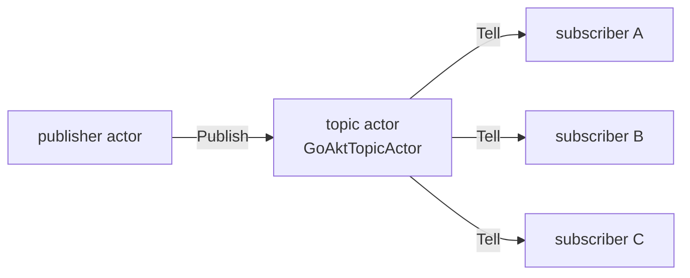
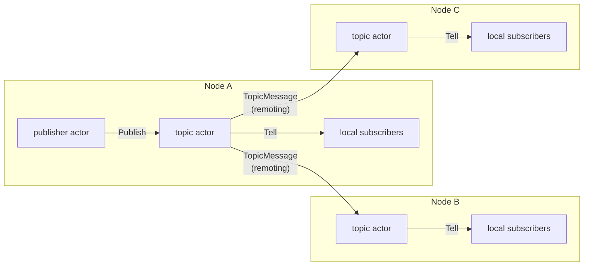

**PubSub** enables application-level topic-based messaging. Actors subscribe to named topics and receive messages
published to those topics by other actors. This is **separate from the event stream**, which only handles system and
cluster events (see [Event Streams](/advanced/event-streams)).

## Architecture

Each node runs one **topic actor** (`GoAktTopicActor`). Local actors subscribe to and publish through their **local**
topic actor. The topic actor maintains a registry of topics and their local subscribers.

### Standalone mode



Publishers send `Publish` to the local topic actor. The topic actor delivers the message to all local subscribers via
`Tell`.

### Cluster mode

In a cluster, each node has its own topic actor. **Topic actors communicate with each other** to disseminate messages.
When a publish occurs:

1. The publisher sends `Publish` to its local topic actor.
2. The local topic actor delivers to its local subscribers.
3. The local topic actor sends a `TopicMessage` (serialized) to each peer node's topic actor via remoting.
4. Each remote topic actor receives the `TopicMessage`, deserializes it, and delivers to **its** local subscribers.



**Key point:** Subscribers always register with their **local** topic actor. Topic actors are responsible for cross-node
dissemination; application actors never talk to remote topic actors directly.

## When to use

- Decouple publishers from subscribers: publishers do not need to know who is listening
- Broadcast application events (e.g. order created, inventory updated) to multiple actors
- Event-driven architectures where actors react to domain events

## Enabling PubSub

The **topic actor** is spawned when either:

- `WithPubSub()` is passed when creating the actor system, or
- Cluster mode is enabled (`WithCluster`)

```go Enabling PubSub
system, _ := actor.NewActorSystem("app", actor.WithPubSub())
// or: actor.WithCluster(config); topic actor is spawned when cluster is enabled
```

## Topic actor

- **ActorSystem.TopicActor**: Returns the topic actor's PID. Use to send Subscribe, Unsubscribe, Publish.

The topic actor has a reserved name (`GoAktTopicActor`). From within an actor, use `ctx.ActorSystem().TopicActor()`.
From outside (e.g. `main`), use `system.TopicActor()`. Returns `nil` if PubSub is not enabled.

## Subscribe and Unsubscribe

Actors send messages to the **local** topic actor to subscribe or unsubscribe from topics:

- **Subscribe**: Constructor: `actor.NewSubscribe`. Purpose: Subscribe this actor to a topic. Sender receives
  `SubscribeAck` on success.
- **Unsubscribe**: Constructor: `actor.NewUnsubscribe`. Purpose: Unsubscribe from a topic. Sender receives
  `UnsubscribeAck` on success.

The topic actor watches subscribers. When a subscriber terminates, it is automatically removed from all topics.

```go Subscribe and Unsubscribe
ctx.Tell(ctx.ActorSystem().TopicActor(), actor.NewSubscribe("orders"))
// later: ctx.Tell(ctx.ActorSystem().TopicActor(), actor.NewUnsubscribe("orders"))
```

## Publish

- **Publish**: Constructor: `actor.NewPublish`. Purpose: Publish a message to all subscribers of the topic. `id` is a
  unique message ID for deduplication.

```go Publish
msg := actor.NewPublish(uuid.New().String(), "orders", orderEvent)
ctx.Tell(ctx.ActorSystem().TopicActor(), msg)
```

Subscribers receive the message as a normal `Receive` invocation: the payload is the published `message`, not a wrapper.

## Cluster behavior

- **Local delivery:** The topic actor that receives the `Publish` delivers to its local subscribers immediately.
- **Remote dissemination:** The topic actor sends a serialized `TopicMessage` to each peer's topic actor via remoting.
  Each peer's topic actor deserializes and delivers to its local subscribers.
- **Deduplication:** Uses sender ID, topic, and message ID to avoid processing the same message twice (e.g. when a topic
  actor receives a `TopicMessage` from multiple paths).

## Deduplication retention

The topic actor remembers recently delivered message identifiers so it can suppress duplicate deliveries. This state is
bounded by a **retention window**: each entry expires after the window elapses, keeping memory flat under sustained,
high-rate publishing instead of growing for the lifetime of the actor system.

The window defaults to 2 minutes and is configurable with `WithMessageRetention`:

```go Deduplication retention
system, _ := actor.NewActorSystem("app",
    actor.WithPubSub(),
    actor.WithMessageRetention(5*time.Minute),
)
```

<Note>
  A duplicate that arrives after the retention window has elapsed may be redelivered, which is acceptable under
  at-least-once delivery. Size the window to the largest plausible redelivery delay for your transport (network retries
  and cross-node dissemination), not to your total publish volume.
</Note>

## Example

```go Example
// Subscriber actor
func (a *OrderLogger) Receive(ctx *ReceiveContext) {
    switch msg := ctx.Message().(type) {
    case *PostStart:
        ctx.Tell(ctx.ActorSystem().TopicActor(), actor.NewSubscribe("orders"))
    case *OrderCreated:
        log.Printf("order created: %s", msg.ID)
    case *actor.UnsubscribeAck:
        // unsubscribed
    }
}

// Publisher actor
func (a *OrderService) Receive(ctx *ReceiveContext) {
    switch msg := ctx.Message().(type) {
    case *CreateOrder:
        order := a.createOrder(msg)
        pub := actor.NewPublish(order.ID, "orders", order)
        ctx.Tell(ctx.ActorSystem().TopicActor(), pub)
    }
}
```

## Topic statistics

`ActorSystem.TopicStats` returns a read-only, point-in-time snapshot of a topic's subscription state, without ever
exposing subscriber identities. `TopicStats` is immutable and exposes its values through accessor methods:

- `Topic() string` is the topic these stats describe.
- `LocalSubscriberCount() int32` is the number of subscribers registered on **this node's** topic actor for the topic.
- `TopicInstanceCount() int32` is the number of topic-actor instances (nodes) cluster-wide that currently have at least
  one subscriber for the topic.

```go Topic statistics
stats, err := system.TopicStats(ctx, "orders", 5*time.Second)
if err != nil {
    // handle error
}
fmt.Printf("local=%d instances=%d\n", stats.LocalSubscriberCount(), stats.TopicInstanceCount())
```

In cluster mode, the local node's topic actor answers with its own local subscriber count and fans a lightweight query
out to every peer's topic actor to determine how many of them also have subscribers. Peers answer with their local view
only and never fan the query out any further, which avoids query storms. Outside cluster mode, `TopicInstanceCount` is
simply 0 or 1 depending on whether this node has local subscribers.

<Note>
  `TopicStats` is an eventually consistent, point-in-time snapshot with no delivery guarantee: subscribers may join or
  leave between the query and the response.
</Note>

<Warning>
  `TopicStats` prefers an explicit failure over an inconsistent count. In cluster mode, if any peer cannot be reached
  within `timeout`, the whole call returns an error rather than a silently undercounted `TopicInstanceCount`. Retry the
  query, or treat the error as "cluster state is currently in flux".
</Warning>

`TopicStats` requires the topic actor to be running (`WithPubSub()` or clustering enabled); otherwise it returns
`ErrTopicActorNotStarted`.

## Event stream vs PubSub

- **Purpose**: Event stream: System and cluster observability. PubSub: Application-level event distribution.
- **Topics**: Event stream: Fixed internal topic. PubSub: Application-defined topics.
- **Publishers**: Event stream: Framework (PID, cluster, dead-letter). PubSub: Your actors.
- **Subscribers**: Event stream: External (monitoring, logging). PubSub: Your actors.
- **API**: Event stream: `Subscribe` / `Unsubscribe`. PubSub: Messages to `TopicActor`.
- **Option**: Event stream: Always present. PubSub: `WithPubSub` or cluster.
