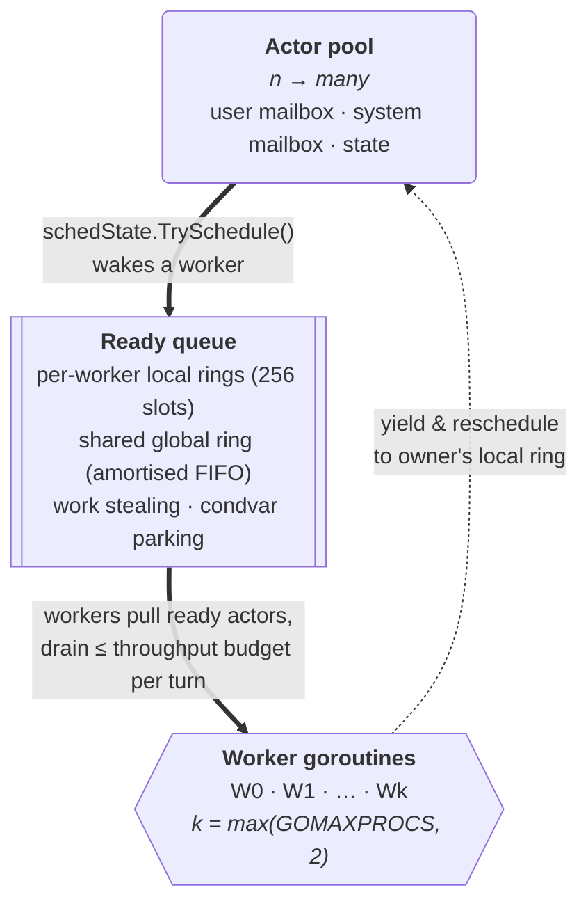
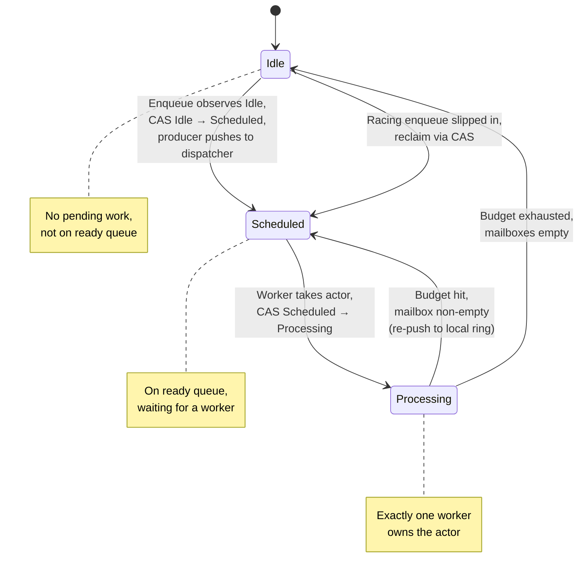

GoAkt processes actor messages on a **fixed pool of worker goroutines** that cooperatively multiplex the entire actor population. Each `ActorSystem` owns one `dispatcher`. When an actor receives a message, it is scheduled onto a shared ready queue; a worker pulls it off, drains up to a configurable throughput budget, and yields back so other actors get a turn.

This is the Akka / Pekko / Erlang / Orleans pattern adapted for Go: the worker count is bounded by `GOMAXPROCS`, independent of the actor count. Actors become units of work on a scheduler rather than units that each own a goroutine — making `runtime.NumGoroutine()` stable at `workerCount + O(1)` no matter how many actors are active.



The public API is untouched: `Tell`, `Ask`, `Spawn`, `Actor.Receive`, `PreStart`, `PostStop`, mailboxes — all unchanged. The dispatcher lives below `PID.doReceive` and is an implementation detail of the actor package.

## Components

| File                      | Responsibility                                                                    |
| ------------------------- | --------------------------------------------------------------------------------- |
| `actor/dispatcher.go`     | Worker pool, lifecycle (`start` / `stop` / `signalStop`), `schedule` entry point. |
| `actor/worker.go`         | Worker goroutine loop, local-queue reschedule helper.                             |
| `actor/ready_queue.go`    | Per-worker ring buffers, global overflow ring, work stealing, condvar parking.    |
| `actor/dispatch_state.go` | Three-state atomic machine (`Idle` / `Scheduled` / `Processing`) per actor.       |
| `actor/pid.go`            | `schedulable.runTurn` implementation, mailbox split, `doReceive` enqueue path.    |

### The `schedulable` contract

The worker is agnostic to the actor state machine. `ready_queue.go` defines:

```go
type schedulable interface {
    runTurn(w *worker)
}
```

`PID` and `grainPID` both implement `runTurn`. This keeps the dispatcher a reusable scheduling primitive; any future schedulable (e.g. timers, stream stages) can plug in without touching the worker loop.

## Actor state machine

Each `PID` carries a lock-free `schedState` with three values:



**Invariant:** at most one worker holds an actor in `Processing`. Enforced by the `Scheduled → Processing` CAS at the top of `runTurn`; this preserves the single-threaded-per-actor execution guarantee that user code relies on.

`TrySchedule` reads the state before attempting the CAS. Under N-way parallel `Tell` to the same actor, the hot cache line is read in shared mode by N-1 losers; an unconditional CAS would force request-for-ownership traffic on every call.

## Enqueue path

`PID.doReceive` is the unified enqueue entry point:

```go
func (pid *PID) doReceive(receiveCtx *ReceiveContext) {
    msg := receiveCtx.Message()
    // ...stopping guard...
    if isControlMessage(msg) {
        _ = pid.systemMailbox.Enqueue(receiveCtx)
    } else if err := pid.mailbox.Enqueue(receiveCtx); err != nil {
        pid.handleReceivedError(receiveCtx, err)
        return
    }
    if pid.schedState.TrySchedule() {
        pid.dispatcher.schedule(pid)
    }
}
```

`isControlMessage` routes `PoisonPill`, `Panicking`, `Pause/ResumePassivation`, `PanicSignal`, `Terminated`, and `SendDeadletter` to the system mailbox. All other messages go to the user mailbox. `AsyncRequest` / `AsyncResponse` are _not_ control messages — they participate in the reentrancy stash and must keep FIFO order with user traffic.

The hot path is one atomic read, one CAS, one mailbox op, and — for the first producer that wins the `Idle → Scheduled` transition — one global-queue push with condvar signal.

## Worker turn

The worker drains system messages first, then user messages, up to the throughput budget:

```go
func (pid *PID) runTurn(w *worker) {
    if !pid.schedState.TakeForProcessing() {
        return
    }
    budget := w.dispatcher.throughput
    for range budget {
        if sysMsg := pid.systemMailbox.Dequeue(); sysMsg != nil {
            pid.dispatchOne(sysMsg, now)
            continue
        }
        received := pid.mailbox.Dequeue()
        if received == nil {
            if pid.finishOrReclaim() {
                return
            }
            continue
        }
        pid.dispatchOne(received, now)
    }
    pid.schedState.YieldToScheduled()
    w.reschedule(pid)
}
```

Two correctness details worth calling out:

- **`dispatchOne` returns a `retained` flag.** The reentrancy-stash path holds on to the `ReceiveContext` beyond the turn, so the caller must _not_ return it to the pool in that case.
- **`finishOrReclaim` closes the enqueue/finish race.** After a drained dequeue, it stores `Idle`, re-reads both mailboxes, and — if a concurrent `doReceive` slipped a message in between the last dequeue and the state store — attempts `TrySchedule` followed by `TakeForProcessing` to reclaim ownership within the current turn.

When the budget is exhausted and work remains, the actor yields to `Scheduled` and is re-pushed onto the owning worker's local ring via `worker.reschedule`. Yielded actors land at the **tail** of the local ring, behind any other scheduled actor, guaranteeing forward progress for peers.

## Ready queue

`readyQueue` combines per-worker local rings with a shared global ring and condvar parking. The take priority is: own local → global → steal from siblings → park.

| Layer             | Purpose                                                                                                |
| ----------------- | ------------------------------------------------------------------------------------------------------ |
| **Local rings**   | Each worker owns a mutex-guarded 256-slot ring. Push/pop FIFO from the owner's side.                   |
| **Global ring**   | Shared amortised-FIFO ring (initial cap 64, doubles on overflow). Overflow + producer pushes.          |
| **Work stealing** | When local and global are empty, rotate through siblings and steal half of the first non-empty victim. |
| **Parking**       | When no work is found anywhere, park on `readyQueue.cond`. Producers signal only when `parked > 0`.    |

A lock-free `globalCount` atomic mirrors `global.size` so workers can skip the mutex on the fast path when the global ring is known empty. Sibling-steal probes use the victim's own atomic size counter to avoid acquiring every sibling's mutex during a scan.

`stealHalf` moves half the victim's contents into the thief's ring under pointer-ordered locking (`lockOrder`) to avoid deadlock when two workers steal from each other simultaneously.

## System-message priority

Control-plane messages cannot queue behind a user-message backlog. Every actor has two mailboxes:

- `systemMailbox` — unbounded, holds control messages. Always consulted first inside the budget loop.
- `mailbox` — the user mailbox, unchanged from the public `Mailbox` contract.

This is the same split used by Akka and Pekko. A `PoisonPill` delivered to an actor with 10,000 user messages queued shuts the actor down after at most one additional user message, not 10,000.

User-provided custom mailboxes continue to work: they sit in the `mailbox` slot and are not aware of the system mailbox.

## Lifecycle

| Phase           | Behaviour                                                                                                           |
| --------------- | ------------------------------------------------------------------------------------------------------------------- |
| **Start**       | `dispatcher.start()` spawns worker goroutines. Idempotent. Must run before the first schedule.                      |
| **Shutdown**    | `dispatcher.stop()` closes the ready queue and blocks on the worker WaitGroup. Not safe from within a worker turn.  |
| **Signal stop** | `signalStop()` closes the queue and wakes all parked workers without blocking. Safe from inside a receive handler.  |
| **Restart**     | `PID` restart spins on `schedState != Processing` before reinitialising, since the MPSC mailbox is single-consumer. |

PoisonPill delivery is preserved during shutdown: the system-message path is drained at turn time, so actors still process their final lifecycle messages even as the system unwinds.

## Observable guarantees

The dispatcher pool preserves every semantic that user code relies on:

- **Single-threaded actor execution.** The `Scheduled → Processing` CAS guarantees at most one worker holds an actor at a time.
- **FIFO within a producer.** Messages `m1, m2, m3` sent by the same producer to the same actor are dequeued in order.
- **`PreStart` / `PostStop` contract.** Run exactly once per lifecycle, inside a turn on whichever worker happens to own the actor.
- **Reentrancy stash.** Unchanged; reentrance happens within a single worker's call stack for one actor.
- **Panic recovery.** `defer recover()` inside `dispatchOne`, same as before.
- **Supervision.** Supervisor directives run on the parent's turn after the child's `Panicking` message reaches the parent's system mailbox.

The only externally-visible change is `runtime.NumGoroutine()`: it now returns `workerCount + O(1)` instead of scaling with active-actor count.

## Tuning constants

| Constant                | Value                  | Where                                             |
| ----------------------- | ---------------------- | ------------------------------------------------- |
| Worker pool size        | `max(GOMAXPROCS, 2)`   | `dispatcherWorkerCount` in `actor/dispatcher.go`  |
| Throughput budget       | `32` (default)         | `dispatcherThroughput` in `actor/dispatcher.go`   |
| Local-ring capacity     | `256`                  | `localQueueCap` in `actor/ready_queue.go`         |
| Global-ring initial cap | `64` (doubles on grow) | `globalQueueInitialCap` in `actor/ready_queue.go` |

The worker count is floored at 2 so work-stealing always has at least one sibling to probe. The throughput budget is chosen to amortise Go's park/unpark cost over a meaningful batch while still bounding the blocking window a single actor can impose on its peers.

### Tuning the throughput budget

The per-turn message budget is the one knob exposed to users, via `WithThroughputBudget` on `NewActorSystem`:

```go
system, err := NewActorSystem("my-system",
    WithLogger(logger),
    WithThroughputBudget(64), // prefer aggregate throughput over strict fairness
)
```

| Value          | Profile                                                                                                           |
| -------------- | ----------------------------------------------------------------------------------------------------------------- |
| `8`–`16`       | Latency-critical systems with many small actors (control planes, request routing).                                |
| `32` (default) | Balanced setting suitable for most mixed workloads.                                                               |
| `64`           | Safe upgrade for throughput-oriented systems. Typically ~5–15% gain on message-heavy workloads.                   |
| `128`          | Ingest and aggregation (log pipelines, event firehoses, batch processors).                                        |
| `256`+         | Synthetic benchmarks or pathological single-hot-actor workloads only. Throughput flattens and tail latency grows. |

Per-actor FIFO ordering and the single-threaded-per-actor execution invariant hold regardless of the budget — a yield is a pause, not a reorder.

## References

- [Akka Dispatchers](https://doc.akka.io/docs/akka/current/typed/dispatchers.html)
- [Pekko Dispatchers](https://pekko.apache.org/docs/pekko/current/typed/dispatchers.html)
- [Erlang/OTP scheduler](https://www.erlang.org/blog/a-closer-look-at-the-erlang-vm/)
- [Microsoft Orleans schedulers](https://learn.microsoft.com/en-us/dotnet/orleans/implementation/scheduler)
- [Tokio work-stealing scheduler](https://tokio.rs/blog/2019-10-scheduler)

## See also

- [Architecture Overview](/architecture/overview) — bird's-eye view of the system
- [Code Map](/architecture/code-map) — package layout and file-level responsibilities
- [Design Decisions](/architecture/design-decisions) — rationale for architectural choices
- Full design document: [`architecture/DISPATCHER_POOL_DESIGN.md`](https://github.com/tochemey/goakt/blob/main/architecture/DISPATCHER_POOL_DESIGN.md)
