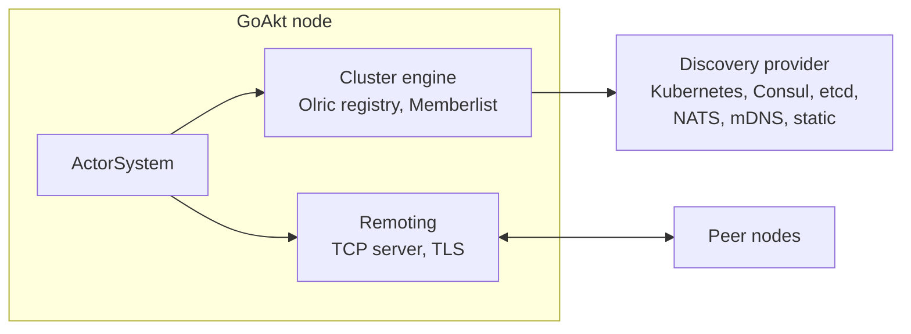

## Bird's eye view

GoAkt is a framework for building **concurrent, distributed, and fault-tolerant systems** in Go using the actor model.
Every unit of computation is an **actor**: a lightweight, isolated entity that communicates exclusively through
messages. The [Actor System](/actor/actor-system) is the top-level runtime that hosts actors and orchestrates messaging,
clustering, and lifecycle.

## Three deployment modes

- **Standalone**: Single process. Actors communicate in-process.
- **Clustered**: Multiple nodes. Discovery via Consul, etcd, Kubernetes, NATS, mDNS, or static. Location-transparent
  actors.
- **Multi-Datacenter**: Multiple clusters across DCs. Pluggable control plane (NATS JetStream or etcd). DC-aware
  placement.

## Core building blocks

- **Reactive stream**: Composable `stream.Source` → `Flow` stages → `Sink` pipelines, materialized with
  `RunnableGraph.Run` on an `ActorSystem`. Stages run as actors with demand-driven backpressure. See
  [Streams](/advanced/streams).
- **CRDT / Replicator**: Conflict-free replicated data types (`crdt` package), merged by a per-node **Replicator**
  system actor. Replication is **eventually consistent**: separate from the Olric actor/grain registry (quorum-strong).
  See [Distributed data](/advanced/distributed-data).

## Cluster architecture

**Placement and membership** state (which actors and grains live where) is stored in Olric (distributed hash map) with
configurable quorum. Node membership uses Hashicorp Memberlist. **CRDT application state** (when enabled via
`ClusterConfig.WithCRDT`) is replicated separately by the **Replicator** actor using delta broadcast over the topic bus:
not through Olric DMap writes.

## Deep dives

The following pages describe the internal architecture of each major subsystem:

- **Scheduler**: Page: [Dispatcher Pool](/architecture/dispatcher-pool). What it covers: Fixed worker pool, actor state
  machine, ready queue, work stealing, system-message priority, throughput tuning.
- **Context pools**: Page: [Context Pools](/architecture/context-pools). What it covers: Sharded lock-free
  `ReceiveContext` / `GrainContext` recycling, MPMC rings, ABA safety, pairwise Tell as the scaling surface.

## See also

- [Actor Model](/actor/actor-model): actor hierarchy and message flow
- [Code Map](/architecture/code-map): package layout and file-level responsibilities
- [Design Decisions](/architecture/design-decisions): rationale behind architectural choices
