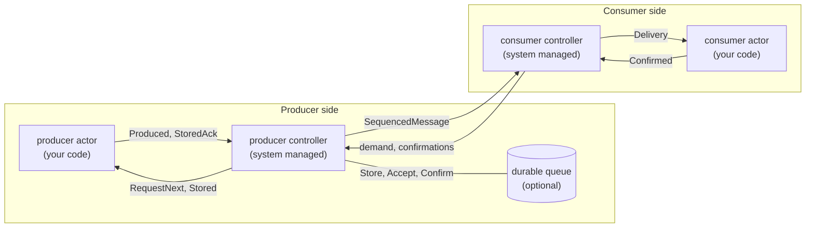
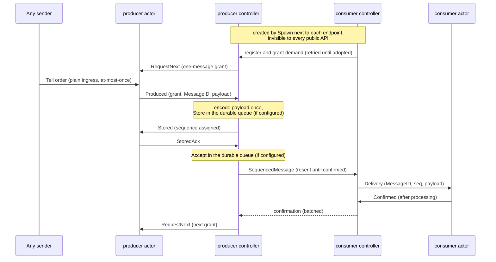
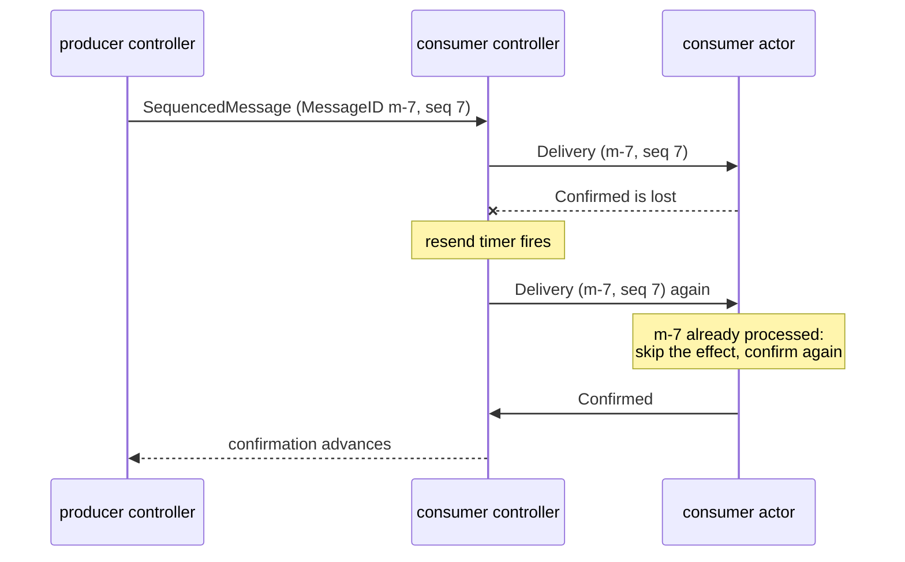
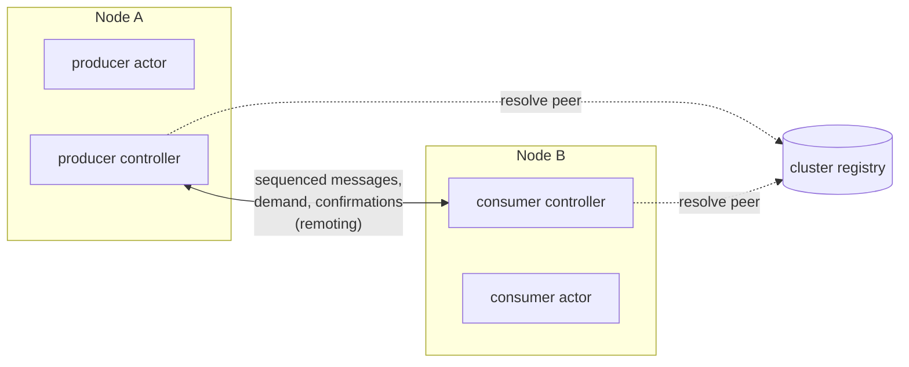
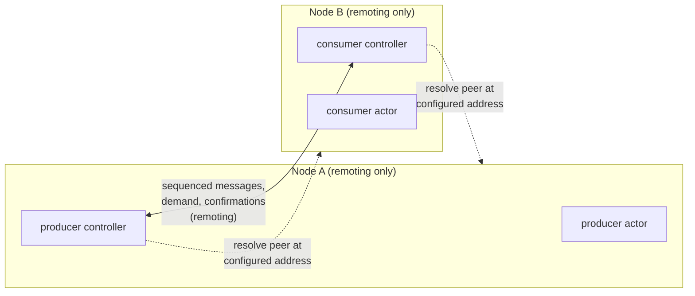
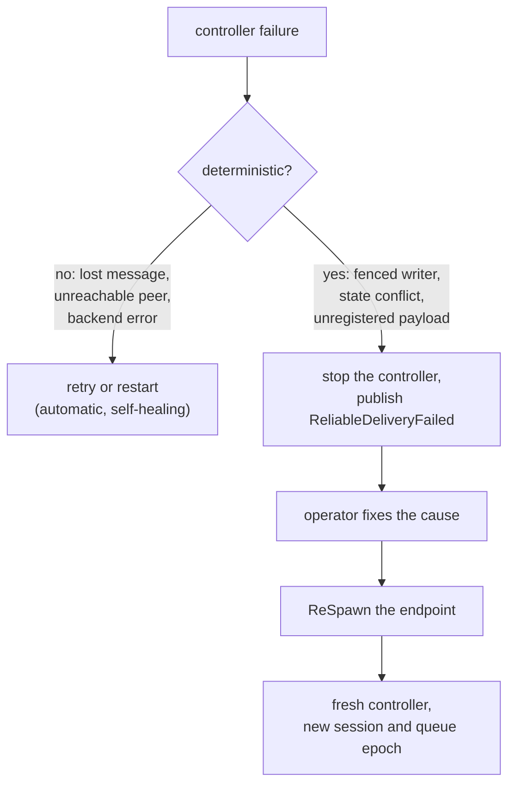

Ordinary GoAkt messaging is at-most-once: a **Tell** that races a crash, a full bounded mailbox, or a network fault is lost. The **point-to-point** reliable delivery pattern adds a confirmed, ordered, flow-controlled flow between exactly two of your actors, a producer and a consumer. Default **Tell** semantics are unchanged; reliability applies only to flows you explicitly configure.

You enable a flow with one spawn option per side. The actor system then creates and manages an internal controller next to each endpoint. The controllers sequence messages, grant send credit, resend after loss, deduplicate after restarts, and optionally persist producer state in a durable queue. Your actors stay ordinary actors: anyone can message them, and only a small handshake connects them to the flow.

## Use cases

Reach for point-to-point reliable delivery when one actor must hand work to another and the default at-most-once semantics are not enough:

- **Message loss is unacceptable.** Two specific actors need at-least-once or effectively-once processing instead of best-effort **Tell**. A checkout actor handing accepted orders to a fulfillment processor is the running example on this page: every order must arrive, in order, exactly once in effect, across restarts, redeploys, and node loss.
- **Flow-controlled producer-consumer pipelines.** A fast producer risks overwhelming a slower consumer or saturating the network. The producer sends only when its controller grants demand through `RequestNext`, so the consumer-side buffer stays bounded no matter how fast the producer runs and mailboxes never grow without limit.
- **Ordered, sequential processing.** Deliveries arrive in sequence order, and the next message reaches the consumer only after the current one is confirmed; the consumer controller buffers anything that arrives in the meantime. A coordinator streaming jobs to a worker knows each job was processed, not merely enqueued, before the next one lands.
- **Cross-node event forwarding.** An actor on one cluster node feeds an actor on another, and the receiver must see every event in order even though the network hop is lossy.
- **Crash-resilient handoff.** With a durable queue on the producer side, messages that were stored but not yet confirmed are redelivered after a producer crash, restart, or relocation. Combined with an idempotent consumer, this gives outbox-style, crash-surviving handoff between two parts of your system without operating an external broker.

It is the wrong tool for fan-out to many receivers (use [PubSub](/advanced/pubsub)), for request-response (use `Ask`), and for best-effort telemetry where plain `Tell` is enough.

## How it works

One flow connects one producer to one consumer. The actor system spawns an internal controller next to each endpoint; your actors talk only to their own controller, and the controllers run the protocol between themselves:



The producer controller sends only when the consumer controller has granted demand, sequences every message, and resends until the consumer confirms. Registration, session management, resends, and deduplication after restarts are entirely the controllers' job. The full path of one message:



## Guarantees

| Condition                                     | Guarantee                                                                                    |
| --------------------------------------------- | -------------------------------------------------------------------------------------------- |
| Neither side crashes, controllers connected   | Effectively-once, in order, within the consumer-driven flow-control window                   |
| Message loss or consumer-side restart         | At-least-once; the consumer handler must be idempotent                                       |
| Producer-side restart without a durable queue | Messages already handed to the controller but unconfirmed are lost; the flow resumes cleanly |
| Producer-side restart with a durable queue    | Stored messages reload and redeliver; unacknowledged submissions are resubmitted             |

Effectively-once holds only on the fault-free path. Any lost message, restart, or relocation legitimately redelivers, so consumer processing must always be idempotent. The framework never claims exactly-once business effects; see [Deduplication](#deduplication-and-exactly-once-effects) for how to build them.

Confirmation is business-level. The consumer confirms after processing a delivery, not when it is enqueued, and a delivery is retried until confirmed. It is never dropped, skipped, or marked successful without confirmation.

The guarantee begins at the producer's handoff to its controller, and with a durable queue at the point the message is stored. The hop into the producer is ordinary at-most-once messaging. A producer that needs ingress reliability feeds itself from its own durable source, as described in [Durable delivery](#durable-delivery).

## Enabling a flow

Each side names its peer's actor name. There are no controller names or handles anywhere in your code.

```go
publisher, err := system.Spawn(ctx, "order-publisher", &OrderPublisher{},
    actor.AsReliableProducer("order-processor"))
if err != nil {
    return err
}

_, err = system.Spawn(ctx, "order-processor", &OrderProcessor{},
    actor.AsReliableConsumer("order-publisher",
        actor.WithReliableFlowControlWindow(50)))
if err != nil {
    return err
}
```

<Note>
The controllers carry internal, activation-scoped identities under the reserved `GoAkt` prefix. They are invisible to `Actors`, `ActorOf`, `Kill`, `ReSpawn`, and every other actor-management API, and they impose no naming convention on your own actors.
</Note>

Both options reject finite passivation: reliable endpoints are long-lived.

## The producer contract

The producer buffers incoming work and answers three protocol messages:

- `RequestNext` grants one tokenized send permission. Hold the grant until there is something to send; it never expires.
- Answer a grant with exactly one `Produced`, built with `actor.NewProduced`. A retried grant carrying a token you already answered must receive the same `Produced` again, never a second message.
- `Stored` acknowledges your submission. Reply with `actor.NewStoredAck`.

```go
type pendingOrder struct {
    messageID string
    order     *OrderCreated // a protobuf message, or a type with a registered serializer
}

type OrderPublisher struct {
    controller   *actor.PID
    grant        *actor.RequestNext
    pending      []pendingOrder
    lastToken    string
    lastProduced *actor.Produced
}

func (x *OrderPublisher) PreStart(*actor.Context) error { return nil }
func (x *OrderPublisher) PostStop(*actor.Context) error { return nil }

func (x *OrderPublisher) Receive(ctx *actor.ReceiveContext) {
    switch msg := ctx.Message().(type) {
    case *OrderCreated:
        // business ingress: any actor or handler may Tell the producer.
        // The MessageID is generated once, when work enters the buffer.
        x.pending = append(x.pending, pendingOrder{
            messageID: uuid.NewString(),
            order:     msg,
        })

        x.flush(ctx)

    case *actor.RequestNext:
        // honor credit only from this endpoint's own controller
        if !msg.IsAuthorizedFor(ctx.Self(), ctx.Sender()) {
            return
        }

        x.controller = ctx.Sender()

        // a retried grant of an answered token receives the same Produced
        if msg.Token() == x.lastToken && x.lastProduced != nil {
            ctx.Tell(x.controller, x.lastProduced)
            return
        }

        x.grant = msg
        x.flush(ctx)

    case *actor.Stored:
        ack, err := actor.NewStoredAck(msg)
        if err != nil {
            ctx.Err(err)
            return
        }

        ctx.Tell(ctx.Sender(), ack)
    }
}

// flush spends the held grant on the oldest pending order.
func (x *OrderPublisher) flush(ctx *actor.ReceiveContext) {
    if x.grant == nil || len(x.pending) == 0 {
        return
    }

    head := x.pending[0]
    produced, err := actor.NewProduced(x.grant, head.messageID, head.order)
    if err != nil {
        ctx.Err(err)
        return
    }

    x.pending = x.pending[1:]
    x.lastToken = x.grant.Token()
    x.lastProduced = produced
    x.grant = nil
    ctx.Tell(x.controller, produced)
}
```

The `IsAuthorizedFor` check matters: `RequestNext` grants the right to hand over a business message, so honoring a spoofed grant would let another actor pull work out of your producer.

Backpressure surfaces in the `pending` buffer. A slow consumer means the buffer grows; bounding or shedding it is an application policy decision.

## Knowing when the consumer confirmed

By default the producer learns that a message was stored, never that it was processed. Enable `WithReliableDeliveryConfirmation` and the controller tells the producer a `DeliveryConfirmed` for every message the consumer confirms:

```go
publisher, err := system.Spawn(ctx, "order-publisher", &OrderPublisher{},
    actor.AsReliableProducer("order-processor",
        actor.WithReliableDeliveryConfirmation()))
```

The producer records who should hear back when the work arrives, for example a `submitters map[string]*actor.PID` field keyed by `MessageID` and filled in the `*OrderCreated` case. The handler then relays with any message your submitter understands:

```go
case *actor.DeliveryConfirmed:
    if !msg.IsAuthorizedFor(ctx.Self(), ctx.Sender()) {
        return
    }

    if submitter, ok := x.submitters[msg.MessageID()]; ok {
        delete(x.submitters, msg.MessageID())
        ctx.Tell(submitter, &OrderProcessed{OrderId: msg.MessageID()})
    }
```

The notification stops at the producer. The flow never learns who submitted the work, because work enters the producer through an ordinary `Tell` that carries no reply address, so relaying the outcome to the original submitter is your code, using correlation the producer recorded at ingress.

<Warning>
Treat `DeliveryConfirmed` idempotently, keyed by `MessageID`, exactly as the consumer treats `Delivery`. It carries no protocol obligation and is not retried: a full producer mailbox or a controller restart can drop it, and a message that is redelivered and confirmed again is reported again. When you need a durable record of what completed, use a durable queue rather than counting notifications.
</Warning>

## Feeding the flow

The producer is a normal actor, so work reaches it like any other message: from application code with `actor.Tell`, from another actor's `Receive`, or from a remote node. Nothing in the sender knows reliable delivery exists:

```go
// CheckoutActor hands finished orders to the reliable flow the same way it
// would message any other actor.
type CheckoutActor struct {
    producer *actor.PID // bound at construction, like any actor dependency
}

func (x *CheckoutActor) Receive(ctx *actor.ReceiveContext) {
    switch msg := ctx.Message().(type) {
    case *CheckoutCompleted:
        ctx.Tell(x.producer, &OrderCreated{OrderId: msg.OrderId})
    }
}
```

If the origin actor needs to know its order was processed, carry the correlation in the payload, for example the order ID and the origin's actor name, and have the consumer notify it through ordinary messaging after processing. The flow itself offers no reply path: `Delivery`'s sender is the controller, never the business origin.

## The consumer contract

The consumer processes each `Delivery` idempotently, then confirms to the sender:

```go
type OrderProcessor struct {
    seen map[string]bool
}

func (x *OrderProcessor) PreStart(*actor.Context) error {
    x.seen = make(map[string]bool)
    return nil
}

func (x *OrderProcessor) PostStop(*actor.Context) error { return nil }

func (x *OrderProcessor) Receive(ctx *actor.ReceiveContext) {
    switch msg := ctx.Message().(type) {
    case *actor.Delivery:
        // accept deliveries only from this endpoint's own controller
        if !msg.IsAuthorizedFor(ctx.Self(), ctx.Sender()) {
            return
        }

        if !x.seen[msg.MessageID()] {
            x.seen[msg.MessageID()] = true
            order := msg.Payload().(*OrderCreated)
            x.process(order)
        }

        confirmed, err := actor.NewConfirmed(msg)
        if err != nil {
            ctx.Err(err)
            return
        }

        ctx.Tell(ctx.Sender(), confirmed)
    }
}
```

Confirm only after processing. Confirming early converts every later fault into silent message loss.

## One-way flows and Ask

Every hop inside the machinery is a `Tell`; the flow carries one-way, ordered, confirmed transfers. `Ask` still works at the edges with bounded meaning:

- A caller may `Ask` the producer, but the producer can only answer from local knowledge, such as "accepted into my buffer". `Stored` acknowledges controller storage; it is not consumer confirmation. When the producer needs to know the consumer confirmed, enable `WithReliableDeliveryConfirmation` and handle `DeliveryConfirmed` (see [Knowing when the consumer confirmed](#knowing-when-the-consumer-confirmed)). Relaying that signal to an original submitter remains application code: `Ask` at the edge still cannot mean "delivered".
- The consumer cannot reply to the original submitter through the flow, because `Delivery`'s sender is the controller. Carry correlation in the payload and reply through ordinary messaging, use `DeliveryConfirmed` at the producer when a completion signal is enough, or run a second flow in the opposite direction when the reply itself must be reliable.

## Payload serialization

Every reliable payload is encoded before it is sequenced or stored, even on a single node, using the same serializer dispatch as remoting. Protobuf payloads work with no configuration. Any other payload type must be registered:

```go
system, err := actor.NewActorSystem("orders",
    actor.WithRemote(remote.NewConfig("127.0.0.1", 9090,
        remote.WithSerializables(new(Order)))))
```

<Warning>
Protobuf payloads need no setup. Non-protobuf payloads currently require `WithRemote` for serializer registration even when the flow never leaves the node, and that also enables remoting and binds the configured listener.
</Warning>

An unregistered payload type is a terminal flow failure, not a retried one: encoding is deterministic, so the producer controller stops and publishes a failure event instead of retrying forever. See [Failure handling](#failure-handling-and-recovery).

## Large messages

One reliable payload rides one remoting transport frame. The remoting `maxFrameSize` cap is 16 MiB, and an oversized frame closes the connection without an error frame, so a large reliable payload can wedge the flow in a resend loop that kills the connection on every attempt. Enable chunking when payloads may approach that bound or monopolize a shared connection:

```go
publisher, err := system.Spawn(ctx, "order-publisher", &OrderPublisher{},
    actor.AsReliableProducer("order-processor",
        actor.WithReliableChunking(256*1024)))
```

The size must be in [`MinReliableChunkSize`, `MaxReliableChunkSize`] (1 KiB through 16 MiB minus envelope headroom). Each chunk consumes one sequence number; the consumer controller reassembles before `Delivery`, so your consumer still sees one business message. A message must fit in the consumer's flow-control window worth of chunks: the consumer confirms nothing mid-message, so a message needing more chunks than the window can never drain. A violation fails the flow terminally and names the remedy (raise `WithReliableFlowControlWindow` or the chunk size).

With a durable queue, the producer controller stores the whole chunked message through `StoreChunked` so a crash mid-message cannot mix two encodings of the same payload. A resubmission after a producer crash recovers the stored shape even when the re-encoded payload crosses the chunk threshold in either direction: the first write stays authoritative. Queue implementors must treat the batch as atomic; see [Durable delivery](#durable-delivery). The derived chunk identities live in a reserved namespace: an application `MessageID` must not start with `GoAktChunk:`, and `NewProduced` rejects one that does.

## Durable delivery

Without a durable queue, a producer-side restart loses the messages already handed to the controller but not yet confirmed. To survive producer crashes, attach a `DurableProducerQueue`:

```go
publisher, err := system.Spawn(ctx, "order-publisher", &OrderPublisher{},
    actor.AsReliableProducer("order-processor",
        actor.WithReliableDurableQueue(queue),
        actor.WithReliableQueueRetry(3, 100*time.Millisecond)))
```

The queue is a pluggable contract you implement against your own store:

```go
type DurableProducerQueue interface {
    extension.Dependency

    // Load restores state at controller (re)start and acquires exclusive
    // writership; the returned epoch fences every earlier writer.
    Load(ctx context.Context) (DurableQueueState, QueueEpoch, error)

    // Store durably records one message, indexed by MessageID and sequence.
    // The first write for a MessageID is authoritative; retries return it. A
    // MessageID whose retained first write is a chunked batch returns
    // ErrQueueChunkedBatch without appending: the controller recovers the
    // batch through a StoreChunked retry.
    Store(ctx context.Context, epoch QueueEpoch, request StoreRequest) (StoreResult, error)

    // StoreChunked durably records every chunk of one business message in one
    // atomic unit. First-write-wins applies to the whole batch keyed by the
    // business MessageID; chunk entries use reserved derived MessageIDs
    // (GoAktChunk:<index>/<count>:<businessMessageID>).
    StoreChunked(ctx context.Context, epoch QueueEpoch, requests []StoreRequest) ([]StoreResult, error)

    // Accept records that the producer durably removed the submission from
    // its own recoverable source. For a chunked batch, messageID is the
    // business MessageID and covers every derived chunk identity.
    Accept(ctx context.Context, epoch QueueEpoch, messageID string) error

    // Confirm durably advances the highest consumer-confirmed sequence.
    Confirm(ctx context.Context, epoch QueueEpoch, upToSeq int64) error
}
```

The contract in brief: all operations are linearizable; `Load` returns a new positive epoch that fences every earlier one, and stale writers receive `ErrQueueFenced`; the first `Store` / `StoreChunked` for a business `MessageID` wins, so retries and nondeterministic serializers cannot create conflicts; a `Store` addressing a `MessageID` owned by a retained chunked batch returns `ErrQueueChunkedBatch` so the controller can recover the batch instead of appending a duplicate; state integrity violations return `ErrQueueConflict`; other backend errors are retried under `WithReliableQueueRetry`. The full contract is documented on the interface.

A producer backed by its own recoverable source completes the loop: it durably marks or removes the submission before replying `StoredAck`, and after a crash it resubmits every unmarked item with its original `MessageID`. The queue's first-write ownership then guarantees one durable sequence per message.

<Warning>
A durable flow performs `Store` plus `Accept` before granting the next credit: roughly two durable backend round trips per message, plus amortized `Confirm` writes. Backend latency directly bounds per-flow throughput. Scale horizontally with multiple independent flows.
</Warning>

## Deduplication and exactly-once effects

`MessageID` is the canonical deduplication key. The producer generates it once, when work enters its pending buffer, and it identifies the same business message across retries, controller restarts, sessions, and durable recovery. `Seq` only orders messages within one sequencing history.

Redelivery is normal, not exceptional. A lost confirmation is indistinguishable from a lost delivery, so the consumer controller resends and the consumer sees the same message twice:



`MessageID` also closes the ambiguous-acceptance window: if the producer crashes after the controller stored a message but before the handshake completed, resubmitting under the same `MessageID` returns the original sequence instead of storing a duplicate.

For exactly-once business effects, the consumer must commit the `MessageID` and the business mutation in one transaction:

```go
tx, err := db.BeginTx(ctx, nil)
// insert the MessageID into a processed-messages table with a unique key,
// apply the business mutation, commit; a duplicate key means already processed
```

An in-memory `seen` map, as in the example above, deduplicates within one consumer lifetime only.

## Configuration

| Option                     | Side     | Default           | Meaning                                                                                          |
| -------------------------- | -------- | ----------------- | ------------------------------------------------------------------------------------------------ |
| `WithReliableFlowControlWindow`    | Consumer | 50                | Demand granted per request and the consumer-side buffer capacity; maximum 10,000                 |
| `WithReliableResendInterval`       | Consumer | 2s                | Consumer controller tick: re-registration and resend cadence                                     |
| `WithReliableDurableQueue`         | Producer | none              | Durable queue for producer-crash survival                                                        |
| `WithReliableQueueRetry`           | Producer | 3 attempts, 100ms | Durable operation retries before the controller raises a reliability error                       |
| `WithReliableRetryInterval`   | Producer | 500ms             | `RequestNext` and `Stored` retry cadence toward the producer actor                               |
| `WithReliableChunking`             | Producer | off               | Split large payloads into sequenced chunks; size in [`MinReliableChunkSize`, `MaxReliableChunkSize`]             |
| `WithReliableDeliveryConfirmation` | Producer | off               | Tell the producer a `DeliveryConfirmed` when the consumer confirms a message                     |
| `WithReliableRemoteConsumer`       | Producer | none              | Remoting address of the node hosting the consumer endpoint in a remoting-only flow               |
| `WithReliableRemoteProducer`       | Consumer | none              | Remoting address of the node hosting the producer endpoint in a remoting-only flow               |

The flow-control window bounds how far the producer may run ahead of confirmations. The producer controller never sends beyond the granted demand, which keeps the consumer-side buffer bounded regardless of producer speed.

## Clustered flows

A flow can cross nodes in one of two modes: both systems join the same GoAkt cluster and resolve each other through its registry, or both run remoting-only and name each other's address explicitly (see [Remoting-only flows](#remoting-only-flows)). This section covers cluster mode, where controller discovery and endpoint relocation use the cluster registry. Remote placement of a reliable endpoint on a remoting-only system fails fast with `ErrReliableClusterRequired` instead of spawning a flow that never connects:



The spawn calls are unchanged; each node spawns its endpoint and the controllers find each other through the registry:

```go
// node A
publisher, err := producerSystem.Spawn(ctx, "order-publisher", &OrderPublisher{},
    actor.AsReliableProducer("order-processor"))

// node B
_, err = consumerSystem.Spawn(ctx, "order-processor", &OrderProcessor{},
    actor.AsReliableConsumer("order-publisher"))
```

Requirements:

- Register the payload types on every node.
- A durable queue is a serializable dependency: register its type on every node eligible to host the producer, and make sure the reconstructed instance observes the same durable state from every node.
- Run the cluster with a replica count of at least 2 when reliable endpoints are relocatable. With a single copy, registry state owned by a lost node disappears with it and the peer lookup cannot recover.

Relocation uses the existing replicated actor record and dependency reconstruction: when a node is lost, the surviving node rebuilds the endpoint from its record, and the fresh endpoint gets a fresh controller. Controllers are never relocated on their own. A relocated durable producer reloads its queue under a new epoch, which fences any writes from the departed node, and redelivers unconfirmed messages. A relocated consumer re-registers and resumes. Without a durable queue, relocation has the same loss boundary as a producer crash.

## Remoting-only flows

Two nodes with remoting enabled and no cluster form a flow by naming each other's address explicitly: the producer side carries `WithReliableRemoteConsumer(host, port)` with the consumer node's remoting address, and the consumer side carries `WithReliableRemoteProducer(host, port)` with the producer node's. Each endpoint is spawned locally on its own node; there is no remote placement in this mode.



```go
// node A (remoting on 192.168.1.10:2280)
publisher, err := producerSystem.Spawn(ctx, "order-publisher", &OrderPublisher{},
    actor.AsReliableProducer("order-processor",
        actor.WithReliableRemoteConsumer("192.168.1.11", 2280)))

// node B (remoting on 192.168.1.11:2280)
_, err = consumerSystem.Spawn(ctx, "order-processor", &OrderProcessor{},
    actor.AsReliableConsumer("order-publisher",
        actor.WithReliableRemoteProducer("192.168.1.10", 2280)))
```

Resolution asks the addressed node directly: an internal lookup served by the peer's remoting server resolves the endpoint's current controller from that node's local actor tree and validates its ownership before answering, so the caller always gets the peer's live incarnation, never a stale record. Registration fencing runs the same lookup in the other direction. An unreachable or not-yet-started peer is a transient condition: controllers retry on their timers and the flow forms once both sides are up, in either start order.

<Note>
A flow follows exactly one resolution authority. A peer address requires remoting (`ErrReliablePeerRemotingRequired` otherwise) and cannot be combined with clustering (`ErrReliablePeerClusterConflict`), both rejected at spawn.
</Note>

The recovery model differs from cluster mode:

- There is no relocation: nothing exists to relocate through. Node loss is recovered by restarting the peer process at its configured address; the restarted endpoint has a new incarnation and the ordinary registration resync reconnects the flow.
- The loss boundary equals a process crash: with a durable queue the producer reloads stored state and redelivers, without one controller-unconfirmed messages are lost.
- Work-pulling does not support peer addresses; a worker set spanning nodes requires cluster mode.
- Payload types must be registered on both nodes, exactly as in cluster mode.

## Failure handling and recovery

Transient trouble heals itself: lost messages, unreachable peers, and controller restarts are recovered by the protocol's timers, and retriable durable-queue errors restart the producer controller, which reloads authoritative queue state. Deterministic conditions that no retry can fix take a different path:



Non-recoverable conditions stop the affected controller and publish exactly one `ReliableDeliveryFailed` event on the [event stream](/advanced/event-streams), while your endpoint actor stays alive:

| Stage                           | Cause                                                                                   |
| ------------------------------- | --------------------------------------------------------------------------------------- |
| `ReliableDeliveryStageLoad`     | Durable queue state could not be loaded on a controller restart                         |
| `ReliableDeliveryStageStore`    | Durable store failed terminally (fenced writer or state conflict)                       |
| `ReliableDeliveryStageAccept`   | Durable acceptance failed terminally                                                    |
| `ReliableDeliveryStageConfirm`  | Durable confirmation failed terminally                                                  |
| `ReliableDeliveryStageProtocol` | Deterministic contract violation, including an unregistered or undecodable payload type |

```go
subscriber, err := system.Subscribe()
if err != nil {
    return err
}

for message := range subscriber.Iterator() {
    failure, ok := message.Payload().(*actor.ReliableDeliveryFailed)
    if !ok {
        continue
    }

    log.Printf("flow disabled: endpoint=%s role=%s cause=%v",
        failure.EndpointName(), failure.ControllerRole(), failure.Err())
}
```

The event identifies the flow by the endpoint's actor name and the controller role (`ReliableControllerRoleProducer` or `ReliableControllerRoleConsumer`). The flow stays disabled until an operator fixes the cause, for example registering the missing serializer or restoring queue ownership, and then calls `ReSpawn` on the endpoint:

```go
pid, err := system.ReSpawn(ctx, "order-publisher")
```

`ReSpawn` restarts the endpoint, recreates its controller, and for a durable producer acquires a fresh queue epoch. Submissions the producer kept buffered during the outage flow again once the controller is back.
