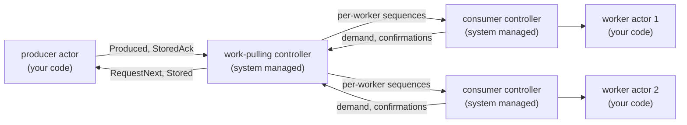

[Point-to-point](/clustering/reliable-delivery/point-to-point) serializes one flow to one consumer. The **work-pulling** pattern keeps the same reliability machinery but distributes a stream of jobs from one producer across a dynamic set of uniform workers. Each worker pulls work at its own pace through its own demand window, workers join and leave at any time, and a lost worker's unconfirmed jobs are redelivered to a surviving worker. Default **Tell** semantics are unchanged; the pattern applies only to flows you explicitly configure.

## Use cases

- **Job queues.** A dispatcher hands each job to exactly one worker from a pool, and every job survives worker loss. Slow workers pull less; fast workers pull more.
- **Elastic worker pools.** Workers are spawned and stopped with load, locally or on other cluster nodes, without reconfiguring the producer: authorized workers are discovered as they register.
- **Sharded background processing.** CPU-bound work fans out across nodes while the producer stays a single ordered intake point.

It is the wrong tool when every receiver must see every message (use [PubSub](/advanced/pubsub)) and when one consumer must process messages in order (use [point-to-point](/clustering/reliable-delivery/point-to-point): work-pulling gives no ordering across workers).

## How it works

The producer endpoint keeps the exact point-to-point producer contract, and every worker runs the exact point-to-point consumer contract. The only new piece is the system-managed work-pulling controller, which stores accepted jobs in a shared pending pool and multiplexes one point-to-point sub-flow per worker, each with its own contiguous sequence space and demand window:



Dispatch is round-robin among workers with free demand. A job unconfirmed at a worker whose binding ends, because the worker terminated, its endpoint respawned, or it violated the protocol, returns to the head of the pending pool and is re-dispatched to a surviving worker under a fresh sequence with its original `MessageID` and payload.

## Guarantees

Work-pulling delivers each job **at least once** with `MessageID` as the stable deduplication key. There is no ordering across workers: two jobs submitted back to back may complete in any order on different workers. Within one worker's sub-flow, deliveries arrive in that worker's sequence order with the same one-in-flight confirmation discipline as point-to-point.

<Warning>
A requeued job can be redelivered to a **different** worker than the one that first processed it. A per-worker in-memory `seen` map therefore cannot give exactly-once effects across the pool. When effects must be exactly-once, commit the `MessageID` together with the business mutation in one transaction against shared state, exactly as the point-to-point [deduplication guidance](/clustering/reliable-delivery/point-to-point#deduplication-and-exactly-once-effects) describes.
</Warning>

## Enabling a flow

The producer names no peer: authorized workers are discovered through registration. Each worker names the producer exactly as a point-to-point consumer does.

```go
dispatcher, err := system.Spawn(ctx, "job-dispatcher", &JobDispatcher{},
    actor.AsWorkPullingProducer())
if err != nil {
    return err
}

for i := 1; i <= 3; i++ {
    name := fmt.Sprintf("job-worker-%d", i)

    _, err = system.Spawn(ctx, name, &JobWorker{},
        actor.AsWorkPullingWorker("job-dispatcher",
            actor.WithFlowControlWindow(10)))
    if err != nil {
        return err
    }
}
```

Both options reject finite passivation: reliable endpoints are long-lived. `AsWorkPullingProducer` rejects `WithChunking` and `WithDurableQueue` in this iteration; durable work-pulling arrives with its own `DurableWorkQueue` contract, because per-message completion across workers cannot be expressed by the point-to-point cumulative watermark.

## The endpoint contracts

Your actors implement the unchanged point-to-point contracts:

- The producer answers `RequestNext` with one `Produced` and acknowledges `Stored` with `StoredAck`, as documented in [the producer contract](/clustering/reliable-delivery/point-to-point#the-producer-contract). `Stored` carries the producer-visible append sequence; worker sequences are internal to each sub-flow.
- Each worker processes `Delivery` idempotently and replies `Confirmed` after processing, never before, as documented in [the consumer contract](/clustering/reliable-delivery/point-to-point#the-consumer-contract).

Because the contracts are identical, an actor written for point-to-point runs unmodified as a work-pulling producer or worker.

## Dynamic workers and registration

Workers register with the producer's controller through their own controllers; nothing about the pool is configured on the producer. Registration is fenced: the controller accepts a worker only after verifying, through the local actor tree or the cluster registry, that the registering controller is the live consumer companion of an endpoint whose configuration names this producer. Spoofed senders, stale endpoint incarnations, and actors without a matching consumer configuration are dropped silently.

A worker's sub-flow survives its own periodic re-registrations within a producer session. A new worker controller incarnation, after an endpoint respawn or relocation, replaces the old binding: its unconfirmed jobs requeue and the fresh binding starts a new sequence space.

<Note>
A worker pool spanning nodes requires both systems in the same GoAkt cluster, exactly as point-to-point peer resolution does. A single-node pool resolves entirely through the local actor tree.
</Note>

## Knowing when a worker confirmed

`WithDeliveryConfirmation` on the producer side works unchanged: the producer receives a `DeliveryConfirmed` when a worker confirms a job, carrying the same sequence its `Stored` acknowledgement carried. The notice is best effort and repeats when a requeued job is confirmed again, so handle it idempotently by `MessageID`, as described in [Knowing when the consumer confirmed](/clustering/reliable-delivery/point-to-point#knowing-when-the-consumer-confirmed).

## Configuration

| Option                     | Side     | Default | Meaning                                                                          |
| -------------------------- | -------- | ------- | -------------------------------------------------------------------------------- |
| `WithLocalRetryInterval`   | Producer | 500ms   | `RequestNext` and `Stored` retry cadence toward the producer actor               |
| `WithDeliveryConfirmation` | Producer | off     | Tell the producer a `DeliveryConfirmed` when a worker confirms a job             |
| `WithFlowControlWindow`    | Worker   | 50      | Demand granted per request and the worker-side buffer capacity; maximum 10,000   |
| `WithResendInterval`       | Worker   | 2s      | Worker controller tick: re-registration and resend cadence                       |

## Failure handling

Failure classification is per binding. A protocol violation from an authenticated worker ends only that worker's binding: its unconfirmed jobs requeue for the surviving workers and the producer controller keeps running. A producer-side contract violation remains terminal and publishes one `ReliableDeliveryFailed` event, with the same recovery path as [point-to-point failure handling](/clustering/reliable-delivery/point-to-point#failure-handling-and-recovery).
