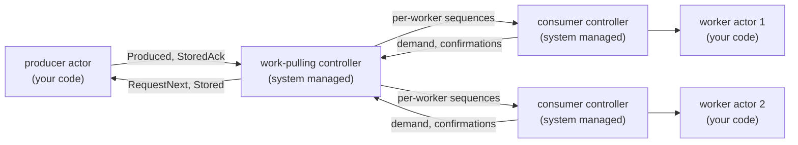

[Point-to-point](/clustering/reliable-delivery/point-to-point) serializes one flow to one consumer. The **work-pulling** pattern keeps the same reliability machinery but distributes a stream of jobs from one producer across a dynamic set of uniform workers. Each worker pulls work at its own pace through its own demand window, workers join and leave at any time, and a lost worker's unconfirmed jobs are redelivered to a surviving worker. Default **Tell** semantics are unchanged; the pattern applies only to flows you explicitly configure.

## Use cases

- **Job queues.** A dispatcher hands each job to exactly one worker from a pool, and every job survives worker loss. Slow workers pull less; fast workers pull more.
- **Elastic worker pools.** Workers are spawned and stopped with load, locally or on other cluster nodes, without reconfiguring the producer: authorized workers are discovered as they register.
- **Sharded background processing.** CPU-bound work fans out across nodes while the producer stays a single ordered intake point.

It is the wrong tool when every receiver must see every message (use [PubSub](/advanced/pubsub)) and when one consumer must process messages in order (use [point-to-point](/clustering/reliable-delivery/point-to-point): work-pulling gives no ordering across workers).

## How it works

The producer endpoint keeps the exact point-to-point producer contract, and every worker runs the exact point-to-point consumer contract. The only new piece is the system-managed work-pulling controller, which stores accepted jobs in a shared pending pool and multiplexes one point-to-point sub-flow per worker, each with its own contiguous sequence space and demand window:



Dispatch is round-robin among workers with free demand. A job unconfirmed at a worker whose binding ends, because the worker terminated, its endpoint respawned, or it violated the protocol, returns to the head of the pending pool and is re-dispatched to a surviving worker under a fresh sequence with its original `MessageID` and payload.

## Guarantees

Work-pulling delivers each job **at least once** with `MessageID` as the stable deduplication key. There is no ordering across workers: two jobs submitted back to back may complete in any order on different workers. Within one worker's sub-flow, deliveries arrive in that worker's sequence order with the same one-in-flight confirmation discipline as point-to-point.

<Warning>
A requeued job can be redelivered to a **different** worker than the one that first processed it. A per-worker in-memory `seen` map therefore cannot give exactly-once effects across the pool. When effects must be exactly-once, commit the `MessageID` together with the business mutation in one transaction against shared state, exactly as the point-to-point [deduplication guidance](/clustering/reliable-delivery/point-to-point#deduplication-and-exactly-once-effects) describes.
</Warning>

## Enabling a flow

The producer names no peer: authorized workers are discovered through registration. Each worker names the producer exactly as a point-to-point consumer does.

```go
dispatcher, err := system.Spawn(ctx, "job-dispatcher", &JobDispatcher{},
    actor.AsReliableWorkPullingProducer())
if err != nil {
    return err
}

for i := 1; i <= 3; i++ {
    name := fmt.Sprintf("job-worker-%d", i)

    _, err = system.Spawn(ctx, name, &JobWorker{},
        actor.AsReliableWorkPullingWorker("job-dispatcher",
            actor.WithReliableFlowControlWindow(10)))
    if err != nil {
        return err
    }
}
```

Both options reject finite passivation: reliable endpoints are long-lived. `AsReliableWorkPullingProducer` rejects `WithReliableChunking` and the point-to-point `WithReliableDurableQueue`; durability uses `WithReliableDurableWorkQueue` because per-message completion across workers cannot be expressed by a cumulative watermark.

## The endpoint contracts

Your actors implement the unchanged point-to-point contracts:

- The producer answers `RequestNext` with one `Produced` and acknowledges `Stored` with `StoredAck`, as documented in [the producer contract](/clustering/reliable-delivery/point-to-point#the-producer-contract). `Stored` carries the producer-visible append sequence; worker sequences are internal to each sub-flow.
- Each worker processes `Delivery` idempotently and replies `Confirmed` after processing, never before, as documented in [the consumer contract](/clustering/reliable-delivery/point-to-point#the-consumer-contract).

Because the contracts are identical, an actor written for point-to-point runs unmodified as a work-pulling producer or worker.

## Dynamic workers and registration

Workers register with the producer's controller through their own controllers; nothing about the pool is configured on the producer. Registration is fenced: the controller accepts a worker only after verifying, through the local actor tree or the cluster registry, that the registering controller is the live consumer companion of an endpoint whose configuration names this producer. Spoofed senders, stale endpoint incarnations, and actors without a matching consumer configuration are dropped silently.

A worker's sub-flow survives its own periodic re-registrations within a producer session. A new worker controller incarnation, after an endpoint respawn or relocation, replaces the old binding: its unconfirmed jobs requeue and the fresh binding starts a new sequence space.

<Note>
A worker pool spanning nodes requires both systems in the same GoAkt cluster, exactly as point-to-point peer resolution does. A single-node pool resolves entirely through the local actor tree.
</Note>

## Knowing when a worker confirmed

`WithReliableDeliveryConfirmation` on the producer side works unchanged: the producer receives a `DeliveryConfirmed` when a worker confirms a job, carrying the same sequence its `Stored` acknowledgement carried. The notice is best effort and repeats when a requeued job is confirmed again, so handle it idempotently by `MessageID`, as described in [Knowing when the consumer confirmed](/clustering/reliable-delivery/point-to-point#knowing-when-the-consumer-confirmed).

## Durable delivery

Without a durable work queue, a producer-side restart loses jobs already accepted into the controller but not yet confirmed by a worker. Worker loss alone does not need durability: the controller keeps the pending pool and each worker's unconfirmed jobs in memory and requeues them to a survivor. What memory cannot survive is the loss of the producer side itself. To survive producer crashes and relocation, attach a `DurableWorkQueue` so a fresh controller incarnation reloads accepted, unconfirmed jobs and re-dispatches them.

### When to use one

| Event                                                    | Without a durable work queue                                    | With a durable work queue                                                          |
| -------------------------------------------------------- | --------------------------------------------------------------- | ---------------------------------------------------------------------------------- |
| Worker crash, stop, respawn, or protocol violation        | Unconfirmed jobs requeue in the controller and re-dispatch      | Same: requeueing writes nothing to the queue                                       |
| Producer endpoint crash, restart, or relocation           | Every accepted job is lost, pending and dispatched alike        | Accepted, unconfirmed jobs reload and re-dispatch to whichever workers are registered |
| Retriable backend error after queue retries are exhausted | No durable operations exist                                     | The controller restarts, reloads authoritative state under a fresh epoch, and resumes |
| `ErrQueueFenced` or `ErrQueueConflict`                    | No durable operations exist                                     | Terminal: the controller publishes `ReliableDeliveryFailed` and stops              |

Attach one when an accepted job represents work that cannot simply be recreated: a payment to settle, an email to send, a customer-visible task the dispatcher already acknowledged. Leave it off when jobs are cheap to regenerate, for example a periodic scan that can be re-run or a stream the producer can replay from a source it never trims. Durability is not free: every job then costs a `Store`, an `Accept`, and a `ConfirmMessage` round trip against your backend.

```go
dispatcher, err := system.Spawn(ctx, "job-dispatcher", &JobDispatcher{},
    actor.AsReliableWorkPullingProducer(
        actor.WithReliableDurableWorkQueue(queue),
        actor.WithReliableQueueRetry(3, 100*time.Millisecond)))
```

### The queue contract

`Store` and `Accept` keep the same first-write-wins, epoch-fenced append model as point-to-point. Confirmation is per `MessageID`, because workers complete out of order and a cumulative watermark cannot express holes:

```go
type DurableWorkQueue interface {
    extension.Dependency

    // Load restores state at controller (re)start and acquires exclusive
    // writership; the returned epoch fences every earlier writer.
    Load(ctx context.Context) (WorkQueueState, QueueEpoch, error)

    // Store durably records one job, indexed by MessageID and sequence.
    // The first write for a MessageID is authoritative; retries return it.
    Store(ctx context.Context, epoch QueueEpoch, request StoreRequest) (StoreResult, error)

    // Accept records that the producer durably removed the submission from
    // its own recoverable source.
    Accept(ctx context.Context, epoch QueueEpoch, messageID string) error

    // ConfirmMessage marks one job complete after a worker confirmed it.
    ConfirmMessage(ctx context.Context, epoch QueueEpoch, messageID string) error
}
```

The contract in brief: all four operations are linearizable and safe for concurrent use; `Load` returns a new positive epoch that fences every earlier one, and a stale writer receives `ErrQueueFenced`; the first `Store` for a `MessageID` wins, so a retry returns the authoritative sequence and payload with `AlreadyStored` true and appends nothing; `Accept` and `ConfirmMessage` are no-ops when repeated and return `ErrQueueConflict` for an unknown `MessageID`; state integrity violations return `ErrQueueConflict`; any other backend error is retried under `WithReliableQueueRetry`. A job may be compacted once it is both accepted and confirmed. The full contract is documented on the interface.

### What a reload restores

`Load` returns a `WorkQueueState`: the append cursor and every accepted, not-yet-confirmed job in ascending store-sequence order, with unique `MessageID`s and non-empty payloads. Holes are normal, because worker A may confirm one job while worker B still holds an earlier store sequence. Those jobs become the new controller's pending pool and dispatch in store order to whichever workers register with the new incarnation, and the append cursor continues from `CurrentSeq`.

A reload therefore re-dispatches every job that was unconfirmed when the producer went down, including a job a worker already completed whose `ConfirmMessage` write had not landed yet, and including jobs that land on a different worker this time. This is the redelivery the [guarantees](#guarantees) above describe: dedupe by `MessageID` against shared state.

`Load` returns accepted jobs only. A job stored while the producer crashed between `Stored` and `StoredAck` is never reloaded, so the producer must be able to resubmit it: durably mark or remove the submission from your own source before replying `StoredAck`, and after a restart resubmit everything still unmarked under its original `MessageID`. First-write ownership then gives one durable sequence per job, and the controller ignores a resubmission of a job it already holds instead of dispatching it twice.

### Durable failures

`ErrQueueFenced` and `ErrQueueConflict` are terminal. The controller publishes one `ReliableDeliveryFailed` carrying `ReliableDeliveryStageStore`, `ReliableDeliveryStageAccept`, or `ReliableDeliveryStageConfirm` and stops, while the producer endpoint keeps running; recovery is operator action followed by an explicit `ReSpawn`, which acquires a fresh epoch. Any other backend error, once the `WithReliableQueueRetry` attempts are exhausted, restarts the controller instead, which reloads authoritative state. A `Load` that fails on such a restart publishes `ReliableDeliveryStageLoad`.

`WithReliableDurableWorkQueue` also registers the queue among the endpoint's dependencies so it serializes into the actor record. Register the queue type on every node eligible to host the producer, and make sure the reconstructed instance observes the same durable state from every node. `MarshalBinary` must carry reconnect configuration only, never queued jobs.

<Warning>
A durable work-pulling flow still performs `Store` plus `Accept` before the next credit, plus a `ConfirmMessage` per completed job. Durable operations run one at a time on a single lane, where the in-flight handshake takes precedence over queued confirmations, so backend latency bounds per-flow throughput. Scale with independent producer flows when needed.
</Warning>

## Configuration

| Option                     | Side     | Default | Meaning                                                                          |
| -------------------------- | -------- | ------- | -------------------------------------------------------------------------------- |
| `WithReliableRetryInterval`   | Producer | 500ms   | `RequestNext` and `Stored` retry cadence toward the producer actor               |
| `WithReliableDurableWorkQueue`     | Producer | off     | Persist accepted jobs; reload re-dispatches unconfirmed work after a crash       |
| `WithReliableQueueRetry`           | Producer | 3 / 100ms | Retry policy for durable work-queue operations                                |
| `WithReliableDeliveryConfirmation` | Producer | off     | Tell the producer a `DeliveryConfirmed` when a worker confirms a job             |
| `WithReliableFlowControlWindow`    | Worker   | 50      | Demand granted per request and the worker-side buffer capacity; maximum 10,000   |
| `WithReliableResendInterval`       | Worker   | 2s      | Worker controller tick: re-registration and resend cadence                       |

## Failure handling

Failure classification is per binding. A protocol violation from an authenticated worker ends only that worker's binding: its unconfirmed jobs requeue for the surviving workers and the producer controller keeps running. A producer-side contract violation remains terminal and publishes one `ReliableDeliveryFailed` event, with the same recovery path as [point-to-point failure handling](/clustering/reliable-delivery/point-to-point#failure-handling-and-recovery).
