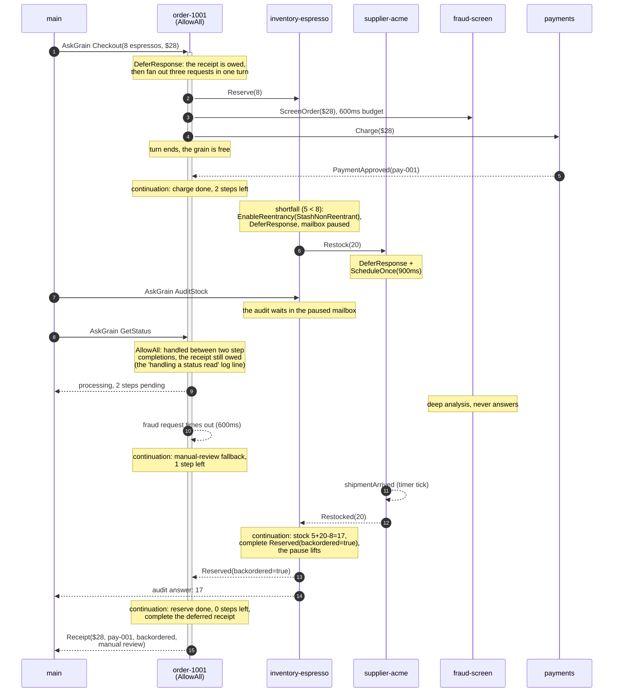

# Issue 1290: Grain Request Scheduling (Reentrancy)

Living sample for [#1290](https://github.com/Tochemey/goakt/issues/1290), non-blocking requests for grains.

## Scenario

A checkout pipeline built from three grains and two actors:

- **order-1001** (`OrderGrain`, activated with `AllowAll` reentrancy) receives a `Checkout` ask, defers the reply, and fans out three concurrent steps from a single turn: reserve stock at the inventory grain, screen the order at the fraud actor with a 600ms budget, and capture the payment at the payments actor. Whichever continuation lands last completes the deferred `Receipt`.
- **inventory-espresso** (`InventoryGrain`, activated **without** reentrancy) serves in-stock reserves as plain request/reply. On a shortfall it enables `StashNonReentrant` at runtime for that one case, defers the reserve, requests a restock from the supplier, and completes the reserve once the shipment lands. The stash pause holds every other message, so an audit issued mid-restock can only ever observe consistent stock. On the next healthy reserve it disables reentrancy again.
- **supplier-acme** (`SupplierGrain`) ships asynchronously: it defers the restock reply and completes it from a one-shot grain timer when the shipment arrives.
- **fraud-screen** (`FraudActor`) passes small orders instantly and never answers large ones within the caller's budget, so the first checkout degrades to manual review instead of failing.
- **payments** (`PaymentsActor`) approves charges instantly; its replies travel back to the requesting grain as async response envelopes.

Checkout 1 (8 espressos, $28.00) triggers the restock and the fraud timeout. Checkout 2 (2 espressos, $7.00) is the fast path: in stock, fraud passed, reentrancy disabled along the way.

## Checkout 1, step by step

Solid arrows are requests, dashed arrows are responses. The activation bar on order-1001 is the deferred checkout: open from `DeferResponse` until the receipt is completed, while the grain itself stays free between turns.



Checkout 2 is the same fan-out with every step answering immediately: the reserve is in stock (and disables the runtime reentrancy), the fraud screen passes below the threshold, and the charge captures, so the receipt completes right away.

## What it demonstrates

| Feature                                                                         | Where                                                                            |
|---------------------------------------------------------------------------------|----------------------------------------------------------------------------------|
| Grain-to-grain requests (`GrainContext.RequestGrain` + `Then`)                  | order reserves stock, inventory requests a restock                               |
| Typed responses consumed in continuations                                       | the reserve answer's backorder flag flows onto the receipt                       |
| Grain-to-actor requests (`GrainContext.RequestActor`)                           | fraud screen and payment capture                                                 |
| Fan-out and join from one turn, state mutated lock-free in continuations        | the three checkout steps joined by `finishStep`                                  |
| Deferred replies (`DeferResponse` + `GrainReply`)                               | the checkout receipt, the reserve during restock, the supplier's shipment        |
| Per-call timeout with preserved error identity (`errors.Is(ErrRequestTimeout)`) | the fraud budget and the manual-review fallback                                  |
| `AllowAll` keeps the grain serving mid-flight                                   | `GetStatus` answered with steps still pending                                    |
| `StashNonReentrant` consistency                                                 | the audit waits out the pause and reads 17, never an intermediate value          |
| Runtime toggles (`EnableReentrancy` / `DisableReentrancy`)                      | inventory enables for the shortfall case only and disables once stock is healthy |
| Deferred reply completed from a grain timer (composes with #1288)               | the supplier's `shipmentArrived` tick                                            |
| Plain paths untouched when reentrancy is off                                    | the final audit rides the legacy ask path after the disable                      |

## The pattern in a nutshell

```go
// 1. Activate the grain with reentrancy, or enable it later from a handler
//    with ctx.EnableReentrancy(...).
orderID, _ := actor.GrainOf[*OrderGrain](ctx, system, "order-1001",
    actor.WithGrainReentrancy(reentrancy.New(reentrancy.WithMode(reentrancy.AllowAll))))

// 2. Inside a handler: take ownership of the reply, request downstream, return.
func (g *OrderGrain) OnReceive(ctx *actor.GrainContext) {
    reply := ctx.DeferResponse()

    ctx.RequestGrain(inventoryID, &Reserve{Quantity: 8}).Then(func(result any, err error) {
        // 3. The continuation runs on the grain's own turn: touch grain
        //    state freely, then complete the reply. Never use ctx here.
        if err != nil {
            reply.Err(err)
            return
        }
        reply.Response(result)
    })
}
```

## Rules of thumb

- Never block in a handler. Request and return; the reply arrives on a later turn and runs your `Then` continuation.
- Issue requests from handler turns only. A continuation must not capture the `GrainContext` (it is pooled and recycled once the turn ends); it should only record grain state and complete `GrainReply` handles.
- Continuations, timeouts, and cancellations all run on the grain's own turn, so grain state needs no locking.
- Pick `AllowAll` for grains that must stay responsive while requests are in flight, `StashNonReentrant` when no other message may observe intermediate state. `WithReentrancyMode` overrides per call.
- Requests default to `DefaultGrainRequestTimeout` (5s); `WithRequestTimeout(0)` disables the timeout. Keep a finite timeout in stash mode, or a lost reply pauses the grain until shutdown.
- Error identity survives the request path: `errors.Is(err, gerrors.ErrRequestTimeout)` works in continuations, locally and across nodes.
- Reentrancy is activation-scoped configuration. A grain reactivated by a bare send comes back without it; re-activate with options or enable it from a handler.
- Internals for maintainers: [architecture/REENTRANCY.md](../../architecture/REENTRANCY.md).

## Run

```bash
go run ./playground/issue-1290
```

Expected: the fan-out log for checkout 1, the order grain logging that it handled a status read between two step completions (the message-handled-mid-flight proof), the supplier shipment completing the paused reserve, an audit of 17 only after the restock settled, a fast checkout 2 with the fraud screen passed and reentrancy disabled, a final audit of 15, and `OK`. The sample exits non-zero on any deviation.
