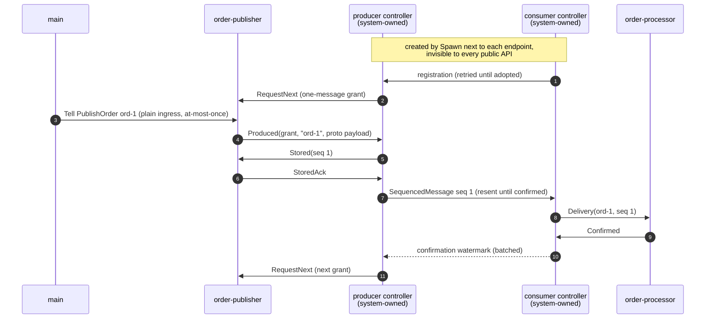

# Issue 1296: Point-to-Point Reliable Delivery

Living samples for [#1296](https://github.com/Tochemey/goakt/issues/1296): point-to-point reliable delivery between two actors, on one node (`main.go`) and across a two-node cluster (`cluster/main.go`).

## Scenario

An order publisher streams orders to an order processor with effectively-once semantics. The application spawns two ordinary actors; the actor system creates and owns a controller next to each endpoint. The controllers handle sequencing, flow control, deduplication, resends, and failure reporting. Application code only answers a small handshake:

- **order-publisher** (`AsReliableProducer`) holds the one-message `RequestNext` grant until an order is queued, spends it with one `Produced`, idempotently re-answers a retried grant with the same `Produced`, and acknowledges `Stored` with a `StoredAck`.
- **order-processor** (`AsReliableConsumer`) processes each `Delivery` idempotently, deduplicating by `MessageID`, and replies `Confirmed`.

The sample runs three acts:

1. Five orders flow end to end; the sample verifies ordered, deduplicated processing.
2. An order with a payload type the serializer does not know poisons the flow. Encoding is deterministic, so the producer controller declares the flow terminally failed, publishes one `ReliableDeliveryFailed` event on the actor system event stream, and stops. Orders submitted during the outage wait in the publisher's queue.
3. The operator remediation: `ReSpawn` of the producer endpoint recreates the controller, and the queued and new orders flow again under a fresh session.

## The handshake, step by step



## What it demonstrates

| Feature                                                                   | Where                                                                        |
|---------------------------------------------------------------------------|------------------------------------------------------------------------------|
| `AsReliableProducer` / `AsReliableConsumer` spawn options                 | the two `system.Spawn` calls in `main`                                       |
| Retry cadence tuning (`WithLocalRetryInterval`, `WithReliableResendInterval`)     | the same spawn calls                                                         |
| The producer handshake (`RequestNext`, `Produced`, `Stored`, `StoredAck`) | `OrderPublisher.Receive` and `flush`                                         |
| Idempotent re-answer of a retried grant                                   | the `lastToken`/`lastProduced` branch in `OrderPublisher.Receive`            |
| The consumer exchange (`Delivery`, `Confirmed`)                           | `OrderProcessor.Receive`                                                     |
| Idempotent processing by `MessageID`                                      | the `seen` map in `OrderProcessor`                                           |
| Controller authentication (`IsAuthorizedFor`)                             | both endpoints reject messages not sent by their own controller              |
| Terminal failure reporting (`ReliableDeliveryFailed`)                     | act two: `system.Subscribe` and the event assertions                         |
| Operator recovery (`ActorSystem.ReSpawn`)                                 | act three: the controller is recreated, queued orders resume                 |
| Ingress stays at-most-once                                                | `PublishOrder` is a plain Tell; reliability starts at the `Produced` handoff |

## The pattern in a nutshell

```go
// 1. Spawn the endpoints; the system owns the controllers.
publisher, _ := system.Spawn(ctx, "order-publisher", &OrderPublisher{},
    actor.AsReliableProducer("order-processor"))
processor, _ := system.Spawn(ctx, "order-processor", &OrderProcessor{},
    actor.AsReliableConsumer("order-publisher"))

// 2. Producer side: hold the grant, spend it with one Produced, ack Stored.
case *actor.RequestNext:
    x.request = msg          // spend it when an order is queued
case *actor.Stored:
    ack, _ := actor.NewStoredAck(msg)
    ctx.Tell(ctx.Sender(), ack)

// 3. Consumer side: process idempotently, then confirm.
case *actor.Delivery:
    process(msg)             // deduplicate by msg.MessageID()
    confirmed, _ := actor.NewConfirmed(msg)
    ctx.Tell(ctx.Sender(), confirmed)
```

## Rules of thumb

- Reliability starts at the `Produced` handoff, not at the producer's inbox. A plain Tell lost before it becomes `Produced` is not recovered; keep your own outbox if submissions must survive a publisher crash.
- Answer a retried grant whose token you already spent with the same `Produced`. A fresh message on a retried token double-consumes your queue.
- Never mutate a payload after `NewProduced`. The controller snapshots it at encode time; the consumer may see the same `Delivery` more than once.
- Processing must be idempotent. Loss or restart legitimately redelivers; deduplicate by `MessageID`.
- Reliable payloads must be protobuf messages or types with a registered serializer. An unknown payload type is a producer contract violation: the flow fails terminally instead of retrying forever.
- Watch the event stream for `ReliableDeliveryFailed`. It carries the endpoint name, controller role, failing stage, and cause; the flow stays disabled until you remediate and `ReSpawn` the endpoint.
- Reliable endpoints are long-lived: finite passivation is rejected at spawn.
- Without `WithReliableDurableQueue` the flow is in-memory, exactly like Akka's default: no loss while the producer's process lives, no survival of a process crash. Pass a `DurableProducerQueue` to add crash durability.

## Cluster sample

`cluster/main.go` runs the same flow across a two-node GoAkt cluster: the publisher on one node, the processor on another. The endpoint actors and the handshake are identical to the single-node sample; the sample demonstrates what changes with the topology:

- Both nodes join the same cluster (embedded NATS discovery). The controllers resolve each other through the cluster registry, so the spawn calls stay exactly the same as on one node.
- Every `SequencedMessage` and confirmation crosses the network through remoting. The payload is a protobuf message, so no serializer registration is needed.
- Both endpoint kinds are registered with the cluster so a surviving node could reconstruct a relocated endpoint, and the registry runs with `WithReplicaCount(2)`: with a single copy, registry state owned by a lost node disappears with it and peer resolution cannot recover.

## Run

```bash
go run ./playground/issue-1296
```

Expected: act one stores and processes ord-1 through ord-5 in order, act two logs the `ReliableDeliveryFailed` event naming the publisher, the producer role, and the unknown payload type, act three stores ord-7 and ord-8 under a fresh session (sequence numbers restart at 1) and processes them exactly once, then `OK`. The sample exits non-zero on any deviation.

```bash
go run ./playground/issue-1296/cluster
```

Expected: the node addresses are printed, ord-1 through ord-5 are stored on the producer node and processed in order on the consumer node, then `OK`. The sample exits non-zero on any deviation.
